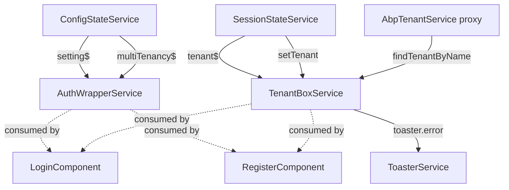

`@abp/ng.account.core` (source: `npm/ng-packs/packages/account-core/`) is a tiny package: it owns the **headless services** that drive the account experience without bundling any UI. Use it when:

- You replace `@abp/ng.account`'s `LoginComponent` (or another page) with your own and still want the same multi‑tenant box logic and "is local login enabled?" feature switch.
- You build a custom marketing site, mobile app or embedded login flow against an ABP backend.
- You want to test login/registration flows without pulling Bootstrap and the theme assets in.

```text
npm/ng-packs/packages/account-core/src/lib/
├── auth-wrapper.service.ts
└── tenant-box.service.ts
```

That's literally the whole library. Both services consume only `@abp/ng.core` and `@abp/ng.theme.shared` (the latter solely for `ToasterService`).

## `AuthWrapperService`

`auth-wrapper.service.ts` answers two questions every login/register screen has to ask:

1. Is multi‑tenancy enabled, and should the tenant box be visible for this route?
2. Is "local login" (username/password) enabled, or is the application forced to use external providers?

```ts account-core/src/lib/auth-wrapper.service.ts
@Injectable()
export class AuthWrapperService {
  readonly multiTenancy = inject(MultiTenancyService);
  private configState = inject(ConfigStateService);

  isMultiTenancyEnabled$ = this.configState.getDeep$('multiTenancy.isEnabled');

  get enableLocalLogin$(): Observable<boolean> {
    return this.configState
      .getSetting$('Abp.Account.EnableLocalLogin')
      .pipe(map(value => value?.toLowerCase() !== 'false'));
  }

  tenantBoxKey = 'Account.TenantBoxComponent';
  route: ActivatedRoute;

  get isTenantBoxVisibleForCurrentRoute() {
    return this.getMostInnerChild().data.tenantBoxVisible ?? true;
  }

  get isTenantBoxVisible() {
    return this.isTenantBoxVisibleForCurrentRoute && this.multiTenancy.isTenantBoxVisible;
  }

  constructor() {
    const injector = inject(Injector);
    this.route = injector.get(ActivatedRoute);
  }

  private getMostInnerChild() {
    let child = this.route.snapshot;
    let depth = 0;
    const depthLimit = 10;
    // … walks route.firstChild while data.tenantBoxVisible is undefined …
  }
}
```

Notable details:

- `isMultiTenancyEnabled$` reads from `ConfigStateService.getDeep$('multiTenancy.isEnabled')`, so the answer reflects the value the server reported in `ApplicationConfigurationDto`.
- `enableLocalLogin$` reads the `Abp.Account.EnableLocalLogin` setting — backend administrators can disable username/password login through the setting management screen, and the UI reacts immediately.
- `isTenantBoxVisible` combines the route's `data.tenantBoxVisible` flag with `MultiTenancyService.isTenantBoxVisible`. That's why the reset‑password route in `@abp/ng.account` sets `tenantBoxVisible: false` — the tenant is already encoded in the reset token URL.
- `tenantBoxKey = 'Account.TenantBoxComponent'` is the replaceable component key the theme uses to render the tenant switcher.

## `TenantBoxService`

`tenant-box.service.ts` encapsulates the **"Switch tenant"** modal logic that appears at the top of the login / register pages:

```ts account-core/src/lib/tenant-box.service.ts
@Injectable()
export class TenantBoxService {
  private toasterService = inject(ToasterService);
  private tenantService = inject(AbpTenantService);
  private sessionState = inject(SessionStateService);
  private configState = inject(ConfigStateService);

  currentTenant$ = this.sessionState.getTenant$();

  name?: string;
  isModalVisible!: boolean;
  modalBusy!: boolean;

  onSwitch() {
    const tenant = this.sessionState.getTenant();
    this.name = tenant?.name || '';
    this.isModalVisible = true;
  }

  save() {
    if (!this.name) {
      this.setTenant(null);
      this.isModalVisible = false;
      return;
    }

    this.modalBusy = true;
    this.tenantService
      .findTenantByName(this.name)
      .pipe(finalize(() => (this.modalBusy = false)))
      .subscribe(({ success, tenantId: id, ...tenant }) => {
        if (!success) { this.showError(); return; }
        this.setTenant({ ...tenant, id, isAvailable: true });
        this.isModalVisible = false;
      });
  }
}
```

The flow:

1. The user clicks "Switch" — `onSwitch()` opens the modal and seeds the input with the current tenant name.
2. The user types a tenant name and clicks save — `save()` calls `AbpTenantService.findTenantByName(name)`. The proxy targets `/api/abp/multi-tenancy/tenants/by-name/{name}` against the host.
3. If the backend reports `success: false`, a toast is raised via `ToasterService.error('AbpUiMultiTenancy::GivenTenantIsNotAvailable')`.
4. On success, the tenant is persisted to `SessionStateService.setTenant(...)`. The session is mirrored to local storage / cookies (see [`/angular/core`](/angular/core#sessionstateservice)), and the `__tenant` header on every future HTTP request now reflects the chosen tenant.

## Building a custom login page

Replace `@abp/ng.account`'s `LoginComponent` with a slimmer component reusing both services:

```ts custom-login.component.ts
import { Component, inject } from '@angular/core';
import { AsyncPipe } from '@angular/common';
import { ReactiveFormsModule, UntypedFormBuilder, Validators } from '@angular/forms';
import { AuthService, LocalizationPipe } from '@abp/ng.core';
import { AuthWrapperService, TenantBoxService } from '@abp/ng.account.core';

@Component({
  selector: 'app-custom-login',
  standalone: true,
  imports: [AsyncPipe, ReactiveFormsModule, LocalizationPipe],
  providers: [AuthWrapperService, TenantBoxService],
  template: `
    <ng-container *ngIf="wrapper.enableLocalLogin$ | async; else externalOnly">
      <form [formGroup]="form" (ngSubmit)="login()">
        <input formControlName="username" placeholder="{{ 'AbpAccount::UserNameOrEmailAddress' | abpLocalization }}" />
        <input formControlName="password" type="password" placeholder="{{ 'AbpAccount::Password' | abpLocalization }}" />
        <button type="submit">{{ 'AbpAccount::Login' | abpLocalization }}</button>
      </form>
    </ng-container>

    <ng-template #externalOnly>
      <button (click)="auth.navigateToLogin()">
        {{ 'AbpAccount::Login' | abpLocalization }}
      </button>
    </ng-template>

    <button *ngIf="wrapper.isTenantBoxVisible" (click)="tenantBox.onSwitch()">
      {{ (tenantBox.currentTenant$ | async)?.name ?? 'AbpUiMultiTenancy::NotSelected' | abpLocalization }}
    </button>
  `,
})
export class CustomLoginComponent {
  protected fb = inject(UntypedFormBuilder);
  protected auth = inject(AuthService);
  protected wrapper = inject(AuthWrapperService);
  protected tenantBox = inject(TenantBoxService);

  form = this.fb.group({
    username: ['', Validators.required],
    password: ['', Validators.required],
  });

  login() {
    if (this.form.invalid) return;
    this.auth.login(this.form.value).subscribe();
  }
}
```

Notice that neither component imports anything from `@abp/ng.account` — `account-core` is enough to reproduce the multi‑tenancy and local‑login behaviour.

## Why split this from `@abp/ng.account`?

The ASP.NET Core side ships a "public" Account module that exposes signup, login and tenant resolution endpoints; the management module is a separate concern. `@abp/ng.account.core` is the headless mirror of those concerns:

- `AuthWrapperService` ↔ `IFeatureChecker` + `ISettingProvider` lookups (`Abp.Account.EnableLocalLogin`).
- `TenantBoxService` ↔ `AbpTenantController` (`/api/abp/multi-tenancy/tenants/by-name/{name}`).

Keeping them in their own package means projects that don't need the standard pages can still benefit from the same logic without bundling Bootstrap CSS, the manage‑profile form components or `ExtensibleFormComponent`.

## Where the headless services come from



Both services keep zero internal state beyond the open/closed flag for the tenant modal — every piece of business data is read from `ConfigStateService` / `SessionStateService`. That makes them trivial to test (no setup beyond a stubbed `ConfigStateService`).

## Tenant resolution backend endpoint

`TenantBoxService.save()` calls `AbpTenantService.findTenantByName(name)` — a proxy from `@abp/ng.core`'s in‑tree proxies, generated from the `AbpTenantController` of the backend's multi‑tenancy module:

```ts core/src/lib/proxy/.../abp-tenant.service.ts
@Injectable({ providedIn: 'root' })
export class AbpTenantService {
  apiName = 'abp';
  protected restService = inject(RestService);

  findTenantById = (id: string, config?: Partial<Rest.Config>) =>
    this.restService.request<void, FindTenantResultDto>(
      { method: 'GET', url: `/api/abp/multi-tenancy/tenants/by-id/${id}` },
      { apiName: this.apiName, ...config },
    );

  findTenantByName = (name: string, config?: Partial<Rest.Config>) =>
    this.restService.request<void, FindTenantResultDto>(
      { method: 'GET', url: `/api/abp/multi-tenancy/tenants/by-name/${name}` },
      { apiName: this.apiName, ...config },
    );
}
```

The `FindTenantResultDto` response carries `{ success, tenantId, name, isAvailable, normalizedName }` — `success: false` means either the tenant doesn't exist or it's inactive.

## `Abp.Account.EnableLocalLogin` setting

The setting is defined by the backend Account module. Admins toggle it through the Settings page (see [`/angular/setting-management`](/angular/setting-management)). When set to `"false"`:

- `AuthWrapperService.enableLocalLogin$` emits `false`.
- The default `LoginComponent` hides the username/password form and renders the "Continue with [issuer name]" button instead.
- `RegisterComponent` redirects to the issuer's registration page.

This is the recommended switch for production multi‑tenant SaaS — disable local login so all authentication flows through the central IDS.

## Replacing the tenant box

`AuthWrapperService.tenantBoxKey = 'Account.TenantBoxComponent'` is the replaceable key. Any theme can replace the tenant box without forking the account layout:

```ts
import { ReplaceableComponentsService } from '@abp/ng.core';

constructor(replaceable: ReplaceableComponentsService) {
  replaceable.add({
    key: 'Account.TenantBoxComponent',
    component: MyCustomTenantSelectorComponent,
  });
}
```

The replacement receives no inputs — instead it injects `TenantBoxService` directly and uses its observables/methods.

## SSR caveats

- `AuthWrapperService.getMostInnerChild()` reads `ActivatedRoute.snapshot.firstChild` — that's safe on the server.
- `TenantBoxService.setTenant()` indirectly calls `SessionStateService.setTenant()`, which writes to cookies in SSR mode (see [`/angular/core#sessionstateservice`](/angular/core#sessionstateservice)). So switching the tenant during SSR works correctly and the cookie travels with subsequent HTTP requests.

## Cross‑links

<CardGroup cols={2}>
  <Card title="@abp/ng.account" href="/angular/account" icon="user">
    The default consumer — uses both services in `LoginComponent`, `RegisterComponent` and `ForgotPasswordComponent`.
  </Card>
  <Card title="@abp/ng.core" href="/angular/core" icon="cube">
    `ConfigStateService`, `SessionStateService`, `MultiTenancyService` and the `AbpTenantService` proxy live here.
  </Card>
  <Card title="@abp/ng.oauth" href="/angular/oauth" icon="key">
    Provides `AuthService.navigateToLogin()` and the actual token exchange that `login()` triggers.
  </Card>
  <Card title="Identity module" href="/modules/identity/overview" icon="users">
    The backend that owns user registration, password reset and login.
  </Card>
</CardGroup>
