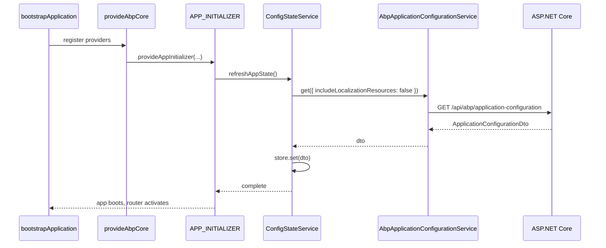

`@abp/ng.core` is the foundation that every other `@abp/ng.*` package depends on. It ships:

- `ConfigStateService` — the in‑memory store seeded by `/api/abp/application-configuration`.
- `RestService` — a thin wrapper over `HttpClient` that resolves the API base URL from `EnvironmentService`.
- The abstract `AuthService` and `AuthGuard` consumed (and replaced) by `@abp/ng.oauth`.
- Synchronous accessors for permissions, settings, features and the current session.
- HTTP interceptors that report errors, attach the multi‑tenant key and integrate the loader bar.

Source lives in `npm/ng-packs/packages/core/src/lib/` (see `services/`, `abstracts/`, `interceptors/`, `proxy/`).

## Folder layout

```text
npm/ng-packs/packages/core/src/lib/
├── abstracts/         # AuthService, AuthGuard, auth-response model, AbstractGuard
├── clients/           # ExternalHttpClient (HttpClient without ABP interceptors)
├── components/        # RouterOutletComponent, ReplaceableRouteContainerComponent
├── interceptors/      # ApiInterceptor, transfer-state, timezone
├── services/          # ConfigState, Rest, Environment, Permission, Localization, …
├── strategies/        # Content / DOM / projection strategies used by theme packages
├── tokens/            # InjectionTokens (CORE_OPTIONS, TENANT_KEY, …)
├── utils/             # InternalStore, string/jwt helpers
└── proxy/             # Generated DTOs and AbpApplicationConfigurationService
```

The public API is re‑exported from `npm/ng-packs/packages/core/src/public-api.ts`:

```ts npm/ng-packs/packages/core/src/public-api.ts
export * from './lib/abstracts';
export * from './lib/components';
export * from './lib/core.module';
export * from './lib/proxy/volo/abp/asp-net-core/mvc/application-configurations';
export * from './lib/services';
export * from './lib/strategies';
export * from './lib/tokens';
export * from './lib/interceptors';
export * from './lib/clients';
```

## Boot sequence



After this point every service that depends on configuration (permissions, settings, current user, language) returns synchronously from the store, with `*$` observable variants for components that need to react to updates.

## `ConfigStateService`

Defined in `core/src/lib/services/config-state.service.ts`:

```ts core/src/lib/services/config-state.service.ts
@Injectable({ providedIn: 'root' })
export class ConfigStateService {
  private abpConfigService = inject(AbpApplicationConfigurationService);
  private abpApplicationLocalizationService = inject(AbpApplicationLocalizationService);
  private readonly includeLocalizationResources = inject(
    INCUDE_LOCALIZATION_RESOURCES_TOKEN,
    { optional: true },
  );

  private updateSubject = new Subject<void>();
  private readonly store = new InternalStore({} as ApplicationConfigurationDto);

  refreshAppState() {
    this.updateSubject.next();
    return this.createOnUpdateStream(state => state).pipe(take(1));
  }

  getOne$<K extends keyof ApplicationConfigurationDto>(key: K) {
    return this.store.sliceState(state => state[key]);
  }

  getOne<K extends keyof ApplicationConfigurationDto>(key: K) {
    return this.store.state[key];
  }
}
```

Key surface area:

| Method | Purpose |
| --- | --- |
| `setState(dto)` | Hard‑replace the store; used by tests and SSR transfer state. |
| `refreshAppState()` | Re‑fetch the configuration DTO from the backend. |
| `refreshLocalization(lang)` | Pull only localization resources for `lang`. |
| `getOne(key)` / `getOne$(key)` | Read a top‑level slice (`auth`, `setting`, `localization`, `currentUser`, `multiTenancy`, …). |
| `getDeep(path)` / `getDeep$(path)` | Read a dot‑path (`'localization.currentCulture.cultureName'`). |
| `getSetting(name)` / `getSetting$(name)` | Read a setting value by name. |
| `getAll()` / `getAll$()` | Whole DTO. |

`InternalStore` (in `lib/utils/internal-store-utils.ts`) is a tiny RxJS‑powered store; subscribers receive only the slice they asked for.

## `AbpApplicationConfigurationService`

The proxy lives in `core/src/lib/proxy/volo/abp/asp-net-core/mvc/application-configurations/`:

```ts core/src/lib/proxy/...application-configurations/abp-application-configuration.service.ts
@Injectable({ providedIn: 'root' })
export class AbpApplicationConfigurationService {
  apiName = 'abp';
  protected restService = inject(RestService);

  get = (input?: GetApplicationConfigurationDto, config?: Partial<Rest.Config>) =>
    this.restService.request<void, ApplicationConfigurationDto>(
      {
        method: 'GET',
        url: '/api/abp/application-configuration',
        params: { includeLocalizationResources: input?.includeLocalizationResources },
      },
      { apiName: this.apiName, ...config },
    );
}
```

This is the **only** endpoint that `@abp/ng.core` hard‑codes — it's how the Angular app discovers every setting, permission grant, feature flag, current user record and tenant.

<Tip>
The matching backend controller is `AbpApplicationConfigurationController`. See [Application Configuration API](/aspnetcore/mvc-module) for the response shape.
</Tip>

## `EnvironmentService`

`environment.service.ts` exposes the runtime environment loaded by `withOptions({ environment })`:

```ts core/src/lib/services/environment.service.ts
@Injectable({ providedIn: 'root' })
export class EnvironmentService {
  private readonly store = new InternalStore({} as Environment);

  getApiUrl(key: string | undefined) {
    return mapToApiUrl(key)(this.store.state?.apis);
  }

  getIssuer() {
    const issuer = this.store.state?.oAuthConfig?.issuer;
    return mapToIssuer(issuer);
  }

  setState(environment: Environment) {
    this.store.set(environment);
  }
}
```

An environment object describes one or many APIs and the OpenID Connect issuer:

```ts environments/environment.ts
export const environment = {
  production: false,
  application: { baseUrl: 'http://localhost:4200/', name: 'MyApp' },
  oAuthConfig: {
    issuer: 'https://localhost:44305/',
    redirectUri: 'http://localhost:4200',
    clientId: 'MyApp_App',
    responseType: 'code',
    scope: 'offline_access MyApp',
  },
  apis: {
    default: {
      url: 'https://localhost:44305',
      rootNamespace: 'MyCompanyName.MyApp',
    },
    AbpAccountPublic: { url: 'https://localhost:44305', rootNamespace: 'AbpAccountPublic' },
  },
};
```

Generated proxies declare an `apiName` (`'AbpAccountPublic'`, `'identity'`, …) and `RestService` picks the matching `apis[apiName]` block, falling back to `apis.default`.

## `RestService`

`rest.service.ts` is the HTTP funnel for every generated proxy:

```ts core/src/lib/services/rest.service.ts
@Injectable({ providedIn: 'root' })
export class RestService {
  protected options = inject<ABP.Root>(CORE_OPTIONS);
  protected http = inject(HttpClient);
  protected externalHttp = inject(ExternalHttpClient);
  protected environment = inject(EnvironmentService);
  protected httpErrorReporter = inject(HttpErrorReporterService);

  request<T, R>(
    request: HttpRequest<T> | Rest.Request<T>,
    config?: Rest.Config,
    api?: string,
  ): Observable<R> {
    config = config || ({} as Rest.Config);
    api = api || this.getApiFromStore(config.apiName);
    const { method, params, ...options } = request;
    const { observe = Rest.Observe.Body, skipHandleError,
      responseType = Rest.ResponseType.JSON } = config;
    const url = this.removeDuplicateSlashes(api + request.url);

    const httpClient: HttpClient = this.getHttpClient(config.skipAddingHeader);
    return httpClient
      .request<R>(method, url, {
        observe,
        responseType: responseType as any,
        ...(params && { params: this.getParams(params, config.httpParamEncoder) }),
        ...options,
      } as any)
      .pipe(catchError(err => (skipHandleError ? throwError(() => err) : this.handleError(err))));
  }
}
```

What `RestService` does that vanilla `HttpClient` doesn't:

- Looks up the API base URL via `EnvironmentService.getApiUrl(config.apiName)`.
- Normalises duplicate slashes (`removeDuplicateSlashes`).
- Switches between the normal `HttpClient` (interceptors apply) and `ExternalHttpClient` when `config.skipAddingHeader === true`.
- Filters undefined / null query parameters honouring `sendNullsAsQueryParam`.
- Centralises error reporting through `HttpErrorReporterService` — handlers in `@abp/ng.theme.shared` subscribe to that stream to show the global error wrapper, toaster or re‑login modal.

<Tip>
The .NET counterpart to this design is the **dynamic HTTP client proxy** ([`/http/http-client`](/http/http-client)) — both pipelines target the same `RemoteServices` configuration on the server.
</Tip>

## `AuthService`

`abstracts/auth.service.ts` is intentionally a stub:

```ts core/src/lib/abstracts/auth.service.ts
@Injectable({ providedIn: 'root' })
export class AuthService implements IAuthService {
  private warningMessage() {
    console.error(
      'You should add @abp/ng-oauth packages or create your own auth packages.',
    );
  }

  init(): Promise<any> { this.warningMessage(); return Promise.resolve(undefined); }
  login(params: LoginParams): Observable<any> { this.warningMessage(); return of(undefined); }
  logout(queryParams?: Params): Observable<any> { this.warningMessage(); return of(undefined); }
  navigateToLogin(queryParams?: Params): void { }

  get isAuthenticated(): boolean { this.warningMessage(); return false; }

  loginUsingGrant(grantType: string, parameters: object, headers?: HttpHeaders) {
    return Promise.reject(new Error('not implemented'));
  }
}
```

`@abp/ng.oauth` swaps this provider with `AbpOAuthService` (see [`/angular/oauth`](/angular/oauth)). The `authGuard` and `permissionGuard` functions (in `lib/guards/`) ultimately call `AuthService.isAuthenticated` and `PermissionService.getGrantedPolicy`, which is why guards work the same regardless of the chosen auth strategy.

<Info>
The OpenID Connect side of authentication is fully described in [Authenticating with OpenID Connect](/aspnetcore/auth-openidconnect).
</Info>

## `SessionStateService`

```ts core/src/lib/services/session-state.service.ts
@Injectable({ providedIn: 'root' })
export class SessionStateService {
  private configState = inject(ConfigStateService);
  private localStorageService = inject(AbpLocalStorageService);
  private appStartedWithSSR = inject(APP_STARTED_WITH_SSR, { optional: true });
  private cookieStorageService = inject(AbpCookieStorageService);

  private readonly store = new InternalStore({} as Session.State);

  private updateLocalStorage = () => {
    if (this.appStartedWithSSR) {
      this.cookieStorageService.setItem('abpSession', JSON.stringify(this.store.state));
    } else {
      this.localStorageService.setItem('abpSession', JSON.stringify(this.store.state));
    }
  };
}
```

Persists language, tenant and per‑user UI preferences across reloads. Use `setLanguage`, `setTenant`, `getLanguage$()` and `getTenant$()` to react to changes. The store is hydrated from cookies during SSR and from local storage in the browser.

## `LocalizationService`

```ts core/src/lib/services/localization.service.ts
@Injectable({ providedIn: 'root' })
export class LocalizationService {
  private sessionState = inject(SessionStateService);
  private injector = inject(Injector);
  private configState = inject(ConfigStateService);

  get currentLang(): string {
    return this.latestLang || this.sessionState.getLanguage();
  }
  get currentLang$(): Observable<string> {
    return this.sessionState.getLanguage$();
  }
  get languageChange$(): Observable<string> {
    return this._languageChange$.asObservable();
  }
}
```

Pair it with the `abpLocalization` pipe (declared in `lib/pipes/localization.pipe.ts`):

```html
<h2>{{ 'AbpIdentity::Users' | abpLocalization }}</h2>
<p>{{ { key: 'AbpIdentity::UsersDeletionWarning', defaultValue: 'Confirm?' } | abpLocalization }}</p>
```

The key follows the ASP.NET Core localization convention — see [`/localization/overview`](/localization/overview) for resource names.

## `PermissionService`

```ts core/src/lib/services/permission.service.ts
@Injectable({ providedIn: 'root' })
export class PermissionService {
  protected configState = inject(ConfigStateService);

  getGrantedPolicy$(key: string) {
    return this.getStream().pipe(
      map(grantedPolicies => this.isPolicyGranted(key, grantedPolicies)),
    );
  }

  getGrantedPolicy(key: string | undefined) {
    const policies = this.getSnapshot();
    return this.isPolicyGranted(key, policies);
  }

  protected isPolicyGranted(key: string | undefined, grantedPolicies: Record<string, boolean>) {
    if (!key) return true;
    if (/\|\|/.test(key)) {
      const keys = key.split('||').filter(Boolean);
      return keys.length >= 2 && keys.some(k => this.getPolicy(k.trim(), grantedPolicies));
    }
    if (/&&/.test(key)) {
      const keys = key.split('&&').filter(Boolean);
      return keys.length >= 2 && keys.every(k => this.getPolicy(k.trim(), grantedPolicies));
    }
    return this.getPolicy(key, grantedPolicies);
  }
}
```

`isPolicyGranted` supports `||` and `&&` combinators inside a single key — for example `'AbpIdentity.Users.Create || AbpIdentity.Users.Update'`. The matching directive (`*abpPermission`) and the `permissionGuard` route guard both delegate here.

## Reading features and settings

There are no separate `FeatureService` or `SettingsService` injectables — `ConfigStateService` exposes the accessors directly, since features and settings are slices of the same `ApplicationConfigurationDto` already in memory:

```ts core/src/lib/services/config-state.service.ts
getFeature(key: string)             { /* reads features.values[key] */ }
getFeature$(key: string)            { /* observable variant */ }
getFeatureIsEnabled(key: string)    { /* boolean cast of getFeature */ }
getFeatureIsEnabled$(key: string)
getSetting(key: string)             { /* reads setting.values[key] */ }
getSetting$(key: string)
getSettings(keyword?: string)       { /* filtered map */ }
getSettings$(keyword?: string)
```

Inject `ConfigStateService` once and read whichever slice you need. The `*$` variants emit on every `refreshAppState()`, so components react to setting changes without manual subscriptions.

```ts
const config = inject(ConfigStateService);
if (config.getFeatureIsEnabled('Identity.UserLockout')) {
  // …
}
const pageSize = Number(config.getSetting('MyApp.DefaultPageSize') ?? 10);
```

## HTTP interceptors

`core/src/lib/interceptors/api.interceptor.ts` is the only interceptor that ships with `@abp/ng.core` by default; `@abp/ng.oauth` swaps in `OAuthApiInterceptor` to add the `Authorization` header.

```ts core/src/lib/interceptors/api.interceptor.ts
@Injectable({ providedIn: 'root' })
export class ApiInterceptor implements IApiInterceptor {
  private httpWaitService = inject(HttpWaitService);

  getAdditionalHeaders(existingHeaders?: HttpHeaders) {
    return existingHeaders || new HttpHeaders();
  }

  intercept(request: HttpRequest<any>, next: HttpHandler): Observable<HttpEvent<any>> {
    this.httpWaitService.addRequest(request);
    return next.handle(request).pipe(
      finalize(() => this.httpWaitService.deleteRequest(request)),
    );
  }
}

export interface IApiInterceptor extends HttpInterceptor {
  getAdditionalHeaders(existingHeaders?: HttpHeaders): HttpHeaders;
}
```

Sibling interceptors:

- `interceptors/timezone.interceptor.ts` — adds `Time-Zone` header.
- `interceptors/transfer-state.interceptor.ts` — reuses SSR transfer state on the client.
- `services/http-error-reporter.service.ts` — surfaces errors to subscribers; the theme layers display the matching UI.
- `services/http-wait.service.ts` — observed by the loader bar so it shows during any in‑flight ABP request.

The OAuth interceptor wraps the base behaviour:

```ts oauth/src/lib/interceptors/oauth-api.interceptor.ts
@Injectable({ providedIn: 'root' })
export class OAuthApiInterceptor implements IApiInterceptor {
  private oAuthService = inject(OAuthService);
  private sessionState = inject(SessionStateService);
  private httpWaitService = inject(HttpWaitService);
  private tenantKey = inject(TENANT_KEY);

  intercept(request: HttpRequest<any>, next: HttpHandler): Observable<HttpEvent<any>> {
    this.httpWaitService.addRequest(request);
    const isExternalRequest = request.context?.get(IS_EXTERNAL_REQUEST);
    const newRequest = isExternalRequest
      ? request
      : request.clone({ setHeaders: this.getAdditionalHeaders(request.headers) });

    return next.handle(newRequest).pipe(
      finalize(() => this.httpWaitService.deleteRequest(request)),
    );
  }
}
```

It injects:

- `Authorization: Bearer <token>` from `OAuthService.getAccessToken()`.
- The multi‑tenant header (key configurable via `TENANT_KEY`, defaults to `__tenant`).
- The current language for the request, taken from `SessionStateService`.

## `provideAbpCore` configuration

`provideAbpCore` lives in `core/src/lib/providers/core-module-config.provider.ts` and takes a list of `CoreFeature` objects (today just `withOptions`):

```ts core/src/lib/providers/core-module-config.provider.ts
export function withOptions(options = {} as ABP.Root): CoreFeature<CoreFeatureKind.Options> {
  // … sets CORE_OPTIONS to `options` and contributes provider entries
}

export function provideAbpCore(...features: CoreFeature<CoreFeatureKind>[]) {
  const providers = [
    provideHttpClient(
      withInterceptorsFromDi(),
      withXsrfConfiguration({ cookieName: 'XSRF-TOKEN', headerName: 'RequestVerificationToken' }),
      withFetch(),
      withInterceptors([transferStateInterceptor, timezoneInterceptor]),
    ),
    provideAppInitializer(async () => {
      inject(LocalizationService);
      inject(LocalStorageListenerService);
      inject(RoutesHandler);
      await getInitialData();      // pulls config + localization
    }),
    LocaleProvider,
    CookieLanguageProvider,
    AuthErrorFilterService,
    IncludeLocalizationResourcesProvider,
    { provide: TitleStrategy, useExisting: AbpTitleStrategy },
  ];

  for (const feature of features) {
    providers.push(...feature.ɵproviders);
  }

  return makeEnvironmentProviders(providers);
}
```

`getInitialData()` is the initialiser that calls `ConfigStateService.refreshAppState()` (and pulls localization resources when configured). Because it returns a promise, routes don't activate until the policy/feature/setting store is populated — guards never see an empty state.

The companion legacy NgModule wrapper (`CoreModule.forRoot(options)` in `core/src/lib/core.module.ts`) simply delegates to `provideAbpCore(withOptions(options))` so existing NgModule‑based apps keep working.

## Where to next

<CardGroup cols={2}>
  <Card title="@abp/ng.theme.shared" href="/angular/theme-shared" icon="palette">
    Subscribes to `HttpWaitService` and `HttpErrorReporterService` to render the loader bar and the error wrapper.
  </Card>
  <Card title="@abp/ng.oauth" href="/angular/oauth" icon="key">
    Replaces `AuthService` and `ApiInterceptor` to plug `angular-oauth2-oidc` into the same surface.
  </Card>
  <Card title="@abp/ng.identity" href="/angular/identity" icon="users">
    A full demonstration of how a feature module consumes `ConfigStateService`, `PermissionService` and `RestService` together.
  </Card>
  <Card title=".NET HTTP client" href="/http/http-client" icon="server">
    The server‑side mirror of `RestService` — the dynamic proxy that backends use to call other ABP services.
  </Card>
</CardGroup>
