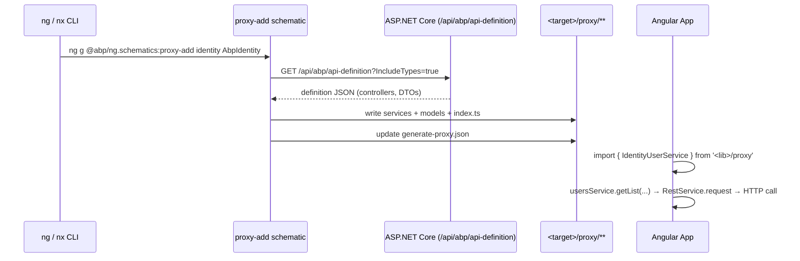

ABP ships two sibling packages that automate the day‑to‑day Angular tasks every team eventually faces:

- **`@abp/ng.schematics`** (source: `npm/ng-packs/packages/schematics/`) — a regular [Angular CLI schematics](https://angular.dev/tools/cli/schematics) collection. Runs against any Angular workspace.
- **`@abp/ng.generators`** (source: `npm/ng-packs/packages/generators/`) — an [Nx generators](https://nx.dev/extending-nx/recipes/local-generators) collection. Internally delegates to the schematics through `wrapAngularDevkitSchematic` so the two stay in sync.

```text
npm/ng-packs/packages/schematics/
├── package.json                 "schematics": "./collection.json"
├── src/collection.json
└── src/commands/
    ├── proxy-add/
    ├── proxy-index/
    ├── proxy-refresh/
    ├── proxy-remove/
    ├── api/                     generic API generator
    ├── create-lib/              scaffold an internal library
    ├── change-theme/            swap @abp/ng.theme.* + CSS imports
    └── ssr-add/                 add SSR/server build target

npm/ng-packs/packages/generators/
├── generators.json
└── src/generators/
    ├── generate-proxy/
    ├── update-version/
    └── change-theme/
```

Both packages target Angular 20 / Nx 20 (see the `package.json` `dependencies`).

## The schematics collection

`packages/schematics/src/collection.json` enumerates every command:

```json src/collection.json
{
  "schematics": {
    "proxy-add":     { "factory": "./commands/proxy-add",     "schema": "./commands/proxy-add/schema.json" },
    "proxy-index":   { "factory": "./commands/proxy-index",   "schema": "./commands/proxy-index/schema.json" },
    "proxy-refresh": { "factory": "./commands/proxy-refresh", "schema": "./commands/proxy-refresh/schema.json" },
    "proxy-remove":  { "factory": "./commands/proxy-remove",  "schema": "./commands/proxy-remove/schema.json" },
    "api":           { "factory": "./commands/api",           "schema": "./commands/api/schema.json" },
    "create-lib":    { "factory": "./commands/create-lib",    "schema": "./commands/create-lib/schema.json" },
    "change-theme":  { "factory": "./commands/change-theme",  "schema": "./commands/change-theme/schema.json" },
    "server":        { "factory": "./commands/ssr-add/server", "hidden": true,
                       "schema": "./commands/ssr-add/server/schema.json" },
    "ssr-add":       { "factory": "./commands/ssr-add",       "schema": "./commands/ssr-add/schema.json" }
  }
}
```

`packages/schematics/package.json` declares the entry point that the Angular CLI looks for:

```json package.json
{
  "name": "@abp/ng.schematics",
  "schematics": "./collection.json",
  "dependencies": {
    "@angular-devkit/core": "~20.0.0",
    "@angular-devkit/schematics": "~20.0.0",
    "@angular/cli": "~20.0.0",
    "got": "^11.5.2",
    "jsonc-parser": "^2.3.0"
  }
}
```

## Proxy generation — the headline feature

ABP backends publish a machine‑readable description of every controller at `/api/abp/api-definition` (see [HTTP API → Auto API Controllers](/aspnetcore/mvc-controllers-and-conventions)). Proxy generation turns that JSON into strongly typed Angular services and DTO interfaces.

### `nx generate @abp/ng.schematics:proxy-add`

The flagship command. Its schema (`commands/proxy-add/schema.json`) accepts:

| Argument | Position | Default | Purpose |
| --- | --- | --- | --- |
| `module` | 0 | `app` | Backend module name (`identity`, `tenantManagement`, `app`, …). |
| `apiName` | 1 | `default` | RemoteServiceName / `apiName`. Matches `environment.apis[<apiName>]`. |
| `source` | 2 | workspace default project | Source Angular project — used to resolve the API URL and root namespace. |
| `target` | 3 | workspace default project | Target Angular project for generated files. |
| `url` | 4 | API name's environment URL | Override the API definition URL. |
| `serviceType` | 5 | `application` | One of `application`, `integration`, `all`. |
| `entryPoint` | 6 | `null` | Secondary entry point inside the target project. |

Internally `proxy-add` does five things (see `src/commands/proxy-add/index.ts`):

```ts schematics/src/commands/proxy-add/index.ts
export default function (schema: GenerateProxySchema) {
  const params = removeDefaultPlaceholders(schema);
  const moduleName = params.module || 'app';

  return chain([
    async (host: Tree) => {
      const target = await resolveProject(host, params.target!);
      const targetPath = buildTargetPath(target.definition, params.entryPoint);
      const readProxyConfig = createProxyConfigReader(targetPath);
      let generated: string[] = [];

      try {
        generated = readProxyConfig(host).generated;
        const index = generated.findIndex(m => m === moduleName);
        // …
      } catch { /* first run */ }
    },
  ]);
}
```

1. **Resolves the target project** — reads `angular.json` / `project.json` to find where files should land.
2. **Reads the proxy config** — `<target>/src/lib/proxy/generate-proxy.json` keeps a list of modules already generated.
3. **Fetches the API definition** — uses `got` to hit `<url>/api/abp/api-definition?IncludeTypes=true`.
4. **Materialises the files** — for every controller it writes a `*.service.ts` plus interface files mirroring DTO/Input types under matching namespace folders.
5. **Updates `generate-proxy.json`** — appends the module to `generated` so subsequent `proxy-refresh` calls know what to re‑sync.

Run it from the workspace root:

```bash
ng add @abp/ng.schematics
ng generate @abp/ng.schematics:proxy-add identity AbpIdentity
```

Or as an Nx generator:

```bash
nx generate @abp/ng.schematics:proxy-add identity AbpIdentity
```

The generated tree mirrors how the in‑tree proxies are organised — for example, `npm/ng-packs/packages/core/src/lib/proxy/volo/abp/asp-net-core/mvc/application-configurations/` contains:

```text
abp-application-configuration.service.ts
abp-application-localization.service.ts
models.ts
index.ts
```

### Sibling proxy commands

- **`proxy-index`** — regenerates the `index.ts` re‑exports inside the proxy folder.
- **`proxy-refresh`** — re‑runs `proxy-add` for every module recorded in `generate-proxy.json`. Use after the backend adds a new endpoint.
- **`proxy-remove`** — deletes the files for one module and updates `generate-proxy.json`.
- **`api`** — generic API endpoint generator that's a building block for `proxy-add`.

The generated services are thin: every method calls `RestService.request(...)` (see [`/angular/core#restservice`](/angular/core#restservice)) with the backend's URL template, query/body model and the `apiName` declared inside the proxy.

```ts identity/proxy/.../identity-user.service.ts (generated)
@Injectable({ providedIn: 'root' })
export class IdentityUserService {
  apiName = 'AbpIdentity';
  protected restService = inject(RestService);

  get = (id: string, config?: Partial<Rest.Config>) =>
    this.restService.request<void, IdentityUserDto>(
      { method: 'GET', url: `/api/identity/users/${id}` },
      { apiName: this.apiName, ...config },
    );

  getList = (input: GetIdentityUsersInput, config?: Partial<Rest.Config>) =>
    this.restService.request<void, PagedResultDto<IdentityUserDto>>(
      {
        method: 'GET',
        url: '/api/identity/users',
        params: { /* … pagination filters … */ },
      },
      { apiName: this.apiName, ...config },
    );
}
```

## Other schematics

- **`create-lib`** — scaffolds a new internal library (a wrapper around `ng generate library`) preconfigured with the ABP secondary‑entry‑point conventions, ESLint setup and Jest harness.
- **`change-theme`** — swaps `@abp/ng.theme.basic` for `@abp/ng.theme.lepton-x` (or vice versa). It rewrites `app.config.ts` provider calls and the CSS imports in `angular.json`.
- **`ssr-add`** — adds Angular SSR + ABP's SSR plumbing: registers `provideAbpCore` for the server, contributes `ServerTokenStorageService` from `@abp/ng.oauth`, and creates the `server.ts` entry point with the matching `APP_STARTED_WITH_SSR` token.

## The Nx generators bridge

`packages/generators/generators.json` exposes three Nx generators:

```json packages/generators/generators.json
{
  "generators": {
    "generate-proxy": {
      "factory": "./src/generators/generate-proxy/generator",
      "schema": "./src/generators/generate-proxy/schema.json",
      "description": "generate-proxy generator"
    },
    "update-version": {
      "factory": "./src/generators/update-version/generator",
      "schema": "./src/generators/update-version/schema.json",
      "description": "update-version generator"
    },
    "change-theme": {
      "factory": "./src/generators/change-theme/generator",
      "schema": "./src/generators/change-theme/schema.json",
      "description": "change-theme generator"
    }
  }
}
```

Each generator delegates to the matching schematic:

```ts packages/generators/src/generators/generate-proxy/generator.ts
import { GenerateProxyGeneratorSchema } from './schema';
import { Tree } from '@nx/devkit';
import { wrapAngularDevkitSchematic } from '@nx/devkit/ngcli-adapter';

export default async function (host: Tree, schema: GenerateProxyGeneratorSchema) {
  const runAngularLibrarySchematic = wrapAngularDevkitSchematic(
    '@abp/ng.schematics', 'proxy-add',
  );

  await runAngularLibrarySchematic(host, { ...schema });

  return () => {
    console.log(`proxy added '${schema.target}`);
  };
}
```

`update-version` walks `package.json` and bumps every `@abp/ng.*` dependency to a target version; `change-theme` calls the schematic of the same name.

## How proxy generation fits into the runtime



Running the schematic is a one‑time operation per backend module; everyday development just imports the generated services and DTOs.

## `change-theme` schematic

Switching between the basic theme and Lepton X by hand requires touching:

- `package.json` — swap `@abp/ng.theme.basic` for `@abp/ng.theme.lepton-x`.
- `app.config.ts` — replace `provideThemeBasicConfig()` with `provideLeptonXBootstrapTheme()` (or the matching call for Lepton X core).
- `angular.json` — swap the CSS bundle imports.

The `change-theme` schematic automates all three:

```bash
ng generate @abp/ng.schematics:change-theme leptonx
ng generate @abp/ng.schematics:change-theme basic
```

It uses `jsonc-parser` to patch `angular.json` in place (preserving comments and trailing commas) and the `@angular-devkit/schematics` AST helpers to edit `app.config.ts`.

## `ssr-add` schematic

Adds Angular SSR with ABP‑aware plumbing:

- Wires `provideServerRendering()` and `provideClientHydration()`.
- Configures the `APP_STARTED_WITH_SSR` token so `@abp/ng.core` knows to read tenant/session from cookies.
- Registers `ServerTokenStorageService` from `@abp/ng.oauth` so the access token survives across SSR + browser bootstrap.
- Creates the `server.ts` entry point and adds the `server` build target to `angular.json`.

```bash
ng generate @abp/ng.schematics:ssr-add
```

After this you can run `ng build && node dist/server/main.js` and your ABP app is served with SSR.

## Generating proxies in a monorepo

In an Nx monorepo, the most common pattern is to keep one library per backend service and run `proxy-add` per backend module into that library:

```bash
nx generate @nx/angular:library identity --directory=libs/identity --buildable

nx generate @abp/ng.schematics:proxy-add \
  identity AbpIdentity \
  --source=apps/admin --target=identity
```

That gives you `libs/identity/src/lib/proxy/...` with the generated services and a single `nx generate :proxy-refresh` command to re‑sync them after backend changes.

## Cross‑links

<CardGroup cols={2}>
  <Card title="Auto API Controllers" href="/aspnetcore/mvc-controllers-and-conventions" icon="server">
    The backend mechanism that exposes `/api/abp/api-definition` consumed by `proxy-add`.
  </Card>
  <Card title="@abp/ng.core" href="/angular/core" icon="cube">
    `RestService`, `EnvironmentService` and `apiName` resolution — the runtime side of the generated proxies.
  </Card>
  <Card title="@abp/ng.identity" href="/angular/identity" icon="users">
    A complete example of generated proxies in action — `IdentityUserService`, `IdentityRoleService`, DTOs.
  </Card>
  <Card title="HTTP Client" href="/http/http-client" icon="server">
    The .NET dynamic proxy that mirrors this behaviour for backend-to-backend calls.
  </Card>
</CardGroup>
