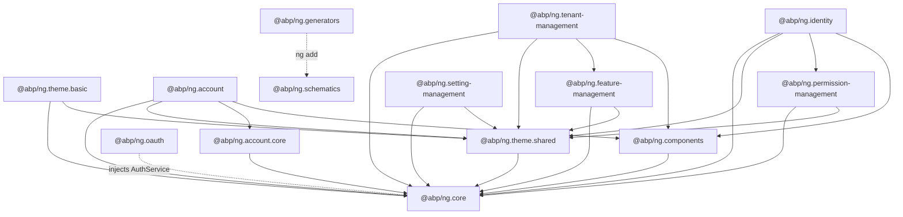
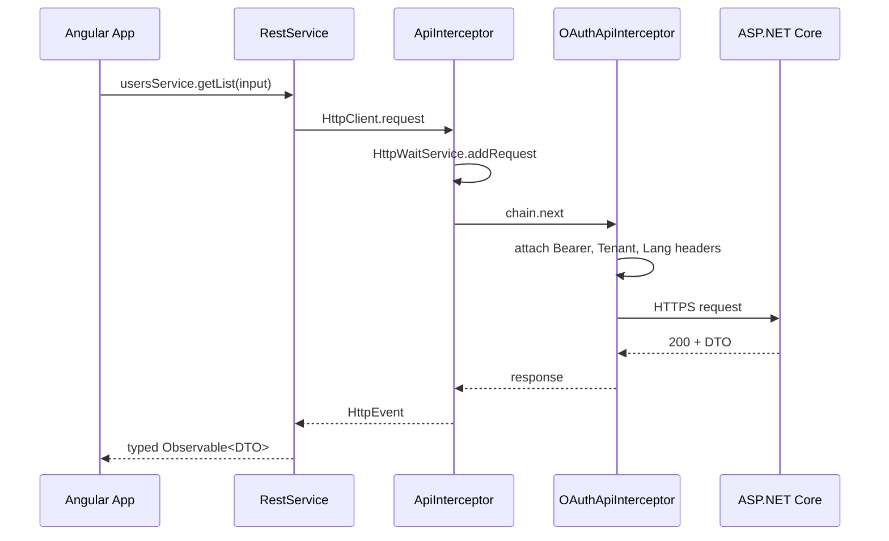

The ABP Angular UI lives in [`npm/ng-packs/`](https://github.com/abpframework/abp/tree/dev/npm/ng-packs) — an Nx workspace that publishes the family of `@abp/ng.*` packages on npm. Each package targets one concern (HTTP client, theming, identity management, OAuth, schematics) so applications can pull only what they use.

The runtime model mirrors the ASP.NET Core side:

- **Configuration** is fetched once from `/api/abp/application-configuration` at boot. The response (granted policies, settings, current user, current tenant, localization resources) seeds an in-memory store.
- **Services and pipes** read from that store, so guards (`authGuard`, `permissionGuard`), the `*abpPermission` directive, the `abpLocalization` pipe and feature checks resolve synchronously after bootstrap.
- **UI modules** (`identity`, `tenant-management`, `setting-management`, …) lazy-load their routes and rely on auto‑generated proxy services (`@abp/ng.identity/proxy`, etc.) to call the matching ASP.NET Core controllers.

<Info>
Looking for the matching backend pieces? See **[Application Configuration](/aspnetcore/mvc-module)** for the endpoint that hydrates the store, **[HTTP Client](/http/http-client)** for the request pipeline on the .NET side, and **[Identity module](/modules/identity/overview)** for the controllers `@abp/ng.identity` consumes.
</Info>

## The 14 packages

<CardGroup cols={2}>
  <Card title="@abp/ng.core" icon="cube" href="/angular/core">
    Foundation — `ConfigStateService`, `RestService`, `AuthService`, `PermissionService`, `LocalizationService`, HTTP interceptors. Source: `npm/ng-packs/packages/core/`.
  </Card>
  <Card title="@abp/ng.components" icon="grid-2" href="/angular/components">
    Reusable building blocks (`page`, `extensible`, `tree`, `chart.js`) split into secondary entry points. Source: `npm/ng-packs/packages/components/`.
  </Card>
  <Card title="@abp/ng.theme.shared" icon="palette" href="/angular/theme-shared">
    Theme‑agnostic widgets — `ModalComponent`, `ConfirmationService`, `ToasterService`, ngx-datatable defaults. Source: `npm/ng-packs/packages/theme-shared/`.
  </Card>
  <Card title="@abp/ng.theme.basic" icon="window" href="/angular/theme-basic">
    Default Bootstrap layout — `application-layout`, `account-layout`, `empty-layout`, nav items, language switcher. Source: `npm/ng-packs/packages/theme-basic/`.
  </Card>
  <Card title="@abp/ng.account" icon="user" href="/angular/account">
    Login / register / forgot‑password / manage‑profile pages. Source: `npm/ng-packs/packages/account/`.
  </Card>
  <Card title="@abp/ng.account.core" icon="user-gear" href="/angular/account-core">
    Headless account services (`AuthWrapperService`, `TenantBoxService`). Source: `npm/ng-packs/packages/account-core/`.
  </Card>
  <Card title="@abp/ng.identity" icon="users" href="/angular/identity">
    User and role management pages. Source: `npm/ng-packs/packages/identity/`.
  </Card>
  <Card title="@abp/ng.permission-management" icon="shield-check" href="/angular/permission-management">
    `PermissionManagementComponent` modal — assign permissions to a role, user or client.
  </Card>
  <Card title="@abp/ng.feature-management" icon="toggle-on" href="/angular/feature-management">
    `FeatureManagementComponent` modal — toggle features per provider.
  </Card>
  <Card title="@abp/ng.setting-management" icon="gear" href="/angular/setting-management">
    Settings page assembled by tab contributors.
  </Card>
  <Card title="@abp/ng.tenant-management" icon="building" href="/angular/tenant-management">
    Tenant CRUD, connection‑string editor, feature assignment.
  </Card>
  <Card title="@abp/ng.oauth" icon="key" href="/angular/oauth">
    `AuthCodeFlowStrategy` and `AuthPasswordFlowStrategy` built on **angular-oauth2-oidc**.
  </Card>
  <Card title="@abp/ng.schematics / @abp/ng.generators" icon="terminal" href="/angular/generators-and-schematics">
    Angular CLI schematics and Nx generators (proxy generation, theme switching, library scaffolding).
  </Card>
</CardGroup>

## Dependency graph

The graph below is taken from each package's `package.json` `peerDependencies` and source‑level imports. Solid arrows mean compile‑time dependency; dashed arrows mean the dependency is injected at runtime through providers.



Notice that **`@abp/ng.core` has zero ABP dependencies** — it only depends on Angular, RxJS and a handful of utility libraries. Every other package eventually points back at it.

## Lifecycle at a glance

1. `bootstrapApplication(AppComponent, appConfig)` runs.
2. `provideAbpCore` registers an `APP_INITIALIZER` that:
   - Pushes your `environment.ts` into `EnvironmentService` (API URLs + OIDC config).
   - Calls `ConfigStateService.refreshAppState()` which hits `/api/abp/application-configuration` and stores the response (granted policies, settings, current user, current tenant, localization resources).
3. `provideAbpOAuth` swaps the stub `AuthService` for `AbpOAuthService` and registers a second `APP_INITIALIZER` that constructs the chosen `AuthFlowStrategy` (code flow with PKCE by default).
4. `provideAbpThemeShared` mounts the loader bar, toast container, confirmation host and error wrapper.
5. `provideThemeBasicConfig` (or the matching call for any other theme) maps the `eLayoutType.*` values to concrete layout components and contributes the default nav items.
6. The Angular router activates the first route, which renders inside the matching layout.

## Bootstrapping an application

A standalone Angular application wires the packages together inside `app.config.ts`:

```ts app.config.ts
import { provideAbpCore, withOptions } from '@abp/ng.core';
import { provideAbpOAuth } from '@abp/ng.oauth';
import { provideAbpThemeShared } from '@abp/ng.theme.shared';
import { provideThemeBasicConfig } from '@abp/ng.theme.basic/config';
import { provideHttpClient, withInterceptorsFromDi } from '@angular/common/http';
import { provideRouter } from '@angular/router';
import { environment } from '../environments/environment';
import { APP_ROUTES } from './app.routes';

export const appConfig = {
  providers: [
    provideHttpClient(withInterceptorsFromDi()),
    provideRouter(APP_ROUTES),
    provideAbpCore(
      withOptions({
        environment,
        registerLocaleFn: (locale: string) =>
          import(`/@/node_modules/@angular/common/locales/${locale}.mjs`).then(m => m.default),
      }),
    ),
    provideAbpOAuth(),
    provideAbpThemeShared(),
    provideThemeBasicConfig(),
  ],
};
```

`provideAbpCore` registers the `ConfigStateService` `APP_INITIALIZER` that fetches `/api/abp/application-configuration` before the first route activates — see [`angular/core`](/angular/core) for the full sequence.

## Lazy‑loaded feature modules

Each management UI is shipped as a route definition that you mount under your shell:

```ts app.routes.ts
import { Routes } from '@angular/router';
import { authGuard, permissionGuard } from '@abp/ng.core';

export const APP_ROUTES: Routes = [
  {
    path: 'account',
    loadChildren: () => import('@abp/ng.account').then(m => m.createRoutes()),
  },
  {
    path: 'identity',
    loadChildren: () => import('@abp/ng.identity').then(m => m.createRoutes()),
    canActivate: [authGuard, permissionGuard],
  },
  {
    path: 'tenant-management',
    loadChildren: () =>
      import('@abp/ng.tenant-management').then(m => m.createRoutes()),
  },
  {
    path: 'setting-management',
    loadChildren: () =>
      import('@abp/ng.setting-management').then(m => m.createRoutes()),
  },
];
```

The `createRoutes()` factory pattern is consistent across every feature package (see `account.routes.ts`, `identity.routes.ts`, `tenant-management.routes.ts`, …). Each factory accepts a `*ConfigOptions` object so you can plug in entity action contributors, prop contributors and form prop contributors — those mechanisms are documented per package.

## How packages talk to the backend



`RestService.request` (defined in `core/src/lib/services/rest.service.ts`) is the funnel for every generated proxy — the request URL is prefixed with the configured API base (`EnvironmentService.getApiUrl`), then sent through `HttpClient`, where the registered interceptors apply.

## Replaceable components

Every page rendered by an ABP UI module is wrapped in `ReplaceableRouteContainerComponent` (from `@abp/ng.core`). That container reads two pieces of route data — a unique component **key** and a default component — and renders whichever component is currently registered under that key in `ReplaceableComponentsService`.

This is what lets you swap any page in the package set without forking:

```ts
import { Component } from '@angular/core';
import { ReplaceableComponentsService } from '@abp/ng.core';
import { eIdentityComponents } from '@abp/ng.identity';
import { MyCustomUsersComponent } from './my-custom-users.component';

@Component({ /* … */ })
export class AppComponent {
  constructor(replaceable: ReplaceableComponentsService) {
    replaceable.add({
      key: eIdentityComponents.Users,
      component: MyCustomUsersComponent,
    });
  }
}
```

Every package exports an `e<Module>Components` enum (e.g. `eAccountComponents.Login`, `eIdentityComponents.Roles`, `eTenantManagementComponents.Tenants`) listing the available keys.

## Extensions — the contributor pattern

The CRUD‑heavy modules (`@abp/ng.identity`, `@abp/ng.tenant-management`, `@abp/ng.account`) take it one step further: instead of forcing you to fork their page, they expose five **contributor tokens** that let you extend the underlying data:

| Token suffix | What it customises |
| --- | --- |
| `ENTITY_PROP_CONTRIBUTORS` | Columns rendered by the entity table. |
| `ENTITY_ACTION_CONTRIBUTORS` | Per‑row action menu items (Edit, Delete, Permissions, …). |
| `TOOLBAR_ACTION_CONTRIBUTORS` | Page toolbar buttons (e.g. "New User"). |
| `CREATE_FORM_PROP_CONTRIBUTORS` | Fields in the create modal. |
| `EDIT_FORM_PROP_CONTRIBUTORS` | Fields in the edit modal. |

```ts
import { ePropType } from '@abp/ng.components/extensible';
import { eIdentityComponents, IdentityConfigOptions } from '@abp/ng.identity';

export const identityConfig: IdentityConfigOptions = {
  entityPropContributors: {
    [eIdentityComponents.Users]: [
      propList => propList.addTail({
        type: ePropType.String,
        name: 'department',
        displayName: 'MyProject::Department',
        sortable: true,
      } as any),
    ],
  },
};
```

The contributor list is consumed by an `extensionsResolver` route resolver (see `identityExtensionsResolver` in `npm/ng-packs/packages/identity/src/lib/resolvers/`) before the page renders, so the extra column is on screen from the first paint.

## Replaceable templates

When a host page wants to expose more than just one component, it uses the `*abpReplaceableTemplate` structural directive:

```html
<abp-permission-management
  *abpReplaceableTemplate="{
    inputs: { providerName: 'U', providerKey, entityDisplayName },
    outputs: { visibleChange: onClose.bind(this) },
    componentKey: ePermissionManagementComponents.PermissionManagement
  }"
  [(visible)]="modalVisible"
  [providerName]="'U'"
  [providerKey]="providerKey">
</abp-permission-management>
```

A replacement registered under the same key receives the same inputs/outputs — perfect for modals embedded inside other pages (permission management inside identity, feature management inside tenant management).

## Where to go next

<CardGroup cols={2}>
  <Card title="Start with the core" href="/angular/core" icon="cube">
    Understand `ConfigStateService`, `RestService`, guards and interceptors before exploring feature modules.
  </Card>
  <Card title="Pick a theme" href="/angular/theme-basic" icon="palette">
    `@abp/ng.theme.basic` ships the layouts, nav and toolbar that the management modules render into.
  </Card>
  <Card title="Wire up OAuth" href="/angular/oauth" icon="key">
    `@abp/ng.oauth` plugs `angular-oauth2-oidc` into `AuthService` and replaces `ApiInterceptor` with a Bearer‑aware variant.
  </Card>
  <Card title="Generate proxies" href="/angular/generators-and-schematics" icon="terminal">
    `nx generate @abp/ng.schematics:proxy-add` consumes ABP's `/api/abp/api-definition` endpoint to produce strongly typed services.
  </Card>
</CardGroup>
