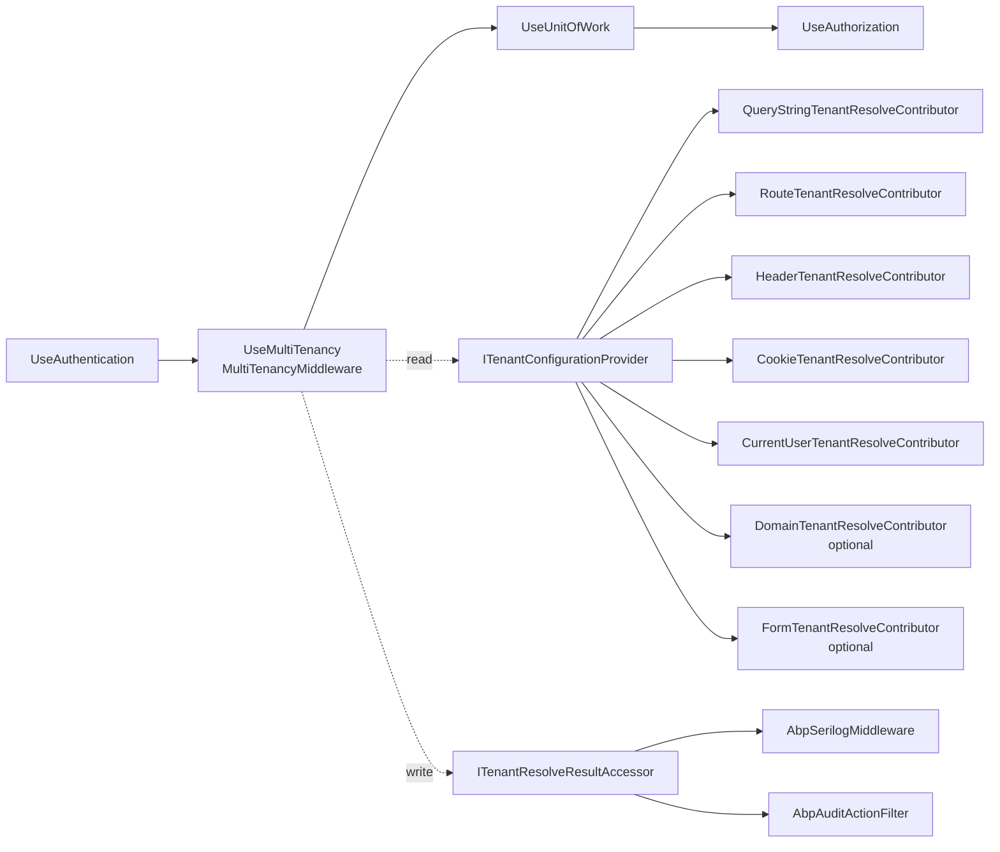

`Volo.Abp.AspNetCore.MultiTenancy` makes the framework's `ICurrentTenant` work in ASP.NET Core. It installs `MultiTenancyMiddleware` between authentication and the unit‑of‑work middleware, registers six HTTP‑aware tenant resolve contributors with `AbpTenantResolveOptions`, and renders a friendly error page when tenant resolution fails.

Module path: `framework/src/Volo.Abp.AspNetCore.MultiTenancy/Volo/Abp/AspNetCore/MultiTenancy/`.

## Module wire‑up

```csharp
// AbpAspNetCoreMultiTenancyModule.cs
[DependsOn(
    typeof(AbpMultiTenancyModule),
    typeof(AbpAspNetCoreModule)
    )]
public class AbpAspNetCoreMultiTenancyModule : AbpModule
{
    public override void ConfigureServices(ServiceConfigurationContext context)
    {
        Configure<AbpTenantResolveOptions>(options =>
        {
            options.TenantResolvers.Add(new QueryStringTenantResolveContributor());
            options.TenantResolvers.Add(new RouteTenantResolveContributor());
            options.TenantResolvers.Add(new HeaderTenantResolveContributor());
            options.TenantResolvers.Add(new CookieTenantResolveContributor());
        });
    }
}
```

`AbpMultiTenancyModule` already adds the non‑HTTP resolvers (`CurrentUserTenantResolveContributor`, `AsyncLocalCurrentTenantAccessor` plumbing); this module adds the four that are meaningful only for an HTTP request. `DomainTenantResolveContributor` (also in this package) is opt‑in — see below.

## The middleware

```csharp
// MultiTenancyMiddleware.cs
public class MultiTenancyMiddleware : AbpMiddlewareBase, ITransientDependency
{
    public ILogger<MultiTenancyMiddleware> Logger { get; set; }

    private readonly ITenantConfigurationProvider _tenantConfigurationProvider;
    private readonly ICurrentTenant _currentTenant;
    private readonly AbpAspNetCoreMultiTenancyOptions _options;
    private readonly ITenantResolveResultAccessor _tenantResolveResultAccessor;

    public async override Task InvokeAsync(HttpContext context, RequestDelegate next)
    {
        TenantConfiguration? tenant = null;
        try
        {
            tenant = await _tenantConfigurationProvider.GetAsync(saveResolveResult: true);
        }
        catch (Exception e)
        {
            Logger.LogException(e);
            if (await _options.MultiTenancyMiddlewareErrorPageBuilder(context, e))
            {
                return;
            }
        }

        if (tenant?.Id != _currentTenant.Id)
        {
            using (_currentTenant.Change(tenant?.Id, tenant?.Name))
            {
                if (_tenantResolveResultAccessor.Result != null &&
                    _tenantResolveResultAccessor.Result.AppliedResolvers
                        .Contains(QueryStringTenantResolveContributor.ContributorName))
                {
                    AbpMultiTenancyCookieHelper.SetTenantCookie(context, _currentTenant.Id, _options.TenantKey);
                }

                var requestCulture = await TryGetRequestCultureAsync(context);
                if (requestCulture != null)
                {
                    CultureInfo.CurrentCulture = requestCulture.Culture;
                    CultureInfo.CurrentUICulture = requestCulture.UICulture;
                    AbpRequestCultureCookieHelper.SetCultureCookie(context, requestCulture);
                    context.Items[AbpRequestLocalizationMiddleware.HttpContextItemName] = true;
                }

                await next(context);
            }
        }
        else
        {
            await next(context);
        }
    }
}
```

Notice three behaviours:

<Steps>
  <Step title="Resolve and look up the tenant configuration">
    `ITenantConfigurationProvider.GetAsync(saveResolveResult: true)` runs every contributor in `AbpTenantResolveOptions.TenantResolvers` until one returns a tenant id, then looks up the `TenantConfiguration` from `ITenantStore`. `saveResolveResult: true` stashes the result into the `ITenantResolveResultAccessor` for downstream code (the Serilog enricher, audit log entries, etc.).
  </Step>
  <Step title="Activate the tenant scope">
    `using (_currentTenant.Change(tenant?.Id, tenant?.Name))` swaps the async‑local current tenant. Every downstream middleware and the action filter pipeline runs with the resolved tenant active.
  </Step>
  <Step title="Persist a tenant cookie when chosen via query string">
    If the request switched tenants via `?__tenant=acme`, the middleware writes the tenant cookie so subsequent requests stick to the same tenant without the query parameter.
  </Step>
  <Step title="Apply the tenant's default language">
    If `Volo.Abp.AspNetCore.RequestLocalization` did not already pick a culture, the middleware honors the tenant's `Abp.Localization.DefaultLanguage` setting.
  </Step>
</Steps>

### Where it sits in the pipeline



Authentication runs first because `CurrentUserTenantResolveContributor` reads `tenantid` from the signed‑in user's claims; that path must already have run.

## Tenant resolve contributors

The package ships seven HTTP‑aware contributors plus one base class:

| File | Contributor | Where it reads from | Default order |
| --- | --- | --- | --- |
| `QueryStringTenantResolveContributor.cs` | `__tenant` query string | `?__tenant=acme` | 1 |
| `RouteTenantResolveContributor.cs` | `{__tenant}` route value | `/api/{__tenant}/...` | 2 |
| `HeaderTenantResolveContributor.cs` | `__tenant` HTTP header | curl / SPA requests | 3 |
| `CookieTenantResolveContributor.cs` | `__tenant` cookie | Browser stickiness | 4 |
| `DomainTenantResolveContributor.cs` | Host name | `{0}.myapp.com` style multi‑tenancy | opt‑in |
| `FormTenantResolveContributor.cs` | Posted form field | Sign‑in form select | opt‑in |
| `HttpTenantResolveContributorBase.cs` | (abstract) | Common HTTP helpers | — |

The key name used by every HTTP contributor defaults to `AbpAspNetCoreMultiTenancyOptions.TenantKey` (= `TenantResolverConsts.DefaultTenantKey`, i.e. `"__tenant"`). Override it once and all five HTTP contributors honor the new key.

### Adding `DomainTenantResolveContributor`

```csharp
Configure<AbpTenantResolveOptions>(options =>
{
    options.TenantResolvers.Insert(0, new DomainTenantResolveContributor("{0}.myapp.com"));
});
```

The `{0}` placeholder receives the tenant name. For `acme.myapp.com` the contributor returns `name = "acme"`, and `ITenantStore` resolves the configuration.

## `AbpAspNetCoreMultiTenancyOptions`

```csharp
// AbpAspNetCoreMultiTenancyOptions.cs (excerpts)
public class AbpAspNetCoreMultiTenancyOptions
{
    /// <summary>Default: <see cref="TenantResolverConsts.DefaultTenantKey"/>.</summary>
    public string TenantKey { get; set; }

    /// <summary>Return true to stop the pipeline, false to continue.</summary>
    public Func<HttpContext, Exception, Task<bool>> MultiTenancyMiddlewareErrorPageBuilder { get; set; }

    public AbpAspNetCoreMultiTenancyOptions()
    {
        TenantKey = TenantResolverConsts.DefaultTenantKey;
        MultiTenancyMiddlewareErrorPageBuilder = async (context, exception) =>
        {
            // ... (see below)
        };
    }
}
```

The default `MultiTenancyMiddlewareErrorPageBuilder`:

1. If the only applied resolver was `CurrentUserTenantResolveContributor` (i.e. the user's claim refers to a tenant that no longer exists / is inactive) and authentication was cookie‑based, signs the user out so the cookie clears.
2. If the request had a `__tenant` cookie, deletes it.
3. Appends the `Abp-Tenant-Resolve-Error` response header with the exception message.
4. For AJAX requests writes a `RemoteServiceErrorResponse` JSON body with status 404.
5. For browser GETs to a non‑AJAX endpoint, redirects back to the same URL (now without the bad tenant cookie).
6. Otherwise renders the `MultiTenancyMiddlewareErrorPage` Razor view stored under `Views/`.

To customize:

```csharp
Configure<AbpAspNetCoreMultiTenancyOptions>(options =>
{
    options.MultiTenancyMiddlewareErrorPageBuilder = async (ctx, ex) =>
    {
        ctx.Response.Redirect("/tenant-not-found?error=" + Uri.EscapeDataString(ex.Message));
        return true;
    };
});
```

## `AbpMultiTenancyCookieHelper`

Helper class that writes/clears the `__tenant` cookie with `HttpOnly`, `SameSite=Lax`, no expiry (session cookie). Used by `MultiTenancyMiddleware` to persist a query‑string switch and by the error page to clear a stale cookie.

## MVC UI extension — `Volo.Abp.AspNetCore.Mvc.UI.MultiTenancy`

The MVC UI package at `framework/src/Volo.Abp.AspNetCore.Mvc.UI.MultiTenancy/` adds the tenant switcher dropdown in the toolbar:

```csharp
// AbpAspNetCoreMvcUiMultiTenancyModule.cs (excerpt)
[DependsOn(
    typeof(AbpAspNetCoreMvcUiThemeSharedModule),
    typeof(AbpAspNetCoreMultiTenancyModule)
    )]
public class AbpAspNetCoreMvcUiMultiTenancyModule : AbpModule
{
    public override void PreConfigureServices(ServiceConfigurationContext context)
    {
        PreConfigure<AbpMvcDataAnnotationsLocalizationOptions>(options =>
        {
            options.AddAssemblyResource(
                typeof(AbpUiMultiTenancyResource),
                typeof(AbpAspNetCoreMvcUiMultiTenancyModule).Assembly
            );
        });

        PreConfigure<IMvcBuilder>(mvcBuilder =>
        {
            // contributes to MVC builder
        });
    }
}
```

It registers its own toolbar contributor that renders the "Switch Tenant" dropdown, plus the localization resource `AbpUiMultiTenancyResource`. The historical helper `MvcAbpTenantResolveContributor` referred to the toolbar's POST‑back path that updates the tenant cookie via a route handler; current versions reuse `CookieTenantResolveContributor` + `AbpMultiTenancyCookieHelper.SetTenantCookie` from the JavaScript switcher itself.

## Cross‑links

<CardGroup cols={2}>
  <Card title="Current tenant" icon="building-user" href="/tenancy/multi-tenancy-core">
    The `ICurrentTenant` whose scope `MultiTenancyMiddleware` opens for the rest of the request.
  </Card>
  <Card title="Data filter" icon="filter" href="/tenancy/data-filtering">
    `IDataFilter<IMultiTenant>` and `MultiTenantEntityHelper` that read `ICurrentTenant.Id` inside the EF Core query interceptor.
  </Card>
  <Card title="HTTP request pipeline" icon="route" href="/flows/http-request-pipeline">
    Where this middleware sits relative to authentication, unit of work and authorization.
  </Card>
  <Card title="Host module" icon="server" href="/aspnetcore/host-module">
    `AbpMiddlewareBase` and the `Volo.Abp.AspNetCore.Middleware` namespace shared by every ABP middleware.
  </Card>
</CardGroup>
