`Volo.Abp.AspNetCore.Mvc` is the largest package in this group. It turns ASP.NET Core MVC into an ABP‑aware MVC: every action goes through the framework's anti‑forgery, validation, audit, exception, unit‑of‑work, global‑feature and authorization filters; every controller has the `AbpController` conveniences; application services are exposed as REST endpoints via the `AbpServiceConvention`; remote call descriptions are pushed through `IApiDescriptionModelProvider` into the dynamic client proxies.

This page is a map of the package. Each subfolder under `framework/src/Volo.Abp.AspNetCore.Mvc/Volo/Abp/AspNetCore/Mvc/` has dedicated detail elsewhere or is summarized inline.

## Module definition

`framework/src/Volo.Abp.AspNetCore.Mvc/Volo/Abp/AspNetCore/Mvc/AbpAspNetCoreMvcModule.cs`:

```csharp
[DependsOn(
    typeof(AbpAspNetCoreModule),
    typeof(AbpLocalizationModule),
    typeof(AbpApiVersioningAbstractionsModule),
    typeof(AbpAspNetCoreMvcContractsModule),
    typeof(AbpUiNavigationModule),
    typeof(AbpGlobalFeaturesModule),
    typeof(AbpDddApplicationModule),
    typeof(AbpJsonSystemTextJsonModule)
    )]
public class AbpAspNetCoreMvcModule : AbpModule
{
    public override void PreConfigureServices(ServiceConfigurationContext context)
    {
        DynamicProxyIgnoreTypes.Add<ControllerBase>();
        DynamicProxyIgnoreTypes.Add<PageModel>();
        DynamicProxyIgnoreTypes.Add<ViewComponent>();

        context.Services.AddConventionalRegistrar(new AbpAspNetCoreMvcConventionalRegistrar());
    }

    public override void ConfigureServices(ServiceConfigurationContext context)
    {
        Configure<AbpApiDescriptionModelOptions>(options =>
        {
            options.IgnoredInterfaces.AddIfNotContains(typeof(IAsyncActionFilter));
            options.IgnoredInterfaces.AddIfNotContains(typeof(IFilterMetadata));
            options.IgnoredInterfaces.AddIfNotContains(typeof(IActionFilter));
        });

        Configure<AbpRemoteServiceApiDescriptionProviderOptions>(options =>
        {
            var statusCodes = new List<int>
            {
                (int) HttpStatusCode.Forbidden,
                (int) HttpStatusCode.Unauthorized,
                (int) HttpStatusCode.BadRequest,
                (int) HttpStatusCode.NotFound,
                (int) HttpStatusCode.NotImplemented,
                (int) HttpStatusCode.InternalServerError
            };
            options.SupportedResponseTypes.AddIfNotContains(statusCodes.Select(statusCode => new ApiResponseType
            {
                Type = typeof(RemoteServiceErrorResponse),
                StatusCode = statusCode
            }));
        });
        // ... PostConfigure<AbpAspNetCoreMvcOptions> sets MinifyGeneratedScript based on IsProduction()
    }
}
```

`DynamicProxyIgnoreTypes.Add<ControllerBase>()` prevents Castle DynamicProxy from intercepting controllers — those go through MVC's own action‑filter pipeline instead. The conventional registrar then registers every `Controller` / `ControllerBase` / `PageModel` / `ViewComponent` discovered in modules as a transient DI service.

## `AbpAspNetCoreMvcOptions`

`framework/src/Volo.Abp.AspNetCore.Mvc/Volo/Abp/AspNetCore/Mvc/AbpAspNetCoreMvcOptions.cs`:

```csharp
public class AbpAspNetCoreMvcOptions
{
    public bool? MinifyGeneratedScript { get; set; }
    public AbpConventionalControllerOptions ConventionalControllers { get; }
    public HashSet<Type> IgnoredControllersOnModelExclusion { get; }
    public HashSet<Type> ControllersToRemove { get; }
    public bool ExposeIntegrationServices { get; set; } = false;
    public bool ExposeClientProxyServices { get; set; } = false;
    public bool AutoModelValidation { get; set; }
    public bool ChangeControllerModelApiExplorerGroupName { get; set; }

    public AbpAspNetCoreMvcOptions()
    {
        ConventionalControllers = new AbpConventionalControllerOptions();
        IgnoredControllersOnModelExclusion = new HashSet<Type>();
        ControllersToRemove = new HashSet<Type>();
        AutoModelValidation = true;
        ChangeControllerModelApiExplorerGroupName = true;
    }
}
```

The most commonly configured property is `ConventionalControllers` — see [/aspnetcore/mvc-controllers-and-conventions](/aspnetcore/mvc-controllers-and-conventions). `ExposeIntegrationServices` and `ExposeClientProxyServices` toggle whether internal integration / client‑proxy controllers are visible to ApiExplorer.

## `AbpMvcOptionsExtensions.AddAbp(...)`

The internal extension at `framework/src/Volo.Abp.AspNetCore.Mvc/Volo/Abp/AspNetCore/Mvc/AbpMvcOptionsExtensions.cs` is the centerpiece — it composes every MVC sub‑system into Microsoft's `MvcOptions`:

```csharp
internal static class AbpMvcOptionsExtensions
{
    public static void AddAbp(this MvcOptions options, IServiceCollection services)
    {
        AddConventions(options, services);     // AbpServiceConventionWrapper
        AddActionFilters(options);              // GlobalFeatureActionFilter, AbpValidationActionFilter,
                                                // AbpAuditActionFilter, AbpExceptionFilter, AbpUowActionFilter,
                                                // AbpFeatureActionFilter, AbpNoContentActionFilter
        AddPageFilters(options);                // Razor Pages equivalents
        AddModelBinders(options);               // AbpDateTimeModelBinderProvider etc.
        AddMetadataProviders(options, services);
        AddFormatters(options);                 // RemoteStreamContentOutputFormatter + ObjectToInferredTypesConverter removal
    }
}
```

This single method is what makes ASP.NET Core MVC "ABP‑aware". It is invoked by `AbpAspNetCoreMvcModule` via `services.AddControllers(o => o.AddAbp(services))` and by the Razor / Razor Pages variants.

## Action descriptor provider

`framework/src/Volo.Abp.AspNetCore.Mvc/Volo/Abp/AspNetCore/Mvc/AbpMvcActionDescriptorProvider.cs` is an `IActionDescriptorProvider` that runs after the default one (`Order = 1`) and adds metadata to each `ControllerActionDescriptor`. Most notably it pushes the `MethodInfo` and DTO types so the dynamic JavaScript / TypeScript proxy generator can find them at runtime.

## Application configuration endpoint

The `ApplicationConfigurations/` subfolder ships the universal `/api/abp/application-configuration` and `/api/abp/application-localization` endpoints. The client SDK (`@abp/ng.core`, `@abp/utils`) calls them on app start to hydrate the SPA with permissions, features, settings, current user and localization texts.

| File | Role |
| --- | --- |
| `AbpApplicationConfigurationAppService.cs` | The application service implementing `IAbpApplicationConfigurationAppService`. Returns the `ApplicationConfigurationDto`. |
| `AbpApplicationConfigurationController.cs` | MVC controller exposing the service over HTTP. |
| `AbpApplicationConfigurationScriptController.cs` | Emits a JS file that bootstraps `abp.appConfig` for MVC SSR pages. |
| `AbpApplicationLocalizationAppService.cs` / `AbpApplicationLocalizationController.cs` | Separate endpoint that returns the localization texts only (used as a lazy second call by SPAs that want to defer texts). |
| `ObjectExtending/` | Plugs the object‑extension manager into the response so custom properties on `IdentityUserDto` etc. are advertised to clients. |

The DTO shape — `ApplicationConfigurationDto` — is defined in the contracts package at `framework/src/Volo.Abp.AspNetCore.Mvc.Contracts/Volo/Abp/AspNetCore/Mvc/ApplicationConfigurations/ApplicationConfigurationDto.cs`. It contains nested DTOs for `AuthConfigurationDto`, `CurrentUserDto`, `FeaturesConfigurationDto`, `SettingConfigurationDto`, `CurrentTenantDto`, `LocalizationConfigurationDto`, `MultiTenancyInfoDto`, `PermissionsDto` and `ObjectExtensionsDto`.

The historical name `ApplicationConfigurationsDto` (plural) referred to the same payload before the contract was split out — recent versions use the singular `ApplicationConfigurationModel`/`Dto` pair.

## Subfolders — what each one does

```mermaid
graph TD
    Mod[AbpAspNetCoreMvcModule] --> Conv[Conventions/]
    Mod --> AntiF[AntiForgery/]
    Mod --> Apx[ApiExploring/]
    Mod --> Apc[ApplicationConfigurations/]
    Mod --> Aud[Auditing/]
    Mod --> Aut[Authentication/]
    Mod --> Cnt[ContentFormatters/]
    Mod --> Ex[ExceptionHandling/]
    Mod --> Feat[Features/]
    Mod --> GFeat[GlobalFeatures/]
    Mod --> MB[ModelBinding/]
    Mod --> Px[ProxyScripting/]
    Mod --> Resp[Response/]
    Mod --> Uow[Uow/]
    Mod --> Val[Validation/]
    Mod --> Ver[Versioning/]
    Mod --> Vf[ViewFeatures/]
```



| Subfolder | What's there | Notes |
| --- | --- | --- |
| `AntiForgery/` | `AbpAutoValidateAntiforgeryTokenAttribute`, `AbpValidateAntiForgeryTokenAttribute`, `AspNetCoreAbpAntiForgeryManager`, `AbpAntiForgeryOptions`, `IAbpAntiForgeryManager`. | Replaces ASP.NET Core's CSRF defaults with one that respects `IsEnabled`/`Cookie.Name` set by `AbpAntiForgeryOptions`. |
| `ApiExploring/` | `AbpApiDefinitionController`, `AbpRemoteServiceApiDescriptionProvider`, `AbpServiceProxyScriptController`, `ServiceProxyGenerationModel`. | Powers the `/api/abp/api-definition` endpoint used by the dynamic C#/JS proxies. |
| `ApplicationConfigurations/` | See table above. | The universal config endpoint. |
| `Auditing/` | `AbpAuditActionFilter`, `AbpAuditPageFilter`. | Routes action invocations into `IAuditingManager`. |
| `Authentication/` | Filters that surface `[Authorize]` failures as `RemoteServiceErrorResponse`. | Pairs with `Volo.Abp.AspNetCore.Authentication.*`. |
| `ContentFormatters/` | `RemoteStreamContentOutputFormatter`. | Streams `IRemoteStreamContent` (file downloads) without buffering. |
| `Conventions/` | `AbpServiceConvention`, `AbpConventionalControllerOptions`, `ConventionalControllerSetting`. | See [/aspnetcore/mvc-controllers-and-conventions](/aspnetcore/mvc-controllers-and-conventions). |
| `DataAnnotations/` | `AbpDataAnnotationsLocalizationOptions`, validation message localization. | Hooks `IStringLocalizer` into `[Required]` / `[StringLength]` error messages. |
| `DependencyInjection/` | `AbpAspNetCoreMvcConventionalRegistrar`. | Discovers controllers, pages, view components and registers them as transient DI services. |
| `ExceptionHandling/` | `AbpExceptionFilter`, `AbpExceptionPageFilter`. | Convert exceptions to `RemoteServiceErrorResponse` for JSON requests and to error pages for browser requests. |
| `Features/` | `AbpFeatureActionFilter`. | Enforces `[RequiresFeature("MyFeature")]` declarations. |
| `GlobalFeatures/` | `GlobalFeatureActionFilter`. | Disables controllers whose owning module declares a turned‑off global feature. |
| `Infrastructure/` | `AbpServiceBasedControllerActivator`, `AbpViewComponentInvokerFactory`. | Replace MVC's default activators with DI‑resolving variants. |
| `Json/` | `AbpHybridJsonInputFormatter`. | Lets the framework swap between System.Text.Json and Newtonsoft.Json. |
| `Libs/` | `AbpMvcLibsService`, `AbpMvcLibsOptions`, `AbpMvcLibsErrorPage.cshtml`. | The famous "Bower libraries not installed — run abp install-libs" error page. |
| `Localization/` | `AbpRequestLocalizationOptions`, `AbpRequestLocalizationMiddleware`. | Reads culture cookies and headers. |
| `ModelBinding/` | Custom binders for `DateOnly`, `TimeOnly`, `Date`, `JObject`, etc. | Compensates for missing or inconsistent default binders. |
| `ProxyScripting/` | `AbpServiceProxyScriptController` plus the jQuery generator. | Exposes `/Abp/ServiceProxyScript?type=jquery&group=...`. |
| `Response/` | `AbpNoContentActionFilter`. | Returns 204 from void/Task actions instead of 200‑empty. |
| `Uow/` | `AbpUowActionFilter`, `AbpUowPageFilter`. | Wraps each action call in an `IUnitOfWork` from `IUnitOfWorkManager`. |
| `Validation/` | `AbpValidationActionFilter`, `ModelStateValidator`, `IModelStateValidator`. | Routes `ModelState` errors and FluentValidation results through `RemoteServiceErrorResponse`. |
| `Versioning/` | `HttpContextRequestedApiVersion`. | Bridges `Asp.Versioning` to ABP's `IApiVersionInfoProvider`. |
| `ViewFeatures/` | Razor view helpers and tag helpers. | Glue between Razor + ABP's localization / authorization / UoW. |

## Cross‑links

<CardGroup cols={2}>
  <Card title="Controllers & Conventions" icon="route" href="/aspnetcore/mvc-controllers-and-conventions">
    `AbpController`, `[RemoteService]`, `AbpServiceConvention` — the auto‑API‑from‑application‑service mechanism.
  </Card>
  <Card title="Host module" icon="server" href="/aspnetcore/host-module">
    Where `AbpAspNetCoreMvcModule` gets its `AbpMiddlewareBase`, `IUnitOfWorkManager`, auditing and exception infrastructure.
  </Card>
  <Card title="Request pipeline" icon="diagram-project" href="/flows/http-request-pipeline">
    The end‑to‑end flow through `AddAbp(MvcOptions)` and the action filters listed above.
  </Card>
  <Card title="Modularity" icon="cube" href="/core/modularity">
    How `[DependsOn]` chains turn `AbpAspNetCoreMvcModule` into a transitive dependency of every Web host.
  </Card>
</CardGroup>
