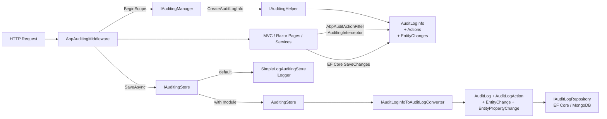

Abp's auditing system records *who* did *what*, *when*, and *with which result* for every HTTP request, application service call, or interceptor‑wrapped operation in your system. It is composed of two layers:

1. **`Volo.Abp.Auditing`** — the in‑process pipeline: it captures the current user, tenant, correlation id, action info, entity changes, and exceptions into an `AuditLogInfo` graph.
2. **`Volo.Abp.AuditLogging`** — an optional persistence module that converts that graph into the `AuditLog` aggregate root and stores it via EF Core or MongoDB.

These two layers are connected through the `IAuditingStore` contract. The framework ships a `SimpleLogAuditingStore` (writes to `ILogger`) so auditing is fully functional even without the persistence module; adding `Volo.Abp.AuditLogging.Domain` replaces it with the database‑backed `AuditingStore`.

<Info>
This section documents the framework packages under `framework/src/Volo.Abp.Auditing` (and its `.Contracts`) plus the `modules/audit-logging/` module. Everything described below is wired up automatically by the standard application templates — you only need to read it when you want to customize what is captured, ignore noisy URLs, or plug in a custom store.
</Info>

## The pipeline at a glance

The diagram below traces a single HTTP request through the auditing pipeline. The middleware opens an ambient scope, downstream interceptors and filters append actions and entity changes, and on the way out the scope is converted to an `AuditLog` entity and persisted.



The shape of `AuditLogInfo` mirrors the database schema: every property captured in the in‑memory model has a column in the `AbpAuditLogs` table or the equivalent MongoDB document.

## What gets audited?

By default the framework audits **any class that participates in the auditing convention**:

- Application services that derive from `ApplicationService` (covered by `AuditingInterceptor`).
- MVC controllers and Razor Pages handlers (covered by `AbpAuditActionFilter` and `AbpAuditPageFilter` from `Volo.Abp.AspNetCore.Mvc`).
- Anything explicitly decorated with `[Audited]`.
- Anything whose class implements `IAuditingEnabled`.

Classes or methods marked `[DisableAuditing]` are excluded. The decision is centralized in `IAuditingHelper.ShouldSaveAudit(...)`.

## Two ways in, one model

Whether the request is an HTTP call or a background job, the entry point produces an `AuditLogInfo`. The framework ships two main entry points:

<CardGroup cols={2}>
<Card title="HTTP requests" icon="globe">
`AbpAuditingMiddleware` opens an `IAuditingManager.BeginScope()` per request and saves it on the way out. Cross‑link: [/aspnetcore/mvc-module](/aspnetcore/mvc-module).
</Card>
<Card title="Application services" icon="layer-group">
`AuditingInterceptor` participates in the dynamic proxy chain — it can append an `AuditLogActionInfo` to the *current* scope, or open a new scope when called outside an HTTP request.
</Card>
</CardGroup>

## Read the rest of this section

<CardGroup cols={2}>
<Card title="Auditing Module" icon="screwdriver-wrench" href="/auditing/auditing-module">
The framework primitives: `AbpAuditingOptions`, `IAuditingHelper`, `IAuditingManager`, `AuditLogInfo`, `IAuditingStore`, `[Audited]` and `[DisableAuditing]`, plus the `IAuditPropertySetter` that stamps `CreationTime` / `LastModificationTime` / `DeleterId` on entities.
</Card>
<Card title="Audit Logging Module" icon="database" href="/auditing/audit-logging-module">
The optional persistence module: the `AuditLog` aggregate root, `AuditLogAction`, `EntityChange`, `EntityPropertyChange`, `IAuditLogRepository`, the `AuditLogInfoToAuditLogConverter`, and the EF Core and MongoDB providers.
</Card>
<Card title="Pre‑built UI module" icon="chart-line" href="/modules/audit-logging/overview">
A drop‑in admin UI (MVC, Blazor, Angular) for browsing audit logs and entity history. Built on top of the primitives documented here.
</Card>
<Card title="Entity Framework Core" icon="diagram-project" href="/data/entityframeworkcore">
Where entity change detection actually happens — the EF Core integration calls `IAuditingHelper.IsEntityHistoryEnabled` and emits `EntityChangeInfo` per modified entity.
</Card>
<Card title="Security helpers" icon="shield-halved" href="/security/security-helpers">
`ICurrentUser`, `ICurrentTenant`, `ICurrentClient`, and the impersonation helpers used by `AuditingHelper.CreateAuditLogInfo()` to stamp the *who* of each entry.
</Card>
<Card title="ASP.NET Core overview" icon="server" href="/aspnetcore/overview">
Where the middleware sits in the pipeline and how it cooperates with the unit of work and exception handling middleware.
</Card>
</CardGroup>

## Anatomy of an audit log entry

When the middleware completes, the in‑memory `AuditLogInfo` looks roughly like the tree below. Each level corresponds to a separate entity once persisted by the Audit Logging module.

```text
AuditLogInfo
├── ApplicationName, UserId, UserName, TenantId, TenantName
├── ImpersonatorUserId, ImpersonatorTenantId
├── ClientId, ClientIpAddress, CorrelationId, BrowserInfo
├── HttpMethod, HttpStatusCode, Url
├── ExecutionTime, ExecutionDuration
├── Actions: List<AuditLogActionInfo>
│   └── ServiceName, MethodName, Parameters, ExecutionTime, ExecutionDuration
├── EntityChanges: List<EntityChangeInfo>
│   ├── ChangeType (Created / Updated / Deleted), EntityTypeFullName, EntityId
│   └── PropertyChanges: List<EntityPropertyChangeInfo>
│       └── PropertyName, OriginalValue, NewValue, PropertyTypeFullName
├── Exceptions: List<Exception>
└── Comments, ExtraProperties
```

The model is defined in `framework/src/Volo.Abp.Auditing/Volo/Abp/Auditing/AuditLogInfo.cs`:

```csharp
[Serializable]
public class AuditLogInfo : IHasExtraProperties
{
    public string? ApplicationName { get; set; }
    public Guid? UserId { get; set; }
    public string? UserName { get; set; }
    public Guid? TenantId { get; set; }
    public string? TenantName { get; set; }
    public Guid? ImpersonatorUserId { get; set; }
    public Guid? ImpersonatorTenantId { get; set; }
    public DateTime ExecutionTime { get; set; }
    public int ExecutionDuration { get; set; }
    public string? ClientId { get; set; }
    public string? CorrelationId { get; set; }
    public string? ClientIpAddress { get; set; }
    public string? BrowserInfo { get; set; }
    public string? HttpMethod { get; set; }
    public int? HttpStatusCode { get; set; }
    public string? Url { get; set; }

    public List<AuditLogActionInfo> Actions { get; set; }
    public List<Exception> Exceptions { get; }
    public List<EntityChangeInfo> EntityChanges { get; }
    public List<string> Comments { get; set; }
    public ExtraPropertyDictionary ExtraProperties { get; }
}
```

## Where each piece lives

| File | Role |
| --- | --- |
| `framework/src/Volo.Abp.AspNetCore/Volo/Abp/AspNetCore/Auditing/AbpAuditingMiddleware.cs` | HTTP entry point; opens the ambient audit scope and triggers save. |
| `framework/src/Volo.Abp.Auditing/Volo/Abp/Auditing/AuditingManager.cs` | Owns the ambient `IAuditLogScope` and the `IAuditLogSaveHandle`. |
| `framework/src/Volo.Abp.Auditing/Volo/Abp/Auditing/AuditingHelper.cs` | Decides what should be audited and builds `AuditLogInfo` / `AuditLogActionInfo`. |
| `framework/src/Volo.Abp.Auditing/Volo/Abp/Auditing/AbpAuditingOptions.cs` | Tunables: `IsEnabled`, `IsEnabledForGetRequests`, `IgnoredTypes`, `EntityHistorySelectors`, … |
| `framework/src/Volo.Abp.Auditing/Volo/Abp/Auditing/SimpleLogAuditingStore.cs` | Default `IAuditingStore` — writes via `ILogger`. |
| `modules/audit-logging/src/Volo.Abp.AuditLogging.Domain/...` | The persistence aggregate (`AuditLog`) and the replacement `AuditingStore`. |

## A minimal end‑to‑end trace

To make the flow concrete, here is what happens for `POST /api/app/product`:

<Steps>
<Step title="Middleware enters">
`AbpAuditingMiddleware.InvokeAsync` checks `AuditingOptions.IsEnabled` and the configured ignored URLs. If auditing is on, it calls `_auditingManager.BeginScope()`.
</Step>
<Step title="Scope captures the context">
`AuditingManager` asks `IAuditingHelper.CreateAuditLogInfo()`, which fills in `UserId`, `TenantId`, `ClientId`, `CorrelationId`, `ExecutionTime`, and runs any `Pre` contributors.
</Step>
<Step title="MVC filter records the action">
`AbpAuditActionFilter` ([/aspnetcore/mvc-module](/aspnetcore/mvc-module)) calls `IAuditingHelper.CreateAuditLogAction(...)` to build an `AuditLogActionInfo` with the controller `ServiceName`, `MethodName`, serialized `Parameters`, and duration. It appends it to `_auditingManager.Current.Log.Actions`.
</Step>
<Step title="EF Core records entity changes">
During `SaveChangesAsync`, the EF Core integration ([/data/entityframeworkcore](/data/entityframeworkcore)) checks `IAuditingHelper.IsEntityHistoryEnabled(entityType)` for each modified entry and appends `EntityChangeInfo` entries with per‑property `OriginalValue` / `NewValue` deltas.
</Step>
<Step title="Middleware saves on exit">
On the way out the middleware decides via `ShouldWriteAuditLogAsync` whether to persist (e.g. skip anonymous GETs unless `AlwaysLogOnException` triggers), then calls `saveHandle.SaveAsync()` which forwards to `IAuditingStore.SaveAsync(auditInfo)`.
</Step>
<Step title="Store persists or logs">
If the Audit Logging module is installed, `AuditingStore` resolves an `IAuditLogInfoToAuditLogConverter`, builds an `AuditLog` aggregate and inserts via `IAuditLogRepository` in a dedicated `UnitOfWork`. Otherwise `SimpleLogAuditingStore` just calls `Logger.LogInformation(auditInfo.ToString())`.
</Step>
</Steps>

## The HTTP entry point in detail

The middleware is small enough to read end to end. The annotated excerpt below shows where each option from `AbpAuditingOptions` actually fires (file: `framework/src/Volo.Abp.AspNetCore/Volo/Abp/AspNetCore/Auditing/AbpAuditingMiddleware.cs`):

```csharp
public async override Task InvokeAsync(HttpContext context, RequestDelegate next)
{
    if (await ShouldSkipAsync(context, next) || !AuditingOptions.IsEnabled || IsIgnoredUrl(context))
    {
        await next(context);
        return;
    }

    var hasError = false;
    using (var saveHandle = _auditingManager.BeginScope())
    {
        try
        {
            await next(context);

            if (_auditingManager.Current!.Log.Exceptions.Any())
            {
                hasError = true;
            }
        }
        catch (Exception ex)
        {
            hasError = true;
            if (!_auditingManager.Current!.Log.Exceptions.Contains(ex))
                _auditingManager.Current.Log.Exceptions.Add(ex);
            throw;
        }
        finally
        {
            if (await ShouldWriteAuditLogAsync(_auditingManager.Current!.Log, context, hasError))
            {
                // Flush the business UoW first so EntityChange entries get populated
                if (UnitOfWorkManager.Current != null)
                {
                    try { await UnitOfWorkManager.Current.SaveChangesAsync(); }
                    catch (Exception ex)
                    {
                        if (!_auditingManager.Current.Log.Exceptions.Contains(ex))
                            _auditingManager.Current.Log.Exceptions.Add(ex);
                    }
                }
                await saveHandle.SaveAsync();
            }
        }
    }
}
```

The `ShouldWriteAuditLogAsync` predicate is the policy gate. It is short and worth knowing by heart:

```csharp
private async Task<bool> ShouldWriteAuditLogAsync(
    AuditLogInfo auditLogInfo, HttpContext httpContext, bool hasError)
{
    foreach (var selector in AuditingOptions.AlwaysLogSelectors)
        if (await selector(auditLogInfo)) return true;

    if (AuditingOptions.AlwaysLogOnException && hasError) return true;

    if (!AuditingOptions.IsEnabledForAnonymousUsers && !CurrentUser.IsAuthenticated)
        return false;

    if (!AuditingOptions.IsEnabledForGetRequests &&
        (string.Equals(httpContext.Request.Method, HttpMethods.Get, StringComparison.OrdinalIgnoreCase) ||
         string.Equals(httpContext.Request.Method, HttpMethods.Head, StringComparison.OrdinalIgnoreCase)))
        return false;

    return true;
}
```

In other words: `AlwaysLogSelectors` win, exceptions force a write when `AlwaysLogOnException` is set, anonymous and `GET` traffic are filtered out by default, and everything else is persisted.

## Configuration cheat sheet

The most common things you tune in `AbpAuditingOptions` from your domain module:

```csharp
Configure<AbpAuditingOptions>(options =>
{
    // 1. Identify the writer (useful when several services share one DB)
    options.ApplicationName = "MyApp.HttpApi.Host";

    // 2. Include read traffic if you really want it
    options.IsEnabledForGetRequests = false;

    // 3. Skip noisy types from action parameter serialization
    options.IgnoredTypes.Add(typeof(IFormFile));

    // 4. Record property history for the domain entities you care about
    options.EntityHistorySelectors.Add<Product>();
    options.EntityHistorySelectors.Add<Order>();

    // 5. Always log specific HTTP verbs on a specific URL
    options.AlwaysLogSelectors.Add(info =>
        Task.FromResult(info.Url?.StartsWith("/api/admin/") == true));
});
```

Anything finer‑grained than that (per‑service opt‑in, per‑property opt‑out) is driven by the `[Audited]` and `[DisableAuditing]` attributes — see [Auditing Module](/auditing/auditing-module) for the rules.

## What ends up in the database

When the [Audit Logging module](/auditing/audit-logging-module) is installed, every `AuditLogInfo` becomes one row in `AbpAuditLogs` (or one document in the equivalent MongoDB collection) plus child rows in `AbpAuditLogActions`, `AbpEntityChanges`, and `AbpEntityPropertyChanges`. The shape of those tables mirrors the `AuditLogInfo` graph above exactly, with two notable transformations:

- `Exceptions` are converted to `RemoteServiceErrorInfo` (respecting `AbpExceptionHandlingOptions`) and JSON‑serialized into a single column.
- `EntityTypeFullName` and `PropertyTypeFullName` are passed through `AuditLogEntityTypeFullNameConverter` to drop assembly‑qualified noise.

Both are documented in detail on the [Audit Logging module](/auditing/audit-logging-module) page.

## Common questions

<AccordionGroup>
<Accordion title="Why is my GET request not in the log?">
Because `IsEnabledForGetRequests` defaults to `false`. Either flip it, add the URL to `AlwaysLogSelectors`, or trigger an exception (which is always logged when `AlwaysLogOnException` is on).
</Accordion>
<Accordion title="Where are entity property diffs computed?">
In the EF Core integration — see [/data/entityframeworkcore](/data/entityframeworkcore). It calls `IAuditingHelper.IsEntityHistoryEnabled(entityType)`, walks `ChangeTracker.Entries`, builds `EntityChangeInfo` per modified entry with one `EntityPropertyChangeInfo` per modified property, and appends them to the ambient scope.
</Accordion>
<Accordion title="How do I add a custom column?">
Either add to `AuditLogInfo.ExtraProperties` from an `AuditLogContributor` (forward‑compatible, no schema change) or derive from `AuditLog` and override the converter — both options are covered on the [Audit Logging module](/auditing/audit-logging-module) page.
</Accordion>
<Accordion title="Can I audit without the database module?">
Yes — `SimpleLogAuditingStore` is registered with `[Dependency(TryRegister = true)]`, so the framework module alone gives you `ILogger`‑based audit output. The persistence module just swaps in a different `IAuditingStore`.
</Accordion>
</AccordionGroup>

## Next steps

<CardGroup cols={2}>
<Card title="Configure the framework layer" icon="sliders" href="/auditing/auditing-module">
Learn how to tune `AbpAuditingOptions`, write a custom `IAuditingStore`, or plug in `AuditLogContributor`s.
</Card>
<Card title="Persist with EF Core / MongoDB" icon="database" href="/auditing/audit-logging-module">
Configure the `Volo.Abp.AuditLogging` module, customize the `AuditLog` aggregate, and query history via `IAuditLogRepository`.
</Card>
</CardGroup>
