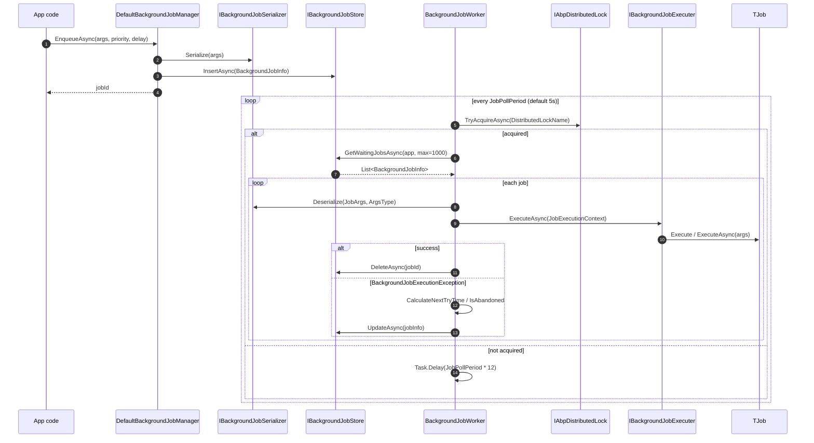

The `Volo.Abp.BackgroundJobs` package is the **default in‑process provider**. It implements `IBackgroundJobManager` by writing a row to `IBackgroundJobStore`, and it runs a single `BackgroundJobWorker` (an `AsyncPeriodicBackgroundWorkerBase`) that polls the store on a configurable interval and executes any waiting jobs.

This is the provider you get out of the box when you reference `Volo.Abp.BackgroundJobs`. Pair it with one of the store modules (`Volo.Abp.BackgroundJobs.EntityFrameworkCore` or `Volo.Abp.BackgroundJobs.MongoDB`, both in `modules/background-jobs/`) and it becomes a durable, retryable, multi‑host‑safe job system without any extra infrastructure.

<Info>
Source: `framework/src/Volo.Abp.BackgroundJobs/Volo/Abp/BackgroundJobs/`. Module class is `AbpBackgroundJobsModule`. The persistence stores live in `modules/background-jobs/`.
</Info>

## End‑to‑end flow



The single distributed lock around each polling pass is what makes this provider **safe to run in multiple host instances**: only one node executes jobs at a time, the others sleep through twelve poll periods before trying again.

## DefaultBackgroundJobManager — the producer

```csharp
// framework/src/Volo.Abp.BackgroundJobs/Volo/Abp/BackgroundJobs/DefaultBackgroundJobManager.cs
[Dependency(ReplaceServices = true)]
public class DefaultBackgroundJobManager : IBackgroundJobManager, ITransientDependency
{
    protected IClock Clock { get; }
    protected IBackgroundJobSerializer Serializer { get; }
    protected IGuidGenerator GuidGenerator { get; }
    protected IBackgroundJobStore Store { get; }
    protected IOptions<AbpBackgroundJobOptions> BackgroundJobOptions { get; }
    protected IOptions<AbpBackgroundJobWorkerOptions> BackgroundJobWorkerOptions { get; }

    public virtual async Task<string> EnqueueAsync<TArgs>(
        TArgs args,
        BackgroundJobPriority priority = BackgroundJobPriority.Normal,
        TimeSpan? delay = null)
    {
        var jobName = BackgroundJobOptions.Value.GetBackgroundJobName(typeof(TArgs));
        var jobId = await EnqueueAsync(jobName, args!, priority, delay);
        return jobId.ToString();
    }

    protected virtual async Task<Guid> EnqueueAsync(
        string jobName,
        object args,
        BackgroundJobPriority priority = BackgroundJobPriority.Normal,
        TimeSpan? delay = null)
    {
        var jobInfo = new BackgroundJobInfo
        {
            Id = GuidGenerator.Create(),
            ApplicationName = BackgroundJobWorkerOptions.Value.ApplicationName,
            JobName = jobName,
            JobArgs = Serializer.Serialize(args),
            Priority = priority,
            CreationTime = Clock.Now,
            NextTryTime = Clock.Now
        };

        if (delay.HasValue)
        {
            jobInfo.NextTryTime = Clock.Now.Add(delay.Value);
        }

        await Store.InsertAsync(jobInfo);

        return jobInfo.Id;
    }
}
```

Key details:

- The job *name* is computed from the args type via `AbpBackgroundJobOptions.GetBackgroundJobName` — by default, that is `BackgroundJobNameAttribute.GetName`.
- A *new* `Guid` is allocated via `IGuidGenerator` so it is sequential and friendly to clustered indexes.
- `ApplicationName` comes from `AbpBackgroundJobWorkerOptions.ApplicationName` — when null, every host in the deployment competes for the same row set; when set, only matching workers will pick up the job.
- The job is serialised eagerly with `IBackgroundJobSerializer` (default: `JsonBackgroundJobSerializer`). Whatever you pass as `TArgs` must round‑trip through JSON.

## BackgroundJobInfo — the persisted row

```csharp
// framework/src/Volo.Abp.BackgroundJobs/Volo/Abp/BackgroundJobs/BackgroundJobInfo.cs
public class BackgroundJobInfo
{
    public Guid Id { get; set; }
    public virtual string? ApplicationName { get; set; }
    public virtual string JobName { get; set; } = default!;
    public virtual string JobArgs { get; set; } = default!;
    public virtual short TryCount { get; set; }
    public virtual DateTime CreationTime { get; set; }
    public virtual DateTime NextTryTime { get; set; }
    public virtual DateTime? LastTryTime { get; set; }
    public virtual bool IsAbandoned { get; set; }
    public virtual BackgroundJobPriority Priority { get; set; }
}
```

Both the EF Core and MongoDB store modules map this class one‑to‑one to a `AbpBackgroundJobs` table / collection.

## IBackgroundJobStore — the storage abstraction

`Volo.Abp.BackgroundJobs` ships an `InMemoryBackgroundJobStore` (singleton, jobs are lost on restart) and defines the abstraction the persistence modules implement.

```csharp
// framework/src/Volo.Abp.BackgroundJobs/Volo/Abp/BackgroundJobs/IBackgroundJobStore.cs
public interface IBackgroundJobStore
{
    Task<BackgroundJobInfo> FindAsync(Guid jobId);
    Task InsertAsync(BackgroundJobInfo jobInfo);

    /// <summary>
    /// Gets waiting jobs. It should get jobs based on these:
    /// Conditions: ApplicationName is applicationName And !IsAbandoned And NextTryTime &lt;= Clock.Now.
    /// Order by: Priority DESC, TryCount ASC, NextTryTime ASC.
    /// Maximum result: <paramref name="maxResultCount"/>.
    /// </summary>
    Task<List<BackgroundJobInfo>> GetWaitingJobsAsync(string? applicationName, int maxResultCount);

    Task DeleteAsync(Guid jobId);
    Task UpdateAsync(BackgroundJobInfo jobInfo);
}
```

The contract on `GetWaitingJobsAsync` is non‑trivial: every implementation must filter by `ApplicationName`, exclude abandoned jobs, only return jobs whose `NextTryTime` is now or earlier, and sort by priority descending. The EF Core implementation issues a single SQL `SELECT TOP N ...` matching that order.

The in‑memory store provides a reference implementation:

```csharp
// InMemoryBackgroundJobStore.cs
public class InMemoryBackgroundJobStore : IBackgroundJobStore, ISingletonDependency
{
    private readonly ConcurrentDictionary<Guid, BackgroundJobInfo> _jobs;

    public virtual Task<List<BackgroundJobInfo>> GetWaitingJobsAsync(
        string? applicationName, int maxResultCount)
    {
        var waitingJobs = _jobs.Values
            .Where(t => t.ApplicationName == applicationName)
            .Where(t => !t.IsAbandoned && t.NextTryTime <= Clock.Now)
            .OrderByDescending(t => t.Priority)
            .ThenBy(t => t.TryCount)
            .ThenBy(t => t.NextTryTime)
            .Take(maxResultCount)
            .ToList();

        return Task.FromResult(waitingJobs);
    }

    public virtual Task UpdateAsync(BackgroundJobInfo jobInfo)
    {
        if (jobInfo.IsAbandoned)
        {
            return DeleteAsync(jobInfo.Id);
        }
        return Task.CompletedTask;
    }
}
```

Notice that `UpdateAsync` *deletes* the row when `IsAbandoned == true` in the in‑memory store — the EF Core and Mongo stores instead leave the row for visibility.

<Warning>
The in‑memory store is fine for tests, demos, and single‑process apps with non‑critical jobs. **Replace it with the EF Core or MongoDB store in production** — otherwise enqueued jobs are lost on every restart.
</Warning>

## BackgroundJobWorker — the polling consumer

`BackgroundJobWorker` is the heart of the in‑process provider. It is itself a periodic worker, registered with the worker manager during application initialization.

```csharp
// framework/src/Volo.Abp.BackgroundJobs/Volo/Abp/BackgroundJobs/BackgroundJobWorker.cs
public class BackgroundJobWorker : AsyncPeriodicBackgroundWorkerBase, IBackgroundJobWorker
{
    protected AbpBackgroundJobOptions JobOptions { get; }
    protected AbpBackgroundJobWorkerOptions WorkerOptions { get; }
    protected IAbpDistributedLock DistributedLock { get; }

    public BackgroundJobWorker(
        AbpAsyncTimer timer,
        IOptions<AbpBackgroundJobOptions> jobOptions,
        IOptions<AbpBackgroundJobWorkerOptions> workerOptions,
        IServiceScopeFactory serviceScopeFactory,
        IAbpDistributedLock distributedLock)
        : base(timer, serviceScopeFactory)
    {
        DistributedLock = distributedLock;
        WorkerOptions = workerOptions.Value;
        JobOptions = jobOptions.Value;
        Timer.Period = WorkerOptions.JobPollPeriod;
    }

    protected override async Task DoWorkAsync(PeriodicBackgroundWorkerContext workerContext)
    {
        await using (var handler = await DistributedLock.TryAcquireAsync(
                         WorkerOptions.DistributedLockName,
                         cancellationToken: StoppingToken))
        {
            if (handler != null)
            {
                var store = workerContext.ServiceProvider.GetRequiredService<IBackgroundJobStore>();
                var waitingJobs = await store.GetWaitingJobsAsync(
                    WorkerOptions.ApplicationName,
                    WorkerOptions.MaxJobFetchCount);

                if (!waitingJobs.Any()) return;

                var jobExecuter = workerContext.ServiceProvider.GetRequiredService<IBackgroundJobExecuter>();
                var clock       = workerContext.ServiceProvider.GetRequiredService<IClock>();
                var serializer  = workerContext.ServiceProvider.GetRequiredService<IBackgroundJobSerializer>();

                foreach (var jobInfo in waitingJobs)
                {
                    jobInfo.TryCount++;
                    jobInfo.LastTryTime = clock.Now;

                    try
                    {
                        var jobConfiguration = JobOptions.GetJob(jobInfo.JobName);
                        var jobArgs = serializer.Deserialize(jobInfo.JobArgs, jobConfiguration.ArgsType);
                        var context = new JobExecutionContext(
                            workerContext.ServiceProvider,
                            jobConfiguration.JobType,
                            jobArgs,
                            workerContext.CancellationToken);

                        try
                        {
                            await jobExecuter.ExecuteAsync(context);
                            await store.DeleteAsync(jobInfo.Id);
                        }
                        catch (BackgroundJobExecutionException)
                        {
                            var nextTryTime = CalculateNextTryTime(jobInfo, clock);
                            if (nextTryTime.HasValue) jobInfo.NextTryTime = nextTryTime.Value;
                            else                      jobInfo.IsAbandoned = true;

                            await TryUpdateAsync(store, jobInfo);
                        }
                    }
                    catch (Exception ex)
                    {
                        Logger.LogException(ex);
                        jobInfo.IsAbandoned = true;
                        await TryUpdateAsync(store, jobInfo);
                    }
                }
            }
            else
            {
                try { await Task.Delay(WorkerOptions.JobPollPeriod * 12, StoppingToken); }
                catch (TaskCanceledException) { }
            }
        }
    }

    protected virtual DateTime? CalculateNextTryTime(BackgroundJobInfo jobInfo, IClock clock)
    {
        var nextWaitDuration = WorkerOptions.DefaultFirstWaitDuration *
                               (Math.Pow(WorkerOptions.DefaultWaitFactor, jobInfo.TryCount - 1));
        var nextTryDate = jobInfo.LastTryTime?.AddSeconds(nextWaitDuration) ??
                          clock.Now.AddSeconds(nextWaitDuration);

        if (nextTryDate.Subtract(jobInfo.CreationTime).TotalSeconds > WorkerOptions.DefaultTimeout)
        {
            return null;
        }

        return nextTryDate;
    }
}
```

Per‑pass behaviour worth memorising:

1. **One lock per pass.** The whole `foreach` runs under a single distributed lock — the worker does not release between jobs. Holding the lock too long is the price of single‑node ordering.
2. **TryCount increments before execution.** A job that fails three times has `TryCount = 3`.
3. **Only `BackgroundJobExecutionException` triggers retry.** Anything else marks the job abandoned immediately — this is intentional, because `BackgroundJobExecuter` re‑wraps every exception in this type, so a non‑wrapped exception means something broke in the worker itself.
4. **Backoff is exponential.** `wait = DefaultFirstWaitDuration * (DefaultWaitFactor ^ (TryCount - 1))`. With defaults (60s, factor 2.0): 60s, 120s, 240s, 480s, … until `DefaultTimeout` (172,800s = 2 days) is exceeded.
5. **Sleep when contended.** A node that fails to acquire the lock sleeps `JobPollPeriod * 12` (60s by default) before its next attempt.

## AbpBackgroundJobWorkerOptions

```csharp
// framework/src/Volo.Abp.BackgroundJobs/Volo/Abp/BackgroundJobs/AbpBackgroundJobWorkerOptions.cs
public class AbpBackgroundJobWorkerOptions
{
    public string? ApplicationName { get; set; }
    public int JobPollPeriod { get; set; }            // ms, default 5000
    public int MaxJobFetchCount { get; set; }         // default 1000
    public int DefaultFirstWaitDuration { get; set; } // s, default 60
    public int DefaultTimeout { get; set; }           // s, default 172800 (2 days)
    public double DefaultWaitFactor { get; set; }     // default 2.0
    public string DistributedLockName { get; set; }   // default "AbpBackgroundJobWorker"

    public AbpBackgroundJobWorkerOptions()
    {
        MaxJobFetchCount = 1000;
        JobPollPeriod = 5000;
        DefaultFirstWaitDuration = 60;
        DefaultTimeout = 172800;
        DefaultWaitFactor = 2.0;
        DistributedLockName = "AbpBackgroundJobWorker";
    }
}
```

Common tunings:

- **Lower `JobPollPeriod`** in dev/test so jobs appear faster. Don't push it below ~1000 ms in production — every pass takes the distributed lock.
- **Set `ApplicationName`** when multiple distinct applications share a database. Workers will then ignore jobs that don't belong to them.
- **Raise `DefaultTimeout`** for jobs that legitimately benefit from very long backoff windows (overnight retries).
- **Change `DistributedLockName`** if you intentionally want to partition workers — for example, one lock per tenant.

## Module wiring

```csharp
// framework/src/Volo.Abp.BackgroundJobs/Volo/Abp/BackgroundJobs/AbpBackgroundJobsModule.cs
[DependsOn(
    typeof(AbpBackgroundJobsAbstractionsModule),
    typeof(AbpBackgroundWorkersModule),
    typeof(AbpTimingModule),
    typeof(AbpGuidsModule),
    typeof(AbpDistributedLockingAbstractionsModule),
    typeof(AbpMultiTenancyModule)
)]
public class AbpBackgroundJobsModule : AbpModule
{
    public override async Task OnApplicationInitializationAsync(ApplicationInitializationContext context)
    {
        if (context.ServiceProvider.GetRequiredService<IOptions<AbpBackgroundJobOptions>>().Value.IsJobExecutionEnabled)
        {
            await context.AddBackgroundWorkerAsync<IBackgroundJobWorker>();
        }
    }
}
```

The `IBackgroundJobWorker` interface is declared in this package:

```csharp
public interface IBackgroundJobWorker : IBackgroundWorker { }
```

The Hangfire and Quartz job modules override this registration, because they implement enqueueing without a polling worker.

## Distributed locking

`AbpBackgroundJobsModule` depends on `AbpDistributedLockingAbstractionsModule`, but **does not** provide a distributed lock implementation. The default fallback is `LocalAbpDistributedLock` (which uses an in‑process semaphore) — perfect for single‑node deployments but useless for multi‑node clusters.

For a multi‑host deployment, add one of the distributed lock providers:

- `Volo.Abp.DistributedLocking` package + a Medallion provider (Redis, SQL Server, ZooKeeper).
- Any custom `IAbpDistributedLock` registered with `[Dependency(ReplaceServices = true)]`.

Without a real distributed lock, two hosts can pick up and execute the same job, leading to double execution and `EntityNotFound` errors when the second tries to delete.

## Cross‑links

- [`/background/jobs-abstractions`](/background/jobs-abstractions) — the contracts this provider implements.
- [`/background/workers`](/background/workers) — the `AsyncPeriodicBackgroundWorkerBase` that `BackgroundJobWorker` extends.
- [`/modules/background-jobs/overview`](/modules/background-jobs/overview) — the EF Core and MongoDB store modules.
- [`/flows/background-job-execution`](/flows/background-job-execution) — the full execution flow with sequence diagrams.
