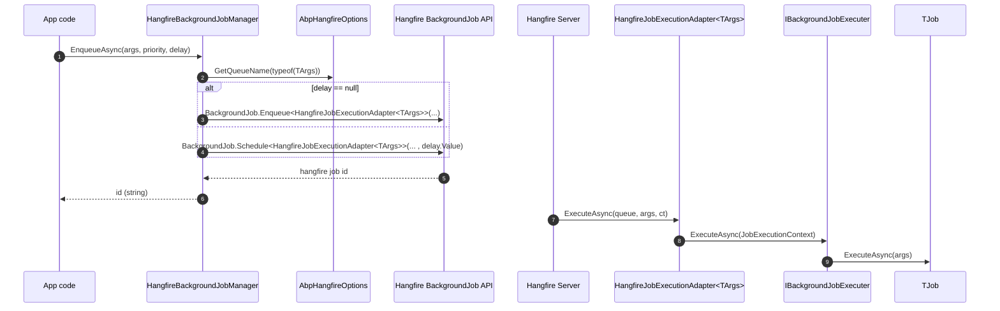

`Volo.Abp.BackgroundJobs.HangFire` replaces `IBackgroundJobManager` with a **Hangfire‑backed** producer. Enqueueing a job no longer writes a row to `IBackgroundJobStore` — instead, it calls `BackgroundJob.Enqueue<HangfireJobExecutionAdapter<TArgs>>(...)`, which schedules a Hangfire job that, when executed by Hangfire's server, calls back into Abp's `IBackgroundJobExecuter`.

The benefit is that you get Hangfire's mature dashboard, SQL Server/Redis/MongoDB storage, retry filters, and recurring infrastructure, while your application code still talks to `IBackgroundJobManager` and your job classes still implement `IAsyncBackgroundJob<T>`.

<Info>
Source: `framework/src/Volo.Abp.BackgroundJobs.HangFire/Volo/Abp/BackgroundJobs/Hangfire/`. Depends on `Volo.Abp.HangFire` (the integration module) and `AbpBackgroundJobsAbstractionsModule`.
</Info>

## How a job becomes a Hangfire job



## HangfireBackgroundJobManager

```csharp
// framework/src/Volo.Abp.BackgroundJobs.HangFire/Volo/Abp/BackgroundJobs/Hangfire/HangfireBackgroundJobManager.cs
[Dependency(ReplaceServices = true)]
public class HangfireBackgroundJobManager : IBackgroundJobManager, ITransientDependency
{
    protected IOptions<AbpBackgroundJobOptions> BackgroundJobOptions { get; }
    protected IOptions<AbpHangfireOptions> HangfireOptions { get; }

    public HangfireBackgroundJobManager(
        IOptions<AbpBackgroundJobOptions> backgroundJobOptions,
        IOptions<AbpHangfireOptions> hangfireOptions)
    {
        BackgroundJobOptions = backgroundJobOptions;
        HangfireOptions = hangfireOptions;
    }

    public virtual Task<string> EnqueueAsync<TArgs>(
        TArgs args,
        BackgroundJobPriority priority = BackgroundJobPriority.Normal,
        TimeSpan? delay = null)
    {
        return Task.FromResult(delay.HasValue
            ? BackgroundJob.Schedule<HangfireJobExecutionAdapter<TArgs>>(
                adapter => adapter.ExecuteAsync(GetQueueName(typeof(TArgs)), args, default),
                delay.Value)
            : BackgroundJob.Enqueue<HangfireJobExecutionAdapter<TArgs>>(
                adapter => adapter.ExecuteAsync(GetQueueName(typeof(TArgs)), args, default)));
    }

    protected virtual string GetQueueName(Type argsType)
    {
        var queueAttribute = BackgroundJobOptions.Value
            .GetJob(argsType).JobType.GetCustomAttribute<QueueAttribute>();
        return queueAttribute != null
            ? HangfireOptions.Value.DefaultQueuePrefix + queueAttribute.Queue
            : HangfireOptions.Value.DefaultQueue;
    }
}
```

Notes:

- `BackgroundJobPriority` is **not** translated to Hangfire — Hangfire has no native job priority concept. The parameter is accepted to keep the abstraction stable but ignored.
- The queue name is derived from `[Queue]` on the **job type** (not the args type). When present, it is prefixed with `AbpHangfireOptions.DefaultQueuePrefix`; when absent, the default queue is used.

### Queueing a job to a custom Hangfire queue

```csharp
// Hangfire's [Queue] attribute on the job class
[Queue("reports")]
public class GenerateMonthlyReportJob : AsyncBackgroundJob<GenerateMonthlyReportArgs>, ITransientDependency
{
    public override Task ExecuteAsync(GenerateMonthlyReportArgs args) { /* ... */ }
}
```

If `AbpHangfireOptions.DefaultQueuePrefix` is `"myapp."`, the job will be enqueued onto `myapp_reports` (see [`/background/hangfire-module`](/background/hangfire-module) for the prefixing rules).

## HangfireJobExecutionAdapter — the bridge to Abp

```csharp
// framework/src/Volo.Abp.BackgroundJobs.HangFire/Volo/Abp/BackgroundJobs/Hangfire/HangfireJobExecutionAdapter.cs
public class HangfireJobExecutionAdapter<TArgs>
{
    protected AbpBackgroundJobOptions Options { get; }
    protected IServiceScopeFactory ServiceScopeFactory { get; }
    protected IBackgroundJobExecuter JobExecuter { get; }

    public HangfireJobExecutionAdapter(
        IOptions<AbpBackgroundJobOptions> options,
        IBackgroundJobExecuter jobExecuter,
        IServiceScopeFactory serviceScopeFactory)
    {
        JobExecuter = jobExecuter;
        ServiceScopeFactory = serviceScopeFactory;
        Options = options.Value;
    }

    [Queue("{0}")]
    public async Task ExecuteAsync(string queue, TArgs args, CancellationToken cancellationToken = default)
    {
        if (!Options.IsJobExecutionEnabled)
        {
            throw new AbpException(
                "Background job execution is disabled. " +
                "This method should not be called! " +
                "If you want to enable the background job execution, " +
                $"set {nameof(AbpBackgroundJobOptions)}.{nameof(AbpBackgroundJobOptions.IsJobExecutionEnabled)} to true! " +
                "If you've intentionally disabled job execution and this seems a bug, please report it."
            );
        }

        using (var scope = ServiceScopeFactory.CreateScope())
        {
            var jobType = Options.GetJob(typeof(TArgs)).JobType;
            var context = new JobExecutionContext(
                scope.ServiceProvider, jobType, args!, cancellationToken: cancellationToken);
            await JobExecuter.ExecuteAsync(context);
        }
    }
}
```

The `[Queue("{0}")]` attribute is Hangfire's *placeholder syntax*: it pulls the queue name from the first method argument at enqueue time, which is exactly the `queue` string that `HangfireBackgroundJobManager.GetQueueName` computed. That is how the manager's queue choice survives the round trip into Hangfire storage.

A fresh service scope is created per execution so each job sees a clean `IUnitOfWork`, `ICurrentTenant`, repositories, etc. The same `BackgroundJobExecuter` from the abstractions package runs the job, so the *executer pipeline (tenant scoping, cancellation token provider, exception notifier, BackgroundJobExecutionException wrapping)* is identical to the in‑process provider.

## Module wiring

```csharp
// framework/src/Volo.Abp.BackgroundJobs.HangFire/Volo/Abp/BackgroundJobs/Hangfire/AbpBackgroundJobsHangfireModule.cs
[DependsOn(
    typeof(AbpBackgroundJobsAbstractionsModule),
    typeof(AbpHangfireModule)
)]
public class AbpBackgroundJobsHangfireModule : AbpModule
{
    public override void ConfigureServices(ServiceConfigurationContext context)
    {
        context.Services.AddTransient(serviceProvider =>
            serviceProvider.GetRequiredService<AbpDashboardOptionsProvider>().Get());
    }

    public override void OnPreApplicationInitialization(ApplicationInitializationContext context)
    {
        var options = context.ServiceProvider.GetRequiredService<IOptions<AbpBackgroundJobOptions>>().Value;
        if (!options.IsJobExecutionEnabled)
        {
            var hangfireOptions = context.ServiceProvider.GetRequiredService<IOptions<AbpHangfireOptions>>().Value;
            context.ServiceProvider.GetRequiredService<JobStorage>();
            hangfireOptions.BackgroundJobServerFactory = _ => null;
        }
    }
}
```

The `OnPreApplicationInitialization` hook is interesting: it lets you enqueue jobs from this host but *not run them*. When `IsJobExecutionEnabled` is `false`, `BackgroundJobServerFactory` is replaced with one that returns `null`, so Hangfire's background server is never started on this node. Useful for "API only" / "worker only" deployment splits where a producer process must still be able to write to Hangfire's storage.

## Dashboard registration

The Hangfire dashboard is registered via the helper in `Volo.Abp.BackgroundJobs.HangFire`:

```csharp
// framework/src/Volo.Abp.BackgroundJobs.HangFire/Microsoft/AspNetCore/Builder/AbpHangfireApplicationBuilderExtensions.cs
public static class AbpHangfireApplicationBuilderExtensions
{
    public static IApplicationBuilder UseAbpHangfireDashboard(
        this IApplicationBuilder app,
        string pathMatch = "/hangfire",
        Action<DashboardOptions>? configure = null,
        JobStorage? storage = null)
    {
        var options = app.ApplicationServices
            .GetRequiredService<AbpDashboardOptionsProvider>().Get();
        configure?.Invoke(options);
        return app.UseHangfireDashboard(pathMatch, options, storage);
    }
}
```

`AbpDashboardOptionsProvider` is the wrapper that injects the `AbpHangfireAuthorizationFilter` (see [`/background/hangfire-module`](/background/hangfire-module)), so the dashboard is **always** authorized by Abp's policy provider rather than being publicly accessible.

### Typical Program.cs

```csharp
// In your AbpModule
public override void ConfigureServices(ServiceConfigurationContext context)
{
    PreConfigure<IGlobalConfiguration>(config =>
    {
        config.UseSqlServerStorage(connString);
    });
}

public override void OnApplicationInitialization(ApplicationInitializationContext context)
{
    var app = context.GetApplicationBuilder();
    app.UseAbpHangfireDashboard("/hangfire");
}
```

`PreConfigure<IGlobalConfiguration>` is the standard Abp extension point — the `AbpHangfireModule` collects all such pre‑configure actions and runs them inside `services.AddHangfire(...)`.

## What about retries?

Hangfire has its own retry filter (`AutomaticRetryAttribute`, default 10 retries with exponential backoff). When the adapter throws `BackgroundJobExecutionException`, Hangfire's filter catches it and reschedules the job — Abp does not manage retry state in this provider.

To customise:

```csharp
PreConfigure<IGlobalConfiguration>(config =>
{
    config.UseFilter(new AutomaticRetryAttribute { Attempts = 3 });
});
```

`AbpBackgroundJobWorkerOptions.DefaultFirstWaitDuration`, `DefaultWaitFactor`, and `DefaultTimeout` are **not** consulted in the Hangfire provider — they only affect the default polling worker.

## When to choose Hangfire

<CardGroup cols={2}>
  <Card title="You already use Hangfire" icon="check">
    Reuse the dashboard and storage you have. The Abp integration is a thin shim on top.
  </Card>
  <Card title="You want a UI" icon="display">
    The dashboard shows queues, retries, scheduled jobs, recurring jobs, and servers out of the box.
  </Card>
  <Card title="You want multi‑queue" icon="layer-group">
    Hangfire's queues and worker count map well to "fast jobs" vs "slow jobs" splits.
  </Card>
  <Card title="You need recurring + ad‑hoc" icon="rotate">
    Pair this module with `Volo.Abp.BackgroundWorkers.Hangfire` (see [`/background/workers-hangfire`](/background/workers-hangfire)) for a single Hangfire deployment.
  </Card>
</CardGroup>

## Common pitfalls

<CardGroup cols={2}>
  <Card title="JSON‑serialisable args" icon="file-code">
    Hangfire serializes the `args` parameter into the storage row using its own (Newtonsoft‑based by default) serializer. Use plain DTOs with parameterless constructors — no `Type` references, no polymorphic abstract classes.
  </Card>
  <Card title="Queue length cap" icon="ruler-horizontal">
    Hangfire enforces a max queue name length (default 50). With a prefix configured in `AbpHangfireOptions.DefaultQueuePrefix`, long queue names fail at startup with a clear `AbpException`.
  </Card>
  <Card title="One server per host" icon="server">
    Resolving `AbpHangfireBackgroundJobServer` *starts* the Hangfire server. The `[Dependency]` is a singleton and the module triggers it during `OnApplicationInitialization`, so you do not need to call anything yourself.
  </Card>
  <Card title="`IsAvailable()` always true" icon="circle-check">
    Once this module is loaded, `IBackgroundJobManager.IsAvailable()` returns `true` even if `IsJobExecutionEnabled` is `false`. The check distinguishes the null manager from real ones; it does not report whether execution is enabled.
  </Card>
</CardGroup>

## Cross‑links

- [`/background/jobs-abstractions`](/background/jobs-abstractions) — the contracts this provider implements.
- [`/background/hangfire-module`](/background/hangfire-module) — `AbpHangfireModule`, queue prefixing, server factory, dashboard authorization.
- [`/background/workers-hangfire`](/background/workers-hangfire) — using the same Hangfire instance for recurring workers.
- [`/flows/background-job-execution`](/flows/background-job-execution) — end‑to‑end execution flow.
