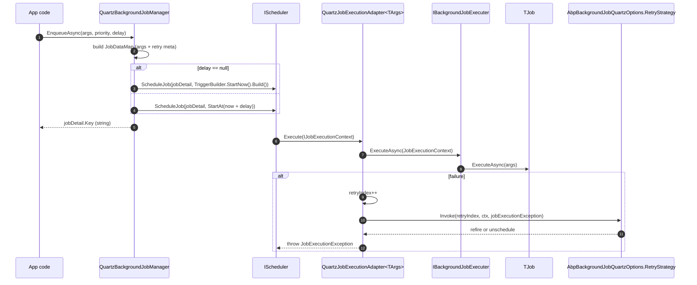

`Volo.Abp.BackgroundJobs.Quartz` replaces `IBackgroundJobManager` with a **Quartz.NET‑backed** producer. Enqueueing a job builds an `IJobDetail` and a one‑shot `ITrigger`, packs the serialized args into a `JobDataMap`, and schedules them on the singleton `IScheduler` provided by `Volo.Abp.Quartz`.

When the trigger fires, Quartz instantiates a `QuartzJobExecutionAdapter<TArgs>` (an `IJob`), the adapter deserialises the args and calls Abp's `IBackgroundJobExecuter`. Failures are surfaced through a `JobExecutionException` with a *RefireImmediately* flag that drives a configurable retry strategy.

<Info>
Source: `framework/src/Volo.Abp.BackgroundJobs.Quartz/Volo/Abp/BackgroundJobs/Quartz/`. Depends on `Volo.Abp.Quartz` (the shared scheduler module) and `AbpBackgroundJobsAbstractionsModule`.
</Info>

## Flow



## QuartzBackgroundJobManager

```csharp
// framework/src/Volo.Abp.BackgroundJobs.Quartz/Volo/Abp/BackgroundJobs/Quartz/QuartzBackgroundJobManager.cs
[Dependency(ReplaceServices = true)]
public class QuartzBackgroundJobManager : IBackgroundJobManager, ITransientDependency
{
    public const string JobDataPrefix = "Abp";
    public const string RetryIndex = "RetryIndex";

    protected IScheduler Scheduler { get; }
    protected AbpBackgroundJobQuartzOptions Options { get; }
    protected IJsonSerializer JsonSerializer { get; }

    public virtual async Task<string> EnqueueAsync<TArgs>(
        TArgs args,
        BackgroundJobPriority priority = BackgroundJobPriority.Normal,
        TimeSpan? delay = null)
    {
        return await ReEnqueueAsync(args, Options.RetryCount, Options.RetryIntervalMillisecond, priority, delay);
    }

    public virtual async Task<string> ReEnqueueAsync<TArgs>(
        TArgs args,
        int retryCount,
        int retryIntervalMillisecond,
        BackgroundJobPriority priority = BackgroundJobPriority.Normal,
        TimeSpan? delay = null)
    {
        var jobDataMap = new JobDataMap
        {
            { nameof(TArgs),                                                    JsonSerializer.Serialize(args!) },
            { JobDataPrefix + nameof(Options.RetryCount),                       retryCount.ToString() },
            { JobDataPrefix + nameof(Options.RetryIntervalMillisecond),         retryIntervalMillisecond.ToString() },
            { JobDataPrefix + RetryIndex,                                       "0" }
        };

        var jobDetail = JobBuilder
            .Create<QuartzJobExecutionAdapter<TArgs>>()
            .RequestRecovery()
            .SetJobData(jobDataMap)
            .Build();

        var trigger = !delay.HasValue
            ? TriggerBuilder.Create().StartNow().Build()
            : TriggerBuilder.Create().StartAt(new DateTimeOffset(DateTime.Now.Add(delay.Value))).Build();

        await Scheduler.ScheduleJob(jobDetail, trigger);
        return jobDetail.Key.ToString();
    }
}
```

Observations:

- `priority` is accepted to honour the interface but is **not** translated to Quartz trigger priority. Add a custom subclass if you need it.
- `RequestRecovery()` tells Quartz to recover the job after a server crash — combined with a persistent `IJobStore`, jobs survive process restarts.
- The args are serialised as a single `JsonSerializer.Serialize(args!)` value keyed by the literal string `"TArgs"` (the name of the generic type parameter). All other entries are prefixed with `"Abp"` so they don't collide with anything you put into the `JobDataMap` from a custom adapter.

### Custom per‑call retry

`QuartzBackgroundJobManageExtensions` exposes a helper that lets callers override the retry policy for one call:

```csharp
// QuartzBackgroundJobManageExtensions.cs
public static async Task<string?> EnqueueAsync<TArgs>(
    this IBackgroundJobManager backgroundJobManager,
    TArgs args,
    int retryCount,
    int retryIntervalMillisecond,
    BackgroundJobPriority priority = BackgroundJobPriority.Normal,
    TimeSpan? delay = null)
{
    if (backgroundJobManager is QuartzBackgroundJobManager quartzBackgroundJobManager)
    {
        return await quartzBackgroundJobManager.ReEnqueueAsync(
            args, retryCount, retryIntervalMillisecond, priority, delay);
    }

    return null;
}
```

Returns `null` when the active manager is not the Quartz one — defensive for code paths that might run under a different provider.

## QuartzJobExecutionAdapter — the IJob

```csharp
// QuartzJobExecutionAdapter.cs
public class QuartzJobExecutionAdapter<TArgs> : IJob
{
    public async Task Execute(IJobExecutionContext context)
    {
        using (var scope = ServiceScopeFactory.CreateScope())
        {
            var args = JsonSerializer.Deserialize<TArgs>(
                context.JobDetail.JobDataMap.GetString(nameof(TArgs))!);

            var jobType = Options.GetJob(typeof(TArgs)).JobType;
            var jobContext = new JobExecutionContext(
                scope.ServiceProvider, jobType, args!,
                cancellationToken: context.CancellationToken);

            try
            {
                await JobExecuter.ExecuteAsync(jobContext);
            }
            catch (Exception exception)
            {
                var jobExecutionException = new JobExecutionException(exception);

                var retryIndex = context.JobDetail.JobDataMap.GetString(
                    QuartzBackgroundJobManager.JobDataPrefix +
                    QuartzBackgroundJobManager.RetryIndex)!.To<int>();
                retryIndex++;
                context.JobDetail.JobDataMap.Put(
                    QuartzBackgroundJobManager.JobDataPrefix +
                    QuartzBackgroundJobManager.RetryIndex,
                    retryIndex.ToString());

                await BackgroundJobQuartzOptions.RetryStrategy.Invoke(
                    retryIndex, context, jobExecutionException);

                throw jobExecutionException;
            }
        }
    }
}
```

Key behaviour:

- Each execution creates its own service scope, so `IUnitOfWorkManager`, `ICurrentTenant`, and repositories are fresh per attempt.
- Exceptions are wrapped in a `Quartz.JobExecutionException` so Quartz's own machinery can act on them.
- The retry index is incremented **inside the JobDataMap** before the strategy is invoked. The strategy decides whether to set `RefireImmediately = true` or `UnscheduleAllTriggers = true`.

## AbpBackgroundJobQuartzOptions and the default retry strategy

```csharp
// AbpBackgroundJobQuartzOptions.cs
public class AbpBackgroundJobQuartzOptions
{
    public int RetryCount { get; set; }
    public int RetryIntervalMillisecond { get; set; }

    [NotNull]
    public Func<int, IJobExecutionContext, JobExecutionException, Task> RetryStrategy { /* ... */ }

    public AbpBackgroundJobQuartzOptions()
    {
        RetryCount = 3;
        RetryIntervalMillisecond = 3000;
        _retryStrategy = DefaultRetryStrategy;
    }

    private async Task DefaultRetryStrategy(
        int retryIndex,
        IJobExecutionContext executionContext,
        JobExecutionException exception)
    {
        exception.RefireImmediately = true;

        var retryCount = executionContext.JobDetail.JobDataMap.GetString(
            QuartzBackgroundJobManager.JobDataPrefix + nameof(RetryCount))!.To<int>();
        if (retryIndex > retryCount)
        {
            exception.RefireImmediately = false;
            exception.UnscheduleAllTriggers = true;
            return;
        }

        var retryInterval = executionContext.JobDetail.JobDataMap.GetString(
            QuartzBackgroundJobManager.JobDataPrefix + nameof(RetryIntervalMillisecond))!.To<int>();
        await Task.Delay(retryInterval);
    }
}
```

Defaults: 3 retries, 3 seconds between them. The strategy reads the retry count *from the JobDataMap* — not from the options object — so a per‑call override via `ReEnqueueAsync(args, retryCount, ...)` is respected even if the global option is different.

`RefireImmediately = true` is the mechanism Quartz uses to retry a `[StatefulJob]` immediately after the strategy completes. Setting `UnscheduleAllTriggers = true` removes the job entirely once retries are exhausted.

### Replacing the retry strategy

```csharp
Configure<AbpBackgroundJobQuartzOptions>(options =>
{
    options.RetryCount = 5;
    options.RetryIntervalMillisecond = 30_000;
    options.RetryStrategy = async (retryIndex, ctx, ex) =>
    {
        if (retryIndex > options.RetryCount)
        {
            ex.UnscheduleAllTriggers = true;
            return;
        }
        ex.RefireImmediately = true;
        await Task.Delay(options.RetryIntervalMillisecond * retryIndex);
    };
});
```

The strategy is a plain `Func` — replace it with whatever circuit breaker, jitter, or notification logic you need.

## Module wiring

```csharp
// AbpBackgroundJobsQuartzModule.cs
[DependsOn(
    typeof(AbpBackgroundJobsAbstractionsModule),
    typeof(AbpQuartzModule)
)]
public class AbpBackgroundJobsQuartzModule : AbpModule
{
    public override void ConfigureServices(ServiceConfigurationContext context)
    {
        context.Services.AddTransient(typeof(QuartzJobExecutionAdapter<>));
    }

    public override void OnPreApplicationInitialization(ApplicationInitializationContext context)
    {
        var options = context.ServiceProvider.GetRequiredService<IOptions<AbpBackgroundJobOptions>>().Value;
        if (!options.IsJobExecutionEnabled)
        {
            var quartzOptions = context.ServiceProvider.GetRequiredService<IOptions<AbpQuartzOptions>>().Value;
            quartzOptions.StartSchedulerFactory = scheduler => Task.CompletedTask;
        }
    }
}
```

- The open generic `QuartzJobExecutionAdapter<>` is registered as transient so Quartz's DI‑backed `JobFactory` can resolve it with any `TArgs` closure.
- If `IsJobExecutionEnabled` is `false`, the module swaps the scheduler start hook for a no‑op. The scheduler instance still exists (so `EnqueueAsync` succeeds), but Quartz never enters `Started` state on this node — useful for split producer/consumer deployments.

## Persistent stores

By default `AbpQuartzModule` configures an in‑memory store (jobs lost on restart). To survive restarts, configure a real Quartz job store (ADO.NET, RAMJobStore for tests, etc.) via `Configure<AbpQuartzOptions>`:

```csharp
Configure<AbpQuartzOptions>(options =>
{
    options.Configurator = builder =>
    {
        builder.UsePersistentStore(store =>
        {
            store.UseProperties = true;
            store.UseSqlServer(connString);
            store.UseJsonSerializer();
        });
    };
});
```

When using a persistent store, `RequestRecovery()` on the `JobBuilder` means a server crash mid‑execution will lead to a re‑attempt after restart.

## When to choose Quartz

<CardGroup cols={2}>
  <Card title="Complex schedules" icon="calendar-days">
    You need cron triggers, calendar exclusions, daily‑time intervals, or misfire handling. Quartz beats Hangfire here.
  </Card>
  <Card title="ADO.NET persistence" icon="database">
    Quartz's clustered JobStoreTX gives you durable, multi‑node scheduling without an extra service.
  </Card>
  <Card title="Per‑call retry policy" icon="rotate">
    The `ReEnqueueAsync(args, retryCount, interval)` extension lets you tune retries at the call site.
  </Card>
  <Card title="Shared with workers" icon="link">
    Combined with `Volo.Abp.BackgroundWorkers.Quartz` (see [`/background/workers-quartz`](/background/workers-quartz)), one `IScheduler` runs both jobs and recurring workers.
  </Card>
</CardGroup>

## Cross‑links

- [`/background/jobs-abstractions`](/background/jobs-abstractions) — the contracts this provider implements.
- [`/background/quartz-module`](/background/quartz-module) — `AbpQuartzModule`, `AbpQuartzOptions`, scheduler factory.
- [`/background/workers-quartz`](/background/workers-quartz) — recurring workers on the same scheduler.
- [`/flows/background-job-execution`](/flows/background-job-execution) — end‑to‑end execution flow.
