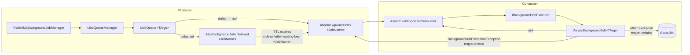

`Volo.Abp.BackgroundJobs.RabbitMQ` makes `IBackgroundJobManager` publish to RabbitMQ instead of persisting to a local store. Every job *argument type* gets its own queue (named `AbpBackgroundJobs.<JobName>`), and every host that has the module loaded starts an `AsyncEventingBasicConsumer` per queue.

This is the right choice when background work must be **distributed across services**: producers in one process publish, consumers in another process (or another deployment scale unit) pick up. Delays are implemented via a paired "delayed" queue that uses RabbitMQ's TTL + dead‑lettering trick to flow into the real queue when the delay expires.

<Info>
Source: `framework/src/Volo.Abp.BackgroundJobs.RabbitMQ/Volo/Abp/BackgroundJobs/RabbitMQ/`. Depends on `AbpRabbitMqModule` (channel pool, serializer) and `AbpBackgroundJobsAbstractionsModule`.
</Info>

## Architecture



The split into per‑job queues lets you scale consumers independently and observe queue depths per job type. The shared "delayed" queue per job type uses `x-dead-letter-routing-key` to flow expired messages back into the live queue.

## The manager

```csharp
// framework/src/Volo.Abp.BackgroundJobs.RabbitMQ/Volo/Abp/BackgroundJobs/RabbitMQ/RabbitMqBackgroundJobManager.cs
[Dependency(ReplaceServices = true)]
public class RabbitMqBackgroundJobManager : IBackgroundJobManager, ITransientDependency
{
    private readonly IJobQueueManager _jobQueueManager;

    public RabbitMqBackgroundJobManager(IJobQueueManager jobQueueManager)
    {
        _jobQueueManager = jobQueueManager;
    }

    public async Task<string> EnqueueAsync<TArgs>(
        TArgs args,
        BackgroundJobPriority priority = BackgroundJobPriority.Normal,
        TimeSpan? delay = null)
    {
        var jobQueue = await _jobQueueManager.GetAsync<TArgs>();
        return (await jobQueue.EnqueueAsync(args, priority, delay))!;
    }
}
```

The manager is a thin shim — it resolves the per‑type `IJobQueue<TArgs>` from `IJobQueueManager` and delegates. `priority` is accepted to honour the interface but **not** mapped to AMQP priority — the implementation has an explicit `TODO: How to handle priority` comment.

## The queue manager

```csharp
// JobQueueManager.cs
public class JobQueueManager : IJobQueueManager, ISingletonDependency
{
    protected ConcurrentDictionary<string, IRunnable> JobQueues { get; }

    public async Task StartAsync(CancellationToken cancellationToken = default)
    {
        if (!Options.IsJobExecutionEnabled) return;

        foreach (var jobConfiguration in Options.GetJobs())
        {
            var jobQueue = (IRunnable)ServiceProvider.GetRequiredService(
                typeof(IJobQueue<>).MakeGenericType(jobConfiguration.ArgsType));
            await jobQueue.StartAsync(cancellationToken);
            JobQueues[jobConfiguration.JobName] = jobQueue;
        }
    }

    public async Task<IJobQueue<TArgs>> GetAsync<TArgs>()
    {
        var jobConfiguration = Options.GetJob(typeof(TArgs));

        if (JobQueues.TryGetValue(jobConfiguration.JobName, out var jobQueue))
            return (IJobQueue<TArgs>)jobQueue;

        using (await SyncSemaphore.LockAsync())
        {
            if (JobQueues.TryGetValue(jobConfiguration.JobName, out jobQueue))
                return (IJobQueue<TArgs>)jobQueue;

            jobQueue = (IJobQueue<TArgs>)ServiceProvider
                .GetRequiredService(typeof(IJobQueue<>).MakeGenericType(typeof(TArgs)));
            await jobQueue.StartAsync();
            JobQueues.TryAdd(jobConfiguration.JobName, jobQueue);
            return (IJobQueue<TArgs>)jobQueue;
        }
    }
}
```

`StartAsync` iterates *every registered job type* and starts one `IJobQueue` per type at application initialization. `GetAsync<TArgs>` is the lazy path — if a producer enqueues a job whose consumer wasn't started (because `IsJobExecutionEnabled` is `false`), the queue is created on demand.

## IJobQueue — declare, publish, consume

```csharp
// IJobQueue.cs
public interface IJobQueue<in TArgs> : IRunnable, IDisposable
{
    Task<string?> EnqueueAsync(
        TArgs args,
        BackgroundJobPriority priority = BackgroundJobPriority.Normal,
        TimeSpan? delay = null);
}
```

The implementation pulls the channel from `AbpRabbitMqModule`'s `IChannelPool` and declares both queues on first use:

```csharp
// JobQueue.cs
public virtual async Task<string?> EnqueueAsync(
    TArgs args,
    BackgroundJobPriority priority = BackgroundJobPriority.Normal,
    TimeSpan? delay = null)
{
    CheckDisposed();
    using (await SyncObj.LockAsync())
    {
        await EnsureInitializedAsync();
        await PublishAsync(args, priority, delay);
        return null;
    }
}

protected virtual async Task EnsureInitializedAsync()
{
    if (ChannelAccessor != null && ChannelAccessor.Channel.IsOpen) return;

    ChannelAccessor = await ChannelPool.AcquireAsync(
        ChannelPrefix + QueueConfiguration.QueueName,
        QueueConfiguration.ConnectionName);

    var result = await QueueConfiguration.DeclareAsync(ChannelAccessor.Channel);
    Logger.LogDebug($"RabbitMQ Queue '{QueueConfiguration.QueueName}' has {result.MessageCount} messages and {result.ConsumerCount} consumers.");

    // Declare delayed queue
    await QueueConfiguration.DeclareDelayedAsync(ChannelAccessor.Channel);

    if (AbpBackgroundJobOptions.IsJobExecutionEnabled)
    {
        if (QueueConfiguration.PrefetchCount.HasValue)
        {
            await ChannelAccessor.Channel.BasicQosAsync(0, QueueConfiguration.PrefetchCount.Value, false);
        }

        Consumer = new AsyncEventingBasicConsumer(ChannelAccessor.Channel);
        Consumer.ReceivedAsync += MessageReceived;

        await ChannelAccessor.Channel.BasicConsumeAsync(
            queue: QueueConfiguration.QueueName,
            autoAck: false,
            consumer: Consumer);
    }
}
```

`EnqueueAsync` returns `null` for the id because RabbitMQ does not assign a server‑side id; for a stable id either generate one on the args and include it in the payload, or use the default in‑process provider.

### Publishing live vs delayed

```csharp
protected virtual async Task PublishAsync(
    TArgs args,
    BackgroundJobPriority priority = BackgroundJobPriority.Normal,
    TimeSpan? delay = null)
{
    var routingKey = QueueConfiguration.QueueName;
    var basicProperties = new BasicProperties { Persistent = true };

    if (delay.HasValue)
    {
        routingKey = QueueConfiguration.DelayedQueueName;
        basicProperties.Expiration = delay.Value.TotalMilliseconds
            .ToString(CultureInfo.InvariantCulture);
    }

    if (ChannelAccessor != null)
    {
        await ChannelAccessor.Channel.BasicPublishAsync(
            exchange: "",
            routingKey: routingKey,
            mandatory: false,
            basicProperties: basicProperties,
            body: Serializer.Serialize(args!));
    }
}
```

When `delay` is set, the message is published to the delayed queue with `BasicProperties.Expiration` (per‑message TTL). When the TTL expires, RabbitMQ dead‑letters the message to the live queue via the `x-dead-letter-routing-key` argument set up on the delayed queue (see `JobQueueConfiguration.DeclareDelayedAsync`).

### Consumer behaviour and ack/reject

```csharp
protected virtual async Task MessageReceived(object sender, BasicDeliverEventArgs ea)
{
    using (var scope = ServiceScopeFactory.CreateScope())
    {
        var context = new JobExecutionContext(
            scope.ServiceProvider,
            JobConfiguration.JobType,
            Serializer.Deserialize(ea.Body.ToArray(), typeof(TArgs)));

        try
        {
            await JobExecuter.ExecuteAsync(context);
            await ChannelAccessor!.Channel.BasicAckAsync(deliveryTag: ea.DeliveryTag, multiple: false);
        }
        catch (BackgroundJobExecutionException)
        {
            //TODO: Reject like that?
            await ChannelAccessor!.Channel.BasicRejectAsync(deliveryTag: ea.DeliveryTag, requeue: true);
        }
        catch (Exception)
        {
            //TODO: Reject like that?
            await ChannelAccessor!.Channel.BasicRejectAsync(deliveryTag: ea.DeliveryTag, requeue: false);
        }
    }
}
```

Three outcomes:

| Outcome | AMQP action | Effect |
| --- | --- | --- |
| `await JobExecuter.ExecuteAsync` returns | `BasicAck(deliveryTag)` | Message removed from queue. |
| `BackgroundJobExecutionException` | `BasicReject(requeue: true)` | Message re‑queued at the head of the queue. |
| Any other exception | `BasicReject(requeue: false)` | Message discarded (no DLX configured by default). |

Because `BackgroundJobExecuter` wraps every job‑side exception in `BackgroundJobExecutionException`, the normal failure mode is requeue. The `requeue: false` branch only fires for infrastructure failures (deserialization, scope creation, executer lookup).

<Warning>
`BasicReject(requeue: true)` puts the message *back at the head of the queue*. Without a backoff or a dead‑letter exchange, a permanently failing message will be retried in a tight loop. Configure your own DLX via a custom `JobQueueConfiguration` for poison‑message handling.
</Warning>

## Queue naming and configuration

```csharp
// AbpRabbitMqBackgroundJobOptions.cs
public class AbpRabbitMqBackgroundJobOptions
{
    public Dictionary<Type, JobQueueConfiguration> JobQueues { get; }

    public string DefaultQueueNamePrefix { get; set; }        // "AbpBackgroundJobs."
    public string DefaultDelayedQueueNamePrefix { get; set; } // "AbpBackgroundJobsDelayed."
    public ushort? PrefetchCount { get; set; }
}

// JobQueueConfiguration.cs
public class JobQueueConfiguration : QueueDeclareConfiguration
{
    public Type JobArgsType { get; }
    public string? ConnectionName { get; set; }
    public string DelayedQueueName { get; set; }

    public virtual async Task<QueueDeclareOk> DeclareDelayedAsync(IChannel channel)
    {
        var delayedArguments = new Dictionary<string, object?>(Arguments)
        {
            ["x-dead-letter-routing-key"] = QueueName,
            ["x-dead-letter-exchange"] = string.Empty
        };

        return await channel.QueueDeclareAsync(
            queue: DelayedQueueName,
            durable: Durable,
            exclusive: Exclusive,
            autoDelete: AutoDelete,
            arguments: delayedArguments);
    }
}
```

By default each job type gets:

- A live queue `AbpBackgroundJobs.<JobName>` (durable, non‑exclusive, non‑auto‑delete).
- A delayed queue `AbpBackgroundJobsDelayed.<JobName>` with `x-dead-letter-exchange = ""` and `x-dead-letter-routing-key = <live queue name>`.

You can override per‑type:

```csharp
Configure<AbpRabbitMqBackgroundJobOptions>(options =>
{
    options.PrefetchCount = 16;
    options.JobQueues[typeof(WelcomeEmailArgs)] = new JobQueueConfiguration(
        jobArgsType: typeof(WelcomeEmailArgs),
        queueName: "myapp.emails.welcome",
        delayedQueueName: "myapp.emails.welcome.delayed",
        connectionName: "EmailsConnection",
        durable: true,
        prefetchCount: 32);
});
```

`ConnectionName` lets a job ride a dedicated `AbpRabbitMqOptions` connection (useful for isolating hot paths).

## Module wiring

```csharp
// AbpBackgroundJobsRabbitMqModule.cs
[DependsOn(
    typeof(AbpBackgroundJobsAbstractionsModule),
    typeof(AbpRabbitMqModule),
    typeof(AbpThreadingModule)
)]
public class AbpBackgroundJobsRabbitMqModule : AbpModule
{
    public override void ConfigureServices(ServiceConfigurationContext context)
    {
        context.Services.AddSingleton(typeof(IJobQueue<>), typeof(JobQueue<>));
    }

    public async override Task OnApplicationInitializationAsync(ApplicationInitializationContext context)
    {
        await context.ServiceProvider.GetRequiredService<IJobQueueManager>().StartAsync();
    }

    public async override Task OnApplicationShutdownAsync(ApplicationShutdownContext context)
    {
        await context.ServiceProvider.GetRequiredService<IJobQueueManager>().StopAsync();
    }
}
```

`IJobQueue<>` is a singleton — each per‑type queue holds one channel from the pool and one consumer. Shutdown disposes the queues and releases the channels.

## Producer‑only and consumer‑only deployments

- A **producer‑only** host sets `IsJobExecutionEnabled = false`. `JobQueueManager.StartAsync` short‑circuits, no consumers are created, but `GetAsync<TArgs>` will still lazily build a queue to publish into.
- A **consumer‑only** host leaves `IsJobExecutionEnabled = true`. `JobQueueManager.StartAsync` enumerates every registered job type and starts a consumer for each.

Splitting this way is the standard scaling pattern: APIs publish, dedicated workers consume.

## Cross‑links

- [`/background/jobs-abstractions`](/background/jobs-abstractions) — `IBackgroundJobManager`, `IBackgroundJobExecuter`, `AbpBackgroundJobOptions`.
- [`/eventbus/rabbitmq`](/eventbus/rabbitmq) — `AbpRabbitMqModule`, `IChannelPool`, `IRabbitMqSerializer` (all reused here).
- [`/flows/background-job-execution`](/flows/background-job-execution) — execution flow across providers.
