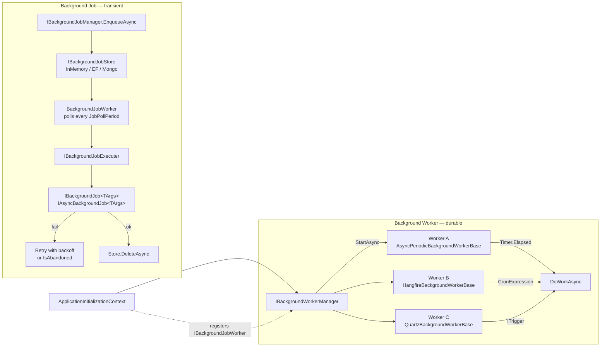

Abp has **two distinct background execution surfaces**, and the difference between them shapes everything else in this section:

- **Background jobs** are *transient units of work*. You enqueue an argument object, the framework persists it (or hands it to a queue), and a worker eventually picks it up, deserializes it, resolves the `IBackgroundJob<T>` (or `IAsyncBackgroundJob<T>`) implementation from DI, and executes it. Jobs are retried on failure and have a priority.
- **Background workers** are *long‑running hosted singletons*. They are started when the application starts, stopped when it shuts down, and typically run on a timer (`PeriodicBackgroundWorkerBase`, `AsyncPeriodicBackgroundWorkerBase`) or a cron expression (via Hangfire / Quartz integrations).

The default in‑process implementation of background jobs is itself implemented as a background worker — `BackgroundJobWorker` polls `IBackgroundJobStore` every `JobPollPeriod` milliseconds and executes any waiting jobs. That symmetry is intentional: the two abstractions complement each other rather than compete.

<Info>
This section documents the framework packages under `framework/src/Volo.Abp.BackgroundJobs*` and `framework/src/Volo.Abp.BackgroundWorkers*`, plus the `Volo.Abp.HangFire` and `Volo.Abp.Quartz` integration modules. The persistence stores (EF Core, MongoDB) live in `modules/background-jobs/`.
</Info>

## Jobs vs workers at a glance



The left‑hand path is the *job* lifecycle: enqueue, persist, poll, execute, retry or delete. The right‑hand path is the *worker* lifecycle: register, start, fire on timer or cron, do the work, stop. Most applications need both.

## When to choose which

<CardGroup cols={2}>
  <Card title="Use a background job" icon="boxes-stacked">
    A user action triggers something that should happen *eventually* but does not need to block the response — sending a welcome e‑mail, generating a report, syncing an external system. The work has *arguments* and is retried on failure.
  </Card>
  <Card title="Use a background worker" icon="rotate">
    Something must run *on a schedule* or *continuously* in the background of every host — cleaning up stale tokens, polling an inbox, computing aggregates, refreshing a cache. There are no per‑invocation arguments.
  </Card>
  <Card title="Use both together" icon="link">
    A periodic worker scans for due records and enqueues a job per record. The worker handles scheduling; the job handles the unit of work, retries, and per‑tenant context.
  </Card>
  <Card title="Use the null manager" icon="ban">
    `NullBackgroundJobManager` is registered when no provider is installed. `IBackgroundJobManager.IsAvailable()` reports `false`, and `EnqueueAsync` is a no‑op. Useful for tests and CLI tools.
  </Card>
</CardGroup>

## What this section covers

<CardGroup cols={2}>
  <Card title="Jobs Abstractions" icon="cube" href="/background/jobs-abstractions">
    The contracts in `Volo.Abp.BackgroundJobs.Abstractions`: `IBackgroundJob<T>`, `IAsyncBackgroundJob<T>`, `IBackgroundJobManager`, `BackgroundJobPriority`, `AbpBackgroundJobOptions`, `IBackgroundJobExecuter`.
  </Card>
  <Card title="Default In‑Process Jobs" icon="memory" href="/background/jobs-default">
    `DefaultBackgroundJobManager`, the `BackgroundJobWorker` poller, `IBackgroundJobStore` with the in‑memory implementation, and `AbpBackgroundJobWorkerOptions`.
  </Card>
  <Card title="Hangfire Jobs" icon="bolt" href="/background/jobs-hangfire">
    `HangfireBackgroundJobManager` replaces the default manager and enqueues into Hangfire's storage. Adapter routes back to `IBackgroundJobExecuter`.
  </Card>
  <Card title="Quartz Jobs" icon="clock" href="/background/jobs-quartz">
    `QuartzBackgroundJobManager` schedules a `QuartzJobExecutionAdapter<TArgs>` through `IScheduler`, with a pluggable retry strategy.
  </Card>
  <Card title="RabbitMQ Jobs" icon="rabbit" href="/background/jobs-rabbitmq">
    `RabbitMqBackgroundJobManager`, `IJobQueue<T>`, the per‑job queue/consumer, and the delayed queue used to implement `delay`.
  </Card>
  <Card title="Background Workers" icon="repeat" href="/background/workers">
    `IBackgroundWorker`, `BackgroundWorkerBase`, the periodic bases, `IBackgroundWorkerManager`, and how to register workers from `OnApplicationInitializationAsync`.
  </Card>
  <Card title="Hangfire Workers" icon="bolt" href="/background/workers-hangfire">
    `HangfireBackgroundWorkerBase` and the `HangfireBackgroundWorkerManager` that translates periodic workers into Hangfire recurring jobs.
  </Card>
  <Card title="Quartz Workers" icon="calendar-days" href="/background/workers-quartz">
    `QuartzBackgroundWorkerBase` with `ITrigger` and `IJobDetail`, and the `AbpQuartzConventionalRegistrar` that auto‑registers them.
  </Card>
  <Card title="Quartz Module" icon="gear" href="/background/quartz-module">
    `AbpQuartzModule`, `AbpQuartzOptions`, the `IScheduler` singleton, default in‑memory store and thread pool, and `StartSchedulerFactory`.
  </Card>
  <Card title="Hangfire Module" icon="gear" href="/background/hangfire-module">
    `AbpHangfireModule`, `AbpHangfireOptions`, queue prefixing, `BackgroundJobServerFactory`, and the dashboard authorization filter.
  </Card>
</CardGroup>

## The two contracts you actually call

Once everything is wired up, application code only ever touches two interfaces:

```csharp
public interface IBackgroundJobManager
{
    Task<string> EnqueueAsync<TArgs>(
        TArgs args,
        BackgroundJobPriority priority = BackgroundJobPriority.Normal,
        TimeSpan? delay = null
    );
}

public interface IBackgroundWorker : IRunnable, ISingletonDependency
{
    // StartAsync / StopAsync from IRunnable
}
```

The `IBackgroundJobManager` is injected wherever you need to enqueue work. `IBackgroundWorker` is implemented by your worker classes and registered with the worker manager during application initialization. Everything else in this section is the machinery that makes those two calls do something useful.

## A worker in the simplest case

The minimum viable background worker is two lines of override and a `Timer.Period` assignment:

```csharp
public class HeartbeatWorker : AsyncPeriodicBackgroundWorkerBase
{
    public HeartbeatWorker(AbpAsyncTimer timer, IServiceScopeFactory factory)
        : base(timer, factory)
    {
        Timer.Period = (int)TimeSpan.FromSeconds(30).TotalMilliseconds;
    }

    protected override Task DoWorkAsync(PeriodicBackgroundWorkerContext ctx)
    {
        Logger.LogInformation("Still here at {Time}", DateTimeOffset.UtcNow);
        return Task.CompletedTask;
    }
}
```

Register it with one call from your module:

```csharp
public override async Task OnApplicationInitializationAsync(ApplicationInitializationContext context)
{
    await context.AddBackgroundWorkerAsync<HeartbeatWorker>();
}
```

That is the whole picture — the rest of this section is about what changes when you need persistence, retries, cron expressions, multi‑node coordination, or a UI.

## A job in the simplest case

Likewise, the minimum viable background job is a class that implements `IAsyncBackgroundJob<TArgs>`:

```csharp
public class WelcomeEmailJob : AsyncBackgroundJob<WelcomeEmailArgs>, ITransientDependency
{
    public override async Task ExecuteAsync(WelcomeEmailArgs args)
    {
        // ...
    }
}
```

The args type is the public contract — the framework discovers `IAsyncBackgroundJob<>` implementations during DI registration and stores their `TArgs` in `AbpBackgroundJobOptions`. No manual `AddJob<T>()` call is required. From an application service you simply inject the manager and enqueue:

```csharp
await _backgroundJobManager.EnqueueAsync(new WelcomeEmailArgs
{
    TenantId = _currentTenant.Id,
    UserId   = userId,
    Email    = email
});
```

Depending on which provider module is loaded, that `EnqueueAsync` call writes a row, schedules a Hangfire job, calls `IScheduler.ScheduleJob`, or publishes to a RabbitMQ queue — your code never changes.

## Provider selection cheat‑sheet

| You want… | Add this module | Manager implementation |
| --- | --- | --- |
| In‑process polling with EF Core or Mongo storage | `AbpBackgroundJobsModule` + a job store module | `DefaultBackgroundJobManager` |
| Hangfire dashboard & SQL/Redis storage | `AbpBackgroundJobsHangfireModule` | `HangfireBackgroundJobManager` |
| Quartz.NET scheduler with retry policy | `AbpBackgroundJobsQuartzModule` | `QuartzBackgroundJobManager` |
| Distributed queueing across services | `AbpBackgroundJobsRabbitMqModule` | `RabbitMqBackgroundJobManager` |
| Nothing (no‑op) | *(none)* | `NullBackgroundJobManager` |

The `[Dependency(ReplaceServices = true)]` attribute on each non‑default manager guarantees that adding the integration module is the only step required — Abp's DI will replace the previous registration.

## Multi‑tenant safety

Every provider routes execution through the same `BackgroundJobExecuter`, which inspects the job argument:

```csharp
protected virtual Guid? GetJobArgsTenantId(object jobArgs)
{
    return jobArgs switch
    {
        IMultiTenant multiTenantJobArgs => multiTenantJobArgs.TenantId,
        _ => CurrentTenant.Id
    };
}
```

If your `TArgs` implements `IMultiTenant`, the executor wraps `IBackgroundJob<T>.Execute` in `CurrentTenant.Change(tenantId)` so repositories, current user lookups, and event handlers see the correct tenant. This is the single most important thing to know when designing job arguments.

A tenant‑aware job args type looks like this:

```csharp
[BackgroundJobName("emails.welcome")]
public class WelcomeEmailArgs : IMultiTenant
{
    public Guid? TenantId { get; set; }
    public Guid UserId { get; set; }
    public string Email { get; set; } = default!;
}
```

When `EnqueueAsync` is called inside a tenant scope, the producer is responsible for *recording* the tenant id on the args. The executor takes care of *restoring* the scope before invoking the job. Forgetting either half is the most common multi‑tenant bug: jobs that "work in dev" but fail to find data in production because they ran with the host tenant id.

## Where things live in source

| Concern | Package | Notes |
| --- | --- | --- |
| Job interfaces and options | `framework/src/Volo.Abp.BackgroundJobs.Abstractions` | `IBackgroundJob<T>`, `IAsyncBackgroundJob<T>`, `IBackgroundJobManager`, `AbpBackgroundJobOptions`, `BackgroundJobExecuter`. |
| Default polling provider | `framework/src/Volo.Abp.BackgroundJobs` | `DefaultBackgroundJobManager`, `BackgroundJobWorker`, `InMemoryBackgroundJobStore`, `AbpBackgroundJobWorkerOptions`. |
| EF Core / Mongo stores | `modules/background-jobs/` | Real `IBackgroundJobStore` implementations and `AbpBackgroundJobs` table mappings. |
| Hangfire jobs provider | `framework/src/Volo.Abp.BackgroundJobs.HangFire` | `HangfireBackgroundJobManager`, `HangfireJobExecutionAdapter<TArgs>`. |
| Quartz jobs provider | `framework/src/Volo.Abp.BackgroundJobs.Quartz` | `QuartzBackgroundJobManager`, `QuartzJobExecutionAdapter<TArgs>`, retry strategy. |
| RabbitMQ jobs provider | `framework/src/Volo.Abp.BackgroundJobs.RabbitMQ` | `RabbitMqBackgroundJobManager`, `IJobQueue<T>`, `JobQueueConfiguration`. |
| Worker primitives | `framework/src/Volo.Abp.BackgroundWorkers` | `IBackgroundWorker`, `BackgroundWorkerBase`, periodic bases, `BackgroundWorkerManager`. |
| Hangfire workers | `framework/src/Volo.Abp.BackgroundWorkers.Hangfire` | `HangfireBackgroundWorkerBase`, `HangfireBackgroundWorkerManager`, period‑to‑cron translation. |
| Quartz workers | `framework/src/Volo.Abp.BackgroundWorkers.Quartz` | `QuartzBackgroundWorkerBase`, auto‑registration, `QuartzPeriodicBackgroundWorkerAdapter<T>`. |
| Hangfire foundation | `framework/src/Volo.Abp.HangFire` | `AbpHangfireModule`, `AbpHangfireOptions`, `AbpHangfireAuthorizationFilter`. |
| Quartz foundation | `framework/src/Volo.Abp.Quartz` | `AbpQuartzModule`, `AbpQuartzOptions`, singleton `IScheduler`. |

## Cancellation and shutdown

All four providers thread the host's stopping token into the executor through `JobExecutionContext.CancellationToken`. The executor then registers it with `ICancellationTokenProvider.Use(...)` for the duration of the call, so any ABP framework code that respects the ambient cancellation token (EF Core repositories, distributed locking, HTTP clients) bails out cleanly when the host begins shutdown.

Periodic background workers do the same via the `PeriodicBackgroundWorkerContext.CancellationToken` they receive in each tick. The token is the *application stopping* token, not a per‑tick timeout — if you need an upper bound on a single execution, layer a `CancellationTokenSource(timeout)` on top inside `DoWorkAsync`.

## What can go wrong

<CardGroup cols={2}>
  <Card title="Forgotten distributed lock" icon="triangle-exclamation">
    The default provider needs a real `IAbpDistributedLock` (Redis, SQL Server, ZooKeeper). Without one, two hosts can pick up the same job and execute it twice. The local fallback is in‑process only.
  </Card>
  <Card title="Args type rename" icon="pen-ruler">
    `JobName` defaults to the args type's full name. Renaming or moving the type breaks lookup for queued rows. Pin it with `[BackgroundJobName("...")]` before you ship.
  </Card>
  <Card title="Non‑serialisable args" icon="file-circle-xmark">
    Args are JSON‑round‑tripped (or AMQP‑serialised for RabbitMQ). Non‑default constructors, polymorphic fields, and `Type` references will not survive. Use plain DTOs.
  </Card>
  <Card title="Tenant id lost" icon="user-tag">
    If your args do not implement `IMultiTenant`, the executor falls back to `ICurrentTenant.Id` — which is `null` (host) during background execution. Make tenant‑bound jobs explicit.
  </Card>
</CardGroup>

## Disabling background execution

Both subsystems share the same pattern for *globally* disabling execution while still allowing producers to enqueue:

- `AbpBackgroundJobOptions.IsJobExecutionEnabled` — when `false`, the default polling worker is *not* registered, and the Hangfire/Quartz integrations swap their server factories to no‑ops. `EnqueueAsync` still works on every provider.
- `AbpBackgroundWorkerOptions.IsEnabled` — when `false`, `BackgroundWorkerManager.StartAsync` is skipped entirely. No timer fires, no recurring job runs.

The abstractions module sets both flags off automatically when `IsDataMigrationEnvironment()` is true, so `dotnet ef` runs and CLI tools do not race against your workers.

For a split deployment, the canonical setup is:

```csharp
// In the API host: producer only
Configure<AbpBackgroundJobOptions>(o => o.IsJobExecutionEnabled = false);
Configure<AbpBackgroundWorkerOptions>(o => o.IsEnabled = false);

// In the worker host: consumer only
// (no overrides — defaults are enabled)
```

Both hosts reference the same module graph; only the options differ.

## Putting it together

A realistic application typically uses **two** of the packages described in this section:

1. The **default provider** for transactional, in‑process work (or Hangfire if a dashboard is required) — used by application services that want to defer side effects (email, webhooks, audits) past the response.
2. A **worker integration** for recurring background tasks — Quartz when the schedule is non‑trivial (calendars, time‑of‑day, distributed clustering), Hangfire when you want everything visible on one dashboard.

You can compose them: a Hangfire recurring worker scans a table every minute and enqueues per‑row jobs via the default in‑process provider. The recurring worker handles "when"; the job handles "what" — with retry, tenant scoping, and per‑job storage.

## Patterns to read next

If you are new to the section, skim in this order:

1. **[Jobs Abstractions](/background/jobs-abstractions)** — the contracts every provider implements.
2. **[Default Jobs](/background/jobs-default)** — the polling worker and the in‑memory store, so you understand the reference implementation before any provider variants.
3. **[Background Workers](/background/workers)** — periodic bases and the worker manager.
4. **One provider page** that matches your infrastructure (Hangfire, Quartz, or RabbitMQ).
5. **The matching foundation module page** (`/background/hangfire-module` or `/background/quartz-module`) for queue prefixing, dashboard authorization, persistence stores.

## Related sections

- [`/modules/background-jobs/overview`](/modules/background-jobs/overview) — the EF Core and MongoDB stores that back `DefaultBackgroundJobManager`.
- [`/eventbus/rabbitmq`](/eventbus/rabbitmq) — the connection pool and serializer the RabbitMQ job provider builds on.
- [`/flows/background-job-execution`](/flows/background-job-execution) — a step‑by‑step walkthrough of one job from `EnqueueAsync` to `DeleteAsync`.
