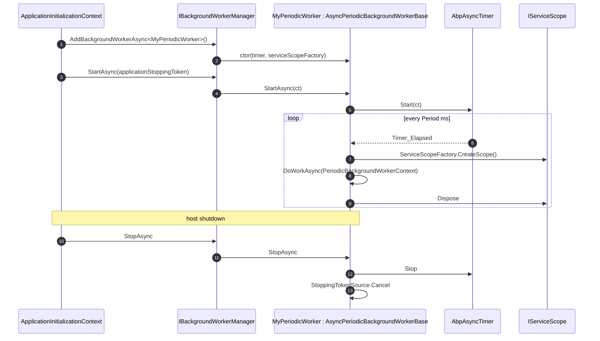

A **background worker** in Abp is a singleton class that the framework starts when the application starts and stops when it shuts down. Workers are *not* per‑request and they are *not* enqueued — they run for the lifetime of the host. The `BackgroundJobWorker` from [`/background/jobs-default`](/background/jobs-default) is itself one of these workers; the rest of this page is about writing your own.

The model is intentionally tiny: an interface, a base class with a logger and a cancellation token, two convenience bases for *periodic* work (sync and async), and a manager that calls `StartAsync` / `StopAsync` in registration order.

<Info>
Source: `framework/src/Volo.Abp.BackgroundWorkers/Volo/Abp/BackgroundWorkers/`. Module class is `AbpBackgroundWorkersModule`, which is brought in by `AbpDataModule` and `AbpThreadingModule`.
</Info>

## Lifecycle and timer flow



## IBackgroundWorker — the contract

```csharp
// framework/src/Volo.Abp.BackgroundWorkers/Volo/Abp/BackgroundWorkers/IBackgroundWorker.cs
public interface IBackgroundWorker : IRunnable, ISingletonDependency { }
```

A worker is two things at once:

- `IRunnable` — promises a `StartAsync` / `StopAsync` pair (from `Volo.Abp.Threading`).
- `ISingletonDependency` — registered as a singleton so the same instance survives across timer ticks.

Implementing `IBackgroundWorker` is enough to make a class auto‑discoverable to DI, but the framework will not run it until something registers it with the worker manager.

## BackgroundWorkerBase — the convenience base

```csharp
// BackgroundWorkerBase.cs
public abstract class BackgroundWorkerBase : IBackgroundWorker
{
    public IAbpLazyServiceProvider LazyServiceProvider { get; set; } = default!;
    public IServiceProvider ServiceProvider { get; set; } = default!;

    protected ILoggerFactory LoggerFactory
        => LazyServiceProvider.LazyGetRequiredService<ILoggerFactory>();

    protected ILogger Logger
        => LazyServiceProvider.LazyGetService<ILogger>(provider =>
               LoggerFactory?.CreateLogger(GetType().FullName!) ?? NullLogger.Instance);

    protected CancellationTokenSource StoppingTokenSource { get; set; }
    protected CancellationToken StoppingToken { get; set; }

    public BackgroundWorkerBase()
    {
        StoppingTokenSource = new CancellationTokenSource();
        StoppingToken = StoppingTokenSource.Token;
    }

    public virtual Task StartAsync(CancellationToken cancellationToken = default)
    {
        Logger.LogDebug("Started background worker: " + ToString());
        return Task.CompletedTask;
    }

    public virtual Task StopAsync(CancellationToken cancellationToken = default)
    {
        Logger.LogDebug("Stopped background worker: " + ToString());
        StoppingTokenSource.Cancel();
        StoppingTokenSource.Dispose();
        return Task.CompletedTask;
    }

    public override string ToString() => GetType().FullName!;
}
```

Notes:

- `LazyServiceProvider` and `ServiceProvider` are property‑injected — there is no constructor for a derived class to forward.
- The default `StartAsync` / `StopAsync` only log; the periodic bases override them to drive a timer.
- `StoppingToken` is cancelled when the worker is stopped — use it inside any long‑running loop to bail out cleanly.

## PeriodicBackgroundWorkerBase — synchronous timer

For workers that do CPU‑bound or blocking work on each tick.

```csharp
// PeriodicBackgroundWorkerBase.cs
public abstract class PeriodicBackgroundWorkerBase : BackgroundWorkerBase
{
    protected IServiceScopeFactory ServiceScopeFactory { get; }
    protected AbpTimer Timer { get; }
    public int Period => Timer.Period;
    public string? CronExpression { get; protected set; }

    protected PeriodicBackgroundWorkerBase(
        AbpTimer timer,
        IServiceScopeFactory serviceScopeFactory)
    {
        ServiceScopeFactory = serviceScopeFactory;
        Timer = timer;
        Timer.Elapsed += Timer_Elapsed;
    }

    public override async Task StartAsync(CancellationToken cancellationToken = default)
    {
        await base.StartAsync(cancellationToken);
        Timer.Start(cancellationToken);
    }

    public override async Task StopAsync(CancellationToken cancellationToken = default)
    {
        Timer.Stop(cancellationToken);
        await base.StopAsync(cancellationToken);
    }

    private void Timer_Elapsed(object? sender, System.EventArgs e)
    {
        using (var scope = ServiceScopeFactory.CreateScope())
        {
            try
            {
                DoWork(new PeriodicBackgroundWorkerContext(scope.ServiceProvider));
            }
            catch (Exception ex)
            {
                var exceptionNotifier = scope.ServiceProvider
                    .GetRequiredService<IExceptionNotifier>();
                AsyncHelper.RunSync(() =>
                    exceptionNotifier.NotifyAsync(new ExceptionNotificationContext(ex)));

                Logger.LogException(ex);
            }
        }
    }

    protected abstract void DoWork(PeriodicBackgroundWorkerContext workerContext);
}
```

Key behaviour:

- Each tick gets a **fresh DI scope**, so injected `IUnitOfWorkManager`, `ICurrentTenant`, and repositories are scoped per tick.
- Exceptions are caught, logged, and pushed to `IExceptionNotifier` — a thrown exception does *not* stop the timer.
- `CronExpression` is a property the periodic bases expose but **do not consume themselves** — the Hangfire and Quartz worker managers read it to pick cron‑based scheduling. Without one of those integrations, only `Timer.Period` is used.

## AsyncPeriodicBackgroundWorkerBase — async timer

The async version uses `AbpAsyncTimer` so the body of the work can `await` without blocking a thread‑pool thread.

```csharp
// AsyncPeriodicBackgroundWorkerBase.cs
public abstract class AsyncPeriodicBackgroundWorkerBase : BackgroundWorkerBase
{
    protected IServiceScopeFactory ServiceScopeFactory { get; }
    protected AbpAsyncTimer Timer { get; }
    protected CancellationToken StartCancellationToken { get; set; }
    public int Period => Timer.Period;
    public string? CronExpression { get; protected set; }

    protected AsyncPeriodicBackgroundWorkerBase(
        AbpAsyncTimer timer,
        IServiceScopeFactory serviceScopeFactory)
    {
        ServiceScopeFactory = serviceScopeFactory;
        Timer = timer;
        Timer.Elapsed = Timer_Elapsed;
    }

    public override async Task StartAsync(CancellationToken cancellationToken = default)
    {
        StartCancellationToken = cancellationToken;
        await base.StartAsync(cancellationToken);
        Timer.Start(cancellationToken);
    }

    public override async Task StopAsync(CancellationToken cancellationToken = default)
    {
        Timer.Stop(cancellationToken);
        await base.StopAsync(cancellationToken);
    }

    private async Task Timer_Elapsed(AbpAsyncTimer timer)
    {
        await DoWorkAsync(StartCancellationToken);
    }

    private async Task DoWorkAsync(CancellationToken cancellationToken = default)
    {
        using (var scope = ServiceScopeFactory.CreateScope())
        {
            try
            {
                await DoWorkAsync(new PeriodicBackgroundWorkerContext(scope.ServiceProvider, cancellationToken));
            }
            catch (Exception ex)
            {
                await scope.ServiceProvider
                    .GetRequiredService<IExceptionNotifier>()
                    .NotifyAsync(new ExceptionNotificationContext(ex));

                Logger.LogException(ex);
            }
        }
    }

    protected abstract Task DoWorkAsync(PeriodicBackgroundWorkerContext workerContext);
}
```

The `StartCancellationToken` captured in `StartAsync` is the *application stopping* token — when the host begins shutdown, this token is cancelled and the next `DoWorkAsync` should observe it.

`PeriodicBackgroundWorkerContext` carries the per‑tick scope:

```csharp
public class PeriodicBackgroundWorkerContext
{
    public IServiceProvider ServiceProvider { get; }
    public CancellationToken CancellationToken { get; }
}
```

## A worker in practice

```csharp
public class CleanupExpiredTokensWorker : AsyncPeriodicBackgroundWorkerBase
{
    public CleanupExpiredTokensWorker(
        AbpAsyncTimer timer,
        IServiceScopeFactory serviceScopeFactory)
        : base(timer, serviceScopeFactory)
    {
        Timer.Period = (int)TimeSpan.FromMinutes(10).TotalMilliseconds;
    }

    protected override async Task DoWorkAsync(PeriodicBackgroundWorkerContext ctx)
    {
        var repo = ctx.ServiceProvider.GetRequiredService<ITokenRepository>();
        var clock = ctx.ServiceProvider.GetRequiredService<IClock>();
        var deleted = await repo.DeleteExpiredAsync(clock.Now, ctx.CancellationToken);
        Logger.LogInformation("Removed {Count} expired tokens", deleted);
    }
}
```

Two things to remember:

1. **Set `Timer.Period` in the constructor.** Without it, the timer never fires.
2. **Resolve scoped services from `ctx.ServiceProvider`,** not from `ServiceProvider`. The base properties are the root provider; the context gives you the per‑tick scope where unit of work, current tenant, etc. live correctly.

## IBackgroundWorkerManager — registration and lifecycle

```csharp
// IBackgroundWorkerManager.cs
public interface IBackgroundWorkerManager : IRunnable
{
    Task AddAsync(IBackgroundWorker worker, CancellationToken cancellationToken = default);
}

// BackgroundWorkerManager.cs
public class BackgroundWorkerManager : IBackgroundWorkerManager, ISingletonDependency, IDisposable
{
    protected bool IsRunning { get; private set; }
    private readonly List<IBackgroundWorker> _backgroundWorkers;

    public virtual async Task AddAsync(IBackgroundWorker worker, CancellationToken cancellationToken = default)
    {
        _backgroundWorkers.Add(worker);
        if (IsRunning)
        {
            await worker.StartAsync(cancellationToken);
        }
    }

    public virtual async Task StartAsync(CancellationToken cancellationToken = default)
    {
        IsRunning = true;
        foreach (var worker in _backgroundWorkers)
        {
            await worker.StartAsync(cancellationToken);
        }
    }

    public virtual async Task StopAsync(CancellationToken cancellationToken = default)
    {
        IsRunning = false;
        foreach (var worker in _backgroundWorkers)
        {
            await worker.StopAsync(cancellationToken);
        }
    }
}
```

Workers added *before* `StartAsync` are simply queued; workers added *after* `StartAsync` are started immediately. This lets you register workers conditionally inside `OnApplicationInitializationAsync` or even after the application is fully up.

The Hangfire and Quartz integration packages replace this manager with `HangfireBackgroundWorkerManager` and `QuartzBackgroundWorkerManager` respectively, which translate `AddAsync` into recurring Hangfire jobs or Quartz `IScheduler.ScheduleJob` calls.

## Registration via the extension methods

The standard registration pattern uses the helpers in `BackgroundWorkersApplicationInitializationContextExtensions`:

```csharp
// BackgroundWorkersApplicationInitializationContextExtensions.cs
public static class BackgroundWorkersApplicationInitializationContextExtensions
{
    public static async Task<ApplicationInitializationContext> AddBackgroundWorkerAsync<TWorker>(
        this ApplicationInitializationContext context,
        CancellationToken cancellationToken = default)
        where TWorker : IBackgroundWorker
    {
        Check.NotNull(context, nameof(context));
        await context.AddBackgroundWorkerAsync(typeof(TWorker), cancellationToken: cancellationToken);
        return context;
    }

    public static async Task<ApplicationInitializationContext> AddBackgroundWorkerAsync(
        this ApplicationInitializationContext context,
        Type workerType,
        CancellationToken cancellationToken = default)
    {
        Check.NotNull(context, nameof(context));
        Check.NotNull(workerType, nameof(workerType));

        if (!workerType.IsAssignableTo<IBackgroundWorker>())
        {
            throw new AbpException(
                $"Given type ({workerType.AssemblyQualifiedName}) must implement the " +
                $"{typeof(IBackgroundWorker).AssemblyQualifiedName} interface, but it doesn't!");
        }

        if (cancellationToken == default)
        {
            var hostApplicationLifetime = context.ServiceProvider.GetService<IHostApplicationLifetime>();
            if (hostApplicationLifetime != null)
            {
                cancellationToken = hostApplicationLifetime.ApplicationStopping;
            }
        }

        await context.ServiceProvider
            .GetRequiredService<IBackgroundWorkerManager>()
            .AddAsync(
                (IBackgroundWorker)context.ServiceProvider.GetRequiredService(workerType),
                cancellationToken);

        return context;
    }
}
```

Typical usage:

```csharp
public override async Task OnApplicationInitializationAsync(ApplicationInitializationContext context)
{
    await context.AddBackgroundWorkerAsync<CleanupExpiredTokensWorker>();
    await context.AddBackgroundWorkerAsync<ReportingAggregatorWorker>();
}
```

The cancellation token is automatically tied to `IHostApplicationLifetime.ApplicationStopping`, so a graceful shutdown propagates into `StoppingToken` and into the periodic context.

## Module wiring and the kill switch

```csharp
// AbpBackgroundWorkersModule.cs
[DependsOn(typeof(AbpThreadingModule), typeof(AbpDataModule))]
public class AbpBackgroundWorkersModule : AbpModule
{
    public override void ConfigureServices(ServiceConfigurationContext context)
    {
        if (context.Services.IsDataMigrationEnvironment())
        {
            Configure<AbpBackgroundWorkerOptions>(options =>
            {
                options.IsEnabled = false;
            });
        }
    }

    public override async Task OnApplicationInitializationAsync(ApplicationInitializationContext context)
    {
        var options = context.ServiceProvider
            .GetRequiredService<IOptions<AbpBackgroundWorkerOptions>>().Value;
        if (options.IsEnabled)
        {
            var hostApplicationLifetime = context.ServiceProvider.GetService<IHostApplicationLifetime>();
            var cancellationToken = hostApplicationLifetime?.ApplicationStopping ?? CancellationToken.None;
            await context.ServiceProvider
                .GetRequiredService<IBackgroundWorkerManager>()
                .StartAsync(cancellationToken);
        }
    }

    public override async Task OnApplicationShutdownAsync(ApplicationShutdownContext context)
    {
        var options = context.ServiceProvider
            .GetRequiredService<IOptions<AbpBackgroundWorkerOptions>>().Value;
        if (options.IsEnabled)
        {
            var hostApplicationLifetime = context.ServiceProvider.GetService<IHostApplicationLifetime>();
            var cancellationToken = hostApplicationLifetime?.ApplicationStopping ?? CancellationToken.None;
            await context.ServiceProvider
                .GetRequiredService<IBackgroundWorkerManager>()
                .StopAsync(cancellationToken);
        }
    }
}
```

`AbpBackgroundWorkerOptions.IsEnabled` is the global toggle. It is set to `false` automatically when running in `dotnet ef`/migration mode so workers don't spin up during schema changes. You can also flip it manually in `ConfigureServices` for "no workers on this host" deployments:

```csharp
Configure<AbpBackgroundWorkerOptions>(options => options.IsEnabled = false);
```

## Names and replacement

`BackgroundWorkerNameAttribute` lets you pin a stable identity used by the Hangfire / Quartz adapters:

```csharp
[BackgroundWorkerName("cleanup.tokens")]
public class CleanupExpiredTokensWorker : AsyncPeriodicBackgroundWorkerBase { ... }
```

If you need to replace a built‑in worker, register your worker type as `[Dependency(ReplaceServices = true)]` and add it instead. The worker manager only knows about the worker objects you pass to `AddAsync`.

## Cross‑links

- [`/background/jobs-default`](/background/jobs-default) — `BackgroundJobWorker`, the periodic worker that drives the default job provider.
- [`/background/workers-hangfire`](/background/workers-hangfire) — Hangfire‑backed worker manager and recurring jobs.
- [`/background/workers-quartz`](/background/workers-quartz) — Quartz‑backed worker manager with `ITrigger`.
- [`/flows/background-job-execution`](/flows/background-job-execution) — end‑to‑end job execution flow.
