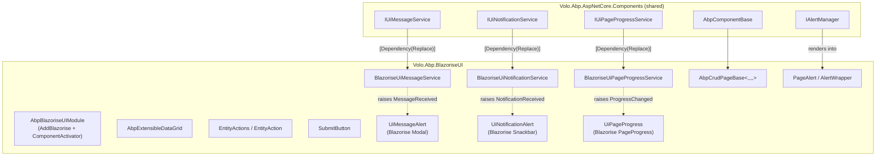

`Volo.Abp.BlazoriseUI` is the cross-host UI component library that powers every Blazor page in an ABP application. It is built on top of **Blazorise** (`Blazorise`, `Blazorise.Bootstrap5`, `Blazorise.Snackbar`, `Blazorise.DataGrid`) and translates the framework's abstract `IUiMessageService`, `IUiNotificationService`, `IUiPageProgressService`, and `IAlertManager` contracts into concrete Blazorise modal, snackbar, page-progress, and alert components. Every Blazor host — [Server](/blazor/components-server), [WebAssembly](/blazor/components-webassembly), [MAUI Blazor](/blazor/components-mauiblazor) — references this single package, which is why the same `AbpCrudPageBase<,,>` or `AbpExtensibleDataGrid<TItem>` works identically in all three.

<Info>
**Package**: [`framework/src/Volo.Abp.BlazoriseUI/`](https://github.com/abpframework/abp/tree/dev/framework/src/Volo.Abp.BlazoriseUI). Module class: [`AbpBlazoriseUIModule`](https://github.com/abpframework/abp/blob/dev/framework/src/Volo.Abp.BlazoriseUI/AbpBlazoriseUIModule.cs).
</Info>

## The wiring layer



Three services — `BlazoriseUiMessageService`, `BlazoriseUiNotificationService`, `BlazoriseUiPageProgressService` — replace the shared contracts with event-based publishers. The matching components (`UiMessageAlert`, `UiNotificationAlert`, `UiPageProgress`) subscribe to those events from inside a layout and render the actual Blazorise widgets.

## `AbpBlazoriseUIModule`

The module class lives in `framework/src/Volo.Abp.BlazoriseUI/AbpBlazoriseUIModule.cs`:

```csharp
[DependsOn(
    typeof(AbpAspNetCoreComponentsWebModule),
    typeof(AbpDddApplicationContractsModule),
    typeof(AbpAuthorizationModule),
    typeof(AbpGlobalFeaturesModule),
    typeof(AbpFeaturesModule)
)]
public class AbpBlazoriseUIModule : AbpModule
{
    public override void ConfigureServices(ServiceConfigurationContext context)
    {
        ConfigureBlazorise(context);
    }

    private void ConfigureBlazorise(ServiceConfigurationContext context)
    {
        context.Services.AddBlazorise(options =>
        {
            options.Debounce = true;
            options.DebounceInterval = 800;
        });

        context.Services.Replace(ServiceDescriptor.Scoped<IComponentActivator, ComponentActivator>());
        context.Services.AddSingleton(typeof(AbpBlazorMessageLocalizerHelper<>));
    }
}
```

`AddBlazorise` is the call that registers Blazorise's own DI services. ABP enables **debounce** by default (800ms) so an `<TextEdit>` `Changed` event doesn't fire on every keystroke. The explicit `IComponentActivator` replacement is what lets Blazorise instantiate components that ABP's interception or extensibility layer has wrapped — without it, dynamically-generated components fail to construct. `AbpBlazorMessageLocalizerHelper<>` is the open generic that lets Blazorise's localization keys fall through to ABP's `IStringLocalizer` pipeline.

The dependencies are deliberate: `AbpAspNetCoreComponentsWebModule` for `AbpComponentBase`, `AbpDddApplicationContractsModule` for `ICrudAppService<,,>`, and `AbpAuthorization/Features/GlobalFeatures` because `AbpCrudPageBase<>` consults all of them when deciding whether to show a button.

## The three event-publishing services

Each service replaces the shared abstraction with a `[Dependency(ReplaceServices = true)]` scoped implementation that raises a CLR event:

<Tabs>
<Tab title="BlazoriseUiMessageService">
```csharp
// BlazoriseUiMessageService.cs
[Dependency(ReplaceServices = true)]
public class BlazoriseUiMessageService : IUiMessageService, IScopedDependency
{
    public event EventHandler<UiMessageEventArgs>? MessageReceived;

    private readonly IStringLocalizer<AbpUiResource> localizer;
    public ILogger<BlazoriseUiMessageService> Logger { get; set; }

    public BlazoriseUiMessageService(IStringLocalizer<AbpUiResource> localizer)
    {
        this.localizer = localizer;
        Logger = NullLogger<BlazoriseUiMessageService>.Instance;
    }

    public Task Info(string message, string? title = null, Action<UiMessageOptions>? options = null)
    {
        var uiMessageOptions = CreateDefaultOptions();
        options?.Invoke(uiMessageOptions);
        MessageReceived?.Invoke(this, new UiMessageEventArgs(
            UiMessageType.Info, message, title, uiMessageOptions));
        return Task.CompletedTask;
    }
    // …Success / Warn / Error / Confirm…
}
```
</Tab>
<Tab title="BlazoriseUiNotificationService">
```csharp
// BlazoriseUiNotificationService.cs
[Dependency(ReplaceServices = true)]
public class BlazoriseUiNotificationService : IUiNotificationService, IScopedDependency
{
    public event EventHandler<UiNotificationEventArgs>? NotificationReceived;

    public Task Info(string message, string? title = null, Action<UiNotificationOptions>? options = null)
    {
        var uiNotificationOptions = CreateDefaultOptions();
        options?.Invoke(uiNotificationOptions);
        NotificationReceived?.Invoke(this, new UiNotificationEventArgs(
            UiNotificationType.Info, message, title, uiNotificationOptions));
        return Task.CompletedTask;
    }
    // …Success / Warn / Error…
}
```
</Tab>
<Tab title="BlazoriseUiPageProgressService">
```csharp
// BlazoriseUiPageProgressService.cs
[Dependency(ReplaceServices = true)]
public class BlazoriseUiPageProgressService : IUiPageProgressService, IScopedDependency
{
    public event EventHandler<UiPageProgressEventArgs>? ProgressChanged;

    public Task Go(int? percentage, Action<UiPageProgressOptions>? options = null)
    {
        var uiPageProgressOptions = CreateDefaultOptions();
        options?.Invoke(uiPageProgressOptions);
        ProgressChanged?.Invoke(this, new UiPageProgressEventArgs(percentage, uiPageProgressOptions));
        return Task.CompletedTask;
    }
}
```
</Tab>
</Tabs>

The pattern is identical: a method on the public contract creates an options DTO, invokes any caller-supplied configurator, and fires an event. The matching `UiMessageAlert`, `UiNotificationAlert`, and `UiPageProgress` components in `Components/` subscribe to those events from `OnInitialized` and call `await InvokeAsync(StateHasChanged)` so the Blazorise modal/snackbar/progress bar appears or moves.

<Note>
The services are **scoped**, which means each Blazor circuit (in Server) or each WASM session has its own service instance and its own subscriber list. Disposing the rendered layout disposes the subscription, so there is no event-handler leak between users.
</Note>

## `AbpCrudPageBase<,,>`

The headline component is the abstract CRUD page base in `AbpCrudPageBase.cs`. The five generic-arity overloads chain to one another so a derived page can specify only the arguments it actually needs:

```csharp
public abstract class AbpCrudPageBase<TAppService, TEntityDto, TKey>
    : AbpCrudPageBase<TAppService, TEntityDto, TKey, PagedAndSortedResultRequestDto>
    where TAppService : ICrudAppService<TEntityDto, TKey>
    where TEntityDto : class, IEntityDto<TKey>, new() { }

public abstract class AbpCrudPageBase<TAppService, TEntityDto, TKey, TGetListInput>
    : AbpCrudPageBase<TAppService, TEntityDto, TKey, TGetListInput, TEntityDto>
    where TAppService : ICrudAppService<TEntityDto, TKey, TGetListInput>
    where TEntityDto : class, IEntityDto<TKey>, new()
    where TGetListInput : new() { }

public abstract class AbpCrudPageBase<TAppService, TEntityDto, TKey, TGetListInput, TCreateInput>
    : AbpCrudPageBase<TAppService, TEntityDto, TKey, TGetListInput, TCreateInput, TCreateInput>
    // …
{ }
// …deeper overloads for CreateInput / UpdateInput / DTO mappings…
```

The deepest overload defines the actual machinery: it injects `TAppService`, knows how to call `GetListAsync`, `CreateAsync`, `UpdateAsync`, `DeleteAsync`, manages a Blazorise `<Modal>` for the create/edit dialog via `AbpBlazoriseUiModalExtensions.CancelClosingModalWhenFocusLost`, and exposes overridable hooks for breadcrumbs, toolbar buttons, entity actions, and authorization (`AuthorizationService.IsGrantedAsync(...)`).

A consuming page derives from it like this:

```razor
@page "/products"
@inherits AbpCrudPageBase<IProductAppService, ProductDto, Guid, GetProductsInput, CreateUpdateProductDto>

<PageHeader Title="@L["Products"]"
            BreadcrumbItems="BreadcrumbItems"
            Toolbar="Toolbar" />

<AbpExtensibleDataGrid TItem="ProductDto"
                       Data="Entities"
                       ReadData="OnDataGridReadAsync"
                       TotalItems="TotalCount"
                       ShowPager="true"
                       PageSize="PageSize">
    <Columns>
        <DataGridEntityActionsColumn TItem="ProductDto" />
        <DataGridColumn TItem="ProductDto" Field="@nameof(ProductDto.Name)" Caption="@L["Name"]" />
        <DataGridColumn TItem="ProductDto" Field="@nameof(ProductDto.Price)" Caption="@L["Price"]" />
    </Columns>
</AbpExtensibleDataGrid>
```

Everything else — `OnInitializedAsync`, `GetEntitiesAsync`, `OpenCreateModalAsync`, `OpenEditModalAsync`, `DeleteEntityAsync` — comes from the base class. Override the protected `virtual` hooks to customize behaviour (e.g. add an extra filter to the input DTO before listing, or send a custom toast on a successful create).

## `AbpExtensibleDataGrid<TItem>`

`Components/AbpExtensibleDataGrid.razor.cs` wraps Blazorise's `<DataGrid>` with two ABP-specific features: dynamic columns based on `IObjectExtensionDefinition` and special handling for `ExtraProperties[...]`-style data fields:

```csharp
public partial class AbpExtensibleDataGrid<TItem> : ComponentBase
{
    protected const string DataFieldAttributeName = "Data";

    protected Dictionary<string, DataGridEntityActionsColumn<TItem>> ActionColumns =
        new Dictionary<string, DataGridEntityActionsColumn<TItem>>();

    protected Regex ExtensionPropertiesRegex = new Regex(@"ExtraProperties\[(.*?)\]");

    [Parameter] public IEnumerable<TItem> Data { get; set; } = default!;
    [Parameter] public EventCallback<DataGridReadDataEventArgs<TItem>> ReadData { get; set; }
    // ...many more parameters mirroring Blazorise's DataGrid surface…
}
```

The `ExtensionPropertiesRegex` is how `ExtraProperties["MyField"]` column definitions become live cell values: the grid resolves the `IObjectExtensionPropertyInfo` from `ObjectExtensionPropertyInfoBlazorExtensions` and renders the appropriate editor.

A companion file, `Components/DataGridEntityActionsColumn.razor.cs`, is the column type the grid registers for the per-row action menu (the "..." dropdown).

## `EntityAction` and `EntityActions`

The two components in `Components/EntityActions.razor.cs` and `Components/EntityAction.razor.cs` model the per-row action menu:

```csharp
public partial class EntityActions<TItem> : ComponentBase
{
    protected readonly List<EntityAction<TItem>> Actions = new List<EntityAction<TItem>>();
    protected bool HasPrimaryAction => Actions.Any(t => t.Primary);
    protected EntityAction<TItem>? PrimaryAction => Actions.FirstOrDefault(t => t.Primary);

    [Parameter] public Color ToggleColor { get; set; } = Color.Primary;
    [Parameter] public string? ToggleText { get; set; }
    [Parameter] public RenderFragment ChildContent { get; set; } = default!;
}

public partial class EntityAction<TItem> : ComponentBase
{
    [Parameter] public bool Visible { get; set; } = true;
    [Parameter] public bool Disabled { get; set; } = false;
    internal bool HasPermission { get; set; } = true;
    [Parameter] public string Text { get; set; } = default!;
    [Parameter] public bool Primary { get; set; }
    // ...Icon / Clicked / RequiredPolicy / RequiredFeatures…
}
```

Use them inside a `DataGridEntityActionsColumn`:

```razor
<DataGridEntityActionsColumn TItem="ProductDto">
    <EntityActions TItem="ProductDto" EntityActionsColumn="@EntityActionsColumn">
        <EntityAction TItem="ProductDto"
                      Text="@L["Edit"]"
                      Visible="@CanEdit"
                      Clicked="() => OpenEditModalAsync(context)" />
        <EntityAction TItem="ProductDto"
                      Text="@L["Delete"]"
                      Visible="@CanDelete"
                      Clicked="() => DeleteEntityAsync(context)" />
    </EntityActions>
</DataGridEntityActionsColumn>
```

The internal `HasPermission` flag is set by `AbpCrudPageBase` after it consults `IAuthorizationService` for the `RequiredPolicy` attribute. Actions whose policy fails are hidden, not disabled — the menu collapses cleanly.

## `SubmitButton` and form ergonomics

`Components/SubmitButton.razor.cs` is the canonical "submit a Blazorise `<Form>`" button that handles the submit-in-progress state for you:

```csharp
public partial class SubmitButton : ComponentBase
{
    protected bool Submiting { get; set; }

    [Parameter] public string Form { get; set; } = default!;
    [Parameter] public ButtonType Type { get; set; } = ButtonType.Submit;
    [Parameter] public Color Color { get; set; } = Color.Primary;
    [Parameter] public bool PreventDefaultOnSubmit { get; set; } = true;
    [Parameter] public bool Block { get; set; }
    [Parameter] public bool? Disabled { get; set; }
    [Parameter] public string SaveResourceKey { get; set; } = "Save";
    [Parameter] public EventCallback Clicked { get; set; }
    [Parameter] public RenderFragment? ChildContent { get; set; }

    [Inject] protected IStringLocalizer<AbpUiResource> StringLocalizer { get; set; } = default!;

    protected bool IsDisabled => Disabled == true || Submiting;
    protected bool IsLoading  => Submiting;
    protected string SaveString => StringLocalizer[SaveResourceKey];

    protected virtual async Task OnClickedHandler()
    {
        try
        {
            Submiting = true;
            await Clicked.InvokeAsync(null);
        }
        finally
        {
            Submiting = false;
            await InvokeAsync(StateHasChanged);
        }
    }
}
```

Three behaviours come for free: the button disables during the await, the spinner appears via `IsLoading`, and the localized "Save" caption resolves through `AbpUiResource` so existing translations are reused.

## Modal helpers

`AbpBlazoriseUiModalExtensions.cs` adds a single tiny extension that solves the most common edit-dialog UX bug:

```csharp
public static class AbpBlazoriseUiModalExtensions
{
    public static Task CancelClosingModalWhenFocusLost(this Modal modal, ModalClosingEventArgs eventArgs)
    {
        // cancel close if clicked outside of modal area
        eventArgs.Cancel = eventArgs.CloseReason == CloseReason.FocusLostClosing;
        return Task.CompletedTask;
    }
}
```

Wire it up on a Blazorise modal so a stray click on the backdrop doesn't discard 30 minutes of editing:

```razor
<Modal @ref="EditModal" Closing="@(args => EditModal.CancelClosingModalWhenFocusLost(args))">
    <!-- ... -->
</Modal>
```

## `PageAlert`, `UiMessageAlert`, `UiNotificationAlert`, `UiPageProgress`

These four components are designed to live inside the theme's main layout — drop them once and every page gets toasts, modals, alerts, and a progress bar.

```csharp
// Components/PageAlert.razor.cs
public partial class PageAlert : ComponentBase, IDisposable
{
    private List<AlertWrapper> Alerts = new List<AlertWrapper>();

    [Inject] protected IAlertManager AlertManager { get; set; } = default!;
    [Inject] protected NavigationManager NavigationManager { get; set; } = default!;

    protected override void OnInitialized()
    {
        base.OnInitialized();
        NavigationManager.LocationChanged += NavigationManager_LocationChanged;
        // …subscribe to AlertManager…
    }
}
```

`PageAlert` mirrors the shared `IAlertManager.Alerts` collection into a list of `AlertWrapper`s and re-renders on navigation so per-route alerts disappear when the user moves on.

`UiPageProgress` ([source](https://github.com/abpframework/abp/blob/dev/framework/src/Volo.Abp.BlazoriseUI/Components/UiPageProgress.razor.cs)) subscribes to the page-progress service and forwards the latest percentage to a Blazorise `PageProgress`:

```csharp
public partial class UiPageProgress : ComponentBase, IDisposable
{
    protected PageProgress? PageProgressRef { get; set; }
    protected int? Percentage { get; set; }
    protected bool Visible { get; set; }
    protected Color Color { get; set; } = default!;

    [Inject] protected IUiPageProgressService? UiPageProgressService { get; set; }

    protected override void OnInitialized()
    {
        base.OnInitialized();
        if (UiPageProgressService != null)
        {
            UiPageProgressService.ProgressChanged += OnProgressChanged;
        }
    }
    // ...
}
```

This is the same progress bar that `AbpMauiBlazorClientHttpMessageHandler` and `AbpBlazorClientHttpMessageHandler` increment on every outbound HTTP call — see [`/blazor/components-mauiblazor`](/blazor/components-mauiblazor) and [`/blazor/components-web`](/blazor/components-web).

## `BreadcrumbItem` and toolbar buttons

`BreadcrumbItem.cs` is a small DTO consumed by both `PageHeader` (from the theming package) and `PageLayout.BreadcrumbItems`:

```csharp
public class BreadcrumbItem
{
    public string Text { get; set; }
    public object? Icon { get; set; }
    public string? Url { get; set; }

    public BreadcrumbItem(string text, string? url = null, object? icon = null)
    {
        Text = text;
        Url = url;
        Icon = icon;
    }
}
```

`Components/ToolbarButton.razor.cs` is the standard "+ New" button used by `AbpCrudPageBase`:

```csharp
public partial class ToolbarButton : ComponentBase
{
    [Parameter] public Color? Color { get; set; }
    [Parameter] public object? Icon { get; set; }
    [Parameter] public string Text { get; set; } = default!;
    [Parameter] public Func<Task> Clicked { get; set; } = default!;
    [Parameter] public bool Disabled { get; set; }
}
```

Both keep their parameter surface deliberately small so they can drop into any Blazorise-themed page.

## Object-extension property editors

The folder `Components/ObjectExtending/` contains the editor components that the dynamic extensible-entity infrastructure renders for each `IObjectExtensionPropertyInfo`. `BlazoriseUiObjectExtensionPropertyInfoExtensions.cs` adapts the shared `ObjectExtensionPropertyInfo` to Blazorise edit components, and `BlazoriseExtensionPropertyPolicyChecker.cs` consults `IAuthorizationService` to decide whether the user is allowed to see or edit a custom property. The pair lets a tenant module add a `string TaxNumber` to `IdentityUser` without writing any Razor.

## Using the library in your project

<Steps>
<Step title="Reference the package">
Add `<PackageReference Include="Volo.Abp.BlazoriseUI" />` to the Razor project (Server, WASM, or MAUI Blazor). All three host theming modules already do this transitively through the per-host bundle modules.
</Step>
<Step title="Depend on the module">
Decorate your startup Blazor module with `[DependsOn(typeof(AbpBlazoriseUIModule))]`. Again, this is already done by the host theming modules — only relevant if you author a brand-new theme.
</Step>
<Step title="Drop the alert host components into your layout">
In `MainLayout.razor` (or whichever layout is the root for `StandardLayouts.Application`), include `<PageAlert />`, `<UiMessageAlert />`, `<UiNotificationAlert />`, and `<UiPageProgress />` so every page benefits.
</Step>
<Step title="Inherit `AbpCrudPageBase` for list/detail screens">
Use the deepest overload that matches your `ICrudAppService` signature; override hooks (`OnGetEntitiesAsync`, `OpenCreateModalAsync`, etc.) only when you need custom behaviour.
</Step>
<Step title="Use `AbpExtensibleDataGrid` for grids">
Bind `Data`, `ReadData`, and `TotalItems`. Declare `DataGridEntityActionsColumn` to render the per-row "..." menu and place `EntityAction` children inside it.
</Step>
</Steps>

## Theme integration

The Blazorise UI library is theme-agnostic — every contributor list in [`/blazor/bundling`](/blazor/bundling) already adds the four CSS files Blazorise needs (`blazorise.css`, `blazorise.bootstrap5.css`, `blazorise.snackbar.css`, `volo.abp.blazoriseui.css`). A custom `ITheme` ([`/blazor/theming`](/blazor/theming)) does not need to do anything special to opt in.

## Source map

<Accordion title="framework/src/Volo.Abp.BlazoriseUI/ (root)">
- `AbpBlazoriseUIModule.cs` — the module class (depends on Components.Web + DDD Contracts + Authorization + Features + GlobalFeatures).
- `AbpCrudPageBase.cs` — the five-overload CRUD base class.
- `BlazoriseUiMessageService.cs` / `BlazoriseUiNotificationService.cs` / `BlazoriseUiPageProgressService.cs` — `[Dependency(ReplaceServices = true)]` replacements for the shared UI contracts.
- `AbpBlazoriseUiModalExtensions.cs` — `CancelClosingModalWhenFocusLost`.
- `BreadcrumbItem.cs` — breadcrumb DTO used by `PageLayout.BreadcrumbItems`.
- `BlazoriseExtensionPropertyPolicyChecker.cs` — gate object-extension properties by authorization policy.
- `BlazoriseUiObjectExtensionPropertyInfoExtensions.cs` + `ObjectExtensionPropertyInfoBlazorExtensions.cs` — adapt `IObjectExtensionPropertyInfo` to Blazorise editors.
- `_Imports.razor` — the implicit `@using` directives for `Blazorise` + `Blazorise.Snackbar`.
</Accordion>

<Accordion title="framework/src/Volo.Abp.BlazoriseUI/Components/">
- `AbpExtensibleDataGrid.razor` + `.razor.cs` — the dynamic-column DataGrid wrapper.
- `DataGridEntityActionsColumn.razor` + `.razor.cs` — the column type that hosts per-row actions.
- `EntityActions.razor` + `.razor.cs` — the dropdown / inline button group host.
- `EntityAction.razor` + `.razor.cs` — single action with `Visible`, `Disabled`, `Primary`, `Clicked`, `RequiredPolicy`.
- `SubmitButton.razor` + `.razor.cs` — submit button with built-in spinner.
- `ToolbarButton.razor` + `.razor.cs` — toolbar "+ New" button.
- `PageAlert.razor` + `.razor.cs` + `AlertWrapper.cs` + `ActionType.cs` — render `IAlertManager.Alerts` per route.
- `UiMessageAlert.razor` + `.razor.cs` — the Blazorise `Modal` used for confirm/info/success/warn/error.
- `UiNotificationAlert.razor` + `.razor.cs` — the Blazorise `Snackbar` used for toasts.
- `UiPageProgress.razor` + `.razor.cs` — the Blazorise `PageProgress` used by every outbound HTTP call.
- `RadarSpinner.razor` — animated spinner used inside `UiPageProgress`.
- `ObjectExtending/` — dynamic property editors for the object-extension system.
</Accordion>

## Where to read next

<CardGroup cols={2}>
  <Card title="Shared Web layer" icon="cube" href="/blazor/components-web">
    `AbpComponentBase`, `IUiMessageService`, `IUiNotificationService`, `IAlertManager`, `AbpComponentsClaimsCache` — the contracts these components implement.
  </Card>
  <Card title="Theming" icon="palette" href="/blazor/theming">
    `IThemeManager`, `PageLayout`, `PageHeader` — where these UI primitives are dropped in.
  </Card>
  <Card title="Bundling" icon="boxes-stacked" href="/blazor/bundling">
    `volo.abp.blazoriseui.css` and the Blazorise CSS chain inside the global asset.
  </Card>
  <Card title="Blazor Server host" icon="server" href="/blazor/components-server">
    The host that ships these components inside a SignalR circuit.
  </Card>
  <Card title="Blazor WebAssembly host" icon="browser" href="/blazor/components-webassembly">
    The host that ships these components inside the browser runtime.
  </Card>
  <Card title="MAUI Blazor host" icon="mobile" href="/blazor/components-mauiblazor">
    The host that ships these components inside a `BlazorWebView`.
  </Card>
</CardGroup>
