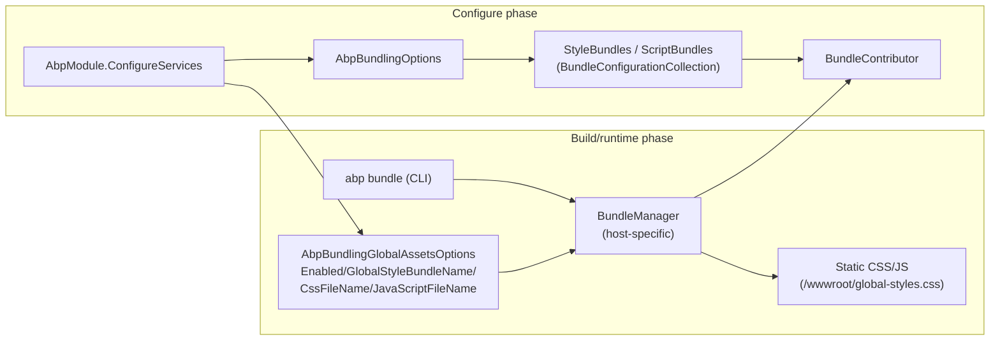

ABP's Blazor stack reuses the **MVC bundling pipeline** from `Volo.Abp.AspNetCore.Mvc.UI.Bundling` to compose third-party styles and scripts into a single CSS and a single JS file. The same `AbpBundlingOptions`, `BundleContributor` base class, and `BundleConfigurationContext` are used whether you target Blazor Server, Blazor WebAssembly, or MAUI Blazor — only the host-specific manager and delivery mechanism differ. This page maps the contributors, the registries, and the `abp bundle` CLI command that turns the pieces into shippable assets.

<Info>
**Packages**: `framework/src/Volo.Abp.AspNetCore.Mvc.UI.Bundling.Abstractions/` (the contracts), `framework/src/Volo.Abp.AspNetCore.Components.Server.Theming/Bundling/` (server bundles), `framework/src/Volo.Abp.AspNetCore.Components.WebAssembly.Theming.Bundling/` (WASM bundles), `framework/src/Volo.Abp.AspNetCore.Components.MauiBlazor.Bundling/` (MAUI bundles), and `modules/basic-theme/src/Volo.Abp.AspNetCore.Components.Web.BasicTheme/` (a theme-specific contributor pair).
</Info>

## The pipeline



A theme module **registers contributors against a named bundle**. Either the runtime `BundleManager` (Server, MAUI) or the `abp bundle` CLI (WASM) walks the contributors, resolves the file list, optionally minifies, and writes the result.

## `AbpBundlingOptions`

The shared options class lives in `framework/src/Volo.Abp.AspNetCore.Mvc.UI.Bundling.Abstractions/Volo/Abp/AspNetCore/Mvc/UI/Bundling/AbpBundlingOptions.cs`:

```csharp
public class AbpBundlingOptions
{
    public BundleConfigurationCollection StyleBundles { get; }
    public BundleConfigurationCollection ScriptBundles { get; }
    public HashSet<string> MinificationIgnoredFiles { get; }

    public string BundleFolderName { get; } = "__bundles";
    public BundlingMode Mode { get; set; } = BundlingMode.Auto;

    public bool DeferScriptsByDefault { get; set; }
    public List<string> DeferScripts { get; }

    public bool PreloadStylesByDefault { get; set; }
    public List<string> PreloadStyles { get; }

    public AbpBundlingGlobalAssetsOptions GlobalAssets { get; set; }
    public BundleParameterDictionary Parameters { get; set; }

    public AbpBundlingOptions()
    {
        StyleBundles = new BundleConfigurationCollection();
        ScriptBundles = new BundleConfigurationCollection();
        MinificationIgnoredFiles = new HashSet<string>();
        // ...
        GlobalAssets = new AbpBundlingGlobalAssetsOptions();
        Parameters = new BundleParameterDictionary();
    }
}
```

Key properties for Blazor:

- `StyleBundles` / `ScriptBundles` — named bundle definitions, each with a contributor list.
- `Mode` — `Auto`, `None`, `Bundle`, or `BundleAndMinify`. `None` is useful in dev because it emits each file as a comment-headed concatenation rather than a minified blob.
- `MinificationIgnoredFiles` — files that must be served verbatim (Microsoft's `AuthenticationService.js` is the canonical example).
- `GlobalAssets` — the per-host "produce one CSS and one JS file" switch. WASM and MAUI flip this on; classic Blazor Server leaves it off and lets the in-request bundling middleware do the work.

## `BundleContributor`

The contributor base class in `BundleContributor.cs` lives in the same `Bundling.Abstractions` package:

```csharp
public abstract class BundleContributor : IBundleContributor
{
    public virtual void PreConfigureBundle(BundleConfigurationContext context) { }
    public virtual void ConfigureBundle(BundleConfigurationContext context) { }
    public virtual void PostConfigureBundle(BundleConfigurationContext context) { }
    // ...async variants…
}
```

Three phases: `PreConfigureBundle` runs before all contributors, `ConfigureBundle` is the main hook where most contributors add files, and `PostConfigureBundle` runs last (rarely needed). Contributors can also depend on other contributors with `[DependsOn(typeof(OtherContributor))]` so a higher-level contributor can pull in Bootstrap, FontAwesome, etc. automatically.

The concrete Blazor server style contributor demonstrates the pattern:

```csharp
// framework/src/Volo.Abp.AspNetCore.Components.Server.Theming/Bundling/BlazorGlobalStyleContributor.cs
[DependsOn(
    typeof(BootstrapStyleContributor),
    typeof(FontAwesomeStyleContributor)
)]
public class BlazorGlobalStyleContributor : BundleContributor
{
    public override void ConfigureBundle(BundleConfigurationContext context)
    {
        context.Files.AddIfNotContains("/_content/Volo.Abp.AspNetCore.Components.Web/libs/abp/css/abp.css");
        context.Files.AddIfNotContains("/_content/Blazorise/blazorise.css");
        context.Files.AddIfNotContains("/_content/Blazorise.Bootstrap5/blazorise.bootstrap5.css");
        context.Files.AddIfNotContains("/_content/Blazorise.Snackbar/blazorise.snackbar.css");
        context.Files.AddIfNotContains("/_content/Volo.Abp.BlazoriseUI/volo.abp.blazoriseui.css");
    }
}
```

Each file path is a static-asset URL inside the Blazor app's content tree. `AddIfNotContains` is the safe idempotent add — a contributor that runs twice (because two modules depend on it) won't duplicate files in the output.

The matching script contributor is even smaller — it skips the Blazor JavaScript when running under a Blazor Web App since the host emits it directly:

```csharp
// BlazorGlobalScriptContributor.cs
public class BlazorGlobalScriptContributor : BundleContributor
{
    public override void ConfigureBundle(BundleConfigurationContext context)
    {
        var options = context.ServiceProvider
            .GetRequiredService<IOptions<AbpAspNetCoreComponentsWebOptions>>().Value;
        if (!options.IsBlazorWebApp)
        {
            context.Files.AddIfNotContains("/_framework/blazor.server.js");
        }
        context.Files.AddIfNotContains("/_content/Volo.Abp.AspNetCore.Components.Web/libs/abp/js/abp.js");
        context.Files.AddIfNotContains("/_content/Volo.Abp.AspNetCore.Components.Web/libs/abp/js/authentication-state-listener.js");
    }
}
```

## The standard bundle registries

Each host package ships a tiny static class with the names that other modules will register against. These three are the canonical entry points:

<Tabs>
<Tab title="Blazor Server">
```csharp
// framework/src/Volo.Abp.AspNetCore.Components.Server.Theming/Bundling/BlazorGlobalBundles.cs
public class BlazorStandardBundles
{
    public static class Styles
    {
        public static string Global = "Blazor.Global";
    }

    public static class Scripts
    {
        public static string Global = "Blazor.Global";
    }
}
```
Registered by `AbpAspNetCoreComponentsServerThemingModule`.
</Tab>
<Tab title="Blazor WebAssembly">
```csharp
// framework/src/Volo.Abp.AspNetCore.Components.WebAssembly.Theming.Bundling/BlazorWebAssemblyStandardBundles.cs
public class BlazorWebAssemblyStandardBundles
{
    public static class Styles
    {
        public static string Global = "BlazorWebAssembly.Global";
    }

    public static class Scripts
    {
        public static string Global = "BlazorWebAssembly.Global";
    }
}
```
Registered by `AbpAspNetCoreComponentsWebAssemblyThemingBundlingModule`.
</Tab>
<Tab title="Basic Theme (Server)">
```csharp
// modules/basic-theme/src/Volo.Abp.AspNetCore.Components.Server.BasicTheme/Bundling/BlazorBasicThemeBundles.cs
public class BlazorBasicThemeBundles
{
    public static class Styles
    {
        public static string Global = "Blazor.BasicTheme.Global";
    }

    public static class Scripts
    {
        public static string Global = "Blazor.BasicTheme.Global";
    }
}
```
The theme adds itself **on top** of the standard bundle via `AddBaseBundles(...)` — see below.
</Tab>
</Tabs>

## Server: registering bundles in the theming module

`framework/src/Volo.Abp.AspNetCore.Components.Server.Theming/AbpAspNetCoreComponentsServerThemingModule.cs` registers the bundle and its contributors in `ConfigureServices`:

```csharp
public override void ConfigureServices(ServiceConfigurationContext context)
{
    Configure<AbpBundlingOptions>(options =>
    {
        options.StyleBundles.Add(BlazorStandardBundles.Styles.Global, bundle =>
        {
            bundle.AddContributors(typeof(BlazorGlobalStyleContributor));
        });

        options.ScriptBundles.Add(BlazorStandardBundles.Scripts.Global, bundle =>
        {
            bundle.AddContributors(typeof(BlazorGlobalScriptContributor));
        });
    });
}
```

A theme on top extends the same bundle name with extra contributors via `AddBaseBundles`. The basic theme server module shows the inheritance pattern:

```csharp
// modules/basic-theme/src/Volo.Abp.AspNetCore.Components.Server.BasicTheme/AbpAspNetCoreComponentsServerBasicThemeModule.cs
Configure<AbpBundlingOptions>(options =>
{
    options.StyleBundles.Add(BlazorBasicThemeBundles.Styles.Global, bundle =>
    {
        bundle
            .AddBaseBundles(BlazorStandardBundles.Styles.Global)
            .AddContributors(typeof(BlazorBasicThemeStyleContributor));
    });

    options.ScriptBundles.Add(BlazorBasicThemeBundles.Scripts.Global, bundle =>
    {
        bundle
            .AddBaseBundles(BlazorStandardBundles.Scripts.Global)
            .AddContributors(typeof(BlazorBasicThemeScriptContributor));
    });
});
```

`AddBaseBundles` pulls all of `Blazor.Global`'s files first, then `BlazorBasicThemeStyleContributor` appends `theme.css`. The new bundle `Blazor.BasicTheme.Global` becomes the one your `_Host.cshtml` references.

```csharp
// modules/basic-theme/src/Volo.Abp.AspNetCore.Components.Server.BasicTheme/Bundling/BlazorBasicThemeStyleContributor.cs
public class BlazorBasicThemeStyleContributor : BundleContributor
{
    public override void ConfigureBundle(BundleConfigurationContext context)
    {
        context.Files.AddIfNotContains(
            "/_content/Volo.Abp.AspNetCore.Components.Web.BasicTheme/libs/abp/css/theme.css");
    }
}
```

## WebAssembly: GlobalAssets and the build-time bundle

`framework/src/Volo.Abp.AspNetCore.Components.WebAssembly.Theming.Bundling/AbpAspNetCoreComponentsWebAssemblyThemingBundlingModule.cs` flips on global-assets generation:

```csharp
public override void ConfigureServices(ServiceConfigurationContext context)
{
    Configure<AbpBundlingOptions>(options =>
    {
        options.GlobalAssets.Enabled = true;
        options.GlobalAssets.GlobalStyleBundleName = BlazorWebAssemblyStandardBundles.Styles.Global;
        options.GlobalAssets.GlobalScriptBundleName = BlazorWebAssemblyStandardBundles.Scripts.Global;

        options.StyleBundles.Add(BlazorWebAssemblyStandardBundles.Styles.Global, bundle =>
        {
            bundle.AddContributors(typeof(BlazorWebAssemblyStyleContributor));
        });

        options.ScriptBundles.Add(BlazorWebAssemblyStandardBundles.Scripts.Global, bundle =>
        {
            bundle.AddContributors(typeof(BlazorWebAssemblyScriptContributor));
        });

        options.MinificationIgnoredFiles.Add(
            "_content/Microsoft.AspNetCore.Components.WebAssembly.Authentication/AuthenticationService.js");
    });
}
```

`AbpBundlingGlobalAssetsOptions` declares which bundle is the "global" bundle for the host. The CLI uses those names to emit a single static CSS and JS file inside `wwwroot/` so the WASM `index.html` only needs two `<link>` / `<script>` tags. The companion `BlazorWebAssemblyStyleContributor` enumerates the actual files:

```csharp
public class BlazorWebAssemblyStyleContributor : BundleContributor
{
    public override void ConfigureBundle(BundleConfigurationContext context)
    {
        context.Files.AddIfNotContains("_content/Volo.Abp.AspNetCore.Components.WebAssembly.Theming/libs/bootstrap/css/bootstrap.min.css");
        context.Files.AddIfNotContains("_content/Volo.Abp.AspNetCore.Components.WebAssembly.Theming/libs/fontawesome/css/all.css");
        context.Files.AddIfNotContains("_content/Volo.Abp.AspNetCore.Components.Web/libs/abp/css/abp.css");
        context.Files.AddIfNotContains("_content/Volo.Abp.AspNetCore.Components.WebAssembly.Theming/libs/flag-icon/css/flag-icon.css");
        context.Files.AddIfNotContains("_content/Blazorise/blazorise.css");
        context.Files.AddIfNotContains("_content/Blazorise.Bootstrap5/blazorise.bootstrap5.css");
        context.Files.AddIfNotContains("_content/Blazorise.Snackbar/blazorise.snackbar.css");
        context.Files.AddIfNotContains("_content/Volo.Abp.BlazoriseUI/volo.abp.blazoriseui.css");
    }
}
```

The basic-theme bundling module from the basic-theme repo then **adds itself on top** of the global bundle by re-fetching it via `options.StyleBundles.Get(...).AddContributors(...)`:

```csharp
// modules/basic-theme/src/Volo.Abp.AspNetCore.Components.WebAssembly.BasicTheme.Bundling/AbpAspNetCoreComponentsWebAssemblyBasicThemeBundlingModule.cs
[DependsOn(typeof(AbpAspNetCoreComponentsWebAssemblyThemingBundlingModule))]
public class AbpAspNetCoreComponentsWebAssemblyBasicThemeBundlingModule : AbpModule
{
    public override void ConfigureServices(ServiceConfigurationContext context)
    {
        Configure<AbpBundlingOptions>(options =>
        {
            var globalStyles = options.StyleBundles.Get(BlazorWebAssemblyStandardBundles.Styles.Global);
            globalStyles.AddContributors(typeof(BasicThemeBundleStyleContributor));
        });
    }
}

public class BasicThemeBundleStyleContributor : BundleContributor
{
    public override void ConfigureBundle(BundleConfigurationContext context)
    {
        context.Files.AddIfNotContains(
            "_content/Volo.Abp.AspNetCore.Components.Web.BasicTheme/libs/abp/css/theme.css");
    }
}
```

## The `abp bundle` CLI command

`framework/src/Volo.Abp.Cli.Core/Volo/Abp/Cli/Commands/BundleCommand.cs` is the entry point users invoke at build time:

```csharp
public class BundleCommand : IConsoleCommand, ITransientDependency
{
    public const string Name = "bundle";

    public ILogger<BundleCommand> Logger { get; set; }
    public IBundlingService BundlingService { get; set; }

    public async Task ExecuteAsync(CommandLineArgs commandLineArgs)
    {
        var workingDirectoryArg = commandLineArgs.Options.GetOrNull(
            Options.WorkingDirectory.Short, Options.WorkingDirectory.Long);
        var workingDirectory = workingDirectoryArg ?? Directory.GetCurrentDirectory();

        var forceBuild = commandLineArgs.Options.ContainsKey(Options.ForceBuild.Short) ||
                         commandLineArgs.Options.ContainsKey(Options.ForceBuild.Long);

        var projectType = GetProjectType(commandLineArgs);

        if (!Directory.Exists(workingDirectory))
        {
            throw new CliUsageException("Specified directory does not exist." + /* … */);
        }

        await BundlingService.BundleAsync(workingDirectory, forceBuild, projectType);
    }

    public static string GetShortDescription()
        => "Bundles all third party styles and scripts required by modules and updates index.html file.";
    // ...
}
```

The usage information the command prints in `GetUsageInfo()`:

```
Usage:

  abp bundle [options]

Options:

-wd|--working-directory <directory-path>                (default: empty)
-f | --force                                            (default: false)
-t | --project-type                                     (default: webassembly)
```

`GetProjectType` accepts only two values, defined in `BundlingConsts`:

```csharp
private string GetProjectType(CommandLineArgs commandLineArgs)
{
    var projectType = commandLineArgs.Options.GetOrNull(Options.ProjectType.Short, Options.ProjectType.Long);
    projectType ??= BundlingConsts.WebAssembly;

    return projectType.ToLower() switch
    {
        "webassembly" => BundlingConsts.WebAssembly,
        "maui-blazor" => BundlingConsts.MauiBlazor,
        _ => throw new CliUsageException(/* ... */)
    };
}
```

<Note>
Server-side Blazor does **not** need `abp bundle`. The MVC bundling middleware reads `AbpBundlingOptions` at request time and serves the bundle out of `~/__bundles/Blazor.BasicTheme.Global.css` (where `__bundles` is `AbpBundlingOptions.BundleFolderName`). Only WASM and MAUI need the build-time emission because they have no server to do bundling on the fly.
</Note>

### Typical CLI invocations

<Tabs>
<Tab title="WebAssembly client">
```bash
cd src/MyCompany.MyApp.Blazor
abp bundle
```
Defaults to `--project-type webassembly`, reads the project's bundle registrations, emits `wwwroot/global-styles.css` and `wwwroot/global-scripts.js`, and patches `wwwroot/index.html` to reference them.
</Tab>
<Tab title="MAUI Blazor app">
```bash
cd src/MyCompany.MyApp.MauiBlazor
abp bundle --project-type maui-blazor
```
Emits the same pair of files into the MAUI project's `wwwroot/` folder; at runtime they are served by `MauiBlazorContentFileProvider`. See [`/blazor/components-mauiblazor`](/blazor/components-mauiblazor).
</Tab>
<Tab title="Force rebuild">
```bash
abp bundle --force --project-type maui-blazor
```
`-f`/`--force` re-runs `dotnet build` against the project before bundling so the contributor types are loaded from a fresh build output.
</Tab>
</Tabs>

## `IComponentBundleManager`

For the cases where the Razor markup needs to know "which files belong to my bundle?" — e.g. when `MainLayout` enumerates the icon set — the framework exposes `IComponentBundleManager` (in `Bundling/IComponentBundleManager.cs` of `Volo.Abp.AspNetCore.Components.Web.Theming`):

```csharp
public interface IComponentBundleManager
{
    Task<IReadOnlyList<string>> GetStyleBundleFilesAsync(string bundleName);
    Task<IReadOnlyList<string>> GetScriptBundleFilesAsync(string bundleName);
}
```

Each host has a different implementation:

- `BlazorServerComponentBundleManager` (in `framework/src/Volo.Abp.AspNetCore.Components.Server.Theming/Bundling/`) delegates to the runtime `IBundleManager` from MVC bundling.
- `WebAssemblyComponentBundleManager` (in `framework/src/Volo.Abp.AspNetCore.Components.WebAssembly.Theming/`) returns empty lists because the global asset *is* the bundle.
- `BundleManager` (in `framework/src/Volo.Abp.AspNetCore.Components.MauiBlazor.Bundling/`) blends `BundleManagerBase` with `IMauiBlazorContentFileProvider`.

## CSS path adjustment

When the MAUI bundling module runs in `BundlingMode.None`, it calls `CssRelativePath.Adjust` on each style file:

```csharp
// AbpAspNetCoreComponentsMauiBlazorBundlingModule.cs
if (!bundleManager.IsBundlingEnabled())
{
    fileContent = CssRelativePath.Adjust(
        fileContent,
        file.FileName,
        Path.Combine(Directory.GetCurrentDirectory(), "wwwroot"));

    styles += $"/*{file.FileName}*/{Environment.NewLine}{fileContent}{Environment.NewLine}{Environment.NewLine}";
}
```

This rewrites `url(./fonts/font.woff)` references inside the CSS so they keep working once every file is concatenated into a single `global-styles.css`. Bundled mode does not need this rewrite because the bundling toolchain re-bases relative URLs as part of minification.

## Designing a bundle contributor

<Steps>
<Step title="Decide which bundle name to register against">
For a WASM client, that is almost always `BlazorWebAssemblyStandardBundles.Styles.Global` or `BlazorWebAssemblyStandardBundles.Scripts.Global`. For a server module, target `BlazorStandardBundles.*` or the basic theme's `Blazor.BasicTheme.Global` if you specifically need to layer on top of the theme.
</Step>
<Step title="Inherit `BundleContributor`">
Override `ConfigureBundle`, call `context.Files.AddIfNotContains("/_content/MyPackage/css/my.css")` for each asset. Use `[DependsOn(typeof(OtherContributor))]` to compose contributors when your CSS depends on Bootstrap or Blazorise being already injected.
</Step>
<Step title="Register the contributor in a module">
Either add a new bundle (`options.StyleBundles.Add("MyBundle", b => b.AddContributors(typeof(MyContributor)))`) or append to an existing one (`options.StyleBundles.Get("Blazor.Global").AddContributors(typeof(MyContributor))`).
</Step>
<Step title="Match the host's wiring">
For Server you depend on `AbpAspNetCoreComponentsServerThemingModule`; for WASM you depend on `AbpAspNetCoreComponentsWebAssemblyThemingBundlingModule`; for MAUI you depend on `AbpAspNetCoreComponentsMauiBlazorBundlingModule` so the appropriate manager picks up your contributor.
</Step>
<Step title="Re-run `abp bundle` for WASM/MAUI projects">
The CLI does **not** watch your codebase. Any time you add or remove a contributor that affects the global bundle, run `abp bundle -t webassembly` (or `-t maui-blazor`) from the project folder, then redeploy `wwwroot/`.
</Step>
</Steps>

## Source map

<Accordion title="framework/src/Volo.Abp.AspNetCore.Mvc.UI.Bundling.Abstractions/">
- `AbpBundlingOptions.cs` — the shared options.
- `BundleContributor.cs` — abstract base for contributors.
- `BundleConfigurationContext.cs` + `BundleConfigurationCollection.cs` — bundle definitions and per-call context.
- `BundleContributorCollection.cs` + `BundleContributorCollectionExtensions.cs` — contributor list helpers.
- `AbpBundlingGlobalAssetsOptions.cs` — global-asset switch used by WASM/MAUI.
- `BundlingMode.cs` — `Auto`, `None`, `Bundle`, `BundleAndMinify`.
</Accordion>

<Accordion title="framework/src/Volo.Abp.AspNetCore.Components.Server.Theming/Bundling/">
- `BlazorGlobalBundles.cs` — `BlazorStandardBundles.{Styles,Scripts}.Global` constants.
- `BlazorGlobalStyleContributor.cs` — Bootstrap + FontAwesome + abp.css + Blazorise + BlazoriseUI.
- `BlazorGlobalScriptContributor.cs` — `blazor.server.js` (unless Blazor Web App) + `abp.js` + auth-state listener.
- `BlazorServerComponentBundleManager.cs` — `IComponentBundleManager` over `IBundleManager`.
</Accordion>

<Accordion title="framework/src/Volo.Abp.AspNetCore.Components.WebAssembly.Theming.Bundling/">
- `AbpAspNetCoreComponentsWebAssemblyThemingBundlingModule.cs` — enables `GlobalAssets`, registers the bundle, pins `AuthenticationService.js` as un-minifiable.
- `BlazorWebAssemblyStandardBundles.cs` — `Styles.Global` and `Scripts.Global` constants.
- `BlazorWebAssemblyStyleContributor.cs` + `BlazorWebAssemblyScriptContributor.cs` — the contributor pair.
</Accordion>

<Accordion title="framework/src/Volo.Abp.AspNetCore.Components.MauiBlazor.Bundling/">
- `Volo/Abp/AspNetCore/Components/MauiBlazor/Bundling/AbpAspNetCoreComponentsMauiBlazorBundlingModule.cs` — runs `InitialGlobalAssetsAsync` on startup, writes the combined CSS/JS into `IDynamicFileProvider`.
- `Volo/Abp/AspNetCore/Components/MauiBlazor/Bundling/BundleManager.cs` + `MauiBlazorBundlerBase.cs` — `BundleManagerBase` subclass.
- `Volo/Abp/AspNetCore/Components/MauiBlazor/Bundling/AbpBlazorWebView.cs` + `IMauiBlazorContentFileProvide.cs` + `MauiBlazorContentFileProvider.cs` — how the WebView reaches the runtime bundle.
- `Volo/Abp/AspNetCore/Components/MauiBlazor/Bundling/Scripts/ScriptBundler.cs` + `Styles/StyleBundler.cs` — concrete bundlers.
</Accordion>

<Accordion title="modules/basic-theme/src/Volo.Abp.AspNetCore.Components.Server.BasicTheme/Bundling/ and .WebAssembly.BasicTheme.Bundling/">
- `BlazorBasicThemeBundles.cs` — `Blazor.BasicTheme.Global` constants.
- `BlazorBasicThemeStyleContributor.cs` + `BlazorBasicThemeScriptContributor.cs` — the server-side theme contributors.
- `AbpAspNetCoreComponentsServerBasicThemeModule.cs` — wires the bundle on the server with `AddBaseBundles(BlazorStandardBundles.*.Global)`.
- `BasicThemeBundleStyleContributor.cs` + `AbpAspNetCoreComponentsWebAssemblyBasicThemeBundlingModule.cs` — the WASM contributor that adds `theme.css` on top of the global bundle.
</Accordion>

<Accordion title="framework/src/Volo.Abp.Cli.Core/Volo/Abp/Cli/Commands/">
- `BundleCommand.cs` — the `abp bundle` CLI command.
- Sibling `Volo/Abp/Cli/Bundling/` — `IBundlingService` and the WASM / MAUI bundling implementations the command delegates to.
</Accordion>

## Where to read next

<CardGroup cols={2}>
  <Card title="WebAssembly host" icon="browser" href="/blazor/components-webassembly">
    Why the global-assets switch matters for WASM and how the bundle plugs into `wwwroot/index.html`.
  </Card>
  <Card title="MAUI Blazor host" icon="mobile" href="/blazor/components-mauiblazor">
    How `AbpBlazorWebView`, `IMauiBlazorContentFileProvider`, and `BundleManager` deliver the same bundle to a `BlazorWebView`.
  </Card>
  <Card title="Blazor Server host" icon="server" href="/blazor/components-server">
    The server-side delivery path — MVC bundling middleware, `_Host.cshtml`, and the `__bundles` virtual path.
  </Card>
  <Card title="Theming" icon="palette" href="/blazor/theming">
    The `ITheme` + `IThemeManager` pipeline that picks which named bundle a layout references.
  </Card>
  <Card title="Components.Web (shared)" icon="cube" href="/blazor/components-web">
    `abp.js`, `authentication-state-listener.js`, `abp.css` — the JS/CSS the global contributors ship.
  </Card>
  <Card title="Blazorise UI" icon="table-cells" href="/blazor/blazorise-ui">
    The UI library whose `volo.abp.blazoriseui.css` rides every Blazor host bundle.
  </Card>
</CardGroup>
