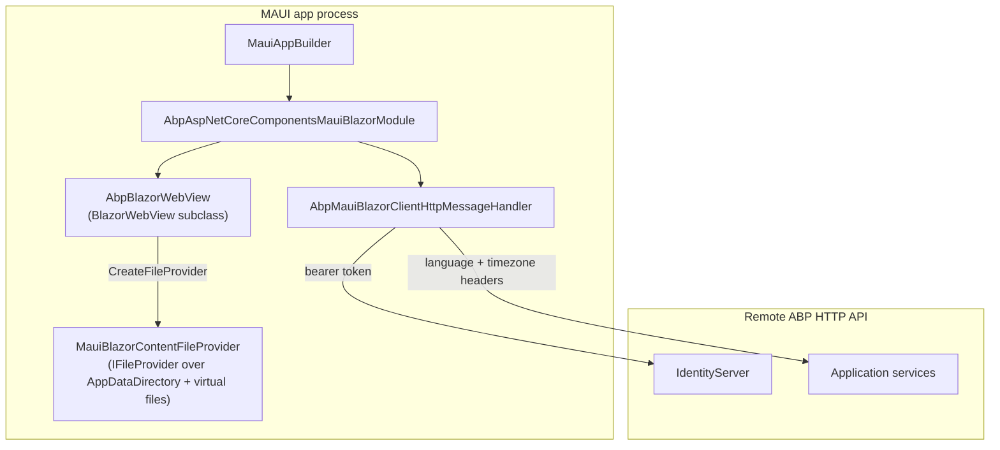

`Volo.Abp.AspNetCore.Components.MauiBlazor` is the host adapter for **.NET MAUI Blazor Hybrid** — Razor Components rendered inside a `BlazorWebView` running in a native iOS, Android, macOS, or Windows app. From the framework's point of view it is almost a twin of [the WebAssembly host](/blazor/components-webassembly): the same `Volo.Abp.AspNetCore.Components.Web` foundation, the same theming, the same Blazorise UI library. What changes is the runtime: there is no browser, no `IWebAssemblyHostEnvironment`, no `IHttpClient` named after the page origin, and no MVC bundling pipeline running on a server. ABP therefore replaces the host-specific abstractions with native-friendly equivalents and ships a file-provider that delivers the global CSS/JS bundle off the device's app data directory.

<Info>
**Packages**: [`framework/src/Volo.Abp.AspNetCore.Components.MauiBlazor/`](https://github.com/abpframework/abp/tree/dev/framework/src/Volo.Abp.AspNetCore.Components.MauiBlazor), [`framework/src/Volo.Abp.AspNetCore.Components.MauiBlazor.Bundling/`](https://github.com/abpframework/abp/tree/dev/framework/src/Volo.Abp.AspNetCore.Components.MauiBlazor.Bundling), [`framework/src/Volo.Abp.AspNetCore.Components.MauiBlazor.Theming/`](https://github.com/abpframework/abp/tree/dev/framework/src/Volo.Abp.AspNetCore.Components.MauiBlazor.Theming), and [`framework/src/Volo.Abp.AspNetCore.Components.MauiBlazor.Theming.Bundling/`](https://github.com/abpframework/abp/tree/dev/framework/src/Volo.Abp.AspNetCore.Components.MauiBlazor.Theming.Bundling).
</Info>

## Hosting model at a glance



The diagram captures the runtime: every Razor component executes inside the MAUI process, but every API call still travels to a remote ABP HTTP host over standard `HttpClient` calls.

## Comparing with the WebAssembly host

If you have read [`/blazor/components-webassembly`](/blazor/components-webassembly), most of the moving parts here will look familiar. The differences are deliberate:

<Tabs>
<Tab title="What stays the same">
- The startup module depends on `AbpAspNetCoreMvcClientCommonModule`, `AbpUiModule`, and `AbpAspNetCoreComponentsWebModule` — the same three foundations the WASM host uses.
- The dynamic proxy clients are still configured with an HTTP message handler that injects language and timezone headers.
- `OnApplicationInitializationAsync` warms a cached `ApplicationConfigurationDto` and `AbpComponentsClaimsCache` before any component renders.
- The theming, page-toolbar, and Blazorise UI stack work identically.
</Tab>
<Tab title="What changes">
- The host environment comes from MAUI, not `IWebAssemblyHostEnvironment` — there is no `PreConfigureServices` step that copies the environment name.
- `IServerUrlProvider` is replaced with `MauiBlazorServerUrlProvider`, a file-friendly implementation that reads `RemoteServices` from `appsettings.json` (a `MauiAsset` baked into the app bundle).
- `ICurrentTenantAccessor` and `ICurrentTimezoneProvider` become **singleton** services because MAUI has a single, long-lived app process.
- Bundles are served at runtime from a `MauiBlazorContentFileProvider`, not built ahead of time.
- A `BlazorWebView` subclass — `AbpBlazorWebView` — is what makes the runtime file provider visible to the embedded web view.
</Tab>
</Tabs>

## The startup module

The module is short. From `framework/src/Volo.Abp.AspNetCore.Components.MauiBlazor/Volo/Abp/AspNetCore/Components/MauiBlazor/AbpAspNetCoreComponentsMauiBlazorModule.cs`:

```csharp
[DependsOn(
    typeof(AbpAspNetCoreMvcClientCommonModule),
    typeof(AbpUiModule),
    typeof(AbpAspNetCoreComponentsWebModule)
)]
public class AbpAspNetCoreComponentsMauiBlazorModule : AbpModule
{
    public override void PreConfigureServices(ServiceConfigurationContext context)
    {
        PreConfigure<AbpHttpClientBuilderOptions>(options =>
        {
            options.ProxyClientBuildActions.Add((_, builder) =>
            {
                builder.AddHttpMessageHandler<AbpMauiBlazorClientHttpMessageHandler>();
            });
        });
    }

    public async override Task OnApplicationInitializationAsync(ApplicationInitializationContext context)
    {
        await context.ServiceProvider.GetRequiredService<IClientScopeServiceProviderAccessor>()
            .ServiceProvider.GetRequiredService<MauiBlazorCachedApplicationConfigurationClient>()
            .InitializeAsync();
        await context.ServiceProvider.GetRequiredService<IClientScopeServiceProviderAccessor>()
            .ServiceProvider.GetRequiredService<AbpComponentsClaimsCache>()
            .InitializeAsync();
        await SetCurrentLanguageAsync(context.ServiceProvider);
    }

    private async static Task SetCurrentLanguageAsync(IServiceProvider serviceProvider)
    {
        var configurationClient = serviceProvider.GetRequiredService<ICachedApplicationConfigurationClient>();
        var utilsService = serviceProvider.GetRequiredService<IAbpUtilsService>();
        var configuration = await configurationClient.GetAsync();
        var cultureName = configuration.Localization?.CurrentCulture?.CultureName;
        if (!cultureName.IsNullOrEmpty())
        {
            var culture = new CultureInfo(cultureName!);
            CultureInfo.DefaultThreadCurrentCulture = culture;
            CultureInfo.DefaultThreadCurrentUICulture = culture;
        }

        if (CultureInfo.CurrentUICulture.TextInfo.IsRightToLeft)
        {
            await utilsService.AddClassToTagAsync("body", "rtl");
        }
    }
}
```

The only `PreConfigureServices` job is to register [`AbpMauiBlazorClientHttpMessageHandler`](https://github.com/abpframework/abp/blob/dev/framework/src/Volo.Abp.AspNetCore.Components.MauiBlazor/Volo/Abp/AspNetCore/Components/MauiBlazor/AbpMauiBlazorClientHttpMessageHandler.cs) as a delegating handler on every generated proxy client. `OnApplicationInitializationAsync` is functionally identical to the WASM host's: warm the configuration cache, warm the claims cache, set the culture, set `rtl` if needed.

## The HTTP message handler

`AbpMauiBlazorClientHttpMessageHandler` lives in the same folder and is where the per-request mechanics happen:

```csharp
public class AbpMauiBlazorClientHttpMessageHandler : DelegatingHandler, ITransientDependency
{
    private readonly IUiPageProgressService _uiPageProgressService;
    private readonly IMauiBlazorSelectedLanguageProvider _mauiBlazorSelectedLanguageProvider;
    private readonly ICurrentTimezoneProvider _currentTimezoneProvider;

    public AbpMauiBlazorClientHttpMessageHandler(
        IClientScopeServiceProviderAccessor clientScopeServiceProviderAccessor,
        IMauiBlazorSelectedLanguageProvider mauiBlazorSelectedLanguageProvider,
        ICurrentTimezoneProvider currentTimezoneProvider)
    {
        _mauiBlazorSelectedLanguageProvider = mauiBlazorSelectedLanguageProvider;
        _currentTimezoneProvider = currentTimezoneProvider;
        _uiPageProgressService = clientScopeServiceProviderAccessor.ServiceProvider
            .GetRequiredService<IUiPageProgressService>();
    }

    protected async override Task<HttpResponseMessage> SendAsync(
        HttpRequestMessage request, CancellationToken cancellationToken)
    {
        try
        {
            await _uiPageProgressService.Go(null, options =>
            {
                options.Type = UiPageProgressType.Info;
            });

            await SetLanguageAsync(request);
            await SetTimeZoneAsync(request);

            return await base.SendAsync(request, cancellationToken);
        }
        finally
        {
            await _uiPageProgressService.Go(-1);
        }
    }
    // ...
}
```

Three side effects: a progress bar shows the activity (and gets cleared in `finally` even if the call fails), the `Accept-Language` header is set from `IMauiBlazorSelectedLanguageProvider`, and the `__tenant`-style timezone header is set from `ICurrentTimezoneProvider`. The default language provider is a no-op:

```csharp
// IMauiBlazorSelectedLanguageProvider.cs + NullMauiBlazorSelectedLanguageProvider.cs
public interface IMauiBlazorSelectedLanguageProvider
{
    Task<string?> GetSelectedLanguageAsync();
}

public class NullMauiBlazorSelectedLanguageProvider : IMauiBlazorSelectedLanguageProvider, ITransientDependency
{
    public Task<string?> GetSelectedLanguageAsync()
    {
        return Task.FromResult((string?)null);
    }
}
```

App templates replace `NullMauiBlazorSelectedLanguageProvider` with a real implementation backed by `Preferences.Default` so the user's choice persists across launches.

<Note>
The handler does **not** inject a bearer token. Token attachment is the responsibility of the upstream `IAbpAccessTokenProvider` implementation registered by [`Volo.Abp.Http.Client.IdentityModel.MauiBlazor`](https://github.com/abpframework/abp/tree/dev/framework/src/Volo.Abp.Http.Client.IdentityModel.MauiBlazor) — which provides `MauiBlazorAbpAccessTokenProvider` and depends on `AbpAspNetCoreComponentsMauiBlazorModule`. See [`/blazor/maui-client`](/blazor/maui-client) for how token storage works for the pure-MAUI sibling client.
</Note>

## Singleton tenant and timezone accessors

In a WASM client these abstractions are scoped per circuit; in MAUI they live for the lifetime of the app and the framework registers singletons:

```csharp
// MauiBlazorCurrentTenantAccessor.cs
[Dependency(ReplaceServices = true)]
public class MauiBlazorCurrentTenantAccessor : ICurrentTenantAccessor, ISingletonDependency
{
    public BasicTenantInfo? Current { get; set; }
}

// MauiBlazorCurrentTimezoneProvider.cs
[Dependency(ReplaceServices = true)]
public class MauiBlazorCurrentTimezoneProvider : ICurrentTimezoneProvider, ISingletonDependency
{
    public string? TimeZone { get; set; }
}
```

The `ICurrentPrincipalAccessor` replacement pulls the claims from the cached `AbpComponentsClaimsCache`:

```csharp
public class MauiBlazorCurrentPrincipalAccessor : CurrentPrincipalAccessorBase, ITransientDependency
{
    private AbpComponentsClaimsCache ClaimsCache { get; }

    public MauiBlazorCurrentPrincipalAccessor(IClientScopeServiceProviderAccessor clientScopeServiceProviderAccessor)
    {
        ClaimsCache = clientScopeServiceProviderAccessor.ServiceProvider
            .GetRequiredService<AbpComponentsClaimsCache>();
    }

    protected override ClaimsPrincipal GetClaimsPrincipal()
    {
        return ClaimsCache.Principal;
    }
}
```

`AbpComponentsClaimsCache` is the shared store that the auth-state listener writes into when the bearer token changes, so every consumer of `ICurrentPrincipalAccessor` sees the same `ClaimsPrincipal`.

## The configuration cache

`MauiBlazorCachedApplicationConfigurationClient` ([source](https://github.com/abpframework/abp/blob/dev/framework/src/Volo.Abp.AspNetCore.Components.MauiBlazor/Volo/Abp/AspNetCore/Components/MauiBlazor/MauiBlazorCachedApplicationConfigurationClient.cs)) implements `ICachedApplicationConfigurationClient` exactly like the WASM equivalent. It composes `AbpApplicationConfigurationClientProxy` and `AbpApplicationLocalizationClientProxy`, plus the `ApplicationConfigurationCache` companion class in the same folder. `MauiCurrentApplicationConfigurationCacheResetService` exposes the public reset entry point so a "switch tenant" or "log in" action can force a refresh.

## Runtime bundles and `AbpBlazorWebView`

The most interesting MAUI-specific bit is how CSS and JS reach the embedded web view. Microsoft's `BlazorWebView` looks for static files under `wwwroot/` in the published app bundle. ABP needs to compose those files with a *dynamic* bundle produced at app startup — every contributor registered for `BlazorWebAssembly.Global`-style bundles must end up on disk somewhere the web view can read.

The package therefore ships a subclass:

```csharp
// AbpBlazorWebView.cs
public class AbpBlazorWebView : BlazorWebView
{
    public override IFileProvider CreateFileProvider(string contentRootDir)
    {
        return new CompositeFileProvider(
            Handler!.GetRequiredService<IMauiBlazorContentFileProvider>(),
            base.CreateFileProvider(contentRootDir));
    }
}
```

`CompositeFileProvider` short-circuits to ABP's [`IMauiBlazorContentFileProvider`](https://github.com/abpframework/abp/blob/dev/framework/src/Volo.Abp.AspNetCore.Components.MauiBlazor.Bundling/Volo/Abp/AspNetCore/Components/MauiBlazor/Bundling/IMauiBlazorContentFileProvide.cs) first; anything not present falls through to MAUI's default provider for the published `wwwroot/`. The default implementation, `MauiBlazorContentFileProvider`, blends the in-memory `IVirtualFileProvider` with the on-device `FileSystem.Current.AppDataDirectory`:

```csharp
public class MauiBlazorContentFileProvider : IMauiBlazorContentFileProvider, ISingletonDependency
{
    private readonly IVirtualFileProvider _virtualFileProvider;
    private readonly IFileProvider _fileProvider;
    private string _rootPath = "/wwwroot";

    public string ContentRootPath => FileSystem.Current.AppDataDirectory;

    public IFileInfo GetFileInfo(string subpath)
    {
        if (string.IsNullOrEmpty(subpath))
        {
            return new NotFoundFileInfo(subpath);
        }

        var fileInfo = _fileProvider.GetFileInfo(subpath);
        return fileInfo.Exists ? fileInfo : _fileProvider.GetFileInfo(_rootPath + subpath.EnsureStartsWith('/'));
    }
    // ...
}
```

Use it in `MauiProgram.cs` by writing `<vab:AbpBlazorWebView />` (with the `vab` prefix aliased to `Volo.Abp.AspNetCore.Components.MauiBlazor.Bundling`) instead of the framework's `BlazorWebView`.

## Bootstrapping the bundle at startup

`AbpAspNetCoreComponentsMauiBlazorBundlingModule` (in `framework/src/Volo.Abp.AspNetCore.Components.MauiBlazor.Bundling/Volo/Abp/AspNetCore/Components/MauiBlazor/Bundling/`) runs `InitialGlobalAssetsAsync` on application initialization:

```csharp
public async override Task OnApplicationInitializationAsync(ApplicationInitializationContext context)
{
    await InitialGlobalAssetsAsync(context);
}

protected virtual async Task InitialGlobalAssetsAsync(ApplicationInitializationContext context)
{
    var bundlingOptions = context.ServiceProvider
        .GetRequiredService<IOptions<AbpBundlingOptions>>().Value;
    if (!bundlingOptions.GlobalAssets.Enabled) return;

    var bundleManager = context.ServiceProvider.GetRequiredService<BundleManager>();
    var mauiBlazorContentFileProvider = context.ServiceProvider
        .GetRequiredService<IMauiBlazorContentFileProvider>();
    var dynamicFileProvider = context.ServiceProvider.GetRequiredService<IDynamicFileProvider>();

    if (!bundlingOptions.GlobalAssets.GlobalStyleBundleName.IsNullOrWhiteSpace())
    {
        var styleFiles = await bundleManager.GetStyleBundleFilesAsync(
            bundlingOptions.GlobalAssets.GlobalStyleBundleName);
        // …concatenate the files, optionally rewrite CSS url() paths…
        dynamicFileProvider.AddOrUpdate(
            new InMemoryFileInfo("/wwwroot/" + bundlingOptions.GlobalAssets.CssFileName,
                Encoding.UTF8.GetBytes(styles),
                bundlingOptions.GlobalAssets.CssFileName));
    }

    // ...same dance for scripts, with EnsureEndsWith(';')...
}
```

The flow is:

1. `BundleManager` enumerates every `IBundleContributor` registered for the named bundle.
2. Each contributor's `FileName` is resolved through `IMauiBlazorContentFileProvider` — first the virtual filesystem, then the app-data directory.
3. The resulting CSS/JS is concatenated, written into `IDynamicFileProvider` under `/wwwroot/{CssFileName}`, and reappears the next time the `BlazorWebView` requests it.
4. CSS `url(...)` references are rewritten via `CssRelativePath.Adjust` when bundling is in `BundlingMode.None` so relative font and image paths resolve against the on-disk wwwroot.

The bundle modes (`None`, `Bundle`, `BundleAndMinify`) are shared with the rest of the framework — see [`/blazor/bundling`](/blazor/bundling) for the contributor and CLI side of the same pipeline.

## The theming and routing extensions

`Volo.Abp.AspNetCore.Components.MauiBlazor.Theming` is a tiny package that ships [`ComponentsComponentsBundleContributor`](https://github.com/abpframework/abp/blob/dev/framework/src/Volo.Abp.AspNetCore.Components.MauiBlazor.Theming/ComponentsComponentsBundleContributor.cs) (a legacy bundle contributor kept for templates predating the GlobalAssets switch) and the theming module that wires up [`AbpAspNetCoreComponentsWebThemingModule`](https://github.com/abpframework/abp/blob/dev/framework/src/Volo.Abp.AspNetCore.Components.Web.Theming/AbpAspNetCoreComponentsWebThemingModule.cs). The `MauiBlazor.Theming.Bundling` package adds the bundling-options configurator analogous to the WASM theming-bundling module.

## Wiring `MauiProgram.cs`

<Steps>
<Step title="Reference the MAUI Blazor packages">
Add `<PackageReference Include="Volo.Abp.AspNetCore.Components.MauiBlazor" />` and `Volo.Abp.AspNetCore.Components.MauiBlazor.Bundling` (plus the theme of your choice) to your MAUI client project.
</Step>
<Step title="Create the startup module">
Inherit `AbpModule` and depend on `[DependsOn(typeof(AbpAspNetCoreComponentsMauiBlazorBundlingModule), typeof(AbpHttpClientIdentityModelMauiBlazorModule), typeof(MyApplicationContractsModule))]`. Register your dynamic clients via `context.Services.AddHttpClientProxies(...)` like any other ABP client.
</Step>
<Step title="Boot the ABP application">
In `MauiProgram.CreateMauiApp`, call `builder.Services.AddApplicationAsync<MyMauiBlazorModule>(opts => opts.UseAutofac())`, then on the built `IServiceProvider` resolve `IAbpApplicationWithExternalServiceProvider` and call `InitializeAsync(serviceProvider)`.
</Step>
<Step title="Swap `BlazorWebView` for `AbpBlazorWebView`">
In `MainPage.xaml`, replace `<BlazorWebView />` with `<vab:AbpBlazorWebView />` so the runtime file provider is composed into the file lookup chain.
</Step>
<Step title="Implement `IMauiBlazorSelectedLanguageProvider`">
Replace `NullMauiBlazorSelectedLanguageProvider` with an implementation backed by `Preferences.Default` so user culture survives app restarts and is forwarded as `Accept-Language`.
</Step>
</Steps>

## Cross-host source map

<Accordion title="Files in framework/src/Volo.Abp.AspNetCore.Components.MauiBlazor/">
- `Volo/Abp/AspNetCore/Components/MauiBlazor/AbpAspNetCoreComponentsMauiBlazorModule.cs` — the module.
- `Volo/Abp/AspNetCore/Components/MauiBlazor/AbpMauiBlazorClientHttpMessageHandler.cs` — language/timezone/progress-bar handler.
- `Volo/Abp/AspNetCore/Components/MauiBlazor/MauiBlazorCachedApplicationConfigurationClient.cs` + `ApplicationConfigurationCache.cs` — configuration cache.
- `Volo/Abp/AspNetCore/Components/MauiBlazor/MauiCurrentApplicationConfigurationCacheResetService.cs` — public reset entry point.
- `Volo/Abp/AspNetCore/Components/MauiBlazor/MauiBlazorCurrentTenantAccessor.cs`, `MauiBlazorCurrentTimezoneProvider.cs`, `MauiBlazorCurrentTimezoneService.cs`, `MauiBlazorCurrentPrincipalAccessor.cs` — singleton/transient host replacements.
- `Volo/Abp/AspNetCore/Components/MauiBlazor/MauiBlazorRemoteTenantStore.cs` — tenant resolution that calls the remote `AbpTenantClientProxy`.
- `Volo/Abp/AspNetCore/Components/MauiBlazor/MauiBlazorServerUrlProvider.cs` — `IServerUrlProvider` replacement backed by `IRemoteServiceConfigurationProvider`.
- `Volo/Abp/AspNetCore/Components/MauiBlazor/IMauiBlazorSelectedLanguageProvider.cs` + `NullMauiBlazorSelectedLanguageProvider.cs` — language preference contract.
</Accordion>

<Accordion title="Files in framework/src/Volo.Abp.AspNetCore.Components.MauiBlazor.Bundling/">
- `Volo/Abp/AspNetCore/Components/MauiBlazor/Bundling/AbpAspNetCoreComponentsMauiBlazorBundlingModule.cs` — startup-time bundle generator.
- `Volo/Abp/AspNetCore/Components/MauiBlazor/Bundling/AbpBlazorWebView.cs` — `BlazorWebView` subclass that composes `IMauiBlazorContentFileProvider`.
- `Volo/Abp/AspNetCore/Components/MauiBlazor/Bundling/IMauiBlazorContentFileProvide.cs` + `MauiBlazorContentFileProvider.cs` — runtime file provider.
- `Volo/Abp/AspNetCore/Components/MauiBlazor/Bundling/BundleManager.cs` + `MauiBlazorBundlerBase.cs` — `BundleManagerBase` subclass that knows about the file provider.
- `Volo/Abp/AspNetCore/Components/MauiBlazor/Bundling/Scripts/ScriptBundler.cs` + `Styles/StyleBundler.cs` — concrete bundlers.
</Accordion>

<Accordion title="Files in framework/src/Volo.Abp.AspNetCore.Components.MauiBlazor.Theming/ and .Theming.Bundling/">
- `AbpAspNetCoreComponentsMauiBlazorThemingModule.cs` — pulls in the shared `AbpAspNetCoreComponentsWebThemingModule`.
- `ComponentsComponentsBundleContributor.cs` — legacy contributor kept for backwards compatibility.
- `wwwroot/` — Bootstrap, FontAwesome, Flag-Icon, the `abp.css` runtime.
</Accordion>

## Where to read next

<CardGroup cols={2}>
  <Card title="WebAssembly host" icon="browser" href="/blazor/components-webassembly">
    The closest sibling — same module shape, browser instead of `BlazorWebView`.
  </Card>
  <Card title="Shared Web layer" icon="cube" href="/blazor/components-web">
    `AbpComponentBase`, `AbpComponentsClaimsCache`, `IClientScopeServiceProviderAccessor`, `AbpBlazorClientHttpMessageHandler`.
  </Card>
  <Card title="Blazor Server host" icon="server" href="/blazor/components-server">
    The third Razor Components host — server-rendered, SignalR-streamed.
  </Card>
  <Card title="Bundling pipeline" icon="boxes-stacked" href="/blazor/bundling">
    `AbpBundlingOptions.GlobalAssets`, `BundleContributor`, `BundleManager`, and the `abp bundle` CLI command that produce the assets `MauiBlazorContentFileProvider` serves.
  </Card>
  <Card title="Theming pipeline" icon="palette" href="/blazor/theming">
    `IThemeManager`, `ITheme`, `StandardLayouts`, `IPageToolbarManager` — identical contracts for MAUI, WASM, and Server.
  </Card>
  <Card title="Pure MAUI client" icon="mobile-screen" href="/blazor/maui-client">
    `Volo.Abp.Maui.Client` — for native MAUI apps that talk to ABP HTTP APIs without using Razor Components.
  </Card>
</CardGroup>
