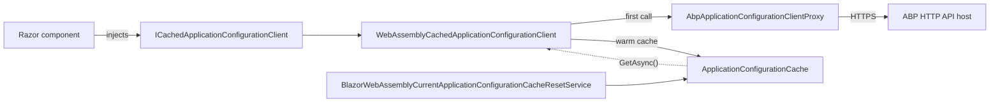

`Volo.Abp.AspNetCore.Components.WebAssembly` is the host adapter for **Blazor WebAssembly**. The whole ABP application — modules, the dependency injection container, options, the localization stack, the HTTP client factory — boots inside the browser using Microsoft's `WebAssemblyHostBuilder`. This page walks through how the package extends that builder, replaces the Microsoft `RemoteAuthenticationService` with an ABP-aware state provider, and primes a long-lived in-memory cache of `ApplicationConfigurationDto` so every Razor component can resolve the current user, tenant, language, timezone, and feature flags without a network round trip.

<Info>
**Packages**: [`framework/src/Volo.Abp.AspNetCore.Components.WebAssembly/`](https://github.com/abpframework/abp/tree/dev/framework/src/Volo.Abp.AspNetCore.Components.WebAssembly) and (for the build-time global bundle and CSS/JS) [`framework/src/Volo.Abp.AspNetCore.Components.WebAssembly.Theming/`](https://github.com/abpframework/abp/tree/dev/framework/src/Volo.Abp.AspNetCore.Components.WebAssembly.Theming) + [`framework/src/Volo.Abp.AspNetCore.Components.WebAssembly.Theming.Bundling/`](https://github.com/abpframework/abp/tree/dev/framework/src/Volo.Abp.AspNetCore.Components.WebAssembly.Theming.Bundling).
</Info>

## How the host wires up

The entry point is [`AbpWebAssemblyHostBuilderExtensions`](https://github.com/abpframework/abp/blob/dev/framework/src/Volo.Abp.AspNetCore.Components.WebAssembly/Microsoft/AspNetCore/Components/WebAssembly/Hosting/AbpWebAssemblyHostBuilderExtensions.cs) in `framework/src/Volo.Abp.AspNetCore.Components.WebAssembly/Microsoft/AspNetCore/Components/WebAssembly/Hosting/`. It adds two `AddApplicationAsync<TStartupModule>` / `AddApplication<TStartupModule>` extension methods on `WebAssemblyHostBuilder` plus an `InitializeApplicationAsync` extension on `IAbpApplicationWithExternalServiceProvider`. The async variant is what you call from `Program.Main`:

```csharp
// Program.cs in a typical WASM client
var builder = WebAssemblyHostBuilder.CreateDefault(args);
builder.RootComponents.Add<App>("#ApplicationContainer");

await builder.AddApplicationAsync<MyClientModule>(options =>
{
    options.UseAutofac();
});

var host = builder.Build();
await host.Services.GetRequiredService<IAbpApplicationWithExternalServiceProvider>()
    .InitializeApplicationAsync(host.Services);
await host.RunAsync();
```

`AddApplicationAsync<TStartupModule>` registers the `IConfiguration` and the `WebAssemblyHostBuilder` itself as singletons, then defers to `IServiceCollection.AddApplicationAsync<TStartupModule>` from `Volo.Abp.Modularity`. The action you pass receives an `AbpWebAssemblyApplicationCreationOptions` ([source](https://github.com/abpframework/abp/blob/dev/framework/src/Volo.Abp.AspNetCore.Components.WebAssembly/Volo/Abp/AspNetCore/Components/WebAssembly/AbpWebAssemblyApplicationCreationOptions.cs)) which exposes both the `WebAssemblyHostBuilder` and the underlying `AbpApplicationCreationOptions` so module authors can register additional services in the same call.

The extension also forces `opts.Environment` to mirror `builder.HostEnvironment.Environment` and pre-registers `Castle.DynamicProxy.Generators.AttributesToAvoidReplicating.Add<AsyncStateMachineAttribute>()` — a one-line workaround for the fact that `Microsoft.AspNetCore.Blazor.BuildTools` was removed in .NET 5 and the dynamic-proxy generator otherwise tries to copy `[AsyncStateMachine]` attributes onto generated methods.

<Note>
`InitializeApplicationAsync` casts the application's `IClientScopeServiceProviderAccessor` to the concrete `ComponentsClientScopeServiceProviderAccessor` and sets its `ServiceProvider` to the root host provider. That accessor lives in [`framework/src/Volo.Abp.AspNetCore.Components.Web/`](https://github.com/abpframework/abp/tree/dev/framework/src/Volo.Abp.AspNetCore.Components.Web) and is how ABP keeps the same DI scope alive for the duration of the WASM session — see [`/blazor/components-web`](/blazor/components-web) for the underlying contract.
</Note>

## The startup module

The root module is [`AbpAspNetCoreComponentsWebAssemblyModule`](https://github.com/abpframework/abp/blob/dev/framework/src/Volo.Abp.AspNetCore.Components.WebAssembly/Volo/Abp/AspNetCore/Components/WebAssembly/AbpAspNetCoreComponentsWebAssemblyModule.cs) in `framework/src/Volo.Abp.AspNetCore.Components.WebAssembly/Volo/Abp/AspNetCore/Components/WebAssembly/`:

```csharp
[DependsOn(
    typeof(AbpAspNetCoreMvcClientCommonModule),
    typeof(AbpUiModule),
    typeof(AbpAspNetCoreComponentsWebModule)
)]
public class AbpAspNetCoreComponentsWebAssemblyModule : AbpModule
{
    public override void PreConfigureServices(ServiceConfigurationContext context)
    {
        var abpHostEnvironment = context.Services.GetSingletonInstance<IAbpHostEnvironment>();
        if (abpHostEnvironment.EnvironmentName.IsNullOrWhiteSpace())
        {
            abpHostEnvironment.EnvironmentName = context.Services.GetWebAssemblyHostEnvironment().Environment;
        }

        PreConfigure<AbpHttpClientBuilderOptions>(options =>
        {
            options.ProxyClientBuildActions.Add((_, builder) =>
            {
                builder.AddHttpMessageHandler<AbpBlazorClientHttpMessageHandler>();
            });
        });
    }
    // ...
}
```

`PreConfigureServices` does two things. First, it copies the WASM host's environment name (`Development`, `Staging`, `Production`) onto ABP's `IAbpHostEnvironment` so every conditional that asks "are we in dev?" gets a consistent answer. Second, it appends [`AbpBlazorClientHttpMessageHandler`](https://github.com/abpframework/abp/blob/dev/framework/src/Volo.Abp.AspNetCore.Components.Web/Volo/Abp/AspNetCore/Components/Web/AbpBlazorClientHttpMessageHandler.cs) — the shared Blazor handler from `Volo.Abp.AspNetCore.Components.Web` — to every dynamic HTTP proxy that ABP generates from your application contracts. That handler forwards the current culture, timezone, and (when available) the access token to your remote service.

`ConfigureServices` calls `context.Services.AddHttpClient()`, then wires the framework's `AbpExceptionHandlingLoggerProvider` into the host's `LoggerFactory` so unhandled exceptions reach `IExceptionNotifier`. If the WASM client is **not** running inside a Blazor Web App (the unified .NET 8 host), it also configures `AbpAuthenticationOptions` with the conventional `authentication/login` and `authentication/logout` URLs the WASM template's `RedirectToLogin` component expects.

`PostConfigureServices` performs the auth-provider replacement covered in the next section. Finally, `OnApplicationInitializationAsync` runs the WASM-specific bootstrapping:

```csharp
public async override Task OnApplicationInitializationAsync(ApplicationInitializationContext context)
{
    await context.ServiceProvider.GetRequiredService<IClientScopeServiceProviderAccessor>()
        .ServiceProvider.GetRequiredService<WebAssemblyCachedApplicationConfigurationClient>()
        .InitializeAsync();
    await context.ServiceProvider.GetRequiredService<IClientScopeServiceProviderAccessor>()
        .ServiceProvider.GetRequiredService<AbpComponentsClaimsCache>()
        .InitializeAsync();
    await SetCurrentLanguageAsync(context.ServiceProvider);
}
```

That ordering matters: the configuration client must initialize before the claims cache, because the claims cache reads `CurrentUser` from the cached configuration. After both caches are warm, `SetCurrentLanguageAsync` reads `Localization.CurrentCulture.CultureName`, sets `CultureInfo.DefaultThreadCurrentCulture` / `DefaultThreadCurrentUICulture`, and — for RTL languages — adds the `rtl` class to `<body>` via `IAbpUtilsService`.

## The application-configuration client proxy

`Volo.Abp.AspNetCore.Mvc.Client` generates the dynamic HTTP proxy [`AbpApplicationConfigurationClientProxy`](https://github.com/abpframework/abp/blob/dev/framework/src/Volo.Abp.AspNetCore.Mvc.Client/Volo/Abp/AspNetCore/Mvc/ApplicationConfigurations/ClientProxies/AbpApplicationConfigurationClientProxy.cs). On WASM, that proxy is consumed by [`WebAssemblyCachedApplicationConfigurationClient`](https://github.com/abpframework/abp/blob/dev/framework/src/Volo.Abp.AspNetCore.Components.WebAssembly/Volo/Abp/AspNetCore/Components/WebAssembly/WebAssemblyCachedApplicationConfigurationClient.cs) in `framework/src/Volo.Abp.AspNetCore.Components.WebAssembly/Volo/Abp/AspNetCore/Components/WebAssembly/`:

```csharp
public class WebAssemblyCachedApplicationConfigurationClient
    : ICachedApplicationConfigurationClient, ITransientDependency
{
    protected AbpApplicationConfigurationClientProxy ApplicationConfigurationClientProxy { get; }
    protected AbpApplicationLocalizationClientProxy ApplicationLocalizationClientProxy { get; }
    protected ApplicationConfigurationCache Cache { get; }
    protected ICurrentTenantAccessor CurrentTenantAccessor { get; }
    protected ICurrentTimezoneProvider CurrentTimezoneProvider { get; }
    protected ApplicationConfigurationChangedService ApplicationConfigurationChangedService { get; }
    protected IJSRuntime JSRuntime { get; }
    protected IClock Clock { get; }
    // ...
}
```

The client implements `ICachedApplicationConfigurationClient` so every consumer in the shared `Volo.Abp.AspNetCore.Components` layer goes through one cache. The companion [`ApplicationConfigurationCache`](https://github.com/abpframework/abp/blob/dev/framework/src/Volo.Abp.AspNetCore.Components.WebAssembly/Volo/Abp/AspNetCore/Components/WebAssembly/ApplicationConfigurationCache.cs) class holds the cached DTO and the timestamp, and [`BlazorWebAssemblyCurrentApplicationConfigurationCacheResetService`](https://github.com/abpframework/abp/blob/dev/framework/src/Volo.Abp.AspNetCore.Components.WebAssembly/Volo/Abp/AspNetCore/Components/WebAssembly/Configuration/BlazorWebAssemblyCurrentApplicationConfigurationCacheResetService.cs) in the `Configuration/` subfolder is the public way to force a refresh after login or tenant switch.



The diagram shows the call path. The first `GetAsync()` after `InitializeAsync()` hits the proxy, the result is stored in `ApplicationConfigurationCache`, and every subsequent call is served from memory until the reset service is invoked or the user re-authenticates.

## HttpClient setup for WASM

The WASM template registers exactly one named `HttpClient` — `BaseAddress = builder.HostEnvironment.BaseAddress` — so static files load from the WASM origin. ABP's outbound calls go through *named* clients created by `IHttpClientFactory` whose base address is resolved at request time. The replacement that makes this work is [`WebAssemblyServerUrlProvider`](https://github.com/abpframework/abp/blob/dev/framework/src/Volo.Abp.AspNetCore.Components.WebAssembly/Volo/Abp/AspNetCore/Components/WebAssembly/WebAssemblyServerUrlProvider.cs):

```csharp
[Dependency(ReplaceServices = true)]
public class WebAssemblyServerUrlProvider : IServerUrlProvider, ITransientDependency
{
    protected IRemoteServiceConfigurationProvider RemoteServiceConfigurationProvider { get; }

    public WebAssemblyServerUrlProvider(IRemoteServiceConfigurationProvider remoteServiceConfigurationProvider)
    {
        RemoteServiceConfigurationProvider = remoteServiceConfigurationProvider;
    }

    public async Task<string> GetBaseUrlAsync(string? remoteServiceName = null)
    {
        var remoteServiceConfiguration = await RemoteServiceConfigurationProvider.GetConfigurationOrDefaultAsync(
            remoteServiceName ?? RemoteServiceConfigurationDictionary.DefaultName
        );

        return remoteServiceConfiguration.BaseUrl.EnsureEndsWith('/');
    }
}
```

This implementation replaces the shared `IServerUrlProvider` registered by `AbpAspNetCoreComponentsWebModule`. Every call goes through the `RemoteServices` section in `wwwroot/appsettings.json`:

```json
{
  "RemoteServices": {
    "Default": {
      "BaseUrl": "https://api.mycompany.com/",
      "UseCurrentAccessToken": "true"
    },
    "Reporting": {
      "BaseUrl": "https://reporting.mycompany.com/"
    }
  }
}
```

`IRemoteServiceConfigurationProvider` (from `Volo.Abp.Http.Client`) reads that section, applies any in-memory overrides, and returns a `RemoteServiceConfiguration`. The `EnsureEndsWith('/')` call avoids the classic double-slash bug when a developer omits the trailing slash in configuration.

<Tabs>
<Tab title="Default API">
```csharp
// Resolved by the dynamic HTTP client proxy for any contract
// without a [RemoteService(Name = "...")] attribute.
var baseUrl = await serverUrlProvider.GetBaseUrlAsync();
// => "https://api.mycompany.com/"
```
</Tab>
<Tab title="Named remote service">
```csharp
// Resolved when the contract is decorated with
// [RemoteService(Name = "Reporting")].
var baseUrl = await serverUrlProvider.GetBaseUrlAsync("Reporting");
// => "https://reporting.mycompany.com/"
```
</Tab>
<Tab title="Falls back to default">
```csharp
// GetConfigurationOrDefaultAsync returns the "Default" entry
// when "Unknown" is not present in RemoteServices.
var baseUrl = await serverUrlProvider.GetBaseUrlAsync("Unknown");
// => "https://api.mycompany.com/"
```
</Tab>
</Tabs>

## Authentication: replacing the remote auth state provider

The most subtle piece of this package is the access-token plumbing. Microsoft's WASM Authentication library ships `RemoteAuthenticationService<TRemoteAuthenticationState, TAccount, TProviderOptions>` and registers it as the `AuthenticationStateProvider`. ABP's `PostConfigureServices` detects that registration and replaces it with [`WebAssemblyAuthenticationStateProvider<,,>`](https://github.com/abpframework/abp/blob/dev/framework/src/Volo.Abp.AspNetCore.Components.WebAssembly/Volo/Abp/AspNetCore/Components/WebAssembly/WebAssemblyAuthenticationStateProvider.cs) — a subclass that inherits all of Microsoft's behaviour and adds ABP-specific bookkeeping:

```csharp
public override void PostConfigureServices(ServiceConfigurationContext context)
{
    var msAuthenticationStateProvider = context.Services
        .FirstOrDefault(x => x.ServiceType == typeof(AuthenticationStateProvider));
    if (msAuthenticationStateProvider is {ImplementationType: not null} &&
        msAuthenticationStateProvider.ImplementationType.IsGenericType &&
        msAuthenticationStateProvider.ImplementationType.GetGenericTypeDefinition()
            == typeof(RemoteAuthenticationService<,,>))
    {
        var webAssemblyAuthenticationStateProviderType =
            typeof(WebAssemblyAuthenticationStateProvider<,,>).MakeGenericType(
                msAuthenticationStateProvider.ImplementationType.GenericTypeArguments[0],
                msAuthenticationStateProvider.ImplementationType.GenericTypeArguments[1],
                msAuthenticationStateProvider.ImplementationType.GenericTypeArguments[2]);

        context.Services.Replace(ServiceDescriptor.Scoped(
            typeof(AuthenticationStateProvider),
            webAssemblyAuthenticationStateProviderType));
    }
}
```

This only runs if the Microsoft remote-auth service is actually registered (i.e., the app called `builder.Services.AddOidcAuthentication(...)` or `AddRemoteAuthentication<...>(...)`). The generic arguments are preserved so the replacement is binary-compatible with the WASM template.

### What the replacement adds

The subclass keeps a `ConcurrentDictionary<string, string> AccessTokens` and uses it to track every JWT the user has held during the session. Each call to `GetAuthenticationStateAsync`, `GetAuthenticatedUser`, and the `AuthenticationStateChanged` event handler invokes `FindAccessTokenAsync` (which wraps `RequestAccessToken`), stores the token, and then calls `TryRevokeOldAccessTokensAsync`:

```csharp
protected virtual async Task TryRevokeOldAccessTokensAsync()
{
    if (AccessTokens.Count <= 1) return;

    var oidcProviderOptions = Options.ProviderOptions?.As<OidcProviderOptions>();
    var authority = oidcProviderOptions?.Authority;
    var clientId = oidcProviderOptions?.ClientId;
    // ...
    foreach (var accessToken in revokeAccessTokens)
    {
        // Skip the current token, and skip tokens with the same session_id.
        var httpClient = HttpClientFactory.CreateClient(
            nameof(WebAssemblyAuthenticationStateProvider<TRemoteAuthenticationState, TAccount, TProviderOptions>));
        var result = await httpClient.RevokeTokenAsync(new TokenRevocationRequest
        {
            Address = authority.EnsureEndsWith('/') +
                WebAssemblyAuthenticationStateProviderOptions.Value.TokenRevocationUrl,
            ClientId = clientId,
            Token = accessToken,
        });
        // ...
    }
}
```

Whenever the OIDC library issues a new access token (silent renew, post-logout, tenant switch), the previous one is still in memory and Microsoft's library does not actively revoke it. ABP's subclass POSTs to the authority's `revoke` endpoint — configurable via [`WebAssemblyAuthenticationStateProviderOptions.TokenRevocationUrl`](https://github.com/abpframework/abp/blob/dev/framework/src/Volo.Abp.AspNetCore.Components.WebAssembly/Volo/Abp/AspNetCore/Components/WebAssembly/WebAssemblyAuthenticationStateProviderOptions.cs) — using `Duende.IdentityModel.Client.TokenRevocationRequest`. Tokens that share the same `session_id` claim as the current token are kept because they belong to the same OIDC session.

<Warning>
The revocation logic depends on a properly configured `Authority` and `ClientId` in your `OidcProviderOptions`, and it requires the authority to expose the `revocation_endpoint` discovery document entry. If your IdentityServer is behind a CORS proxy, make sure that proxy forwards `POST /connect/revocation`.
</Warning>

After a successful revoke, `GetAuthenticationStateAsync` also calls `WebAssemblyCachedApplicationConfigurationClient.InitializeAsync()` when the OIDC state says "authenticated" but the cached `ApplicationConfigurationDto.CurrentUser.IsAuthenticated` says otherwise — refreshing the cache so the rest of the app catches up.

### `IAbpAccessTokenProvider` for Blazor Web App scenarios

When the same WASM module is hosted inside a .NET 8 Blazor Web App that streams the prerendered first response, an access token can travel in three ways: as an OIDC token in WASM, in the `.AspNetCore.Cookies` cookie on the server, or persisted into the page via `PersistentComponentState`. The `WebApp/` subfolder under `framework/src/Volo.Abp.AspNetCore.Components.WebAssembly/Volo/Abp/AspNetCore/Components/WebAssembly/WebApp/` ships small `IAbpAccessTokenProvider` implementations for each:

```csharp
// CookieBasedWebAssemblyAbpAccessTokenProvider.cs
public class CookieBasedWebAssemblyAbpAccessTokenProvider : IAbpAccessTokenProvider
{
    public virtual Task<string?> GetTokenAsync()
    {
        return Task.FromResult<string?>(null);
    }
}
```

The cookie-based provider intentionally returns `null` because the cookie is attached automatically by the browser — there is no bearer token to inject. The companion [`PersistentComponentStateAbpAccessTokenProvider`](https://github.com/abpframework/abp/blob/dev/framework/src/Volo.Abp.AspNetCore.Components.WebAssembly/Volo/Abp/AspNetCore/Components/WebAssembly/WebApp/PersistentComponentStateAbpAccessTokenProvider.cs) reads the [`PersistentAccessToken`](https://github.com/abpframework/abp/blob/dev/framework/src/Volo.Abp.AspNetCore.Components.WebAssembly/Volo/Abp/AspNetCore/Components/WebAssembly/WebApp/PersistentAccessToken.cs) value that the server-rendered prerender pushed into `PersistentComponentState`. Together they let a single component tree work both as plain WASM and as a hydrated Blazor Web App, without changes to the calling code.

## Multi-tenant URL resolution

For tenancy-aware deployments, the [`WebAssemblyMultiTenantUrlProvider`](https://github.com/abpframework/abp/blob/dev/framework/src/Volo.Abp.AspNetCore.Components.WebAssembly/Volo/Abp/AspNetCore/Components/WebAssembly/MultiTenant/WebAssemblyMultiTenantUrlProvider.cs) under `MultiTenant/` extracts the tenant from the current Blazor URL when the tenant has not been explicitly resolved:

```csharp
public async override Task<string> GetUrlAsync(string templateUrl)
{
    if (!Options.Value.DomainFormat.IsNullOrEmpty() && !CurrentTenant.IsAvailable)
    {
        var url = NavigationManager.ToAbsoluteUri(NavigationManager.Uri).Authority;
        var domainFormat = Options.Value.DomainFormat
            .RemovePreFix(ProtocolPrefixes).RemovePostFix("/");
        var extractResult = FormattedStringValueExtracter.Extract(url, domainFormat, ignoreCase: true);
        if (extractResult.IsMatch)
        {
            var tenant = extractResult.Matches[0].Value;
            return templateUrl
                .Replace(TenantPlaceHolder, tenant)
                .Replace(TenantIdPlaceHolder, tenant)
                .Replace(TenantNamePlaceHolder, tenant);
        }
    }

    return await base.GetUrlAsync(templateUrl);
}
```

`WebAssemblyMultiTenantUrlOptions.DomainFormat` (e.g. `"https://{0}.mycompany.com"`) parses the browser URL with [`FormattedStringValueExtracter`](https://github.com/abpframework/abp/blob/dev/framework/src/Volo.Abp.Core/Volo/Abp/Text/Formatting/FormattedStringValueExtracter.cs) and uses the extracted tenant value as the substitution for `{TENANCY_NAME}`, `{TENANT_ID}`, or `{TENANT_NAME}` placeholders. This is the mechanism behind subdomain-style tenant resolution in Blazor WASM apps.

## Build-time global assets

`Volo.Abp.AspNetCore.Components.WebAssembly.Theming.Bundling` is a separate package whose only job is to declare the `BlazorWebAssembly.Global` bundle name and turn on **GlobalAssets** so the ABP CLI's `abp bundle` command can pre-compute one CSS and one JS file at build time:

```csharp
// AbpAspNetCoreComponentsWebAssemblyThemingBundlingModule.cs
public override void ConfigureServices(ServiceConfigurationContext context)
{
    Configure<AbpBundlingOptions>(options =>
    {
        options.GlobalAssets.Enabled = true;
        options.GlobalAssets.GlobalStyleBundleName = BlazorWebAssemblyStandardBundles.Styles.Global;
        options.GlobalAssets.GlobalScriptBundleName = BlazorWebAssemblyStandardBundles.Scripts.Global;

        options.StyleBundles.Add(BlazorWebAssemblyStandardBundles.Styles.Global, bundle =>
        {
            bundle.AddContributors(typeof(BlazorWebAssemblyStyleContributor));
        });

        options.ScriptBundles.Add(BlazorWebAssemblyStandardBundles.Scripts.Global, bundle =>
        {
            bundle.AddContributors(typeof(BlazorWebAssemblyScriptContributor));
        });

        options.MinificationIgnoredFiles.Add(
            "_content/Microsoft.AspNetCore.Components.WebAssembly.Authentication/AuthenticationService.js");
    });
}
```

The `BlazorWebAssemblyStandardBundles` static class holds the bundle name constants (`BlazorWebAssembly.Global`), and [`BlazorWebAssemblyStyleContributor`](https://github.com/abpframework/abp/blob/dev/framework/src/Volo.Abp.AspNetCore.Components.WebAssembly.Theming.Bundling/BlazorWebAssemblyStyleContributor.cs) lists the framework CSS — Bootstrap, FontAwesome, Flag-Icon, the abp.css runtime, Blazorise core, the Bootstrap5 Blazorise theme, the snackbar styles, and the Blazorise UI overrides. Microsoft's `AuthenticationService.js` is added to `MinificationIgnoredFiles` because it contains content that the WASM authentication library expects to load unmodified. The bundling pipeline itself is documented in [`/blazor/bundling`](/blazor/bundling).

## Putting it together

<Steps>
<Step title="Reference the package">
Add `<PackageReference Include="Volo.Abp.AspNetCore.Components.WebAssembly" />` to your Blazor WASM client project, plus `Volo.Abp.AspNetCore.Components.WebAssembly.Theming` (or one of the theme-specific packages like `Volo.Abp.AspNetCore.Components.WebAssembly.BasicTheme`) for layouts and styling.
</Step>
<Step title="Create a startup module">
Inherit from `AbpModule`, decorate it with `[DependsOn(typeof(AbpAspNetCoreComponentsWebAssemblyModule), typeof(MyApplicationContractsModule))]`, and override `ConfigureServices` to register your dynamic HTTP clients via `context.Services.AddHttpClientProxies(...)`.
</Step>
<Step title="Wire `Program.cs`">
In `Program.Main`, call `await builder.AddApplicationAsync<MyClientModule>(opts => opts.UseAutofac())` and then `await host.Services.GetRequiredService<IAbpApplicationWithExternalServiceProvider>().InitializeApplicationAsync(host.Services)`.
</Step>
<Step title="Register OIDC">
Call `builder.Services.AddOidcAuthentication(opts => { ... })` *before* the application initializes — that way ABP's `PostConfigureServices` sees the Microsoft `RemoteAuthenticationService` registration and replaces it with the ABP-aware subclass.
</Step>
<Step title="Configure `RemoteServices`">
Populate `wwwroot/appsettings.json` with a `RemoteServices.Default.BaseUrl` so `WebAssemblyServerUrlProvider` can resolve outbound calls.
</Step>
</Steps>

## Source map

<Accordion title="Files in framework/src/Volo.Abp.AspNetCore.Components.WebAssembly/">
- `Volo/Abp/AspNetCore/Components/WebAssembly/AbpAspNetCoreComponentsWebAssemblyModule.cs` — the module class.
- `Volo/Abp/AspNetCore/Components/WebAssembly/AbpWebAssemblyApplicationCreationOptions.cs` — the options object passed to the host-builder extension.
- `Volo/Abp/AspNetCore/Components/WebAssembly/WebAssemblyCachedApplicationConfigurationClient.cs` — the cached client proxy adapter.
- `Volo/Abp/AspNetCore/Components/WebAssembly/ApplicationConfigurationCache.cs` — the in-memory cache.
- `Volo/Abp/AspNetCore/Components/WebAssembly/WebAssemblyAuthenticationStateProvider.cs` — the `RemoteAuthenticationService<,,>` subclass with token revocation.
- `Volo/Abp/AspNetCore/Components/WebAssembly/WebAssemblyAuthenticationStateProviderOptions.cs` — `TokenRevocationUrl`.
- `Volo/Abp/AspNetCore/Components/WebAssembly/WebAssemblyServerUrlProvider.cs` — `IServerUrlProvider` replacement.
- `Volo/Abp/AspNetCore/Components/WebAssembly/WebAssemblyCurrentTenantAccessor.cs` and `WebAssemblyCurrentTimezoneProvider.cs` — host-specific replacements.
- `Volo/Abp/AspNetCore/Components/WebAssembly/WebAssemblyRemoteCurrentPrincipalAccessor.cs` — exposes the current `ClaimsPrincipal` to non-component services.
- `Volo/Abp/AspNetCore/Components/WebAssembly/Configuration/BlazorWebAssemblyCurrentApplicationConfigurationCacheResetService.cs` — public reset entry point.
- `Volo/Abp/AspNetCore/Components/WebAssembly/MultiTenant/` — `WebAssemblyMultiTenantUrlOptions.cs` + `WebAssemblyMultiTenantUrlProvider.cs`.
- `Volo/Abp/AspNetCore/Components/WebAssembly/Extensibility/WebAssemblyLookupApiRequestService.cs` — WASM implementation of the lookup-API contract used by `AbpExtensibleDataGrid`.
- `Volo/Abp/AspNetCore/Components/WebAssembly/WebApp/CookieBasedWebAssemblyAbpAccessTokenProvider.cs`, `PersistentAccessToken.cs`, `PersistentComponentStateAbpAccessTokenProvider.cs`, `RemoteAuthenticationStateProvider.cs`, `RemoteAuthenticationStateProviderCompatible.cs`, `WebAppAdditionalAssembliesHelper.cs` — the Blazor Web App interoperability shim.
- `Microsoft/AspNetCore/Components/WebAssembly/Hosting/AbpWebAssemblyHostBuilderExtensions.cs` — the `AddApplicationAsync` extensions.
- `Microsoft/Extensions/DependencyInjection/AbpWebAssemblyServiceCollectionExtensions.cs` — `GetHostBuilder()` and `GetWebAssemblyHostEnvironment()` helpers.
- `Microsoft/Extensions/DependencyInjection/AbpBlazorWebAppServiceCollectionExtensions.cs` and `EmptyWebAssemblyHostEnvironment.cs` — Blazor Web App helpers.
</Accordion>

<Accordion title="Files in framework/src/Volo.Abp.AspNetCore.Components.WebAssembly.Theming/">
- `AbpAspNetCoreComponentsWebAssemblyThemingModule.cs` — depends on `AbpAspNetCoreComponentsWebAssemblyModule`, `AbpAspNetCoreComponentsWebThemingModule`, and the bundling module below.
- `WebAssemblyComponentBundleManager.cs` — `IComponentBundleManager` no-op that returns empty lists because the actual bundle is the static global asset file emitted at build time.
- `ComponentsComponentsBundleContributor.cs` — `[Obsolete]` legacy bundle contributor retained for compatibility with templates generated before the global-assets switch.
- `wwwroot/` — Bootstrap, FontAwesome, Flag-Icon, the `abp.css` runtime.
</Accordion>

<Accordion title="Files in framework/src/Volo.Abp.AspNetCore.Components.WebAssembly.Theming.Bundling/">
- `AbpAspNetCoreComponentsWebAssemblyThemingBundlingModule.cs` — enables `GlobalAssets`, registers the `BlazorWebAssembly.Global` bundles, and pins `AuthenticationService.js` as un-minifiable.
- `BlazorWebAssemblyStandardBundles.cs` — `Styles.Global` and `Scripts.Global` constants.
- `BlazorWebAssemblyStyleContributor.cs` and `BlazorWebAssemblyScriptContributor.cs` — the contributor pair that fills the bundle file lists.
</Accordion>

## Where to read next

<CardGroup cols={2}>
  <Card title="Shared Web layer" icon="cube" href="/blazor/components-web">
    `AbpComponentBase`, `IUiMessageService`, the cookie / local-storage helpers, and the `AbpBlazorClientHttpMessageHandler` reused by every host.
  </Card>
  <Card title="Blazor Server host" icon="server" href="/blazor/components-server">
    The sibling host with the same module shape, used either alone or as the prerender half of a Blazor Web App.
  </Card>
  <Card title="MAUI Blazor hybrid" icon="mobile" href="/blazor/components-mauiblazor">
    A near-twin of this package that targets `BlazorWebView` instead of the WASM runtime.
  </Card>
  <Card title="Theming pipeline" icon="palette" href="/blazor/theming">
    `ITheme`, `IThemeManager`, `IThemeSelector`, `AbpThemingOptions`, `StandardLayouts`, and the `DynamicLayoutComponent` host.
  </Card>
  <Card title="Bundling pipeline" icon="boxes-stacked" href="/blazor/bundling">
    How `AbpBundlingOptions.GlobalAssets`, `BundleContributor`, and the CLI `abp bundle` command combine into one static CSS/JS file.
  </Card>
  <Card title="Blazorise UI library" icon="table-cells" href="/blazor/blazorise-ui">
    `AbpCrudPageBase<>`, `AbpExtensibleDataGrid`, `EntityActions`, `SubmitButton` — the components built on top of this host.
  </Card>
</CardGroup>
