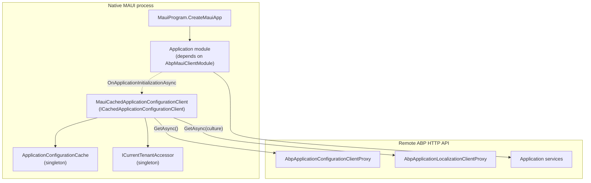

`Volo.Abp.Maui.Client` is the slim package that lets a **native .NET MAUI application** — XAML pages, no `BlazorWebView` — talk to an ABP HTTP API host and reuse ABP's localization, tenancy, settings, and feature stacks. Unlike its [MAUI Blazor sibling](/blazor/components-mauiblazor), it does not run Razor Components: there is no theming, no `IUiPageProgressService`, no `IComponentBundleManager`. What it provides is exactly the foundation a long-lived single-process client needs — a singleton configuration cache, the wiring that initializes it at startup, and a clean place for token storage and remote-service authentication.

<Info>
**Package**: [`framework/src/Volo.Abp.Maui.Client/`](https://github.com/abpframework/abp/tree/dev/framework/src/Volo.Abp.Maui.Client). Template example: [`templates/maui/src/MyCompanyName.MyProjectName/MauiProgram.cs`](https://github.com/abpframework/abp/blob/dev/templates/maui/src/MyCompanyName.MyProjectName/MauiProgram.cs) (the canonical project layout used by `abp new -t maui`).
</Info>

## How it fits in the MAUI client stack



`AbpMauiClientModule` is a near-empty module whose only job is to depend on the shared MVC client common module and to warm the configuration cache before any page binds.

## `AbpMauiClientModule`

The module class — `framework/src/Volo.Abp.Maui.Client/Volo/Abp/Maui/Client/AbpMauiClientModule.cs` — is intentionally minimal:

```csharp
[DependsOn(
    typeof(AbpAspNetCoreMvcClientCommonModule)
)]
public class AbpMauiClientModule : AbpModule
{
    public async Task OnApplicationInitializationAsync(ApplicationInitializationContext context)
    {
        await context.ServiceProvider.GetRequiredService<IClientScopeServiceProviderAccessor>()
            .ServiceProvider.GetRequiredService<MauiCachedApplicationConfigurationClient>()
            .InitializeAsync();
    }
}
```

Two things are happening:

1. **`AbpAspNetCoreMvcClientCommonModule`** pulls in `Volo.Abp.AspNetCore.Mvc.Client`, which is the package that generates the dynamic HTTP client proxies (`AbpApplicationConfigurationClientProxy`, `AbpApplicationLocalizationClientProxy`, and any contracts you register with `context.Services.AddHttpClientProxies(...)`).
2. **`OnApplicationInitializationAsync`** resolves `MauiCachedApplicationConfigurationClient` from the client scope and calls `InitializeAsync()` — a single HTTP round-trip that fetches the full `ApplicationConfigurationDto` and the dynamic localization resources for the active culture.

Notice there is **no** `PreConfigureServices`, no special HTTP-handler wiring, and no `OnApplicationInitialization` (only the async variant). MAUI does not need a delegating handler that injects `Accept-Language` or `X-Timezone` because a native page can call `Preferences.Set` to update the culture and let the next service call recompute the request headers from `IRemoteServiceConfiguration` and `IHttpClientProxyConfigurator`.

## `ApplicationConfigurationCache`

The cache class — `Volo/Abp/Maui/Client/ApplicationConfigurationCache.cs` — is a singleton with a single backing field and a change event:

```csharp
public class ApplicationConfigurationCache : ISingletonDependency
{
    protected ApplicationConfigurationDto? Configuration { get; set; }

    public event Action? ApplicationConfigurationChanged;

    public virtual ApplicationConfigurationDto? Get()
    {
        return Configuration;
    }

    public void Set(ApplicationConfigurationDto configuration)
    {
        Configuration = configuration;
        ApplicationConfigurationChanged?.Invoke();
    }
}
```

Subscribers to `ApplicationConfigurationChanged` can rebind labels or refresh the navigation chrome when the user logs in, switches tenant, or changes culture. The class is a plain CLR singleton because a MAUI app has exactly one user and exactly one configuration at any time — no need for scoping.

## `MauiCachedApplicationConfigurationClient`

The cache feeder, in `Volo/Abp/Maui/Client/MauiCachedApplicationConfigurationClient.cs`, implements the shared `ICachedApplicationConfigurationClient` contract and composes the two generated proxies:

```csharp
public class MauiCachedApplicationConfigurationClient :
    ICachedApplicationConfigurationClient,
    ISingletonDependency
{
    protected AbpApplicationConfigurationClientProxy ApplicationConfigurationClientProxy { get; }
    protected AbpApplicationLocalizationClientProxy ApplicationLocalizationClientProxy { get; }
    protected ApplicationConfigurationCache Cache { get; }
    protected ICurrentTenantAccessor CurrentTenantAccessor { get; }

    public MauiCachedApplicationConfigurationClient(
        AbpApplicationConfigurationClientProxy applicationConfigurationClientProxy,
        AbpApplicationLocalizationClientProxy applicationLocalizationClientProxy,
        ApplicationConfigurationCache cache,
        ICurrentTenantAccessor currentTenantAccessor)
    {
        ApplicationConfigurationClientProxy = applicationConfigurationClientProxy;
        ApplicationLocalizationClientProxy = applicationLocalizationClientProxy;
        CurrentTenantAccessor = currentTenantAccessor;
        Cache = cache;
    }

    public virtual async Task<ApplicationConfigurationDto> InitializeAsync()
    {
        var configurationDto = await ApplicationConfigurationClientProxy.GetAsync(
            new ApplicationConfigurationRequestOptions
            {
                IncludeLocalizationResources = false,
            });

        var localizationDto = await ApplicationLocalizationClientProxy.GetAsync(
            new ApplicationLocalizationRequestDto
            {
                CultureName = configurationDto.Localization.CurrentCulture.Name,
                OnlyDynamics = true
            }
        );

        configurationDto.Localization.Resources = localizationDto.Resources;

        CurrentTenantAccessor.Current = new BasicTenantInfo(
            configurationDto.CurrentTenant.Id,
            configurationDto.CurrentTenant.Name);

        Cache.Set(configurationDto);

        return configurationDto;
    }

    public virtual ApplicationConfigurationDto Get()
    {
        return AsyncHelper.RunSync(GetAsync);
    }

    public virtual async Task<ApplicationConfigurationDto> GetAsync()
    {
        var configurationDto = Cache.Get();
        if (configurationDto is null)
        {
            return await InitializeAsync();
        }

        return configurationDto;
    }
}
```

The flow is deliberate:

<Steps>
<Step title="Fetch the configuration DTO without localization resources">
The first call uses `IncludeLocalizationResources = false` to avoid downloading every locale up front. The DTO carries `CurrentCulture.Name`, `CurrentUser`, `CurrentTenant`, settings, features, permissions, and timing data.
</Step>
<Step title="Fetch only the dynamic localization resources for the current culture">
The second call sets `OnlyDynamics = true` so the response includes just the dynamic strings (those produced by the localization management module) for the active culture; static `.resx` resources are loaded from the device.
</Step>
<Step title="Merge resources into the configuration DTO">
`configurationDto.Localization.Resources = localizationDto.Resources` so the rest of the framework reads localization through one DTO instance.
</Step>
<Step title="Push the tenant into the singleton accessor">
`CurrentTenantAccessor.Current = new BasicTenantInfo(...)` makes the tenant visible to every consumer of `ICurrentTenant` for the remainder of the session.
</Step>
<Step title="Cache the merged DTO">
`Cache.Set(configurationDto)` raises `ApplicationConfigurationChanged`, so any UI element subscribed to that event re-binds.
</Step>
</Steps>

Subsequent `GetAsync()` calls return the cached DTO instantly. Re-invoking `InitializeAsync()` is the supported "I need fresh data" path — call it from your "switch tenant" or "log in" flow.

<Note>
`Get()` is a synchronous bridge implemented with `AsyncHelper.RunSync`. Prefer the async overload in new code; `Get()` exists for legacy callers that can't reach an `await` boundary.
</Note>

## `IAuthenticationService` and token persistence

`Volo.Abp.Maui.Client` deliberately **does not ship** an authentication service or a secure-storage token store. Authentication is an app-level decision because the OIDC flow on MAUI varies by platform (system browser, embedded WebView, biometric prompt). The framework's expectations are:

1. Your app exposes an authentication service (e.g. the .NET MAUI Essentials `WebAuthenticator` wrapped in a custom service like `OidcClientService`) that performs the OIDC dance and returns an access/refresh token pair.
2. That service stores the tokens with `Microsoft.Maui.Storage.SecureStorage` so they survive across launches.
3. You provide an `IAbpAccessTokenProvider` implementation that reads the bearer token from `SecureStorage` and returns it to ABP's HTTP pipeline.

The `IAbpAccessTokenProvider` contract lives in [`Volo.Abp.Http.Client`](https://github.com/abpframework/abp/tree/dev/framework/src/Volo.Abp.Http.Client), and once it is registered the rest of the framework just works. Here is a sketch of a typical implementation:

```csharp
public class SecureStorageAccessTokenProvider : IAbpAccessTokenProvider, ITransientDependency
{
    public virtual async Task<string?> GetTokenAsync()
    {
        return await SecureStorage.Default.GetAsync("abp.access-token");
    }
}
```

ABP's HTTP layer combines that with [`MauiBlazorIdentityModelRemoteServiceHttpClientAuthenticator`](https://github.com/abpframework/abp/blob/dev/framework/src/Volo.Abp.Http.Client.IdentityModel.MauiBlazor/Volo/Abp/Http/Client/IdentityModel/MauiBlazor/MauiIBlazorIdentityModelRemoteServiceHttpClientAuthenticator.cs) (which is technically in the MauiBlazor package but also usable from a pure-MAUI app). The authenticator forwards the bearer token whenever the remote-service configuration opts in:

```csharp
[Dependency(ReplaceServices = true)]
public class MauiBlazorIdentityModelRemoteServiceHttpClientAuthenticator
    : IdentityModelRemoteServiceHttpClientAuthenticator
{
    protected IAbpAccessTokenProvider AccessTokenProvider { get; }

    public MauiBlazorIdentityModelRemoteServiceHttpClientAuthenticator(
        IIdentityModelAuthenticationService identityModelAuthenticationService,
        IAbpAccessTokenProvider abpAccessTokenProvider)
        : base(identityModelAuthenticationService)
    {
        AccessTokenProvider = abpAccessTokenProvider;
    }

    public async override Task Authenticate(RemoteServiceHttpClientAuthenticateContext context)
    {
        if (context.RemoteService.GetUseCurrentAccessToken() != false)
        {
            var accessToken = await AccessTokenProvider.GetTokenAsync();
            if (accessToken != null)
            {
                context.Request.SetBearerToken(accessToken);
                return;
            }
        }

        await base.Authenticate(context);
    }
}
```

When `RemoteServices:Default:UseCurrentAccessToken` is `true` (or unset), the authenticator pulls the token from your `IAbpAccessTokenProvider` and calls `context.Request.SetBearerToken(...)` — a `Duende.IdentityModel.Client` extension method that sets `Authorization: Bearer ...`. If the token provider returns `null`, the call falls through to `IdentityModelRemoteServiceHttpClientAuthenticator.Authenticate`, which uses client-credential grants for service-to-service calls.

<Warning>
The pure-MAUI `Volo.Abp.Maui.Client` package itself does not register a default `IAbpAccessTokenProvider`. You must either reference `Volo.Abp.Http.Client.IdentityModel.MauiBlazor` (and replace its `MauiBlazorAbpAccessTokenProvider`) or ship your own provider class. Without one, every outbound request goes anonymous.
</Warning>

## Wiring `MauiProgram.cs`

The template's `MauiProgram` shows the minimum required wiring — note that it does *not* yet depend on `AbpMauiClientModule`; the bare-bones template only registers `AbpAutofacModule`. Add the client module as soon as you need to talk to an ABP backend:

```csharp
// templates/maui/src/MyCompanyName.MyProjectName/MauiProgram.cs
public static class MauiProgram
{
    public static MauiApp CreateMauiApp()
    {
        var builder = MauiApp.CreateBuilder();
        builder
            .UseMauiApp<App>()
            .ConfigureFonts(fonts =>
            {
                fonts.AddFont("OpenSans-Regular.ttf", "OpenSansRegular");
                fonts.AddFont("OpenSans-Semibold.ttf", "OpenSansSemibold");
            })
            .ConfigureContainer(new AbpAutofacServiceProviderFactory(new Autofac.ContainerBuilder()));

        ConfigureConfiguration(builder);

        builder.Services.AddApplication<MyProjectNameModule>(options =>
        {
            options.Services.ReplaceConfiguration(builder.Configuration);
        });

        var app = builder.Build();

        app.Services.GetRequiredService<IAbpApplicationWithExternalServiceProvider>()
            .Initialize(app.Services);

        return app;
    }

    private static void ConfigureConfiguration(MauiAppBuilder builder)
    {
        var assembly = typeof(App).GetTypeInfo().Assembly;
        builder.Configuration.AddJsonFile(
            new EmbeddedFileProvider(assembly), "appsettings.json", optional: false, false);
    }
}
```

Three things to note:

- **Autofac container factory** — required because ABP relies on Autofac for property injection and module construction. The `ConfigureContainer` call swaps the default `IServiceProviderFactory<>` for `AbpAutofacServiceProviderFactory`.
- **Embedded `appsettings.json`** — `EmbeddedFileProvider` reads the configuration file from the MAUI app bundle. Use `MauiAsset` build action in the project file so the file is included.
- **`Initialize` not `InitializeAsync`** — the bare template synchronously initializes the application. Switch to `InitializeAsync` when you wire `AbpMauiClientModule` so the configuration round-trip can complete before pages render.

## Adding the client module

To turn the template into a real ABP MAUI client:

<Steps>
<Step title="Reference the package">
Add `<PackageReference Include="Volo.Abp.Maui.Client" />` to your MAUI csproj.
</Step>
<Step title="Declare the dependency">
Update `MyProjectNameModule.cs` to depend on it:
```csharp
[DependsOn(
    typeof(AbpAutofacModule),
    typeof(AbpMauiClientModule),
    typeof(MyProjectNameApplicationContractsModule),
    typeof(AbpHttpClientModule)
)]
public class MyProjectNameModule : AbpModule
{
    public override void ConfigureServices(ServiceConfigurationContext context)
    {
        context.Services.AddHttpClientProxies(
            typeof(MyProjectNameApplicationContractsModule).Assembly,
            remoteServiceConfigurationName: "Default"
        );
    }
}
```
</Step>
<Step title="Populate `RemoteServices` in `appsettings.json`">
```json
{
  "RemoteServices": {
    "Default": {
      "BaseUrl": "https://api.mycompany.com/",
      "UseCurrentAccessToken": "true"
    }
  },
  "IdentityClients": {
    "Default": {
      "GrantType": "password",
      "ClientId": "MyProjectName_App",
      "ClientSecret": "1q2w3e*"
    }
  }
}
```
</Step>
<Step title="Switch to async initialization">
Replace `Initialize` with `InitializeAsync` in `MauiProgram` so `AbpMauiClientModule.OnApplicationInitializationAsync` can complete its HTTP round-trip:
```csharp
await app.Services.GetRequiredService<IAbpApplicationWithExternalServiceProvider>()
    .InitializeAsync(app.Services);
```
Note: MAUI's `CreateMauiApp` returns `MauiApp` synchronously, so move the call into a `Task.Run` or your app's startup screen.
</Step>
<Step title="Provide token storage">
Implement `IAbpAccessTokenProvider` backed by `SecureStorage.Default`, then register it with `[Dependency(ReplaceServices = true)]` so ABP's HTTP authenticator picks it up.
</Step>
</Steps>

## Calling an application service

After the steps above, the dynamic client proxy is just a constructor argument. A page receives the proxy via DI and calls it like any in-process service:

```csharp
public partial class ProductsPage : ContentPage, ITransientDependency
{
    private readonly IProductAppService _productAppService;

    public ProductsPage(IProductAppService productAppService)
    {
        _productAppService = productAppService;
        InitializeComponent();
    }

    private async void OnRefreshClicked(object sender, EventArgs e)
    {
        var result = await _productAppService.GetListAsync(new GetProductsInput());
        ProductsView.ItemsSource = result.Items;
    }
}
```

Under the hood `IProductAppService` is implemented by an `AbpDynamicHttpProxy` registered by `AddHttpClientProxies`. The proxy:

1. Reads `RemoteServices.Default.BaseUrl` via `IRemoteServiceConfigurationProvider`.
2. Composes the URL from the C# contract metadata (route, HTTP verb, parameter binding).
3. Resolves any `IHttpClientProxyConfigurator` overrides for timeouts and headers.
4. Authenticates via the registered `IRemoteServiceHttpClientAuthenticator` (your `MauiBlazorIdentityModelRemoteServiceHttpClientAuthenticator`), which calls `IAbpAccessTokenProvider`.
5. Deserializes the JSON response into the contract DTO type.

The same contract assembly that the API host exposes also drives the client — no Swagger generation, no Refit interface, no hand-rolled HTTP code.

## Tenancy

`ICurrentTenantAccessor.Current` is set by `MauiCachedApplicationConfigurationClient.InitializeAsync()` based on the configuration DTO returned by the API. For a multi-tenant deployment where the user picks a tenant before logging in, set the tenant header on the HTTP client (typically via `IHttpClientProxyConfigurator` or the `Volo.Abp.MultiTenancy` extensions) **before** calling `InitializeAsync` so the API resolves the right configuration.

```csharp
// Pseudocode for a tenant-picker flow
using (CurrentTenant.Change(selectedTenantId))
{
    await MauiCachedApplicationConfigurationClient.InitializeAsync();
}
```

`CurrentTenant.Change` writes `__tenant` into the asynclocal-backed `ICurrentTenant`, which `Volo.Abp.AspNetCore.Mvc.Client` forwards in the request headers.

## Source map

<Accordion title="framework/src/Volo.Abp.Maui.Client/">
- `Volo/Abp/Maui/Client/AbpMauiClientModule.cs` — the module class, depends on `AbpAspNetCoreMvcClientCommonModule`, initializes the cache in `OnApplicationInitializationAsync`.
- `Volo/Abp/Maui/Client/ApplicationConfigurationCache.cs` — the singleton cache with `ApplicationConfigurationChanged` event.
- `Volo/Abp/Maui/Client/MauiCachedApplicationConfigurationClient.cs` — the `ICachedApplicationConfigurationClient` implementation that fetches and merges configuration + localization DTOs.
- `Volo.Abp.Maui.Client.csproj` — package metadata; depends on `Volo.Abp.AspNetCore.Mvc.Client`.
</Accordion>

<Accordion title="Adjacent packages a real MAUI app references">
- [`Volo.Abp.Http.Client`](https://github.com/abpframework/abp/tree/dev/framework/src/Volo.Abp.Http.Client) — `IAbpAccessTokenProvider`, `IRemoteServiceConfigurationProvider`, the HTTP authenticator base class.
- [`Volo.Abp.Http.Client.IdentityModel`](https://github.com/abpframework/abp/tree/dev/framework/src/Volo.Abp.Http.Client.IdentityModel) — `IdentityModelRemoteServiceHttpClientAuthenticator` used as the base for `MauiBlazorIdentityModelRemoteServiceHttpClientAuthenticator`.
- [`Volo.Abp.Http.Client.IdentityModel.MauiBlazor`](https://github.com/abpframework/abp/tree/dev/framework/src/Volo.Abp.Http.Client.IdentityModel.MauiBlazor) — `MauiBlazorAbpAccessTokenProvider` (null provider) + `MauiBlazorIdentityModelRemoteServiceHttpClientAuthenticator`. Reusable from a native MAUI app too.
- [`Volo.Abp.Autofac`](https://github.com/abpframework/abp/tree/dev/framework/src/Volo.Abp.Autofac) — the Autofac integration the template uses.
- [`Volo.Abp.AspNetCore.Mvc.Client`](https://github.com/abpframework/abp/tree/dev/framework/src/Volo.Abp.AspNetCore.Mvc.Client) — the dynamic-proxy generator (`AbpApplicationConfigurationClientProxy`, `AbpApplicationLocalizationClientProxy`, `AddHttpClientProxies`).
</Accordion>

<Accordion title="templates/maui/src/MyCompanyName.MyProjectName/">
- `MauiProgram.cs` — bare bones startup with Autofac and embedded `appsettings.json`.
- `MyProjectNameModule.cs` — the starter module; add `AbpMauiClientModule` here.
- `App.xaml.cs` / `AppShell.xaml.cs` / `MainPage.xaml.cs` / `HelloWorldService.cs` — the default page tree.
- `Platforms/Android`, `Platforms/iOS`, `Platforms/MacCatalyst`, `Platforms/Windows`, `Platforms/Tizen` — per-platform entry points.
- `appsettings.json` — the embedded configuration file (mark as `MauiAsset`).
</Accordion>

## Comparison with the MauiBlazor host

<Tabs>
<Tab title="Volo.Abp.Maui.Client (this page)">
- **UI**: native XAML pages.
- **Razor Components**: not used.
- **Theming**: not applicable.
- **Bundling**: not applicable.
- **Configuration cache**: `MauiCachedApplicationConfigurationClient` (one HTTP round-trip during startup).
- **HTTP handler**: none — auth via `IRemoteServiceHttpClientAuthenticator`.
- **Token storage**: app-provided `IAbpAccessTokenProvider` over `SecureStorage`.
- **Best for**: high-fidelity native UX, sharing only the API/contracts layer with the server.
</Tab>
<Tab title="Volo.Abp.AspNetCore.Components.MauiBlazor (sibling)">
- **UI**: Razor Components inside `BlazorWebView`.
- **Razor Components**: yes — same `AbpComponentBase`, `IUiMessageService`, `AbpExtensibleDataGrid` as the WASM and Server hosts.
- **Theming**: `ITheme` + `IThemeManager`, see [`/blazor/theming`](/blazor/theming).
- **Bundling**: runtime via `IMauiBlazorContentFileProvider`, see [`/blazor/bundling`](/blazor/bundling).
- **Configuration cache**: `MauiBlazorCachedApplicationConfigurationClient` warmed by `AbpAspNetCoreComponentsMauiBlazorModule.OnApplicationInitializationAsync`.
- **HTTP handler**: `AbpMauiBlazorClientHttpMessageHandler` for language + timezone + page progress.
- **Token storage**: app-provided `IAbpAccessTokenProvider`.
- **Best for**: cross-platform mobile/desktop where you want to share the same Razor pages with WASM / Server.
</Tab>
</Tabs>

## Where to read next

<CardGroup cols={2}>
  <Card title="MAUI Blazor host" icon="mobile" href="/blazor/components-mauiblazor">
    The Razor-Components-on-MAUI sibling. Compare to decide which fits your project.
  </Card>
  <Card title="WebAssembly host" icon="browser" href="/blazor/components-webassembly">
    Same configuration-cache pattern, applied to the browser runtime.
  </Card>
  <Card title="Shared Web layer" icon="cube" href="/blazor/components-web">
    `IClientScopeServiceProviderAccessor` — the scoped-provider abstraction that `AbpMauiClientModule.OnApplicationInitializationAsync` uses.
  </Card>
  <Card title="Blazor Server host" icon="server" href="/blazor/components-server">
    The third Razor Components host (server-rendered).
  </Card>
  <Card title="Theming" icon="palette" href="/blazor/theming">
    Not applicable to pure MAUI clients, but relevant if you ever add a `BlazorWebView` page.
  </Card>
  <Card title="Bundling" icon="boxes-stacked" href="/blazor/bundling">
    Not applicable to pure MAUI clients; relevant for the MauiBlazor sibling.
  </Card>
</CardGroup>
