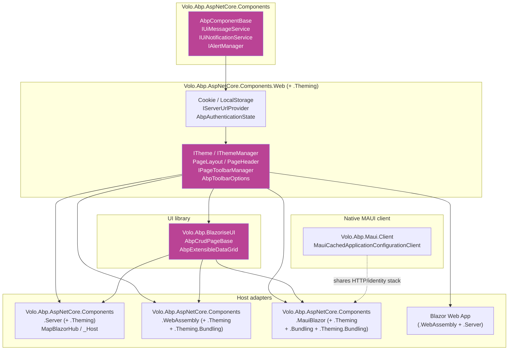

ABP ships a complete Blazor stack that targets every hosting model the Razor Components programming model supports: **Blazor Server**, **Blazor WebAssembly**, **Blazor Web App** (the unified server + WASM rendering host introduced in .NET 8), and **.NET MAUI Blazor Hybrid** for mobile/desktop. All four hosts share a single theming, layout, page-toolbar, and Blazorise-based UI library — the host-specific packages only contribute what genuinely differs (hosting wiring, configuration cache, HTTP message handler, bundle delivery).

The source for the entire stack lives in `framework/src/`:

- [`Volo.Abp.AspNetCore.Components`](https://github.com/abpframework/abp/tree/dev/framework/src/Volo.Abp.AspNetCore.Components) — the renderer-agnostic primitives ([`AbpComponentBase`](https://github.com/abpframework/abp/blob/dev/framework/src/Volo.Abp.AspNetCore.Components/Volo/Abp/AspNetCore/Components/AbpComponentBase.cs), `IUiMessageService`, `IUiNotificationService`, alerts, block UI, progression, claims cache).
- [`Volo.Abp.AspNetCore.Components.Web`](https://github.com/abpframework/abp/tree/dev/framework/src/Volo.Abp.AspNetCore.Components.Web) + `.Web.Theming` — the shared Web layer: cookie/local-storage helpers, server URL provider, layout slots, page toolbars, theme manager, routing options.
- `.Server` + `.Server.Theming` — Blazor Server hosting wiring and global script/style bundles.
- `.WebAssembly` + `.WebAssembly.Theming` + `.WebAssembly.Theming.Bundling` — the WASM host extension methods (`AddApplicationAsync<TModule>`), the remote-auth state provider, and build-time global asset bundling.
- `.MauiBlazor` + `.MauiBlazor.Bundling` + `.MauiBlazor.Theming` + `.MauiBlazor.Theming.Bundling` — the hybrid host: `BlazorWebView` integration and runtime bundle delivery from the device file system.
- [`Volo.Abp.BlazoriseUI`](https://github.com/abpframework/abp/tree/dev/framework/src/Volo.Abp.BlazoriseUI) — the cross-host UI component library built on **Blazorise**: `AbpCrudPageBase<>`, `AbpExtensibleDataGrid`, `EntityActions`, the `BlazoriseUiMessageService`/`NotificationService` replacements.
- [`Volo.Abp.Maui.Client`](https://github.com/abpframework/abp/tree/dev/framework/src/Volo.Abp.Maui.Client) — token storage and configuration cache for a pure MAUI client that talks to ABP HTTP APIs without Razor Components.

## Where this fits



Read the diagram top-down: every host depends on the **Web** + **Web.Theming** layers, which depend on the renderer-agnostic **Components** package. The Blazorise UI library sits beside the theming layer and is referenced by every host that renders Razor markup. The pure MAUI client uses the same HTTP/identity stack as MauiBlazor but skips Razor Components entirely.

## Pages in this group

<CardGroup cols={2}>
  <Card title="Shared Web components" icon="cube" href="/blazor/components-web">
    `Volo.Abp.AspNetCore.Components.Web` and `.Web.Theming` — `AbpComponentBase`, message and notification services, cookie/local-storage, `PageLayout`, `PageHeader`, `BreadcrumbItem`, page toolbars, dynamic layout components, layout hooks.
  </Card>
  <Card title="Blazor Server host" icon="server" href="/blazor/components-server">
    `Volo.Abp.AspNetCore.Components.Server` (+ `.Theming`) — `AddServerSideBlazor`, `MapBlazorHub`, `_Host` fallback, the global script/style bundle, `AbpBlazorMessageLocalizerHelper<T>`.
  </Card>
  <Card title="Blazor WebAssembly host" icon="browser" href="/blazor/components-webassembly">
    `Volo.Abp.AspNetCore.Components.WebAssembly` (+ `.Theming` + `.Theming.Bundling`) — `WebAssemblyHostBuilder.AddApplicationAsync<TModule>`, dynamic option configurators, remote authentication state provider, build-time global bundle.
  </Card>
  <Card title="MAUI Blazor Hybrid" icon="mobile" href="/blazor/components-mauiblazor">
    `Volo.Abp.AspNetCore.Components.MauiBlazor` (+ `.Theming` + `.Bundling` + `.Theming.Bundling`) — `AbpBlazorWebView`, the runtime bundle file provider, MAUI-specific HTTP handler, language and timezone providers.
  </Card>
  <Card title="Theming pipeline" icon="palette" href="/blazor/theming">
    `ITheme`, `IThemeManager`, `IThemeSelector`, `AbpThemingOptions`, `StandardLayouts`, `IToolbarManager`, `IPageToolbarManager`, `IMenuManager`, `DynamicLayoutComponent`, `LayoutHook`.
  </Card>
  <Card title="Bundling pipeline" icon="boxes-stacked" href="/blazor/bundling">
    `IComponentBundleManager`, `BlazorServerComponentBundleManager`, `BlazorWebAssemblyStandardBundles`, `MauiBlazorStandardBundles`, the global-assets file generator, and the runtime `IMauiBlazorContentFileProvider`.
  </Card>
  <Card title="Blazorise UI" icon="table-cells" href="/blazor/blazorise-ui">
    `Volo.Abp.BlazoriseUI` — `AbpBaseEditDialog`, `AbpCrudPageBase<,,>`, `AbpExtensibleDataGrid`, `EntityActions`, the dynamic property-editor components, the page progress and modal helpers.
  </Card>
  <Card title="MAUI native client" icon="mobile-screen" href="/blazor/maui-client">
    `Volo.Abp.Maui.Client` — `AbpMauiClientModule`, `MauiCachedApplicationConfigurationClient`, configuration cache and how it shares the HTTP client stack with [/http/http-client](/http/http-client).
  </Card>
</CardGroup>

## The four flavors at a glance

<AccordionGroup>
  <Accordion title="Blazor Server" icon="server">
    Renders Razor components on the server and pushes UI diffs to the browser over a SignalR connection. Wired up by [`AbpAspNetCoreComponentsServerModule`](https://github.com/abpframework/abp/blob/dev/framework/src/Volo.Abp.AspNetCore.Components.Server/Volo/Abp/AspNetCore/Components/Server/AbpAspNetCoreComponentsServerModule.cs), which calls `context.Services.AddServerSideBlazor(...)` and registers an endpoint mapping that calls `endpointContext.Endpoints.MapBlazorHub(...)` followed by `endpointContext.Endpoints.MapFallbackToPage("/_Host")`. The same module excludes `/_blazor` from the ABP unit-of-work and auditing middlewares.

    **Best for:** existing ASP.NET Core hosts, low-latency intranet apps, scenarios where the browser cannot run WebAssembly.
  </Accordion>
  <Accordion title="Blazor WebAssembly" icon="browser">
    Runs the .NET runtime inside the browser via WebAssembly. Bootstrapping is in [`AbpWebAssemblyHostBuilderExtensions.AddApplicationAsync<TStartupModule>`](https://github.com/abpframework/abp/blob/dev/framework/src/Volo.Abp.AspNetCore.Components.WebAssembly/Microsoft/AspNetCore/Components/WebAssembly/Hosting/AbpWebAssemblyHostBuilderExtensions.cs), which registers `builder` and `builder.Configuration` as singletons, calls `services.AddApplicationAsync<TModule>(...)`, and returns an `IAbpApplicationWithExternalServiceProvider` that the host initializes after `WebAssemblyHost.Build()`.

    **Best for:** static-hostable SPAs, offline-capable apps, deployments behind a CDN.
  </Accordion>
  <Accordion title="Blazor Web App (.NET 8+)" icon="layer-group">
    The unified hosting model that mixes Server rendering, streaming, and WebAssembly interactivity. ABP routes through the same `.Server` and `.WebAssembly` packages plus an `IsBlazorWebApp` flag on `AbpAspNetCoreComponentsWebOptions` — when set, the Server module skips its own `MapBlazorHub` call and defers to the Web App pipeline. The WebAssembly side uses [`AbpBlazorWebAppServiceCollectionExtensions`](https://github.com/abpframework/abp/blob/dev/framework/src/Volo.Abp.AspNetCore.Components.WebAssembly/Microsoft/Extensions/DependencyInjection/AbpBlazorWebAppServiceCollectionExtensions.cs) to wire up the shared service collection.

    **Best for:** new greenfield apps that want SSR + islands of interactivity.
  </Accordion>
  <Accordion title=".NET MAUI Blazor Hybrid" icon="mobile">
    Hosts Razor components inside a `BlazorWebView` on iOS, Android, macOS, and Windows. [`AbpAspNetCoreComponentsMauiBlazorModule`](https://github.com/abpframework/abp/blob/dev/framework/src/Volo.Abp.AspNetCore.Components.MauiBlazor/Volo/Abp/AspNetCore/Components/MauiBlazor/AbpAspNetCoreComponentsMauiBlazorModule.cs) plugs `AbpMauiBlazorClientHttpMessageHandler` into every HTTP client proxy and initializes `MauiBlazorCachedApplicationConfigurationClient` during application startup so the device has a warm configuration cache before the first component renders.

    **Best for:** offline-capable mobile/desktop apps that need to share Razor markup with a web front end.
  </Accordion>
</AccordionGroup>

## Shared cross-cutting services

Every Blazor host inherits the same renderer-agnostic services from [`Volo.Abp.AspNetCore.Components`](https://github.com/abpframework/abp/tree/dev/framework/src/Volo.Abp.AspNetCore.Components):

<CardGroup cols={2}>
  <Card title="AbpComponentBase" icon="cube">
    The base class for every ABP component. Lazily resolves `IStringLocalizer`, `ILogger`, `IAuthorizationService`, `ICurrentUser`, `ICurrentTenant`, `IUiMessageService`, `IUiNotificationService`, `IAlertManager`, `IClock`, and `IObjectMapper` from a scoped or "non-scoped" service provider.
  </Card>
  <Card title="IUiMessageService / IUiNotificationService" icon="comment">
    Abstract `Info` / `Success` / `Warn` / `Error` / `Confirm` calls that hosts implement with their UI library. `Volo.Abp.BlazoriseUI` ships the default Blazorise-based replacements with `[Dependency(ReplaceServices = true)]`.
  </Card>
  <Card title="AlertManager + AlertList" icon="triangle-exclamation">
    A per-circuit/per-tab collection of `Alert` objects the layout renders above the page. Surfaced as the `Alerts` property on `AbpComponentBase`.
  </Card>
  <Card title="IUiPageProgressService + IUiBlockUiService" icon="spinner">
    The HTTP message handlers (Web, MauiBlazor) call these during outgoing requests so layouts can render a top-of-page progress bar and overlay spinners during slow operations.
  </Card>
</CardGroup>

## Theming and Blazorise

The **theme** is the integration point between ABP and a concrete UI library. A theme is anything that implements [`ITheme`](https://github.com/abpframework/abp/blob/dev/framework/src/Volo.Abp.AspNetCore.Components.Web.Theming/Theming/ITheme.cs):

```csharp
public interface ITheme
{
    Type GetLayout(string name, bool fallbackToDefault = true);
}
```

…and `IThemeManager.CurrentTheme` returns the active one via an `IThemeSelector`. Standard layout slots are constants on [`StandardLayouts`](https://github.com/abpframework/abp/blob/dev/framework/src/Volo.Abp.AspNetCore.Components.Web.Theming/Layout/StandardLayouts.cs) — `Application`, `Account`, `Public`, `Empty` — and `Volo.Abp.BlazoriseUI` is the cross-host UI library that every commercial ABP theme (LeptonX, Basic, Lepton) builds on. See [the theming page](/blazor/theming) for the full pipeline.

## Related groups

<CardGroup cols={2}>
  <Card title="ASP.NET Core hosting" icon="globe" href="/aspnetcore/overview">
    The Blazor Server host depends on the same `AbpAspNetCoreModule`, MVC contracts, and bundling primitives covered in the ASP.NET Core group.
  </Card>
  <Card title="MVC UI bundling" icon="box" href="/aspnetcore/mvc-ui-bundling">
    `Volo.Abp.AspNetCore.Mvc.UI.Bundling` defines `AbpBundlingOptions`, `IBundleManager`, and `GlobalAssets` — the substrate every Blazor bundle uses.
  </Card>
  <Card title="HTTP client stack" icon="cloud" href="/http/http-client">
    The WebAssembly and MAUI hosts call ABP application services through `Volo.Abp.Http.Client`. The MauiBlazor module plugs a custom `DelegatingHandler` into every proxy.
  </Card>
  <Card title="Angular UI" icon="angular" href="/angular/overview">
    The parallel front-end stack. Many of the abstractions (menu manager, current user, current tenant, claims cache) have direct Angular counterparts.
  </Card>
</CardGroup>
