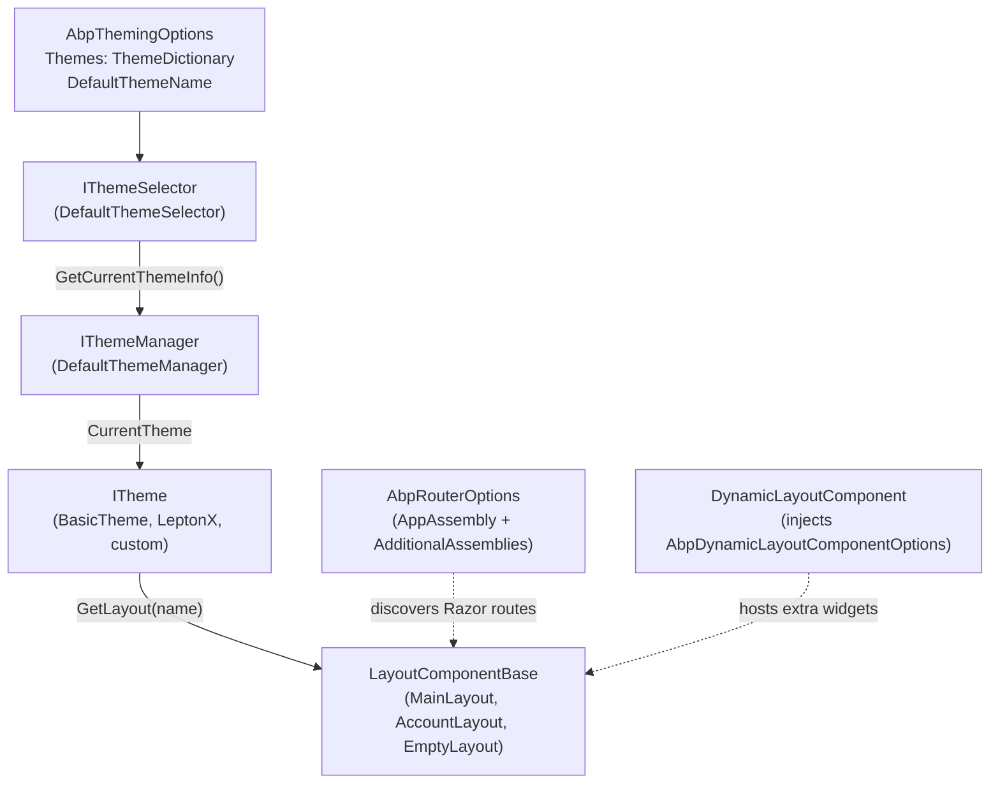

ABP's Blazor theming pipeline is one of the few framework systems that is genuinely host-agnostic: the **same** `ITheme`, `IThemeManager`, `IThemeSelector`, `AbpThemingOptions`, `StandardLayouts`, `PageLayout`, and `IPageToolbarManager` abstractions are consumed by [Blazor Server](/blazor/components-server), [Blazor WebAssembly](/blazor/components-webassembly), and [MAUI Blazor](/blazor/components-mauiblazor) hosts without modification. Concrete theme packages — `Volo.Abp.AspNetCore.Components.Web.BasicTheme`, the LeptonX themes, your own custom themes — implement `ITheme` once and ship one CSS bundle per host; the routing and layout machinery resolves the correct `LayoutComponentBase` type at render time. This page documents the contracts that make that possible.

<Info>
**Packages**: the abstractions live in [`framework/src/Volo.Abp.AspNetCore.Components.Web.Theming/`](https://github.com/abpframework/abp/tree/dev/framework/src/Volo.Abp.AspNetCore.Components.Web.Theming). The host-specific glue lives in [`framework/src/Volo.Abp.AspNetCore.Components.Server.Theming/`](https://github.com/abpframework/abp/tree/dev/framework/src/Volo.Abp.AspNetCore.Components.Server.Theming) and [`framework/src/Volo.Abp.AspNetCore.Components.WebAssembly.Theming/`](https://github.com/abpframework/abp/tree/dev/framework/src/Volo.Abp.AspNetCore.Components.WebAssembly.Theming).
</Info>

## The mental model



A request lands on a routed Razor page; the page declares `@layout MainLayout` or calls `theme.GetApplicationLayout()` to pick the right layout type; the layout then renders `<DynamicLayoutComponent />` which injects whatever components extension modules have registered.

## `ITheme` and `IThemeManager`

The base contract is intentionally minimal. From `framework/src/Volo.Abp.AspNetCore.Components.Web.Theming/Theming/ITheme.cs`:

```csharp
public interface ITheme
{
    Type GetLayout(string name, bool fallbackToDefault = true);
}
```

A theme is "anything that can map a layout name to a `LayoutComponentBase` type". `IThemeManager` (from `IThemeManager.cs` in the same folder) exposes the currently selected theme:

```csharp
public interface IThemeManager
{
    ITheme CurrentTheme { get; }
}
```

The default implementation in `Theming/DefaultThemeManager.cs` lazily resolves the theme through the service provider on the first call to `CurrentTheme`:

```csharp
public class DefaultThemeManager : IThemeManager, IScopedDependency, IServiceProviderAccessor
{
    public IServiceProvider ServiceProvider { get; }
    public ITheme CurrentTheme => GetCurrentTheme();

    private ITheme? _currentTheme;
    protected IThemeSelector ThemeSelector { get; }

    public DefaultThemeManager(IServiceProvider serviceProvider, IThemeSelector themeSelector)
    {
        ServiceProvider = serviceProvider;
        ThemeSelector = themeSelector;
    }

    protected virtual ITheme GetCurrentTheme()
    {
        if (_currentTheme != null) return _currentTheme;

        _currentTheme = (ITheme)ServiceProvider.GetRequiredService(
            ThemeSelector.GetCurrentThemeInfo().ThemeType);
        return _currentTheme;
    }
}
```

Note the registration: `IScopedDependency`. In Blazor Server that means one theme per SignalR circuit; in WASM and MAUI it means one theme per client-scope service provider, which is effectively the lifetime of the app session.

## `IThemeSelector` and `ThemeInfo`

`IThemeSelector` is the strategy that picks the active theme. The default implementation reads `AbpThemingOptions`:

```csharp
// DefaultThemeSelector.cs
public class DefaultThemeSelector : IThemeSelector, ITransientDependency
{
    protected AbpThemingOptions Options { get; }

    public DefaultThemeSelector(IOptions<AbpThemingOptions> options)
    {
        Options = options.Value;
    }

    public virtual ThemeInfo GetCurrentThemeInfo()
    {
        if (!Options.Themes.Any())
        {
            throw new AbpException(
                $"No theme registered! Use {nameof(AbpThemingOptions)} to register themes.");
        }

        if (Options.DefaultThemeName == null)
        {
            return Options.Themes.Values.First();
        }

        var themeInfo = Options.Themes.Values.FirstOrDefault(t => t.Name == Options.DefaultThemeName);
        if (themeInfo == null)
        {
            throw new AbpException(
                "Default theme is configured but it's not found in the registered themes: "
                    + Options.DefaultThemeName);
        }

        return themeInfo;
    }
}
```

Replace `DefaultThemeSelector` to implement user-preference-based theming — e.g. read a "PreferredTheme" claim from `ICurrentUser` and look up the matching `ThemeInfo` from `Options.Themes`.

`ThemeInfo` ([source](https://github.com/abpframework/abp/blob/dev/framework/src/Volo.Abp.AspNetCore.Components.Web.Theming/Theming/ThemeInfo.cs)) holds a theme's runtime type and name:

```csharp
public class ThemeInfo
{
    public Type ThemeType { get; }
    public string Name { get; }

    public ThemeInfo([NotNull] Type themeType)
    {
        Check.NotNull(themeType, nameof(themeType));

        if (!typeof(ITheme).IsAssignableFrom(themeType))
        {
            throw new AbpException(
                $"Given {nameof(themeType)} ({themeType.AssemblyQualifiedName}) should be type of {typeof(ITheme).AssemblyQualifiedName}");
        }

        ThemeType = themeType;
        Name = ThemeNameAttribute.GetName(themeType);
    }
}
```

The `Name` is resolved from the `[ThemeName("...")]` attribute or falls back to the type name. `ThemeNameAttribute` (in `Theming/ThemeNameAttribute.cs`) is just metadata:

```csharp
[AttributeUsage(AttributeTargets.Class)]
public class ThemeNameAttribute : Attribute
{
    public string Name { get; set; }
    public ThemeNameAttribute(string name) { Name = name; }

    public static string GetName(Type themeType)
    {
        return themeType.GetCustomAttributes(true)
            .OfType<ThemeNameAttribute>()
            .FirstOrDefault()?.Name ?? themeType.Name;
    }
}
```

## `AbpThemingOptions` and `ThemeDictionary`

`AbpThemingOptions` (in `Theming/AbpThemingOptions.cs`) is the configuration hub:

```csharp
public class AbpThemingOptions
{
    public ThemeDictionary Themes { get; }

    public string? DefaultThemeName { get; set; }

    public AbpThemingOptions()
    {
        Themes = new ThemeDictionary();
    }
}
```

`ThemeDictionary` (in `Theming/ThemeDictionary.cs`) is a `Dictionary<Type, ThemeInfo>` with a fluent `Add<TTheme>()`:

```csharp
public class ThemeDictionary : Dictionary<Type, ThemeInfo>
{
    public ThemeInfo Add<TTheme>() where TTheme : ITheme => Add(typeof(TTheme));

    public ThemeInfo Add(Type themeType)
    {
        if (ContainsKey(themeType))
        {
            throw new AbpException("This theme is already added before: " + themeType.AssemblyQualifiedName);
        }

        return this[themeType] = new ThemeInfo(themeType);
    }
}
```

A typical theme module registers itself and (only if no other theme has) sets itself as the default. The `BasicTheme` module from `modules/basic-theme/` is the canonical example:

```csharp
// modules/basic-theme/src/Volo.Abp.AspNetCore.Components.Web.BasicTheme/AbpAspNetCoreComponentsWebBasicThemeModule.cs
public override void ConfigureServices(ServiceConfigurationContext context)
{
    Configure<AbpThemingOptions>(options =>
    {
        options.Themes.Add<BasicTheme>();
        if (options.DefaultThemeName == null)
        {
            options.DefaultThemeName = BasicTheme.Name;
        }
    });
}
```

## `StandardLayouts` and `BasicTheme.GetLayout`

The named-layout constants live in `Layout/StandardLayouts.cs`:

```csharp
public static class StandardLayouts
{
    public const string Application = "Application";
    public const string Account     = "Account";
    public const string Public      = "Public";
    public const string Empty       = "Empty";
}
```

A concrete `ITheme` maps each name to a `LayoutComponentBase` type. Here is the basic theme's mapping from `modules/basic-theme/src/Volo.Abp.AspNetCore.Components.Web.BasicTheme/BasicTheme.cs`:

```csharp
[ThemeName(Name)]
public class BasicTheme : ITheme, ITransientDependency
{
    public const string Name = "Basic";

    public virtual Type GetLayout(string name, bool fallbackToDefault = true)
    {
        switch (name)
        {
            case StandardLayouts.Application:
            case StandardLayouts.Account:
            case StandardLayouts.Empty:
                return typeof(MainLayout);
            default:
                return fallbackToDefault ? typeof(MainLayout) : typeof(NullLayout);
        }
    }
}
```

The basic theme deliberately points all four well-known names at the same `MainLayout` — it is a minimum-viable theme used in starter templates. LeptonX and other commercial themes split these into distinct components: `Application` is the authenticated dashboard chrome, `Account` is the un-chromed login/register layout, `Public` is the marketing layout, `Empty` is no chrome at all.

Use the helper extensions in `Theming/ThemeExtensions.cs` when you need to call the right `GetLayout`:

```csharp
public static class ThemeExtensions
{
    public static Type GetApplicationLayout(this ITheme theme, bool fallbackToDefault = true)
        => theme.GetLayout(StandardLayouts.Application, fallbackToDefault);

    public static Type GetAccountLayout(this ITheme theme, bool fallbackToDefault = true)
        => theme.GetLayout(StandardLayouts.Account, fallbackToDefault);

    public static Type GetPublicLayout(this ITheme theme, bool fallbackToDefault = true)
        => theme.GetLayout(StandardLayouts.Public, fallbackToDefault);

    public static Type GetEmptyLayout(this ITheme theme, bool fallbackToDefault = true)
        => theme.GetLayout(StandardLayouts.Empty, fallbackToDefault);
}
```

A login page's code-behind typically does:

```csharp
[Inject] public IThemeManager ThemeManager { get; set; } = default!;

protected override void OnInitialized()
{
    Layout = ThemeManager.CurrentTheme.GetAccountLayout();
}
```

## Writing a custom theme

<Steps>
<Step title="Create the `ITheme` class">
```csharp
[ThemeName(Name)]
public class CorporateTheme : ITheme, ITransientDependency
{
    public const string Name = "Corporate";

    public virtual Type GetLayout(string name, bool fallbackToDefault = true)
        => name switch
        {
            StandardLayouts.Application => typeof(CorporateAppLayout),
            StandardLayouts.Account     => typeof(CorporateAuthLayout),
            StandardLayouts.Public      => typeof(CorporateMarketingLayout),
            StandardLayouts.Empty       => typeof(EmptyLayout),
            _ => fallbackToDefault ? typeof(CorporateAppLayout) : typeof(NullLayout),
        };
}
```
The `ITransientDependency` lets `DefaultThemeManager.GetCurrentTheme` resolve it through `IServiceProvider.GetRequiredService`.
</Step>
<Step title="Implement each layout">
Each layout is a regular `LayoutComponentBase` in `.razor`. Inject `IThemeManager`, `PageLayout`, and the rendering helpers, and call `<DynamicLayoutComponent />` somewhere in the markup so other modules can contribute widgets without touching your file.
</Step>
<Step title="Register the theme in a module">
Add an `AbpModule` that depends on `[DependsOn(typeof(AbpAspNetCoreComponentsWebThemingModule))]` and configures `AbpThemingOptions`:
```csharp
Configure<AbpThemingOptions>(options =>
{
    options.Themes.Add<CorporateTheme>();
    options.DefaultThemeName = CorporateTheme.Name;
});
```
</Step>
<Step title="Contribute a router assembly">
If your theme ships Razor pages (toolbar pages, error pages, account pages), add its assembly to `AbpRouterOptions.AdditionalAssemblies` so the router can discover the `@page` directives:
```csharp
Configure<AbpRouterOptions>(options =>
{
    options.AdditionalAssemblies.Add(typeof(CorporateThemeModule).Assembly);
});
```
</Step>
<Step title="Add per-host bundle modules">
For Server, depend on `AbpAspNetCoreComponentsServerThemingModule` and add CSS through a `BundleContributor` that targets `BlazorStandardBundles.Styles.Global`. For WebAssembly, depend on `AbpAspNetCoreComponentsWebAssemblyThemingBundlingModule` and target `BlazorWebAssemblyStandardBundles.Styles.Global`. See [`/blazor/bundling`](/blazor/bundling) for details.
</Step>
</Steps>

## Host theming modules

### Server

The `Volo.Abp.AspNetCore.Components.Server.Theming` package wires up the shared theming and adds server-side bundles:

```csharp
// framework/src/Volo.Abp.AspNetCore.Components.Server.Theming/AbpAspNetCoreComponentsServerThemingModule.cs
[DependsOn(
    typeof(AbpAspNetCoreComponentsServerModule),
    typeof(AbpAspNetCoreMvcUiPackagesModule),
    typeof(AbpAspNetCoreComponentsWebThemingModule),
    typeof(AbpAspNetCoreMvcUiBundlingModule)
)]
public class AbpAspNetCoreComponentsServerThemingModule : AbpModule
{
    public override void ConfigureServices(ServiceConfigurationContext context)
    {
        Configure<AbpBundlingOptions>(options =>
        {
            options.StyleBundles.Add(BlazorStandardBundles.Styles.Global, bundle =>
            {
                bundle.AddContributors(typeof(BlazorGlobalStyleContributor));
            });

            options.ScriptBundles.Add(BlazorStandardBundles.Scripts.Global, bundle =>
            {
                bundle.AddContributors(typeof(BlazorGlobalScriptContributor));
            });
        });
    }
}
```

### WebAssembly

The WASM theming package is mostly a stub that depends on the bundling sibling and the shared theming module:

```csharp
// framework/src/Volo.Abp.AspNetCore.Components.WebAssembly.Theming/AbpAspNetCoreComponentsWebAssemblyThemingModule.cs
[DependsOn(
    typeof(AbpAspNetCoreComponentsWebAssemblyThemingBundlingModule),
    typeof(AbpAspNetCoreComponentsWebThemingModule),
    typeof(AbpAspNetCoreComponentsWebAssemblyModule)
)]
public class AbpAspNetCoreComponentsWebAssemblyThemingModule : AbpModule { }
```

The actual style assets are configured by the `*.Bundling` module — see [`/blazor/bundling`](/blazor/bundling).

## `DynamicLayoutComponent`

The shared theming module configures one component out of the box:

```csharp
// framework/src/Volo.Abp.AspNetCore.Components.Web.Theming/AbpAspNetCoreComponentsWebThemingModule.cs
public override void ConfigureServices(ServiceConfigurationContext context)
{
    Configure<AbpDynamicLayoutComponentOptions>(options =>
    {
        options.Components.Add(typeof(AbpAuthenticationState), null);
    });
}
```

`AbpDynamicLayoutComponentOptions` (from `AbpDynamicLayoutComponentOptions.cs`) holds the registry:

```csharp
public class AbpDynamicLayoutComponentOptions
{
    [NotNull]
    public Dictionary<Type, IDictionary<string,object>?> Components { get; set; }

    public AbpDynamicLayoutComponentOptions()
    {
        Components = new Dictionary<Type, IDictionary<string, object>?>();
    }
}
```

A layout includes `<DynamicLayoutComponent />` once; the component (in `Components/DynamicLayoutComponent.razor.cs`) iterates `AbpDynamicLayoutComponentOptions.Components` and renders each registered type with the matching parameter dictionary. Modules like the Account module use this to wire up `<RedirectToLogin />` without forcing the theme author to remember it.

## `PageLayout`, `PageHeader`, and breadcrumbs

A theme exposes a `PageHeader` so individual pages can declaratively set their title, breadcrumbs, and toolbar items. `Layout/PageLayout.cs` is the scoped state holder:

```csharp
public class PageLayout : IScopedDependency, INotifyPropertyChanged
{
    public virtual string? Title { get; set; }
    public string? MenuItemName { get; set; }

    public virtual ObservableCollection<BreadcrumbItem> BreadcrumbItems { get; } = new();
    public virtual ObservableCollection<PageToolbarItem> ToolbarItems { get; } = new();

    public event PropertyChangedEventHandler? PropertyChanged;

    public void Reset()
    {
        Title = string.Empty;
        MenuItemName = string.Empty;
        BreadcrumbItems.Clear();
        ToolbarItems.Clear();
    }
}
```

`PageHeaderOptions.cs` lets you globally toggle which header elements render:

```csharp
public class PageHeaderOptions
{
    public bool RenderPageTitle  { get; set; } = true;
    public bool RenderBreadcrumbs { get; set; } = true;
    public bool RenderToolbar    { get; set; } = true;
}
```

The `PageHeader.razor.cs` component listens to `PageLayout.PropertyChanged` and re-renders, so a page can simply write `PageLayout.Title = "Users"` in `OnInitialized` and have it show up.

## The page toolbar system

Page toolbars let modules contribute action buttons to specific pages without editing the page. The contract is in `PageToolbars/IPageToolbarManager.cs`:

```csharp
public interface IPageToolbarManager
{
    Task<PageToolbarItem[]> GetItemsAsync(PageToolbar toolbar);
}
```

`PageToolbars/PageToolbarManager.cs` runs each contributor inside its own scope:

```csharp
public class PageToolbarManager : IPageToolbarManager, ITransientDependency
{
    protected IServiceScopeFactory ServiceScopeFactory { get; }

    public virtual async Task<PageToolbarItem[]> GetItemsAsync(PageToolbar toolbar)
    {
        if (toolbar == null || !toolbar.Contributors.Any())
            return Array.Empty<PageToolbarItem>();

        using (var scope = ServiceScopeFactory.CreateScope())
        {
            var context = new PageToolbarContributionContext(scope.ServiceProvider);
            foreach (var contributor in toolbar.Contributors)
            {
                await contributor.ContributeAsync(context);
            }
            return context.Items.OrderBy(i => i.Order).ToArray();
        }
    }
}
```

A module contributes by implementing [`IPageToolbarContributor`](https://github.com/abpframework/abp/blob/dev/framework/src/Volo.Abp.AspNetCore.Components.Web.Theming/PageToolbars/IPageToolbarContributor.cs):

```csharp
public interface IPageToolbarContributor
{
    Task ContributeAsync(PageToolbarContributionContext context);
}
```

The base class `PageToolbarContributor` in the same folder gives an abstract `ContributeAsync` to override. Use the helper extension methods in `PageToolbars/PageToolbarExtensions.cs` to register contributors against well-known page identifiers.

<Note>
The page-toolbar system and the main toolbar system (`IToolbarManager` / `AbpToolbarOptions` / `StandardToolbars.Main`) are siblings, not the same thing. Page toolbars contribute to a specific page (`AbpPagedAndSortedResultRequestDto` list pages, settings pages, etc.) while the main toolbar contributes to the layout chrome (header bar, language switcher, user menu).
</Note>

## Main toolbar contract

`Toolbars/IToolbarManager.cs` declares the lookup:

```csharp
public interface IToolbarManager
{
    Task<Toolbar> GetAsync(string name);
}
```

The `Toolbars/AbpToolbarOptions.cs` configuration holds the contributors:

```csharp
public class AbpToolbarOptions
{
    [NotNull]
    public List<IToolbarContributor> Contributors { get; }

    public AbpToolbarOptions()
    {
        Contributors = new List<IToolbarContributor>();
    }
}
```

`Toolbars/StandardToolbars.cs` defines the single well-known name:

```csharp
public static class StandardToolbars
{
    public const string Main = "Main";
}
```

A theme module typically calls `options.Contributors.Add(new BasicThemeToolbarContributor())` — see the basic theme for an example.

## Router configuration

A theme almost always contributes Razor pages whose routes must be discovered by the central `<Router />`. The router pulls from `AbpRouterOptions` in `Routing/AbpRouterOptions.cs`:

```csharp
public class AbpRouterOptions
{
    public Assembly AppAssembly { get; set; } = default!;
    public RouterAssemblyList AdditionalAssemblies { get; }
}
```

The basic-theme WASM host illustrates how to register a theme's pages:

```csharp
// modules/basic-theme/src/Volo.Abp.AspNetCore.Components.WebAssembly.BasicTheme/AbpAspNetCoreComponentsWebAssemblyBasicThemeModule.cs
Configure<AbpRouterOptions>(options =>
{
    options.AdditionalAssemblies.Add(
        typeof(AbpAspNetCoreComponentsWebAssemblyBasicThemeModule).Assembly);
});
```

## Putting it all together

<CardGroup cols={2}>
  <Card title="Components.Web (shared)" icon="cube" href="/blazor/components-web">
    `AbpComponentBase`, `IUiMessageService`, page progress, cookie helpers — what `PageHeader`, `PageLayout`, and the page toolbar render with.
  </Card>
  <Card title="Components.Server host" icon="server" href="/blazor/components-server">
    Wires the `Server.Theming` global bundle into MVC bundling and `MapBlazorHub`.
  </Card>
  <Card title="Components.WebAssembly host" icon="browser" href="/blazor/components-webassembly">
    Wires the `WebAssembly.Theming.Bundling` global asset into the static `wwwroot/global-styles.css` file.
  </Card>
  <Card title="MauiBlazor host" icon="mobile" href="/blazor/components-mauiblazor">
    Hosts the same `ITheme` inside a `BlazorWebView` with a runtime `IMauiBlazorContentFileProvider`.
  </Card>
  <Card title="Bundling pipeline" icon="boxes-stacked" href="/blazor/bundling">
    `BlazorStandardBundles`, `BlazorWebAssemblyStandardBundles`, `BundleContributor`, the CLI `abp bundle` command.
  </Card>
  <Card title="Blazorise UI" icon="table-cells" href="/blazor/blazorise-ui">
    `AbpCrudPageBase<>`, `AbpExtensibleDataGrid`, `SubmitButton` — the components your `MainLayout` renders inside `@Body`.
  </Card>
</CardGroup>

## Source map

<Accordion title="framework/src/Volo.Abp.AspNetCore.Components.Web.Theming/Theming/">
- `ITheme.cs` — the `GetLayout(name, fallbackToDefault)` contract.
- `IThemeManager.cs` — `CurrentTheme` lookup, scoped per circuit/session.
- `DefaultThemeManager.cs` — caches the resolved theme per scope.
- `IThemeSelector.cs` + `DefaultThemeSelector.cs` — picks the active `ThemeInfo`.
- `ThemeInfo.cs` — wraps the theme `Type` and resolved `Name`.
- `ThemeDictionary.cs` — `Dictionary<Type, ThemeInfo>` with `Add<TTheme>()`.
- `ThemeExtensions.cs` — `GetApplicationLayout`, `GetAccountLayout`, `GetPublicLayout`, `GetEmptyLayout` helpers.
- `ThemeNameAttribute.cs` — `[ThemeName("Basic")]` metadata.
- `AbpThemingOptions.cs` — `Themes` dictionary + `DefaultThemeName`.
</Accordion>

<Accordion title="framework/src/Volo.Abp.AspNetCore.Components.Web.Theming/Layout/">
- `StandardLayouts.cs` — `Application`, `Account`, `Public`, `Empty` name constants.
- `PageLayout.cs` — scoped state holder for title, breadcrumbs, toolbar items.
- `PageHeader.razor.cs` + `.razor` — the component a page uses to set its chrome.
- `PageHeaderOptions.cs` — global toggles for rendering parts of the header.
</Accordion>

<Accordion title="framework/src/Volo.Abp.AspNetCore.Components.Web.Theming/Toolbars/ + PageToolbars/">
- `IToolbarManager.cs` + `AbpToolbarOptions.cs` + `StandardToolbars.cs` — main toolbar.
- `Toolbar.cs` + `ToolbarConfigurationContext.cs` + `IToolbarConfigurationContext.cs` + `IToolbarContributor.cs` — main toolbar contributor API.
- `IPageToolbarManager.cs` + `PageToolbarManager.cs` + `IPageToolbarContributor.cs` + `PageToolbarContributor.cs` — page toolbar manager and contributors.
- `PageToolbar.cs` + `PageToolbarItem.cs` + `PageToolbarItemList.cs` + `PageToolbarContributorList.cs` + `PageToolbarDictionary.cs` + `SimplePageToolbarContributor.cs` + `PageToolbarExtensions.cs` + `PageToolbarContributionContext.cs` — supporting types.
</Accordion>

<Accordion title="framework/src/Volo.Abp.AspNetCore.Components.Web.Theming/Routing/">
- `AbpRouterOptions.cs` — `AppAssembly` + `AdditionalAssemblies`.
- `RouterAssemblyList.cs` — typed list helper.
</Accordion>

<Accordion title="framework/src/Volo.Abp.AspNetCore.Components.Web.Theming/Components/">
- `DynamicLayoutComponent.razor.cs` — injects `AbpDynamicLayoutComponentOptions`, renders every registered component.
- `LayoutHooks/LayoutHook.razor.cs` — named layout-hook component used by extensions to render into specific layout regions.
- `AbpDynamicLayoutComponentOptions.cs` — `Components: Dictionary<Type, IDictionary<string,object>?>`.
</Accordion>

<Accordion title="framework/src/Volo.Abp.AspNetCore.Components.Server.Theming/ + WebAssembly.Theming/">
- `AbpAspNetCoreComponentsServerThemingModule.cs` — adds the server-side bundles.
- `Bundling/BlazorGlobalBundles.cs` + `BlazorGlobalScriptContributor.cs` + `BlazorGlobalStyleContributor.cs` + `BlazorServerComponentBundleManager.cs` — concrete bundle wiring.
- `AbpAspNetCoreComponentsWebAssemblyThemingModule.cs` + `WebAssemblyComponentBundleManager.cs` + `ComponentsComponentsBundleContributor.cs` — the WASM side.
</Accordion>
