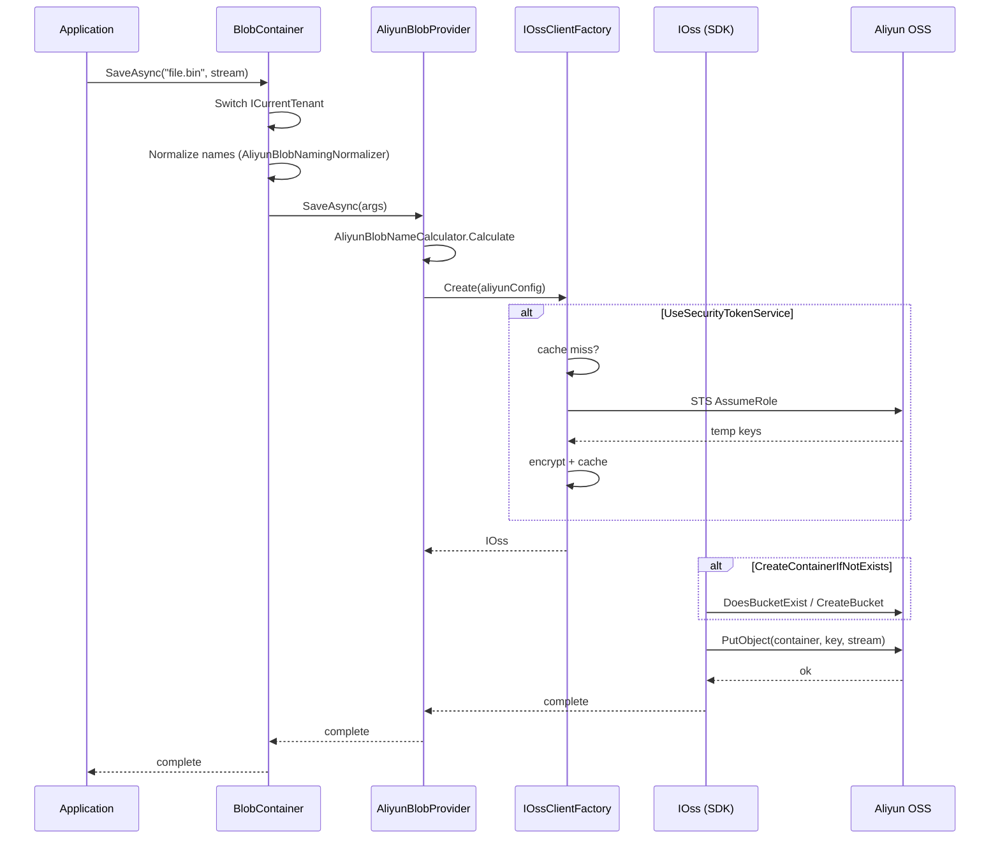

`Volo.Abp.BlobStoring.Aliyun` is the Alibaba Cloud Object Storage Service (OSS) backend for ABP's BLOB Storing system. It wraps the official `Aliyun.OSS` SDK behind `IBlobProvider`, supports both static access keys and STS (Security Token Service) temporary credentials with RAM role assumption, and uses the same tenant prefix layout as the other cloud providers.

Source: `framework/src/Volo.Abp.BlobStoring.Aliyun/Volo/Abp/BlobStoring/Aliyun/`. The provider is `AliyunBlobProvider`; the OSS client is built by `IOssClientFactory` (default: `DefaultOssClientFactory`); tenant prefixing is done by `IAliyunBlobNameCalculator`.

## Module and configuration

Depend on `AbpBlobStoringAliyunModule` and configure any container with `UseAliyun(...)`:

```csharp
[DependsOn(
    typeof(AbpBlobStoringModule),
    typeof(AbpBlobStoringAliyunModule)
)]
public class MyAppModule : AbpModule
{
    public override void ConfigureServices(ServiceConfigurationContext context)
    {
        Configure<AbpBlobStoringOptions>(options =>
        {
            options.Containers.ConfigureDefault(container =>
            {
                container.UseAliyun(aliyun =>
                {
                    aliyun.AccessKeyId     = "LTAI…";
                    aliyun.AccessKeySecret = "…";
                    aliyun.Endpoint        = "https://oss-cn-hangzhou.aliyuncs.com";
                    aliyun.ContainerName   = "myapp-default";
                    aliyun.CreateContainerIfNotExists = true;
                });
            });
        });
    }
}
```

`UseAliyun` registers the provider, the Aliyun naming normalizer, and a typed view over the property bag.

```csharp title="framework/src/Volo.Abp.BlobStoring.Aliyun/Volo/Abp/BlobStoring/Aliyun/AliyunBlobContainerConfigurationExtensions.cs"
public static BlobContainerConfiguration UseAliyun(
    this BlobContainerConfiguration containerConfiguration,
    Action<AliyunBlobProviderConfiguration> aliyunConfigureAction)
{
    containerConfiguration.ProviderType = typeof(AliyunBlobProvider);
    containerConfiguration.NamingNormalizers.TryAdd<AliyunBlobNamingNormalizer>();

    aliyunConfigureAction(new AliyunBlobProviderConfiguration(containerConfiguration));

    return containerConfiguration;
}
```

## `AliyunBlobProviderConfiguration`

The configuration exposes the access key pair, OSS endpoint, the STS toggle, and the RAM role parameters used when assuming a role to obtain temporary credentials.

```csharp title="framework/src/Volo.Abp.BlobStoring.Aliyun/Volo/Abp/BlobStoring/Aliyun/AliyunBlobProviderConfiguration.cs"
/// <summary>
/// Sub-account access to OSS or STS temporary authorization to access OSS.
/// </summary>
public class AliyunBlobProviderConfiguration
{
    public string AccessKeyId     { get; set; }
    public string AccessKeySecret { get; set; }
    public string Endpoint        { get; set; }

    public bool UseSecurityTokenService { get; set; }

    public string RegionId        { get; set; }

    /// <summary>acs:ram::$accountID:role/$roleName</summary>
    public string RoleArn         { get; set; }

    /// <summary>
    /// The name used to identify the temporary access credentials.
    /// </summary>
    public string RoleSessionName { get; set; }

    /// <summary>
    /// Validity period of temporary credentials in seconds. Min 900, max 3600.
    /// </summary>
    public int DurationSeconds   { get; set; }

    /// <summary>
    /// If policy is empty, the user will get all permissions under this role.
    /// </summary>
    public string Policy         { get; set; }

    /// <summary>
    /// OSS bucket name. If not set, BlobProviderArgs.ContainerName is used.
    /// </summary>
    public string? ContainerName  { get; set; }

    /// <summary>Default: false.</summary>
    public bool CreateContainerIfNotExists { get; set; }

    public string? TemporaryCredentialsCacheKey { get; set; }
}
```

Two credential modes:

| Mode | Flag | Required fields |
| --- | --- | --- |
| Sub‑account access | `UseSecurityTokenService = false` (default) | `AccessKeyId`, `AccessKeySecret`, `Endpoint`, `ContainerName` |
| STS / RAM role | `UseSecurityTokenService = true` | The above + `RegionId`, `RoleArn`, `RoleSessionName`, `DurationSeconds`, optionally `Policy` |

The STS path goes through `DefaultOssClientFactory`, which calls the STS service, assumes the configured role, and caches the resulting temporary access key / secret / session token in the distributed cache under `TemporaryCredentialsCacheKey` (a per‑container random GUID by default).

## `AliyunBlobProvider`

The provider creates an `IOss` client through the factory and dispatches to the OSS SDK. Save, delete, exists, get are all direct calls — the SDK is mostly synchronous, so `SaveAsync` and `DeleteAsync` return `Task.CompletedTask` / `Task.FromResult(...)` after issuing the call.

```csharp title="framework/src/Volo.Abp.BlobStoring.Aliyun/Volo/Abp/BlobStoring/Aliyun/AliyunBlobProvider.cs"
public override Task SaveAsync(BlobProviderSaveArgs args)
{
    var containerName = GetContainerName(args);
    var blobName = AliyunBlobNameCalculator.Calculate(args);
    var aliyunConfig = args.Configuration.GetAliyunConfiguration();
    var ossClient = GetOssClient(aliyunConfig);

    if (!args.OverrideExisting && BlobExists(ossClient, containerName, blobName))
    {
        throw new BlobAlreadyExistsException(
            $"Saving BLOB '{args.BlobName}' does already exists in the container '{containerName}'! " +
            $"Set {nameof(args.OverrideExisting)} if it should be overwritten.");
    }
    if (aliyunConfig.CreateContainerIfNotExists)
    {
        if (!ossClient.DoesBucketExist(containerName))
        {
            ossClient.CreateBucket(containerName);
        }
    }
    ossClient.PutObject(containerName, blobName, args.BlobStream);
    return Task.CompletedTask;
}
```

`BlobExists` mirrors the AWS provider pattern — a bucket check first, then an object check — so 404s from the OSS server do not bubble up as exceptions for non‑existent buckets.

```csharp
protected virtual bool BlobExists(IOss ossClient, string containerName, string blobName)
{
    return ossClient.DoesBucketExist(containerName) &&
           ossClient.DoesObjectExist(containerName, blobName);
}
```

`GetOrNullAsync` returns the SDK's `result.ResponseStream` directly — the caller owns it and is responsible for disposal.

## Tenant naming — `DefaultAliyunBlobNameCalculator`

Like the other cloud providers, ABP prefixes OSS object keys with `host/` or `tenants/<tenantId>/`:

```csharp title="framework/src/Volo.Abp.BlobStoring.Aliyun/Volo/Abp/BlobStoring/Aliyun/DefaultAliyunBlobNameCalculator.cs (shape)"
public class DefaultAliyunBlobNameCalculator : IAliyunBlobNameCalculator, ITransientDependency
{
    public virtual string Calculate(BlobProviderArgs args)
    {
        return CurrentTenant.Id == null
            ? $"host/{args.BlobName}"
            : $"tenants/{CurrentTenant.Id.Value:D}/{args.BlobName}";
    }
}
```

Combined with `BlobContainerConfiguration.IsMultiTenant`, this gives per‑tenant logical folders inside one bucket — same as Azure and AWS. See [/tenancy/multi-tenancy-core](/tenancy/multi-tenancy-core) for the upstream mechanics.

## OSS client wiring — `DefaultOssClientFactory`

`DefaultOssClientFactory` decides between a long‑lived access key client and an STS‑based client. For the STS path it:

1. Looks up cached temporary credentials in `IDistributedCache` under the configured key.
2. If absent, calls Aliyun STS `AssumeRole` with the configured `RoleArn`, `RoleSessionName`, `DurationSeconds`, and optional `Policy`.
3. Encrypts and caches the resulting access key / secret / session token via `IStringEncryptionService`, with TTL slightly less than `DurationSeconds`.
4. Constructs the `OssClient` with the temporary credentials.

The pattern is identical to the AWS factory — both use the same encrypted cache + early refresh approach so that high‑traffic workloads do not hit STS on every request.

You can replace the factory with a custom `IOssClientFactory` (registered via `[Dependency(ReplaceServices = true)]`) to point at VPC endpoints or use additional Aliyun authentication modes.

## `AliyunBlobNamingNormalizer`

OSS bucket naming rules: 3–63 chars, lowercase letters, digits, hyphens; starts with letter or digit. `AliyunBlobNamingNormalizer` is registered by `UseAliyun` to coerce ABP container names into OSS‑compliant bucket names. Object keys are passed through.

## Operational guidance

<AccordionGroup>
  <Accordion title="Prefer STS for client-side or external workloads" icon="shield">
    For workloads that touch user‑uploaded content from outside the trusted backend, prefer STS with a tight `Policy` instead of long‑lived sub‑account credentials.
  </Accordion>
  <Accordion title="Cache key sharing" icon="key">
    `TemporaryCredentialsCacheKey` is a per‑container random GUID by default. Override to a stable string if multiple containers should share the same STS session.
  </Accordion>
  <Accordion title="Bucket creation" icon="bucket">
    `CreateContainerIfNotExists = true` calls `OssClient.CreateBucket` on first save. Restrict this to dev environments and provision buckets via Terraform / Resource Orchestration Service in production.
  </Accordion>
  <Accordion title="Endpoint regions" icon="globe">
    `Endpoint` is the regional OSS URL (for example, `https://oss-cn-beijing.aliyuncs.com`). For STS, `RegionId` is the short region code (`cn-beijing`).
  </Accordion>
  <Accordion title="Synchronous SDK" icon="bolt">
    The OSS SDK calls are synchronous. They are issued on a worker thread by ABP but block that thread for the duration of the request. For high‑throughput workloads, consider running ABP on a host with sufficient thread pool capacity.
  </Accordion>
</AccordionGroup>

## Usage example

```csharp
[BlobContainerName("attachments")]
public class AttachmentContainer { }

public class AttachmentAppService : ApplicationService
{
    private readonly IBlobContainer<AttachmentContainer> _blobs;

    public AttachmentAppService(IBlobContainer<AttachmentContainer> blobs)
    {
        _blobs = blobs;
    }

    public async Task SaveAsync(Guid id, Stream content)
    {
        await _blobs.SaveAsync(id.ToString("N"), content, overrideExisting: true);
    }

    public Task<Stream?> GetOrNullAsync(Guid id)
        => _blobs.GetOrNullAsync(id.ToString("N"));
}
```

The on‑bucket key for a tenant upload looks like:

```text
OSS bucket: myapp-default
Object key: tenants/<tenantId>/<id>
```

## Provider package structure

| File | Purpose |
| --- | --- |
| `AbpBlobStoringAliyunModule.cs` | ABP module; depends on `AbpBlobStoringModule`. |
| `AliyunBlobProvider.cs` | `IBlobProvider` implementation against `Aliyun.OSS`. |
| `AliyunBlobProviderConfiguration.cs` | Typed view: keys, endpoint, RAM role, STS settings. |
| `AliyunBlobProviderConfigurationNames.cs` | Constants for the property bag. |
| `AliyunBlobContainerConfigurationExtensions.cs` | `UseAliyun(...)` + `GetAliyunConfiguration()`. |
| `AliyunBlobNamingNormalizer.cs` | OSS bucket name rules. |
| `DefaultAliyunBlobNameCalculator.cs` | Tenant prefixing for the object key. |
| `IOssClientFactory.cs` / `DefaultOssClientFactory.cs` | OSS client construction, STS caching with `IStringEncryptionService`. |
| `AliyunTemporaryCredentialsCacheItem.cs` | Cache DTO for STS tokens. |

## End-to-end save lifecycle



## STS caching summary

The STS pattern matches the [AWS provider](/blob/aws):

1. First call assumes the configured `RoleArn` via STS `AssumeRole`, then encrypts the resulting access key / secret / session token and stores them in `IDistributedCache<AliyunTemporaryCredentialsCacheItem>` under `TemporaryCredentialsCacheKey`.
2. Subsequent calls hit the cache until `DurationSeconds - 10` seconds before expiry, then re‑assume.
3. The decrypted credentials drive the OSS client constructed for the request.

This keeps STS load proportional to credential lifetime, not to request rate, which is essential at scale.

## Migration notes

Migrating between Aliyun and other S3‑style providers (AWS, MinIO) is mechanical because the tenant prefix layout (`host/`, `tenants/{id}/`) is identical:

1. Use `ossutil cp` (Aliyun) or `aws s3 sync` / `mc mirror` (others) to copy keys preserving prefixes.
2. Switch the `Use*(...)` call in your application module to the new provider.

Because both the directory layout *inside* the bucket and the application‑level container configuration are unchanged, no other code adjustments are necessary.

## Related

- [BLOB Storing abstractions](/blob/abstractions) — `BlobProviderBase` and `BlobProviderArgs`.
- [Multi-tenancy core](/tenancy/multi-tenancy-core) — `ICurrentTenant.Id` drives `DefaultAliyunBlobNameCalculator`.
- [AWS provider](/blob/aws) — same STS caching pattern with a different SDK.
- [MinIO provider](/blob/minio) — for self‑hosted S3‑compatible storage.
- [Blob Storing Database module](/modules/blob-storing-database/overview) — when blobs should be in the same DB as their data.
