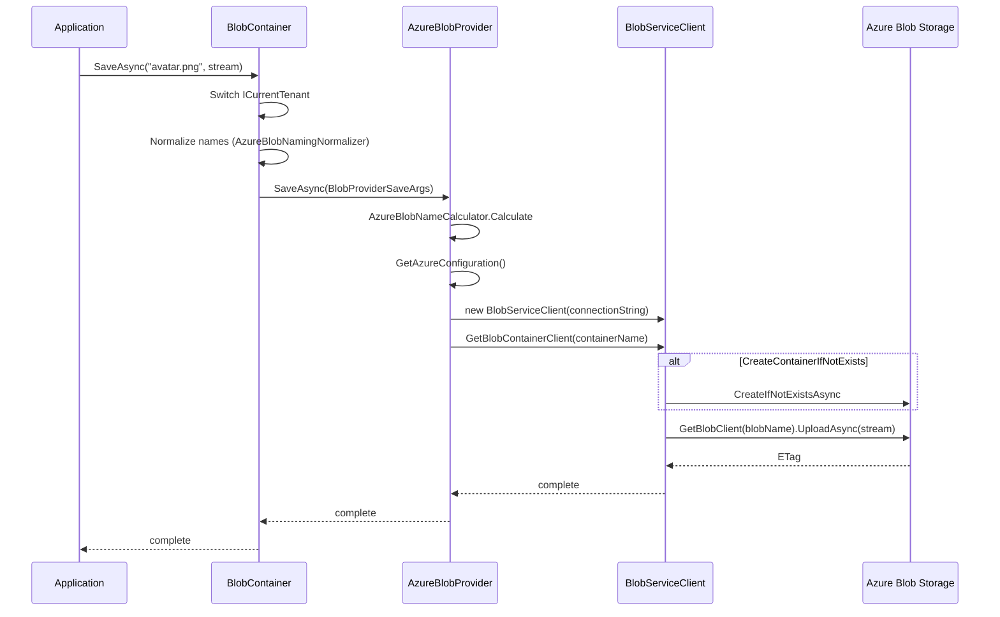

`Volo.Abp.BlobStoring.Azure` wraps the official `Azure.Storage.Blobs` SDK behind ABP's `IBlobProvider`. It maps each ABP container to one Azure blob container, optionally creates that container on first write, and prefixes every blob key with `host/` or `tenants/{tenantId}/` so the same Azure container can transparently serve multiple tenants.

Source: `framework/src/Volo.Abp.BlobStoring.Azure/Volo/Abp/BlobStoring/Azure/`. The provider has three moving parts — `AzureBlobProvider`, `AzureBlobProviderConfiguration`, and `IAzureBlobNameCalculator` — plus the `AzureBlobNamingNormalizer` that enforces Azure's naming rules.

## Module and configuration

Add `AbpBlobStoringAzureModule` to your application module's `[DependsOn]`. Then pick a container and call `UseAzure(...)`:

```csharp
[DependsOn(
    typeof(AbpBlobStoringModule),
    typeof(AbpBlobStoringAzureModule)
)]
public class MyAppModule : AbpModule
{
    public override void ConfigureServices(ServiceConfigurationContext context)
    {
        var connectionString = context.Services
            .GetConfiguration()["BlobStorage:Azure"]!;

        Configure<AbpBlobStoringOptions>(options =>
        {
            options.Containers.ConfigureDefault(container =>
            {
                container.UseAzure(azure =>
                {
                    azure.ConnectionString = connectionString;
                    azure.ContainerName = "myapp-default";
                    azure.CreateContainerIfNotExists = true;
                });
            });
        });
    }
}
```

`UseAzure` plugs the provider and the Azure naming normalizer into the container configuration:

```csharp title="framework/src/Volo.Abp.BlobStoring.Azure/Volo/Abp/BlobStoring/Azure/AzureBlobContainerConfigurationExtensions.cs"
public static BlobContainerConfiguration UseAzure(
    this BlobContainerConfiguration containerConfiguration,
    Action<AzureBlobProviderConfiguration> azureConfigureAction)
{
    containerConfiguration.ProviderType = typeof(AzureBlobProvider);
    containerConfiguration.NamingNormalizers.TryAdd<AzureBlobNamingNormalizer>();

    azureConfigureAction(new AzureBlobProviderConfiguration(containerConfiguration));

    return containerConfiguration;
}
```

`GetAzureConfiguration()` is the read‑side counterpart — given a `BlobContainerConfiguration`, it returns the typed view so the provider can pull `ConnectionString`, `ContainerName`, and `CreateContainerIfNotExists` out of the property bag.

## `AzureBlobProviderConfiguration`

The configuration class is a typed wrapper around three properties.

```csharp title="framework/src/Volo.Abp.BlobStoring.Azure/Volo/Abp/BlobStoring/Azure/AzureBlobProviderConfiguration.cs"
public class AzureBlobProviderConfiguration
{
    public string ConnectionString { get; set; }

    /// <summary>
    /// This name may only contain lowercase letters, numbers, and hyphens,
    /// and must begin with a letter or a number. Each hyphen must be preceded
    /// and followed by a non-hyphen character. The name must also be between
    /// 3 and 63 characters long.
    /// If this parameter is not specified, the ContainerName of the BlobProviderArgs will be used.
    /// </summary>
    public string? ContainerName { get; set; }

    /// <summary>
    /// Default value: false.
    /// </summary>
    public bool CreateContainerIfNotExists { get; set; }
}
```

The actual getters/setters delegate to `BlobContainerConfiguration.GetConfiguration` / `SetConfiguration` under the keys defined in `AzureBlobProviderConfigurationNames`, but treating them as plain properties is enough for everyday use.

- **`ConnectionString`** — any Azure Storage connection string accepted by `BlobServiceClient`. Required.
- **`ContainerName`** — when set, this is the physical Azure blob container; when `null`, the provider falls back to the ABP container name (your typed marker class's name).
- **`CreateContainerIfNotExists`** — when `true`, the provider calls `CreateIfNotExistsAsync()` on the Azure container before each `SaveAsync`. Set this in dev so you do not have to provision containers manually; leave it off in prod if you want operations to fail loudly when the container has not been provisioned.

## `AzureBlobProvider`

The provider is a thin shell over `BlobServiceClient`/`BlobContainerClient`/`BlobClient`. Save, delete, exists, and get are direct calls to the SDK.

```csharp title="framework/src/Volo.Abp.BlobStoring.Azure/Volo/Abp/BlobStoring/Azure/AzureBlobProvider.cs"
public class AzureBlobProvider : BlobProviderBase, ITransientDependency
{
    protected IAzureBlobNameCalculator AzureBlobNameCalculator { get; }
    protected IBlobNormalizeNamingService BlobNormalizeNamingService { get; }

    public AzureBlobProvider(
        IAzureBlobNameCalculator azureBlobNameCalculator,
        IBlobNormalizeNamingService blobNormalizeNamingService)
    {
        AzureBlobNameCalculator = azureBlobNameCalculator;
        BlobNormalizeNamingService = blobNormalizeNamingService;
    }

    public override async Task SaveAsync(BlobProviderSaveArgs args)
    {
        var blobName = AzureBlobNameCalculator.Calculate(args);
        var configuration = args.Configuration.GetAzureConfiguration();

        if (!args.OverrideExisting && await BlobExistsAsync(args, blobName))
        {
            throw new BlobAlreadyExistsException(
                $"Saving BLOB '{args.BlobName}' does already exists in the container " +
                $"'{GetContainerName(args)}'! Set {nameof(args.OverrideExisting)} if it should be overwritten.");
        }

        if (configuration.CreateContainerIfNotExists)
        {
            await CreateContainerIfNotExists(args);
        }

        await GetBlobClient(args, blobName).UploadAsync(args.BlobStream, true);
    }
    // …Delete / Exists / GetOrNull follow the same shape…
}
```

A few patterns to notice:

- `AzureBlobNameCalculator.Calculate(args)` produces the *blob name*, including any tenant prefix. We will look at it next.
- `GetContainerName(args)` returns the *blob container name*. If `AzureBlobProviderConfiguration.ContainerName` is set, it is normalized via `IBlobNormalizeNamingService.NormalizeContainerName` (using `AzureBlobNamingNormalizer`) and used; otherwise the ABP container name (already normalized when it reaches the provider) is used directly.
- `CreateContainerIfNotExists(args)` — the provider obtains a fresh `BlobContainerClient` and calls `CreateIfNotExistsAsync()`. Cheap to call repeatedly; Azure returns a `null` response if the container already exists.
- `BlobExistsAsync` first checks the *container* exists, then asks the blob client. This avoids spurious 404s on the blob existence call when the container has not yet been created.

### `BlobServiceClient` wiring

```csharp
protected virtual BlobContainerClient GetBlobContainerClient(BlobProviderArgs args)
{
    var configuration = args.Configuration.GetAzureConfiguration();
    var blobServiceClient = new BlobServiceClient(configuration.ConnectionString);
    return blobServiceClient.GetBlobContainerClient(GetContainerName(args));
}
```

A new `BlobServiceClient` is created per call. The Azure SDK is designed to make this cheap — `BlobServiceClient` does not open connections eagerly, it just holds the URI and credential — but if you have a high‑throughput workload you can override `AzureBlobProvider` and cache a `BlobServiceClient` per connection string. Replace the registration with `[Dependency(ReplaceServices = true)]` and inject your own factory.

### Container auto‑creation

```csharp
protected virtual async Task CreateContainerIfNotExists(BlobProviderArgs args)
{
    var blobContainerClient = GetBlobContainerClient(args);
    await blobContainerClient.CreateIfNotExistsAsync();
}
```

This is gated by `AzureBlobProviderConfiguration.CreateContainerIfNotExists`. Even when on, the SDK call is idempotent and inexpensive (one `HEAD`).

### `BlobExistsAsync`

```csharp
protected virtual async Task<bool> BlobExistsAsync(BlobProviderArgs args, string blobName)
{
    // Make sure Blob Container exists.
    return await ContainerExistsAsync(GetBlobContainerClient(args)) &&
           (await GetBlobClient(args, blobName).ExistsAsync()).Value;
}
```

Two SDK calls in the existence check is intentional. Azure does not let you query a blob in a missing container without throwing; ABP swallows that case by short‑circuiting on the container check first.

## `AzureBlobNameCalculator` — multi‑tenant blob naming

The blob name (within the Azure container) is computed by `DefaultAzureBlobNameCalculator`. It is what gives the Azure provider its tenant story.

```csharp title="framework/src/Volo.Abp.BlobStoring.Azure/Volo/Abp/BlobStoring/Azure/DefaultAzureBlobNameCalculator.cs"
public class DefaultAzureBlobNameCalculator : IAzureBlobNameCalculator, ITransientDependency
{
    protected ICurrentTenant CurrentTenant { get; }

    public DefaultAzureBlobNameCalculator(ICurrentTenant currentTenant)
    {
        CurrentTenant = currentTenant;
    }

    public virtual string Calculate(BlobProviderArgs args)
    {
        return CurrentTenant.Id == null
            ? $"host/{args.BlobName}"
            : $"tenants/{CurrentTenant.Id.Value.ToString("D")}/{args.BlobName}";
    }
}
```

So an avatar saved by tenant `123…` is stored at key `tenants/12345678-…/avatar.png` inside the Azure container. Host blobs live under `host/`. Because Azure uses key prefixes as virtual folders, the Storage Explorer view (and any `prefix=` listing) gives you neat per‑tenant browsing for free.

If `BlobContainerConfiguration.IsMultiTenant` is `false`, `BlobContainer.GetTenantIdOrNull()` returns `null` regardless of who called, so the calculator routes everything under `host/`. That is how you create a container shared by all tenants.

You can replace the calculator with any `IAzureBlobNameCalculator` implementation to get other layouts (date‑sharded, hash‑prefixed, …). The default registration is `ITransientDependency` and can be replaced via `[Dependency(ReplaceServices = true)]`.

## `AzureBlobNamingNormalizer`

Azure has strict rules on container names: 3–63 characters, lowercase letters, digits, hyphens, beginning with a letter or digit, hyphens cannot be doubled. The `AzureBlobNamingNormalizer` ABP registers via `UseAzure` rewrites container names to comply (lowercasing, replacing illegal characters) so your typed container class name does not have to be hand‑sanitized. Blob names are subject to Azure's much looser rules and are largely passed through.

The naming pipeline runs before the calculator: container names that come through `BlobContainer` are normalized to Azure rules, then the blob name receives its tenant prefix. The two normalizations happen in different layers but always in the same order.

## Operational guidance

<AccordionGroup>
  <Accordion title="Connection strings" icon="key">
    Store the connection string in the `.NET` configuration system (`appsettings.json`, environment variables, Key Vault) and pass it through to `azure.ConnectionString` in your module. Never hard‑code production keys. The provider creates a fresh `BlobServiceClient` per call, so secret rotation only needs the next request to pick up the new value.
  </Accordion>
  <Accordion title="Container provisioning" icon="cubes-stacked">
    Set `CreateContainerIfNotExists = true` only when the application identity has `Create Container` permission. In production it is common to provision containers via IaC (Bicep, Terraform) and leave the flag `false` so a missing container is a deploy‑time error, not a runtime surprise.
  </Accordion>
  <Accordion title="Multi-tenant key prefixes" icon="users">
    The `host/` and `tenants/{tenantId}/` prefixes simplify per‑tenant lifecycle: a tenant deletion can `Delete By Prefix` on the Azure container, and an export can `List By Prefix` for one tenant. See [/tenancy/multi-tenancy-core](/tenancy/multi-tenancy-core) for the upstream `ICurrentTenant` mechanics.
  </Accordion>
  <Accordion title="Large uploads" icon="cloud-arrow-up">
    `UploadAsync(Stream, overwrite)` uses the SDK's default upload strategy, which streams. For very large blobs you can wrap `AzureBlobProvider` and call `StagedUploadAsync` instead via the SDK's `BlockBlobClient`.
  </Accordion>
  <Accordion title="Public vs private" icon="lock">
    `CreateIfNotExistsAsync` creates the container as private. If you want public read access (and a public URL for blobs), provision the container out‑of‑band with `PublicAccessType.Blob` or wrap `AzureBlobProvider` to set it after creation.
  </Accordion>
</AccordionGroup>

## Usage example

```csharp
[BlobContainerName("invoices")]
public class InvoiceContainer { }

public class InvoiceArchiveAppService : ApplicationService
{
    private readonly IBlobContainer<InvoiceContainer> _blobs;

    public InvoiceArchiveAppService(IBlobContainer<InvoiceContainer> blobs)
    {
        _blobs = blobs;
    }

    public Task SaveAsync(Guid invoiceId, Stream pdf)
        => _blobs.SaveAsync($"{invoiceId:N}.pdf", pdf, overrideExisting: true);

    public Task<Stream?> GetOrNullAsync(Guid invoiceId)
        => _blobs.GetOrNullAsync($"{invoiceId:N}.pdf");

    public Task<bool> DeleteAsync(Guid invoiceId)
        => _blobs.DeleteAsync($"{invoiceId:N}.pdf");
}
```

With the configuration shown at the top, an invoice PDF saved by tenant `abc…` lands at:

```text
Azure container: myapp-default
Blob path:       tenants/abc.../{invoiceId}.pdf
```

## Cost and performance notes

- One `BlobServiceClient`/`BlobContainerClient` per operation is acceptable but not optimal at very high throughput. Override the provider to cache clients per connection string for hot paths.
- `BlobExistsAsync` performs two REST calls (container `HEAD` then blob `HEAD`). When you know the container exists, you can short‑circuit by setting `CreateContainerIfNotExists = false` after initial provisioning and overriding `BlobExistsAsync` in a subclass.
- Tenant prefixes are stored as part of the blob name, not as Azure's "logical directories", so they are zero‑cost to introduce or remove — there is nothing to migrate when you change `IsMultiTenant`.

## End-to-end save lifecycle



## Migration notes

Migrating an existing container to Azure from another backend:

1. Provision the Azure blob container with the appropriate `PublicAccessType` and lifecycle policy.
2. Use `azcopy sync` to copy keys from the old store, preserving the `host/` and `tenants/{tenantId}/` prefix layout.
3. Switch the `BlobContainerConfiguration.Use*(...)` call in your application module to `UseAzure(...)`.

The tenant prefix layout is identical across Azure, AWS, GCS, Aliyun, MinIO and Bunny, so blob keys remain valid and application code stays unchanged.

## Related

- [BLOB Storing abstractions](/blob/abstractions) — the contracts `AzureBlobProvider` implements.
- [Multi-tenancy core](/tenancy/multi-tenancy-core) — `ICurrentTenant` is the input to `DefaultAzureBlobNameCalculator`.
- [AWS provider](/blob/aws) and [Google provider](/blob/google) — the same container can be re‑pointed to a different cloud by swapping `UseAzure(...)` for `UseAws(...)` or `UseGoogle(...)`.
- [Blob Storing Database module](/modules/blob-storing-database/overview) — when you want blobs transactional with your data instead of on Azure.
