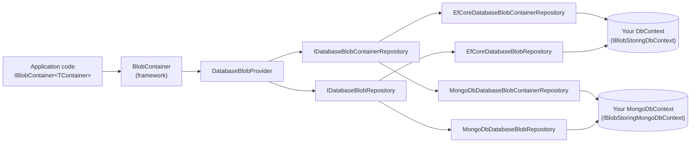

The `blob-storing-database` application module is the bridge between ABP's BLOB Storing system and your normal domain database. Instead of writing blob bytes to disk, S3, or Azure, it persists each blob as a row in a `DatabaseBlob` table inside the same DbContext / MongoDB database that owns your domain data. The module ships as part of the ABP commercial application module catalogue and lives in `modules/blob-storing-database/`.

Pick this module when blobs are *part of* your domain — small attachments to entities, audit‑sensitive documents that must move atomically with their parent rows, or any scenario where you want backups, multi‑tenant data residency, and consistent transactions for both the row and its blob. For pure object‑store scenarios (avatars, large media, CDN delivery), keep using the cloud providers — see [/blob/azure](/blob/azure), [/blob/aws](/blob/aws), [/blob/google](/blob/google).

<Note>
This page is a framework‑side tour of the provider that the module exposes. The full module catalogue entry — including UI, package wiring across `.Domain.Shared`, `.Domain`, `.Installer`, EF Core, and MongoDB layers, and migration guidance — lives at [/modules/blob-storing-database/overview](/modules/blob-storing-database/overview).
</Note>

## Package layout

```text
modules/blob-storing-database/src/
  Volo.Abp.BlobStoring.Database.Domain.Shared/   ← constants, error codes
  Volo.Abp.BlobStoring.Database.Domain/          ← DatabaseBlob, DatabaseBlobContainer, DatabaseBlobProvider, repository interfaces
  Volo.Abp.BlobStoring.Database.EntityFrameworkCore/ ← EF Core repositories + DbContext
  Volo.Abp.BlobStoring.Database.MongoDB/         ← MongoDB repositories + DbContext
  Volo.Abp.BlobStoring.Database.Installer/       ← module installer for `abp add-module`
```

The Domain package is provider‑neutral and provides the `DatabaseBlobProvider` that plugs into ABP's BLOB Storing system. The EF Core and MongoDB packages provide the two storage backends; you pick exactly one in your application.

## Domain entities

Two aggregates back the database provider — one for the container, one for the blob.

```csharp title="modules/blob-storing-database/src/Volo.Abp.BlobStoring.Database.Domain/Volo/Abp/BlobStoring/Database/DatabaseBlobContainer.cs"
public class DatabaseBlobContainer : AggregateRoot<Guid>, IMultiTenant
{
    public virtual Guid? TenantId { get; protected set; }

    public virtual string Name { get; protected set; }

    public DatabaseBlobContainer(Guid id, [NotNull] string name, Guid? tenantId = null)
        : base(id)
    {
        Name = Check.NotNullOrWhiteSpace(name, nameof(name), DatabaseContainerConsts.MaxNameLength);
        TenantId = tenantId;
    }
}
```

```csharp title="modules/blob-storing-database/src/Volo.Abp.BlobStoring.Database.Domain/Volo/Abp/BlobStoring/Database/DatabaseBlob.cs"
public class DatabaseBlob : AggregateRoot<Guid>, IMultiTenant
{
    public virtual Guid  ContainerId { get; protected set; }
    public virtual Guid? TenantId    { get; protected set; }
    public virtual string Name       { get; protected set; }

    [DisableAuditing]
    public virtual byte[] Content    { get; protected set; }

    public DatabaseBlob(Guid id, Guid containerId, [NotNull] string name,
        [NotNull] byte[] content, Guid? tenantId = null)
        : base(id)
    {
        Name = Check.NotNullOrWhiteSpace(name, nameof(name), DatabaseBlobConsts.MaxNameLength);
        ContainerId = containerId;
        Content = CheckContentLength(content);
        TenantId = tenantId;
    }

    public virtual void SetContent(byte[] content)
        => Content = CheckContentLength(content);
}
```

Three things to notice:

1. **`IMultiTenant`** — both aggregates carry `TenantId`. The standard data filter automatically scopes queries to the current tenant, so the database provider does not need any special tenant prefix logic. See [/tenancy/multi-tenancy-core](/tenancy/multi-tenancy-core).
2. **`[DisableAuditing]` on `Content`** — the byte payload is excluded from ABP's audit log to avoid storing whole blobs in audit entries.
3. **`DatabaseBlobConsts.MaxContentLength`** — the maximum blob size is enforced at the domain level. Override the constant in your module or pre‑process content before saving for stricter policies.

## `DatabaseBlobProvider`

`DatabaseBlobProvider` implements `IBlobProvider` on top of two repository interfaces — `IDatabaseBlobRepository` and `IDatabaseBlobContainerRepository`. It is registered as `ITransientDependency` by `BlobStoringDatabaseDomainModule`, so `DefaultBlobProviderSelector` will hand it back for any container configured with `UseDatabase()`.

```csharp title="modules/blob-storing-database/src/Volo.Abp.BlobStoring.Database.Domain/Volo/Abp/BlobStoring/Database/DatabaseBlobProvider.cs"
public class DatabaseBlobProvider : BlobProviderBase, ITransientDependency
{
    protected IDatabaseBlobRepository DatabaseBlobRepository { get; }
    protected IDatabaseBlobContainerRepository DatabaseBlobContainerRepository { get; }
    protected IGuidGenerator GuidGenerator { get; }
    protected ICurrentTenant CurrentTenant { get; }

    public async override Task SaveAsync(BlobProviderSaveArgs args)
    {
        var container = await GetOrCreateContainerAsync(args.ContainerName, args.CancellationToken);

        var blob = await DatabaseBlobRepository.FindAsync(
            container.Id, args.BlobName, args.CancellationToken);

        var content = await args.BlobStream.GetAllBytesAsync(args.CancellationToken);

        if (blob != null)
        {
            if (!args.OverrideExisting)
            {
                throw new BlobAlreadyExistsException(
                    $"Saving BLOB '{args.BlobName}' does already exists in the container " +
                    $"'{args.ContainerName}'! Set {nameof(args.OverrideExisting)} if it should be overwritten.");
            }

            blob.SetContent(content);
            await DatabaseBlobRepository.UpdateAsync(blob, autoSave: true);
        }
        else
        {
            blob = new DatabaseBlob(
                GuidGenerator.Create(), container.Id, args.BlobName, content, CurrentTenant.Id);
            await DatabaseBlobRepository.InsertAsync(blob, autoSave: true);
        }
    }
    // …Delete / Exists / GetOrNull are equally direct…

    protected virtual async Task<DatabaseBlobContainer> GetOrCreateContainerAsync(
        string name, CancellationToken cancellationToken = default)
    {
        var container = await DatabaseBlobContainerRepository.FindAsync(name, cancellationToken);
        if (container != null) return container;

        container = new DatabaseBlobContainer(GuidGenerator.Create(), name, CurrentTenant.Id);
        await DatabaseBlobContainerRepository.InsertAsync(container, cancellationToken: cancellationToken);

        return container;
    }
}
```

Four properties to keep in mind:

- **Lazy container creation.** The provider auto‑provisions a `DatabaseBlobContainer` row on the first save for any container name. There is no `CreateContainerIfNotExists` flag here — the table row is the container, and creating it is essentially free.
- **`autoSave: true`.** Each call forces an immediate flush. Combined with the ABP Unit of Work, this means a blob save participates in the surrounding UoW and rolls back with it on exception. See the [Unit of Work primer](/data/unit-of-work) for the transactional semantics.
- **Buffered upload.** `args.BlobStream.GetAllBytesAsync` materializes the entire blob to a `byte[]` before insertion. This is correct for SQL Server / PostgreSQL / MongoDB, all of which take the whole payload over the wire anyway, but it limits practical blob sizes to whatever your database column / document size limit is. Watch out for very large content.
- **Multi‑tenant by default.** `TenantId` is read from `ICurrentTenant.Id`, and the standard data filter scopes queries to the current tenant when `IsMultiTenant = true`. Tenants never see each other's blobs.

## Configuring a container to use the database

`DatabaseBlobContainerConfigurationExtensions.UseDatabase()` is the minimal extension — there is no provider‑specific configuration, only the provider type.

```csharp title="modules/blob-storing-database/src/Volo.Abp.BlobStoring.Database.Domain/Volo/Abp/BlobStoring/Database/DatabaseBlobContainerConfigurationExtensions.cs"
public static class DatabaseBlobContainerConfigurationExtensions
{
    public static BlobContainerConfiguration UseDatabase(
        this BlobContainerConfiguration containerConfiguration)
    {
        containerConfiguration.ProviderType = typeof(DatabaseBlobProvider);
        return containerConfiguration;
    }
}
```

```csharp
[DependsOn(
    typeof(AbpBlobStoringModule),
    typeof(BlobStoringDatabaseDomainModule),
    typeof(BlobStoringDatabaseEntityFrameworkCoreModule) // or BlobStoringDatabaseMongoDbModule
)]
public class MyAppModule : AbpModule
{
    public override void ConfigureServices(ServiceConfigurationContext context)
    {
        Configure<AbpBlobStoringOptions>(options =>
        {
            options.Containers.Configure<InvoiceContainer>(container =>
            {
                container.UseDatabase();
            });
        });
    }
}
```

## EF Core integration

`BlobStoringDatabaseEntityFrameworkCoreModule` registers the `IBlobStoringDbContext` and the EF Core repositories. The default approach is to plug the DBContext into your existing application DbContext via `ConfigureBlobStoring()`:

```csharp
public class MyAppDbContext : AbpDbContext<MyAppDbContext>, IBlobStoringDbContext
{
    public DbSet<DatabaseBlob>          Blobs      { get; set; }
    public DbSet<DatabaseBlobContainer> Containers { get; set; }

    protected override void OnModelCreating(ModelBuilder builder)
    {
        base.OnModelCreating(builder);
        builder.ConfigureBlobStoring();
    }
}
```

Once your DbContext implements `IBlobStoringDbContext`, ABP's `IDbContextProvider<IBlobStoringDbContext>` returns it, and the EF Core repository targets the same `DbContext` as the rest of your code. The save participates in the surrounding `UnitOfWork`, so the blob is committed (or rolled back) together with the domain row that triggered it.

```csharp title="modules/blob-storing-database/src/Volo.Abp.BlobStoring.Database.EntityFrameworkCore/Volo/Abp/BlobStoring/Database/EntityFrameworkCore/EfCoreDatabaseBlobRepository.cs"
public class EfCoreDatabaseBlobRepository :
    EfCoreRepository<IBlobStoringDbContext, DatabaseBlob, Guid>,
    IDatabaseBlobRepository
{
    public EfCoreDatabaseBlobRepository(IDbContextProvider<IBlobStoringDbContext> dbContextProvider)
        : base(dbContextProvider) {}

    public virtual async Task<DatabaseBlob> FindAsync(
        Guid containerId, string name, CancellationToken cancellationToken = default)
    {
        return (await GetDbSetAsync())
            .FirstOrDefault(x => x.ContainerId == containerId && x.Name == name);
    }

    public virtual async Task<bool> ExistsAsync(
        Guid containerId, string name, CancellationToken cancellationToken = default)
    {
        return await (await GetDbSetAsync())
            .AnyAsync(
                x => x.ContainerId == containerId && x.Name == name,
                GetCancellationToken(cancellationToken));
    }
    // …
}
```

The matching `EfCoreDatabaseBlobContainerRepository` is essentially the same shape, keyed on `Name`.

## MongoDB integration

`BlobStoringDatabaseMongoDbModule` is the mirror image for MongoDB. The DbContext implements `IBlobStoringMongoDbContext` and adds two collections; the repositories are derived from `MongoDbRepository<IBlobStoringMongoDbContext, DatabaseBlob, Guid>` and `MongoDbDatabaseBlobContainerRepository`.

```csharp
public class MyAppMongoDbContext : AbpMongoDbContext, IBlobStoringMongoDbContext
{
    public IMongoCollection<DatabaseBlob>          Blobs      => Collection<DatabaseBlob>();
    public IMongoCollection<DatabaseBlobContainer> Containers => Collection<DatabaseBlobContainer>();

    protected override void CreateModel(IMongoModelBuilder modelBuilder)
    {
        base.CreateModel(modelBuilder);
        modelBuilder.ConfigureBlobStoring();
    }
}
```

You only need one of EF Core or MongoDB. Choose based on what your application already uses.

## How the pieces fit



The provider is registered automatically by the Domain module, and the right repository implementation is picked by ABP's DI based on which storage module you also depend on.

## Operational guidance

<AccordionGroup>
  <Accordion title="Watch the size" icon="weight-scale">
    Every blob becomes a `varbinary(max)` (SQL Server), `bytea` (PostgreSQL), or BSON binary field. There is a `DatabaseBlobConsts.MaxContentLength` guard that throws when content exceeds it. For very large media, the cloud providers are a better fit.
  </Accordion>
  <Accordion title="Backups follow your DB" icon="database">
    Blobs back up with the database. That is a huge operational win for compliance/audit‑heavy domains and the main reason to pick this provider — but it makes restores slower compared to object stores. Plan accordingly.
  </Accordion>
  <Accordion title="Transactional consistency" icon="shield">
    Because saves happen inside the application's `UnitOfWork`, a blob and the entity that references it commit together. Rolling back a domain operation rolls back its blobs.
  </Accordion>
  <Accordion title="Auditing" icon="eye">
    `DatabaseBlob.Content` is `[DisableAuditing]` so the audit log never stores the bytes. Container creates and blob inserts are still auditable at the row level if you enable entity auditing.
  </Accordion>
  <Accordion title="Multi-tenancy" icon="users">
    `DatabaseBlob` and `DatabaseBlobContainer` both implement `IMultiTenant`. The standard data filter restricts queries to the current tenant when active. See [/tenancy/multi-tenancy-core](/tenancy/multi-tenancy-core).
  </Accordion>
</AccordionGroup>

## Usage example

```csharp
[BlobContainerName("invoices")]
public class InvoiceContainer { }

public class InvoiceArchiveAppService : ApplicationService
{
    private readonly IBlobContainer<InvoiceContainer> _blobs;
    private readonly IRepository<Invoice, Guid> _invoices;

    public InvoiceArchiveAppService(
        IBlobContainer<InvoiceContainer> blobs,
        IRepository<Invoice, Guid> invoices)
    {
        _blobs = blobs;
        _invoices = invoices;
    }

    [UnitOfWork]
    public async Task ArchiveAsync(Guid invoiceId, Stream pdf)
    {
        var invoice = await _invoices.GetAsync(invoiceId);
        invoice.MarkArchived();

        // Within the same UoW; commits together.
        await _blobs.SaveAsync($"{invoiceId:N}.pdf", pdf, overrideExisting: true);
    }
}
```

If the invoice update fails after the blob save, the UoW rolls back both the row update *and* the `DatabaseBlob` insert. That symmetry is the database provider's defining feature.

## Module catalogue entry

For installation steps (`abp add-module Volo.Abp.BlobStoring.Database`), the UI scaffolding, migration playbook, and pre‑built management pages, see the full module documentation:

<Card title="Blob Storing Database — module overview" icon="puzzle-piece" href="/modules/blob-storing-database/overview">
  Module purpose, packages, EF Core / MongoDB wiring, migrations, and UI integration.
</Card>

## Related

- [BLOB Storing abstractions](/blob/abstractions) — `IBlobProvider`, `BlobProviderArgs`, `BlobContainerConfiguration`.
- [File system provider](/blob/filesystem) — when blobs live on disk instead of in the DB.
- [Azure provider](/blob/azure), [AWS provider](/blob/aws), [Google provider](/blob/google) — cloud object stores for large media and CDN delivery.
- [Multi-tenancy core](/tenancy/multi-tenancy-core) — how `IMultiTenant` and `ICurrentTenant` scope `DatabaseBlob` rows to the calling tenant.
- [/modules/blob-storing-database/overview](/modules/blob-storing-database/overview) — installation, UI, and migration playbook for the application module.
