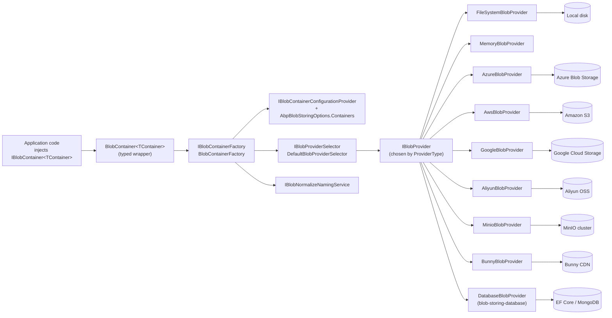

ABP's BLOB Storing system is a small, opinionated abstraction over object storage. It ships from `framework/src/Volo.Abp.BlobStoring` as a backend‑agnostic API (`IBlobContainer<TContainer>`, `IBlobProvider`, `BlobContainerConfiguration`) and gets life from a family of provider packages — file system, in‑memory, Azure Blob, Amazon S3, Google Cloud Storage, Aliyun OSS, MinIO, Bunny CDN — plus the application‑level [Blob Storing Database module](/modules/blob-storing-database/overview) that persists blobs inside your normal EF Core / MongoDB database.

The model is intentionally simple. Application code injects a strongly typed `IBlobContainer<TProfilePictures>` and calls `SaveAsync` / `GetAsync` / `DeleteAsync` / `ExistsAsync`. The `BlobContainerFactory` looks up that container's `BlobContainerConfiguration` (which provider type? is it multi‑tenant? what is the connection string?), resolves the matching `IBlobProvider` from DI, normalizes names through the configured `IBlobNamingNormalizer` chain, and dispatches each call to the backend. Multi‑tenancy is baked in: every operation runs inside `ICurrentTenant.Change(...)` when `IsMultiTenant` is true, so each tenant gets its own logical slice of the backend.

## What lives in this section

<CardGroup cols={2}>
  <Card title="Core abstractions" icon="cube" href="/blob/abstractions">
    `AbpBlobStoringModule`, `IBlobContainer<TContainer>`, `BlobContainer`, `BlobContainerFactory`, `IBlobProvider`, `BlobProviderArgs`, `AbpBlobStoringOptions`, naming normalizers.
  </Card>
  <Card title="File system provider" icon="folder-tree" href="/blob/filesystem">
    `FileSystemBlobProvider`, `BasePath`, `AppendContainerNameToBasePath`, `DefaultBlobFilePathCalculator` and per‑tenant directory layout.
  </Card>
  <Card title="In‑memory provider" icon="memory" href="/blob/memory">
    `MemoryBlobProvider`, `ConcurrentDictionary`‑backed store, ideal for tests and prototypes.
  </Card>
  <Card title="Azure Blob Storage" icon="cloud" href="/blob/azure">
    `AzureBlobProvider`, `BlobServiceClient`, `CreateContainerIfNotExists`, `AzureBlobNameCalculator` for host/tenant prefixing.
  </Card>
  <Card title="Amazon S3" icon="aws" href="/blob/aws">
    `AwsBlobProvider`, `IAmazonS3ClientFactory`, profile/temporary/federated credentials, STS session caching.
  </Card>
  <Card title="Google Cloud Storage" icon="google" href="/blob/google">
    `GoogleBlobProvider`, `StorageClient`, service‑account or Application Default Credentials.
  </Card>
  <Card title="Aliyun OSS" icon="cloud-arrow-up" href="/blob/aliyun">
    `AliyunBlobProvider` on top of the official OSS SDK, STS temporary credential support.
  </Card>
  <Card title="MinIO" icon="boxes-stacked" href="/blob/minio">
    `MinioBlobProvider` for any S3‑compatible self‑hosted storage cluster.
  </Card>
  <Card title="Bunny CDN" icon="rabbit" href="/blob/bunny">
    `BunnyBlobProvider`, storage zones, edge regions, `IBunnyClientFactory`.
  </Card>
  <Card title="Database (module)" icon="database" href="/blob/blob-storing-database-module">
    `DatabaseBlobProvider`, EF Core / MongoDB persistence for blobs that should live inside your domain database.
  </Card>
</CardGroup>

## How the pieces fit together



`IBlobContainer<TContainer>` is the only thing application code ever talks to. The generic parameter is a marker type — a plain class, optionally decorated with `[BlobContainerName("...")]` — used as a configuration key. The non‑generic `IBlobContainer` is wired in DI as a shortcut to the `DefaultContainer`.

## Five‑minute mental model

<Steps>
  <Step title="Pick (or define) a container type">
    Containers are marker classes. The framework registers `DefaultContainer` out of the box; you create your own (`ProfilePictureContainer`, `InvoiceContainer`, …) to get isolated configuration and naming.
  </Step>
  <Step title="Configure a provider for it">
    In your module, `Configure<AbpBlobStoringOptions>(o => o.Containers.Configure<ProfilePictureContainer>(c => c.UseAzure(...)))`. Each provider package adds a `Use*` extension method that sets `ProviderType` and adds the right `IBlobNamingNormalizer`.
  </Step>
  <Step title="Inject the typed IBlobContainer">
    `BlobContainer<TContainer>` is registered as a transient open generic by `AbpBlobStoringModule`. Constructor‑inject it and call `SaveAsync` / `GetAsync` / `ExistsAsync` / `DeleteAsync`.
  </Step>
  <Step title="Let multi-tenancy do its job">
    When `IsMultiTenant = true` (the default), `BlobContainer` switches to the calling tenant via `ICurrentTenant.Change(...)`, and the provider transparently scopes the storage path or key prefix per tenant. See [/tenancy/multi-tenancy-core](/tenancy/multi-tenancy-core).
  </Step>
</Steps>

## A tiny end‑to‑end example

```csharp
[BlobContainerName("profile-pictures")]
public class ProfilePictureContainer { }

[DependsOn(
    typeof(AbpBlobStoringModule),
    typeof(AbpBlobStoringFileSystemModule)
)]
public class MyAppModule : AbpModule
{
    public override void ConfigureServices(ServiceConfigurationContext context)
    {
        Configure<AbpBlobStoringOptions>(options =>
        {
            options.Containers.Configure<ProfilePictureContainer>(container =>
            {
                container.UseFileSystem(fs =>
                {
                    fs.BasePath = "/var/myapp/blobs";
                });
            });
        });
    }
}

public class ProfileService : ITransientDependency
{
    private readonly IBlobContainer<ProfilePictureContainer> _blobs;

    public ProfileService(IBlobContainer<ProfilePictureContainer> blobs)
    {
        _blobs = blobs;
    }

    public Task SaveAsync(Guid userId, Stream content) =>
        _blobs.SaveAsync(userId.ToString("N"), content, overrideExisting: true);
}
```

## Provider matrix at a glance

| Provider | Package | Best for | Container name source |
| --- | --- | --- | --- |
| File system | `Volo.Abp.BlobStoring.FileSystem` | Self‑hosted single‑node or NFS | Directory under `BasePath` |
| Memory | `Volo.Abp.BlobStoring.Memory` | Unit & integration tests | `ConcurrentDictionary` key |
| Azure | `Volo.Abp.BlobStoring.Azure` | Azure‑hosted apps | Azure blob container |
| AWS | `Volo.Abp.BlobStoring.Aws` | S3 / S3‑compatible | S3 bucket |
| Google | `Volo.Abp.BlobStoring.Google` | GCS | GCS bucket |
| Aliyun | `Volo.Abp.BlobStoring.Aliyun` | China / OSS | OSS bucket |
| MinIO | `Volo.Abp.BlobStoring.Minio` | Self‑hosted S3‑compatible | MinIO bucket |
| Bunny | `Volo.Abp.BlobStoring.Bunny` | Bunny CDN storage zones | Storage zone |
| Database | module `blob-storing-database` | Blobs that belong with the data | `DatabaseBlobContainer` row |

<Note>
The same container can be reconfigured between providers without any application‑code changes — that is the whole point of the abstraction. Provider switching usually requires only a different `Use*(...)` call in the module configuration.
</Note>

## Where to look in the source

<CardGroup cols={2}>
  <Card title="framework/src/Volo.Abp.BlobStoring" icon="folder">
    Core contracts (`IBlobContainer`, `IBlobProvider`), default factory, selector, naming pipeline.
  </Card>
  <Card title="framework/src/Volo.Abp.BlobStoring.*" icon="folder">
    One folder per provider; each package mirrors the same structure (`*BlobProvider`, `*BlobProviderConfiguration`, `*BlobContainerConfigurationExtensions`, `*BlobNamingNormalizer`).
  </Card>
  <Card title="modules/blob-storing-database" icon="folder">
    The application module that adds `DatabaseBlobProvider` + EF Core and MongoDB repositories.
  </Card>
  <Card title="Domain‑aware blob hooks" icon="link" href="/modules/blob-storing-database/overview">
    The application module overview — entities, repositories, EF Core / MongoDB wiring.
  </Card>
</CardGroup>

## End-to-end request flow

The lifecycle from `IBlobContainer<T>.SaveAsync(...)` down to a backend write is the same for every provider. It is worth tracing once.

```mermaid
sequenceDiagram
    participant Code as Application code
    participant Typed as IBlobContainer&lt;T&gt;
    participant Factory as BlobContainerFactory
    participant Cfg as IBlobContainerConfigurationProvider
    participant Selector as IBlobProviderSelector
    participant Container as BlobContainer
    participant Tenant as ICurrentTenant
    participant Naming as IBlobNormalizeNamingService
    participant Provider as IBlobProvider

    Code->>Typed: SaveAsync("avatar.png", stream)
    Typed->>Factory: Create&lt;T&gt;()
    Factory->>Cfg: Get(containerName)
    Cfg-->>Factory: BlobContainerConfiguration
    Factory->>Selector: Get(containerName)
    Selector-->>Factory: chosen IBlobProvider
    Factory-->>Typed: BlobContainer
    Typed->>Container: SaveAsync(...)
    Container->>Tenant: Change(TenantId?)
    Container->>Naming: NormalizeNaming(...)
    Naming-->>Container: (normalizedContainer, normalizedBlob)
    Container->>Provider: SaveAsync(BlobProviderSaveArgs)
    Provider-->>Container: complete
    Container-->>Code: complete
```

The thing to internalize is that the **provider only sees a `BlobProviderSaveArgs`**. The args carry the normalized container name, the normalized blob name, the configuration bag, the stream, the `OverrideExisting` flag, and a cancellation token. Everything provider‑specific (connection strings, bucket overrides, naming normalizers) is reachable through the configuration bag via typed extensions like `args.Configuration.GetAzureConfiguration()`.

## Multi-tenancy in one paragraph

Every `BlobContainer` call runs inside `using (CurrentTenant.Change(...))`. When `BlobContainerConfiguration.IsMultiTenant` is `true` (the default), `ICurrentTenant.Id` is the calling tenant's id — and providers see that id inside their name calculators (`DefaultAzureBlobNameCalculator`, `DefaultAwsBlobNameCalculator`, `DefaultBlobFilePathCalculator`, …). The result: each tenant gets its own logical slice (`tenants/{tenantId}/...` for object stores; `tenants/{tenantId}/` directories for the file system; `TenantId` columns for the database provider). Set `IsMultiTenant = false` to share a container across tenants. See [/tenancy/multi-tenancy-core](/tenancy/multi-tenancy-core) for the upstream mechanics.

## Choosing a provider

<AccordionGroup>
  <Accordion title="Single-node app with disk" icon="folder">
    Pick [File System](/blob/filesystem). Set `BasePath`. Enjoy free per‑tenant directories.
  </Accordion>
  <Accordion title="Multi-node app behind a cloud LB" icon="cloud">
    Pick the cloud you run on: [Azure](/blob/azure), [AWS](/blob/aws), [Google](/blob/google), [Aliyun](/blob/aliyun). Each has the same shape and supports `CreateContainerIfNotExists`.
  </Accordion>
  <Accordion title="Self-hosted object store" icon="boxes-stacked">
    Pick [MinIO](/blob/minio). Works with any S3‑compatible service — including Wasabi, Backblaze B2 (S3), DigitalOcean Spaces, Ceph RGW.
  </Accordion>
  <Accordion title="CDN-first delivery" icon="rabbit">
    Pick [Bunny CDN](/blob/bunny). Writes go to a Bunny Storage zone; reads are served at the edge.
  </Accordion>
  <Accordion title="Blobs that travel with their data" icon="database">
    Pick the [database module](/blob/blob-storing-database-module). Blob saves run inside your Unit of Work and roll back with their parent rows.
  </Accordion>
  <Accordion title="Tests" icon="vial">
    Pick [Memory](/blob/memory). Swap any production container to it from your test module.
  </Accordion>
</AccordionGroup>

## The provider selection algorithm in one minute

`DefaultBlobProviderSelector` (the only implementation of `IBlobProviderSelector` the framework ships) does exactly three things:

1. Looks up the `BlobContainerConfiguration` for the requested container name via `IBlobContainerConfigurationProvider`.
2. Throws if no `IBlobProvider` is registered at all, or if the configuration's `ProviderType` is `null`.
3. Iterates every registered `IBlobProvider` and returns the first one whose unproxied runtime type is assignable to `ProviderType`.

Because the match is `IsAssignableTo`, you can register multiple providers in DI safely: each container points at exactly one provider type, and the selector picks the right one per call. This is what lets a single application route avatar uploads to Azure, invoice archives to the database, and exports to S3 without any code‑level branching.

## Anatomy of a provider package

Every official provider package follows the exact same internal shape, so once you have read one you can navigate the others by file name alone.

| File | Purpose |
| --- | --- |
| `Abp*BlobStoring*Module.cs` | The ABP module that depends on `AbpBlobStoringModule`. |
| `*BlobProvider.cs` | The `IBlobProvider` implementation. Inherits `BlobProviderBase`. |
| `*BlobProviderConfiguration.cs` | Typed view over `BlobContainerConfiguration` for connection strings, region, bucket override, etc. |
| `*BlobProviderConfigurationNames.cs` | String constants for the property bag keys. |
| `*BlobContainerConfigurationExtensions.cs` | The `Use*(...)` extension and `Get*Configuration()` reader. |
| `*BlobNamingNormalizer.cs` | Backend‑specific implementation of `IBlobNamingNormalizer`. |
| `Default*BlobNameCalculator.cs` (cloud providers) | Inserts the host/tenant key prefix per call. |
| `I*ClientFactory.cs` / `Default*ClientFactory.cs` | When the SDK requires non‑trivial wiring (STS, ADC, storage zone discovery). |

When something looks unfamiliar in a provider page, jump to the file with the matching suffix in this table and the meaning becomes obvious.

## What a container costs

Configuring a new typed container is essentially free. Each container is just one entry in the `BlobContainerConfigurations` dictionary, plus one marker class. The only operational cost is what the *backend* charges — a new bucket on S3, a new blob container on Azure, a new directory on disk, a new row in `DatabaseBlobContainer`. Designing several small, purpose‑specific containers (one for avatars, one for invoices, one for exports) is a better practice than one giant `DefaultContainer` for everything, because:

- you can swap providers per container (avatars to Bunny, invoices to the database, exports to S3 with lifecycle rules);
- you can tune `IsMultiTenant` per container (public assets shared, user content scoped);
- you can give each one a different naming normalizer if its keys come from different sources.

## Common pitfalls

<AccordionGroup>
  <Accordion title="Forgetting to configure a provider" icon="triangle-exclamation">
    `AbpBlobStoringModule` does not register a provider on its own. Without a `Use*` call on any container, `DefaultBlobProviderSelector` throws `"No BLOB Storage provider was used!"` on the first save. Pick a backend (even `UseMemory()` will do for early development) and configure at least the default container.
  </Accordion>
  <Accordion title="Mismatched IsMultiTenant between writes and reads" icon="users">
    Switching a container from `IsMultiTenant = true` to `IsMultiTenant = false` after data already exists changes the path/key prefix the provider uses. The old blobs sit under `tenants/{id}/` while new ones go to `host/`. Either keep the flag stable or migrate the existing keys.
  </Accordion>
  <Accordion title="Disposing the returned stream" icon="stream">
    `GetAsync` and `GetOrNullAsync` return a stream that the caller owns. Always `using` or `await using` it; the provider does not track open streams.
  </Accordion>
  <Accordion title="Container vs blob naming" icon="signature">
    The naming normalizers rewrite container names (to comply with backend rules) *and* blob names (typically a no‑op or light sanitization). If you store the rewritten container name in your domain rows, remember that it may not match the marker class's full type name.
  </Accordion>
  <Accordion title="Large blobs and CopyToAsync" icon="cloud-arrow-up">
    The memory and Google providers materialize blobs into a `MemoryStream` before sending them on. For 100 MB+ uploads / downloads, prefer one of the streaming‑first providers (File System, Azure, AWS, MinIO) or override the `SaveAsync` / `GetOrNullAsync` of the buffered ones.
  </Accordion>
</AccordionGroup>

## Extending the system

If none of the official providers fits — for example, you want to plug in IPFS, a custom encrypted S3 wrapper, or a legacy WebDAV server — the abstraction makes it straightforward:

1. **Implement `IBlobProvider`** by deriving from `BlobProviderBase` and adding `ITransientDependency` so DI registers it automatically.
2. **Add a typed configuration class** that wraps `BlobContainerConfiguration` and exposes your settings through `GetConfiguration` / `SetConfiguration` under string keys.
3. **Add a `Use*` extension** that sets `containerConfiguration.ProviderType = typeof(MyProvider)` and (optionally) calls `containerConfiguration.NamingNormalizers.TryAdd<MyNamingNormalizer>()`.
4. **Ship a module** that depends on `AbpBlobStoringModule` so the provider, normalizer, and any client factory are discovered.

The [abstractions deep dive](/blob/abstractions) walks through each of those steps with the exact contracts and example code.

## Related areas

- [Multi-tenancy core](/tenancy/multi-tenancy-core) — every `BlobContainer` call honors `ICurrentTenant` when `IsMultiTenant` is set.
- [Blob Storing Database module](/modules/blob-storing-database/overview) — when you want blobs to live in your domain DB and participate in the same UoW.
- [Abstractions deep dive](/blob/abstractions) — the precise contracts each provider implements.
