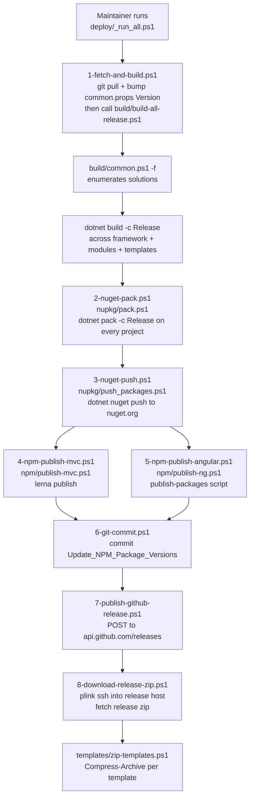

The ABP repository ships a complete, self-contained release pipeline that lives entirely inside the repo. There is no external build server configuration file; everything is a set of PowerShell scripts that any maintainer (or contributor) can run locally to reproduce the exact same artifacts that ship to NuGet and npm. This page is the landing for that pipeline — it explains the moving pieces and how they fit together, then sends you to the dedicated pages for build, deploy, CI/versioning, and Docker.

<Info>
The pipeline lives in four top-level folders of the [`abpframework/abp`](https://github.com/abpframework/abp) repository:

- `build/` — solution-wide compile and test drivers (`build-all.ps1`, `build-all-release.ps1`, `test-all.ps1`).
- `nupkg/` — NuGet packaging and pushing (`pack.ps1`, `push_packages.ps1`).
- `npm/` — npm publishing for MVC and Angular packages (`publish-mvc.ps1`, `publish-ng.ps1`, `preview-publish.ps1`).
- `deploy/` — the orchestrator that drives a release end-to-end (`_run_all.ps1` plus numbered `1-…` through `8-…` steps).

Plus the supporting MSBuild props (`common.props`, `Directory.Build.props`, `Directory.Packages.props`) and the `.github/workflows/` files that run a subset of these scripts on every PR.
</Info>

## What you'll find in this section

<CardGroup cols={2}>
  <Card title="Build scripts" icon="hammer" href="/build/build-scripts">
    The `build/` folder. Every `.ps1` enumerated — `common.ps1` (solution list + `-f` switch), `build-all.ps1` (Debug), `build-all-release.ps1` (Release), `test-all.ps1` — with parameters and real excerpts.
  </Card>
  <Card title="Deploy scripts" icon="rocket" href="/build/deploy-scripts">
    The `deploy/` folder. The numbered 1-through-8 release scripts (`1-fetch-and-build.ps1` → `8-download-release-zip.ps1`), `_run_all.ps1`, and the `nupkg/` and `npm/` helpers they invoke.
  </Card>
  <Card title="CI & versioning" icon="github" href="/build/ci-and-versioning">
    `.github/workflows/` (`build-and-test.yml`, `angular.yml`, `codeql-analysis.yml`, `publish-release.yml`, `update-versions.yml`, …) and how `common.props` plus `Directory.Build.props` drive the single shared version number.
  </Card>
  <Card title="Docker & Kubernetes" icon="docker" href="/build/docker-and-kubernetes">
    `Dockerfile`s shipped in templates and modules (`templates/module/aspnet-core/host/…`), the `docker-compose.yml` / `.override.yml` / `.migrations.yml` triplet, and how migrations containers seed databases.
  </Card>
</CardGroup>

## The release pipeline at a glance

The full release of an ABP version is a six-stage pipeline. The arrows on this diagram match real script calls — `deploy/_run_all.ps1` chains the numbered scripts, which in turn shell out into `nupkg/` and `npm/`.



Each box on that diagram corresponds to an actual script in the repo. The naming convention `1-…` through `8-…` is enforced by `deploy/_run_all.ps1` so a maintainer just runs the orchestrator and lets it call the steps in order.

## The four moving parts

### 1. MSBuild props pin one version everywhere

A single `<Version>` element in `common.props` (at the repo root) is the source of truth for every NuGet package ABP ships. Every `.csproj` in `framework/`, `modules/`, and the templates imports this file, so changing `common.props` bumps everything at once.

```xml common.props
<Project>
  <PropertyGroup>
    <LangVersion>latest</LangVersion>
    <Version>10.0.1</Version>
    <LeptonXVersion>5.0.1</LeptonXVersion>
    <NoWarn>$(NoWarn);CS1591;CS0436</NoWarn>
    <PackageIconUrl>https://abp.io/assets/abp_nupkg.png</PackageIconUrl>
    <PackageProjectUrl>https://abp.io/</PackageProjectUrl>
    <PackageLicenseExpression>LGPL-3.0-only</PackageLicenseExpression>
    <RepositoryType>git</RepositoryType>
    <RepositoryUrl>https://github.com/abpframework/abp/</RepositoryUrl>
    <PackageReadmeFile>NuGet.md</PackageReadmeFile>
    <PackageTags>aspnetcore boilerplate framework web best-practices angular maui blazor mvc csharp webapp</PackageTags>
    <GenerateDocumentationFile>true</GenerateDocumentationFile>
  </PropertyGroup>
  ...
</Project>
```

`Directory.Build.props` adds the cross-cutting behaviour that applies to every project under the repo root (most notably, auto-injecting `coverlet.collector` into anything detected as a test project):

```xml Directory.Build.props
<Project>
  <PropertyGroup>
    <IsTestProject Condition="$(MSBuildProjectFullPath.Contains('test'))
      and ($(MSBuildProjectName.EndsWith('.Tests'))
      or $(MSBuildProjectName.EndsWith('.TestBase')))">true</IsTestProject>
  </PropertyGroup>

  <ItemGroup>
    <PackageReference Condition="'$(IsTestProject)' == 'true'" Include="coverlet.collector">
      <Version Condition="$(MSBuildProjectFullPath.Contains('templates'))">6.0.4</Version>
      <PrivateAssets>all</PrivateAssets>
      <IncludeAssets>runtime; build; native; contentfiles; analyzers</IncludeAssets>
    </PackageReference>
  </ItemGroup>
</Project>
```

`Directory.Packages.props` centralises every third-party package version using the .NET 8 *Central Package Management* feature (`<ManagePackageVersionsCentrally>true</ManagePackageVersionsCentrally>`). Individual `.csproj` files reference packages without a version, and CPM resolves it from this file.

See [/build/ci-and-versioning](/build/ci-and-versioning) for the deep dive on these three files.

### 2. `build/` drives `dotnet build` across every solution

The `build/` folder contains just four scripts. The interesting bit is `common.ps1`, which keeps the list of solutions to build:

```powershell build/common.ps1 (excerpt)
$full = $args[0]

$rootFolder = (Get-Item -Path "./" -Verbose).FullName

$solutionPaths = @(
    "../framework",
    "../modules/basic-theme",
    "../modules/users",
    "../modules/permission-management",
    # … 11 more dev-mode modules …
    "../modules/blob-storing-database"
)

if ($full -eq "-f") {
    $solutionPaths += (
        "../modules/client-simulation",
        "../modules/virtual-file-explorer",
        "../modules/docs",
        "../modules/blogging",
        "../templates/module/aspnet-core",
        "../templates/app/aspnet-core",
        "../templates/console",
        "../templates/app-nolayers/aspnet-core",
        "../abp_io/AbpIoLocalization",
        "../source-code"
    )
    if ($env:OS -eq "Windows_NT") {
        $solutionPaths += "../templates/wpf"
    }
}
```

Without `-f` you get a "development mode" build (framework plus the core modules) that finishes in minutes; with `-f` you get the full build that the release pipeline uses. `build-all.ps1` walks that list calling `dotnet build` (Debug), `build-all-release.ps1` calls `dotnet build --configuration Release -- /maxcpucount`, and `test-all.ps1` calls `dotnet test --no-build --no-restore --collect:"XPlat Code Coverage"`.

Full enumeration on [/build/build-scripts](/build/build-scripts).

### 3. `deploy/` orchestrates the actual release

The `deploy/` folder is what a maintainer actually runs. The README is short and to the point:

```text deploy/readme.md (excerpt)
# ABP Framework Release Steps

## 1-) Set your secret keys

* create `npm-auth-token.txt` file in this folder
* create `nuget-api-key.txt` file this folder
* create `ssh-password.txt` file

## 2-) Run the commands

- 1-fetch-and-build.ps1
- 2-nuget-pack.ps1
- 3-nuget-push.ps1
- 4-npm-publish-mvc.ps1
- 5-npm-publish-angular.ps1
- 6-git-commit.ps1
- 7-publish-github-release.ps1
- 8-download-release-zip.ps1
```

`_run_all.ps1` calls those eight scripts in order, wrapped in a PowerShell `Start-Transcript` so the maintainer gets a complete log file (`_run_all_log.txt`).

Full enumeration with excerpts on [/build/deploy-scripts](/build/deploy-scripts).

### 4. GitHub Actions run the build on every PR

The `.github/workflows/` folder has nine YAML files. The key one is `build-and-test.yml`, which is wired up to run `build/build-all.ps1` and `build/test-all.ps1` on every push to `dev` and every PR that touches C# / Razor / props files:

```yaml .github/workflows/build-and-test.yml (excerpt)
jobs:
  build-test:
    runs-on: ubuntu-22.04
    timeout-minutes: 50
    if: ${{ !github.event.pull_request.draft }}
    steps:
    - uses: jlumbroso/free-disk-space@main
    - uses: PSModule/install-powershell@v1
      with:
        Version: latest
    - uses: actions/checkout@v2
    - uses: actions/setup-dotnet@master
      with:
        dotnet-version: 10.0.x
    - name: Build All
      run: ./build-all.ps1
      working-directory: ./build
      shell: pwsh

    - name: Test All
      run: ./test-all.ps1
      working-directory: ./build
      shell: pwsh

    - name: Codecov
      uses: codecov/codecov-action@v2
```

That is the entire CI loop for .NET. There's a separate `angular.yml` that runs `yarn affected:lint`, `yarn affected:build`, and `yarn affected:test` against the `npm/ng-packs/` workspace, plus `codeql-analysis.yml` for security scanning, `auto-pr.yml` that auto-merges `dev` → `rel-10.0`, `update-versions.yml` that bumps `latest-versions.json` after every release, and `publish-release.yml` for the GitHub Release manual trigger.

Workflow-by-workflow walkthrough on [/build/ci-and-versioning](/build/ci-and-versioning).

## How the pieces connect

The interesting thing about ABP's pipeline is that the same scripts run locally and in CI. There is no `.yml`-only build logic — GitHub Actions just calls `pwsh` and points it at `build/build-all.ps1`. That means:

<Steps>
  <Step title="A contributor on Windows can reproduce CI by running build-all.ps1">
    `cd build; .\build-all.ps1` builds the same solutions in the same order CI does. Pass `-f` to include the templates and `source-code/` projects, mimicking the release build.
  </Step>
  <Step title="A maintainer doing a release runs deploy/_run_all.ps1">
    Which calls `1-fetch-and-build.ps1`, which switches branch, bumps `common.props`, then runs `build-all-release.ps1` — i.e. the *same* `build-all.ps1` content with `-c Release`.
  </Step>
  <Step title="Packing reads common.props for the version">
    Every script that needs the version reads it directly out of `common.props`, never from a parameter:
    ```powershell
    [xml]$commonPropsXml = Get-Content "../common.props"
    $version = $commonPropsXml.Project.PropertyGroup.Version
    ```
    That keeps the source of truth in one place.
  </Step>
  <Step title="Templates are zipped after deploy">
    `templates/zip-templates.ps1 <version>` walks every subfolder of `templates/`, compresses it to `<name>-<version>.zip`, and those zips are what the [ABP CLI](/cli/overview) downloads when a user runs `abp new` for an offline template.
  </Step>
</Steps>

## Local development vs release

| Concern              | Local dev (default)                            | Release (`-f` / `_run_all`)                                |
| -------------------- | ---------------------------------------------- | ---------------------------------------------------------- |
| Solutions built      | framework + 15 core modules                    | framework + all modules + all templates + `source-code/`   |
| Configuration        | Debug (`dotnet build`)                         | Release (`dotnet build --configuration Release`)           |
| Packs `.nupkg`?      | No                                             | Yes — `nupkg/pack.ps1` runs `dotnet pack` on ~400 projects |
| Pushes to nuget.org? | No                                             | Yes — `dotnet nuget push` with `--skip-duplicate`          |
| Pushes to npmjs.org? | No                                             | Yes — `lerna publish` + `publish-packages` script          |
| Bumps `common.props` | No                                             | Yes — XML edit at the top of `1-fetch-and-build.ps1`       |
| GitHub Release       | No                                             | Yes — `7-publish-github-release.ps1` (REST POST)           |

## Related reading

<CardGroup cols={3}>
  <Card title="Repository layout" icon="folder-tree" href="/overview/build-system">
    The high-level tour of `framework/`, `modules/`, `templates/`, and how all the source folders relate.
  </Card>
  <Card title="ABP CLI" icon="terminal" href="/cli/overview">
    The CLI consumes the artifacts this pipeline produces — the `.nupkg` files for project creation and the template `.zip`s for `abp new`.
  </Card>
  <Card title="Templates" icon="copy" href="/templates/overview">
    What's inside each template that ends up in the release zip (`app`, `app-nolayers`, `module`, `console`, `maui`, `wpf`).
  </Card>
</CardGroup>

## File reference map

Use this table to jump straight to a file. Every path is repo-relative.

| File                                              | Purpose                                              | Detailed page                                |
| ------------------------------------------------- | ---------------------------------------------------- | -------------------------------------------- |
| `build/common.ps1`                                | Solution list + `-f` switch                          | [build-scripts](/build/build-scripts#common-ps1)         |
| `build/build-all.ps1`                             | Debug build                                          | [build-scripts](/build/build-scripts#build-all-ps1)      |
| `build/build-all-release.ps1`                     | Release build (full `-f`)                            | [build-scripts](/build/build-scripts#build-all-release-ps1) |
| `build/test-all.ps1`                              | `dotnet test` with coverage                          | [build-scripts](/build/build-scripts#test-all-ps1)       |
| `deploy/_run_all.ps1`                             | Release orchestrator                                 | [deploy-scripts](/build/deploy-scripts#the-orchestrator-run-all-ps1) |
| `deploy/1-fetch-and-build.ps1`                    | git pull + bump `<Version>` + build                  | [deploy-scripts](/build/deploy-scripts#step-1) |
| `deploy/2-nuget-pack.ps1` → `nupkg/pack.ps1`      | `dotnet pack` ~400 projects                          | [deploy-scripts](/build/deploy-scripts#step-2) |
| `deploy/3-nuget-push.ps1` → `nupkg/push_packages.ps1` | `dotnet nuget push --skip-duplicate`             | [deploy-scripts](/build/deploy-scripts#step-3) |
| `deploy/4-npm-publish-mvc.ps1` → `npm/publish-mvc.ps1`     | `lerna publish` for MVC packages              | [deploy-scripts](/build/deploy-scripts#step-4) |
| `deploy/5-npm-publish-angular.ps1` → `npm/publish-ng.ps1` | Angular workspace publish                       | [deploy-scripts](/build/deploy-scripts#step-5) |
| `deploy/6-git-commit.ps1`                         | Commit `Update_NPM_Package_Versions`                 | [deploy-scripts](/build/deploy-scripts#step-6) |
| `deploy/7-publish-github-release.ps1`             | POST to api.github.com/releases                      | [deploy-scripts](/build/deploy-scripts#step-7) |
| `deploy/8-download-release-zip.ps1`               | plink ssh → server-side zip fetch                    | [deploy-scripts](/build/deploy-scripts#step-8) |
| `templates/zip-templates.ps1`                     | `Compress-Archive` each template                     | [deploy-scripts](/build/deploy-scripts#supporting-files) |
| `common.props`                                    | The single `<Version>` element                       | [ci-and-versioning](/build/ci-and-versioning#common-props) |
| `Directory.Build.props`                           | Auto-inject Coverlet into test projects              | [ci-and-versioning](/build/ci-and-versioning#directory-build-props) |
| `Directory.Packages.props`                        | Central Package Management for third-party deps      | [ci-and-versioning](/build/ci-and-versioning#directory-packages-props) |
| `global.json`                                     | Pin .NET SDK to 10.0.x                               | [build-scripts](/build/build-scripts#running-the-scripts) |
| `.github/workflows/build-and-test.yml`            | PR gate (.NET)                                       | [ci-and-versioning](/build/ci-and-versioning#build-and-test-yml) |
| `.github/workflows/angular.yml`                   | PR gate (npm/ng-packs)                               | [ci-and-versioning](/build/ci-and-versioning#angular-yml) |
| `.github/workflows/codeql-analysis.yml`           | Security scanning                                    | [ci-and-versioning](/build/ci-and-versioning#codeql-analysis-yml) |
| `.github/workflows/publish-release.yml`           | Manual GitHub Release dispatch                       | [ci-and-versioning](/build/ci-and-versioning#publish-release-yml) |
| `.github/workflows/update-versions.yml`           | Bump `latest-versions.json` after release            | [ci-and-versioning](/build/ci-and-versioning#update-versions-yml) |
| `templates/module/aspnet-core/docker-compose.yml` | Reference compose stack                              | [docker-and-kubernetes](/build/docker-and-kubernetes#the-compose-triplet) |
| `npm/verdaccio-containers/`                       | Local npm publish dry-run                            | [docker-and-kubernetes](/build/docker-and-kubernetes#verdaccio) |

## TL;DR

- `build/` = drivers for `dotnet build` and `dotnet test` over a list of solutions.
- `nupkg/` and `npm/` = the actual packing and publishing.
- `deploy/` = the eight-step orchestrator that ties everything together for a release.
- `.github/workflows/` = the CI side, which calls the *same* build scripts on every PR.
- `common.props` = the single `<Version>` element that drives everything.

Pick the page that matches what you need to change:

- Changing what gets compiled → [build scripts](/build/build-scripts).
- Cutting a release → [deploy scripts](/build/deploy-scripts).
- Adding a workflow or bumping a dependency → [CI & versioning](/build/ci-and-versioning).
- Running ABP in a container → [Docker & Kubernetes](/build/docker-and-kubernetes).
