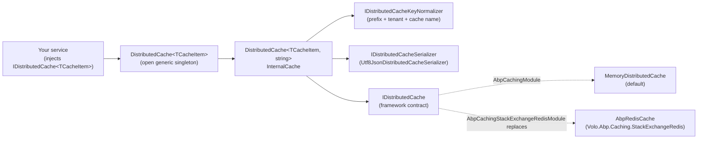

ABP's caching stack is a thin, opinionated wrapper around the standard `Microsoft.Extensions.Caching.Distributed.IDistributedCache`. Rather than passing raw `string` keys and `byte[]` payloads around the codebase, ABP gives you `IDistributedCache<TCacheItem>` — a strongly-typed cache that knows how to serialize your cache item, namespace its keys, isolate per-tenant data, participate in the current unit of work, and degrade gracefully when the underlying store goes down.

Everything in the framework that needs caching — permission grants, feature values, settings, dynamic claims, ABAC policies, localization resources — depends on this single contract. Swap `MemoryCache` for Redis at the composition root and the entire dependency tree starts sharing data across processes.

## Packages

<CardGroup cols={2}>
  <Card title="Volo.Abp.Caching" icon="layer-group" href="/caching/abstractions">
    The contracts and the in-memory default. `IDistributedCache<TCacheItem>`, `DistributedCache<TCacheItem>`, the key normalizer, the JSON serializer, and `AbpDistributedCacheOptions`.
  </Card>
  <Card title="Volo.Abp.Caching.StackExchangeRedis" icon="database" href="/caching/stackexchange-redis">
    Replaces the `IDistributedCache` registration with `AbpRedisCache`, a `RedisCache` subclass that adds bulk Get/Set/Refresh/Remove via Redis pipelining.
  </Card>
  <Card title="Multi-tenancy integration" icon="building" href="/tenancy/multi-tenancy-core">
    `ICurrentTenant.Id` is prepended to every cache key by default, giving you per-tenant isolation for free. Opt out with `[IgnoreMultiTenancy]`.
  </Card>
  <Card title="Serialization" icon="file-code" href="/core/serialization">
    Cache items go through `IDistributedCacheSerializer`. The default `Utf8JsonDistributedCacheSerializer` reuses the same `IJsonSerializer` that powers HTTP payloads.
  </Card>
</CardGroup>

## How the pieces fit

The framework registers `IDistributedCache<TCacheItem>` and `IDistributedCache<TCacheItem, TCacheKey>` as **open generic singletons**. The first time you resolve `IDistributedCache<MyCacheItem>`, the DI container instantiates a `DistributedCache<MyCacheItem, string>` that holds references to the underlying `IDistributedCache` (memory or Redis), the serializer, and the key normalizer.



The replacement step is one line of code inside `AbpCachingStackExchangeRedisModule`:

```csharp
// framework/src/Volo.Abp.Caching.StackExchangeRedis/Volo/Abp/Caching/StackExchangeRedis/AbpCachingStackExchangeRedisModule.cs
context.Services.Replace(ServiceDescriptor.Singleton<IDistributedCache, AbpRedisCache>());
```

Nothing else changes. Code that depends on `IDistributedCache<PermissionGrantCacheItem>` keeps working — it just talks to Redis instead of process memory.

## A minimal usage

```csharp
[CacheName("BookCache")]
public class BookCacheItem
{
    public Guid Id { get; set; }
    public string Name { get; set; } = default!;
}

public class BookAppService : ApplicationService
{
    private readonly IDistributedCache<BookCacheItem> _cache;
    private readonly IBookRepository _repository;

    public BookAppService(
        IDistributedCache<BookCacheItem> cache,
        IBookRepository repository)
    {
        _cache = cache;
        _repository = repository;
    }

    public async Task<BookCacheItem> GetAsync(Guid id)
    {
        return (await _cache.GetOrAddAsync(
            id.ToString(),
            async () =>
            {
                var book = await _repository.GetAsync(id);
                return new BookCacheItem { Id = book.Id, Name = book.Name };
            },
            () => new DistributedCacheEntryOptions
            {
                SlidingExpiration = TimeSpan.FromMinutes(5)
            }))!;
    }
}
```

What ABP does behind the scenes for that one call:

- Looks up the cache name via `CacheNameAttribute` — here, `"BookCache"`. Without the attribute it strips the `CacheItem` postfix from the type's full name.
- Calls `IDistributedCacheKeyNormalizer.NormalizeKey(...)` to build the actual Redis/Memory key: `c:BookCache,k:{KeyPrefix}{id}`. If a tenant is active, `t:{TenantId}` gets prepended.
- Invokes the factory only on a miss, serializes the result with `Utf8JsonDistributedCacheSerializer`, writes the bytes with `SlidingExpiration`, returns the typed object.
- Catches and logs (rather than rethrows) any backing-store exception when `HideErrors` is `true`.

## Key normalization

A single cache key string carries four pieces of information. They're concatenated in a fixed order by `DistributedCacheKeyNormalizer`:

| Segment | Source | Example |
| --- | --- | --- |
| `t:{TenantId}` | `ICurrentTenant.Id` (only when set and not ignored) | `t:8c2d…` |
| `c:{CacheName}` | `CacheNameAttribute` or type name with `CacheItem` stripped | `c:BookCache` |
| `k:{KeyPrefix}{Key}` | `AbpDistributedCacheOptions.KeyPrefix` + your key | `k:demo-BookCache,a1b2…` |

The full normalized key for a multi-tenant `BookCacheItem` looks like:

```text
t:8c2d8a90-…,c:BookCache,k:demo-a1b2c3d4-…
```

Two things to note:

- The tenant segment comes first so a Redis `KEYS t:8c2d*` scan can wipe one tenant cleanly.
- The `KeyPrefix` sits between the cache name and the actual key. It's intended for separating environments or applications sharing a Redis instance — set it once in `AbpDistributedCacheOptions`.

See [Multi-Tenancy Core](/tenancy/multi-tenancy-core) for how `ICurrentTenant` flows through requests, and the [abstractions page](/caching/abstractions) for how to opt out of the tenant segment with `[IgnoreMultiTenancy]`.

## The two cache backends

<Tabs>
  <Tab title="MemoryDistributedCache (default)">
    `AbpCachingModule` calls `services.AddDistributedMemoryCache()`. Cache entries live in process memory; nothing crosses process boundaries. Perfect for tests, single-instance dev, and unit-of-work-scoped caches.

    ```csharp
    [DependsOn(
        typeof(AbpThreadingModule),
        typeof(AbpSerializationModule),
        typeof(AbpUnitOfWorkModule),
        typeof(AbpMultiTenancyModule),
        typeof(AbpJsonModule))]
    public class AbpCachingModule : AbpModule
    {
        public override void ConfigureServices(ServiceConfigurationContext context)
        {
            context.Services.AddMemoryCache();
            context.Services.AddDistributedMemoryCache();
            // ...
        }
    }
    ```
  </Tab>
  <Tab title="AbpRedisCache (production)">
    `AbpCachingStackExchangeRedisModule` calls `services.AddStackExchangeRedisCache(...)` and then replaces the `IDistributedCache` registration with `AbpRedisCache : RedisCache, ICacheSupportsMultipleItems`. The subclass adds Redis-pipelined `GetMany` / `SetMany` / `RefreshMany` / `RemoveMany` for bulk operations.

    ```json
    // appsettings.json
    {
      "Redis": {
        "IsEnabled": "true",
        "Configuration": "127.0.0.1:6379,defaultDatabase=0"
      }
    }
    ```

    The `Redis:IsEnabled` flag exists so tests and dev environments can stay on the in-memory cache by flipping a single config value — see the [Redis page](/caching/stackexchange-redis).
  </Tab>
</Tabs>

## Bulk operations

The plain `IDistributedCache` contract only deals with one key at a time. ABP layers `ICacheSupportsMultipleItems` on top so the typed cache can amortize the network cost when a backend supports it (Redis does, Memory falls back to a loop):

```csharp
// framework/src/Volo.Abp.Caching/Volo/Abp/Caching/ICacheSupportsMultipleItems.cs
public interface ICacheSupportsMultipleItems
{
    byte[]?[] GetMany(IEnumerable<string> keys);
    Task<byte[]?[]> GetManyAsync(IEnumerable<string> keys, CancellationToken token = default);
    void SetMany(IEnumerable<KeyValuePair<string, byte[]>> items, DistributedCacheEntryOptions options);
    Task SetManyAsync(IEnumerable<KeyValuePair<string, byte[]>> items, DistributedCacheEntryOptions options, CancellationToken token = default);
    void RefreshMany(IEnumerable<string> keys);
    Task RefreshManyAsync(IEnumerable<string> keys, CancellationToken token = default);
    void RemoveMany(IEnumerable<string> keys);
    Task RemoveManyAsync(IEnumerable<string> keys, CancellationToken token = default);
}
```

In `DistributedCache<,>.GetMany`, ABP checks whether the underlying `IDistributedCache` implements this interface and either calls the pipelined version or falls back to looping `Get` calls:

```csharp
// framework/src/Volo.Abp.Caching/Volo/Abp/Caching/DistributedCache.cs
var cacheSupportsMultipleItems = Cache as ICacheSupportsMultipleItems;
if (cacheSupportsMultipleItems == null)
{
    return GetManyFallback(keyArray, hideErrors, considerUow);
}
// ... else use cacheSupportsMultipleItems.GetMany(...)
```

So you can write `GetManyAsync` once in your domain code and get pipelined behaviour the moment someone swaps in Redis.

## Unit-of-work participation

Every typed-cache method takes a `bool considerUow = false`. When set to `true` *and* a unit of work is active, ABP buffers the write in a per-uow dictionary and only flushes to the real cache when the unit of work commits. This is what lets you cache a derived projection inside a transactional write without polluting Redis if the transaction rolls back.

```csharp
await _cache.SetAsync(
    key,
    cacheItem,
    new DistributedCacheEntryOptions { SlidingExpiration = TimeSpan.FromMinutes(10) },
    considerUow: true,
    token: cancellationToken);
```

The buffer lives in the current `IUnitOfWork.Items` dictionary, keyed by `DistributedCache<,>.UowCacheName` (`"AbpDistributedCache"`).

## Hide-errors mode

When something goes wrong with the backing store — Redis is unreachable, a serializer chokes on a stale schema — you usually want the request to keep working. `AbpDistributedCacheOptions.HideErrors` defaults to `true`: exceptions are caught, logged through `ILogger`, and the call returns `null` (for reads) or a no-op (for writes).

`AbpCachingModule` flips that to `false` in development so you actually see the stack trace:

```csharp
// framework/src/Volo.Abp.Caching/Volo/Abp/Caching/AbpCachingModule.cs
if (context.Services.GetAbpHostEnvironment().IsDevelopment())
{
    Configure<AbpDistributedCacheOptions>(options =>
    {
        options.HideErrors = false;
    });
}
```

You can override per-call via the `hideErrors` parameter on every cache method.

## Global cache entry options

The same `AbpCachingModule` also pre-configures a 20-minute sliding expiration:

```csharp
Configure<AbpDistributedCacheOptions>(cacheOptions =>
{
    cacheOptions.GlobalCacheEntryOptions.SlidingExpiration = TimeSpan.FromMinutes(20);
});
```

That's the default applied to every `Set` call that doesn't supply its own `DistributedCacheEntryOptions`. Override globally in your host module, or per cache type with `AbpDistributedCacheOptions.ConfigureCache<TCacheItem>(...)`.

## Cross-references

<CardGroup cols={2}>
  <Card title="Multi-Tenancy Core" icon="building" href="/tenancy/multi-tenancy-core">
    `ICurrentTenant` is read on every key normalization. Understand tenant scoping before tuning cache layout.
  </Card>
  <Card title="Serialization" icon="file-code" href="/core/serialization">
    `IDistributedCacheSerializer` sits on top of `Volo.Abp.Serialization` and `Volo.Abp.Json` — same JSON pipeline as HTTP payloads.
  </Card>
  <Card title="Volo.Abp.Json" icon="brackets-curly" href="/misc/json">
    The default cache serializer delegates to `IJsonSerializer`. Configure JSON globally and the cache picks it up.
  </Card>
  <Card title="Abstractions" icon="puzzle-piece" href="/caching/abstractions">
    Deep dive into `DistributedCache<,>`, `AbpDistributedCacheOptions`, key normalization, and the JSON serializer.
  </Card>
</CardGroup>

## Where the framework already uses this

Most of ABP's infrastructure modules cache through `IDistributedCache<TCacheItem>` rather than the raw `IDistributedCache`. A non-exhaustive tour, to give you a sense of the shape of typical cache items:

| Module | Cache item | What's cached |
| --- | --- | --- |
| Permission Management | `PermissionGrantCacheItem` | Granted permissions per provider/key pair, scoped per tenant. |
| Feature Management | `FeatureValueCacheItem` | Resolved feature values; tenant-aware unless the feature is host-only. |
| Setting Management | `SettingValueCacheItem` | Resolved setting values per scope. |
| Identity / Dynamic Claims | `AbpDynamicClaimCacheItem` | Materialised claim lists per user. |

What's interesting in those modules is how few lines they spend on caching code — usually a single `GetOrAddAsync` in a manager class, plus a `RemoveAsync` in the matching invalidator. The typed cache absorbs the rest: key shape, serialization, multi-tenancy, and the fallback when Redis is down.

If you write your own module that produces aggregated read models, the convention is the same: one `[CacheName(...)]`-decorated cache item per logical projection, one `IDistributedCache<TThatItem>` injection, and a small invalidator that listens for domain events and calls `RemoveAsync`/`RemoveManyAsync`.

## A quick decision guide

<AccordionGroup>
  <Accordion title="Should I use the memory backend or Redis?">
    Use **memory** for single-process apps, integration tests, and any environment where you don't need shared state. Use **Redis** the moment you have more than one process (web farm, blue/green deploys, background worker hosts) or you want cache state to survive a restart.

    The switch is one module dependency and one configuration entry. There's no in-code change to your services.
  </Accordion>
  <Accordion title="Should I set considerUow: true?">
    Set it to `true` when the cached value is a derivation of writes happening *inside the current unit of work* and a rollback would otherwise leave Redis with a stale projection. Leave it `false` for read-side caches whose source of truth is independent of the current transaction.
  </Accordion>
  <Accordion title="Should I add [IgnoreMultiTenancy] to my cache item?">
    Add it when the cached value is genuinely host-wide and tenant-independent — global settings, host-scoped feature flags, public catalogues. Leave it off (the default) for anything derived from tenant data; you don't want one tenant reading another's cached projection.
  </Accordion>
  <Accordion title="Where should I tune sliding expiration?">
    Per-cache overrides via `AbpDistributedCacheOptions.ConfigureCache<TCacheItem>(...)` are the right place for "this cache should live for 5 minutes, that one for an hour". The 20-minute default applies to anything you don't explicitly configure. For one-off long-lived entries, pass an `optionsFactory` to `GetOrAddAsync`.
  </Accordion>
</AccordionGroup>

## Next steps

<Steps>
  <Step title="Read the abstractions">
    Walk through `AbpCachingModule`, `DistributedCache<TCacheItem, TCacheKey>`, and `AbpDistributedCacheOptions` to understand the typed-cache contract end-to-end. See [Abstractions](/caching/abstractions).
  </Step>
  <Step title="Add Redis">
    In any environment that runs more than one process, depend on `AbpCachingStackExchangeRedisModule` and configure `Redis:Configuration`. The [Redis page](/caching/stackexchange-redis) shows how the module replaces the `IDistributedCache` registration and how to tune the connection.
  </Step>
  <Step title="Tune per-cache options">
    Use `AbpDistributedCacheOptions.ConfigureCache<TCacheItem>(...)` to override the global sliding expiration for hot caches, and `[CacheName]` to keep your normalized keys stable across renames.
  </Step>
  <Step title="Wire invalidation through domain events">
    Pair every cache with a small event handler that removes the affected keys when source data changes. `RemoveManyAsync` makes this cheap, even when one domain event invalidates dozens of cache entries.
  </Step>
</Steps>
