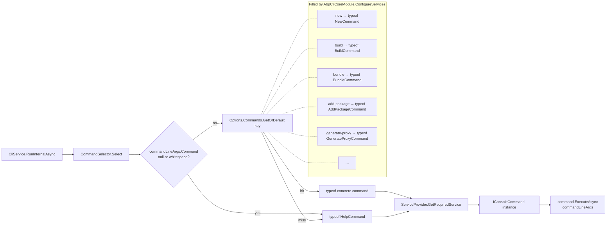

When `CliService.RunInternalAsync` says

```csharp
var commandType = CommandSelector.Select(commandLineArgs);
```

it walks across one of the simplest dispatchers in the framework: a `Dictionary<string, Type>` lookup. This page documents the three interfaces involved, the lookup itself, and every concrete `IConsoleCommand` that lives in [`framework/src/Volo.Abp.Cli.Core/Volo/Abp/Cli/Commands/`](https://github.com/abpframework/abp/tree/dev/framework/src/Volo.Abp.Cli.Core/Volo/Abp/Cli/Commands).

## The three interfaces

### `ICommandSelector`

```csharp framework/src/Volo.Abp.Cli.Core/Volo/Abp/Cli/Commands/ICommandSelector.cs
public interface ICommandSelector
{
    Type Select(CommandLineArgs commandLineArgs);
}
```

A single method; given parsed arguments, return the runtime type of the command to execute. The return is a `Type` (not an instance) so callers can decide their own scoping rules. `CliService` opens a per-command service scope before resolving the instance, ensuring each command gets a fresh `IUnitOfWork`, fresh `HttpClient` factory state, fresh `EventBus` subscriptions, etc.

### `IConsoleCommand`

```csharp framework/src/Volo.Abp.Cli.Core/Volo/Abp/Cli/Commands/IConsoleCommand.cs
public interface IConsoleCommand
{
    Task ExecuteAsync(CommandLineArgs commandLineArgs);

    string GetUsageInfo();
}
```

Two methods:

- `ExecuteAsync(commandLineArgs)` does the work. The `string[]` has already been parsed; commands only look at `commandLineArgs.Target` and `commandLineArgs.Options`.
- `GetUsageInfo()` returns the `abp help <cmd>` payload. Most commands build a `StringBuilder` of `abp <cmd>`, options, and examples. `LogoutCommand` returns `string.Empty` because there is no usage to print.

Commands implement both `IConsoleCommand` **and** `ITransientDependency`, so they are auto-registered by ABP's conventional registrar:

```csharp framework/src/Volo.Abp.Cli.Core/Volo/Abp/Cli/Commands/BundleCommand.cs
public class BundleCommand : IConsoleCommand, ITransientDependency
{
    public const string Name = "bundle";
    // ...
}
```

### `CommandSelector`

```csharp framework/src/Volo.Abp.Cli.Core/Volo/Abp/Cli/Commands/CommandSelector.cs
public class CommandSelector : ICommandSelector, ITransientDependency
{
    protected AbpCliOptions Options { get; }

    public CommandSelector(IOptions<AbpCliOptions> options)
    {
        Options = options.Value;
    }

    public Type Select(CommandLineArgs commandLineArgs)
    {
        if (commandLineArgs.Command.IsNullOrWhiteSpace())
        {
            return typeof(HelpCommand);
        }

        return Options.Commands.GetOrDefault(commandLineArgs.Command)
               ?? typeof(HelpCommand);
    }
}
```

There are exactly two rules:

1. **Empty command → `HelpCommand`.** Running `abp` with no arguments prints the global usage banner.
2. **Unknown command → `HelpCommand`.** Typo-like inputs (`abp now`) silently fall through to help; `HelpCommand.ExecuteAsync` then writes `There is no command named now.` to the console.

The lookup is case-insensitive because `AbpCliOptions.Commands` is constructed with `StringComparer.OrdinalIgnoreCase`. There is **no** alias support and no fuzzy matching; the constant `XxxCommand.Name` is exactly what users type.

## The flow, in pictures



## The complete command table

Every command registered in `AbpCliCoreModule.ConfigureServices`. Names are the constants you type at the prompt; paths are relative to the abp repository root.

| `Name` constant | Class | File | Description (from `GetShortDescription()`) |
| --- | --- | --- | --- |
| `help` | `HelpCommand` | `framework/src/Volo.Abp.Cli.Core/Volo/Abp/Cli/Commands/HelpCommand.cs` | Show general usage or the usage of a specific command via reflection. |
| `prompt` | `PromptCommand` | `framework/src/Volo.Abp.Cli.Core/Volo/Abp/Cli/Commands/PromptCommand.cs` | Starts with prompt mode. |
| `new` | `NewCommand` | `framework/src/Volo.Abp.Cli.Core/Volo/Abp/Cli/Commands/NewCommand.cs` | Generate a new solution based on the ABP startup templates. |
| `get-source` | `GetSourceCommand` | `framework/src/Volo.Abp.Cli.Core/Volo/Abp/Cli/Commands/GetSourceCommand.cs` | Download the source code of the specified module. |
| `update` | `UpdateCommand` | `framework/src/Volo.Abp.Cli.Core/Volo/Abp/Cli/Commands/UpdateCommand.cs` | Update all ABP related NuGet packages and NPM packages in a solution or project to the latest version. |
| `add-package` | `AddPackageCommand` | `framework/src/Volo.Abp.Cli.Core/Volo/Abp/Cli/Commands/AddPackageCommand.cs` | Add a new ABP package to a project by adding related NuGet package dependencies and `[DependsOn(...)]` attributes. |
| `add-module` | `AddModuleCommand` | `framework/src/Volo.Abp.Cli.Core/Volo/Abp/Cli/Commands/AddModuleCommand.cs` | Add a multi-package module to a solution by finding all packages of the module. |
| `list-modules` | `ListModulesCommand` | `framework/src/Volo.Abp.Cli.Core/Volo/Abp/Cli/Commands/ListModulesCommand.cs` | List open source application modules. |
| `list-templates` | `ListTemplatesCommand` | `framework/src/Volo.Abp.Cli.Core/Volo/Abp/Cli/Commands/ListTemplatesCommand.cs` | Lists available templates to be created. |
| `login` | `LoginCommand` | `framework/src/Volo.Abp.Cli.Core/Volo/Abp/Cli/Commands/LoginCommand.cs` | Sign in to `account.abp.io`. Supports password and `--device` login. |
| `login-info` | `LoginInfoCommand` | `framework/src/Volo.Abp.Cli.Core/Volo/Abp/Cli/Commands/LoginInfoCommand.cs` | Show your login info. |
| `logout` | `LogoutCommand` | `framework/src/Volo.Abp.Cli.Core/Volo/Abp/Cli/Commands/LogoutCommand.cs` | Sign out from `account.abp.io`. |
| `generate-proxy` | `GenerateProxyCommand` | `framework/src/Volo.Abp.Cli.Core/Volo/Abp/Cli/Commands/GenerateProxyCommand.cs` | Generates client service proxies and DTOs to consume HTTP APIs. |
| `remove-proxy` | `RemoveProxyCommand` | `framework/src/Volo.Abp.Cli.Core/Volo/Abp/Cli/Commands/RemoveProxyCommand.cs` | Remove client service proxies and DTOs to consume HTTP APIs. |
| `suite` | `SuiteCommand` | `framework/src/Volo.Abp.Cli.Core/Volo/Abp/Cli/Commands/SuiteCommand.cs` | Install, update, remove or start ABP Suite. |
| `switch-to-preview` | `SwitchToPreviewCommand` | `framework/src/Volo.Abp.Cli.Core/Volo/Abp/Cli/Commands/SwitchToPreviewCommand.cs` | Switches packages to preview ABP version. |
| `switch-to-stable` | `SwitchToStableCommand` | `framework/src/Volo.Abp.Cli.Core/Volo/Abp/Cli/Commands/SwitchToStableCommand.cs` | Switches packages to stable ABP version from preview version. |
| `switch-to-nightly` | `SwitchToNightlyCommand` | `framework/src/Volo.Abp.Cli.Core/Volo/Abp/Cli/Commands/SwitchToNightlyCommand.cs` | Switches packages to nightly preview ABP version. |
| `switch-to-prerc` | `SwitchToPreRcCommand` | `framework/src/Volo.Abp.Cli.Core/Volo/Abp/Cli/Commands/SwitchToPreRcCommand.cs` | Switches npm packages to pre-rc ABP version. |
| `switch-to-local` | `SwitchToLocal` | `framework/src/Volo.Abp.Cli.Core/Volo/Abp/Cli/Commands/SwitchToLocalCommand.cs` | Changes all NuGet package references to local project references for all the `.csproj` files in the specified folder. |
| `translate` | `TranslateCommand` | `framework/src/Volo.Abp.Cli.Core/Volo/Abp/Cli/Commands/TranslateCommand.cs` | Mainly used to translate ABP's resources (JSON files) easier. |
| `build` | `BuildCommand` | `framework/src/Volo.Abp.Cli.Core/Volo/Abp/Cli/Commands/BuildCommand.cs` | Builds a dotnet repository and dependent repositories or a solution. |
| `bundle` | `BundleCommand` | `framework/src/Volo.Abp.Cli.Core/Volo/Abp/Cli/Commands/BundleCommand.cs` | Bundles all third party styles and scripts required by modules and updates `index.html` file. |
| `create-migration-and-run-migrator` | `CreateMigrationAndRunMigratorCommand` | `framework/src/Volo.Abp.Cli.Core/Volo/Abp/Cli/Commands/CreateMigrationAndRunMigratorCommand.cs` | Hidden helper used by `NewCommand` to create the initial EF Core migration and run the DbMigrator project. |
| `install-libs` | `InstallLibsCommand` | `framework/src/Volo.Abp.Cli.Core/Volo/Abp/Cli/Commands/InstallLibsCommand.cs` | Install NPM Packages for MVC / Razor Pages and Blazor Server UI types. |
| `clean` | `CleanCommand` | `framework/src/Volo.Abp.Cli.Core/Volo/Abp/Cli/Commands/CleanCommand.cs` | Delete all `bin` and `obj` folders in current folder. |
| `cli` | `CliCommand` | `framework/src/Volo.Abp.Cli.Core/Volo/Abp/Cli/Commands/CliCommand.cs` | Update or remove ABP CLI. |
| `clear-download-cache` | `ClearDownloadCacheCommand` | `framework/src/Volo.Abp.Cli.Core/Volo/Abp/Cli/Commands/ClearDownloadCacheCommand.cs` | Clears the templates download cache. |
| `recreate-initial-migration` | `RecreateInitialMigrationCommand` | `framework/src/Volo.Abp.Cli.Core/Volo/Abp/Cli/Commands/Internal/RecreateInitialMigrationCommand.cs` | Internal/hidden — recreates the initial migration. Decorated with `[HideFromCommandList]`. |
| `generate-razor-page` | `GenerateRazorPage` | `framework/src/Volo.Abp.Cli.Core/Volo/Abp/Cli/Commands/GenerateRazorPage.cs` | Generates code files for Razor page. |

### Helper / base classes (not registered)

These live alongside the commands but are not `IConsoleCommand` themselves — they're inherited or referenced by the registered commands.

| Class | File | Role |
| --- | --- | --- |
| `ProjectCreationCommandBase` | `framework/src/Volo.Abp.Cli.Core/Volo/Abp/Cli/Commands/ProjectCreationCommandBase.cs` | Shared base for `NewCommand`. Holds the `Options` constants, validates project names, drives initial migrations, opens the post-creation web page, and configures Angular themes. |
| `ProxyCommandBase` | `framework/src/Volo.Abp.Cli.Core/Volo/Abp/Cli/Commands/ProxyCommandBase.cs` | Shared base for `GenerateProxyCommand` and `RemoveProxyCommand`. Reads `-t / -u / -m / --module / --url / --output / --folder` and dispatches to the right `IServiceProxyGenerator`. |
| `HideFromCommandList` | `framework/src/Volo.Abp.Cli.Core/Volo/Abp/Cli/Commands/Internal/HideFromCommandList.cs` | Attribute used by `HelpCommand` to skip commands when printing the global help table (e.g. `recreate-initial-migration`). |
| `CommandSelector` | `framework/src/Volo.Abp.Cli.Core/Volo/Abp/Cli/Commands/CommandSelector.cs` | The dispatcher itself. |
| `ConnectionStringProvider` | `framework/src/Volo.Abp.Cli.Core/Volo/Abp/Cli/Commands/Services/ConnectionStringProvider.cs` | Resolves a connection string from `appsettings.json` / `appsettings.secrets.json` for `NewCommand` and `CreateMigrationAndRunMigratorCommand`. |
| `InitialMigrationCreator` | `framework/src/Volo.Abp.Cli.Core/Volo/Abp/Cli/Commands/Services/InitialMigrationCreator.cs` | Runs `dotnet ef migrations add Initial` and `dotnet run` against the DbMigrator project after `abp new` finishes. |
| `SourceCodeDownloadService` | `framework/src/Volo.Abp.Cli.Core/Volo/Abp/Cli/Commands/Services/SourceCodeDownloadService.cs` | Downloads module source code for `GetSourceCommand`. |
| `SuiteAppSettingsService` | `framework/src/Volo.Abp.Cli.Core/Volo/Abp/Cli/Commands/Services/SuiteAppSettingsService.cs` | Reads/writes Suite's `appsettings.json` for port + auto-update settings. |
| `AbpNuGetIndexUrlService` | `framework/src/Volo.Abp.Cli.Core/Volo/Abp/Cli/Commands/Services/AbpNuGetIndexUrlService.cs` | Resolves the right NuGet index URL for a given pro-package update / install. |
| `DotnetEfToolManager` | `framework/src/Volo.Abp.Cli.Core/Volo/Abp/Cli/Commands/Services/DotnetEfToolManager.cs` | Ensures `dotnet-ef` global tool is installed before running migration commands. |

## How `HelpCommand` consumes the table

`HelpCommand` is interesting because it is both a fallback (returned by `CommandSelector` for empty/unknown commands) **and** an explicit command (`abp help <something>`). Its `ExecuteAsync` reads the registered dictionary directly:

```csharp framework/src/Volo.Abp.Cli.Core/Volo/Abp/Cli/Commands/HelpCommand.cs
public Task ExecuteAsync(CommandLineArgs commandLineArgs)
{
    if (string.IsNullOrWhiteSpace(commandLineArgs.Target))
    {
        Logger.LogInformation(GetUsageInfo());
        return Task.CompletedTask;
    }

    if (!AbpCliOptions.Commands.ContainsKey(commandLineArgs.Target))
    {
        Logger.LogWarning($"There is no command named {commandLineArgs.Target}.");
        Logger.LogInformation(GetUsageInfo());
        return Task.CompletedTask;
    }

    var commandType = AbpCliOptions.Commands[commandLineArgs.Target];

    using (var scope = ServiceScopeFactory.CreateScope())
    // ...
}
```

For the global help banner, it iterates over every command type, **reflects** for a static `GetShortDescription()` method, and prints `"  <name>     <short description>"`. The `[HideFromCommandList]` attribute is honoured by checking `command.Value.GetCustomAttribute<HideFromCommandListAttribute>()` before printing.

That convention — static `GetShortDescription()` returning a sentence — is the **only** reason every command class on this page has the same shape.

## Adding a new command

The mechanical recipe:

1. Create `MyNewCommand : IConsoleCommand, ITransientDependency` in `Volo.Abp.Cli.Core/Volo/Abp/Cli/Commands/`.
2. Define a `public const string Name = "my-new-command";`.
3. Implement `ExecuteAsync(CommandLineArgs commandLineArgs)` and `GetUsageInfo()`. Optionally add `public static string GetShortDescription() => "...";` so it appears in `abp` (no args).
4. Add it to `AbpCliCoreModule.ConfigureServices`:

```csharp
Configure<AbpCliOptions>(options =>
{
    // ...
    options.Commands[MyNewCommand.Name] = typeof(MyNewCommand);
});
```

The `ITransientDependency` interface handles container registration. `CommandSelector` finds it on the next prompt. No assembly scanning, no attribute discovery — the dictionary is the contract.

## Internal commands and hidden surface

`RecreateInitialMigrationCommand` is registered exactly the same way but is hidden from `abp` help:

```csharp framework/src/Volo.Abp.Cli.Core/Volo/Abp/Cli/Commands/Internal/RecreateInitialMigrationCommand.cs
[HideFromCommandList]
public class RecreateInitialMigrationCommand : IConsoleCommand, ITransientDependency
```

`CreateMigrationAndRunMigratorCommand` also has `[HideFromCommandList]`:

```csharp framework/src/Volo.Abp.Cli.Core/Volo/Abp/Cli/Commands/CreateMigrationAndRunMigratorCommand.cs
[HideFromCommandList]
public class CreateMigrationAndRunMigratorCommand : IConsoleCommand, ITransientDependency
```

Both are real commands that you *can* run directly (e.g. for debugging the migration flow), but they are not advertised because they are usually orchestrated by `NewCommand`.

## Cross-references for each command

- [`new`](/cli/new-command), [`build`/`bundle`/`clean`](/cli/build-bundle-clean), [`install-libs`/`add-package`/`add-module`](/cli/install-libs-and-add-package), [`generate-proxy`/`remove-proxy`](/cli/proxy-and-generate-proxy), [`login`/`logout`/`login-info`/`translate`](/cli/login-logout-translate).
- All [`switch-to-*`](/cli/version-switch-commands), [`update`](/cli/version-switch-commands#updatecommand), [`suite`](/cli/version-switch-commands#suitecommand), [`prompt`](/cli/version-switch-commands#promptcommand), [`help`](/cli/version-switch-commands#helpcommand), [`generate-razor-page`](/cli/version-switch-commands#generaterazorpage), [`get-source`](/cli/version-switch-commands#getsourcecommand), [`list-templates`](/cli/version-switch-commands#listtemplatescommand), [`list-modules`](/cli/version-switch-commands#listmodulescommand), [`create-migration-and-run-migrator`](/cli/version-switch-commands#createmigrationandrunmigratorcommand) are documented in [version-switch-commands](/cli/version-switch-commands).

## Why this design?

A reflection-driven dispatcher would have made `AbpCliCoreModule.ConfigureServices` smaller, but at the cost of:

- **Startup time.** Reflecting over a large assembly to find every `IConsoleCommand` measurably slowed cold starts in early ABP versions; the explicit dictionary was the fix.
- **Override-ability.** A consumer (think ABP Studio's CLI) can replace `Commands["new"]` with their own type in a `ConfigureServices` of a depending module. With reflection, you'd need to remove the original implementation by type discovery.
- **Predictability.** `Ctrl+F "options.Commands["` in the source gives you every supported command, in registration order. There is no extra metadata to chase.

That's also why the `Internal/` subfolder exists: a command can be **registered but hidden** without changing the dispatcher logic.

## The cost of resolving a command

The selector is `O(1)`. The resolve step (`ServiceProvider.GetRequiredService(commandType)`) is the slow part for the first invocation in a session because Autofac has to instantiate every dependency declared by the command's constructor. For `NewCommand` that includes `IInstallLibsService`, `IBundlingService`, `TemplateProjectBuilder`, `ITemplateInfoProvider`, `InitialMigrationCreator`, `AngularPwaSupportAdder`, `ThemePackageAdder`, `ILocalEventBus`, and `AngularThemeConfigurer` — each with their own dependency tree.

The bottleneck is largely amortised by the per-command `ServiceScopeFactory.CreateScope()` so a `prompt`-mode session only pays the cost once per command type used. Commands that **don't** declare heavy dependencies (`CleanCommand`, `PromptCommand`, `HelpCommand`, `ClearDownloadCacheCommand`) resolve almost instantly.

## How help discovers commands

`HelpCommand.GetUsageInfo()` is the one consumer that walks the dictionary:

```csharp framework/src/Volo.Abp.Cli.Core/Volo/Abp/Cli/Commands/HelpCommand.cs
foreach (var command in AbpCliOptions.Commands.ToArray().Where(NotHiddenFromCommandList).OrderBy(x => x.Key))
{
    var method = command.Value.GetMethod("GetShortDescription", BindingFlags.Static | BindingFlags.Public);
    if (method == null)
    {
        continue;
    }

    var shortDescription = (string) method.Invoke(null, null);

    sb.Append("    > ");
    sb.Append(command.Key);
    sb.Append(string.IsNullOrWhiteSpace(shortDescription) ? "" : ":");
    sb.Append(" ");
    sb.AppendLine(shortDescription);
}
```

Three rules:

1. Skip anything whose type carries `[HideFromCommandList]`.
2. Skip anything without a public **static** `GetShortDescription()` method.
3. Order alphabetically by key for stable output.

This is also why every command in the table above declares `public static string GetShortDescription()` — without it the command is hidden from help even though it still dispatches correctly.

### `[HideFromCommandList]`

```csharp framework/src/Volo.Abp.Cli.Core/Volo/Abp/Cli/Commands/Internal/HideFromCommandList.cs
[AttributeUsage(AttributeTargets.Class)]
public class HideFromCommandList : Attribute
{
}
```

Currently applied to `RecreateInitialMigrationCommand` (used internally for the dev-time "regenerate Initial migration" loop) and `CreateMigrationAndRunMigratorCommand` (an entry point for the post-`abp new` migration creator). Both are real commands — they parse and run — they're just not advertised.

## Testing a custom command

Because the selector and the commands are wired by DI, a unit test for a custom command typically looks like:

```csharp
var commandLineArgs = new CommandLineArgumentParser().Parse(
    new[] { "my-new-command", "Acme.BookStore", "--some-flag" });

var commandSelector = new CommandSelector(Options.Create(new AbpCliOptions
{
    Commands = { ["my-new-command"] = typeof(MyNewCommand) }
}));

commandSelector.Select(commandLineArgs).ShouldBe(typeof(MyNewCommand));

using var scope = serviceProvider.CreateScope();
var command = (IConsoleCommand)scope.ServiceProvider.GetRequiredService(typeof(MyNewCommand));
await command.ExecuteAsync(commandLineArgs);
```

There is no test scaffolding required beyond a regular `AbpApplicationFactory.Create<TTestModule>` setup.

## Next

- [`abp new` — the most complex command](/cli/new-command)
- [Project building pipeline — what `NewCommand` calls into](/cli/project-building)
- [Project modification — what add/update/switch commands rely on](/cli/project-modification)
- [Service proxying — what `GenerateProxyCommand` calls into](/cli/service-proxying)
