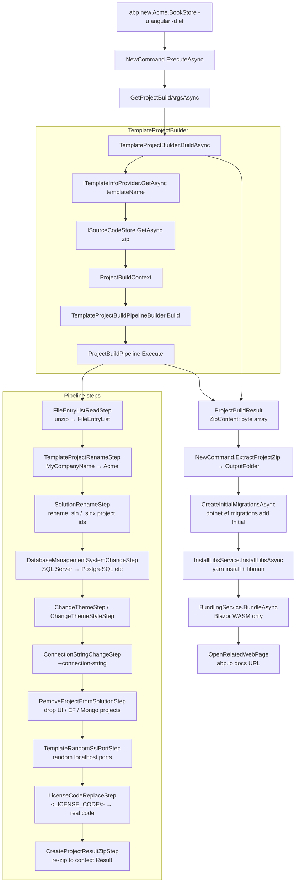

`abp new` is the largest command in the CLI by code volume — it has to download the right template archive, replace placeholders, evaluate template markers (`<TEMPLATE-REMOVE>`), pick the right DBMS, generate initial migrations, wire up the bundling pipeline, optionally launch a browser, and emit analytics. This page walks the implementation in source order.

<Info>
Source files for this page:
- [`NewCommand.cs`](https://github.com/abpframework/abp/blob/dev/framework/src/Volo.Abp.Cli.Core/Volo/Abp/Cli/Commands/NewCommand.cs) — the entry point.
- [`ProjectCreationCommandBase.cs`](https://github.com/abpframework/abp/blob/dev/framework/src/Volo.Abp.Cli.Core/Volo/Abp/Cli/Commands/ProjectCreationCommandBase.cs) — shared `Options` block and post-create steps.
- [`ProjectBuilding/TemplateProjectBuilder.cs`](https://github.com/abpframework/abp/blob/dev/framework/src/Volo.Abp.Cli.Core/Volo/Abp/Cli/ProjectBuilding/TemplateProjectBuilder.cs) — the actual zip → in-memory pipeline.
</Info>

## The entry point

`NewCommand` derives from `ProjectCreationCommandBase` for shared post-creation logic, and implements `IConsoleCommand` for dispatch. It registers under the constant `Name = "new"`:

```csharp framework/src/Volo.Abp.Cli.Core/Volo/Abp/Cli/Commands/NewCommand.cs
public class NewCommand : ProjectCreationCommandBase, IConsoleCommand, ITransientDependency
{
    public const string Name = "new";

    protected TemplateProjectBuilder TemplateProjectBuilder { get; }
    public ITemplateInfoProvider TemplateInfoProvider { get; }
    // ...
}
```

The dependencies are heavy — it asks for the connection-string resolver, the version finder, the install-libs service, the bundler, the local event bus, the template info provider, and the template builder itself. All resolved via the per-command scope opened in `CliService.RunInternalAsync`.

## The full `ExecuteAsync`

```csharp framework/src/Volo.Abp.Cli.Core/Volo/Abp/Cli/Commands/NewCommand.cs
public async Task ExecuteAsync(CommandLineArgs commandLineArgs)
{
    var projectName = NamespaceHelper.NormalizeNamespace(commandLineArgs.Target);
    if (string.IsNullOrWhiteSpace(projectName))
    {
        throw new CliUsageException("Project name is missing!" + Environment.NewLine + Environment.NewLine + GetUsageInfo());
    }

    ProjectNameValidator.Validate(projectName);

    Logger.LogInformation("Creating your project...");
    Logger.LogInformation("Project name: " + projectName);

    var template = commandLineArgs.Options.GetOrNull(Options.Template.Short, Options.Template.Long);
    if (template != null)
    {
        Logger.LogInformation("Template: " + template);
    }
    else
    {
        template = (await TemplateInfoProvider.GetDefaultAsync()).Name;
    }

    var isTiered = commandLineArgs.Options.ContainsKey(Options.Tiered.Long);
    if (isTiered)
    {
        Logger.LogInformation("Tiered: yes");
    }

    var projectArgs = await GetProjectBuildArgsAsync(commandLineArgs, template, projectName);

    await CheckCreatingRequirements(projectArgs);

    var result = await TemplateProjectBuilder.BuildAsync(
        projectArgs
    );

    ExtractProjectZip(result, projectArgs.OutputFolder);

    Logger.LogInformation($"'{projectName}' has been successfully created to '{projectArgs.OutputFolder}'");

    await CheckCreatedRequirements(projectArgs);

    await CreateOpenIddictPfxFilesAsync(projectArgs);
    await RunGraphBuildForMicroserviceServiceTemplate(projectArgs);
    await CreateInitialMigrationsAsync(projectArgs);

    await ConfigureAngularAfterMicroserviceServiceCreatedAsync(projectArgs, template);

    var skipInstallLibs = commandLineArgs.Options.ContainsKey(Options.SkipInstallingLibs.Long) || commandLineArgs.Options.ContainsKey(Options.SkipInstallingLibs.Short);
    if (!skipInstallLibs)
    {
        await RunInstallLibsForWebTemplateAsync(projectArgs);
        ConfigureAngularJsonForThemeSelection(projectArgs);
    }

    var skipBundling = commandLineArgs.Options.ContainsKey(Options.SkipBundling.Long) || commandLineArgs.Options.ContainsKey(Options.SkipBundling.Short);
    if (!skipBundling)
    {
        await RunBundleInternalAsync(projectArgs);
    }

    await ConfigurePwaSupportForAngular(projectArgs);

    if (!commandLineArgs.Options.ContainsKey(Options.NoOpenWebPage.Long))
    {
        OpenRelatedWebPage(projectArgs, template, isTiered, commandLineArgs);
    }
}
```

The execution is a deliberately linear pipeline. Each method is implemented in the base class:

| Step | Method | Purpose |
| --- | --- | --- |
| 1 | `NamespaceHelper.NormalizeNamespace(target)` | Trims/normalises the project name. |
| 2 | `ProjectNameValidator.Validate(projectName)` | Rejects names that conflict with reserved tokens (`MyCompanyName`, `MyProjectName`). |
| 3 | `TemplateInfoProvider.GetDefaultAsync()` | If no `-t` provided, picks `AppTemplate.TemplateName = "app"`. |
| 4 | `GetProjectBuildArgsAsync` (base) | Reads every flag, fills a `ProjectBuildArgs` instance. |
| 5 | `TemplateProjectBuilder.BuildAsync(projectArgs)` | Downloads/locates the template zip, runs the pipeline, returns a `ProjectBuildResult` containing the rewritten zip in memory. |
| 6 | `ExtractProjectZip` (base) | Writes the zip to `OutputFolder`. |
| 7 | `CreateOpenIddictPfxFilesAsync` (base) | Generates the `openiddict.pfx` for the OpenIddict server. |
| 8 | `RunGraphBuildForMicroserviceServiceTemplate` (base) | For microservice template, runs `dotnet build /graph` to seed the Tye/Compose files. |
| 9 | `CreateInitialMigrationsAsync` (base) | Calls `InitialMigrationCreator` to run `dotnet ef migrations add Initial` and run the DbMigrator. |
| 10 | `RunInstallLibsForWebTemplateAsync` (base) | Yarn install + libman copy (skips on `-sib`). |
| 11 | `RunBundleInternalAsync` (base) | Runs `BundlingService.BundleAsync` for Blazor WASM (skips on `-sb`). |
| 12 | `ConfigurePwaSupportForAngular` (base) | If `--pwa` was set, adds `@angular/pwa`. |
| 13 | `OpenRelatedWebPage` (base) | Opens `templateInfo.DocumentUrl` in the browser unless `--no-open-web-page`. |

## Template flag matrix

The four canonical flags map onto `ProjectBuildArgs` properties. Constants come from `ProjectCreationCommandBase.Options`.

| Flag | Short / Long | Maps to | Possible values |
| --- | --- | --- | --- |
| Template | `-t` / `--template` | `ProjectBuildArgs.TemplateName` | `app`, `app-nolayers`, `module`, `console`, `maui`, `wpf`, `app-pro`, `module-pro`, `microservice-pro`, … |
| UI | `-u` / `--ui` | `ProjectBuildArgs.UiFramework` | `mvc`, `blazor`, `blazor-server`, `blazor-webapp`, `angular`, `none` |
| Database | `-d` / `--database-provider` | `ProjectBuildArgs.DatabaseProvider` | `ef`, `mongodb` |
| Mobile | `-m` / `--mobile` | `ProjectBuildArgs.MobileApp` | `none`, `react-native`, `maui` |

There are also orthogonal flags that toggle features without changing the project topology:

| Flag | Effect |
| --- | --- |
| `--tiered` | Splits the host into `Web` + `HttpApi.Host` + `AuthServer`. |
| `--separate-auth-server` | Promotes `AuthServer` to a separate host. |
| `--no-ui` | Skips the UI project entirely (template-permitting). |
| `--no-random-port` | Keeps the template's hard-coded ports instead of generating randoms (`TemplateRandomSslPortStep`). |
| `--dbms <name>` | Maps to `ProjectBuildArgs.DatabaseManagementSystem`: `SqlServer`, `MySQL`, `PostgreSQL`, `Oracle`, `Oracle-Devart`, `SQLite`. |
| `--theme <name>` | LeptonX-Lite (default), Basic, LeptonX (pro). |
| `-cs / --connection-string <s>` | Replaces the default connection string in `appsettings.json`. |
| `-o / --output-folder <p>` | Output directory; default is the current directory. |
| `-v / --version <semver>` | Pin to a specific template version or `branch@dev`. |
| `-ts / --template-source <path>` | Use a local copy of the templates folder instead of downloading. |
| `--local-framework-ref --abp-path <p>` | Keep `ProjectReference`s to a local ABP checkout. |
| `-sib / --skip-installing-libs` | Don't run `npm/yarn install`. |
| `-sb / --skip-bundling` | Don't run `abp bundle` after Blazor WASM creation. |
| `-sc / --skip-cache` | Force fresh download. |
| `--preview` | Pick a prerelease template version. |

The `Options` constants live in `ProjectCreationCommandBase`:

```csharp framework/src/Volo.Abp.Cli.Core/Volo/Abp/Cli/Commands/ProjectCreationCommandBase.cs
public static class Options
{
    public static class Template
    {
        public const string Short = "t";
        public const string Long = "template";
    }

    public static class DatabaseProvider
    {
        public const string Short = "d";
        public const string Long = "database-provider";
    }
    // ... DatabaseManagementSystem, OutputFolder, GitHubAbpLocalRepositoryPath,
    //     GitHubVoloLocalRepositoryPath, Version, UiFramework, Mobile,
    //     PublicWebSite, TemplateSource, ConnectionString, CreateSolutionFolder,
    //     SkipInstallingLibs, SkipBundling, SkipCache, TrustUserVersion, Tiered, ...
}
```

These are the canonical short/long keys used across `NewCommand`, the `add-package` / `add-module` / `switch-to-*` commands.

## `GetProjectBuildArgsAsync` — flag → typed args

The base method reads each option and constructs a `ProjectBuildArgs` (kept in `ProjectBuilding/ProjectBuildArgs.cs`):

```csharp framework/src/Volo.Abp.Cli.Core/Volo/Abp/Cli/ProjectBuilding/ProjectBuildArgs.cs
public class ProjectBuildArgs
{
    [NotNull]
    public SolutionName SolutionName { get; }

    [CanBeNull]
    public string TemplateName { get; set; }

    [CanBeNull]
    public string Version { get; set; }

    public bool TrustUserVersion { get; set; }

    public DatabaseProvider DatabaseProvider { get; set; }

    public DatabaseManagementSystem DatabaseManagementSystem { get; set; }

    public UiFramework UiFramework { get; set; }

    public MobileApp? MobileApp { get; set; }

    public bool PublicWebSite { get; set; }

    [CanBeNull]
    public string AbpGitHubLocalRepositoryPath { get; set; }

    [CanBeNull]
    public string VoloGitHubLocalRepositoryPath { get; set; }

    [CanBeNull]
    public string TemplateSource { get; set; }

    [CanBeNull]
    public string ConnectionString { get; set; }

    [NotNull]
    public string OutputFolder { get; set; }

    public bool Pwa { get; set; }

    public Theme? Theme { get; set; }

    public ThemeStyle? ThemeStyle { get; set; }

    public bool SkipCache { get; set; }

    [NotNull]
    public Dictionary<string, string> ExtraProperties { get; set; }
    // ...
}
```

`ExtraProperties` carries any flag the strongly-typed fields don't cover. The pipeline steps inspect it (e.g. `args.ExtraProperties.ContainsKey("PreRequirements:Redis")` triggers a Redis connection probe in `CheckCreatedRequirements`).

The `SolutionName` struct splits `Acme.BookStore` into company + project for templates that need both:

```csharp framework/src/Volo.Abp.Cli.Core/Volo/Abp/Cli/ProjectBuilding/Building/Steps/SolutionRenameStep.cs
new SolutionRenamer(
    context.Files,
    "MyCompanyName",
    "MyProjectName",
    context.BuildArgs.SolutionName.CompanyName,
    context.BuildArgs.SolutionName.ProjectName
).Run();
```

## `TemplateProjectBuilder.BuildAsync` — the central pipeline

```csharp framework/src/Volo.Abp.Cli.Core/Volo/Abp/Cli/ProjectBuilding/TemplateProjectBuilder.cs
public async Task<ProjectBuildResult> BuildAsync(ProjectBuildArgs args)
{
    var templateInfo = await GetTemplateInfoAsync(args);

    NormalizeArgs(args, templateInfo);

    await EventBus.PublishAsync(new ProjectCreationProgressEvent {
        Message = "Downloading the solution template"
    }, false);

    var templateFile = await SourceCodeStore.GetAsync(
        args.TemplateName,
        SourceCodeTypes.Template,
        args.Version,
        args.TemplateSource,
        args.ExtraProperties.ContainsKey(NewCommand.Options.Preview.Long),
        trustUserVersion: args.TrustUserVersion
    );

    ConfigureThemeOptions(args, templateFile.Version);

    DeveloperApiKeyResult apiKeyResult = null;
    // ... license/api-key resolution (DEBUG path tries user secrets first) ...

    if (apiKeyResult != null)
    {
        if (apiKeyResult.ApiKey != null)
        {
            args.ExtraProperties["api-key"] = apiKeyResult.ApiKey;
        }
        // ...
    }

    var context = new ProjectBuildContext(
        templateInfo,
        null,
        null,
        null,
        templateFile,
        args
    );

    if (context.Template is AppTemplateBase appTemplateBase)
    {
        appTemplateBase.HasDbMigrations = SemanticVersion.Parse(templateFile.Version) < new SemanticVersion(4, 3, 99);
    }

    await EventBus.PublishAsync(new ProjectCreationProgressEvent {
        Message = "Customizing the solution template"
    }, false);

    TemplateProjectBuildPipelineBuilder.Build(context).Execute();

    // ... analytics submission ...

    return new ProjectBuildResult(context.Result.ZipContent, args.SolutionName.ProjectName);
}
```

The shape:

1. Resolve the `TemplateInfo` (e.g. `AppTemplate`, `AppNoLayersTemplate`, `MicroserviceServiceTemplate`).
2. Download the template zip via `ISourceCodeStore.GetAsync`. The default `AbpIoSourceCodeStore` calls `nuget.abp.io` for pro templates and `raw.githubusercontent.com` for open-source ones, caching under `CliPaths.TemplateCache`.
3. Resolve license & API key via `IApiKeyService` (writes into `args.ExtraProperties`).
4. Build a `ProjectBuildContext` that holds the in-memory file tree and the args.
5. `TemplateProjectBuildPipelineBuilder.Build(context)` returns a `ProjectBuildPipeline` populated with the right `ProjectBuildPipelineStep` instances for the chosen template/UI/DBMS combo.
6. `.Execute()` runs each step against the same context.
7. Submit anonymous analytics. Emit a `ProjectBuildResult` containing the rewritten zip as a `byte[]`.

See [project-building](/cli/project-building) for the full step catalogue.

## Solution generation pipeline (mermaid)



The pipeline is constructed differently per template. For example, `AppTemplate` uses `TemplateProjectBuildPipelineBuilder` (the App branch); `MicroserviceServiceTemplate` uses `MicroserviceProjectBuildPipelineBuilder`. See [project-building](/cli/project-building#pipeline-builders) for the dispatcher logic.

## Post-create hooks

### Initial migration

If the template has DB migrations (`appTemplateBase.HasDbMigrations`), `CreateInitialMigrationsAsync` shells out via `InitialMigrationCreator` to `dotnet ef migrations add Initial` and runs the `*.DbMigrator` project once. This populates the database and creates the admin user.

### Install libs

Unless `-sib` is set, `RunInstallLibsForWebTemplateAsync` calls into `IInstallLibsService.InstallLibsAsync(workingDirectory)`. The service finds every `.csproj` and `angular.json`, runs `yarn` against the Angular project, then copies the `@abp/*` static assets into `wwwroot/libs` for every MVC/Blazor Server project. The list of source/target paths comes from `abp.resourcemapping.js` files (see [install-libs](/cli/install-libs-and-add-package#resourcemapping)).

### Bundling

For Blazor WASM templates, `RunBundleInternalAsync` runs `BundlingService.BundleAsync(directory, forceBuild: false, projectType: BundlingConsts.WebAssembly)`. This produces the `global.styles.css` / `global.scripts.js` bundles and injects them between `<!--ABP:Styles-->` markers in `index.html`. See [build-bundle-clean](/cli/build-bundle-clean#bundlecommand).

### Browser open

Each template carries a `DocumentUrl`:

```csharp framework/src/Volo.Abp.Cli.Core/Volo/Abp/Cli/ProjectBuilding/Templates/App/AppTemplate.cs
public class AppTemplate : AppTemplateBase
{
    public const string TemplateName = "app";

    public const Theme DefaultTheme = Theme.LeptonXLite;

    public AppTemplate()
        : base(TemplateName)
    {
        DocumentUrl = CliConsts.DocsLink + "latest/solution-templates/layered-web-application";
    }
}
```

`OpenRelatedWebPage` opens this URL with the platform's default browser unless `--no-open-web-page` is set.

### Post-requirements check

`CheckCreatedRequirements` probes external services the template needs at runtime. For example, microservice templates ask whether Redis is running:

```csharp framework/src/Volo.Abp.Cli.Core/Volo/Abp/Cli/Commands/NewCommand.cs
if (projectArgs.ExtraProperties.ContainsKey("PreRequirements:Redis"))
{
    var isConnected = false;
    try
    {
        var redis = await ConnectionMultiplexer.ConnectAsync("127.0.0.1", options => options.ConnectTimeout = 3000);
        isConnected = redis.IsConnected;
    }
    catch (Exception)
    {
        // ignored
    }
    finally
    {
        if (!isConnected)
        {
            requirementWarningMessages.Add("\t* Redis is not installed or not running on your computer.");
        }
    }
}
```

If any external dependency is unreachable, the warnings are emitted both to the log and to a `ProjectPostRequirementsCheckedEvent` so Studio / IDE integrations can show them in their UI.

## `GetUsageInfo()` — the help block (verbatim)

```text
Usage:
  abp new <project-name> [options]

Options:

-t|--template <template-name>               (default: app)
-u|--ui <ui-framework>                      (if supported by the template)
-m|--mobile <mobile-framework>              (if supported by the template)
-d|--database-provider <database-provider>  (if supported by the template)
-o|--output-folder <output-folder>          (default: current folder)
-v|--version <version>                      (default: latest version)
--preview                                   (Use latest pre-release version if there is at least one pre-release after latest stable version)
-ts|--template-source <template-source>     (your local or network abp template source)
-csf|--create-solution-folder               (default: true)
-cs|--connection-string <connection-string> (your database connection string)
--dbms <database-management-system>         (your database management system)
--theme <theme-name>                        (if supported by the template. default: leptonx-lite)
--tiered                                    (if supported by the template)
--no-ui                                     (if supported by the template)
--no-random-port                            (Use template's default ports)
--separate-auth-server                      (if supported by the template)
--local-framework-ref --abp-path <your-local-abp-repo-path>
-sib|--skip-installing-libs                 (Doesn't run `abp install-libs`)
-sb|--skip-bundling                         (Doesn't run `abp bundle` after Blazor Wasm)
-sc|--skip-cache                            (Always download the latest)

Examples:

  abp new Acme.BookStore
  abp new Acme.BookStore --tiered
  abp new Acme.BookStore -u angular
  abp new Acme.BookStore -u angular -d mongodb
  abp new Acme.BookStore -m none
  abp new Acme.BookStore -m react-native
  abp new Acme.BookStore -m maui
  abp new Acme.BookStore -d mongodb -o d:\my-project
  abp new Acme.BookStore -t module
  abp new Acme.BookStore -t module --no-ui
  abp new Acme.BookStore -t console
  abp new Acme.BookStore -ts "D:\localTemplate\abp"
  abp new Acme.BookStore -csf false
  abp new Acme.BookStore --local-framework-ref --abp-path "D:\github\abp"
  abp new Acme.BookStore --dbms mysql
  abp new Acme.BookStore --theme basic
```

## Errors and edge cases

| Error | Cause | Where raised |
| --- | --- | --- |
| `Project name is missing!` | `commandLineArgs.Target` is null/whitespace. | `NewCommand.ExecuteAsync` |
| `Project name contains reserved tokens.` | Name contains `MyCompanyName` or `MyProjectName`. | `ProjectNameValidator.Validate` |
| `Template not found.` | `ITemplateInfoProvider` couldn't resolve the name. | `TemplateInfoProvider.GetAsync` |
| `Could not download the template.` | `SourceCodeStore.GetAsync` failed (network / 404 / unauthorized for pro). | `AbpIoSourceCodeStore` |
| `Pro templates require a logged-in user.` | API key resolution returned an error for a pro template. | `TemplateProjectBuilder.BuildAsync` |

All are surfaced as `CliUsageException` (printed as a warning + exit code 1) or `UserFriendlyException` (printed with full message). The bootstrap loop in `CliService` handles both.

## Related

- [Startup templates](/templates/overview) — what each `-t` value actually downloads.
- [Project building pipeline](/cli/project-building) — every step and how the pipeline is built per template.
- [`abp install-libs` / `add-package` / `add-module`](/cli/install-libs-and-add-package) — what runs after `new` and what you'd run later.
- [`abp build` / `bundle` / `clean`](/cli/build-bundle-clean) — what `new` calls into for the WASM bundle step.
- [Angular generators & schematics](/angular/generators-and-schematics) — what the Angular variant of the template depends on at runtime.
