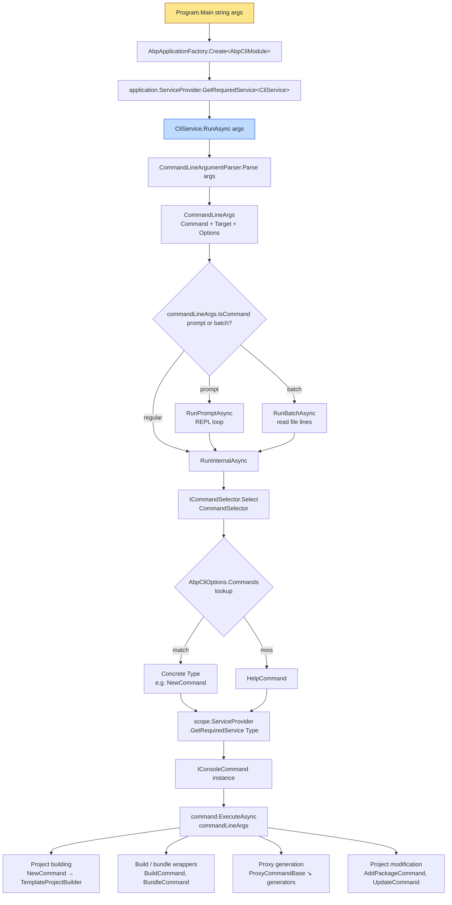

The **ABP CLI** is the `abp` global .NET tool. Internally it is two packages: a thin host (`Volo.Abp.Cli`) that wires up Serilog, Autofac and starts the ABP module system, and a much larger library (`Volo.Abp.Cli.Core`) that contains every command, every project-building step and every service-proxy generator. This page is the entry point to the CLI section of the docs. Subsequent pages dissect the entry point, the command dispatch table, and each command family.

<Info>
Source code: [`framework/src/Volo.Abp.Cli/`](https://github.com/abpframework/abp/tree/dev/framework/src/Volo.Abp.Cli) (host) and [`framework/src/Volo.Abp.Cli.Core/`](https://github.com/abpframework/abp/tree/dev/framework/src/Volo.Abp.Cli.Core) (commands, project builder, proxy generators). Installed with `dotnet tool install -g Volo.Abp.Cli`.
</Info>

## Pick your starting point

<CardGroup cols={2}>
  <Card title="Architecture & bootstrap" icon="diagram-project" href="/cli/architecture">
    `Program.cs`, `AbpCliModule`, `AbpCliCoreModule`, `CliService.RunAsync`, `CommandLineArgumentParser`, the path/URL constants under `CliConsts` / `CliUrls` / `CliPaths`.
  </Card>
  <Card title="Command dispatch" icon="route" href="/cli/command-selector">
    `CommandSelector`, `ICommandSelector`, `IConsoleCommand`, the registration in `AbpCliCoreModule.ConfigureServices`, and a table of every command class in `Volo/Abp/Cli/Commands/`.
  </Card>
  <Card title="abp new" icon="plus" href="/cli/new-command">
    `NewCommand`, `ProjectCreationCommandBase`, the `-t / -u / -d / -m` flag matrix and how `TemplateProjectBuilder` produces a zip.
  </Card>
  <Card title="abp build / bundle / clean" icon="hammer" href="/cli/build-bundle-clean">
    `BuildCommand`, `BundleCommand`, `CleanCommand`. The `dotnet build` wrapper for multi-repo builds and the Blazor WASM bundler.
  </Card>
  <Card title="abp install-libs / add-package / add-module" icon="box" href="/cli/install-libs-and-add-package">
    `InstallLibsCommand`, `AddPackageCommand`, `AddModuleCommand`. `libs.config` resource mappings and NuGet/NPM package addition.
  </Card>
  <Card title="abp generate-proxy / remove-proxy" icon="code" href="/cli/proxy-and-generate-proxy">
    `GenerateProxyCommand`, `RemoveProxyCommand`, `ProxyCommandBase`, the three generators (CSharp / NG / JS) and the `/api/abp/api-definition` contract.
  </Card>
  <Card title="abp login / logout / translate" icon="key" href="/cli/login-logout-translate">
    `LoginCommand`, `LogoutCommand`, `LoginInfoCommand`, `TranslateCommand`. `AuthService` device-code login against `account.abp.io`.
  </Card>
  <Card title="abp switch-to-* / update / suite" icon="arrows-rotate" href="/cli/version-switch-commands">
    Channel switchers, the `update` command, `suite`, `prompt`, `help`, `generate-razor-page`, `get-source`, `list-templates`, `list-modules`.
  </Card>
  <Card title="Project building pipeline" icon="bars-staggered" href="/cli/project-building">
    `framework/src/Volo.Abp.Cli.Core/Volo/Abp/Cli/ProjectBuilding/` — template downloading, `ProjectBuildPipeline`, the `Steps/` that rename, retarget the DBMS and randomize ports.
  </Card>
  <Card title="Project modification" icon="screwdriver-wrench" href="/cli/project-modification">
    `framework/src/Volo.Abp.Cli.Core/Volo/Abp/Cli/ProjectModification/` — `SolutionFileModifier`, `ProjectFinder`, `ProjectNugetPackageAdder`, `VoloNugetPackagesVersionUpdater`, `PackagePreviewSwitcher`.
  </Card>
  <Card title="Service proxying" icon="network-wired" href="/cli/service-proxying">
    `framework/src/Volo.Abp.Cli.Core/Volo/Abp/Cli/ServiceProxying/` — the C# `ClientProxyBase` generator, the Angular schematics wrapper and the JavaScript jQuery proxy generator.
  </Card>
  <Card title="Templates catalogue" icon="folder-tree" href="/templates/overview">
    The templates the CLI installs. Each page lists the projects, the conditional markers and the configuration the CLI flips on or off.
  </Card>
</CardGroup>

## The 10-second model

When you type `abp new Acme.Bookstore -u angular -d mongodb`, three things happen in order:

1. The host process (`Volo.Abp.Cli/Program.cs`) bootstraps an ABP application with `AbpCliModule` and resolves `CliService`.
2. `CliService.RunAsync(args)` hands the raw `string[]` to `CommandLineArgumentParser`, gets back a strongly typed `CommandLineArgs`, then asks `ICommandSelector` to pick the right `IConsoleCommand` type.
3. The selected command (`NewCommand` here) is resolved from the container, gets `ExecuteAsync(commandLineArgs)` called on it, and runs the full project-creation pipeline.



Every command on the right edge of that diagram is just a class that implements `IConsoleCommand`:

```csharp framework/src/Volo.Abp.Cli.Core/Volo/Abp/Cli/Commands/IConsoleCommand.cs
public interface IConsoleCommand
{
    Task ExecuteAsync(CommandLineArgs commandLineArgs);

    string GetUsageInfo();
}
```

…and the selector is the simplest possible dictionary lookup:

```csharp framework/src/Volo.Abp.Cli.Core/Volo/Abp/Cli/Commands/CommandSelector.cs
public Type Select(CommandLineArgs commandLineArgs)
{
    if (commandLineArgs.Command.IsNullOrWhiteSpace())
    {
        return typeof(HelpCommand);
    }

    return Options.Commands.GetOrDefault(commandLineArgs.Command)
           ?? typeof(HelpCommand);
}
```

That keeps the surface easy: to add a command you implement `IConsoleCommand` and register it in [`AbpCliCoreModule.ConfigureServices`](/cli/architecture#abpclicoremodule--the-wiring). The selector picks it up by string key.

## Folder map of `Volo.Abp.Cli.Core`

```text
framework/src/Volo.Abp.Cli.Core/Volo/Abp/Cli/
├── AbpCliCoreModule.cs        # registers Commands + ServiceProxy generators
├── AbpCliOptions.cs           # Dictionary<string, Type> Commands
├── CliConsts.cs               # well-known names (HttpClient, LicenseCodePlaceHolder, …)
├── CliUrls.cs                 # abp.io / account.abp.io / nuget.abp.io endpoints
├── CliPaths.cs                # ~/.abp paths (cli, templates, build, logs, access-token)
├── CliService.cs              # entry-point service used by Program.cs
├── CliUsageException.cs       # printed to console as a warning, exit code 1
├── Args/                      # CommandLineArgs + parser
├── Auth/                      # AuthService, LoginInfo, IAuthService
├── Build/                     # multi-repo dotnet build wrapper (BuildCommand backs onto this)
├── Bundling/                  # Blazor WASM bundler (BundleCommand backs onto this)
├── Commands/                  # IConsoleCommand implementations
│   ├── Internal/              # commands hidden from help (e.g. RecreateInitialMigrationCommand)
│   ├── Services/              # support services (ConnectionStringProvider, InitialMigrationCreator, …)
│   └── Templates/             # ListTemplatesCommand DTOs
├── Configuration/             # IConfigReader for libs.config / wwwroot config
├── GitHub/                    # GitHub release download helpers
├── Http/                      # CliHttpClientFactory, CliHttpClientHandler (adds bearer token)
├── LIbs/                      # InstallLibsService, ResourceMapping, FileMatchResult
├── Licensing/                 # IApiKeyService
├── Memory/                    # MemoryService — persisted KV store for tool memory
├── ProjectBuilding/           # template download + pipeline (Templates/, Building/, Files/, Events/)
├── ProjectModification/       # add/update/switch package operations on existing solutions
├── ServiceProxying/           # CSharp / Angular / JavaScript proxy generators
├── Utils/                     # CmdHelper, NpmHelper, NamespaceHelper, …
└── Version/                   # CliVersionService, PackageVersionCheckerService, LatestVersionInfo
```

The shape repeats: a `Command` in `Commands/` does **only** argument parsing and orchestration; the heavy lifting lives in the sibling folder (`Build/`, `Bundling/`, `LIbs/`, `ProjectBuilding/`, `ProjectModification/`, `ServiceProxying/`).

## What every command page covers

Each command-family page in this section follows the same five-section layout:

| Section | What you'll find |
| --- | --- |
| Entry point | The `Name` constant, the constructor's DI dependencies, the file path. |
| Argument parsing | Which `commandLineArgs.Options` keys are read, what the defaults are, the `Options` static class. |
| Execution flow | The actual `ExecuteAsync` body, broken down step-by-step against the source. |
| Supporting services | The classes the command depends on (e.g. `TemplateProjectBuilder`, `BundlingService`, `AuthService`). |
| Examples & usage | The `GetUsageInfo()` block copy-pasted from source, plus links to the templates / docs the command targets. |

## Cross-references

- [Startup templates catalogue](/templates/overview) — the `.zip` archives that `abp new` downloads and that `TemplateProjectBuilder` unpacks.
- [ASP.NET Core MVC UI packages](/aspnetcore/mvc-ui-packages) — what `abp add-package @abp/...` and `abp install-libs` actually do on the MVC side.
- [Angular generators & schematics](/angular/generators-and-schematics) — the schematics that `AngularServiceProxyGenerator` shells out to (`npx ng g @abp/ng.schematics:proxy-add`).

## When something goes wrong

The CLI logs to two sinks, configured in `Program.cs`:

```csharp framework/src/Volo.Abp.Cli/Volo/Abp/Cli/Program.cs
Log.Logger = new LoggerConfiguration()
    .MinimumLevel.Information()
    .MinimumLevel.Override("Microsoft", LogEventLevel.Warning)
    .MinimumLevel.Override("Volo.Abp", LogEventLevel.Warning)
    .MinimumLevel.Override("System.Net.Http.HttpClient", LogEventLevel.Warning)
    .MinimumLevel.Override("Volo.Abp.IdentityModel", LogEventLevel.Information)
#if DEBUG
    .MinimumLevel.Override("Volo.Abp.Cli", LogEventLevel.Debug)
#else
    .MinimumLevel.Override("Volo.Abp.Cli", LogEventLevel.Information)
#endif
    .Enrich.FromLogContext()
    .WriteTo.File(Path.Combine(CliPaths.Log, "abp-cli-logs.txt"), outputTemplate: loggerOutputTemplate)
    .WriteTo.Console(theme: AnsiConsoleTheme.Sixteen, outputTemplate: loggerOutputTemplate)
    .CreateLogger();
```

The persistent log lives at `~/.abp/cli/logs/abp-cli-logs.txt` (`CliPaths.Log`). When a command throws a `CliUsageException` the message is printed as a warning and the process exits with code `1`; any other exception is rethrown after being logged so it surfaces with a stack trace. This is the policy enforced in `CliService.RunAsync`:

```csharp framework/src/Volo.Abp.Cli.Core/Volo/Abp/Cli/CliService.cs
catch (CliUsageException usageException)
{
    Logger.LogWarning(usageException.Message);
    Environment.ExitCode = 1;
}
catch (Exception ex)
{
    Logger.LogException(ex);
    throw;
}
```

If a command is misbehaving, the right reflex is:

1. Run with `--skip-cli-version-check` to bypass the periodic version-check call (`CliService.CheckCliVersionAsync`).
2. Tail `~/.abp/cli/logs/abp-cli-logs.txt`.
3. Re-run with the explicit argument (e.g. `abp help new` calls [`HelpCommand`](/cli/version-switch-commands#helpcommand) which reflects on the command type and prints `GetUsageInfo()`).

## Cheat sheet — the most common commands

The day-to-day commands you'll reach for, with the page where the implementation is dissected:

| Command | What it does | Page |
| --- | --- | --- |
| `abp new <name>` | Create a new ABP solution from a template. | [new-command](/cli/new-command) |
| `abp build` | Multi-repo or single-solution `dotnet build` wrapper. | [build-bundle-clean](/cli/build-bundle-clean) |
| `abp bundle` | Refresh Blazor WASM / MAUI Blazor static asset bundle. | [build-bundle-clean](/cli/build-bundle-clean) |
| `abp clean` | `dotnet clean` + remove `bin`/`obj` folders. | [build-bundle-clean](/cli/build-bundle-clean) |
| `abp install-libs` | Apply `abp.resourcemapping.js` files into `wwwroot/libs/`. | [install-libs-and-add-package](/cli/install-libs-and-add-package) |
| `abp add-package <id>` | Add a NuGet/NPM package + wire `[DependsOn]`. | [install-libs-and-add-package](/cli/install-libs-and-add-package) |
| `abp add-module <id>` | Add every package of a multi-package module to the right projects. | [install-libs-and-add-package](/cli/install-libs-and-add-package) |
| `abp generate-proxy -t {csharp,ng,js}` | Generate client proxies from `/api/abp/api-definition`. | [proxy-and-generate-proxy](/cli/proxy-and-generate-proxy) |
| `abp remove-proxy -t ...` | Delete generated proxies. | [proxy-and-generate-proxy](/cli/proxy-and-generate-proxy) |
| `abp login <user>` | OAuth login at `account.abp.io`. | [login-logout-translate](/cli/login-logout-translate) |
| `abp logout` | Sign out + delete `~/.abp/cli/access-token.bin`. | [login-logout-translate](/cli/login-logout-translate) |
| `abp login-info` | Print currently signed-in account. | [login-logout-translate](/cli/login-logout-translate) |
| `abp translate -c <culture>` | Generate or apply an `abp-translation.json` diff. | [login-logout-translate](/cli/login-logout-translate) |
| `abp update` | Update every `Volo.Abp.*` NuGet and `@abp/*` npm package. | [version-switch-commands](/cli/version-switch-commands#updatecommand) |
| `abp switch-to-{stable,preview,nightly,prerc,local}` | Move all package references to a channel (or local refs). | [version-switch-commands](/cli/version-switch-commands#channel-switchers) |
| `abp list-templates` / `abp list-modules` | Enumerate templates / modules from abp.io. | [version-switch-commands](/cli/version-switch-commands#listtemplatescommand) |
| `abp get-source <module>` | Download a module's source code. | [version-switch-commands](/cli/version-switch-commands#getsourcecommand) |
| `abp clear-download-cache` | Wipe `~/.abp/templates/*.zip`. | [version-switch-commands](/cli/version-switch-commands) |
| `abp suite` | Install / update / launch ABP Suite. | [version-switch-commands](/cli/version-switch-commands#suitecommand) |
| `abp prompt` | Enter an interactive REPL. | [version-switch-commands](/cli/version-switch-commands#promptcommand) |
| `abp help <cmd>` | Print a command's usage block (reflected from `IConsoleCommand.GetUsageInfo`). | [command-selector](/cli/command-selector#helpcommand) |

## Installation reminder

The CLI is distributed as a global .NET tool. Install / update:

```bash
dotnet tool install -g Volo.Abp.Cli
dotnet tool update  -g Volo.Abp.Cli
```

For prerelease channels (used by `switch-to-preview` etc.):

```bash
dotnet tool install -g Volo.Abp.Cli --version 8.x.x-rc.1
dotnet tool install -g Volo.Abp.Cli \
  --add-source https://www.myget.org/F/abp-nightly/api/v3/index.json \
  --version 8.x.x-preview.x
```

These exact commands are what `CliService.LogNewVersionInfo` prints when it detects a new release — see [architecture](/cli/architecture#cliservicerunasync--the-entry-method).

## How options are read

Most commands share three patterns. Knowing them makes every command's source easy to skim:

- `commandLineArgs.Target` is the **first positional** argument (project name, package id, module name). It's `null` if the first thing on the command line started with `-`.
- `commandLineArgs.Options.GetOrNull(Options.X.Short, Options.X.Long)` reads `-x value` or `--xxx value`. The `Options.X` static class always lives nested inside the command.
- `commandLineArgs.Options.ContainsKey(Options.Y.Long)` detects bare flags (`--preview`, `--no-ui`, `--skip-installing-libs`).

Every `XxxCommand.Options.*.{Short,Long}` constant is the **canonical** way to read flags — it keeps short/long synonyms in sync. If you fork a command, copy the nested `Options` class so the help block matches the actual parsing.

## Tips & gotchas

<Tip>
- `abp prompt` lets you keep the JIT-warm CLI in memory between commands. Useful when generating many proxies in a row.
- `abp batch <file>` runs each non-comment line as an `abp …` invocation. Combine with `prompt` for quick scripting.
- The Serilog log at `~/.abp/cli/logs/abp-cli-logs.txt` is rolled per day; tail it with `tail -f` when a command is hanging.
- Pass `--skip-cli-version-check` in CI to skip the daily NuGet probe.
- `abp login --device` uses an OAuth device code instead of password grant; works with 2FA-enabled accounts.
- Every `abp generate-proxy` run rewrites the `.Generated.cs`. Customisations belong in the empty partial — never the `*.Generated.cs` file.
</Tip>

## Extending the CLI

Three extension points cover the majority of use cases:

1. **Add a command.** Implement `IConsoleCommand + ITransientDependency` in a module that depends on `AbpCliCoreModule`, and register it inside `ConfigureServices`:

   ```csharp
   Configure<AbpCliOptions>(options =>
   {
       options.Commands[MyNewCommand.Name] = typeof(MyNewCommand);
   });
   ```

   The `CommandSelector` picks it up via dictionary lookup — no reflection needed. See [command-selector](/cli/command-selector#adding-a-new-command).

2. **Add a service-proxy generator.** Implement `IServiceProxyGenerator` (or derive from `ServiceProxyGeneratorBase<T>`) and register the type in `AbpCliServiceProxyOptions.Generators`:

   ```csharp
   Configure<AbpCliServiceProxyOptions>(options =>
   {
       options.Generators["MYTARGET"] = typeof(MyTargetProxyGenerator);
   });
   ```

   Users then run `abp generate-proxy -t mytarget`. See [service-proxying](/cli/service-proxying#adding-a-new-target).

3. **Add a pipeline step to a template.** Templates expose `GetCustomSteps(ProjectBuildContext context)` — return your `ProjectBuildPipelineStep` instances and they execute in declaration order inside the project-building pipeline. See [project-building](/cli/project-building#stage-2--pipeline-construction).

For deeper customisation you can swap entire services (`ICommandSelector`, `ISourceCodeStore`, `IBundlingService`, `IDotNetProjectBuilder`, `IAuthService`, `IServiceProxyGenerator`) by registering an alternative implementation — every one of them is a regular ABP service registered through `ITransientDependency`.

## Next

Continue to [Architecture & bootstrap](/cli/architecture) for a line-by-line walkthrough of how the CLI process starts, or jump to [Command dispatch](/cli/command-selector) for the table of every command class and the dictionary that maps a string like `"new"` to `typeof(NewCommand)`.
