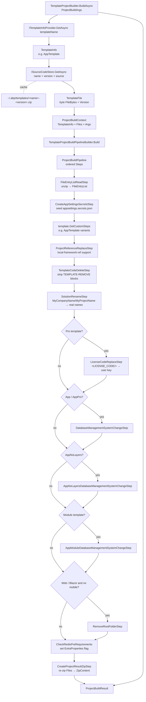

The `ProjectBuilding/` folder is the engine behind [`abp new`](/cli/new-command), [`abp get-source`](/cli/version-switch-commands#getsourcecommand) and `abp add-module --new`. Its job is conceptually simple: given a *template name + flags*, produce a *zip* containing the rewritten solution. Internally it is a three-stage pipeline (download → transform → emit) where the transform stage is a chain of [`ProjectBuildPipelineStep`](https://github.com/abpframework/abp/blob/dev/framework/src/Volo.Abp.Cli.Core/Volo/Abp/Cli/ProjectBuilding/Building/ProjectBuildPipelineStep.cs) instances chosen per template.

<Info>
Source root: [`framework/src/Volo.Abp.Cli.Core/Volo/Abp/Cli/ProjectBuilding/`](https://github.com/abpframework/abp/tree/dev/framework/src/Volo.Abp.Cli.Core/Volo/Abp/Cli/ProjectBuilding).
</Info>

## Folder layout

```text
ProjectBuilding/
├── AbpIoSourceCodeStore.cs            # downloads template zips from abp.io / GitHub raw
├── ModuleProjectBuilder.cs            # builds modules (get-source)
├── NpmPackageProjectBuilder.cs        # builds npm-shaped templates
├── NugetPackageProjectBuilder.cs      # builds nuget-package-shaped templates
├── TemplateProjectBuilder.cs          # main builder used by abp new
├── ProjectBuildArgs.cs                # flag → typed args (database, ui, mobile, theme, …)
├── ProjectBuildResult.cs              # { byte[] ZipContent, string ProjectName }
├── ITemplateInfoProvider.cs           # template registry
├── TemplateInfoProvider.cs            # default implementation
├── SolutionName.cs                    # parses "Acme.BookStore" → Company + Project
├── SourceCodeTypes.cs                 # enum: Template / Module / Nuget / Npm
├── TemplateFile.cs                    # { byte[] FileBytes, string Version }
├── Analyticses/                       # anonymous build event reporter
├── Building/                          # ProjectBuildPipeline + Steps/
├── Events/                            # ProjectCreationProgressEvent etc
├── Files/                             # FileEntry, FileEntryList
└── Templates/                         # one folder per template family
    ├── App/                           # AppTemplate, AppProTemplate, AppNoLayersTemplate, …
    ├── Console/
    ├── Maui/
    ├── Microservice/
    ├── Module/
    ├── Wpf/
    ├── TemplateProjectRenameStep.cs
    ├── TemplateRandomSslPortStep.cs
    ├── UpdateNuGetConfigStep.cs
    ├── MicroserviceServiceStringEncryptionStep.cs
    ├── RandomizeAuthServerPassPhraseStep.cs
    ├── RandomizeStringEncryptionStep.cs
    └── RemoveUnnecessaryPortsStep.cs
```

## The high-level flow



Each step is small, independently testable, and operates on the same `ProjectBuildContext` object — most importantly its `FileEntryList Files`. Steps that need access to the args read `context.BuildArgs`.

## `TemplateProjectBuilder.BuildAsync` — the orchestrator

```csharp framework/src/Volo.Abp.Cli.Core/Volo/Abp/Cli/ProjectBuilding/TemplateProjectBuilder.cs
public async Task<ProjectBuildResult> BuildAsync(ProjectBuildArgs args)
{
    var templateInfo = await GetTemplateInfoAsync(args);

    NormalizeArgs(args, templateInfo);

    await EventBus.PublishAsync(new ProjectCreationProgressEvent {
        Message = "Downloading the solution template"
    }, false);

    var templateFile = await SourceCodeStore.GetAsync(
        args.TemplateName,
        SourceCodeTypes.Template,
        args.Version,
        args.TemplateSource,
        args.ExtraProperties.ContainsKey(NewCommand.Options.Preview.Long),
        trustUserVersion: args.TrustUserVersion
    );

    ConfigureThemeOptions(args, templateFile.Version);

    // ... license / api-key resolution ...

    var context = new ProjectBuildContext(
        templateInfo,
        null,
        null,
        null,
        templateFile,
        args
    );

    if (context.Template is AppTemplateBase appTemplateBase)
    {
        appTemplateBase.HasDbMigrations = SemanticVersion.Parse(templateFile.Version) < new SemanticVersion(4, 3, 99);
    }

    await EventBus.PublishAsync(new ProjectCreationProgressEvent {
        Message = "Customizing the solution template"
    }, false);

    TemplateProjectBuildPipelineBuilder.Build(context).Execute();

    // ... analytics ...

    return new ProjectBuildResult(context.Result.ZipContent, args.SolutionName.ProjectName);
}
```

`NormalizeArgs` fills in defaults from the resolved `TemplateInfo` (default DBMS, default UI). The local-event-bus messages exist so Studio/IDE integrations can show progress in their UI.

## Stage 1 — Template downloading (`ISourceCodeStore`)

`AbpIoSourceCodeStore` is the default implementation. It is responsible for:

1. Looking the version up if `args.Version` is null (queries `https://raw.githubusercontent.com/abpframework/abp/dev/latest-versions.json` for the latest matching the channel).
2. Honouring `args.TemplateSource` if set — that path overrides any remote download (so `abp new ... -ts D:\my-template-fork` works).
3. Checking `CliPaths.TemplateCache` for a previously downloaded zip with the same name/version (skips when `args.SkipCache` is true or `AbpCliOptions.CacheTemplates` is false).
4. Downloading the zip — pro templates come from `nuget.abp.io` (the bearer token added by `CliHttpClientHandler`); open-source templates come from `https://github.com/abpframework/abp/releases/...` and `nuget.abp.io` for some packaged ones.
5. Wrapping the bytes in a `TemplateFile`.

```csharp framework/src/Volo.Abp.Cli.Core/Volo/Abp/Cli/ProjectBuilding/AbpIoSourceCodeStore.cs
public class AbpIoSourceCodeStore : ISourceCodeStore, ITransientDependency
{
    public ILogger<AbpIoSourceCodeStore> Logger { get; set; }

    protected AbpCliOptions Options { get; }
    protected IJsonSerializer JsonSerializer { get; }
    protected IRemoteServiceExceptionHandler RemoteServiceExceptionHandler { get; }
    protected ICancellationTokenProvider CancellationTokenProvider { get; }

    private readonly CliHttpClientFactory _cliHttpClientFactory;
    protected CliVersionService CliVersionService { get; }
    // ...
    public async Task<TemplateFile> GetAsync(
        string name,
        SourceCodeTypes type,
        string version = null,
        string templateSource = null,
        bool includePreReleases = false,
        bool trustUserVersion = false)
    {
        // ...
    }
}
```

`SourceCodeTypes` selects between `Template`, `Module`, `Nuget`, and `Npm` — the same store services every download path the CLI needs.

## Stage 2 — Pipeline construction

```csharp framework/src/Volo.Abp.Cli.Core/Volo/Abp/Cli/ProjectBuilding/Building/TemplateProjectBuildPipelineBuilder.cs
public static class TemplateProjectBuildPipelineBuilder
{
    public static ProjectBuildPipeline Build(ProjectBuildContext context)
    {
        var pipeline = new ProjectBuildPipeline(context);

        pipeline.Steps.Add(new FileEntryListReadStep());

        if (SemanticVersion.Parse(context.TemplateFile.Version) > new SemanticVersion(4, 3, 99))
        {
            pipeline.Steps.Add(new CreateAppSettingsSecretsStep());
        }

        pipeline.Steps.AddRange(context.Template.GetCustomSteps(context));

        pipeline.Steps.Add(new ProjectReferenceReplaceStep());
        pipeline.Steps.Add(new TemplateCodeDeleteStep());
        pipeline.Steps.Add(new SolutionRenameStep());

        if (context.Template.IsPro())
        {
            pipeline.Steps.Add(new LicenseCodeReplaceStep()); // todo: move to custom steps?
        }

        if (context.Template.Name == AppTemplate.TemplateName ||
            context.Template.Name == AppProTemplate.TemplateName)
        {
            pipeline.Steps.Add(new DatabaseManagementSystemChangeStep(context.Template.As<AppTemplateBase>().HasDbMigrations));
        }

        if (context.Template.Name == AppNoLayersTemplate.TemplateName ||
            context.Template.Name == AppNoLayersProTemplate.TemplateName)
        {
            pipeline.Steps.Add(new AppNoLayersDatabaseManagementSystemChangeStep());
        }

        if (context.Template.Name == ModuleTemplate.TemplateName ||
            context.Template.Name == ModuleProTemplate.TemplateName)
        {
            pipeline.Steps.Add(new AppModuleDatabaseManagementSystemChangeStep());
        }

        if ((context.BuildArgs.UiFramework == UiFramework.Mvc || context.BuildArgs.UiFramework == UiFramework.Blazor || context.BuildArgs.UiFramework == UiFramework.BlazorServer || context.BuildArgs.UiFramework == UiFramework.BlazorWebApp)
            && context.BuildArgs.MobileApp == MobileApp.None && context.Template.Name != MicroserviceProTemplate.TemplateName
            && context.Template.Name != MicroserviceServiceProTemplate.TemplateName)
        {
            pipeline.Steps.Add(new RemoveRootFolderStep());
        }

        pipeline.Steps.Add(new CheckRedisPreRequirements());

        pipeline.Steps.Add(new CreateProjectResultZipStep());

        return pipeline;
    }
}
```

The steps fall into three groups:

1. **Read** the input zip into a `FileEntryList`.
2. **Transform** through generic-then-template-specific steps.
3. **Re-zip** into `context.Result.ZipContent`.

`context.Template.GetCustomSteps(context)` is where each template family contributes its own steps. For example, `AppTemplate.GetCustomSteps` adds `TemplateProjectRenameStep`, `TemplateRandomSslPortStep`, `ConnectionStringChangeStep`, `ChangeThemeStep` etc., bookended by removal steps that drop projects for UI/database choices the user didn't pick.

## Stage 3 — `ProjectBuildPipeline.Execute`

```csharp framework/src/Volo.Abp.Cli.Core/Volo/Abp/Cli/ProjectBuilding/Building/ProjectBuildPipeline.cs
public class ProjectBuildPipeline
{
    public ProjectBuildContext Context { get; }

    public List<ProjectBuildPipelineStep> Steps { get; }

    public ProjectBuildPipeline(ProjectBuildContext context)
    {
        Context = context;
        Steps = new List<ProjectBuildPipelineStep>();
    }

    public void Execute()
    {
        foreach (var step in Steps)
        {
            step.Execute(Context);
        }
    }
}
```

Steps run **in declaration order**. Each step has full read/write access to `context.Files`. There is no rollback — if a step throws, the pipeline aborts and the in-progress files are discarded.

## The shared context

```csharp framework/src/Volo.Abp.Cli.Core/Volo/Abp/Cli/ProjectBuilding/Building/ProjectBuildContext.cs
public class ProjectBuildContext
{
    [NotNull]
    public TemplateFile TemplateFile { get; }

    [NotNull]
    public ProjectBuildArgs BuildArgs { get; }

    public TemplateInfo Template { get; }

    public ModuleInfo Module { get; }

    public NugetPackageInfo NugetPackage { get; }

    public NpmPackageInfo NpmPackage { get; }

    public FileEntryList Files { get; set; }

    public ProjectResult Result { get; set; }

    public List<string> Symbols { get; } //TODO: Fill the symbols, like "UI-Angular", "CMS-KIT"!
    // ...
}
```

The `Symbols` collection is reserved for future conditional logic (e.g. `<TEMPLATE-IF SYMBOL='UI-Angular'>`). At the time of writing it is populated but not yet consumed by any step.

## `FileEntry` — the in-memory file model

```csharp framework/src/Volo.Abp.Cli.Core/Volo/Abp/Cli/ProjectBuilding/Files/FileEntry.cs
public class FileEntry
{
    private static string[] BinaryFileExtensions = {
            ".exe", ".dll", ".bin",
            ".suo", ".obj", ".pdb",
            ".png", "jpg", "jpeg", ".ico"
            ,".woff", ".woff2", ".eot", ".svg", ".ttf"
        };

    public string Name { get; private set; }

    public bool IsDirectory { get; }

    public Encoding Encoding { get; }

    public byte[] Bytes { get; private set; }

    public string Content { get; private set; }

    public bool IsBinaryFile { get; private set; }

    public FileEntry(string name, byte[] bytes, bool isDirectory)
    {
        Name = name;
        Bytes = bytes;
        IsDirectory = isDirectory;

        Encoding = CalculateEncoding();
        Content = GetContent();
        IsBinaryFile = CalculateIsBinaryFile();
    }
    // ...
}
```

Two faces:

- **Text files** expose `Content` (string). Steps mutate text by calling `entry.ReplaceText(old, new)` or `entry.SetContent(string)` — these methods re-encode and update `Bytes`.
- **Binary files** (matched against `BinaryFileExtensions`) get `Content == null` and are passed through verbatim.

`FileEntryList` is a thin `List<FileEntry>` wrapper with helpers like `FindAll`, `FindEndsWith`, `RemoveAll`, `AddDirectory`. Most steps use those helpers rather than enumerating manually.

## Concrete step examples

### `FileEntryListReadStep` — unzip into memory

```csharp framework/src/Volo.Abp.Cli.Core/Volo/Abp/Cli/ProjectBuilding/Building/Steps/FileEntryListReadStep.cs
public class FileEntryListReadStep : ProjectBuildPipelineStep
{
    public override void Execute(ProjectBuildContext context)
    {
        context.Files = GetEntriesFromZipFile(context.TemplateFile.FileBytes);
    }

    private static FileEntryList GetEntriesFromZipFile(byte[] fileBytes)
    {
        var fileEntries = new List<FileEntry>();

        using (var memoryStream = new MemoryStream(fileBytes))
        {
            using (var zipInputStream = new ZipInputStream(memoryStream))
            {
                var zipEntry = zipInputStream.GetNextEntry();
                while (zipEntry != null)
                {
                    var buffer = new byte[4096];

                    using (var fileEntryMemoryStream = new MemoryStream())
                    {
                        StreamUtils.Copy(zipInputStream, fileEntryMemoryStream, buffer);
                        fileEntries.Add(new FileEntry(zipEntry.Name.EnsureStartsWith('/'), fileEntryMemoryStream.ToArray(), zipEntry.IsDirectory));
                    }

                    zipEntry = zipInputStream.GetNextEntry();
                }
            }

            return new FileEntryList(fileEntries);
        }
    }
}
```

Uses `ICSharpCode.SharpZipLib` so the same code path works on Windows / Linux / macOS without depending on `System.IO.Compression`'s creation date defaults.

### `TemplateProjectRenameStep` — `MyCompanyName` / `MyProjectName` → user values

```csharp framework/src/Volo.Abp.Cli.Core/Volo/Abp/Cli/ProjectBuilding/Templates/TemplateProjectRenameStep.cs
public class TemplateProjectRenameStep : ProjectBuildPipelineStep
{
    private readonly string _oldProjectName;
    private readonly string _newProjectName;

    public TemplateProjectRenameStep(
        string oldProjectName,
        string newProjectName)
    {
        _oldProjectName = oldProjectName;
        _newProjectName = newProjectName;
    }

    public override void Execute(ProjectBuildContext context)
    {
        RenameHelper.RenameAll(context.Files, _oldProjectName, _newProjectName);
    }
}
```

`RenameHelper.RenameAll` does both **file content** replacement and **file/directory name** replacement. This is the step that turns `MyCompanyName.MyProjectName.Application.csproj` into `Acme.BookStore.Application.csproj` and updates every internal reference.

### `SolutionRenameStep` — `.sln` / `.slnx` rewrite

```csharp framework/src/Volo.Abp.Cli.Core/Volo/Abp/Cli/ProjectBuilding/Building/Steps/SolutionRenameStep.cs
public class SolutionRenameStep : ProjectBuildPipelineStep
{
    public override void Execute(ProjectBuildContext context)
    {
        if (MicroserviceServiceTemplateBase.IsMicroserviceServiceTemplate(context.BuildArgs.TemplateName))
        {
            new SolutionRenamer(
                context.Files,
                "MyCompanyName.MyProjectName",
                "MicroserviceName",
                context.BuildArgs.SolutionName.CompanyName,
                context.BuildArgs.SolutionName.ProjectName
            ).Run();
            // ... three more SolutionRenamer instances for the microservice case ...
        }
        else
        {
            new SolutionRenamer(
                context.Files,
                "MyCompanyName",
                "MyProjectName",
                context.BuildArgs.SolutionName.CompanyName,
                context.BuildArgs.SolutionName.ProjectName
            ).Run();
        }
    }
}
```

The microservice path runs four renamers because microservice templates carry both `MicroserviceName` placeholders (for the individual service) and `MyCompanyName.MyProjectName` (for the parent solution).

### `DatabaseManagementSystemChangeStep` — retarget EF Core

```csharp framework/src/Volo.Abp.Cli.Core/Volo/Abp/Cli/ProjectBuilding/Building/Steps/DatabaseManagementSystemChangeStep.cs
public override void Execute(ProjectBuildContext context)
{
    switch (context.BuildArgs.DatabaseManagementSystem)
    {
        case DatabaseManagementSystem.MySQL:
            ChangeEntityFrameworkCoreDependency(context, "Volo.Abp.EntityFrameworkCore.MySQL",
                "Volo.Abp.EntityFrameworkCore.MySQL",
                "AbpEntityFrameworkCoreMySQLModule");
            AddMySqlServerVersion(context);
            ChangeUseSqlServer(context, "UseMySQL", "UseMySql");
            break;

        case DatabaseManagementSystem.PostgreSQL:
            ChangeEntityFrameworkCoreDependency(context, "Volo.Abp.EntityFrameworkCore.PostgreSql",
                "Volo.Abp.EntityFrameworkCore.PostgreSql",
                "AbpEntityFrameworkCorePostgreSqlModule");
            ChangeUseSqlServer(context, "UseNpgsql");
            break;

        case DatabaseManagementSystem.Oracle:
            ChangeEntityFrameworkCoreDependency(context, "Volo.Abp.EntityFrameworkCore.Oracle",
                "Volo.Abp.EntityFrameworkCore.Oracle",
                "AbpEntityFrameworkCoreOracleModule");
            AdjustOracleDbContextOptionsBuilder(context);
            ChangeUseSqlServer(context, "UseOracle");
            break;

        case DatabaseManagementSystem.OracleDevart:
            // ...
            break;

        case DatabaseManagementSystem.SQLite:
            ChangeEntityFrameworkCoreDependency(context, "Volo.Abp.EntityFrameworkCore.Sqlite",
                "Volo.Abp.EntityFrameworkCore.Sqlite",
                "AbpEntityFrameworkCoreSqliteModule");
            ChangeUseSqlServer(context, "UseSqlite");
            break;

        default:
            return;
    }
    // ...
}
```

Three transformations per case:

1. Swap the EF Core package reference (`<PackageReference Include="Volo.Abp.EntityFrameworkCore.SqlServer" />` → `…MySQL`).
2. Swap the `[DependsOn(typeof(AbpEntityFrameworkCoreSqlServerModule))]` attribute on the EF module class.
3. Swap the `options.UseSqlServer()` call (or the equivalent) in `DbContext` configuration.

For MySQL the step also injects a `MySqlServerVersion(...)` line because the Pomelo driver needs it. For Oracle it adjusts the `DbContextOptionsBuilder` extension shape.

### `ConnectionStringChangeStep` — JSON edit

```csharp framework/src/Volo.Abp.Cli.Core/Volo/Abp/Cli/ProjectBuilding/Building/Steps/ConnectionStringChangeStep.cs
public override void Execute(ProjectBuildContext context)
{
    var appSettingsJsonFiles = context.Files.Where(f =>
        f.Name.EndsWith("appsettings.json", StringComparison.OrdinalIgnoreCase))
        .ToArray();

    if (!appSettingsJsonFiles.Any())
    {
        return;
    }

    var newConnectionString = $"\"{DefaultConnectionStringKey}\": \"{context.BuildArgs.ConnectionString.Replace(@"\\", @"\").Replace(@"\", @"\\")}\"";

    foreach (var appSettingsJson in appSettingsJsonFiles)
    {
        try
        {
            var appSettingJsonContentWithoutBom = StringHelper.ConvertFromBytesWithoutBom(appSettingsJson.Bytes);
            var jsonObject = JObject.Parse(appSettingJsonContentWithoutBom);

            var connectionStringContainer = (JContainer)jsonObject?["ConnectionStrings"];
            if (connectionStringContainer == null)
            {
                continue;
            }

            if (!connectionStringContainer.Any())
            {
                continue;
            }

            var connectionStrings = connectionStringContainer.ToList();

            foreach (var connectionString in connectionStrings)
            {
                var property = ((JProperty)connectionString);
                var connectionStringName = property.Name;

                if (connectionStringName == DefaultConnectionStringKey)
                {
                    var defaultConnectionString = property.ToString();
                    if (defaultConnectionString == null)
                    {
                        continue;
                    }

                    appSettingsJson.ReplaceText(defaultConnectionString, newConnectionString);
                    break;
                }
            }
        }
        catch
        {
            // continue
        }
    }
}
```

Note the **textual** replace (`ReplaceText`) rather than re-serialising the JSON — this preserves comments and formatting in `appsettings.json`.

### `CreateProjectResultZipStep` — emit

```csharp framework/src/Volo.Abp.Cli.Core/Volo/Abp/Cli/ProjectBuilding/Building/Steps/CreateProjectResultZipStep.cs
public class CreateProjectResultZipStep : ProjectBuildPipelineStep
{
    public override void Execute(ProjectBuildContext context)
    {
        context.Result.ZipContent = CreateZipFileFromEntries(context.Files);
    }

    private static byte[] CreateZipFileFromEntries(FileEntryList entries)
    {
        using (var memoryStream = new MemoryStream())
        {
            using (var zipOutputStream = new ZipOutputStream(memoryStream))
            {
                zipOutputStream.SetLevel(3);

                foreach (var entry in entries)
                {
                    zipOutputStream.PutNextEntry(new ZipEntry(entry.Name)
                    {
                        Size = entry.Bytes.Length
                    });
                    zipOutputStream.Write(entry.Bytes, 0, entry.Bytes.Length);
                }

                zipOutputStream.CloseEntry();
                zipOutputStream.IsStreamOwner = false;
            }

            memoryStream.Position = 0;
            return memoryStream.ToArray();
        }
    }
}
```

The final byte array is stuffed into `context.Result.ZipContent`. `NewCommand.ExtractProjectZip` writes it to `args.OutputFolder`.

## Strongly-typed enums

```csharp framework/src/Volo.Abp.Cli.Core/Volo/Abp/Cli/ProjectBuilding/Building/UiFramework.cs
public enum UiFramework
{
    NotSpecified = 0,
    None = 1,
    Mvc = 2,
    Angular = 3,
    Blazor = 4,
    BlazorServer = 5,
    MauiBlazor = 6,
    BlazorWebApp = 7
}
```

```csharp framework/src/Volo.Abp.Cli.Core/Volo/Abp/Cli/ProjectBuilding/Building/DatabaseProvider.cs
public enum DatabaseProvider
{
    NotSpecified = 0,
    EntityFrameworkCore = 1,
    MongoDb = 2
}
```

```csharp framework/src/Volo.Abp.Cli.Core/Volo/Abp/Cli/ProjectBuilding/Building/DatabaseManagementSystem.cs
public enum DatabaseManagementSystem
{
    NotSpecified,
    SQLServer,
    MySQL,
    PostgreSQL,
    Oracle,
    OracleDevart,
    SQLite
}
```

```csharp framework/src/Volo.Abp.Cli.Core/Volo/Abp/Cli/ProjectBuilding/Building/MobileApp.cs
public enum MobileApp
{
    None,
    ReactNative,
    Maui
}

public static class MobileAppExtensions
{
    public static string GetFolderName(this MobileApp mobileApp)
    {
        switch (mobileApp)
        {
            case MobileApp.ReactNative:
                return "react-native";
            case MobileApp.Maui:
                return "MAUI";
        }

        throw new Exception("Mobile app folder name is not set!");
    }
}
```

```csharp framework/src/Volo.Abp.Cli.Core/Volo/Abp/Cli/ProjectBuilding/Building/Theme.cs
public enum Theme : byte
{
    NotSpecified = 0,
    Basic = 1,
    Lepton = 2,
    LeptonXLite = 3,
    LeptonX = 4
}
```

These enums are what `ProjectBuildArgs` carries, and what every step branches on.

## Template families and their custom steps

Each template under `Templates/` is a small subclass of `TemplateInfo` that overrides `GetCustomSteps(context)`:

| Template | Class | Custom steps (excerpt) |
| --- | --- | --- |
| `app` | `AppTemplate` (`AppTemplateBase`) | Project renames, random SSL port, Angular env file rewrites, microservice port adjusters for `--separate-auth-server`, `RemoveUnnecessaryPortsStep`, conditional removal of UI / mobile / DBMigrator projects. |
| `app-pro` | `AppProTemplate` | Same as `app` + theme switcher (LeptonX / Basic). |
| `app-nolayers` | `AppNoLayersTemplate` | `AppNoLayersDatabaseManagementSystemChangeStep`, `AppNoLayersMigrateDatabaseChangeStep`, `AppNoLayersMoveProjectsStep`. |
| `module` | `ModuleTemplate` | `AppModuleDatabaseManagementSystemChangeStep`, host-folder cleanup, theme adders. |
| `console` | `ConsoleTemplate` | Minimal — just project renames. |
| `microservice-pro` | `MicroserviceProTemplate` | Microservice-specific steps under `Templates/Microservice/`. |
| `microservice-service-pro` | `MicroserviceServiceProTemplate` | `MicroserviceServiceStringEncryptionStep`, `MicroserviceServiceRandomPortStep`, four `SolutionRenamer`s in `SolutionRenameStep`. |
| `maui` | `MauiTemplate` | Project renames + secrets seeding. |
| `wpf` | `WpfTemplate` | Project renames + secrets seeding. |

## What `TemplateCodeDeleteStep` does

The templates contain "marker comments" the step understands:

```csharp
//<TEMPLATE-REMOVE>
… code or whole files to drop when this block is hit …
//</TEMPLATE-REMOVE>

//<TEMPLATE-REMOVE IF-NOT='ui:Angular'>
… included only if `-u angular` ...
//</TEMPLATE-REMOVE>
```

`TemplateCodeDeleteStep` walks every text file, evaluates the conditions against `context.BuildArgs`, and deletes the matching ranges. This is how the templates ship a *single* source-of-truth that supports all UI/DB combos without per-flag duplicated source folders.

## Why steps and not Razor templates?

A few reasons:

- **Determinism.** Replacing text in known files is easier to test (and to *diff*) than re-emitting from a template engine.
- **Cross-cutting.** Steps like `DatabaseManagementSystemChangeStep` need to mutate the `.csproj`, the `[DependsOn]` attribute, **and** the `Configure*` call. Razor template syntax doesn't structure that well.
- **Templates are real projects.** Anything in `templates/` builds and tests as a regular ABP solution in CI — there is no template-engine compile step. The pipeline only kicks in at `abp new` time.

## Related

- [`abp new`](/cli/new-command) — the caller.
- [Project modification](/cli/project-modification) — sibling folder for modifying *existing* (post-build) solutions.
- [Startup templates](/templates/overview) — the user-facing catalogue of templates this folder consumes.
- [Service proxying](/cli/service-proxying) — runs against the running solution after `abp new`.
