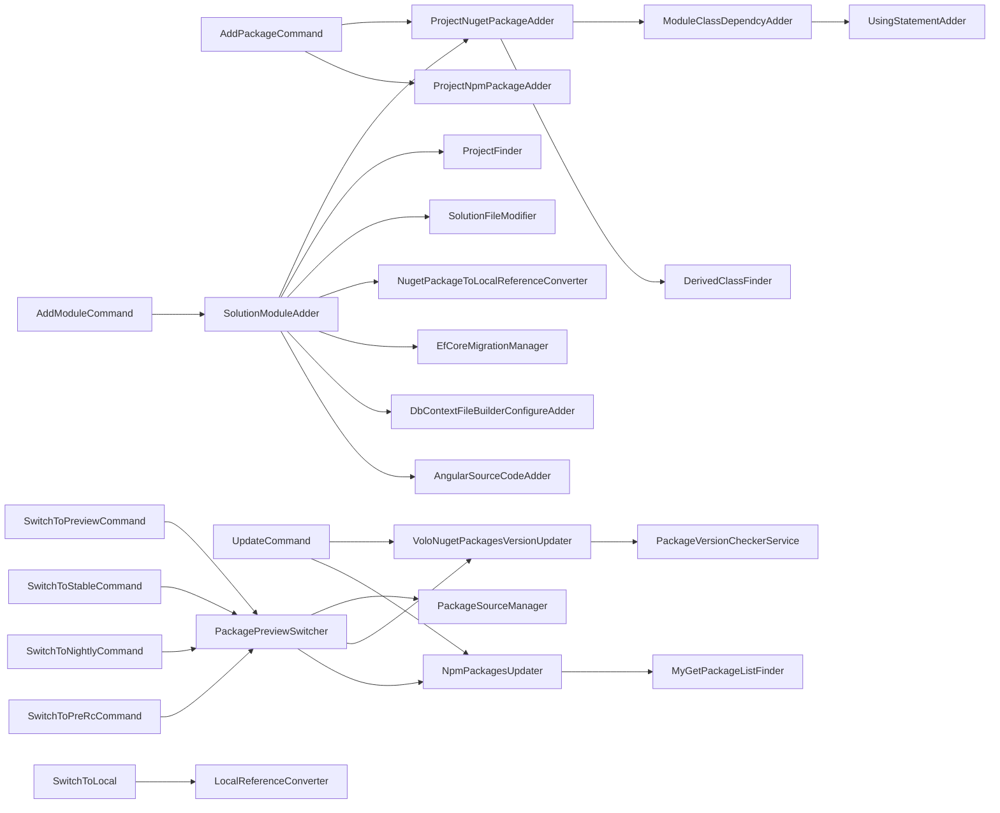
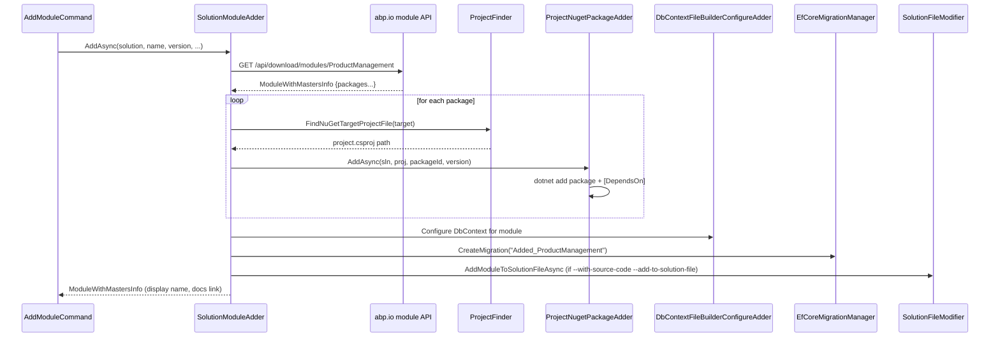

The `ProjectModification/` folder modifies **existing** solutions. Where [`ProjectBuilding/`](/cli/project-building) operates on an in-memory zip, this folder writes to real `.csproj`, `.sln`, `.slnx`, `package.json`, and JSON config files on disk. The commands that consume it are [`add-package`](/cli/install-libs-and-add-package), [`add-module`](/cli/install-libs-and-add-package#abp-add-module--module-composed-of-many-packages), [`update`](/cli/version-switch-commands#updatecommand), all [`switch-to-*`](/cli/version-switch-commands#channel-switchers), and the post-create hooks of [`abp new`](/cli/new-command).

<Info>
Source root: [`framework/src/Volo.Abp.Cli.Core/Volo/Abp/Cli/ProjectModification/`](https://github.com/abpframework/abp/tree/dev/framework/src/Volo.Abp.Cli.Core/Volo/Abp/Cli/ProjectModification).
</Info>

## Folder layout

```text
ProjectModification/
├── AddModuleInfoOutput.cs              # DTO returned by AddModuleCommand
├── AngularPwaSupportAdder.cs           # adds @angular/pwa to an Angular project
├── AngularSourceCodeAdder.cs           # adds an Angular sub-project as a workspace project
├── AngularThemeConfigurer.cs           # rewrites angular.json for theme choice
├── BlazorProjectTypeChecker.cs         # detects WASM vs Server vs WebApp from a .csproj
├── DbContextFileBuilderConfigureAdder.cs  # injects builder.ConfigureXxx() in *.DbContext.cs
├── DerivedClassFinder.cs               # finds the AbpModule-derived class in a project
├── EfCoreMigrationManager.cs           # wraps dotnet ef migrations add/run
├── Events/
├── LocalReferenceConverter.cs          # switch-to-local engine
├── ModuleClassDependcyAdder.cs         # injects [DependsOn(typeof(...))]
├── ModuleInfo.cs / ModuleWithMastersInfo.cs
├── MyGetApiResponse.cs / MyGetPackage.cs / MyGetPackageListFinder.cs
├── NpmApplicationType.cs
├── NpmGlobalPackagesChecker.cs         # ensures yarn / npm / @angular/cli are installed
├── NpmPackageInfo.cs
├── NpmPackagesUpdater.cs               # update / switch-to-* engine for NPM
├── NuGetPackageInfo.cs / NuGetPackageTarget.cs
├── NugetPackageToLocalReferenceConverter.cs
├── PackageJsonFileFinder.cs
├── PackagePreviewSwitcher.cs           # switch-to-{preview,stable,nightly,prerc} engine
├── PackageSourceManager.cs             # rewrites NuGet.Config
├── ProjectFileNameHelper.cs
├── ProjectFinder.cs                    # suffix → .csproj mapping (Domain, Application, …)
├── ProjectNpmPackageAdder.cs
├── ProjectNugetPackageAdder.cs
├── SolutionFileModifier.cs             # dotnet sln add/remove
├── SolutionModuleAdder.cs              # add-module engine (multi-package)
├── SolutionPackageVersionFinder.cs     # discovers ABP version from existing .csproj
├── ThemePackageAdder.cs                # add LeptonX / Basic theme packages
├── UsingStatementAdder.cs              # inserts `using X;` lines
└── VoloNugetPackagesVersionUpdater.cs  # update engine for NuGet
```

## How the pieces fit



## `ProjectFinder` — suffix routing

The whole "find the right project for this layer" logic lives in `ProjectFinder`:

```csharp framework/src/Volo.Abp.Cli.Core/Volo/Abp/Cli/ProjectModification/ProjectFinder.cs
switch (target)
{
    case NuGetPackageTarget.Web:
        return FindProjectEndsWith(projectFiles, assemblyNames, ".Web");
    case NuGetPackageTarget.IdentityServer:
        return FindProjectEndsWith(projectFiles, assemblyNames, ".IdentityServer") ??
               FindProjectEndsWith(projectFiles, assemblyNames, ".AuthServer");
    case NuGetPackageTarget.EntityFrameworkCore:
        return FindProjectEndsWith(projectFiles, assemblyNames, ".EntityFrameworkCore");
    case NuGetPackageTarget.MongoDB:
        return FindProjectEndsWith(projectFiles, assemblyNames, ".MongoDB");
    case NuGetPackageTarget.Application:
        return FindProjectEndsWith(projectFiles, assemblyNames, ".Application") ??
               FindProjectEndsWith(projectFiles, assemblyNames, ".Web");
    case NuGetPackageTarget.ApplicationContracts:
        return FindProjectEndsWith(projectFiles, assemblyNames, ".Application.Contracts");
    case NuGetPackageTarget.Domain:
        return FindProjectEndsWith(projectFiles, assemblyNames, ".Domain") ??
               FindProjectEndsWith(projectFiles, assemblyNames, ".Application") ??
               FindProjectEndsWith(projectFiles, assemblyNames, ".Web");
    // ...
}
```

`NuGetPackageTarget` is the enum that names every layer:

```csharp framework/src/Volo.Abp.Cli.Core/Volo/Abp/Cli/ProjectModification/NuGetPackageTarget.cs
public enum NuGetPackageTarget : byte
{
    Undefined = 0,
    DomainShared = 1,
    Domain = 2,
    ApplicationContracts = 3,
    Application = 4,
    HttpApi = 5,
    HttpApiClient = 6,
    Web = 7,
    EntityFrameworkCore = 8,
    MongoDB = 9,
    SignalR = 10,
    Blazor = 11,
    IdentityServer = 12, //todo: Rename to AuthServer
    BlazorServer = 13,
    BlazorWebAssembly = 14,
    MauiBlazor = 15
}
```

This enum and the switch are the **contract** between every Volo NuGet package and your solution layout. Anything diverging from the suffix convention (e.g. renaming `Acme.BookStore.Domain` to `Acme.BookStore.Core`) will break `add-module` because `ProjectFinder` won't find a match.

## `SolutionFileModifier` — `.sln` and `.slnx` editing

Edits solution files by shelling out to `dotnet sln`:

```csharp framework/src/Volo.Abp.Cli.Core/Volo/Abp/Cli/ProjectModification/SolutionFileModifier.cs
public class SolutionFileModifier : ITransientDependency
{
    private readonly ICmdHelper _cmdHelper;

    public SolutionFileModifier(ICmdHelper cmdHelper)
    {
        _cmdHelper = cmdHelper;
    }

    public async Task RemoveProjectFromSolutionFileAsync(string solutionFile, string projectName)
    {
        var list = _cmdHelper.RunCmdAndGetOutput($"dotnet sln \"{solutionFile}\" list");

        foreach (var line in list.Split(new[] { Environment.NewLine, "\n" }, StringSplitOptions.None))
        {
            if (Path.GetFileNameWithoutExtension(line.Trim()).Equals(projectName, StringComparison.InvariantCultureIgnoreCase))
            {
                _cmdHelper.RunCmd($"dotnet sln \"{solutionFile}\" remove \"{line.Trim()}\"");
                break;
            }
        }
    }

    public async Task AddModuleToSolutionFileAsync(ModuleWithMastersInfo module, string solutionFile)
    {
        await AddModuleAsync(module, solutionFile);
    }

    public async Task AddPackageToSolutionFileAsync(NugetPackageInfo package, string solutionFile)
    {
        await AddPackageAsync(package, solutionFile);
    }

    private async Task AddPackageAsync(NugetPackageInfo package, string solutionFile)
    {
        _cmdHelper.RunCmd($"dotnet sln \"{solutionFile}\" add \"packages\\{package.Name}\\{package.Name}.csproj\" --solution-folder src");
    }

    private async Task AddModuleAsync(ModuleWithMastersInfo module, string solutionFile)
    {
        var projectsUnderModule = Directory.GetFiles(
            Path.Combine(Path.GetDirectoryName(solutionFile), "modules", module.Name),
            "*.csproj",
            SearchOption.AllDirectories);

        var projectsUnderTest = new List<string>();
        if (Directory.Exists(Path.Combine(Path.GetDirectoryName(solutionFile), "modules", module.Name, "test")))
        {
            projectsUnderTest = Directory.GetFiles(
                Path.Combine(Path.GetDirectoryName(solutionFile), "modules", module.Name, "test"),
                "*.csproj",
                SearchOption.AllDirectories).ToList();
        }

        foreach (var projectPath in projectsUnderModule)
        {
            var folder = projectsUnderTest.Contains(projectPath) ? "test" : "src";

            var projectId = Path.GetFileName(projectPath).Replace(".csproj", "");
            var package = @$"modules\{module.Name}\{folder}\{projectId}\{projectId}.csproj";

            _cmdHelper.RunCmd($"dotnet sln \"{solutionFile}\" add \"{package}\" --solution-folder {folder}");
        }
        // ... walk masters ...
    }
}
```

Two reasons to shell out instead of touching the XML directly:

- `.slnx` is XML, but `.sln` is a proprietary format. `dotnet sln` handles both transparently.
- Solution-folder placement (`--solution-folder src` / `--solution-folder test`) is non-trivial to replicate.

## `ProjectNugetPackageAdder` — the workhorse of `add-package`

```csharp framework/src/Volo.Abp.Cli.Core/Volo/Abp/Cli/ProjectModification/ProjectNugetPackageAdder.cs
public class ProjectNugetPackageAdder : ITransientDependency
{
    public ILogger<ProjectNugetPackageAdder> Logger { get; set; }
    public BundleCommand BundleCommand { get; }
    public SourceCodeDownloadService SourceCodeDownloadService { get; }
    public SolutionFileModifier SolutionFileModifier { get; }
    public ICmdHelper CmdHelper { get; }

    protected IJsonSerializer JsonSerializer { get; }
    protected ProjectNpmPackageAdder NpmPackageAdder { get; }
    protected DerivedClassFinder ModuleClassFinder { get; }
    protected ModuleClassDependcyAdder ModuleClassDependcyAdder { get; }
    protected IRemoteServiceExceptionHandler RemoteServiceExceptionHandler { get; }

    private readonly CliHttpClientFactory _cliHttpClientFactory;
    // ...
}
```

Its `AddAsync(...)` method runs the full flow:

1. Resolve the package metadata (`NugetPackageInfo` — published by the `Volo.*` packages alongside their `nuspec`). This tells the adder which `NuGetPackageTarget` (`.Domain`, `.Web`, …) the package wants.
2. Use `ProjectFinder.FindNuGetTargetProjectFile` to pick the right `.csproj`.
3. Run `dotnet add <project> package <id> --version <v>` via `CmdHelper`.
4. Find the `AbpModule`-derived class in that project (`DerivedClassFinder`).
5. Insert `using <ModuleNamespace>;` (`UsingStatementAdder`) and `[DependsOn(typeof(<Module>))]` (`ModuleClassDependcyAdder`).
6. If `--with-source-code`, download the source via `SourceCodeDownloadService` and convert the `<PackageReference>` to a `<ProjectReference>` via `NugetPackageToLocalReferenceConverter`.
7. If `--add-to-solution-file`, call `SolutionFileModifier.AddPackageToSolutionFileAsync`.

## `ModuleClassDependcyAdder` + `UsingStatementAdder`

These two text-edit helpers are what gives `add-package` its idiomatic feel — after running, your module class looks like you wrote it by hand:

```csharp framework/src/Volo.Abp.Cli.Core/Volo/Abp/Cli/ProjectModification/UsingStatementAdder.cs
public class UsingStatementAdder : ITransientDependency
{
    public string Add(string fileContent, string nameSpace)
    {
        if (fileContent.Contains($" {nameSpace};"))
        {
            return fileContent;
        }

        var index = GetIndexOfTheEndOfTheLastUsingStatement(fileContent);

        if (index < 0 || index >= fileContent.Length)
        {
            index = 0;
        }

        var usingStatement = GetUsingStatement(nameSpace);

        return fileContent.Insert(index, usingStatement);
    }

    protected virtual string GetUsingStatement(string nameSpace)
    {
        return Environment.NewLine + "using " + nameSpace + ";";
    }

    protected virtual int GetIndexOfTheEndOfTheLastUsingStatement(string fileContent)
    {
        var indexOfNamespaceDeclaration = fileContent.IndexOf("namespace", StringComparison.Ordinal);
        // ... walks back from `namespace` to find the last `using` line ...
    }
}
```

```csharp framework/src/Volo.Abp.Cli.Core/Volo/Abp/Cli/ProjectModification/ModuleClassDependcyAdder.cs
public class ModuleClassDependcyAdder : ITransientDependency
{
    protected UsingStatementAdder UsingStatementAdder { get; }

    public ModuleClassDependcyAdder(UsingStatementAdder usingStatementAdder)
    {
        UsingStatementAdder = usingStatementAdder;
    }

    public virtual void Add(string path, string module)
    {
        ParseModuleNameAndNameSpace(module, out var nameSpace, out var moduleName);

        var file = File.ReadAllText(path);

        file = UsingStatementAdder.Add(file, nameSpace);

        if (!file.Contains(moduleName))
        {
            file = InsertDependsOnAttribute(file, moduleName);
        }

        File.WriteAllText(path, file);
    }

    protected virtual string InsertDependsOnAttribute(string file, string moduleName)
    {
        var indexOfPublicClassDeclaration = GetIndexOfWhereDependsOnWillBeAdded(file);
        var dependsOnAttribute = GetDependsOnAttribute(moduleName);

        return file.Insert(indexOfPublicClassDeclaration, dependsOnAttribute);
    }
    // ...
}
```

`GetIndexOfWhereDependsOnWillBeAdded` finds the last `]` of an existing `[DependsOn(...)]` block (or the line above `public class XxxModule`) and inserts the new attribute on its own line.

## `SolutionModuleAdder` — `add-module` engine

```csharp framework/src/Volo.Abp.Cli.Core/Volo/Abp/Cli/ProjectModification/SolutionModuleAdder.cs
public class SolutionModuleAdder : ITransientDependency
{
    public ILogger<SolutionModuleAdder> Logger { get; set; }
    public SourceCodeDownloadService SourceCodeDownloadService { get; }
    public SolutionFileModifier SolutionFileModifier { get; }
    public NugetPackageToLocalReferenceConverter NugetPackageToLocalReferenceConverter { get; }
    public AngularSourceCodeAdder AngularSourceCodeAdder { get; }
    public NewCommand NewCommand { get; }
    public BundleCommand BundleCommand { get; }
    public ICmdHelper CmdHelper { get; }
    public ILocalEventBus LocalEventBus { get; }
    public SolutionPackageVersionFinder SolutionPackageVersionFinder { get; }

    protected IJsonSerializer JsonSerializer { get; }
    protected ProjectNugetPackageAdder ProjectNugetPackageAdder { get; }
    protected DbContextFileBuilderConfigureAdder DbContextFileBuilderConfigureAdder { get; }
    protected EfCoreMigrationManager EfCoreMigrationManager { get; }
    protected DerivedClassFinder DerivedClassFinder { get; }
    protected ProjectNpmPackageAdder ProjectNpmPackageAdder { get; }
    protected NpmGlobalPackagesChecker NpmGlobalPackagesChecker { get; }
    protected IRemoteServiceExceptionHandler RemoteServiceExceptionHandler { get; }
    // ...
}
```

The largest dependency graph in the entire CLI. `AddAsync` orchestrates:

1. Fetch the **module manifest** from abp.io (list of packages, their `NuGetPackageTarget`, master modules, doc URLs).
2. For each package, call `ProjectNugetPackageAdder.AddAsync` against the matching project — that already handles the `[DependsOn]` injection.
3. Find the `*.EntityFrameworkCore.DbContext` file via `DerivedClassFinder` and call `DbContextFileBuilderConfigureAdder` to inject `builder.Configure<Module>();` inside `OnModelCreating`.
4. For Angular templates, call `AngularSourceCodeAdder` to register the matching `@abp/ng.<module>` workspace project in `angular.json` + `tsconfig.json`.
5. If `--with-source-code`, call `NugetPackageToLocalReferenceConverter` for every added package.
6. Unless `--skip-db-migrations`, call `EfCoreMigrationManager.CreateMigration(...)` to generate `Added_<ModuleName>` migration.
7. Publish a local event so Studio can update its module pane.

## `VoloNugetPackagesVersionUpdater` — `update` engine for NuGet

```csharp framework/src/Volo.Abp.Cli.Core/Volo/Abp/Cli/ProjectModification/VoloNugetPackagesVersionUpdater.cs
public class VoloNugetPackagesVersionUpdater : ITransientDependency
{
    private readonly PackageVersionCheckerService _packageVersionCheckerService;
    private readonly MyGetPackageListFinder _myGetPackageListFinder;
    public ILogger<VoloNugetPackagesVersionUpdater> Logger { get; set; }
    public static Encoding DefaultEncoding = Encoding.UTF8;
    // ...
    public async Task UpdateSolutionAsync(
        string solutionPath,
        bool includePreviews = false,
        bool includeReleaseCandidates = false,
        bool switchToStable = false,
        bool checkAll = false,
        string version = null,
        string leptonXVersion = null)
    {
        var projectPaths = ProjectFinder.GetProjectFiles(solutionPath);

        if (checkAll && version.IsNullOrWhiteSpace())
        {
            Task.WaitAll(projectPaths.Select(projectPath => UpdateInternalAsync(projectPath, includePreviews, includeReleaseCandidates, switchToStable)).ToArray());
        }
        else
        {
            var latestVersionInfo = await _packageVersionCheckerService.GetLatestVersionOrNullAsync("Volo.Abp.Core", includeReleaseCandidates: includeReleaseCandidates);
            var latestReleaseCandidateVersionInfo = await _packageVersionCheckerService.GetLatestVersionOrNullAsync("Volo.Abp.Core", includeReleaseCandidates: true);
            var latestVersionFromMyGet = await GetLatestVersionFromMyGet("Volo.Abp.Core");
            var latestStableVersions = await _packageVersionCheckerService.GetLatestStableVersionsAsync();

            async Task UpdateAsync(string filePath)
            {
                using (var fs = File.Open(filePath, FileMode.Open, FileAccess.ReadWrite, FileShare.None))
                {
                    using (var sr = new StreamReader(fs, Encoding.Default, true))
                    {
                        var fileContent = await sr.ReadToEndAsync();

                        var updatedContent = await UpdateVoloPackagesAsync(fileContent, ...);
                        // ... write back ...
                    }
                }
            }
            // ...
        }
    }
}
```

Two modes:

- **Single probe** (default): ask NuGet once for `Volo.Abp.Core` and use that version for every other `Volo.*` package. Fast, assumes versions are aligned (which they are for ABP releases).
- **`--check-all`**: ask NuGet independently for every package id encountered. Slow but resilient if your solution is on mixed versions.

The actual rewrite is a regex inside `UpdateVoloPackagesAsync` that replaces `Version="x"` attributes of `<PackageReference Include="Volo.*" ... />` nodes. `Directory.Packages.props` is also handled.

## `NpmPackagesUpdater` — same idea for npm

Walks every `package.json` under the working directory and rewrites `@abp/*` / `@volo/*` versions. The version table is loaded from `MyGetPackageListFinder` for nightly builds and from `https://registry.npmjs.org` for everything else.

## `PackagePreviewSwitcher` — channel switching

```csharp framework/src/Volo.Abp.Cli.Core/Volo/Abp/Cli/ProjectModification/PackagePreviewSwitcher.cs
public class PackagePreviewSwitcher : ITransientDependency
{
    private readonly PackageSourceManager _packageSourceManager;
    private readonly NpmPackagesUpdater _npmPackagesUpdater;
    private readonly VoloNugetPackagesVersionUpdater _nugetPackagesVersionUpdater;
    // ...

    public async Task SwitchToPreview(CommandLineArgs commandLineArgs)
    {
        var solutionPaths = GetSolutionPaths(commandLineArgs);

        if (solutionPaths.Any())
        {
            await SwitchSolutionsToPreview(solutionPaths);
        }
        else
        {
            var projectPaths = GetProjectPaths(commandLineArgs);

            await SwitchProjectsToPreview(projectPaths);
        }
    }

    public async Task SwitchToStable(CommandLineArgs commandLineArgs)
    {
        // similar, calls VoloNugetPackagesVersionUpdater with includeReleaseCandidates: false
    }
    // ...
}
```

Each `Switch…` method combines two operations:

1. `VoloNugetPackagesVersionUpdater.UpdateSolutionAsync(...)` with the appropriate `includePreviews` / `includeReleaseCandidates` / `switchToStable` flags.
2. `NpmPackagesUpdater.Update(...)` for the matching channel (`npmjs` for stable/preview, `next` tag for prerc, etc.).
3. `PackageSourceManager` adjusts `NuGet.Config` to add or remove the `abp-nightly` MyGet feed.

The four `switch-to-*` commands map directly:

| Command | `PackagePreviewSwitcher` method |
| --- | --- |
| `switch-to-preview` | `SwitchToPreview` (RC included) |
| `switch-to-stable` | `SwitchToStable` (RC excluded) |
| `switch-to-nightly` | `SwitchToNightlyPreview` (MyGet feed) |
| `switch-to-prerc` | `SwitchToPreRc` (npm `next` tag) |

## `LocalReferenceConverter` — `switch-to-local`

```csharp framework/src/Volo.Abp.Cli.Core/Volo/Abp/Cli/ProjectModification/LocalReferenceConverter.cs
public class LocalReferenceConverter : ITransientDependency
{
    public ILogger<LocalReferenceConverter> Logger { get; set; }

    public async Task ConvertAsync(
        [NotNull] string directory,
        [NotNull] List<string> localPaths)
    {
        Check.NotNull(directory, nameof(directory));
        Check.NotNull(localPaths, nameof(localPaths));

        var localProjects = GetLocalProjects(localPaths);
        var targetProjects = Directory.GetFiles(directory, "*.csproj", SearchOption.AllDirectories);

        Logger.LogInformation($"Converting projects to local reference.");

        foreach (var targetProject in targetProjects)
        {
            Logger.LogInformation($"Converting to local reference: {targetProject}");

            await ConvertProjectToLocalReferences(targetProject, localProjects);
        }

        Logger.LogInformation($"Converted {targetProjects.Length} projects to local references.");
    }

    private async Task ConvertProjectToLocalReferences(string targetProject, List<string> localProjects)
    {
        var xmlDocument = new XmlDocument() { PreserveWhitespace = true };
        xmlDocument.Load(GenerateStreamFromString(File.ReadAllText(targetProject)));

        var matchedNodes = xmlDocument.SelectNodes($"/Project/ItemGroup/PackageReference[@Include]");

        if (matchedNodes == null || matchedNodes.Count == 0)
        {
            return;
        }

        foreach (XmlNode matchedNode in matchedNodes)
        {
            var packageName = matchedNode!.Attributes!["Include"].Value;

            var localProject = localProjects.Find(x =>
                x.EndsWith($"\\{packageName}.csproj") ||
                x.EndsWith($"/{packageName}.csproj")
            );
            // ... if found, replace <PackageReference Include="X"> with <ProjectReference Include="..\..\X.csproj"> ...
        }
    }
    // ...
}
```

The algorithm is a real XML edit (`XmlDocument` with `PreserveWhitespace`). For every `<PackageReference Include="Volo.Abp.X" />` it checks whether `\Volo.Abp.X.csproj` exists under one of the `localPaths`; if so, replaces the package ref with a project ref to that local file. The reverse operation is handled by `NugetPackageToLocalReferenceConverter` (re-used by `add-package --with-source-code`).

## Add-package step types

The high-level "add an ABP package" operation has three flavours, each handled by a different adder:

| Adder | Used for | Effect |
| --- | --- | --- |
| `ProjectNugetPackageAdder` | `abp add-package Volo.Abp.X` | `dotnet add package` + `[DependsOn]` + optional source-code download. |
| `ProjectNpmPackageAdder` | `abp add-package @abp/X` | `yarn add` in the Angular project + `angular.json` asset registration. |
| `ThemePackageAdder` | LeptonX / Basic theme selection in `abp new` and `abp update --leptonx-version` | NuGet add + ts/scss imports for the chosen theme. |

## Supporting services

- **`DerivedClassFinder`** — reflects over an already-compiled assembly to find the type derived from `AbpModule`. Used by `ProjectNugetPackageAdder`, `SolutionModuleAdder` and `DbContextFileBuilderConfigureAdder`.
- **`DbContextFileBuilderConfigureAdder`** — locates the `OnModelCreating` method of a `DbContext` and inserts the right `builder.Configure<Module>();` call.
- **`SolutionPackageVersionFinder`** — peers at existing `.csproj` / `Directory.Packages.props` to determine the solution's current ABP version. Used by every adder when `-v|--version` is not specified.
- **`PackageSourceManager`** — rewrites `NuGet.Config` to add/remove the `abp-nightly` MyGet feed when channel-switching.
- **`MyGetPackageListFinder`** — calls the MyGet v3 search API to enumerate available nightly versions.
- **`NpmGlobalPackagesChecker`** — verifies that `yarn`, `@angular/cli`, etc. are installed globally before any NPM operation that depends on them.

## Order of operations for `add-module ProductManagement -s Acme.BookStore.sln`



## Related

- [`abp add-package`/`abp add-module`/`abp install-libs`](/cli/install-libs-and-add-package) — the commands that consume this folder.
- [Project building](/cli/project-building) — sibling folder that *creates* solutions; this folder *modifies* them.
- [`abp update`/`abp switch-to-*`](/cli/version-switch-commands) — drive `VoloNugetPackagesVersionUpdater` / `NpmPackagesUpdater` / `PackagePreviewSwitcher`.
- [Startup templates](/templates/overview) — solutions produced by templates rely on the naming convention `ProjectFinder` expects.
