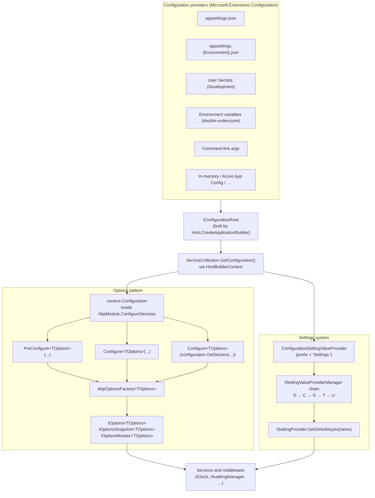

ABP applications carry **three distinct, layered configuration systems** that look similar from the outside but solve different problems. They all coexist in the same DI container, they all read from `appsettings.json` when given the chance, but only one of them is editable at runtime.

| Layer | What it answers | Wired by | Editable at runtime |
| --- | --- | --- | --- |
| `IConfiguration` | "What is the literal value in `appsettings.json` / env vars / command-line right now?" | The .NET generic host's `ConfigurationBuilder` | No (reload-on-change is file-bound, not user-bound) |
| `AbpOptions` classes (Options pattern) | "What are the *startup-time* knobs each module exposes?" | `Configure<TOptions>(...)` and `PreConfigure<TOptions>(...)` inside `AbpModule.ConfigureServices` | No (singleton snapshot per options instance) |
| `ISetting` (runtime settings) | "What value should this user / tenant / host see *now*?" | `SettingDefinitionProvider` + `ISettingValueProvider` chain | Yes, via [Setting Management module](/modules/setting-management/overview) |

The framework code that wires the three together is small and worth tracing once. The base entry points are:

```
framework/src/Volo.Abp.Core/Microsoft/Extensions/DependencyInjection/
├── ServiceCollectionConfigurationExtensions.cs   ← GetConfiguration / ReplaceConfiguration
└── ServiceCollectionApplicationExtensions.cs
framework/src/Volo.Abp.Core/Volo/Abp/Modularity/AbpModule.cs        ← Configure<>, PreConfigure<>
framework/src/Volo.Abp.Settings/Volo/Abp/Settings/                  ← ISetting chain
└── ConfigurationSettingValueProvider.cs                            ← bridges IConfiguration → ISetting
```

For deep coverage of the Options-pattern internals (the `AbpOptionsFactory`, the `PreConfigure` queue, post-configure ordering) see [`/core/options-and-configuration`](/core/options-and-configuration). For the module lifecycle phases that surround all configuration work see [`/core/modularity`](/core/modularity).

## The big picture

<CardGroup cols={2}>
  <Card title="appsettings.json" icon="file-code" href="/config/appsettings">
    The per-project JSON file every ABP template ships. Conventions for `ConnectionStrings:Default`, `App:SelfUrl`, `App:RedirectAllowedUrls`, `AuthServer`, `Redis`, `StringEncryption`, `OpenIddict:Applications`, plus environment overlays.
  </Card>
  <Card title="AbpOptions classes" icon="sliders" href="/config/options-classes">
    The catalogue of ~20 framework-level `Abp*Options` types you will configure most: `AbpAuditingOptions`, `AbpDistributedEventBusOptions`, `AbpLocalizationOptions`, `AbpMultiTenancyOptions`, `AbpClockOptions`, …
  </Card>
  <Card title="Settings system" icon="toggle-on" href="/config/settings-system">
    How `ConfigurationSettingValueProvider` exposes `appsettings.json` values under the `Settings:` prefix to `ISettingProvider`, and how the [Setting Management](/modules/setting-management/overview) module persists overrides.
  </Card>
  <Card title="Environment variables" icon="terminal" href="/config/environment-variables">
    `ASPNETCORE_ENVIRONMENT`, the `ConnectionStrings__Default` double-underscore convention, ABP CLI environment knobs, and the Dapr-side `DAPR_HTTP_PORT` / `DAPR_API_TOKEN` contract.
  </Card>
</CardGroup>

## How a value reaches a service

The data flow is the same for every ABP-on-ASP.NET-Core process. The generic host builds an `IConfigurationRoot`, modules read it (or have it injected) inside `ConfigureServices`, and `IOptions<T>` / `ISettingProvider` are the two consumer-facing APIs.



The two consumer-facing APIs (`IOptions<T>` and `ISettingProvider`) hit completely different stores at runtime:

- `IOptions<TOptions>` is a **frozen snapshot** built once by `AbpOptionsFactory<TOptions>` during the `Initialize` phase of the module lifecycle.
- `ISettingProvider.GetOrNullAsync(name)` walks a **chain of value providers**, the first of which is `ConfigurationSettingValueProvider` (reads `Settings:Name` from `IConfiguration`), and the last of which (in apps that include the Setting Management module) hits the persisted store.

## Where `IConfiguration` comes from inside a module

Every ABP module gets `IConfiguration` for free through `ServiceConfigurationContext.Configuration`. The lazy getter resolves it from the host's `HostBuilderContext` first, then falls back to a registered singleton:

```csharp
// framework/src/Volo.Abp.Core/Microsoft/Extensions/DependencyInjection/
// ServiceCollectionConfigurationExtensions.cs
[NotNull]
public static IConfiguration GetConfiguration(this IServiceCollection services)
{
    return services.GetConfigurationOrNull() ??
           throw new AbpException("Could not find an implementation of " +
               typeof(IConfiguration).AssemblyQualifiedName + " in the service collection.");
}

[CanBeNull]
public static IConfiguration? GetConfigurationOrNull(this IServiceCollection services)
{
    var hostBuilderContext = services.GetSingletonInstanceOrNull<HostBuilderContext>();
    if (hostBuilderContext?.Configuration != null)
    {
        return hostBuilderContext.Configuration as IConfigurationRoot;
    }

    return services.GetSingletonInstanceOrNull<IConfiguration>();
}
```

Inside a module the call site is unremarkable:

```csharp
public class MyModule : AbpModule
{
    public override void ConfigureServices(ServiceConfigurationContext context)
    {
        var configuration = context.Configuration;

        Configure<AbpAuditingOptions>(options =>
        {
            options.IsEnabledForAnonymousUsers =
                configuration.GetValue<bool>("Auditing:IncludeAnonymous");
        });

        // Or, bind a whole section directly:
        Configure<AbpDistributedCacheOptions>(configuration.GetSection("AbpCache"));
    }
}
```

For the standalone (non-ASP.NET) entry point — typically a console app, a worker, or tests — you populate the configuration yourself via `AbpApplicationCreationOptions.Configuration` (an `AbpConfigurationBuilderOptions`). `AddCoreAbpServices` materializes it into an `IConfigurationRoot` and registers it as a singleton. The lazy getter above then finds it on the second branch.

## The four module phases (where to put what)

A module type can override **four configuration phases**, two of which take a `ServiceConfigurationContext` and two of which run with the built service provider:

```csharp
public class MyModule : AbpModule
{
    public override void PreConfigureServices(ServiceConfigurationContext context) { /* before */ }
    public override void ConfigureServices(ServiceConfigurationContext context)    { /* main */ }
    public override void PostConfigureServices(ServiceConfigurationContext context){ /* after */ }
    public override void OnApplicationInitialization(ApplicationInitializationContext context) { /* runtime */ }
}
```

The relevance for configuration:

| Phase | Use it for | Has `IConfiguration`? | Has `IServiceProvider`? |
| --- | --- | --- | --- |
| `PreConfigureServices` | `PreConfigure<TOptions>` calls that *other modules* will read in their `ConfigureServices` (typical for `AbpAspNetCoreMvcOptions.ConventionalControllers.Create(...)`). | Yes | No |
| `ConfigureServices` | Most `Configure<TOptions>(section)` bindings, conventional registrations, replacing services. | Yes | No |
| `PostConfigureServices` | `services.AddOptions<T>().Validate(...)` shapes, last-word overrides. | Yes | No |
| `OnApplicationInitialization` | Anything that needs the built container: e.g. resolving `ISettingDefinitionManager` to materialize dynamic settings. | Yes | Yes |

The mechanics behind `PreConfigure<>` (it queues an `Action<TOptions>` on an `IPreConfigureActions<TOptions>` and runs before any standard `Configure<>`) are covered in [`/core/options-and-configuration`](/core/options-and-configuration).

## When to use Options vs Settings vs raw `IConfiguration`

A common confusion: there are *three* ways to read a value, and they are not interchangeable.

<Tabs>
  <Tab title="Use IConfiguration directly">
    Best for *one-shot* reads at module initialization time — values that influence *how the container is built*, not what the running service does on every request.

    ```csharp
    public override void ConfigureServices(ServiceConfigurationContext context)
    {
        var connectionString = context.Configuration.GetConnectionString("Default");
        if (string.IsNullOrEmpty(connectionString))
        {
            throw new AbpException("Missing ConnectionStrings:Default");
        }
    }
    ```

    Reading `IConfiguration` at request time from a transient service technically works but is discouraged — you bypass the binding/validation that `IOptions<T>` gives you and you don't get the `AbpOptionsFactory` ordering guarantees.
  </Tab>
  <Tab title="Use IOptions<T>">
    Best for *startup-defined* knobs. The catalogue is on [`/config/options-classes`](/config/options-classes). Modules typically wire one of the built-in `Abp*Options` types from a config section:

    ```csharp
    public override void ConfigureServices(ServiceConfigurationContext context)
    {
        Configure<AbpDistributedCacheOptions>(options =>
        {
            options.KeyPrefix = "MyApp:";
            options.GlobalCacheEntryOptions = new DistributedCacheEntryOptions
            {
                AbsoluteExpirationRelativeToNow = TimeSpan.FromMinutes(20)
            };
        });
    }
    ```

    Consumers inject `IOptions<AbpDistributedCacheOptions>` (singleton snapshot) or `IOptionsSnapshot<T>` (rebuilt per scope). They never see the raw `IConfiguration`.
  </Tab>
  <Tab title="Use ISettingProvider">
    Best for values that **users or tenants override at runtime** through the admin UI — SMTP credentials, default language, timezone, anything that is "config" from an operator's viewpoint but "data" from the framework's viewpoint.

    ```csharp
    public class WelcomeEmailService : ITransientDependency
    {
        private readonly ISettingProvider _settingProvider;

        public WelcomeEmailService(ISettingProvider settingProvider)
            => _settingProvider = settingProvider;

        public async Task<string> GetFromAddressAsync()
            => await _settingProvider.GetOrNullAsync(
                   EmailSettingNames.DefaultFromAddress);
    }
    ```

    The five-step provider chain — Default → Configuration → Global → Tenant → User — is documented on [`/security/settings`](/security/settings). The bridge from `appsettings.json` into that chain is `ConfigurationSettingValueProvider`, covered on [`/config/settings-system`](/config/settings-system).
  </Tab>
</Tabs>

## A worked example: three views of one value

To make the differences concrete, consider the **default outbound email address**. The same logical value can be expressed in all three systems, and they behave differently when an operator wants to change it.

<AccordionGroup>
  <Accordion title="As IConfiguration">
    ```json
    // appsettings.json
    {
      "Settings": {
        "Abp.Mailing.DefaultFromAddress": "noreply@mycompany.com"
      }
    }
    ```

    Read via `context.Configuration["Settings:Abp.Mailing.DefaultFromAddress"]`. Wins for ops who want infrastructure-as-code: deploy a new `appsettings.Production.json`, restart the pod, value is updated. No DB writes.
  </Accordion>
  <Accordion title="As an Options class">
    ABP does not surface email-sender defaults as an `IOptions<T>` — `EmailSenderConfiguration` resolves them through `ISettingProvider`. If it *were* an Options class you would bind a section and inject `IOptions<EmailSenderOptions>`. But because email defaults differ per tenant, the Options pattern is the wrong tool.
  </Accordion>
  <Accordion title="As a Setting">
    ```csharp
    // resolves through:
    //   1. ConfigurationSettingValueProvider → reads appsettings.json
    //   2. SettingManagement DB store → reads user/tenant/global overrides
    await _settingProvider.GetOrNullAsync(EmailSettingNames.DefaultFromAddress);
    ```

    Wins when each tenant must use its own from-address, or when ops want admins to change the value through the **Administration → Settings** UI without redeploying. The Setting Management module covers the persisted side.
  </Accordion>
</AccordionGroup>

The same data lives in `appsettings.json` for both the IConfiguration and the Setting readings — the **prefix** `Settings:` tells `ConfigurationSettingValueProvider` which subtree of `IConfiguration` to expose as settings.

## File checklist for a fresh template

A freshly-generated ABP solution carries one `appsettings.json` per executable project. Each one is sliced for the project's role:

```
templates/app/aspnet-core/src/
├── MyCompanyName.MyProjectName.Web/appsettings.json
├── MyCompanyName.MyProjectName.HttpApi.Host/appsettings.json
├── MyCompanyName.MyProjectName.AuthServer/appsettings.json
├── MyCompanyName.MyProjectName.Blazor.Server/appsettings.json
└── MyCompanyName.MyProjectName.DbMigrator/appsettings.json
```

The contents of each file (and what each key actually does at runtime) are documented on [`/config/appsettings`](/config/appsettings). They share a common shape — `ConnectionStrings`, `App`, `AuthServer`, `Redis`, `StringEncryption` — but only the relevant subset appears in each project.

## Bridge to other guides

<CardGroup cols={2}>
  <Card title="Options-pattern internals" icon="gears" href="/core/options-and-configuration">
    The full `AbpOptionsFactory`, `PreConfigure<>` queue, `PostConfigure<>` ordering, validation, and the `ServiceCollection.GetConfiguration()` lookup.
  </Card>
  <Card title="Module lifecycle" icon="layer-group" href="/core/modularity">
    How the four module phases run in dependency order, why `PreConfigureServices` exists, and what `OnApplicationInitialization` can do that the earlier phases can't.
  </Card>
  <Card title="Settings hierarchy" icon="list-tree" href="/security/settings">
    The five-step ISettingValueProvider chain (Default → Configuration → Global → Tenant → User) and the `SettingDefinition` shape.
  </Card>
  <Card title="Setting Management module" icon="screwdriver-wrench" href="/modules/setting-management/overview">
    The persistence, application services, HTTP API, and admin UI that let operators edit settings at runtime.
  </Card>
  <Card title="Connection strings" icon="database" href="/data/connection-strings">
    How `ConnectionStrings:Default` flows through `AbpDbConnectionOptions`, `IConnectionStringResolver`, and `[ConnectionStringName]` attributes.
  </Card>
  <Card title="Dapr integration" icon="cubes" href="/distributed/dapr-integration">
    Where the Dapr sidecar's `DAPR_HTTP_PORT` / `DAPR_GRPC_PORT` / `DAPR_API_TOKEN` env vars are picked up by `AbpDaprModule`.
  </Card>
</CardGroup>
