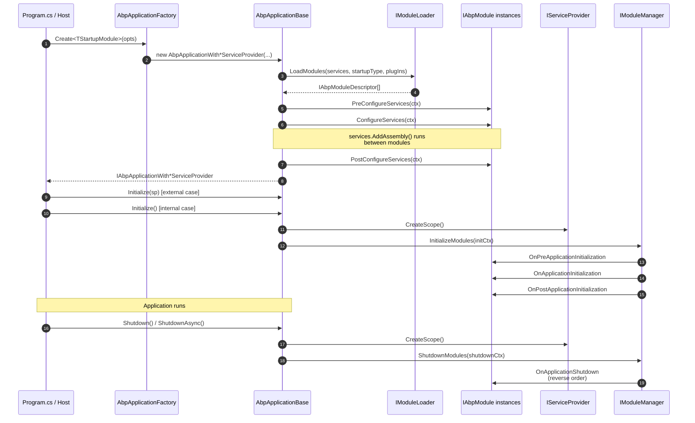

`AbpApplicationBase` is the abstract host that every ABP application boots through. It is the only class in the framework that simultaneously knows about the module graph, the service collection, and the runtime service provider. This page traces it from the static factory call in `Program.cs` all the way to `OnApplicationShutdown`, quoting the source at [`framework/src/Volo.Abp.Core/Volo/Abp/AbpApplicationBase.cs`](https://github.com/abpframework/abp/blob/dev/framework/src/Volo.Abp.Core/Volo/Abp/AbpApplicationBase.cs).

## The factory and the two flavors

```csharp
// framework/src/Volo.Abp.Core/Volo/Abp/AbpApplicationFactory.cs
public static IAbpApplicationWithInternalServiceProvider Create<TStartupModule>(
    Action<AbpApplicationCreationOptions>? optionsAction = null)
    where TStartupModule : IAbpModule
{
    return Create(typeof(TStartupModule), optionsAction);
}

public static IAbpApplicationWithExternalServiceProvider Create<TStartupModule>(
    [NotNull] IServiceCollection services,
    Action<AbpApplicationCreationOptions>? optionsAction = null)
    where TStartupModule : IAbpModule
{
    return Create(typeof(TStartupModule), services, optionsAction);
}
```

There are two concrete subclasses of `AbpApplicationBase`:

| Class | Owns the `IServiceCollection`? | Owns the `IServiceProvider`? | Typical host |
| --- | --- | --- | --- |
| `AbpApplicationWithInternalServiceProvider` | Yes — created internally | Yes — built when `Initialize()` runs | Console apps, tests, ABP CLI |
| `AbpApplicationWithExternalServiceProvider` | No — supplied by caller | No — built by the generic host | ASP.NET Core (`WebApplication.CreateBuilder`), Worker Service |

Both inherit the same base ctor:

```csharp
internal AbpApplicationBase(
    [NotNull] Type startupModuleType,
    [NotNull] IServiceCollection services,
    Action<AbpApplicationCreationOptions>? optionsAction)
{
    Check.NotNull(startupModuleType, nameof(startupModuleType));
    Check.NotNull(services, nameof(services));

    StartupModuleType = startupModuleType;
    Services = services;

    services.TryAddObjectAccessor<IServiceProvider>();

    var options = new AbpApplicationCreationOptions(services);
    optionsAction?.Invoke(options);

    ApplicationName = GetApplicationName(options);

    services.AddSingleton<IAbpApplication>(this);
    services.AddSingleton<IApplicationInfoAccessor>(this);
    services.AddSingleton<IModuleContainer>(this);
    services.AddSingleton<IAbpHostEnvironment>(new AbpHostEnvironment()
    {
        EnvironmentName = options.Environment
    });

    services.AddCoreServices();
    services.AddCoreAbpServices(this, options);

    Modules = LoadModules(services, options);

    if (!options.SkipConfigureServices)
    {
        ConfigureServices();
    }
}
```

Five things happen in this constructor:

1. An `IObjectAccessor<IServiceProvider>` is added as a placeholder — the real provider is published into it later via `SetServiceProvider`.
2. `AbpApplicationCreationOptions` is built and your `optionsAction` runs on it (you can register plug-in sources, override the environment, set `SkipConfigureServices`, …).
3. The `AbpApplicationBase` instance itself is registered as `IAbpApplication`, `IApplicationInfoAccessor`, and `IModuleContainer`.
4. **`LoadModules`** walks `[DependsOn]` from the startup module, then merges in plug-in sources, then topologically sorts. See [Modularity](/core/modularity).
5. Unless you opted out, **`ConfigureServices`** runs the entire pre/main/post pass over every module.

## The lifecycle, end to end



The diagram maps 1:1 to the methods on `AbpApplicationBase` documented below.

## `ConfigureServices` — three passes over every module

`AbpApplicationBase.ConfigureServices()` (synchronous; the `Async` variant is identical with `await` calls) is the giant orchestration method. Trimmed for the three passes:

```csharp
public virtual void ConfigureServices()
{
    CheckMultipleConfigureServices();

    var context = new ServiceConfigurationContext(Services);
    Services.AddSingleton(context);

    foreach (var module in Modules)
    {
        if (module.Instance is AbpModule abpModule)
        {
            abpModule.ServiceConfigurationContext = context;
        }
    }

    //PreConfigureServices
    foreach (var module in Modules.Where(m => m.Instance is IPreConfigureServices))
    {
        try
        {
            ((IPreConfigureServices)module.Instance).PreConfigureServices(context);
        }
        catch (Exception ex)
        {
            throw new AbpInitializationException(
                $"An error occurred during {nameof(IPreConfigureServices.PreConfigureServices)} phase of the module {module.Type.AssemblyQualifiedName}. See the inner exception for details.",
                ex);
        }
    }

    var assemblies = new HashSet<Assembly>();

    //ConfigureServices
    foreach (var module in Modules)
    {
        if (module.Instance is AbpModule abpModule)
        {
            if (!abpModule.SkipAutoServiceRegistration)
            {
                foreach (var assembly in module.AllAssemblies)
                {
                    if (!assemblies.Contains(assembly))
                    {
                        Services.AddAssembly(assembly);
                        assemblies.Add(assembly);
                    }
                }
            }
        }

        try
        {
            module.Instance.ConfigureServices(context);
        }
        catch (Exception ex) { /* AbpInitializationException as above */ }
    }

    //PostConfigureServices
    foreach (var module in Modules.Where(m => m.Instance is IPostConfigureServices))
    {
        ((IPostConfigureServices)module.Instance).PostConfigureServices(context);
    }

    // ServiceConfigurationContext is cleared off each module afterwards
    _configuredServices = true;
    TryToSetEnvironment(Services);
}
```

Three rules are baked into this orchestration:

| Rule | Why it matters |
| --- | --- |
| Modules are iterated **in dependency order** (deepest dependency first; startup module last). | A consumer module can read whatever a depended module just registered. |
| `Services.AddAssembly(assembly)` runs **before** `ConfigureServices(context)` on each module. | Conventional registration (`I*Dependency` markers, `[ExposeServices]`) is in place by the time the module's overrides run. |
| `ServiceConfigurationContext` is **assigned on every `AbpModule` instance** and then nulled out after the pass. | Calling `Configure<TOptions>(...)` outside the configure phase throws — see `ServiceConfigurationContext` getter. |

<Note>
  Calling `ConfigureServices()` twice is a programming error: `CheckMultipleConfigureServices` throws `AbpInitializationException("Services have already been configured! ...")`. The async factory path sets `SkipConfigureServices = true` so it can call `ConfigureServicesAsync()` itself instead.
</Note>

## `RegisterAssemblies` — the assembly merge step

There is no method literally named `RegisterAssemblies` on `AbpApplicationBase`, but the inline loop quoted above (`Services.AddAssembly(assembly)`) is the assembly-registration step every framework consumer cares about. Two things happen each time `AddAssembly` is called:

1. The conventional registrars (see [Dependency injection](/core/dependency-injection)) walk every public class in the assembly and call `DefaultConventionalRegistrar.AddType(services, type)`.
2. `AssemblyFinder` and `TypeFinder` (in `Volo/Abp/Reflection/`) cache the assembly so later code can query "give me all `IXyz` implementations across loaded modules".

`AbpModuleDescriptor.AllAssemblies` is the source list — populated by `AbpModuleHelper.GetAllAssemblies(type)` which expands `[AdditionalAssembly]` markers in addition to the module's own assembly.

## `Initialize` — the four ordered hooks

`Initialize` (synchronous) and `InitializeAsync` (async) both go through the same `InitializeModules` / `InitializeModulesAsync` method:

```csharp
protected virtual void InitializeModules()
{
    using (var scope = ServiceProvider.CreateScope())
    {
        WriteInitLogs(scope.ServiceProvider);
        scope.ServiceProvider
            .GetRequiredService<IModuleManager>()
            .InitializeModules(new ApplicationInitializationContext(scope.ServiceProvider));
    }
}
```

The interesting work is in [`Modularity/ModuleManager.cs`](https://github.com/abpframework/abp/blob/dev/framework/src/Volo.Abp.Core/Volo/Abp/Modularity/ModuleManager.cs):

```csharp
public virtual async Task InitializeModulesAsync(ApplicationInitializationContext context)
{
    foreach (var contributor in _lifecycleContributors)
    {
        foreach (var module in _moduleContainer.Modules)
        {
            try
            {
                await contributor.InitializeAsync(context, module.Instance);
            }
            catch (Exception ex)
            {
                throw new AbpInitializationException(
                    $"An error occurred during the initialize {contributor.GetType().FullName} phase of the module {module.Type.AssemblyQualifiedName}: {ex.Message}. See the inner exception for details.",
                    ex);
            }
        }
    }

    _logger.LogInformation("Initialized all ABP modules.");
}
```

`_lifecycleContributors` is the registered list of `IModuleLifecycleContributor` (configured in `AbpModuleLifecycleOptions`). Out of the box the contributors implement the four hooks:

| Hook interface (on a module) | Contributor | Order |
| --- | --- | --- |
| `IOnPreApplicationInitialization` | `OnPreApplicationInitializationModuleLifecycleContributor` | 1 |
| `IOnApplicationInitialization` | `OnApplicationInitializationModuleLifecycleContributor` | 2 |
| `IOnPostApplicationInitialization` | `OnPostApplicationInitializationModuleLifecycleContributor` | 3 |
| `IOnApplicationShutdown` | `OnApplicationShutdownModuleLifecycleContributor` | shutdown only |

All three init contributors fire once each — and inside each pass, every module is visited in dependency order. That means **all** modules see `OnPreApplicationInitialization` before **any** of them sees `OnApplicationInitialization`. Use the pre-hook for "I need to register data seeders / decorate routing options before others read them" and the post-hook for "log a banner once everyone is wired".

## `ApplicationInitializationContext`

```csharp
// framework/src/Volo.Abp.Core/Volo/Abp/ApplicationInitializationContext.cs
public class ApplicationInitializationContext : IServiceProviderAccessor
{
    public IServiceProvider ServiceProvider { get; set; }

    public ApplicationInitializationContext([NotNull] IServiceProvider serviceProvider)
    {
        Check.NotNull(serviceProvider, nameof(serviceProvider));
        ServiceProvider = serviceProvider;
    }
}
```

It is a one-property carrier whose `ServiceProvider` is a **scoped** provider (`ServiceProvider.CreateScope()` above). That means scoped services (`ICurrentTenant`, `ICurrentUser`, `IUnitOfWorkManager`) can be resolved during initialization without leaking a scope across requests.

ASP.NET Core consumers commonly read `IApplicationBuilder` off this context via the `IServiceProvider`:

```csharp
public override void OnApplicationInitialization(ApplicationInitializationContext context)
{
    var app = context.GetApplicationBuilder(); // extension that resolves IApplicationBuilder
    app.UseRouting();
    app.UseConfiguredEndpoints();
}
```

`GetApplicationBuilder()` lives in `Volo.Abp.AspNetCore` — covered in [ASP.NET Core integration](/aspnetcore/overview).

## `Shutdown` — symmetry in reverse

```csharp
public virtual void Shutdown()
{
    using (var scope = ServiceProvider.CreateScope())
    {
        scope.ServiceProvider
            .GetRequiredService<IModuleManager>()
            .ShutdownModules(new ApplicationShutdownContext(scope.ServiceProvider));
    }
}
```

```csharp
// ModuleManager.cs
public virtual async Task ShutdownModulesAsync(ApplicationShutdownContext context)
{
    var modules = _moduleContainer.Modules.Reverse().ToList();

    foreach (var contributor in _lifecycleContributors)
    {
        foreach (var module in modules)
        {
            try
            {
                await contributor.ShutdownAsync(context, module.Instance);
            }
            catch (Exception ex)
            {
                throw new AbpShutdownException(/* ... */, ex);
            }
        }
    }
}
```

Two properties to internalize:

- **Reverse order.** Modules shut down in the opposite order of `Initialize`. The startup module is first to stop; the deepest dependency is last to stop.
- **No `Pre`/`Post` phases.** There is only `IOnApplicationShutdown`. Anything you would have put in a "post-shutdown" hook should be done in `OnApplicationShutdown` of a module that runs *first*, i.e. one that other modules depend on (so it sees shutdown last among its dependents).

```csharp
// framework/src/Volo.Abp.Core/Volo/Abp/ApplicationShutdownContext.cs
public class ApplicationShutdownContext
{
    public IServiceProvider ServiceProvider { get; }

    public ApplicationShutdownContext([NotNull] IServiceProvider serviceProvider)
    {
        Check.NotNull(serviceProvider, nameof(serviceProvider));
        ServiceProvider = serviceProvider;
    }
}
```

`ApplicationShutdownContext` deliberately does **not** implement `IServiceProviderAccessor`. Shutdown handlers should drain resources synchronously and avoid touching the wider DI graph.

## `SetServiceProvider` — bridging external hosts

```csharp
protected virtual void SetServiceProvider(IServiceProvider serviceProvider)
{
    ServiceProvider = serviceProvider;
    ServiceProvider.GetRequiredService<ObjectAccessor<IServiceProvider>>().Value = ServiceProvider;
}
```

The `IObjectAccessor<IServiceProvider>` registered up in the constructor is the mechanism that lets framework code reach `IServiceProvider` *before* the host has actually built one. After `SetServiceProvider` runs, any consumer that resolved the accessor sees the live provider. This is also how the external-provider variant (ASP.NET Core) hands its container to ABP — see `AbpApplicationWithExternalServiceProvider`.

## Factory overloads, complete list

```csharp
// Internal provider, sync
AbpApplicationFactory.Create<TStartupModule>(optionsAction);

// Internal provider, async (calls ConfigureServicesAsync internally)
await AbpApplicationFactory.CreateAsync<TStartupModule>(optionsAction);

// External provider, sync
AbpApplicationFactory.Create<TStartupModule>(services, optionsAction);

// External provider, async
await AbpApplicationFactory.CreateAsync<TStartupModule>(services, optionsAction);

// Non-generic equivalents take a Type
AbpApplicationFactory.Create(typeof(MyStartupModule), optionsAction);
```

The `Async` variants force `SkipConfigureServices = true` and then call `ConfigureServicesAsync()` themselves so your `Pre/Configure/PostConfigureServicesAsync` overrides actually receive an awaitable context:

```csharp
public async static Task<IAbpApplicationWithInternalServiceProvider> CreateAsync<TStartupModule>(
    Action<AbpApplicationCreationOptions>? optionsAction = null)
    where TStartupModule : IAbpModule
{
    var app = Create(typeof(TStartupModule), options =>
    {
        options.SkipConfigureServices = true;
        optionsAction?.Invoke(options);
    });
    await app.ConfigureServicesAsync();
    return app;
}
```

## `AbpApplicationCreationOptions`

```csharp
// framework/src/Volo.Abp.Core/Volo/Abp/AbpApplicationCreationOptions.cs
public class AbpApplicationCreationOptions
{
    [NotNull] public IServiceCollection Services { get; }
    [NotNull] public PlugInSourceList PlugInSources { get; }

    /// <summary>
    /// The options in this property only take effect when IConfiguration not registered.
    /// </summary>
    [NotNull] public AbpConfigurationBuilderOptions Configuration { get; }

    public bool SkipConfigureServices { get; set; }
    public string? ApplicationName { get; set; }
    public string? Environment { get; set; }
}
```

| Property | When to set it |
| --- | --- |
| `ApplicationName` | Multi-app deployments where you want `IApplicationInfoAccessor.ApplicationName` to be deterministic instead of derived from the entry assembly. |
| `Environment` | Hosting outside of ASP.NET Core's `IHostEnvironment` (CLI tools, tests). Drives `IAbpHostEnvironment.EnvironmentName`. |
| `SkipConfigureServices` | Set by `CreateAsync`. You almost never set this by hand. |
| `PlugInSources` | Add `FolderPlugInSource`, `FilePlugInSource`, or `TypePlugInSource` to load modules not reachable via `[DependsOn]`. See [Modularity](/core/modularity#plug-ins). |
| `Configuration` | Only used when there is no `IConfiguration` already registered — i.e. the standalone console / test path. |

## `WriteInitLogs` — flushing pre-DI logs

```csharp
protected virtual void WriteInitLogs(IServiceProvider serviceProvider)
{
    var logger = serviceProvider.GetService<ILogger<AbpApplicationBase>>();
    if (logger == null) { return; }

    var initLogger = serviceProvider.GetRequiredService<IInitLoggerFactory>().Create<AbpApplicationBase>();

    foreach (var entry in initLogger.Entries)
    {
        logger.Log(entry.LogLevel, entry.EventId, entry.State, entry.Exception, entry.Formatter);
    }

    initLogger.Entries.Clear();
}
```

`IInitLoggerFactory` (in `Volo/Abp/Logging/`) gives the early-boot code (e.g. `ModuleLoader`) a way to log without an `IServiceProvider`. `WriteInitLogs` runs once, during `InitializeModules`, and replays the buffered entries through the real logger. This is why module-loading errors show up *after* the application banner in the console.

## Putting it together: console host

```csharp
// Program.cs in a console app
using Volo.Abp;

using var application = await AbpApplicationFactory.CreateAsync<MyStartupModule>(options =>
{
    options.Services.ReplaceConfiguration(BuildConfiguration());
});

await application.InitializeAsync();

Console.WriteLine("Press ENTER to stop.");
Console.ReadLine();

await application.ShutdownAsync();
```

The sequence is exactly the one in the mermaid diagram: factory → `ConfigureServicesAsync` (inside `CreateAsync`) → `InitializeAsync` → application runs → `ShutdownAsync`.

For the ASP.NET Core hosting story (`builder.Services.AddApplicationAsync<T>()`, `app.InitializeAsync()`), continue to [ASP.NET Core integration](/aspnetcore/overview).

## Related reading

<CardGroup cols={2}>
  <Card title="Modularity" icon="puzzle-piece" href="/core/modularity">
    The `IAbpModule`, `[DependsOn]`, and `IOn*Initialization` hooks that the lifecycle above iterates over.
  </Card>
  <Card title="Dependency injection" icon="diagram-project" href="/core/dependency-injection">
    What `Services.AddAssembly(assembly)` actually does, and how `[ExposeServices]` decides which interfaces a type maps to.
  </Card>
  <Card title="Options & configuration" icon="sliders" href="/core/options-and-configuration">
    The `PreConfigure<T>` / `Configure<T>` calls modules make on `ServiceConfigurationContext.Services`.
  </Card>
  <Card title="Exception handling" icon="triangle-exclamation" href="/core/exception-handling">
    `AbpInitializationException` and `AbpShutdownException` — the wrappers the lifecycle methods throw.
  </Card>
</CardGroup>
