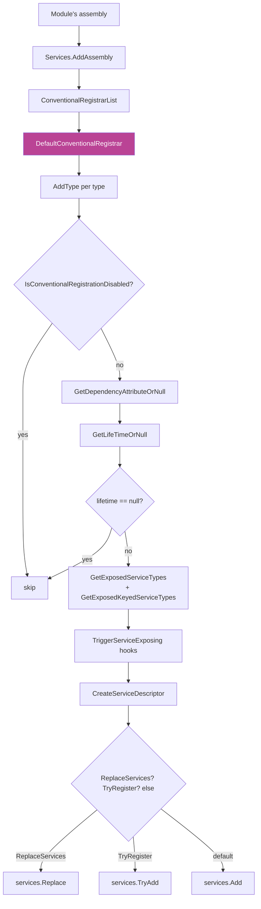

ABP doesn't replace the .NET `IServiceCollection`. It extends it. Every type that implements one of three marker interfaces — or carries the `[Dependency]` attribute — gets registered automatically as the module's assembly is added. This page covers the entire pipeline in [`framework/src/Volo.Abp.Core/Volo/Abp/DependencyInjection/`](https://github.com/abpframework/abp/tree/dev/framework/src/Volo.Abp.Core/Volo/Abp/DependencyInjection).

## The convention in 30 seconds

```csharp
// Marker → singleton, exposed as itself + IMyService
public class MyService : IMyService, ISingletonDependency { }

// Attribute → explicit lifetime, exposed only as the listed services
[Dependency(ServiceLifetime.Scoped, ReplaceServices = true)]
[ExposeServices(typeof(IMyService))]
public class CustomMyService : IMyService { }

// Opt out
[DisableConventionalRegistration]
public class NotForDi { }
```

That is what gets called for every type the conventional registrar walks. The how is below.

## Flow: from `Services.AddAssembly` to `services.Add`



The diagram traces a single type. The whole assembly is just this loop, run for every public, non-abstract, non-generic class.

## `ConventionalRegistrarBase` — the framework hook

```csharp
// framework/src/Volo.Abp.Core/Volo/Abp/DependencyInjection/ConventionalRegistrarBase.cs
public abstract class ConventionalRegistrarBase : IConventionalRegistrar
{
    public virtual void AddAssembly(IServiceCollection services, Assembly assembly)
    {
        var logger = services.GetInitLogger<ConventionalRegistrarBase>();
        var types = Array.Empty<Type>();

        try
        {
            types = AssemblyHelper
                .GetAllTypes(assembly)
                .Where(type => type != null && type.IsClass && !type.IsAbstract && !type.IsGenericType)
                .ToArray();
        }
        catch (ReflectionTypeLoadException e)
        {
            types = e.Types
                .Where(type => type != null && type.IsClass && !type.IsAbstract && !type.IsGenericType)
                .Select(x => x!)
                .ToArray();
            logger.LogException(e);
        }
        catch (Exception e)
        {
            logger.LogException(e);
        }

        AddTypes(services, types);
    }

    public abstract void AddType(IServiceCollection services, Type type);
```

Three things to note:

- It iterates **classes only** — `IsClass && !IsAbstract && !IsGenericType`. Open generic services need explicit registration in a module's `ConfigureServices`.
- It tolerates `ReflectionTypeLoadException` by registering whatever types did load. This makes ABP resilient to a missing optional dependency in a plug-in.
- `AddType` is abstract. Subclasses decide what to do per type. The default is `DefaultConventionalRegistrar`.

### Lifetime resolution

The base class encodes the lifetime decision in two methods:

```csharp
protected virtual ServiceLifetime? GetLifeTimeOrNull(Type type, DependencyAttribute? dependencyAttribute)
{
    return dependencyAttribute?.Lifetime
        ?? GetServiceLifetimeFromClassHierarchy(type)
        ?? GetDefaultLifeTimeOrNull(type);
}

protected virtual ServiceLifetime? GetServiceLifetimeFromClassHierarchy(Type type)
{
    if (typeof(ITransientDependency).GetTypeInfo().IsAssignableFrom(type))
        return ServiceLifetime.Transient;

    if (typeof(ISingletonDependency).GetTypeInfo().IsAssignableFrom(type))
        return ServiceLifetime.Singleton;

    if (typeof(IScopedDependency).GetTypeInfo().IsAssignableFrom(type))
        return ServiceLifetime.Scoped;

    return null;
}

protected virtual ServiceLifetime? GetDefaultLifeTimeOrNull(Type type)
{
    return null; // Default: no auto-registration unless an attribute or marker says so
}
```

The resolution rules, in order:

| Step | Source | Outcome |
| --- | --- | --- |
| 1 | `[Dependency(ServiceLifetime.X)]` on the type | Wins outright. |
| 2 | First of `ITransientDependency`, `ISingletonDependency`, `IScopedDependency` found in the type hierarchy | Sets the lifetime. |
| 3 | `GetDefaultLifeTimeOrNull(type)` — overridable | Returns `null` by default, so a type with neither attribute nor marker is **not registered**. |
| 4 | Lifetime is `null` | `DefaultConventionalRegistrar.AddType` returns without adding anything. |

Subclassing `ConventionalRegistrarBase` and overriding `GetDefaultLifeTimeOrNull` is how ABP's MVC integration auto-registers Controllers, Razor Pages, and Application Services — see for example `AbpAspNetCoreConventionalRegistrar` in `Volo.Abp.AspNetCore`.

## The marker interfaces

```csharp
// ISingletonDependency.cs
public interface ISingletonDependency { }

// IScopedDependency.cs
public interface IScopedDependency { }

// ITransientDependency.cs
public interface ITransientDependency { }
```

Empty by design. They are tag types — no methods to implement, no `using` statements changed. The framework inspects the type hierarchy with `IsAssignableFrom`. You can apply a marker to a *base class* or *interface* you own, and every derived class inherits the lifetime.

| Marker | When to use it |
| --- | --- |
| `ITransientDependency` | Stateless helpers, validators, mapping profiles, anything cheap to construct and free of shared state. Used by **most** services in the framework. |
| `IScopedDependency` | Per-request state. `IUnitOfWorkManager`, `ICurrentTenant`, request-bound caches. Resolves once per service scope. |
| `ISingletonDependency` | Shared, thread-safe state. `IGuidGenerator`, `IClock`, options factories. Avoid for anything that touches `IServiceProvider` directly. |

<Warning>
  Implementing **two** marker interfaces is a bug — `GetServiceLifetimeFromClassHierarchy` returns the first match in the order Transient → Singleton → Scoped, which may not be what you intended. Pick one.
</Warning>

## `[Dependency]` — explicit lifetime + override flags

```csharp
// framework/src/Volo.Abp.Core/Volo/Abp/DependencyInjection/DependencyAttribute.cs
public class DependencyAttribute : Attribute
{
    public virtual ServiceLifetime? Lifetime { get; set; }
    public virtual bool TryRegister { get; set; }
    public virtual bool ReplaceServices { get; set; }

    public DependencyAttribute() { }

    public DependencyAttribute(ServiceLifetime lifetime)
    {
        Lifetime = lifetime;
    }
}
```

Three knobs:

| Property | Effect on the `services.Add*` call |
| --- | --- |
| `Lifetime` | Overrides the marker-derived lifetime. Useful when you want a single class that implements `ITransientDependency` to be registered as Singleton in a specific module. |
| `TryRegister` | `services.TryAdd(descriptor)` instead of `services.Add` — only registers if no other registration exists for the same service type. |
| `ReplaceServices` | `services.Replace(descriptor)` — atomically replace any prior registration. The idiomatic way to override a framework service. |

The default behavior (`services.Add`) **appends**, which means you may end up with multiple implementations of the same interface. That is fine for plural services (validators, contributors) but a bug for singletons (clock, current tenant). Reach for `ReplaceServices = true` when you swap one implementation for another.

```csharp
[Dependency(ReplaceServices = true)]
[ExposeServices(typeof(IClock))]
public class MyTestClock : IClock, ISingletonDependency
{
    public DateTime Now { get; set; } = new(2024, 1, 1, 0, 0, 0, DateTimeKind.Utc);
    public DateTimeKind Kind => DateTimeKind.Utc;
    // ...
}
```

## `[ExposeServices]` — choosing the registered service types

```csharp
// framework/src/Volo.Abp.Core/Volo/Abp/DependencyInjection/ExposeServicesAttribute.cs
[AttributeUsage(AttributeTargets.Class, AllowMultiple = true)]
public class ExposeServicesAttribute : Attribute, IExposedServiceTypesProvider
{
    public Type[] ServiceTypes { get; }

    public bool IncludeDefaults { get; set; }
    public bool IncludeSelf { get; set; }

    public ExposeServicesAttribute(params Type[] serviceTypes)
    {
        ServiceTypes = serviceTypes ?? Type.EmptyTypes;
    }

    public Type[] GetExposedServiceTypes(Type targetType)
    {
        var serviceList = ServiceTypes.ToList();

        if (IncludeDefaults)
        {
            foreach (var type in GetDefaultServices(targetType))
            {
                serviceList.AddIfNotContains(type);
            }
            if (IncludeSelf) { serviceList.AddIfNotContains(targetType); }
        }
        else if (IncludeSelf) { serviceList.AddIfNotContains(targetType); }

        return serviceList.ToArray();
    }

    private static List<Type> GetDefaultServices(Type type)
    {
        var serviceTypes = new List<Type>();

        foreach (var interfaceType in type.GetTypeInfo().GetInterfaces())
        {
            var interfaceName = interfaceType.Name;
            if (interfaceType.IsGenericType)
                interfaceName = interfaceType.Name.Left(interfaceType.Name.IndexOf('`'));

            if (interfaceName.StartsWith("I"))
                interfaceName = interfaceName.Right(interfaceName.Length - 1);

            if (type.Name.EndsWith(interfaceName, StringComparison.OrdinalIgnoreCase))
                serviceTypes.Add(interfaceType);
        }

        return serviceTypes;
    }
}
```

The "default services" rule: an interface `IFoo` is "default" for a class `MyFoo` if the class name ends with the interface name (sans the leading `I`). This is what makes `BookAppService : IBookAppService` register as `IBookAppService` automatically — no attribute required.

| Attribute usage | Registered service types |
| --- | --- |
| No `[ExposeServices]` at all | The "default services" set (interfaces whose name matches the class). |
| `[ExposeServices(typeof(IFoo), typeof(IBar))]` | Exactly `IFoo` and `IBar` — no defaults, no self. |
| `[ExposeServices(typeof(IFoo), IncludeDefaults = true)]` | `IFoo` + every default interface. |
| `[ExposeServices(IncludeSelf = true)]` | Only the class type itself. |
| `[ExposeServices(IncludeDefaults = true, IncludeSelf = true)]` | Defaults + the class type itself. |

The "include self" form is what lets a consumer write `_serviceProvider.GetRequiredService<MyFoo>()` instead of `IMyFoo` — handy in tests, controllers, and anywhere you can't or don't want an interface.

## `[ExposeKeyedService<T>]` — .NET 8 keyed services

```csharp
// framework/src/Volo.Abp.Core/Volo/Abp/DependencyInjection/ExposeKeyedServiceAttribute.cs
[AttributeUsage(AttributeTargets.Class, AllowMultiple = true)]
public class ExposeKeyedServiceAttribute<TServiceType> : Attribute, IExposedKeyedServiceTypesProvider
    where TServiceType : class
{
    public ServiceIdentifier ServiceIdentifier { get; }

    public ExposeKeyedServiceAttribute(object serviceKey)
    {
        if (serviceKey == null)
        {
            throw new AbpException(
                $"{nameof(serviceKey)} can not be null! Use {nameof(ExposeServicesAttribute)} instead.");
        }
        ServiceIdentifier = new ServiceIdentifier(serviceKey, typeof(TServiceType));
    }

    public ServiceIdentifier[] GetExposedServiceTypes(Type targetType)
    {
        return new[] { ServiceIdentifier };
    }
}
```

Used like:

```csharp
[ExposeKeyedService<IMessageSender>("sms")]
[ExposeKeyedService<IMessageSender>("primary")]
public class SmsSender : IMessageSender, ITransientDependency { }
```

The keyed registrations are merged with the regular `[ExposeServices]` set inside `DefaultConventionalRegistrar.AddType`. Resolved via `serviceProvider.GetRequiredKeyedService<IMessageSender>("sms")` or constructor injection with `[FromKeyedServices("sms")]`.

## `[DisableConventionalRegistration]` — opt out

```csharp
// framework/src/Volo.Abp.Core/Volo/Abp/DependencyInjection/DisableConventionalRegistrationAttribute.cs
public class DisableConventionalRegistrationAttribute : Attribute { }
```

`ConventionalRegistrarBase.IsConventionalRegistrationDisabled` checks for it (with `inherit: true`), so the attribute on a base class propagates to subclasses. Apply when you want a class to live in the same assembly as ABP services but be registered manually (or not at all).

## `DefaultConventionalRegistrar.AddType` end to end

```csharp
// framework/src/Volo.Abp.Core/Volo/Abp/DependencyInjection/DefaultConventionalRegistrar.cs
public class DefaultConventionalRegistrar : ConventionalRegistrarBase
{
    public override void AddType(IServiceCollection services, Type type)
    {
        if (IsConventionalRegistrationDisabled(type)) { return; }

        var dependencyAttribute = GetDependencyAttributeOrNull(type);
        var lifeTime = GetLifeTimeOrNull(type, dependencyAttribute);

        if (lifeTime == null) { return; }

        var exposedServiceAndKeyedServiceTypes =
            GetExposedKeyedServiceTypes(type)
                .Concat(GetExposedServiceTypes(type).Select(t => new ServiceIdentifier(t)))
                .ToList();

        TriggerServiceExposing(services, type, exposedServiceAndKeyedServiceTypes);

        foreach (var exposedServiceType in exposedServiceAndKeyedServiceTypes)
        {
            var allExposingServiceTypes = exposedServiceType.ServiceKey == null
                ? exposedServiceAndKeyedServiceTypes.Where(x => x.ServiceKey == null).ToList()
                : exposedServiceAndKeyedServiceTypes
                      .Where(x => x.ServiceKey?.ToString() == exposedServiceType.ServiceKey?.ToString())
                      .ToList();

            var serviceDescriptor = CreateServiceDescriptor(
                type,
                exposedServiceType.ServiceKey,
                exposedServiceType.ServiceType,
                allExposingServiceTypes,
                lifeTime.Value);

            if (dependencyAttribute?.ReplaceServices == true)        { services.Replace(serviceDescriptor); }
            else if (dependencyAttribute?.TryRegister == true)        { services.TryAdd(serviceDescriptor); }
            else                                                      { services.Add(serviceDescriptor); }
        }
    }
}
```

Five things land on the service collection per qualifying type:

1. A `ServiceDescriptor` per exposed service type.
2. The descriptor uses a factory that, after the first resolution of the type, **redirects** subsequent service-type resolutions to the same instance — so `GetService<IFoo>()` and `GetService<MyFoo>()` return the *same* singleton even though they have separate descriptors. (See `CreateServiceDescriptor` in `ConventionalRegistrarBase` for the exact factory.)
3. `OnServiceExposing` hooks run, letting other modules add or remove exposed types before registration.
4. The registration mode (`Add` / `TryAdd` / `Replace`) is driven by the `[Dependency]` attribute.
5. The same logic handles keyed and non-keyed services side by side, partitioned by `ServiceKey`.

## `ConventionalRegistrarList` and `AddConventionalRegistrar`

The registrar list is itself a service-collection citizen, stored via `IObjectAccessor<ConventionalRegistrarList>`:

```csharp
// Microsoft/Extensions/DependencyInjection/ServiceCollectionConventionalRegistrationExtensions.cs
private static ConventionalRegistrarList GetOrCreateRegistrarList(IServiceCollection services)
{
    var conventionalRegistrars = services
        .GetSingletonInstanceOrNull<IObjectAccessor<ConventionalRegistrarList>>()?.Value;

    if (conventionalRegistrars == null)
    {
        conventionalRegistrars = new ConventionalRegistrarList { new DefaultConventionalRegistrar() };
        services.AddObjectAccessor(conventionalRegistrars);
    }

    return conventionalRegistrars;
}

public static IServiceCollection AddAssembly(this IServiceCollection services, Assembly assembly)
{
    foreach (var registrar in services.GetConventionalRegistrars())
    {
        registrar.AddAssembly(services, assembly);
    }
    return services;
}
```

So `Services.AddAssembly(asm)` (called by [`AbpApplicationBase`](/core/abp-application-base#configureservices--three-passes-over-every-module) between module passes) runs **every** registrar in the list against the assembly. ASP.NET Core adds `AbpAspNetCoreConventionalRegistrar` to that list during its module's `PreConfigureServices`.

## `IExposedServiceTypesProvider` — bring-your-own exposure

```csharp
// framework/src/Volo.Abp.Core/Volo/Abp/DependencyInjection/IExposedServiceTypesProvider.cs
public interface IExposedServiceTypesProvider
{
    Type[] GetExposedServiceTypes(Type targetType);
}
```

`[ExposeServices]` is just one implementation. `ExposedServiceExplorer.GetExposedServices(type)` walks every attribute on the type that implements this interface, so you can write custom attributes that compute the service types dynamically.

## `IObjectAccessor<T>` — the late-binding holder

```csharp
// framework/src/Volo.Abp.Core/Volo/Abp/DependencyInjection/IObjectAccessor.cs
public interface IObjectAccessor<out T>
{
    T? Value { get; }
}

// ObjectAccessor.cs
public class ObjectAccessor<T> : IObjectAccessor<T>
{
    public T? Value { get; set; }

    public ObjectAccessor() { }
    public ObjectAccessor(T? obj) { Value = obj; }
}
```

This is how the framework **publishes a singleton before it exists**. `AbpApplicationBase` does `services.TryAddObjectAccessor<IServiceProvider>()` very early; later, after the provider is built, `SetServiceProvider` populates the accessor's `Value`. Consumers that took a constructor dependency on `IObjectAccessor<IServiceProvider>` see the value once it lands.

The same pattern backs:

- `PreConfigureActionList<TOptions>` — `services.PreConfigure<T>(...)` stores into an `IObjectAccessor<PreConfigureActionList<T>>`.
- `ConventionalRegistrarList` — the registrar list lives in `IObjectAccessor<ConventionalRegistrarList>`.

Use it sparingly in your own code — it is an escape hatch.

## `IAbpLazyServiceProvider` and `CachedServiceProvider`

ABP has a long-standing pattern for **property injection**: instead of requiring every dependency in the constructor, you take a single `IAbpLazyServiceProvider` and resolve on demand:

```csharp
// framework/src/Volo.Abp.Core/Volo/Abp/DependencyInjection/AbpLazyServiceProvider.cs
[ExposeServices(typeof(IAbpLazyServiceProvider))]
public class AbpLazyServiceProvider :
    CachedServiceProviderBase,
    IAbpLazyServiceProvider,
    ITransientDependency
{
    public AbpLazyServiceProvider(IServiceProvider serviceProvider)
        : base(serviceProvider)
    {
    }

    public virtual T LazyGetRequiredService<T>()
    {
        return (T)LazyGetRequiredService(typeof(T));
    }

    public virtual object LazyGetRequiredService(Type serviceType)
    {
        return this.GetRequiredService(serviceType);
    }
    // ...
}
```

The base class caches resolved services per-scope:

```csharp
// CachedServiceProviderBase.cs
protected ConcurrentDictionary<ServiceIdentifier, Lazy<object?>> CachedServices { get; }

public virtual object? GetService(Type serviceType)
{
    return CachedServices.GetOrAdd(
        new ServiceIdentifier(serviceType),
        _ => new Lazy<object?>(() => ServiceProvider.GetService(serviceType))
    ).Value;
}
```

| Type | Lifetime | When to use |
| --- | --- | --- |
| `IAbpLazyServiceProvider` | Transient (backward compat) | Legacy code. New code should prefer `ITransientCachedServiceProvider`. |
| `ICachedServiceProvider` → `CachedServiceProvider` | Scoped | One cache per request/scope. Use in scoped services that want lazy access to optional dependencies. |
| `ITransientCachedServiceProvider` → `TransientCachedServiceProvider` | Transient | A cache per *consumer instance* — useful when you want lazy resolution but want to opt out of sharing across the scope. |

All three implement the same `ICachedServiceProviderBase` API with `GetService`, `GetRequiredService`, `GetService<T>(defaultValue)`, and `GetService<T>(Func<IServiceProvider, object> factory)`.

## How keyed services flow through `ServiceIdentifier`

```csharp
// ServiceIdentifier.cs (excerpt)
public readonly struct ServiceIdentifier : IEquatable<ServiceIdentifier>
{
    public object? ServiceKey { get; }
    public Type ServiceType { get; }
    public ServiceIdentifier(Type serviceType) { ServiceType = serviceType; }
    public ServiceIdentifier(object? serviceKey, Type serviceType)
    {
        ServiceKey = serviceKey; ServiceType = serviceType;
    }
}
```

Every cache (`CachedServiceProviderBase`) and every conventional exposed-types list uses `ServiceIdentifier` so keyed services participate uniformly.

## `OnServiceRegistred`, `OnServiceExposing`, `OnServiceActivated`

Three extensibility points exposed via the `Microsoft.Extensions.DependencyInjection` extensions:

| Extension | Fires when | Used by |
| --- | --- | --- |
| `services.OnRegistred(action)` → `ServiceRegistrationActionList` | After a type passes the registrar — gives you the type and its exposed services. | Auditing, UoW, authorization interceptor attachment (see [Aspects](/core/dynamic-proxy-and-aspects)). |
| `services.OnExposing(action)` → `ServiceExposingActionList` | Before a registrar finalizes the exposed service list — lets you add or remove exposed types. | Module integration shims that re-expose third-party types. |
| `services.OnActivated(action)` → `ServiceActivatedActionList` | The first time a service is resolved at runtime. | One-time post-construction setup. |

Each one is itself a list stored via `IObjectAccessor`, so any module can append from `PreConfigureServices`. The interceptor pipeline relies heavily on `OnServiceRegistred` to attach `AsyncInterceptor` adapters around services that should be proxied.

## Putting the rules together

Given a class like:

```csharp
[Dependency(ReplaceServices = true)]
[ExposeServices(typeof(IBookAppService), IncludeSelf = true)]
public class BookAppService : ApplicationService, IBookAppService { /* ... */ }
```

Resolution by `DefaultConventionalRegistrar.AddType`:

1. `IsConventionalRegistrationDisabled` → no.
2. `[Dependency]` present → `dependencyAttribute.Lifetime` is `null`, so fall through.
3. `BookAppService` doesn't directly implement `I*Dependency` — but `ApplicationService` does (it has `ITransientDependency`). So `GetServiceLifetimeFromClassHierarchy` returns `Transient`.
4. `GetExposedServiceTypes(type)` → `[IBookAppService, BookAppService]` (from `[ExposeServices]` with `IncludeSelf = true`).
5. No `[ExposeKeyedService]` → no keyed entries.
6. `OnServiceExposing` runs.
7. Two `ServiceDescriptor`s are produced (for `IBookAppService` and `BookAppService`).
8. `dependencyAttribute.ReplaceServices == true` → both are `services.Replace(...)`.

End result: any previous `IBookAppService` registration is gone, and `BookAppService` itself is also resolvable directly. Both resolve to the same per-call transient instance via the shared factory.

## Related reading

<CardGroup cols={2}>
  <Card title="Modularity" icon="puzzle-piece" href="/core/modularity">
    Where `Services.AddAssembly(asm)` is called — between module passes inside `AbpApplicationBase.ConfigureServices`.
  </Card>
  <Card title="Application lifecycle" icon="play" href="/core/abp-application-base">
    The boot sequence that exercises this whole pipeline.
  </Card>
  <Card title="Dynamic proxy & aspects" icon="layer-group" href="/core/dynamic-proxy-and-aspects">
    `OnServiceRegistred` callbacks attach interceptors here — auditing, UoW, authorization, feature checking.
  </Card>
  <Card title="DDD application services" icon="cubes" href="/ddd/application">
    The classes most commonly carrying `ITransientDependency` and `[ExposeServices]` markers.
  </Card>
</CardGroup>
