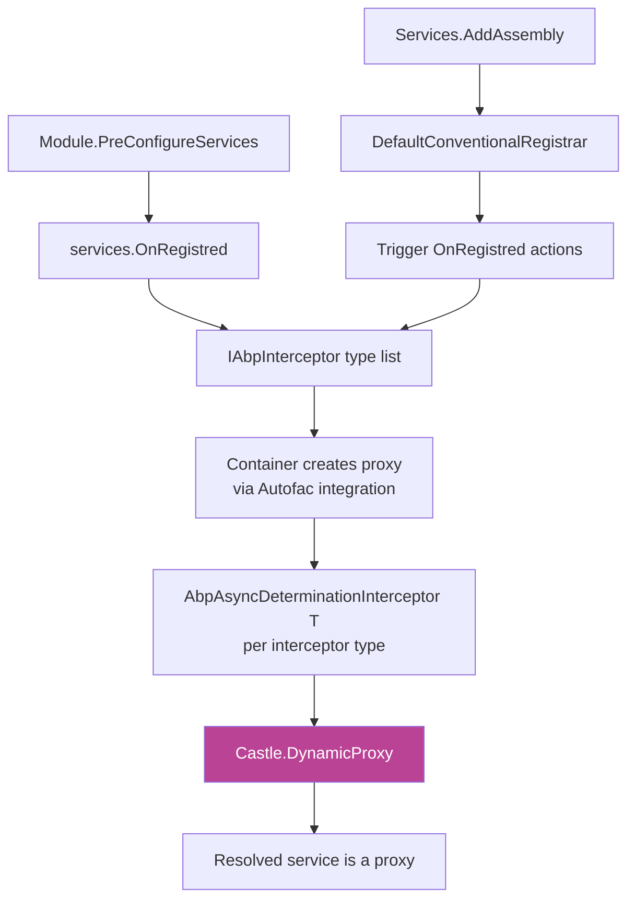
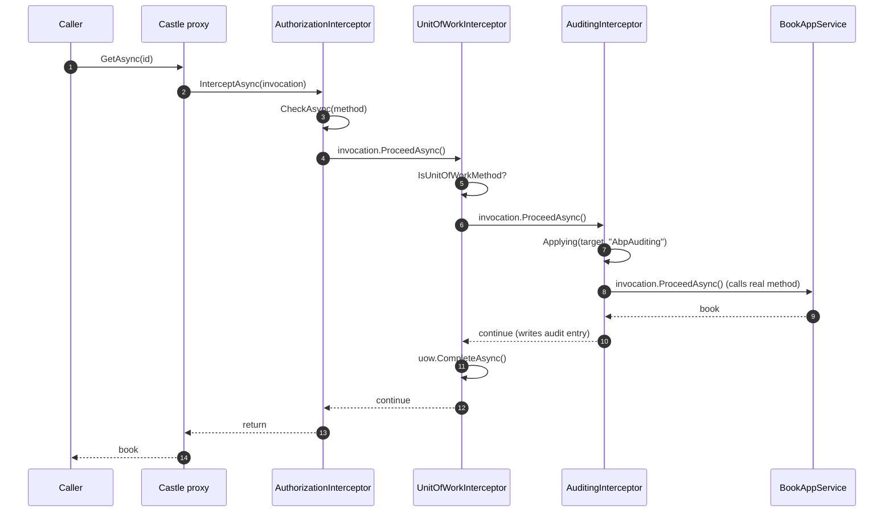

When you call `IBookAppService.GetAsync(id)`, the implementation method runs — but before it does, ABP's auditing logger captures the call, the unit-of-work middleware opens a transaction, and the authorization filter checks the user's permissions. None of that is in your `BookAppService.GetAsync` method body. It happens inside a **dynamic proxy** that wraps the resolved service and runs registered interceptors around every call. This page covers the contract in [`framework/src/Volo.Abp.Core/Volo/Abp/DynamicProxy/`](https://github.com/abpframework/abp/tree/dev/framework/src/Volo.Abp.Core/Volo/Abp/DynamicProxy), the cross-cutting bookkeeping in [`Volo/Abp/Aspects/`](https://github.com/abpframework/abp/tree/dev/framework/src/Volo.Abp.Core/Volo/Abp/Aspects), and the Castle.DynamicProxy adapter in `Volo.Abp.Castle.Core`.

## The contract — `IAbpInterceptor`

```csharp
// framework/src/Volo.Abp.Core/Volo/Abp/DynamicProxy/IAbpInterceptor.cs
public interface IAbpInterceptor
{
    Task InterceptAsync(IAbpMethodInvocation invocation);
}

// framework/src/Volo.Abp.Core/Volo/Abp/DynamicProxy/AbpInterceptor.cs
public abstract class AbpInterceptor : IAbpInterceptor
{
    public abstract Task InterceptAsync(IAbpMethodInvocation invocation);
}
```

One method. Implement it (usually via the abstract `AbpInterceptor` base), call `invocation.ProceedAsync()` to invoke the next link, and the framework hooks everything else up.

## The invocation — `IAbpMethodInvocation`

```csharp
// framework/src/Volo.Abp.Core/Volo/Abp/DynamicProxy/IAbpMethodInvocation.cs
public interface IAbpMethodInvocation
{
    object?[] Arguments { get; }
    IReadOnlyDictionary<string, object?> ArgumentsDictionary { get; }
    Type[]? GenericArguments { get; }
    object? TargetObject { get; }
    MethodInfo Method { get; }
    object ReturnValue { get; set; }

    Task ProceedAsync();
}
```

| Member | What it gives you |
| --- | --- |
| `Arguments` | The positional arguments. Mutable — interceptors can rewrite values before proceeding. |
| `ArgumentsDictionary` | Named view of the same arguments. Useful in audit logging or templated authorization. |
| `GenericArguments` | The closed type arguments for a generic method, or null. |
| `TargetObject` | The actual implementation instance behind the proxy. `ProxyHelper.UnProxy(...)` does the same. |
| `Method` | The `MethodInfo` being invoked — used by authorization to look up `[Authorize]` attributes, by UoW to inspect `[UnitOfWork]`, by auditing to read `[Audited]`. |
| `ReturnValue` | Settable. After `ProceedAsync()` returns, the interceptor can transform the result before returning to the caller. |
| `ProceedAsync()` | Calls the next interceptor in the chain, or — if this is the last one — the real method. Returns a `Task` you must `await`. |

## Two real interceptors

The framework's own interceptors are tiny when expressed in this model. Here is the unit-of-work one:

```csharp
// framework/src/Volo.Abp.Uow/Volo/Abp/Uow/UnitOfWorkInterceptor.cs (excerpt)
public class UnitOfWorkInterceptor : AbpInterceptor, ITransientDependency
{
    private readonly IServiceScopeFactory _serviceScopeFactory;

    public UnitOfWorkInterceptor(IServiceScopeFactory serviceScopeFactory)
    {
        _serviceScopeFactory = serviceScopeFactory;
    }

    public override async Task InterceptAsync(IAbpMethodInvocation invocation)
    {
        if (!UnitOfWorkHelper.IsUnitOfWorkMethod(invocation.Method, out var unitOfWorkAttribute))
        {
            await invocation.ProceedAsync();
            return;
        }

        using (var scope = _serviceScopeFactory.CreateScope())
        {
            var options = CreateOptions(scope.ServiceProvider, invocation, unitOfWorkAttribute);
            var unitOfWorkManager = scope.ServiceProvider.GetRequiredService<IUnitOfWorkManager>();

            //Trying to begin a reserved UOW by AbpUnitOfWorkMiddleware
            if (unitOfWorkManager.TryBeginReserved(UnitOfWork.UnitOfWorkReservationName, options))
            {
                await invocation.ProceedAsync();
                if (unitOfWorkManager.Current != null)
                {
                    await unitOfWorkManager.Current.SaveChangesAsync();
                }
                return;
            }

            using (var uow = unitOfWorkManager.Begin(options))
            {
                await invocation.ProceedAsync();
                await uow.CompleteAsync();
            }
        }
    }
}
```

…and the authorization one:

```csharp
// framework/src/Volo.Abp.Authorization/Volo/Abp/Authorization/AuthorizationInterceptor.cs
public class AuthorizationInterceptor : AbpInterceptor, ITransientDependency
{
    private readonly IMethodInvocationAuthorizationService _methodInvocationAuthorizationService;

    public AuthorizationInterceptor(IMethodInvocationAuthorizationService methodInvocationAuthorizationService)
    {
        _methodInvocationAuthorizationService = methodInvocationAuthorizationService;
    }

    public override async Task InterceptAsync(IAbpMethodInvocation invocation)
    {
        await AuthorizeAsync(invocation);
        await invocation.ProceedAsync();
    }

    protected virtual async Task AuthorizeAsync(IAbpMethodInvocation invocation)
    {
        await _methodInvocationAuthorizationService.CheckAsync(
            new MethodInvocationAuthorizationContext(invocation.Method)
        );
    }
}
```

Both are `ITransientDependency` — they're constructed per invocation, take whatever services they need, and call `ProceedAsync()` at the right point. The chain composition (auth → UoW → auditing → real method) is handled by Castle.

## How the proxy is built — `Volo.Abp.Castle.Core`

The Core defines the abstractions. The Castle.DynamicProxy adapter lives in [`framework/src/Volo.Abp.Castle.Core/Volo/Abp/Castle/DynamicProxy/`](https://github.com/abpframework/abp/tree/dev/framework/src/Volo.Abp.Castle.Core/Volo/Abp/Castle/DynamicProxy). Two adapters bridge the two worlds:

```csharp
// framework/src/Volo.Abp.Castle.Core/Volo/Abp/Castle/DynamicProxy/CastleAsyncAbpInterceptorAdapter.cs
public class CastleAsyncAbpInterceptorAdapter<TInterceptor> : AsyncInterceptorBase
    where TInterceptor : IAbpInterceptor
{
    private readonly TInterceptor _abpInterceptor;

    public CastleAsyncAbpInterceptorAdapter(TInterceptor abpInterceptor)
    {
        _abpInterceptor = abpInterceptor;
    }

    protected override async Task InterceptAsync(IInvocation invocation, IInvocationProceedInfo proceedInfo,
        Func<IInvocation, IInvocationProceedInfo, Task> proceed)
    {
        await _abpInterceptor.InterceptAsync(
            new CastleAbpMethodInvocationAdapter(invocation, proceedInfo, proceed)
        );
    }

    protected override async Task<TResult> InterceptAsync<TResult>(IInvocation invocation, IInvocationProceedInfo proceedInfo,
        Func<IInvocation, IInvocationProceedInfo, Task<TResult>> proceed)
    {
        var adapter = new CastleAbpMethodInvocationAdapterWithReturnValue<TResult>(invocation, proceedInfo, proceed);
        await _abpInterceptor.InterceptAsync(adapter);
        return (TResult)adapter.ReturnValue;
    }
}
```

The Castle interceptor (`AsyncInterceptorBase`, from the `Castle.Core.AsyncInterceptor` package) calls our adapter, which wraps the Castle `IInvocation` into an `IAbpMethodInvocation` and hands it to the framework interceptor. `CastleAbpMethodInvocationAdapter` is the bridge implementation:

- `Arguments` reads `IInvocation.Arguments`.
- `Method` reads `IInvocation.Method`.
- `ProceedAsync()` calls the `proceed` delegate supplied by Castle.

The driver wrapper picks the right adapter based on whether the method returns `Task` or `Task<T>`:

```csharp
// AbpAsyncDeterminationInterceptor.cs
public class AbpAsyncDeterminationInterceptor<TInterceptor> : AsyncDeterminationInterceptor
    where TInterceptor : IAbpInterceptor
{
    public AbpAsyncDeterminationInterceptor(TInterceptor abpInterceptor)
        : base(new CastleAsyncAbpInterceptorAdapter<TInterceptor>(abpInterceptor))
    {
    }
}
```

## How interceptors are attached to services

The wiring happens through the DI extensibility points described in [Dependency injection](/core/dependency-injection#onserviceregistred-onserviceexposing-onserviceactivated):



Each framework feature (UoW, auditing, authorization) registers an `OnRegistred(context => { ... })` callback during its module's `PreConfigureServices`. The callback inspects the type being registered and decides whether that interceptor should apply.

Then, when the Autofac (or DryIoc / other) container builds the service, it asks Castle.DynamicProxy to generate a proxy class that implements the service's interfaces, holds the real instance, and routes every call through the per-interceptor `AbpAsyncDeterminationInterceptor<T>` chain.

<Note>
  Castle proxies require the service to be resolved through an interface, or for the implementing class to be non-sealed with all interceptable members virtual. The conventional registrar's "register as interface" behavior (driven by `[ExposeServices]`) makes the interface path the default. See [Dependency injection](/core/dependency-injection#exposeservices--choosing-the-registered-service-types).
</Note>

## `ProxyHelper` — unwrapping a proxy

```csharp
// framework/src/Volo.Abp.Core/Volo/Abp/DynamicProxy/ProxyHelper.cs
public static class ProxyHelper
{
    private const string ProxyNamespace = "Castle.Proxies";

    public static bool IsProxy(object obj)
    {
        return obj.GetType().Namespace == ProxyNamespace;
    }

    public static object UnProxy(object obj)
    {
        if (obj.GetType().Namespace != ProxyNamespace) { return obj; }

        var targetField = obj.GetType()
            .GetFields(BindingFlags.Instance | BindingFlags.NonPublic)
            .FirstOrDefault(f => f.Name == "__target");

        if (targetField == null) { return obj; }
        return targetField.GetValue(obj)!;
    }

    public static Type GetUnProxiedType(object obj)
    {
        if (obj.GetType().Namespace == ProxyNamespace)
        {
            var target = UnProxy(obj);
            if (target == obj) { return obj.GetType().GetTypeInfo().BaseType!; }
            return target.GetType();
        }
        return obj.GetType();
    }
}
```

Three call points:

| Method | When to use |
| --- | --- |
| `ProxyHelper.IsProxy(obj)` | Defensive type checks in a generic mapper that should not recurse into proxy machinery. |
| `ProxyHelper.UnProxy(obj)` | When you need the *raw* domain instance — e.g. comparing `typeof(myService).GetCustomAttribute<XAttribute>()` should look at the implementation, not the proxy. |
| `ProxyHelper.GetUnProxiedType(obj)` | The same idea, but returns the `Type` for reflection without instantiating. |

The Castle convention `__target` field name is hardcoded; if you swap Castle for another proxy generator, this helper stops working.

## `DynamicProxyIgnoreTypes` — opting out

```csharp
// framework/src/Volo.Abp.Core/Volo/Abp/DynamicProxy/DynamicProxyIgnoreTypes.cs
/// <summary>
/// Castle's dynamic proxy class feature will have performance issues for some components,
/// such as the controller of Asp net core MVC.
/// ... The Abp framework may enable interceptors for certain components (UOW, Auditing,
/// Authorization, etc.), which requires dynamic proxy classes, but will cause application
/// performance to decline. We need to use other methods for the controller to implement
/// interception, such as middleware or MVC / Page filters.
/// So we provide some ignored types to avoid enabling dynamic proxy classes.
/// </summary>
public static class DynamicProxyIgnoreTypes
{
    private static HashSet<Type> IgnoredTypes { get; } = new HashSet<Type>();

    public static void Add<T>() { Add(typeof(T)); }
    public static void Add(Type type) { lock (IgnoredTypes) { IgnoredTypes.AddIfNotContains(type); } }
    public static void Add(params Type[] types) { lock (IgnoredTypes) { IgnoredTypes.AddIfNotContains(types); } }

    public static bool Contains(Type type, bool includeDerivedTypes = true)
    {
        lock (IgnoredTypes)
        {
            return includeDerivedTypes
                ? IgnoredTypes.Any(t => t.IsAssignableFrom(type))
                : IgnoredTypes.Contains(type);
        }
    }
}
```

ASP.NET Core's MVC integration adds `ControllerBase` and `PageModel` to this list during module init, then implements UoW/auditing/authorization via filters instead. The proxy mechanism is for **services**; HTTP request handlers get a faster (and more idiomatic) MVC filter path.

You typically don't add to this list yourself unless you've measured a hot path and confirmed proxy overhead is significant.

## `AbpCrossCuttingConcerns` — avoiding double application

A subtle problem: if an `ApplicationService` calls another `ApplicationService` (or itself through the interface), the call goes through the proxy again. Without bookkeeping, every interceptor would run twice, you'd open nested UoWs, write duplicate audit entries, and so on.

```csharp
// framework/src/Volo.Abp.Core/Volo/Abp/Aspects/AbpCrossCuttingConcerns.cs
public static class AbpCrossCuttingConcerns
{
    public const string Auditing = "AbpAuditing";
    public const string UnitOfWork = "AbpUnitOfWork";
    public const string FeatureChecking = "AbpFeatureChecking";
    public const string GlobalFeatureChecking = "AbpGlobalFeatureChecking";

    public static void AddApplied(object obj, params string[] concerns)
    {
        if (concerns.IsNullOrEmpty())
        {
            throw new ArgumentNullException(nameof(concerns), $"{nameof(concerns)} should be provided!");
        }
        (obj as IAvoidDuplicateCrossCuttingConcerns)?.AppliedCrossCuttingConcerns.AddRange(concerns);
    }

    public static bool IsApplied(object? obj, [NotNull] string concern)
    {
        if (obj == null) throw new ArgumentNullException(nameof(obj));
        if (concern == null) throw new ArgumentNullException(nameof(concern));
        return (obj as IAvoidDuplicateCrossCuttingConcerns)?.AppliedCrossCuttingConcerns.Contains(concern) ?? false;
    }

    public static IDisposable Applying(object obj, params string[] concerns)
    {
        AddApplied(obj, concerns);
        return new DisposeAction<ValueTuple<object, string[]>>(static (state) =>
        {
            var (obj, concerns) = state;
            RemoveApplied(obj, concerns);
        }, (obj, concerns));
    }

    public static string[] GetApplieds(object obj)
    {
        var crossCuttingEnabledObj = obj as IAvoidDuplicateCrossCuttingConcerns;
        if (crossCuttingEnabledObj == null) return new string[0];
        return crossCuttingEnabledObj.AppliedCrossCuttingConcerns.ToArray();
    }
}
```

Companion interface (one property):

```csharp
// framework/src/Volo.Abp.Core/Volo/Abp/Aspects/IAvoidDuplicateCrossCuttingConcerns.cs
public interface IAvoidDuplicateCrossCuttingConcerns
{
    List<string> AppliedCrossCuttingConcerns { get; }
}
```

Used like:

```csharp
public override async Task InterceptAsync(IAbpMethodInvocation invocation)
{
    if (AbpCrossCuttingConcerns.IsApplied(invocation.TargetObject, AbpCrossCuttingConcerns.Auditing))
    {
        await invocation.ProceedAsync();
        return;
    }

    using (AbpCrossCuttingConcerns.Applying(invocation.TargetObject, AbpCrossCuttingConcerns.Auditing))
    {
        // ... do the auditing work ...
        await invocation.ProceedAsync();
    }
}
```

`Applying` returns an `IDisposable` so the marker is cleaned up automatically. `IsApplied` checks the marker before doing the work. Inner calls see the same `targetObject` (the implementation instance), find the marker, and skip the concern.

The four built-in concern names are the contract — third-party interceptors should mint their own constants and follow the same pattern.

## Putting it together — the call path



Notice how the diagram doesn't say "Castle calls AuthorizationInterceptor.Intercept" — each interceptor is wrapped in a `CastleAsyncAbpInterceptorAdapter<T>`, which is the actual Castle interceptor. The framework `IAbpInterceptor` API stays clean.

## Patterns

<AccordionGroup>
  <Accordion title="Always call invocation.ProceedAsync() exactly once">
    Calling it twice runs the next interceptor (and ultimately the real method) twice. Skipping it short-circuits the entire chain — sometimes intentional (e.g. an authorization failure that throws before proceeding).
  </Accordion>
  <Accordion title="Use AbpCrossCuttingConcerns markers for any new aspect">
    If you write your own interceptor that should not double-apply when a service calls itself, mint a constant, check it on entry, and use `Applying(...)` to set it for the duration of the call. The pattern matches every framework interceptor.
  </Accordion>
  <Accordion title="Add high-traffic types to DynamicProxyIgnoreTypes">
    Only if you've actually measured. Castle proxies are fast enough that most apps never hit the limit. When you do, the docs in `DynamicProxyIgnoreTypes` recommend implementing the same concern as a middleware or MVC filter instead.
  </Accordion>
  <Accordion title="Read invocation.Method, not invocation.TargetObject.GetType()">
    If you reflect on the target's type to find attributes, you'll usually want the **interface** attribute (e.g. `[UnitOfWork]` on `IBookAppService.GetAsync`) — but `TargetObject.GetType()` is the implementation. Use `invocation.Method.GetCustomAttribute<X>()` for the method declared on the interface, or walk both with `ReflectionHelper.GetSingleAttributeOfMemberOrDeclaringTypeOrDefault`.
  </Accordion>
</AccordionGroup>

## The full Castle.DynamicProxy ↔ ABP map

| ABP type | Castle counterpart | Where |
| --- | --- | --- |
| `IAbpInterceptor` | `IAsyncInterceptor` (Castle.Core.AsyncInterceptor) | Core ↔ adapter in `Volo.Abp.Castle.Core` |
| `IAbpMethodInvocation` | `IInvocation` + `IInvocationProceedInfo` | adapter `CastleAbpMethodInvocationAdapter` |
| `AbpAsyncDeterminationInterceptor<T>` | `AsyncDeterminationInterceptor` | `Volo.Abp.Castle.Core` |
| `ProxyHelper` (`__target` field) | Castle proxy's internal field | Core |

## Related reading

<CardGroup cols={2}>
  <Card title="Dependency injection" icon="diagram-project" href="/core/dependency-injection">
    `OnRegistred` is where interceptors are attached. Read it before writing a new aspect.
  </Card>
  <Card title="Volo.Abp.Core tour" icon="cube" href="/core/volo-abp-core">
    The `DynamicProxy/` and `Aspects/` folders are tiny — see the package index.
  </Card>
  <Card title="Threading & async" icon="bolt" href="/core/threading-and-async">
    `InternalAsyncHelper.AwaitTaskWithFinally` — the helper interceptors use to bolt `finally` onto an awaited task.
  </Card>
  <Card title="ASP.NET Core integration" icon="server" href="/aspnetcore/overview">
    Why controllers and Razor pages are in `DynamicProxyIgnoreTypes` and how filters replace the proxy.
  </Card>
</CardGroup>
