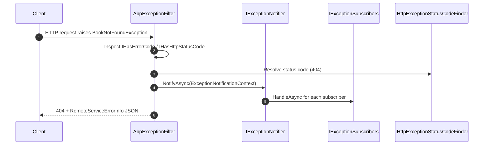

ABP draws a sharp line between **framework failures** (something is wrong with how the application is configured or running) and **business failures** (something is wrong with the data or the request). Two parallel exception hierarchies encode that distinction, and four small interfaces let HTTP / UI integrations decide what to render. All of it lives in [`framework/src/Volo.Abp.Core/`](https://github.com/abpframework/abp/tree/dev/framework/src/Volo.Abp.Core) — the runtime subscriber/notifier pipeline lives in the sibling `Volo.Abp.ExceptionHandling` package.

## Two hierarchies

```text
System.Exception
├── AbpException                          ← framework concerns
│   ├── AbpInitializationException
│   └── AbpShutdownException
└── BusinessException                     ← domain concerns (implements IBusinessException)
    └── (your own subclasses, e.g.
         BookNotFoundException : BusinessException, IUserFriendlyException)
```

| Hierarchy | When to throw | Who catches |
| --- | --- | --- |
| `AbpException` family | Module wiring failed, container couldn't resolve a service, shutdown raced — i.e. a bug. | The host process — typically logged and the app exits. |
| `BusinessException` family | A request is invalid, a resource is missing, a precondition isn't met. | The HTTP / UI layer translates it to a user-facing error. |

## `AbpException` — framework root

```csharp
// framework/src/Volo.Abp.Core/Volo/Abp/AbpException.cs
/// <summary>
/// Base exception type for those are thrown by Abp system for Abp specific exceptions.
/// </summary>
public class AbpException : Exception
{
    public AbpException() { }
    public AbpException(string? message) : base(message) { }
    public AbpException(string? message, Exception? innerException) : base(message, innerException) { }
}
```

A bare wrapper, but the type is meaningful — every "this should never happen during normal operation" failure derives from it. The two children are wrappers used by `AbpApplicationBase`:

```csharp
// AbpInitializationException.cs
public class AbpInitializationException : AbpException
{
    public AbpInitializationException() { }
    public AbpInitializationException(string message) : base(message) { }
    public AbpInitializationException(string message, Exception innerException) : base(message, innerException) { }
}

// AbpShutdownException.cs
public class AbpShutdownException : AbpException
{
    public AbpShutdownException() { }
    public AbpShutdownException(string message) : base(message) { }
    public AbpShutdownException(string message, Exception innerException) : base(message, innerException) { }
}
```

`AbpApplicationBase.ConfigureServices` wraps every module exception in `AbpInitializationException`, and `ModuleManager.ShutdownModulesAsync` wraps every shutdown exception in `AbpShutdownException`. So when something explodes during boot, the message will read:

```
An error occurred during ConfigureServices phase of the module
MyCompany.MyApp.MyModule, MyCompany.MyApp, Version=1.0.0.0, Culture=neutral, PublicKeyToken=null.
See the inner exception for details.
```

The original failure is always the `InnerException`.

## `BusinessException` — domain root

```csharp
// framework/src/Volo.Abp.Core/Volo/Abp/BusinessException.cs
public class BusinessException : Exception,
    IBusinessException,
    IHasErrorCode,
    IHasErrorDetails,
    IHasLogLevel
{
    public string? Code { get; set; }
    public string? Details { get; set; }
    public LogLevel LogLevel { get; set; }

    public BusinessException(
        string? code = null,
        string? message = null,
        string? details = null,
        Exception? innerException = null,
        LogLevel logLevel = LogLevel.Warning)
        : base(message, innerException)
    {
        Code = code;
        Details = details;
        LogLevel = logLevel;
    }

    public BusinessException WithData(string name, object value)
    {
        Data[name] = value;
        return this;
    }
}
```

The interesting properties:

| Property | Purpose | Consumed by |
| --- | --- | --- |
| `Code` | A stable, machine-readable error code — typically `"Module:Sub:ErrorName"`. The localization system uses this to look up a translated message. | `IHasErrorCode` consumers — HTTP exception filter, UI message renderer. |
| `Details` | Long-form explanation, often a localized "what to do next". | HTTP error response body. |
| `LogLevel` | Default `Warning` — `BusinessException`s are *expected* failures, not errors. | `ExceptionNotificationContext.LogLevel`. |
| `Data` (inherited) | Key/value bag populated via `WithData(name, value)`. | Localization placeholder substitution. |

Idiomatic throw:

```csharp
throw new BusinessException(BookErrorCodes.BookNotFound)
    .WithData("BookId", id);
```

Combined with the localization system, that produces an HTTP response like:

```json
{
  "error": {
    "code": "Books:BookNotFound",
    "message": "The book with id 42 was not found.",
    "details": null
  }
}
```

## Marker interfaces — the four contracts that matter

The Core exposes four single-property interfaces that the HTTP layer (and your own subscribers) read to decide how to render an exception. They're tiny — quote them in full:

```csharp
// framework/src/Volo.Abp.Core/Volo/Abp/IBusinessException.cs
public interface IBusinessException { }

// framework/src/Volo.Abp.Core/Volo/Abp/IUserFriendlyException.cs
public interface IUserFriendlyException : IBusinessException { }

// framework/src/Volo.Abp.Core/Volo/Abp/ExceptionHandling/IHasErrorCode.cs
public interface IHasErrorCode
{
    string? Code { get; }
}

// framework/src/Volo.Abp.Core/Volo/Abp/ExceptionHandling/IHasErrorDetails.cs
public interface IHasErrorDetails
{
    string? Details { get; }
}

// framework/src/Volo.Abp.Core/Volo/Abp/ExceptionHandling/IHasHttpStatusCode.cs
public interface IHasHttpStatusCode
{
    int HttpStatusCode { get; }
}
```

| Interface | Marker / payload | What the HTTP layer does |
| --- | --- | --- |
| `IBusinessException` | Marker, no members | Sends a `403` by default (overridable). Does **not** include the stack trace in the response. |
| `IUserFriendlyException : IBusinessException` | Marker | Same as `IBusinessException`, but the framework will surface the raw `Message` to the user as-is — no generic "Internal server error" replacement. |
| `IHasErrorCode` | `Code` | Sets the `error.code` field and triggers a lookup in the configured localization resource. |
| `IHasErrorDetails` | `Details` | Sets the `error.details` field. |
| `IHasHttpStatusCode` | `HttpStatusCode` | Overrides the default 403/500 with a specific status (e.g. 404). |

Compose them on your own exception types as needed:

```csharp
public class BookNotFoundException
    : BusinessException, IUserFriendlyException, IHasHttpStatusCode
{
    public int HttpStatusCode => 404;

    public BookNotFoundException(Guid id)
        : base(code: "Books:BookNotFound")
    {
        WithData("BookId", id);
    }
}
```

This automatically yields a 404, a user-friendly message body, and a stable code for the client to switch on.

## `IHasLogLevel` — telling the framework how to log

```csharp
// framework/src/Volo.Abp.Core/Volo/Abp/Logging/IHasLogLevel.cs
public interface IHasLogLevel
{
    LogLevel LogLevel { get; set; }
}
```

`BusinessException` implements `IHasLogLevel` with a default of `LogLevel.Warning`. The framework's logging extensions check this interface before deciding the level:

```csharp
// Logging/HasLogLevelExtensions.cs (paraphrased)
public static LogLevel GetLogLevel(this Exception exception, LogLevel defaultLevel = LogLevel.Error)
{
    return (exception as IHasLogLevel)?.LogLevel ?? defaultLevel;
}
```

So a `BookNotFoundException` shows as `WRN` in the log, not `ERR` — which is correct: the user asked for a missing thing, that's a warning, not a server error.

## The runtime pipeline — `IExceptionNotifier`

The Core ships the *contracts*. The sibling [`Volo.Abp.ExceptionHandling`](https://github.com/abpframework/abp/tree/dev/framework/src/Volo.Abp.ExceptionHandling) package wires them into a pub/sub pipeline. The notifier itself is in Core, with a null implementation:

```csharp
// framework/src/Volo.Abp.Core/Volo/Abp/ExceptionHandling/ExceptionNotifier.cs
public class ExceptionNotifier : IExceptionNotifier, ITransientDependency
{
    public ILogger<ExceptionNotifier> Logger { get; set; }

    protected IServiceScopeFactory ServiceScopeFactory { get; }

    public ExceptionNotifier(IServiceScopeFactory serviceScopeFactory)
    {
        ServiceScopeFactory = serviceScopeFactory;
        Logger = NullLogger<ExceptionNotifier>.Instance;
    }

    public virtual async Task NotifyAsync([NotNull] ExceptionNotificationContext context)
    {
        Check.NotNull(context, nameof(context));

        using (var scope = ServiceScopeFactory.CreateScope())
        {
            var exceptionSubscribers = scope.ServiceProvider
                .GetServices<IExceptionSubscriber>();

            foreach (var exceptionSubscriber in exceptionSubscribers)
            {
                try
                {
                    await exceptionSubscriber.HandleAsync(context);
                }
                catch (Exception e)
                {
                    Logger.LogWarning($"Exception subscriber of type {exceptionSubscriber.GetType().AssemblyQualifiedName} has thrown an exception!");
                    Logger.LogException(e, LogLevel.Warning);
                }
            }
        }
    }
}
```

A subscriber implements `IExceptionSubscriber`:

```csharp
// framework/src/Volo.Abp.Core/Volo/Abp/ExceptionHandling/IExceptionSubscriber.cs
public interface IExceptionSubscriber
{
    Task HandleAsync([NotNull] ExceptionNotificationContext context);
}
```

…or — more commonly — extends `ExceptionSubscriber`:

```csharp
// framework/src/Volo.Abp.Core/Volo/Abp/ExceptionHandling/ExceptionSubscriber.cs
[ExposeServices(typeof(IExceptionSubscriber))]
public abstract class ExceptionSubscriber : IExceptionSubscriber, ITransientDependency
{
    public abstract Task HandleAsync(ExceptionNotificationContext context);
}
```

The base class is `ITransientDependency` and `[ExposeServices(typeof(IExceptionSubscriber))]`, so any subclass you write in a module's assembly is auto-registered as a subscriber. The HTTP exception filter calls `IExceptionNotifier.NotifyAsync(...)` for every caught exception, then renders the response.

## `ExceptionNotificationContext` — the payload subscribers see

```csharp
// framework/src/Volo.Abp.Core/Volo/Abp/ExceptionHandling/ExceptionNotificationContext.cs
public class ExceptionNotificationContext
{
    [NotNull] public Exception Exception { get; }
    public LogLevel LogLevel { get; }
    public bool Handled { get; }

    public ExceptionNotificationContext(
        [NotNull] Exception exception,
        LogLevel? logLevel = null,
        bool handled = true)
    {
        Exception = Check.NotNull(exception, nameof(exception));
        LogLevel = logLevel ?? exception.GetLogLevel();
        Handled = handled;
    }
}
```

`Handled = true` means "a higher layer is going to translate this into a response". Subscribers that *only* want to log unhandled crashes can filter on `!context.Handled`. The default is `true` because the filter that fires the notifier always catches.

## `ILocalizeErrorMessage`

```csharp
// framework/src/Volo.Abp.Core/Volo/Abp/ExceptionHandling/ILocalizeErrorMessage.cs
public interface ILocalizeErrorMessage
{
    void LocalizeMessage(LocalizationContext context);
}
```

A throwing class can implement this to participate in message localization. The default behavior — look up `Code` in the configured `IStringLocalizer` — handles most cases, but if you need access to the raw `LocalizationContext` (current culture, services), implement this interface and the framework will call it.

## How an HTTP request meets the taxonomy



The filter, the status-code finder, and the response shape (`RemoteServiceErrorInfo`) all live in `Volo.Abp.AspNetCore.ExceptionHandling` — see [ASP.NET Core integration](/aspnetcore/overview). The Core's job is to define the **shapes** they read.

## A pragmatic decision table

| You want to… | Throw |
| --- | --- |
| Tell a user "you can't do that with these inputs" | `BusinessException` (default `403`) with a `Code`. |
| Show a friendly message to the user as-is | A class implementing `IUserFriendlyException`. |
| Return 404 for a missing aggregate | Subclass `BusinessException`, implement `IHasHttpStatusCode` returning `404`. (ABP also ships `EntityNotFoundException` in `Volo.Abp.Domain` which does this for you — see [DDD](/ddd/overview).) |
| Return 422 with field errors | `AbpValidationException` (in `Volo.Abp.Validation`). |
| Signal a misconfigured module | `AbpInitializationException` — but you almost never throw this yourself; the framework wraps your error. |
| Signal that something rare and bad happened (data corruption) | A plain `AbpException` or your own subclass of it. **Not** `BusinessException`. |

## Patterns

<AccordionGroup>
  <Accordion title="Always set an error code">
    `Code` is the contract with your clients (and your localization). Without it, the HTTP response has no machine-readable hook and the message defaults to the raw `Exception.Message`. Use a hierarchical scheme — `Books:BookNotFound`, `Identity:Users:NotFound`.
  </Accordion>
  <Accordion title="Use WithData for placeholders, not string interpolation">
    `throw new BusinessException("Books:BookNotFound").WithData("BookId", id);` lets the localization engine inject `{BookId}` into the translated message. Interpolating into the constructor's `message` argument bypasses translation.
  </Accordion>
  <Accordion title="Subscribe only when you need cross-cutting work">
    The notifier-subscriber pipeline is for cross-cutting jobs (Sentry forwarding, structured logging enrichment). For request-specific error rendering, write an `IHttpExceptionStatusCodeFinder` (ASP.NET Core layer), not a subscriber.
  </Accordion>
  <Accordion title="Don't mix IBusinessException with framework concerns">
    `IBusinessException` says "this is the user's fault, return 4xx". A NullReferenceException in your code is *not* a business exception. The framework treats anything that isn't `IBusinessException` as a server error (500) by default.
  </Accordion>
</AccordionGroup>

## Related reading

<CardGroup cols={2}>
  <Card title="Application lifecycle" icon="play" href="/core/abp-application-base">
    Where `AbpInitializationException` and `AbpShutdownException` are thrown.
  </Card>
  <Card title="Volo.Abp.Core package tour" icon="cube" href="/core/volo-abp-core">
    The `ExceptionHandling/` folder index and the `Logging/IHasLogLevel` contract.
  </Card>
  <Card title="ASP.NET Core integration" icon="server" href="/aspnetcore/overview">
    The HTTP exception filter that consumes `IHasErrorCode`, `IHasHttpStatusCode`, and `IUserFriendlyException`.
  </Card>
  <Card title="DDD entities and aggregates" icon="cubes" href="/ddd/overview">
    `EntityNotFoundException` and other domain-specific subclasses of `BusinessException`.
  </Card>
</CardGroup>
