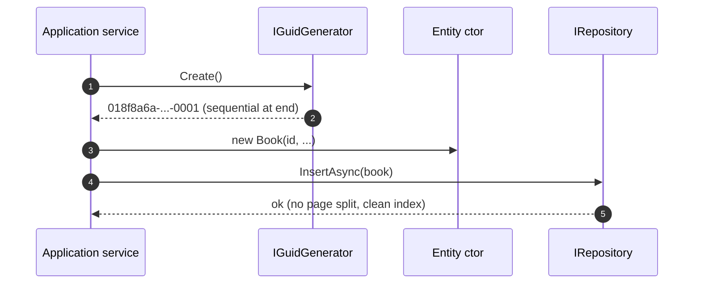

ABP entities default to `Guid` primary keys, but the framework deliberately does **not** use `Guid.NewGuid()`. Random GUIDs are awful B-tree clustering keys — they fragment indexes and inflate page splits. The [`Volo.Abp.Guids`](https://github.com/abpframework/abp/tree/dev/framework/src/Volo.Abp.Guids) package replaces that with `SequentialGuidGenerator`, which combines a timestamp with cryptographic randomness in the layout your database prefers.

## The contract

```csharp
// framework/src/Volo.Abp.Guids/Volo/Abp/Guids/IGuidGenerator.cs
public interface IGuidGenerator
{
    Guid Create();
}
```

One method. The whole point is that everywhere in your code base you write `_guidGenerator.Create()` instead of `Guid.NewGuid()`, and the implementation decides the layout.

## Two implementations

```csharp
// framework/src/Volo.Abp.Guids/Volo/Abp/Guids/SimpleGuidGenerator.cs
public class SimpleGuidGenerator : IGuidGenerator
{
    public static SimpleGuidGenerator Instance { get; } = new SimpleGuidGenerator();

    public virtual Guid Create()
    {
        return Guid.NewGuid();
    }
}
```

`SimpleGuidGenerator` is a singleton wrapper around `Guid.NewGuid()` — used when you specifically don't want sequential GUIDs (e.g. an anti-correlation use case where a sequential ID would leak timing information). Not registered with the container; reach for `SimpleGuidGenerator.Instance` directly.

The default-registered implementation is `SequentialGuidGenerator`.

## `SequentialGuidGenerator`

```csharp
// framework/src/Volo.Abp.Guids/Volo/Abp/Guids/SequentialGuidGenerator.cs
/* This code is taken from jhtodd/SequentialGuid */

public class SequentialGuidGenerator : IGuidGenerator, ITransientDependency
{
    public AbpSequentialGuidGeneratorOptions Options { get; }

    private static readonly RandomNumberGenerator RandomNumberGenerator = RandomNumberGenerator.Create();

    public SequentialGuidGenerator(IOptions<AbpSequentialGuidGeneratorOptions> options)
    {
        Options = options.Value;
    }

    public Guid Create()
    {
        return Create(Options.GetDefaultSequentialGuidType());
    }

    public Guid Create(SequentialGuidType guidType)
    {
        // We start with 16 bytes of cryptographically strong random data.
        var randomBytes = new byte[10];
        RandomNumberGenerator.GetBytes(randomBytes);

        // Using millisecond resolution for our 48-bit timestamp gives us
        // about 5900 years before the timestamp overflows and cycles.
        long timestamp = DateTime.UtcNow.Ticks / 10000L;

        byte[] timestampBytes = BitConverter.GetBytes(timestamp);
        if (BitConverter.IsLittleEndian)
        {
            Array.Reverse(timestampBytes);
        }

        byte[] guidBytes = new byte[16];

        switch (guidType)
        {
            case SequentialGuidType.SequentialAsString:
            case SequentialGuidType.SequentialAsBinary:

                // For string and byte-array version, we copy the timestamp first,
                // followed by the random data.
                Buffer.BlockCopy(timestampBytes, 2, guidBytes, 0, 6);
                Buffer.BlockCopy(randomBytes, 0, guidBytes, 6, 10);

                // If formatting as a string, we have to compensate for the fact
                // that .NET regards the Data1 and Data2 block as an Int32 and an Int16,
                // respectively. That means that it switches the order on little-endian
                // systems. So again, we have to reverse.
                if (guidType == SequentialGuidType.SequentialAsString && BitConverter.IsLittleEndian)
                {
                    Array.Reverse(guidBytes, 0, 4);
                    Array.Reverse(guidBytes, 4, 2);
                }
                break;

            case SequentialGuidType.SequentialAtEnd:

                // For sequential-at-the-end versions, we copy the random data first,
                // followed by the timestamp.
                Buffer.BlockCopy(randomBytes, 0, guidBytes, 0, 10);
                Buffer.BlockCopy(timestampBytes, 2, guidBytes, 10, 6);
                break;
        }

        return new Guid(guidBytes);
    }
}
```

Three properties worth internalizing:

| Property | Why |
| --- | --- |
| **6-byte millisecond timestamp.** | Lasts about 5,900 years before wrap. Plenty. |
| **10 bytes of cryptographic randomness** (`RandomNumberGenerator.GetBytes`). | Even within the same millisecond, two GUIDs are virtually guaranteed to differ. |
| **The layout depends on the chosen `SequentialGuidType`.** | Because SQL Server, MySQL/Postgres, and Oracle all sort GUIDs differently. |

The class is `ITransientDependency` and `IOptions<AbpSequentialGuidGeneratorOptions>` is bound, so any module can `Configure<AbpSequentialGuidGeneratorOptions>(o => o.DefaultSequentialGuidType = ...)`.

## `SequentialGuidType` — choose the layout your database wants

```csharp
// framework/src/Volo.Abp.Guids/Volo/Abp/Guids/SequentialGuidType.cs
public enum SequentialGuidType
{
    /// <summary>
    /// The GUID should be sequential when formatted using the <see cref="Guid.ToString()"/> method.
    /// Used by MySql and PostgreSql.
    /// </summary>
    SequentialAsString,

    /// <summary>
    /// The GUID should be sequential when formatted using the <see cref="Guid.ToByteArray()"/> method.
    /// Used by Oracle.
    /// </summary>
    SequentialAsBinary,

    /// <summary>
    /// The sequential portion of the GUID should be located at the end of the Data4 block.
    /// Used by SqlServer.
    /// </summary>
    SequentialAtEnd
}
```

The decision matrix:

| Database | Recommended `SequentialGuidType` | Why |
| --- | --- | --- |
| SQL Server | `SequentialAtEnd` | SQL Server compares GUIDs by the **last** 6 bytes (the Data4 block) first. Putting the timestamp there makes new rows insert at the end of the index. |
| MySQL | `SequentialAsString` | MySQL's GUID-as-CHAR(36) column sorts lexicographically on the string form. |
| PostgreSQL | `SequentialAsString` | UUIDs in Postgres sort by the canonical hex string. |
| Oracle | `SequentialAsBinary` | Oracle treats RAW(16) as a byte array — byte order matches `Guid.ToByteArray()`. |

The endian fix-up in the `SequentialAsString` branch (reversing bytes 0..4 and 4..6) is what aligns .NET's mixed-endian GUID representation with the string form clients see.

## `AbpSequentialGuidGeneratorOptions`

```csharp
// framework/src/Volo.Abp.Guids/Volo/Abp/Guids/AbpSequentialGuidGeneratorOptions.cs
public class AbpSequentialGuidGeneratorOptions
{
    /// <summary>
    /// Default value: null (unspecified).
    /// Use <see cref="GetDefaultSequentialGuidType"/> method
    /// to get the value on use, since it fall backs to a default value.
    /// </summary>
    public SequentialGuidType? DefaultSequentialGuidType { get; set; }

    /// <summary>
    /// Get the <see cref="DefaultSequentialGuidType"/> value
    /// or returns <see cref="SequentialGuidType.SequentialAtEnd"/>
    /// if <see cref="DefaultSequentialGuidType"/> was null.
    /// </summary>
    public SequentialGuidType GetDefaultSequentialGuidType()
    {
        return DefaultSequentialGuidType ?? SequentialGuidType.SequentialAtEnd;
    }
}
```

| Field | Default | When to set |
| --- | --- | --- |
| `DefaultSequentialGuidType` | `null` → resolves to `SequentialAtEnd` | Set it explicitly in your `MyDbModule` when running on MySQL / Postgres / Oracle. |

Wire it up in a module that knows the database provider:

```csharp
public class MyEntityFrameworkCoreModule : AbpModule
{
    public override void ConfigureServices(ServiceConfigurationContext context)
    {
        Configure<AbpSequentialGuidGeneratorOptions>(options =>
        {
            options.DefaultSequentialGuidType = SequentialGuidType.SequentialAsString;
        });
    }
}
```

The EF Core, MongoDB, and database-provider integration modules in [Volo.Abp.EntityFrameworkCore.\*](https://github.com/abpframework/abp/tree/dev/framework/src/Volo.Abp.EntityFrameworkCore) already do this for SQL Server / PostgreSQL / MySQL out of the box — your app code typically doesn't have to.

## `AbpGuidsModule`

```csharp
// framework/src/Volo.Abp.Guids/Volo/Abp/Guids/AbpGuidsModule.cs
public class AbpGuidsModule : AbpModule
{
}
```

Empty. The `ITransientDependency` marker on `SequentialGuidGenerator` plus `IExposedServiceTypesProvider`'s default-services rule are enough — no manual `services.AddTransient<IGuidGenerator, SequentialGuidGenerator>()`. The conventional registrar (see [Dependency injection](/core/dependency-injection)) handles it.

Modules that need GUIDs depend on this module transitively via `Volo.Abp.Domain` or one of the database provider modules.

## Why this matters: B-tree clustering keys

The reason every ABP entity defaults to a sequential GUID is purely about index hygiene. A clustered index ordered by a random GUID:

- Inserts land at random positions in the B-tree.
- Each insert often forces a page split.
- The index becomes fragmented within hours of write traffic.
- Range scans are slow because logically adjacent rows are physically scattered.

A sequential GUID:

- New inserts land at the *end* of the index.
- No page splits in the steady state.
- Range scans of "recently created rows" are sequential reads.

The randomness in the lower 10 bytes still makes the GUID unique enough that you can generate them client-side without consulting the server.

## How an entity gets a GUID



The factory pattern in `AbpControllerBase` and `ApplicationService` exposes `GuidGenerator` directly — see [DDD application services](/ddd/application) — so domain code rarely sees `IGuidGenerator` explicitly.

## Tradeoffs and edge cases

<AccordionGroup>
  <Accordion title="Sequential GUIDs reveal creation time">
    The first 6 bytes are a millisecond timestamp. If you sort GUIDs you can infer creation order; if you know the algorithm, you can infer wall-clock time within a millisecond. Don't use sequential GUIDs as opaque tokens (password reset, anti-CSRF) — use `SimpleGuidGenerator.Instance.Create()` or a dedicated token generator.
  </Accordion>
  <Accordion title="Clock skew between hosts is OK">
    The randomness is 10 bytes — far more than enough to avoid collisions even if two app servers have clocks a second apart. The only consequence of skew is that rows from one host may interleave with rows from another at the index tail; that's harmless.
  </Accordion>
  <Accordion title="Don't write Guid.NewGuid() in entity code">
    Even in DTO ↔ entity mapping. Take `IGuidGenerator` in the constructor (or use the inherited `GuidGenerator` property on `ApplicationService`). The conventional pattern is `entity.SetId(_guidGenerator.Create())` or passing the id into the constructor.
  </Accordion>
  <Accordion title="Test seeding wants deterministic GUIDs">
    Replace `IGuidGenerator` with a fake that returns `Guid.Empty`-derived values: `[Dependency(ReplaceServices = true)] public class TestGuidGenerator : IGuidGenerator, ISingletonDependency { public Guid Create() => Guid.Parse("..."); }`. See [Dependency injection](/core/dependency-injection#dependency--explicit-lifetime--override-flags) for the override pattern.
  </Accordion>
</AccordionGroup>

## Related reading

<CardGroup cols={2}>
  <Card title="Timing" icon="clock" href="/core/timing">
    `IClock` and `SequentialGuidGenerator` both touch `DateTime.UtcNow` — the difference is that the GUID generator goes direct (for performance and isolation from clock policy).
  </Card>
  <Card title="Dependency injection" icon="diagram-project" href="/core/dependency-injection">
    How `[Dependency(ReplaceServices = true)]` swaps in a test double for `IGuidGenerator`.
  </Card>
  <Card title="DDD entities" icon="cubes" href="/ddd/overview">
    The `Entity<Guid>` and aggregate-root base classes that consume `IGuidGenerator`.
  </Card>
  <Card title="Data providers" icon="database" href="/data/overview">
    Which database-provider module wires the right `SequentialGuidType` for you.
  </Card>
</CardGroup>
