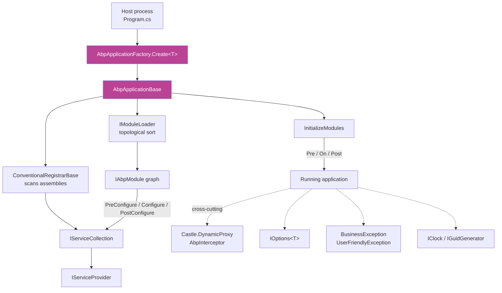

The ABP framework is built on a small, opinionated runtime that lives inside the [`Volo.Abp.Core`](https://github.com/abpframework/abp/tree/dev/framework/src/Volo.Abp.Core) project and a handful of sibling packages (`Volo.Abp.Threading`, `Volo.Abp.Timing`, `Volo.Abp.Guids`, `Volo.Abp.Serialization`, `Volo.Abp.Json`). This **Core Runtime** group is your reference for everything that happens before a single domain service, repository, or controller is constructed: how the application boots, how modules compose, how services are registered, how options flow, how exceptions are classified, and how the cross-cutting interception pipeline works.

This page is the index. Every box below opens a deep dive that quotes the actual C# source from `framework/src/Volo.Abp.Core/` so you can follow the framework from `AbpApplicationFactory.Create<TStartupModule>()` all the way down to `Castle.DynamicProxy` interception of an [application service](/ddd/application).

## Where this fits

The 11 pages below walk every node on that diagram.

## Pages in this group

<CardGroup cols={2}>
  <Card title="Volo.Abp.Core package" icon="cube" href="/core/volo-abp-core">
    Folder-by-folder tour of `framework/src/Volo.Abp.Core/Volo/Abp/` — what lives in Aspects, Bundling, Collections, Content, DependencyInjection, DynamicProxy, ExceptionHandling, Http, IO, Localization, Logging, Modularity, Reflection, Threading, Tracing.
  </Card>
  <Card title="AbpApplicationBase lifecycle" icon="play" href="/core/abp-application-base">
    `AbpApplicationFactory.Create<TStartupModule>`, the internal / external variants, `ConfigureServices`, `InitializeModules`, `Shutdown`, and the `ApplicationInitializationContext` / `ApplicationShutdownContext` carriers.
  </Card>
  <Card title="Modularity" icon="puzzle-piece" href="/core/modularity">
    `AbpModule`, `[DependsOn]`, `[AdditionalAssembly]`, the `IPre/Post ConfigureServices` and `IOn(Pre|Post)ApplicationInitialization` hooks, `ModuleLoader`, `ModuleManager`, and PlugIn sources.
  </Card>
  <Card title="Dependency injection" icon="diagram-project" href="/core/dependency-injection">
    `ConventionalRegistrarBase`, `DefaultConventionalRegistrar`, `[ExposeServices]`, `[Dependency]`, the `I*Dependency` marker interfaces, `IAbpLazyServiceProvider`, `CachedServiceProvider`, `IObjectAccessor`, and keyed services.
  </Card>
  <Card title="Options & configuration" icon="sliders" href="/core/options-and-configuration">
    How `IConfiguration` is discovered, how `PreConfigure<T>` / `Configure<T>` / `PostConfigure<T>` layer on top of the Microsoft.Extensions.Options pattern, and the `AbpOptionsFactory`.
  </Card>
  <Card title="Exception handling" icon="triangle-exclamation" href="/core/exception-handling">
    The exception taxonomy: `AbpException`, `AbpInitializationException`, `BusinessException`, `IUserFriendlyException`, and the `IHasErrorCode` / `IHasErrorDetails` / `IHasHttpStatusCode` contracts consumed by the HTTP middleware.
  </Card>
  <Card title="Threading & async" icon="bolt" href="/core/threading-and-async">
    `AsyncHelper.RunSync`, `AbpAsyncTimer`, `ICancellationTokenProvider`, ambient scope providers, and the `AsyncLocalAmbientDataContext`.
  </Card>
  <Card title="Timing" icon="clock" href="/core/timing">
    The `IClock` abstraction, `AbpClockOptions.Kind`, `DateTime` normalization, `Convert{ToUserTime,ToUtc}`, time zone providers, and the `[DisableDateTimeNormalization]` opt-out.
  </Card>
  <Card title="Guids" icon="fingerprint" href="/core/guids">
    `IGuidGenerator`, `SequentialGuidGenerator`, `SequentialGuidType` (string / binary / at-end), `AbpSequentialGuidGeneratorOptions`, and why ABP entities use sequential GUIDs.
  </Card>
  <Card title="Serialization" icon="file-code" href="/core/serialization">
    `IObjectSerializer`, `DefaultObjectSerializer`, the `IObjectSerializer<T>` per-type contract, and how `Volo.Abp.Json` plugs the System.Text.Json or Newtonsoft.Json backends underneath.
  </Card>
  <Card title="Dynamic proxy & aspects" icon="layer-group" href="/core/dynamic-proxy-and-aspects">
    `IAbpInterceptor`, `AbpInterceptor`, `IAbpMethodInvocation`, `ProxyHelper`, `AbpCrossCuttingConcerns`, and how Castle.DynamicProxy wires interceptors onto registered services.
  </Card>
</CardGroup>

## How the runtime layers stack

<Note>
  Reading order matters. Start with **AbpApplicationBase** to see the lifecycle, then **Modularity** to understand who participates in it, then **Dependency injection** to see how services land in the container, and finally the cross-cutting pages (**Options**, **Exception handling**, **Aspects**) for the runtime services that everything else consumes.
</Note>

| Layer | Owning page | Source root |
| --- | --- | --- |
| Composition / boot | [AbpApplicationBase lifecycle](/core/abp-application-base) | `framework/src/Volo.Abp.Core/Volo/Abp/AbpApplicationBase.cs` |
| Module graph | [Modularity](/core/modularity) | `framework/src/Volo.Abp.Core/Volo/Abp/Modularity/` |
| Service registration | [Dependency injection](/core/dependency-injection) | `framework/src/Volo.Abp.Core/Volo/Abp/DependencyInjection/` |
| Configuration | [Options & configuration](/core/options-and-configuration) | `framework/src/Volo.Abp.Core/Volo/Abp/Options/` |
| Errors | [Exception handling](/core/exception-handling) | `framework/src/Volo.Abp.Core/Volo/Abp/ExceptionHandling/` + root `*Exception.cs` |
| Concurrency | [Threading & async](/core/threading-and-async) | `framework/src/Volo.Abp.Threading/Volo/Abp/Threading/` |
| Time | [Timing](/core/timing) | `framework/src/Volo.Abp.Timing/Volo/Abp/Timing/` |
| Identity values | [Guids](/core/guids) | `framework/src/Volo.Abp.Guids/Volo/Abp/Guids/` |
| Bytes ↔ objects | [Serialization](/core/serialization) | `framework/src/Volo.Abp.Serialization/Volo/Abp/Serialization/` |
| Interception | [Dynamic proxy & aspects](/core/dynamic-proxy-and-aspects) | `framework/src/Volo.Abp.Core/Volo/Abp/{Aspects,DynamicProxy}/` |

## What the Core does *not* cover

The Core runtime is intentionally domain-free. Anything that depends on a database, an HTTP request, or a user identity lives in a sibling layer:

- Domain-driven design building blocks — entities, aggregate roots, repositories, domain services — see [DDD](/ddd/overview).
- Data access providers (EF Core, MongoDB, Dapper) — see [Data layer](/data/overview).
- ASP.NET Core MVC integration, Swagger, OpenIddict — see [ASP.NET Core integration](/aspnetcore/overview).
- Background jobs, distributed events, BLOBs, virtual file system — these are independent feature packages that all consume the Core abstractions documented in this group.

<Warning>
  The Core packages have **zero** dependencies on ASP.NET Core hosting. You can boot an `AbpApplicationWithInternalServiceProvider` inside a console app, a WPF window, or a worker service — the lifecycle, module graph, and DI semantics are identical. See [AbpApplicationBase lifecycle](/core/abp-application-base) for the host-agnostic boot recipe.
</Warning>

## Conventions used across these pages

<AccordionGroup>
  <Accordion title="Every code excerpt is from a real file">
    Code blocks are copied verbatim from `framework/src/Volo.Abp.Core/` (or its siblings) at the path shown in the comment header. No pseudo-code, no shortened signatures.
  </Accordion>
  <Accordion title="Tables for enumerations and contracts">
    When a feature has a finite set of options (`SequentialGuidType`, `ServiceLifetime`, lifecycle phases) we use a Markdown table so you can scan it at a glance.
  </Accordion>
  <Accordion title="Cross-links instead of duplication">
    A concept is documented in one place. If the [Modularity](/core/modularity) page mentions `ServiceConfigurationContext.Services.Configure<T>`, the implementation details live on [Options & configuration](/core/options-and-configuration).
  </Accordion>
</AccordionGroup>
