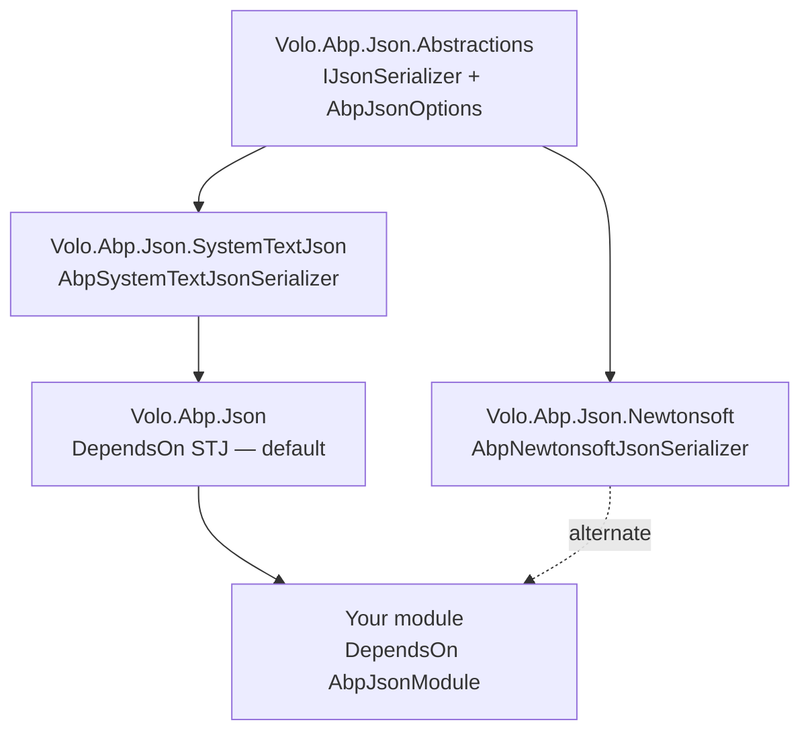

ABP has two complementary serialization stories. **Object serialization** turns an arbitrary object into a `byte[]` (and back) for places that move opaque blobs — the distributed cache is the obvious consumer. **JSON serialization** is a separate abstraction that translates between objects and JSON strings for HTTP responses, audit logs, and configuration. Both live outside `Volo.Abp.Core` in dedicated sibling packages.

## Two packages, two contracts

| Package | Contract | When to use |
| --- | --- | --- |
| [`Volo.Abp.Serialization`](https://github.com/abpframework/abp/tree/dev/framework/src/Volo.Abp.Serialization) | `IObjectSerializer`, `IObjectSerializer<T>` | Cache layers, generic blob storage. Bytes in, bytes out. |
| [`Volo.Abp.Json.Abstractions`](https://github.com/abpframework/abp/tree/dev/framework/src/Volo.Abp.Json.Abstractions) + [`Volo.Abp.Json`](https://github.com/abpframework/abp/tree/dev/framework/src/Volo.Abp.Json) | `IJsonSerializer` | HTTP boundaries, audit logging, anything that needs a human-readable representation. |

## `IObjectSerializer`

The contract is two methods — and the per-type variant is a separate interface so consumers can register specialized serializers for specific shapes:

```csharp
// framework/src/Volo.Abp.Serialization/Volo/Abp/Serialization/IObjectSerializer.cs
public interface IObjectSerializer
{
    byte[]? Serialize<T>(T? obj);
    T? Deserialize<T>(byte[] bytes);
}

public interface IObjectSerializer<T>
{
    byte[]? Serialize(T? obj);
    T? Deserialize(byte[]? bytes);
}
```

The plural-versus-singular distinction matters: a consumer that takes `IObjectSerializer` calls into the generic implementation; a consumer that takes `IObjectSerializer<MyType>` gets a type-specific one. The default object serializer reconciles them.

## `DefaultObjectSerializer`

```csharp
// framework/src/Volo.Abp.Serialization/Volo/Abp/Serialization/DefaultObjectSerializer.cs
public class DefaultObjectSerializer : IObjectSerializer, ITransientDependency
{
    private readonly IServiceProvider _serviceProvider;

    public DefaultObjectSerializer(IServiceProvider serviceProvider)
    {
        _serviceProvider = serviceProvider;
    }

    public virtual byte[]? Serialize<T>(T? obj)
    {
        if (obj == null) { return null; }

        //Check if a specific serializer is registered
        using (var scope = _serviceProvider.CreateScope())
        {
            var specificSerializer = scope.ServiceProvider.GetService<IObjectSerializer<T>>();
            if (specificSerializer != null)
            {
                return specificSerializer.Serialize(obj);
            }
        }

        return AutoSerialize(obj);
    }

    public virtual T? Deserialize<T>(byte[]? bytes)
    {
        if (bytes == null) { return default; }

        using (var scope = _serviceProvider.CreateScope())
        {
            var specificSerializer = scope.ServiceProvider.GetService<IObjectSerializer<T>>();
            if (specificSerializer != null)
            {
                return specificSerializer.Deserialize(bytes);
            }
        }

        return AutoDeserialize<T>(bytes);
    }

    protected virtual byte[] AutoSerialize<T>(T obj)
    {
        return JsonSerializer.SerializeToUtf8Bytes(obj);
    }

    protected virtual T? AutoDeserialize<T>(byte[] bytes)
    {
        return JsonSerializer.Deserialize<T>(bytes);
    }
}
```

The flow:

| Step | Behavior |
| --- | --- |
| 1 | Null-check. `byte[]? Serialize(null)` returns `null` (and `Deserialize(null)` returns `default`). |
| 2 | Open a scope, look for an `IObjectSerializer<T>` registered for the concrete `T`. If present, delegate. |
| 3 | Otherwise fall back to `System.Text.Json.JsonSerializer.SerializeToUtf8Bytes` / `Deserialize`. |

The fallback is intentionally System.Text.Json: it's the lowest-common-denominator format that works without a sibling JSON package being installed. If your project needs Newtonsoft semantics (private setters, `JObject`, dynamic), register a custom `IObjectSerializer<T>` for the type, or replace `DefaultObjectSerializer` outright.

## How `IObjectSerializer<T>` gets discovered

```csharp
// framework/src/Volo.Abp.Serialization/Volo/Abp/Serialization/AbpSerializationModule.cs
public class AbpSerializationModule : AbpModule
{
    public override void PreConfigureServices(ServiceConfigurationContext context)
    {
        context.Services.OnExposing(onServiceExposingContext =>
        {
            //Register types for IObjectSerializer<T> if implements
            onServiceExposingContext.ExposedTypes.AddRange(
                ReflectionHelper.GetImplementedGenericTypes(
                    onServiceExposingContext.ImplementationType,
                    typeof(IObjectSerializer<>)
                ).ConvertAll(t => new ServiceIdentifier(t))
            );
        });
    }
}
```

The hook is registered via `services.OnExposing(...)` (see [Dependency injection](/core/dependency-injection#onserviceregistred-onserviceexposing-onserviceactivated)). For every type that goes through the conventional registrar, the module inspects its interfaces, and **automatically adds** every closed `IObjectSerializer<T>` it implements to the exposed-services list. That means writing:

```csharp
public class BookObjectSerializer : IObjectSerializer<Book>, ITransientDependency
{
    public byte[]? Serialize(Book? obj) { /* ... */ }
    public Book? Deserialize(byte[]? bytes) { /* ... */ }
}
```

is enough — the registrar discovers `IObjectSerializer<Book>` from the class's interface list, and `DefaultObjectSerializer.Serialize<Book>(book)` immediately starts routing through `BookObjectSerializer`.

## Cache integration

The distributed cache (in `Volo.Abp.Caching`) takes `IObjectSerializer` to translate cache entries before pushing them to Redis or the in-memory provider. That means a per-type serializer changes both the on-disk format and how the cache encodes that type — useful for compact custom formats (protobuf, MessagePack) without changing the cache consumer's code.

## The JSON stack: abstractions vs. implementation

`Volo.Abp.Json.Abstractions` ships the contract. `Volo.Abp.Json` is the **default module** that depends on the System.Text.Json backend. `Volo.Abp.Json.SystemTextJson` and `Volo.Abp.Json.Newtonsoft` are the two interchangeable implementations.

```csharp
// framework/src/Volo.Abp.Json.Abstractions/Volo/Abp/Json/IJsonSerializer.cs
public interface IJsonSerializer
{
    string Serialize(object obj, bool camelCase = true, bool indented = false);

    T Deserialize<T>(string jsonString, bool camelCase = true);

    object Deserialize(Type type, string jsonString, bool camelCase = true);
}
```

Three methods, both generic and non-generic deserialize, opt-in `camelCase` and `indented` parameters. `camelCase = true` is the framework default — controllers, audit logs, and DTO mapping all emit camelCase JSON unless overridden.

## `AbpJsonOptions`

```csharp
// framework/src/Volo.Abp.Json.Abstractions/Volo/Abp/Json/AbpJsonOptions.cs
public class AbpJsonOptions
{
    /// <summary>
    /// Formats of input JSON date, Empty string means default format.
    /// </summary>
    public List<string> InputDateTimeFormats { get; set; }

    /// <summary>
    /// Format of output json date, Null or empty string means default format.
    /// </summary>
    public string? OutputDateTimeFormat { get; set; }

    public AbpJsonOptions()
    {
        InputDateTimeFormats = new List<string>();
    }
}
```

| Property | Effect |
| --- | --- |
| `InputDateTimeFormats` | Accepted formats when parsing a `DateTime` from a JSON string. Empty → fall back to the serializer's default. |
| `OutputDateTimeFormat` | Format used when writing a `DateTime`. Null → the serializer's default (ISO 8601 in System.Text.Json). |

Configure in a module:

```csharp
Configure<AbpJsonOptions>(options =>
{
    options.OutputDateTimeFormat = "yyyy-MM-dd HH:mm:ss";
    options.InputDateTimeFormats.AddRange(new[] { "yyyy-MM-dd", "yyyy-MM-dd HH:mm:ss" });
});
```

These hook into both the System.Text.Json and Newtonsoft implementations via shared converters that read `AbpJsonOptions` at serialization time. The Newtonsoft and System.Text.Json modules ship dedicated `IsoDateTimeConverter` shims that read these options.

## `AbpJsonModule` — the default wiring

```csharp
// framework/src/Volo.Abp.Json/Volo/Abp/Json/AbpJsonModule.cs
[DependsOn(typeof(AbpJsonSystemTextJsonModule))]
public class AbpJsonModule : AbpModule { }
```

Empty module body — its only job is to pull in the System.Text.Json implementation. To switch backends, replace your `[DependsOn(typeof(AbpJsonModule))]` with `[DependsOn(typeof(AbpJsonNewtonsoftModule))]` in the consuming module.



## Choosing between the two stacks

<Tabs>
  <Tab title="System.Text.Json (default)">
    - Faster, lower allocation, ahead-of-time friendly.
    - Stricter — public read-only properties don't serialize by default; private setters don't deserialize.
    - Use for new code unless you have a specific Newtonsoft feature you can't replace.
  </Tab>
  <Tab title="Newtonsoft.Json">
    - More forgiving with quirky JSON, `JObject`/`JArray`/`JToken` for dynamic shapes.
    - Required if you have polymorphic deserialization with `$type` markers from legacy APIs.
    - Slightly bigger, slightly slower; widely battle-tested.
  </Tab>
  <Tab title="Per-type override">
    - Keep the default and register `IObjectSerializer<T>` for the awkward type only.
    - Lets the cache layer skip System.Text.Json entirely for a specific domain object while everything else stays default.
  </Tab>
</Tabs>

## Patterns

<AccordionGroup>
  <Accordion title="Don't reach for System.Text.Json or Newtonsoft directly">
    Take `IJsonSerializer` in your constructor. That keeps your code agnostic to which backend is wired up, and `AbpJsonOptions` (date formats, camelCase policy) applies automatically.
  </Accordion>
  <Accordion title="Don't use IObjectSerializer for HTTP responses">
    `IObjectSerializer` produces *bytes*. HTTP responses are *strings* (and a `Content-Type`). The MVC integration is built on `IJsonSerializer`. Use the right tool: `IObjectSerializer` for cache blobs, `IJsonSerializer` for HTTP and logs.
  </Accordion>
  <Accordion title="Register IObjectSerializer<T> when you have a hot path">
    A per-type serializer that emits MessagePack or Protobuf can cut your distributed-cache footprint by 3-5×. The `AbpSerializationModule.OnExposing` hook does the discovery automatically — just implement the interface.
  </Accordion>
  <Accordion title="Set DateTime formats once, in your top-level module">
    `AbpJsonOptions.OutputDateTimeFormat` is global. Configuring it in multiple modules just lets the *last* one win (whichever runs last in dependency order). Put the policy in your startup module.
  </Accordion>
</AccordionGroup>

## `AbpSystemTextJsonSerializer` under the hood

The default implementation that ships with `Volo.Abp.Json.SystemTextJson` is a thin wrapper that caches `JsonSerializerOptions` instances per `(camelCase, indented, AbpJsonOptions)` key:

```csharp
// framework/src/Volo.Abp.Json.SystemTextJson/Volo/Abp/Json/SystemTextJson/AbpSystemTextJsonSerializer.cs (excerpt)
public class AbpSystemTextJsonSerializer : IJsonSerializer, ITransientDependency
{
    protected AbpSystemTextJsonSerializerOptions Options { get; }

    public AbpSystemTextJsonSerializer(IOptions<AbpSystemTextJsonSerializerOptions> options)
    {
        Options = options.Value;
    }

    public string Serialize(object obj, bool camelCase = true, bool indented = false)
    {
        return JsonSerializer.Serialize(obj, CreateJsonSerializerOptions(camelCase, indented));
    }

    public T Deserialize<T>(string jsonString, bool camelCase = true)
    {
        return JsonSerializer.Deserialize<T>(jsonString, CreateJsonSerializerOptions(camelCase))!;
    }

    public object Deserialize(Type type, string jsonString, bool camelCase = true)
    {
        return JsonSerializer.Deserialize(jsonString, type, CreateJsonSerializerOptions(camelCase))!;
    }
}
```

`AbpSystemTextJsonSerializerOptions.JsonSerializerOptions` is the underlying System.Text.Json options instance — you can add custom converters to it from a module's `ConfigureServices`:

```csharp
Configure<AbpSystemTextJsonSerializerOptions>(options =>
{
    options.JsonSerializerOptions.Converters.Add(new MyMoneyConverter());
});
```

The Newtonsoft variant ships analogous types (`AbpNewtonsoftJsonSerializer`, `AbpNewtonsoftJsonSerializerOptions`) in `Volo.Abp.Json.Newtonsoft`. Both honor `AbpJsonOptions.OutputDateTimeFormat` via dedicated `DateTime`/`DateTimeOffset` converters so date formatting is consistent regardless of which backend is selected.

## Per-type round trip: a worked example

```csharp
public sealed class CompactBookSerializer : IObjectSerializer<Book>, ITransientDependency
{
    public byte[]? Serialize(Book? book)
    {
        if (book == null) return null;
        // Custom binary format: [id (16 bytes)][title length (4)][title (UTF-8)]
        var titleBytes = Encoding.UTF8.GetBytes(book.Title ?? string.Empty);
        var buffer = new byte[16 + 4 + titleBytes.Length];
        book.Id.TryWriteBytes(buffer.AsSpan(0, 16));
        BinaryPrimitives.WriteInt32LittleEndian(buffer.AsSpan(16, 4), titleBytes.Length);
        titleBytes.CopyTo(buffer.AsSpan(20));
        return buffer;
    }

    public Book? Deserialize(byte[]? bytes)
    {
        if (bytes == null || bytes.Length < 20) return null;
        var id = new Guid(bytes.AsSpan(0, 16));
        var len = BinaryPrimitives.ReadInt32LittleEndian(bytes.AsSpan(16, 4));
        var title = Encoding.UTF8.GetString(bytes, 20, len);
        return new Book(id, title);
    }
}
```

No registration code needed — `AbpSerializationModule.PreConfigureServices` discovers the closed `IObjectSerializer<Book>` interface and routes `DefaultObjectSerializer.Serialize<Book>(...)` through it automatically. Cache layers immediately benefit; other consumers of `IObjectSerializer` are unaffected.

## Related reading

<CardGroup cols={2}>
  <Card title="Timing" icon="clock" href="/core/timing">
    `AbpJsonOptions` date formats interact with `IClock.Normalize`. Setting both in the same place avoids time-zone surprises.
  </Card>
  <Card title="Dependency injection" icon="diagram-project" href="/core/dependency-injection">
    The `OnExposing` hook that `AbpSerializationModule` uses to auto-register `IObjectSerializer<T>` implementations.
  </Card>
  <Card title="Volo.Abp.Core tour" icon="cube" href="/core/volo-abp-core">
    Where the serialization packages sit in the broader source tree.
  </Card>
  <Card title="ASP.NET Core integration" icon="server" href="/aspnetcore/overview">
    The MVC formatter that consumes `IJsonSerializer` for HTTP responses.
  </Card>
</CardGroup>
