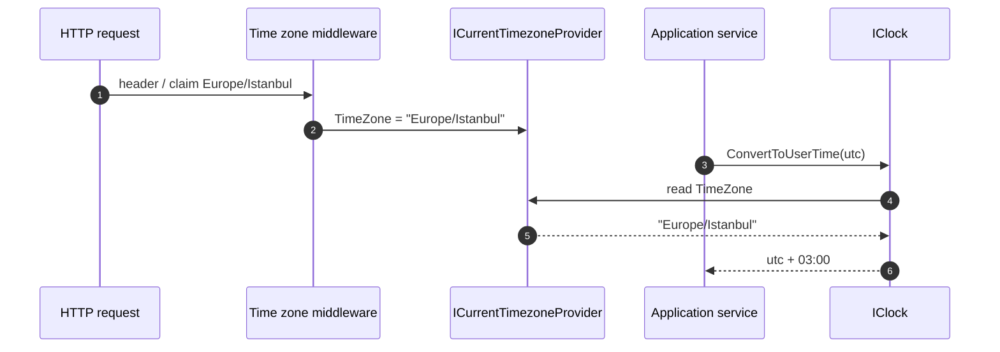

ABP wraps `DateTime.Now` behind an interface so the framework can normalize `DateTimeKind`, convert to the caller's time zone, and stub time in tests without rewriting domain code. The package is [`Volo.Abp.Timing`](https://github.com/abpframework/abp/tree/dev/framework/src/Volo.Abp.Timing), entirely contained in `framework/src/Volo.Abp.Timing/Volo/Abp/Timing/`.

## The contract

```csharp
// framework/src/Volo.Abp.Timing/Volo/Abp/Timing/IClock.cs
public interface IClock
{
    DateTime Now { get; }
    DateTimeKind Kind { get; }
    bool SupportsMultipleTimezone { get; }

    DateTime Normalize(DateTime dateTime);
    DateTime ConvertToUserTime(DateTime utcDateTime);
    DateTimeOffset ConvertToUserTime(DateTimeOffset dateTimeOffset);
    DateTime ConvertToUtc(DateTime dateTime);
}
```

| Member | Returns |
| --- | --- |
| `Now` | The current time, with `Kind` matching `AbpClockOptions.Kind`. Either `DateTime.UtcNow` (if `Kind == Utc`) or `DateTime.Now`. |
| `Kind` | The framework-wide `DateTimeKind` policy (default `Unspecified`). |
| `SupportsMultipleTimezone` | True iff `Kind == Utc`. Time zone conversion makes no sense if the framework isn't storing UTC. |
| `Normalize(dateTime)` | Coerces a `DateTime` into the configured `Kind`, converting between `Local` and `Utc` as needed. |
| `ConvertToUserTime(utc)` | If `SupportsMultipleTimezone` and a user time zone is set, returns the local time for that zone. Otherwise returns the input unchanged. |
| `ConvertToUtc(dateTime)` | The inverse — used when the framework receives a local time it must store as UTC. |

## Default implementation

```csharp
// framework/src/Volo.Abp.Timing/Volo/Abp/Timing/Clock.cs
public class Clock : IClock, ITransientDependency
{
    protected AbpClockOptions Options { get; }
    protected ICurrentTimezoneProvider CurrentTimezoneProvider { get; }
    protected ITimezoneProvider TimezoneProvider { get; }

    public Clock(IOptions<AbpClockOptions> options,
                 ICurrentTimezoneProvider currentTimezoneProvider,
                 ITimezoneProvider timezoneProvider)
    {
        CurrentTimezoneProvider = currentTimezoneProvider;
        TimezoneProvider = timezoneProvider;
        Options = options.Value;
    }

    public virtual DateTime Now => Options.Kind == DateTimeKind.Utc ? DateTime.UtcNow : DateTime.Now;

    public virtual DateTimeKind Kind => Options.Kind;

    public virtual bool SupportsMultipleTimezone => Options.Kind == DateTimeKind.Utc;

    public virtual DateTime Normalize(DateTime dateTime)
    {
        if (Kind == DateTimeKind.Unspecified || Kind == dateTime.Kind)
        {
            return dateTime;
        }

        if (Kind == DateTimeKind.Local && dateTime.Kind == DateTimeKind.Utc)
        {
            return dateTime.ToLocalTime();
        }

        if (Kind == DateTimeKind.Utc && dateTime.Kind == DateTimeKind.Local)
        {
            return dateTime.ToUniversalTime();
        }

        return DateTime.SpecifyKind(dateTime, Kind);
    }
}
```

`Clock` is `ITransientDependency`, so the framework gets a fresh instance per resolution. The work is cheap; the indirection is the point.

### `ConvertToUserTime`

```csharp
public virtual DateTime ConvertToUserTime(DateTime utcDateTime)
{
    if (!SupportsMultipleTimezone ||
        utcDateTime.Kind != DateTimeKind.Utc ||
        CurrentTimezoneProvider.TimeZone.IsNullOrWhiteSpace())
    {
        return utcDateTime;
    }

    var timezoneInfo = TimezoneProvider.GetTimeZoneInfo(CurrentTimezoneProvider.TimeZone);
    return TimeZoneInfo.ConvertTime(utcDateTime, timezoneInfo);
}
```

Three gates before conversion: the framework must support time zones (`Kind == Utc`), the input must actually be UTC, and a user time zone must be configured. Any one missing means the input flows through untouched. There is a `DateTimeOffset` overload with the same gates and `TimeZoneInfo.ConvertTime(DateTimeOffset, TimeZoneInfo)`.

### `ConvertToUtc`

```csharp
public DateTime ConvertToUtc(DateTime dateTime)
{
    if (!SupportsMultipleTimezone ||
        dateTime.Kind == DateTimeKind.Utc ||
        CurrentTimezoneProvider.TimeZone.IsNullOrWhiteSpace())
    {
        return dateTime;
    }

    var timezoneInfo = TimezoneProvider.GetTimeZoneInfo(CurrentTimezoneProvider.TimeZone);
    dateTime = DateTime.SpecifyKind(dateTime, DateTimeKind.Unspecified);
    return TimeZoneInfo.ConvertTimeToUtc(dateTime, timezoneInfo);
}
```

The `SpecifyKind(..., Unspecified)` step is important: `TimeZoneInfo.ConvertTimeToUtc` throws if `Kind` is `Local` and the zone doesn't match the local zone. Forcing `Unspecified` says "I know what I'm doing — treat this as a wall-clock time in the given zone".

## `AbpClockOptions`

```csharp
// framework/src/Volo.Abp.Timing/Volo/Abp/Timing/AbpClockOptions.cs
public class AbpClockOptions
{
    /// <summary>
    /// Default: <see cref="DateTimeKind.Unspecified"/>
    /// </summary>
    public DateTimeKind Kind { get; set; }

    public AbpClockOptions()
    {
        Kind = DateTimeKind.Unspecified;
    }
}
```

Set it in a module's `ConfigureServices`:

```csharp
Configure<AbpClockOptions>(options =>
{
    options.Kind = DateTimeKind.Utc; // Recommended for multi-tenant / multi-timezone apps
});
```

| `Kind` value | Behavior |
| --- | --- |
| `Unspecified` (default) | `Now` returns `DateTime.Now`; no conversion is performed; `SupportsMultipleTimezone` is `false`. Safe default for single-tenant local apps. |
| `Utc` | `Now` returns `DateTime.UtcNow`; `Normalize` coerces inputs to UTC; `ConvertToUserTime` / `ConvertToUtc` actually do work. Use this when you serve users in multiple time zones. |
| `Local` | `Now` returns `DateTime.Now`; `Normalize` coerces inputs to local time; `SupportsMultipleTimezone` is still `false`. Useful for legacy local-only apps that want enforced consistency. |

## `ICurrentTimezoneProvider`

The contract is one property:

```csharp
public interface ICurrentTimezoneProvider
{
    string? TimeZone { get; set; }
}
```

The default implementation is an `AsyncLocal<string?>`:

```csharp
// framework/src/Volo.Abp.Timing/Volo/Abp/Timing/CurrentTimezoneProvider.cs
public class CurrentTimezoneProvider : ICurrentTimezoneProvider, ISingletonDependency
{
    public string? TimeZone
    {
        get => _currentScope.Value;
        set => _currentScope.Value = value;
    }

    private readonly AsyncLocal<string?> _currentScope;

    public CurrentTimezoneProvider() { _currentScope = new AsyncLocal<string?>(); }
}
```

The HTTP / UI layers set this from a header, a claim, or a user setting. From your code, you typically set it via the helper extension:

```csharp
using (_currentTimezoneProvider.Change("Europe/Istanbul"))
{
    var local = _clock.ConvertToUserTime(_clock.Now);
}
```

`Change` is in `CurrentTimezoneProviderExtensions.cs`, returning an `IDisposable` that restores the previous value.

## `ITimezoneProvider`

```csharp
public interface ITimezoneProvider
{
    TimeZoneInfo GetTimeZoneInfo(string timezone);
    List<NameValue> GetWindowsTimezones();
    List<NameValue> GetIanaTimezones();
}
```

The IANA names ("Europe/Istanbul", "America/New_York") are the canonical form ABP stores. `TZConvertTimezoneProvider` (the default) uses [TimeZoneConverter](https://www.nuget.org/packages/TimeZoneConverter) to map back and forth so that Windows hosts (which use `"Turkey Standard Time"`) and Linux hosts (IANA-native) both work:

```csharp
// framework/src/Volo.Abp.Timing/Volo/Abp/Timing/TimeZoneHelper.cs
public static List<NameValue> GetTimezones(List<NameValue> timezones)
{
    return timezones
        .OrderBy(x => x.Name)
        .Select(x => new NameValue($"{x.Name} ({GetTimezoneOffset(TZConvert.GetTimeZoneInfo(x.Name))})", x.Name))
        .ToList();
}

public static string GetTimezoneOffset(TimeZoneInfo timeZoneInfo)
{
    if (timeZoneInfo.BaseUtcOffset < TimeSpan.Zero)
    {
        return "-" + timeZoneInfo.BaseUtcOffset.ToString(@"hh\:mm");
    }
    return "+" + timeZoneInfo.BaseUtcOffset.ToString(@"hh\:mm");
}
```

## `[DisableDateTimeNormalization]` — opt-out

```csharp
// framework/src/Volo.Abp.Timing/Volo/Abp/Timing/DisableDateTimeNormalizationAttribute.cs
[AttributeUsage(AttributeTargets.Class | AttributeTargets.Property | AttributeTargets.Parameter)]
public class DisableDateTimeNormalizationAttribute : Attribute { }
```

ABP's MVC / Razor model binder calls `IClock.Normalize` on `DateTime` properties as they're bound, and the EF Core integration normalizes again on save. Applying this attribute tells both layers "leave this one alone":

```csharp
public class ScheduleDto
{
    public DateTime ScheduledForUtc { get; set; }

    [DisableDateTimeNormalization]
    public DateTime LocalRawInput { get; set; }
}
```

Use sparingly — usually for fields where the raw `DateTimeKind` is part of the data's meaning.

## `AbpTimingModule`

```csharp
// framework/src/Volo.Abp.Timing/Volo/Abp/Timing/AbpTimingModule.cs
[DependsOn(
    typeof(AbpLocalizationModule),
    typeof(AbpSettingsModule)
    )]
public class AbpTimingModule : AbpModule
{
    public override void ConfigureServices(ServiceConfigurationContext context)
    {
        Configure<AbpVirtualFileSystemOptions>(options =>
        {
            options.FileSets.AddEmbedded<AbpTimingModule>();
        });

        Configure<AbpLocalizationOptions>(options =>
        {
            options
                .Resources
                .Add<AbpTimingResource>("en")
                .AddVirtualJson("/Volo/Abp/Timing/Localization");
        });
    }
}
```

The module depends on Localization (so time zone labels can be translated) and Settings (so per-tenant default time zones can be stored). Reference it via `[DependsOn(typeof(AbpTimingModule))]` if you want `IClock` available; almost every framework module already has it transitively.

## How a request resolves a user-local time



The middleware is in `Volo.Abp.AspNetCore` — see [ASP.NET Core integration](/aspnetcore/overview).

## Patterns

<AccordionGroup>
  <Accordion title="Always inject IClock, never call DateTime.UtcNow directly">
    In your domain services, repositories, and audit logic, take `IClock` and call `_clock.Now`. This is what makes the system testable — your unit tests can register a fake clock with `[Dependency(ReplaceServices = true)]` and freeze time.
  </Accordion>
  <Accordion title="Pick AbpClockOptions.Kind = Utc for any multi-tenant app">
    `Unspecified` is fine for single-tenant local apps but lies to your future self. UTC is the safe default once any user might live in a different time zone than the server.
  </Accordion>
  <Accordion title="Store UTC, render local">
    Persistence should be UTC. The DTO mapping layer (or the controller's response shape) calls `IClock.ConvertToUserTime` once at the boundary. Don't sprinkle conversions throughout the domain.
  </Accordion>
  <Accordion title="Use IANA names, not Windows display names">
    `"Europe/Istanbul"` is portable; `"Turkey Standard Time"` is not. The `TZConvertTimezoneProvider` will accept either, but the persisted form should always be IANA.
  </Accordion>
</AccordionGroup>

## Related reading

<CardGroup cols={2}>
  <Card title="Guids" icon="fingerprint" href="/core/guids">
    `SequentialGuidGenerator` uses `DateTime.UtcNow.Ticks` directly — it doesn't go through `IClock`. Read why.
  </Card>
  <Card title="Threading & async" icon="bolt" href="/core/threading-and-async">
    `CurrentTimezoneProvider` and `ICancellationTokenProvider` share the same `AsyncLocal` pattern. See the ambient scope provider docs.
  </Card>
  <Card title="DDD audit properties" icon="cubes" href="/ddd/overview">
    `CreationTime`, `LastModificationTime`, and `DeletionTime` are stamped via `IClock.Now`.
  </Card>
  <Card title="Volo.Abp.Core tour" icon="cube" href="/core/volo-abp-core">
    `IClock` lives outside Core — see the package index for what is and isn't shipped in Core.
  </Card>
</CardGroup>
