`Volo.Abp.EntityFrameworkCore` is ABP's flagship persistence provider. It glues EF Core to the framework's Unit of Work and adds the cross‑cutting concerns ABP wants every relational entity to inherit for free: auditing, soft delete, multi‑tenant filters, event publication, extra properties, concurrency, modeling conventions and connection‑string resolution. The code lives in `framework/src/Volo.Abp.EntityFrameworkCore/`.

This page is the deep dive for the *core* package. Adapter packages (`SqlServer`, `PostgreSql`, `MySQL` two variants, `Oracle` two variants, `Sqlite`) sit on top and only add provider extensions and a `Use…` builder helper — see their dedicated pages.

## Package layout

```
framework/src/Volo.Abp.EntityFrameworkCore/
├── Microsoft/EntityFrameworkCore/         <- ModelBuilder/EntityTypeBuilder extensions
└── Volo/Abp/
    ├── EntityFrameworkCore/
    │   ├── AbpDbContext.cs                <- base DbContext (956 LOC)
    │   ├── AbpDbContextOptions.cs         <- provider configuration
    │   ├── IAbpEfCoreDbContext.cs
    │   ├── IDbContextProvider.cs
    │   ├── DependencyInjection/           <- AbpDbContextRegistrationOptions, AbpEntityOptions
    │   ├── Modeling/                      <- ConfigureByConvention
    │   ├── GlobalFilters/                 <- IsSoftDeleted / IsActive DB functions
    │   ├── ChangeTrackers/                <- AbpEfCoreNavigationHelper
    │   ├── EntityHistory/
    │   └── ValueConverters/, ValueComparers/
    ├── Domain/Repositories/EntityFrameworkCore/
    │   ├── EfCoreRepository.cs            <- IRepository implementation
    │   └── IEfCoreRepository.cs
    └── Uow/EntityFrameworkCore/
        └── UnitOfWorkDbContextProvider.cs <- UoW <-> DbContext glue
```

## AbpDbContext

`AbpDbContext<TDbContext>` is your application's base class:

```csharp
// framework/src/Volo.Abp.EntityFrameworkCore/Volo/Abp/EntityFrameworkCore/AbpDbContext.cs
public abstract class AbpDbContext<TDbContext> : DbContext, IAbpEfCoreDbContext,
                                                 IAbpEfCoreDbFunctionContext, ITransientDependency
    where TDbContext : DbContext
{
    public IAbpLazyServiceProvider LazyServiceProvider { get; set; } = default!;

    protected virtual Guid? CurrentTenantId => CurrentTenant?.Id;
    protected virtual bool IsMultiTenantFilterEnabled =>
        DataFilter?.IsEnabled<IMultiTenant>() ?? false;
    protected virtual bool IsSoftDeleteFilterEnabled =>
        DataFilter?.IsEnabled<ISoftDelete>() ?? false;

    public ICurrentTenant     CurrentTenant     => LazyServiceProvider.LazyGetRequiredService<ICurrentTenant>();
    public IGuidGenerator     GuidGenerator     => LazyServiceProvider.LazyGetService<IGuidGenerator>(SimpleGuidGenerator.Instance);
    public IDataFilter        DataFilter        => LazyServiceProvider.LazyGetRequiredService<IDataFilter>();
    public IEntityChangeEventHelper EntityChangeEventHelper =>
        LazyServiceProvider.LazyGetService<IEntityChangeEventHelper>(NullEntityChangeEventHelper.Instance);
    public IAuditPropertySetter AuditPropertySetter =>
        LazyServiceProvider.LazyGetRequiredService<IAuditPropertySetter>();
    public IAuditingManager     AuditingManager     =>
        LazyServiceProvider.LazyGetRequiredService<IAuditingManager>();
    public IUnitOfWorkManager   UnitOfWorkManager   =>
        LazyServiceProvider.LazyGetRequiredService<IUnitOfWorkManager>();
    public IDistributedEventBus DistributedEventBus =>
        LazyServiceProvider.LazyGetRequiredService<IDistributedEventBus>();
    public ILocalEventBus       LocalEventBus       =>
        LazyServiceProvider.LazyGetRequiredService<ILocalEventBus>();

    protected AbpDbContext(DbContextOptions<TDbContext> options) : base(options) { }
}
```

<Note>
All ABP services are pulled through `IAbpLazyServiceProvider` instead of constructor injection. This keeps the `DbContext` constructor identical to EF Core's so `dotnet ef` migrations tooling still works (it scans for a parameterless or `DbContextOptions`‑only ctor).
</Note>

### OnModelCreating pipeline

```csharp
protected override void OnModelCreating(ModelBuilder modelBuilder)
{
    base.OnModelCreating(modelBuilder);

    TrySetDatabaseProvider(modelBuilder);

    foreach (var entityType in modelBuilder.Model.GetEntityTypes().ToArray())
    {
        ConfigureEntityTypeProperties(modelBuilder, entityType);
    }

    Options.Value.DefaultOnModelCreatingAction?.Invoke(this, modelBuilder);
    foreach (var action in Options.Value.OnModelCreatingActions.GetOrDefault(typeof(TDbContext)) ?? [])
        action.As<Action<DbContext, ModelBuilder>>().Invoke(this, modelBuilder);
}

protected virtual EfCoreDatabaseProvider? GetDatabaseProviderOrNull(ModelBuilder modelBuilder)
{
    switch (Database.ProviderName)
    {
        case "Microsoft.EntityFrameworkCore.SqlServer": return EfCoreDatabaseProvider.SqlServer;
        case "Npgsql.EntityFrameworkCore.PostgreSQL":   return EfCoreDatabaseProvider.PostgreSql;
        case "Pomelo.EntityFrameworkCore.MySql":        return EfCoreDatabaseProvider.MySql;
        case "Oracle.EntityFrameworkCore":
        case "Devart.Data.Oracle.Entity.EFCore":        return EfCoreDatabaseProvider.Oracle;
        case "Microsoft.EntityFrameworkCore.Sqlite":    return EfCoreDatabaseProvider.Sqlite;
        // ...
    }
}
```

The framework also wires per‑entity configuration through three reflection‑invoked methods:

| Method                       | Adds                                                                       |
| ---------------------------- | -------------------------------------------------------------------------- |
| `ConfigureBaseProperties<T>` | `IsDeleted`, `TenantId`, audit props, `ExtraProperties`, `ConcurrencyStamp` |
| `ConfigureValueConverter<T>` | `DateTime` UTC kind, value‑converters for entity‑extension columns         |
| `ConfigureValueGenerated<T>` | `Guid`/`int` PK value‑generation strategy                                  |

And `ConfigureGlobalFilters<T>(modelBuilder, mutableEntityType, entityTypeBuilder)` adds the soft‑delete + multi‑tenant query filter, capturing `IsSoftDeleteFilterEnabled` and `CurrentTenantId` so the filter respects the per‑call data filter state.

### SaveChangesAsync

```csharp
public async override Task<int> SaveChangesAsync(bool acceptAllChangesOnSuccess, CancellationToken cancellationToken = default)
{
    try
    {
        await PublishEventsForChangedEntityOnSaveChangeAsync();

        var auditLog = AuditingManager?.Current?.Log;
        List<EntityChangeInfo>? entityChangeList = null;
        if (auditLog != null)
        {
            EntityHistoryHelper.InitializeNavigationHelper(AbpEfCoreNavigationHelper);
            entityChangeList = EntityHistoryHelper.CreateChangeList(ChangeTracker.Entries().ToList());
        }

        HandlePropertiesBeforeSave();
        var eventReport = CreateEventReport();

        var result = await base.SaveChangesAsync(acceptAllChangesOnSuccess, cancellationToken);

        PublishEntityEvents(eventReport);

        if (entityChangeList != null)
        {
            EntityHistoryHelper.UpdateChangeList(entityChangeList);
            auditLog!.EntityChanges.AddRange(entityChangeList);
        }

        return result;
    }
    catch (DbUpdateConcurrencyException ex)
    {
        // ... build message ...
        throw new AbpDbConcurrencyException(sb.ToString(), ex);
    }
}
```

That single override is the keystone of ABP's relational story. It

1. publishes local + distributed events recorded during `ChangeTracker_Tracked`,
2. captures change history for auditing,
3. applies audit/soft‑delete/extra‑properties **just before** the real save,
4. delegates to `base.SaveChangesAsync`,
5. publishes domain events recorded mid‑save,
6. rewraps `DbUpdateConcurrencyException` as `AbpDbConcurrencyException`.

### Apply‑concepts hooks

```csharp
protected virtual void ApplyAbpConceptsForAddedEntity(EntityEntry entry)  { /* Guid id, audit Created* */ }
protected virtual void ApplyAbpConceptsForModifiedEntity(EntityEntry entry, bool forceApply = false)
                                                                          { /* concurrency stamp, audit LastModified* */ }
protected virtual void ApplyAbpConceptsForDeletedEntity(EntityEntry entry)
{
    if (entry.Entity is ISoftDelete softDelete && !IsHardDeleted(entry))
    {
        softDelete.IsDeleted = true;
        entry.State = EntityState.Modified;
        SetDeletionAuditProperties(entry.Entity, GetAuditedUserId());
    }
}
```

Override any of these in your `DbContext` to inject business rules (e.g. forbid hard deletes for a particular entity).

## IAbpEfCoreDbContext

```csharp
// framework/src/Volo.Abp.EntityFrameworkCore/Volo/Abp/EntityFrameworkCore/IAbpEfCoreDbContext.cs
public interface IAbpEfCoreDbContext : IEfCoreDbContext
{
    void Initialize(AbpEfCoreDbContextInitializationContext initializationContext);
}
```

`Initialize` is called by `UnitOfWorkDbContextProvider` right after `CreateDbContext`. It wires the change‑tracker handlers, applies the UoW timeout, and sets `AutoTransactionBehavior.Never` when the UoW manager is `AlwaysDisableTransactionsUnitOfWorkManager` (used in some test setups).

## IDbContextProvider and UnitOfWorkDbContextProvider

```csharp
// framework/src/Volo.Abp.EntityFrameworkCore/Volo/Abp/EntityFrameworkCore/IDbContextProvider.cs
public interface IDbContextProvider<TDbContext>
    where TDbContext : IEfCoreDbContext
{
    [Obsolete("Use GetDbContextAsync method.")]
    TDbContext GetDbContext();
    Task<TDbContext> GetDbContextAsync();
}
```

```csharp
// framework/src/Volo.Abp.EntityFrameworkCore/Volo/Abp/Uow/EntityFrameworkCore/UnitOfWorkDbContextProvider.cs
public virtual async Task<TDbContext> GetDbContextAsync()
{
    var unitOfWork = UnitOfWorkManager.Current
        ?? throw new AbpException("A DbContext can only be created inside a unit of work!");

    var targetDbContextType  = EfCoreDbContextTypeProvider.GetDbContextType(typeof(TDbContext));
    var connectionStringName = ConnectionStringNameAttribute.GetConnStringName(targetDbContextType);
    var connectionString     = await ResolveConnectionStringAsync(connectionStringName);
    var dbContextKey         = $"{targetDbContextType.FullName}_{connectionString}";

    var databaseApi = unitOfWork.FindDatabaseApi(dbContextKey);
    if (databaseApi == null)
    {
        databaseApi = new EfCoreDatabaseApi(
            await CreateDbContextAsync(unitOfWork, connectionStringName, connectionString)
        );
        unitOfWork.AddDatabaseApi(dbContextKey, databaseApi);
    }

    return (TDbContext)((EfCoreDatabaseApi)databaseApi).DbContext;
}
```

This is the heart of the integration. The provider:

1. demands an ambient UoW (otherwise throws),
2. resolves the connection string for the DbContext type,
3. builds a key `"{FullName}_{ConnectionString}"`,
4. registers an `EfCoreDatabaseApi` (which implements `IDatabaseApi + ISupportsSavingChanges`) and an `EfCoreTransactionApi` on the UoW.

When `IUnitOfWork.CompleteAsync` later runs, the UoW iterates `IDatabaseApi`s and calls `SaveChangesAsync` on each. See [`/data/unit-of-work`](/data/unit-of-work).

## EfCoreRepository — the IRepository implementation

```csharp
// framework/src/Volo.Abp.EntityFrameworkCore/Volo/Abp/Domain/Repositories/EntityFrameworkCore/EfCoreRepository.cs
public class EfCoreRepository<TDbContext, TEntity> : RepositoryBase<TEntity>, IEfCoreRepository<TEntity>
    where TDbContext : IEfCoreDbContext
    where TEntity   : class, IEntity
{
    protected virtual Task<TDbContext> GetDbContextAsync()
    {
        // Multi-tenancy unaware entities should always use the host connection string
        if (!EntityHelper.IsMultiTenant<TEntity>())
        {
            using (CurrentTenant.Change(null))
                return _dbContextProvider.GetDbContextAsync();
        }
        return _dbContextProvider.GetDbContextAsync();
    }

    public async override Task<TEntity> InsertAsync(TEntity entity, bool autoSave = false, CancellationToken ct = default)
    {
        CheckAndSetId(entity);
        var dbContext = await GetDbContextAsync();
        var savedEntity = (await GetDbSetInternal(dbContext).AddAsync(entity, GetCancellationToken(ct))).Entity;
        if (autoSave) await dbContext.SaveChangesAsync(GetCancellationToken(ct));
        return savedEntity;
    }

    public async override Task<TEntity> UpdateAsync(TEntity entity, bool autoSave = false, CancellationToken ct = default)
    {
        var dbContext = await GetDbContextAsync();
        var dbSet = GetDbSetInternal(dbContext);
        if (dbSet.Local.All(e => e != entity))
        {
            dbSet.Attach(entity);
            dbContext.Update(entity);
        }
        if (autoSave) await dbContext.SaveChangesAsync(GetCancellationToken(ct));
        return entity;
    }
}
```

Key points:

- For non‑multi‑tenant entities the repository momentarily switches `ICurrentTenant` to host (`null`) so the connection string resolver yields the host's main DB even if the request is tenant‑scoped.
- `autoSave` lets callers force a `SaveChanges` mid‑UoW. Application services almost never need it — the UoW's `CompleteAsync` flushes everything.
- `IEfCoreBulkOperationProvider` (optional) intercepts `InsertManyAsync`, `UpdateManyAsync`, `DeleteManyAsync` to use bulk extensions.

`IEfCoreRepository<TEntity>` (`framework/src/Volo.Abp.EntityFrameworkCore/Volo/Abp/Domain/Repositories/EntityFrameworkCore/IEfCoreRepository.cs`) exposes `GetDbContextAsync()` and `GetDbSetAsync()` for the cases where you need raw EF Core.

## AbpDbContextOptions — provider configuration

```csharp
// framework/src/Volo.Abp.EntityFrameworkCore/Volo/Abp/EntityFrameworkCore/AbpDbContextOptions.cs
public class AbpDbContextOptions
{
    public void PreConfigure([NotNull] Action<AbpDbContextConfigurationContext> action) { ... }
    public void Configure([NotNull] Action<AbpDbContextConfigurationContext> action) { ... }

    public void ConfigureDefaultConvention([NotNull] Action<DbContext, ModelConfigurationBuilder> action) { ... }
    public void ConfigureConventions<TDbContext>([NotNull] Action<TDbContext, ModelConfigurationBuilder> action) where TDbContext : AbpDbContext<TDbContext> { ... }

    public void ConfigureDefaultOnModelCreating([NotNull] Action<DbContext, ModelBuilder> action) { ... }
    public void ConfigureOnModelCreating<TDbContext>([NotNull] Action<TDbContext, ModelBuilder> action) where TDbContext : AbpDbContext<TDbContext> { ... }
}
```

The provider adapter modules (`UseSqlServer`, `UseNpgsql`, …) all call `options.Configure(ctx => ctx.UseXxx(...))` so the same `AbpDbContextOptions` instance fans out to every DbContext.

Default app wiring:

```csharp
public override void ConfigureServices(ServiceConfigurationContext context)
{
    Configure<AbpDbContextOptions>(options =>
    {
        options.UseSqlServer();
    });

    context.Services.AddAbpDbContext<MyAppDbContext>(options =>
    {
        options.AddDefaultRepositories(includeAllEntities: true);
    });
}
```

## DbContextRegistrationOptions and AbpEntityOptions

```csharp
// framework/src/Volo.Abp.EntityFrameworkCore/Volo/Abp/EntityFrameworkCore/DependencyInjection/AbpDbContextRegistrationOptions.cs
public class AbpDbContextRegistrationOptions : AbpCommonDbContextRegistrationOptions, IAbpDbContextRegistrationOptionsBuilder
{
    public Dictionary<Type, object> AbpEntityOptions { get; }

    public void Entity<TEntity>(Action<AbpEntityOptions<TEntity>> optionsAction) where TEntity : IEntity
    {
        Services.Configure<AbpEntityOptions>(options => options.Entity(optionsAction));
    }
}
```

The `Entity<T>(o => o.DefaultWithDetailsFunc = q => q.Include(b => b.Author))` pattern lets you set an *include all navigations* default for `WithDetailsAsync()` calls:

```csharp
// framework/src/Volo.Abp.EntityFrameworkCore/Volo/Abp/EntityFrameworkCore/DependencyInjection/AbpEntityOptions.cs
public class AbpEntityOptions<TEntity> where TEntity : IEntity
{
    public Func<IQueryable<TEntity>, IQueryable<TEntity>>? DefaultWithDetailsFunc { get; set; }
}
```

Registered:

```csharp
context.Services.AddAbpDbContext<MyAppDbContext>(options =>
{
    options.AddDefaultRepositories(includeAllEntities: true);
    options.Entity<Book>(b =>
    {
        b.DefaultWithDetailsFunc = q => q.Include(x => x.Author).Include(x => x.Categories);
    });
});
```

## Modeling helpers — ConfigureByConvention

```csharp
// framework/src/Volo.Abp.EntityFrameworkCore/Volo/Abp/EntityFrameworkCore/Modeling/AbpEntityTypeBuilderExtensions.cs
public static class AbpEntityTypeBuilderExtensions
{
    public static List<NamedEntityConfigurer> ConventionalConfigurers { get; }

    static AbpEntityTypeBuilderExtensions()
    {
        ConventionalConfigurers = new List<NamedEntityConfigurer>
        {
            new("ConcurrencyStamp",    b => b.TryConfigureConcurrencyStamp()),
            new("ExtraProperties",     b => b.TryConfigureExtraProperties()),
            new("ObjectExtensions",    b => b.TryConfigureObjectExtensions()),
            new("MayHaveCreator",      b => b.TryConfigureMayHaveCreator()),
            new("MustHaveCreator",     b => b.TryConfigureMustHaveCreator()),
            new("SoftDelete",          b => b.TryConfigureSoftDelete()),
            new("DeletionTime",        b => b.TryConfigureDeletionTime()),
            new("DeletionAudited",     b => b.TryConfigureDeletionAudited()),
            new("CreationTime",        b => b.TryConfigureCreationTime()),
            new("LastModificationTime",b => b.TryConfigureLastModificationTime()),
            new("ModificationAudited", b => b.TryConfigureModificationAudited()),
            new("MultiTenant",         b => b.TryConfigureMultiTenant())
        };
    }

    public static void ConfigureByConvention(this EntityTypeBuilder b)
    {
        foreach (var configurer in ConventionalConfigurers)
            configurer.ConfigureAction(b);
    }
}
```

You call it once per entity inside `OnModelCreating`:

```csharp
protected override void OnModelCreating(ModelBuilder builder)
{
    base.OnModelCreating(builder);

    builder.Entity<Book>(b =>
    {
        b.ToTable(AbpConsts.DbTablePrefix + "Books");
        b.ConfigureByConvention();      // adds audit, soft-delete, tenant, ExtraProperties columns
        b.Property(x => x.Name).IsRequired().HasMaxLength(128);
    });
}
```

The `TryConfigureXxx` helpers each do an `IsAssignableTo<IHasCreationTime>` check, so calling `ConfigureByConvention` is safe for any entity — only the columns that fit the implemented marker interfaces are created.

<Tip>
Module authors put their `[ConfigureByConvention]` call inside a `ModelBuilderExtensions.ConfigureXxx(this ModelBuilder builder, Action<...>? optionsAction = null)` method so consuming apps can call `builder.ConfigureBooks();` from their own `OnModelCreating`.
</Tip>

## EfCoreDataFilter via DB functions

When the provider supports it (`SqlServer`, `PostgreSql`, `MySQL`, `Oracle`, `Sqlite` all do — see the modules), the framework configures a DB function used inside the global filter expression:

```csharp
// framework/src/Volo.Abp.EntityFrameworkCore/Volo/Abp/EntityFrameworkCore/GlobalFilters/AbpEfCoreDataFilterDbFunctionMethods.cs
public static class AbpEfCoreDataFilterDbFunctionMethods
{
    public static bool SoftDeleteFilter(bool isDeleted, bool boolParam) => throw new NotSupportedException(...);
    public static bool MultiTenantFilter(Guid? tenantId, Guid? currentTenantId, bool boolParam) => throw new NotSupportedException(...);
}
```

These are dispatched to the DB as functions. The benefit: EF Core's compiled query cache reuses the same plan instead of generating a new one per filter‑state combination. Toggled per provider through `Configure<AbpEfCoreGlobalFilterOptions>(o => o.UseDbFunction = true)` — every shipped EF Core adapter module (SQL Server, PostgreSQL, MySQL/Pomelo, Oracle/Devart, SQLite) enables it. See [`/data/efcore-sqlserver`](/data/efcore-sqlserver).

## Change tracking & event publishing

```csharp
// inside Initialize(...)
ChangeTracker.CascadeDeleteTiming = CascadeTiming.OnSaveChanges;
ChangeTracker.Tracked      += ChangeTracker_Tracked;
ChangeTracker.StateChanged += ChangeTracker_StateChanged;
```

Both handlers route to `PublishEventsForTrackedEntity(entry)` which translates entry states into local/distributed event records. The records are then added to the active `IUnitOfWork`:

```csharp
case EntityState.Added:
    ApplyAbpConceptsForAddedEntity(entry);
    EntityChangeEventHelper.PublishEntityCreatedEvent(entry.Entity);
    break;

case EntityState.Modified:
    if (/* property changes that matter */)
    {
        ApplyAbpConceptsForModifiedEntity(entry);
        if (entry.Entity is ISoftDelete d && d.IsDeleted)
            EntityChangeEventHelper.PublishEntityDeletedEvent(entry.Entity);
        else
            EntityChangeEventHelper.PublishEntityUpdatedEvent(entry.Entity);
    }
    break;
```

`IEntityChangeEventHelper` queues the events into `IUnitOfWork.AddOrReplaceLocalEvent` / `AddOrReplaceDistributedEvent`. They fire only when the UoW completes successfully.

## End-to-end flow

```mermaid
flowchart LR
    AS[Application service] --> Repo[EfCoreRepository<TDbContext,TEntity>]
    Repo --> P[UnitOfWorkDbContextProvider]
    P --> R[IConnectionStringResolver.ResolveAsync]
    P --> CT[ICurrentTenant.Change&#40;null&#41; for non-multi-tenant]
    P --> UoW[(Ambient UoW)]
    P --> Ctx[AbpDbContext.Initialize]
    Ctx --> CT2[ChangeTracker.Tracked / StateChanged]
    Repo --> DbSet[DbSet&lt;TEntity&gt;.AddAsync / Attach / Remove]
    UoW --> Save[ISupportsSavingChanges.SaveChangesAsync]
    Save --> SC[AbpDbContext.SaveChangesAsync override]
    SC --> EFSave[base.SaveChangesAsync]
    SC --> Events[Publish local + distributed events]
    UoW --> Commit[ITransactionApi.CommitAsync]
```



## Operational tips

<AccordionGroup>
  <Accordion title="Override the DbContext to fork a service">
    Replace `IGuidGenerator`/`IClock` in DI; `AbpDbContext` will resolve your replacements through `LazyServiceProvider`. No DbContext changes needed.
  </Accordion>
  <Accordion title="Add a custom global filter">
    Override `CreateFilterExpression<TEntity>(ModelBuilder)` and combine with `QueryFilterExpressionHelper.CombineExpressions`. See [`/data/data-filtering`](/data/data-filtering).
  </Accordion>
  <Accordion title="Switch to AlwaysDisableTransactionsUnitOfWorkManager for SQLite tests">
    `services.Replace(ServiceDescriptor.Singleton<IUnitOfWorkManager, AlwaysDisableTransactionsUnitOfWorkManager>());` — `Initialize` then flips EF Core's `AutoTransactionBehavior` to `Never`.
  </Accordion>
  <Accordion title="Avoid manual SaveChanges">
    Don't call `dbContext.SaveChangesAsync()` from app services — let the UoW do it. Bypassing the UoW skips event publication.
  </Accordion>
</AccordionGroup>

## Related pages

<CardGroup cols={2}>
  <Card title="Volo.Abp.Data" icon="database" href="/data/volo-abp-data">
    Filter/seeding/connection-string abstractions consumed here.
  </Card>
  <Card title="Unit of Work" icon="rotate" href="/data/unit-of-work">
    The boundary `UnitOfWorkDbContextProvider` pins DbContexts to.
  </Card>
  <Card title="SQL Server adapter" icon="server" href="/data/efcore-sqlserver">
    Tiny provider package: `UseSqlServer`, connection checker.
  </Card>
  <Card title="PostgreSQL adapter" icon="elephant" href="/data/efcore-postgresql">
    `UseNpgsql`, `SequentialAsString` GUIDs.
  </Card>
  <Card title="Repositories" icon="boxes-stacked" href="/ddd/repositories">
    The domain abstraction `EfCoreRepository` satisfies.
  </Card>
  <Card title="UoW transaction flow" icon="diagram-project" href="/flows/unit-of-work-lifecycle">
    The end‑to‑end request narrative.
  </Card>
</CardGroup>
