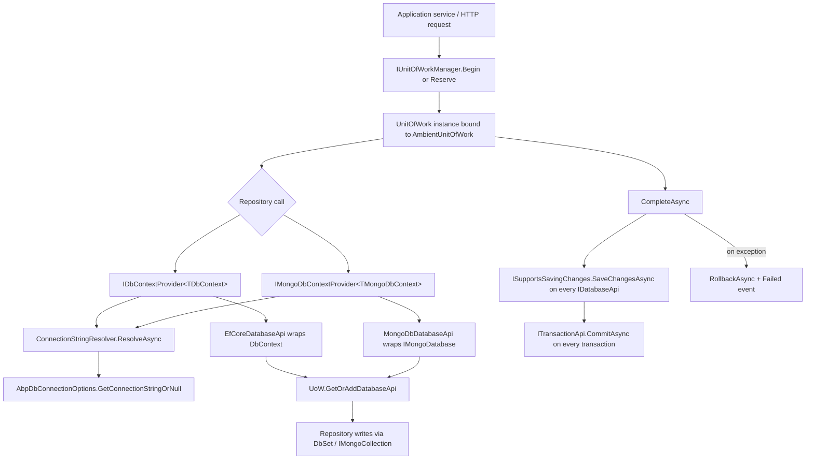

ABP's data stack sits on three abstraction layers shipped from `framework/src/Volo.Abp.Data` and `framework/src/Volo.Abp.Uow`. The `Volo.Abp.Data` module owns connection‑string resolution, data filters, seeding, and concurrency. The `Volo.Abp.Uow` module owns the ambient transactional boundary that every persistence provider plugs into through `IDatabaseApi` / `ITransactionApi`. Concrete providers (`Volo.Abp.EntityFrameworkCore`, `Volo.Abp.MongoDB`, `Volo.Abp.MemoryDb`, `Volo.Abp.Dapper`) implement `IDbContextProvider<TDbContext>` style adapters that resolve the right DbContext (or Mongo session) for the current Unit of Work and the current tenant.

This page is the landing pad for the whole data area. Each card below opens a deep‑dive into one piece of the stack. Cross‑links at the bottom point to `/ddd/repositories` (where these providers become `IRepository<TEntity>`), `/tenancy/data-filtering` (multi‑tenant filter behavior) and `/flows/unit-of-work-lifecycle` (the end‑to‑end transaction lifecycle).

## What lives in `Volo.Abp.Data`

<CardGroup cols={2}>
  <Card title="Volo.Abp.Data internals" icon="database" href="/data/volo-abp-data">
    `AbpDataModule`, `IDataFilter`, `IDataSeeder`, `IConnectionStringResolver`, `ConnectionStrings`, `[ConnectionStringName]`, `AbpDbConcurrencyException`.
  </Card>
  <Card title="Unit of Work" icon="rotate" href="/data/unit-of-work">
    `UnitOfWork`, `UnitOfWorkManager`, `AmbientUnitOfWork`, `[UnitOfWork]`, `IDatabaseApi`, `ITransactionApi`, ASP.NET Core middleware.
  </Card>
  <Card title="Data Filtering" icon="filter" href="/data/data-filtering">
    `IDataFilter<TFilter>`, built‑in `ISoftDelete` / `IMultiTenant`, default state via `AbpDataFilterOptions`.
  </Card>
  <Card title="Data Seeding" icon="seedling" href="/data/data-seeding">
    `IDataSeedContributor`, `DataSeedContext`, `DataSeeder`, real `IdentityDataSeeder` / `IdentityDataSeedContributor`.
  </Card>
  <Card title="Connection strings" icon="link" href="/data/connection-strings">
    `AbpDbConnectionOptions`, named connection strings, `[ConnectionStringName]`, multi‑database mapping.
  </Card>
</CardGroup>

## EF Core provider stack

<CardGroup cols={2}>
  <Card title="Volo.Abp.EntityFrameworkCore" icon="elephant" href="/data/entityframeworkcore">
    `AbpDbContext`, `EfCoreRepository`, `UnitOfWorkDbContextProvider`, modeling helpers, change tracking.
  </Card>
  <Card title="SQL Server adapter" icon="server" href="/data/efcore-sqlserver">
    `AbpEntityFrameworkCoreSqlServerModule`, `UseSqlServer` extension, `SqlServerConnectionStringChecker`.
  </Card>
  <Card title="PostgreSQL adapter" icon="elephant" href="/data/efcore-postgresql">
    `AbpEntityFrameworkCorePostgreSqlModule`, `UseNpgsql`, `NpgsqlConnectionStringChecker`.
  </Card>
  <Card title="MySQL (Oracle + Pomelo)" icon="dolphin" href="/data/efcore-mysql">
    Two provider variants: `Volo.Abp.EntityFrameworkCore.MySQL` and `.MySQL.Pomelo`.
  </Card>
  <Card title="Oracle (ODP + Devart)" icon="building-columns" href="/data/efcore-oracle">
    `Volo.Abp.EntityFrameworkCore.Oracle` and `.Oracle.Devart`.
  </Card>
  <Card title="SQLite" icon="feather" href="/data/efcore-sqlite">
    `UseSqlite`, `AbpUnitTestSqliteConnection` for thread‑safe in‑memory testing.
  </Card>
</CardGroup>

## Non‑EF providers

<CardGroup cols={3}>
  <Card title="MongoDB" icon="leaf" href="/data/mongodb">
    `AbpMongoDbContext`, `MongoDbRepository`, session‑based transactions.
  </Card>
  <Card title="MemoryDb" icon="memory" href="/data/memorydb">
    `MemoryDbContext`, in‑process store for tests/demos.
  </Card>
  <Card title="Dapper" icon="bolt" href="/data/dapper">
    `DapperRepository<TDbContext>` riding the EF Core UoW.
  </Card>
</CardGroup>

## How the pieces wire together

The diagram below shows what happens when an application service calls a repository method. A Unit of Work is the ambient boundary; inside it the `IDbContextProvider<TDbContext>` (or `IMongoDbContextProvider<TMongoDbContext>`) resolves the right context for the current connection string, registers it on the UoW as an `IDatabaseApi`, and returns it to the repository. When the UoW completes, every active `IDatabaseApi` that implements `ISupportsSavingChanges` flushes and every `ITransactionApi` commits.



<Info>
The same `IUnitOfWorkManager` orchestrates EF Core, MongoDB, MemoryDb and Dapper at the same time. Each provider adds its own `IDatabaseApi` to the UoW's dictionary keyed by `"{DbContextType.FullName}_{connectionString}"`, so one UoW can span several databases in the same request.
</Info>

## Source map

| Concern                         | Source root                                                                                       |
| ------------------------------- | ------------------------------------------------------------------------------------------------- |
| Data abstractions               | `framework/src/Volo.Abp.Data/Volo/Abp/Data/`                                                      |
| Unit of Work                    | `framework/src/Volo.Abp.Uow/Volo/Abp/Uow/`                                                        |
| UoW middleware                  | `framework/src/Volo.Abp.AspNetCore/Volo/Abp/AspNetCore/Uow/AbpUnitOfWorkMiddleware.cs`             |
| EF Core core                    | `framework/src/Volo.Abp.EntityFrameworkCore/Volo/Abp/EntityFrameworkCore/`                        |
| EF Core repository              | `framework/src/Volo.Abp.EntityFrameworkCore/Volo/Abp/Domain/Repositories/EntityFrameworkCore/`    |
| EF Core ↔ UoW glue              | `framework/src/Volo.Abp.EntityFrameworkCore/Volo/Abp/Uow/EntityFrameworkCore/`                    |
| Provider adapters               | `framework/src/Volo.Abp.EntityFrameworkCore.{SqlServer,PostgreSql,MySQL,MySQL.Pomelo,Oracle,Oracle.Devart,Sqlite}/` |
| MongoDB                         | `framework/src/Volo.Abp.MongoDB/Volo/Abp/MongoDB/`                                                |
| MongoDB repository              | `framework/src/Volo.Abp.MongoDB/Volo/Abp/Domain/Repositories/MongoDB/`                            |
| MemoryDb                        | `framework/src/Volo.Abp.MemoryDb/Volo/Abp/`                                                       |
| Dapper                          | `framework/src/Volo.Abp.Dapper/Volo/Abp/`                                                         |

## Reading order

<Steps>
  <Step title="Start with Volo.Abp.Data">
    Read [`/data/volo-abp-data`](/data/volo-abp-data) to understand the abstractions every provider depends on.
  </Step>
  <Step title="Learn the Unit of Work">
    [`/data/unit-of-work`](/data/unit-of-work) covers ambient state, `[UnitOfWork]`, transactions and the ASP.NET Core middleware.
  </Step>
  <Step title="Pick your provider">
    [`/data/entityframeworkcore`](/data/entityframeworkcore) for relational, [`/data/mongodb`](/data/mongodb) for documents, [`/data/memorydb`](/data/memorydb) for tests, [`/data/dapper`](/data/dapper) for raw SQL.
  </Step>
  <Step title="Choose the relational adapter">
    [`/data/efcore-sqlserver`](/data/efcore-sqlserver), [`/data/efcore-postgresql`](/data/efcore-postgresql), [`/data/efcore-mysql`](/data/efcore-mysql), [`/data/efcore-oracle`](/data/efcore-oracle), [`/data/efcore-sqlite`](/data/efcore-sqlite).
  </Step>
  <Step title="Cross over to higher layers">
    Repositories live at [`/ddd/repositories`](/ddd/repositories); tenant‑aware filters at [`/tenancy/data-filtering`](/tenancy/data-filtering); the end‑to‑end transaction story at [`/flows/unit-of-work-lifecycle`](/flows/unit-of-work-lifecycle).
  </Step>
</Steps>

<Tip>
Everything in this section is **provider‑agnostic** above the repository line. If you change `UseSqlServer(...)` for `UseNpgsql(...)`, your domain code does not change — only the adapter module dependency.
</Tip>

## How a write flows

The textbook example: `BookAppService.CreateAsync(...)`. Here is the exact path the framework takes from the controller to commit, calling the same types the diagram above named.

<Steps>
  <Step title="HTTP enters the pipeline">
    `AbpUnitOfWorkMiddleware` (`framework/src/Volo.Abp.AspNetCore/Volo/Abp/AspNetCore/Uow/AbpUnitOfWorkMiddleware.cs`) reserves a UoW under the well‑known name `_AbpActionUnitOfWork`.
  </Step>
  <Step title="Controller dispatches to an app service">
    MVC's action filter sees the `[UnitOfWork]` (default) on the application service and calls `IUnitOfWorkManager.TryBeginReserved(...)` to activate the reservation with the attribute's options.
  </Step>
  <Step title="App service calls the repository">
    `_bookRepository.InsertAsync(book)` runs inside `EfCoreRepository<MyAppDbContext, Book>` (or `MongoDbRepository<...>`, `MemoryDbRepository<...>`).
  </Step>
  <Step title="Repository fetches the DbContext">
    `_dbContextProvider.GetDbContextAsync()` resolves the connection string, looks up an existing `EfCoreDatabaseApi` on the UoW, or creates a fresh one. The DbContext is cached on the UoW for the rest of the request.
  </Step>
  <Step title="Write hits the change tracker">
    `dbContext.Set<Book>().AddAsync(book)`. The `AbpDbContext.ChangeTracker_Tracked` handler enrolls audit, soft‑delete, tenant id, GUID id and any pending domain events into the UoW's event buffer.
  </Step>
  <Step title="Middleware completes the UoW">
    `uow.CompleteAsync()` calls `ISupportsSavingChanges.SaveChangesAsync` on every active `IDatabaseApi`, drains the event buffer, then `ITransactionApi.CommitAsync`.
  </Step>
  <Step title="Failure rolls back">
    Any exception in steps 5/6 routes through `ISupportsRollback.RollbackAsync` on every active transaction and fires `IUnitOfWork.Failed`. The response surfaces an ABP exception filter result.
  </Step>
</Steps>

## Provider parity table

The matrix below summarizes what each provider implements. If a row says "no", check the per‑provider page for the workaround.

| Provider              | `IRepository<T>`       | UoW participation | Transactions    | Soft‑delete filter | Multi‑tenant filter |
| --------------------- | ---------------------- | ----------------- | --------------- | ------------------ | ------------------- |
| EF Core (SQL Server)  | `EfCoreRepository`     | yes               | yes             | yes (DB function)  | yes (DB function)   |
| EF Core (PostgreSQL)  | `EfCoreRepository`     | yes               | yes             | yes (DB function)  | yes (DB function)   |
| EF Core (MySQL)       | `EfCoreRepository`     | yes               | yes             | yes (DB function)  | yes (DB function)   |
| EF Core (Oracle)      | `EfCoreRepository`     | yes               | yes             | yes (DB function)  | yes (DB function)   |
| EF Core (SQLite)      | `EfCoreRepository`     | yes (test‑safe)   | limited writes  | yes (DB function)  | yes (DB function)   |
| MongoDB               | `MongoDbRepository`    | yes               | replica set only| yes (filter)       | yes (filter)        |
| MemoryDb              | `MemoryDbRepository`   | yes               | no              | yes (LINQ)         | yes (LINQ)          |
| Dapper                | `DapperRepository`     | rides EF Core     | rides EF Core   | manual SQL         | manual SQL          |

<Note>
"DB function" in the filter columns means the framework can emit the filter as a SQL UDF (`AbpEfCoreDataFilterDbFunctionMethods.SoftDeleteFilter`/`MultiTenantFilter`) when the provider supports it. This dramatically improves EF Core's query plan reuse — see [`/data/entityframeworkcore`](/data/entityframeworkcore).
</Note>

## Configuration cheat sheet

```json
// appsettings.json — three patterns
{
  "ConnectionStrings": {
    "Default": "Server=.;Database=MyApp;Trusted_Connection=True;TrustServerCertificate=True"
  }
}
```

```json
// Per-module separation
{
  "ConnectionStrings": {
    "Default":          "Server=.;Database=MyApp;Trusted_Connection=True",
    "AbpAuditLogging":  "Server=.;Database=MyApp_Audit;Trusted_Connection=True"
  }
}
```

```csharp
// Per-DbContext provider in a module
public override void ConfigureServices(ServiceConfigurationContext context)
{
    Configure<AbpDbContextOptions>(options =>
    {
        options.UseSqlServer<MyAppDbContext>();
        options.UseNpgsql<AuditingDbContext>();   // can mix!
    });
}
```

ABP encourages keeping each `DbContext` provider‑neutral by inheriting from `AbpDbContext<T>` and letting the `Use…` extensions select the runtime provider. The `AbpDbContextOptions.Configure<TDbContext>` pattern means you can mix providers in one process if a sub‑module insists on a particular database.

## Provider switching at a glance

The framework's provider strategy makes a deliberate trade‑off: same domain code, swap the adapter. The list below names exactly what changes when you flip provider.

<AccordionGroup>
  <Accordion title="Module dependencies">
    Swap one of `AbpEntityFrameworkCoreSqlServerModule`, `AbpEntityFrameworkCorePostgreSqlModule`, `AbpEntityFrameworkCoreMySQLPomeloModule`, `AbpEntityFrameworkCoreOracleModule`, `AbpEntityFrameworkCoreSqliteModule`, or `AbpMongoDbModule` / `AbpMemoryDbModule` / `AbpDapperModule`.
  </Accordion>
  <Accordion title="Provider extension call">
    `options.UseSqlServer()` ↔ `options.UseNpgsql()` ↔ `options.UseMySQL()` ↔ `options.UseOracle()` ↔ `options.UseSqlite()`. All called on the same `AbpDbContextOptions`.
  </Accordion>
  <Accordion title="Sequential GUID strategy">
    Auto‑selected by each provider's module: `SequentialAtEnd` for SQL Server, `SequentialAsString` for PostgreSQL/MySQL, `SequentialAsBinary` for Oracle.
  </Accordion>
  <Accordion title="Connection-string checker">
    `SqlServerConnectionStringChecker`, `NpgsqlConnectionStringChecker`, `MySQLConnectionStringChecker` / `PomeloMySQLConnectionStringChecker`, `OracleConnectionStringChecker` / `OracleDevartConnectionStringChecker`, `SqliteConnectionStringChecker`. All registered via `[Dependency(ReplaceServices = true)]`.
  </Accordion>
  <Accordion title="appsettings.json connection string">
    The string format differs per provider; the *name* (`"Default"`, `"AbpIdentity"`, …) stays the same.
  </Accordion>
</AccordionGroup>

Everything else — `AbpDbContext`, `EfCoreRepository`, modeling helpers, `[UnitOfWork]`, data filters — is identical across the adapters.

## Choosing the right provider

<CardGroup cols={2}>
  <Card title="Pick SQL Server if..." icon="server">
    Microsoft shop, Entra ID auth, T‑SQL DBA team, columnstore reporting needs.
  </Card>
  <Card title="Pick PostgreSQL if..." icon="elephant">
    Open‑source default, `jsonb`/PostGIS workloads, container‑native deployments.
  </Card>
  <Card title="Pick MySQL (Pomelo) if..." icon="dolphin">
    Massive read replica fanout, existing MySQL/MariaDB infra, cost‑sensitive.
  </Card>
  <Card title="Pick Oracle if..." icon="building-columns">
    Enterprise mandate, PL/SQL libraries, RAC clusters in place.
  </Card>
  <Card title="Pick SQLite if..." icon="feather">
    Tests, local desktops, low‑traffic single‑user tools.
  </Card>
  <Card title="Pick MongoDB if..." icon="leaf">
    Schemaless documents, write‑heavy ingestion, native sharding.
  </Card>
</CardGroup>

## Things every page assumes

A few framework conventions reappear on every page in this section. Capturing them once:

- **All ABP services come through `IAbpLazyServiceProvider`** — DbContexts and repositories pull dependencies lazily rather than via constructors so EF Core's design‑time tooling can keep instantiating them with just `DbContextOptions<TDbContext>`.
- **Repositories never open transactions directly** — they ask the ambient `IUnitOfWork` for an `IDatabaseApi`/`ITransactionApi`. The UoW commits or rolls back uniformly. See [`/data/unit-of-work`](/data/unit-of-work).
- **Connection strings are resolved by name, not by literal** — DbContexts wear `[ConnectionStringName]`; everything else flows through `IConnectionStringResolver`. See [`/data/connection-strings`](/data/connection-strings).
- **Data filters are async‑local** — `IDataFilter` toggles are scoped to your async flow; they don't leak across `Task.Run`. See [`/data/data-filtering`](/data/data-filtering).
- **Seeding is contributor‑based** — every module ships one or more `IDataSeedContributor`s; `IDataSeeder.SeedAsync()` runs them inside a UoW. See [`/data/data-seeding`](/data/data-seeding).

## What ships in each NuGet

The packages mirror the source folders one for one. If you're looking at NuGet for the first time, this table is the cheatsheet:

| NuGet package                                              | Source folder under `framework/src/`                    | What it adds                                                  |
| ---------------------------------------------------------- | ------------------------------------------------------- | ------------------------------------------------------------- |
| `Volo.Abp.Data`                                            | `Volo.Abp.Data`                                         | Connection strings, filters, seeding, ETOs.                   |
| `Volo.Abp.Uow`                                             | `Volo.Abp.Uow`                                          | `UnitOfWork`, `[UnitOfWork]`, ambient state.                   |
| `Volo.Abp.AspNetCore`                                      | `Volo.Abp.AspNetCore`                                   | `AbpUnitOfWorkMiddleware`.                                    |
| `Volo.Abp.EntityFrameworkCore`                             | `Volo.Abp.EntityFrameworkCore`                          | `AbpDbContext`, `EfCoreRepository`, UoW glue.                 |
| `Volo.Abp.EntityFrameworkCore.SqlServer`                   | `Volo.Abp.EntityFrameworkCore.SqlServer`                | `UseSqlServer`, connection checker.                           |
| `Volo.Abp.EntityFrameworkCore.PostgreSql`                  | `Volo.Abp.EntityFrameworkCore.PostgreSql`               | `UseNpgsql`, connection checker.                              |
| `Volo.Abp.EntityFrameworkCore.MySQL`                       | `Volo.Abp.EntityFrameworkCore.MySQL`                    | `UseMySQL` (Oracle driver).                                   |
| `Volo.Abp.EntityFrameworkCore.MySQL.Pomelo`                | `Volo.Abp.EntityFrameworkCore.MySQL.Pomelo`             | `UseMySQL` (Pomelo driver).                                   |
| `Volo.Abp.EntityFrameworkCore.Oracle`                      | `Volo.Abp.EntityFrameworkCore.Oracle`                   | `UseOracle` (ODP.NET).                                        |
| `Volo.Abp.EntityFrameworkCore.Oracle.Devart`               | `Volo.Abp.EntityFrameworkCore.Oracle.Devart`            | `UseOracle` (Devart).                                         |
| `Volo.Abp.EntityFrameworkCore.Sqlite`                      | `Volo.Abp.EntityFrameworkCore.Sqlite`                   | `UseSqlite`, `AbpUnitTestSqliteConnection`.                   |
| `Volo.Abp.MongoDB`                                         | `Volo.Abp.MongoDB`                                      | `AbpMongoDbContext`, `MongoDbRepository`.                     |
| `Volo.Abp.MemoryDb`                                        | `Volo.Abp.MemoryDb`                                     | `MemoryDbContext`, in-process store.                          |
| `Volo.Abp.Dapper`                                          | `Volo.Abp.Dapper`                                       | `DapperRepository<TDbContext>` riding EF Core.                |

## Common questions

<AccordionGroup>
  <Accordion title="Do I have to use Volo.Abp.EntityFrameworkCore?">
    No. You can ship a module that depends only on `Volo.Abp.MongoDB` or `Volo.Abp.MemoryDb`. The framework's own modules (Identity, Audit, Setting Management, …) ship both EF Core and MongoDB packages — pick one in your host.
  </Accordion>
  <Accordion title="Can one host talk to multiple databases?">
    Yes. Annotate each `DbContext` with `[ConnectionStringName("X")]` and add `X` to `appsettings.json`. The UoW will hold one `EfCoreDatabaseApi` per context per request; commit fires for each.
  </Accordion>
  <Accordion title="What happens if I forget to wrap code in a UoW?">
    The provider raises `AbpException("A DbContext can only be created inside a unit of work!")`. The MVC middleware and the `[UnitOfWork]` interceptor cover the standard paths; you only see this in console hosts that bypass them.
  </Accordion>
  <Accordion title="Are events fired even on rollback?">
    No. Local and distributed event records are buffered on the UoW and flushed only after a successful `SaveChangesAsync` + `CommitAsync`. A rollback discards them.
  </Accordion>
</AccordionGroup>
