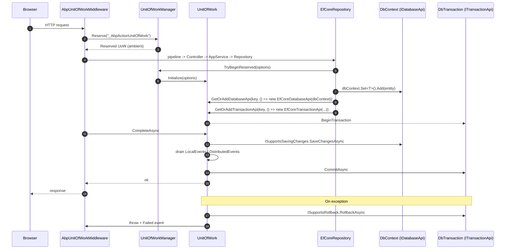

The ABP Unit of Work (UoW) is the ambient transactional boundary every persistence provider in ABP plugs into. It lives in `framework/src/Volo.Abp.Uow/Volo/Abp/Uow/`. A UoW owns a set of `IDatabaseApi` and `ITransactionApi` slots; providers like `Volo.Abp.EntityFrameworkCore` and `Volo.Abp.MongoDB` register their `DbContext` / `IMongoDatabase` into those slots so that `CompleteAsync` can call `ISupportsSavingChanges.SaveChangesAsync` and `ITransactionApi.CommitAsync` on all of them — and `RollbackAsync` on failure.

This page is the runtime companion to [`/data/volo-abp-data`](/data/volo-abp-data). The full end‑to‑end sequence (HTTP → application service → repository → SaveChanges → CommitAsync) is on [`/flows/unit-of-work-lifecycle`](/flows/unit-of-work-lifecycle).

## The IUnitOfWork contract

```csharp
// framework/src/Volo.Abp.Uow/Volo/Abp/Uow/IUnitOfWork.cs
public interface IUnitOfWork : IDatabaseApiContainer, ITransactionApiContainer, IDisposable
{
    Guid Id { get; }
    Dictionary<string, object> Items { get; }
    event EventHandler<UnitOfWorkFailedEventArgs> Failed;
    event EventHandler<UnitOfWorkEventArgs> Disposed;

    IAbpUnitOfWorkOptions Options { get; }
    IUnitOfWork? Outer { get; }
    bool IsReserved { get; }
    bool IsDisposed { get; }
    bool IsCompleted { get; }
    string? ReservationName { get; }

    void SetOuter(IUnitOfWork? outer);
    void Initialize([NotNull] AbpUnitOfWorkOptions options);
    void Reserve([NotNull] string reservationName);
    Task SaveChangesAsync(CancellationToken cancellationToken = default);
    Task CompleteAsync(CancellationToken cancellationToken = default);
    Task RollbackAsync(CancellationToken cancellationToken = default);
    void OnCompleted(Func<Task> handler);

    void AddOrReplaceLocalEvent(UnitOfWorkEventRecord eventRecord,
        Predicate<UnitOfWorkEventRecord>? replacementSelector = null);
    void AddOrReplaceDistributedEvent(UnitOfWorkEventRecord eventRecord,
        Predicate<UnitOfWorkEventRecord>? replacementSelector = null);
}
```

Key responsibilities:

- **Database APIs**: `IDatabaseApiContainer` exposes `FindDatabaseApi(string key)` and `GetOrAddDatabaseApi(string, Func<IDatabaseApi>)`. Each provider stores its session here.
- **Transaction APIs**: same pattern for `ITransactionApi`. `CommitAsync` and `Dispose` are routed through these.
- **Local & distributed event buffers**: domain and outbox events queued during writes are flushed in `CompleteAsync`, so events fire only on successful commit.
- **Outer/inner UoW chain**: nested calls form a chain through `Outer`. The outer wins for the transaction.

## UnitOfWork — the concrete state machine

`UnitOfWork` (transient) implements the contract. Notice that `Initialize` is called once by `UnitOfWorkManager.Begin` and rejected on a second call:

```csharp
// framework/src/Volo.Abp.Uow/Volo/Abp/Uow/UnitOfWork.cs
public class UnitOfWork : IUnitOfWork, ITransientDependency
{
    public const string UnitOfWorkReservationName = "_AbpActionUnitOfWork";
    public Guid Id { get; } = Guid.NewGuid();
    public IAbpUnitOfWorkOptions Options { get; private set; } = default!;
    public IUnitOfWork? Outer { get; private set; }
    public bool IsReserved { get; set; }
    public bool IsDisposed { get; private set; }
    public bool IsCompleted { get; private set; }
    public string? ReservationName { get; set; }

    private readonly Dictionary<string, IDatabaseApi>    _databaseApis    = new();
    private readonly Dictionary<string, ITransactionApi> _transactionApis = new();

    public virtual void Initialize(AbpUnitOfWorkOptions options)
    {
        if (Options != null)
            throw new AbpException("This unit of work has already been initialized.");

        Options = _defaultOptions.Normalize(options.Clone());
        IsReserved = false;
    }

    public virtual async Task SaveChangesAsync(CancellationToken cancellationToken = default)
    {
        if (_isRolledback) return;
        foreach (var databaseApi in GetAllActiveDatabaseApis())
        {
            if (databaseApi is ISupportsSavingChanges supportsSaving)
                await supportsSaving.SaveChangesAsync(cancellationToken);
        }
    }

    public virtual async Task CompleteAsync(CancellationToken cancellationToken = default)
    {
        if (_isRolledback) return;
        PreventMultipleComplete();

        try
        {
            _isCompleting = true;
            await SaveChangesAsync(cancellationToken);
            // ... event buffer pump ...
            await CommitTransactionsAsync(cancellationToken);
            IsCompleted = true;
            await OnCompletedAsync();
        }
        catch (Exception ex)
        {
            _exception = ex;
            throw;
        }
    }
}
```

<Info>
`CompleteAsync` saves first, then drains the **local event** and **distributed event** queues (calling back into providers, which may add more events), then commits transactions. That ordering is why ABP's domain events are safe to publish synchronously inside an aggregate — they only fire when the UoW will commit.
</Info>

### Database & transaction APIs

Providers conform to these tiny interfaces:

```csharp
// framework/src/Volo.Abp.Uow/Volo/Abp/Uow/IDatabaseApi.cs
public interface IDatabaseApi { }

// framework/src/Volo.Abp.Uow/Volo/Abp/Uow/ITransactionApi.cs
public interface ITransactionApi : IDisposable
{
    Task CommitAsync(CancellationToken cancellationToken = default);
}

// framework/src/Volo.Abp.Uow/Volo/Abp/Uow/ISupportsSavingChanges.cs
public interface ISupportsSavingChanges
{
    Task SaveChangesAsync(CancellationToken cancellationToken = default);
}

// framework/src/Volo.Abp.Uow/Volo/Abp/Uow/ISupportsRollback.cs
public interface ISupportsRollback
{
    Task RollbackAsync(CancellationToken cancellationToken = default);
}
```

EF Core's `EfCoreDatabaseApi` implements `IDatabaseApi + ISupportsSavingChanges`, and `EfCoreTransactionApi` implements `ITransactionApi + ISupportsRollback`. Mongo's `MongoDbDatabaseApi` does the same for `IClientSessionHandle`. MemoryDb's `MemoryDbDatabaseApi` only implements `IDatabaseApi` (in‑memory, no transaction).

## UnitOfWorkManager — entry point

```csharp
// framework/src/Volo.Abp.Uow/Volo/Abp/Uow/UnitOfWorkManager.cs
public class UnitOfWorkManager : IUnitOfWorkManager, ISingletonDependency
{
    public IUnitOfWork? Current => _ambientUnitOfWork.GetCurrentByChecking();

    public IUnitOfWork Begin(AbpUnitOfWorkOptions options, bool requiresNew = false)
    {
        var currentUow = Current;
        if (currentUow != null && !requiresNew)
            return new ChildUnitOfWork(currentUow);

        var unitOfWork = CreateNewUnitOfWork();
        unitOfWork.Initialize(options);
        return unitOfWork;
    }

    public IUnitOfWork Reserve(string reservationName, bool requiresNew = false)
    {
        if (!requiresNew && _ambientUnitOfWork.UnitOfWork != null &&
            _ambientUnitOfWork.UnitOfWork.IsReservedFor(reservationName))
        {
            return new ChildUnitOfWork(_ambientUnitOfWork.UnitOfWork);
        }

        var unitOfWork = CreateNewUnitOfWork();
        unitOfWork.Reserve(reservationName);
        return unitOfWork;
    }

    public bool TryBeginReserved(string reservationName, AbpUnitOfWorkOptions options)
    {
        var uow = _ambientUnitOfWork.UnitOfWork;
        while (uow != null && !uow.IsReservedFor(reservationName))
            uow = uow.Outer;

        if (uow == null) return false;
        uow.Initialize(options);
        return true;
    }
}
```

Highlights:

- `Begin` returns a `ChildUnitOfWork` (a wrapper that no‑ops `CompleteAsync`/`Dispose`) when there's already an outer UoW.
- `Reserve` parks a placeholder UoW so an outer system (the ASP.NET Core middleware) can claim it.
- `TryBeginReserved` activates a reserved UoW with real options when the inner code reaches the place that *should* own the transaction.

### Reservation pattern

This three‑step dance powers the MVC integration:

<Steps>
  <Step title="Outer middleware reserves">
    `_unitOfWorkManager.Reserve(UnitOfWork.UnitOfWorkReservationName)` — creates a UoW, marks it reserved, makes it ambient.
  </Step>
  <Step title="Inner code initializes">
    The MVC interceptor calls `TryBeginReserved(...)` with the attribute's options, turning the reservation into a live UoW.
  </Step>
  <Step title="Outer middleware completes">
    The outer `using` block calls `await uow.CompleteAsync()` to save and commit.
  </Step>
</Steps>

If no inner code activates the reservation, the outer `CompleteAsync` is a no‑op (still reserved → no APIs registered → nothing to save).

## AmbientUnitOfWork & IAmbientUnitOfWork

`AmbientUnitOfWork` is the `AsyncLocal<IUnitOfWork?>` that backs `IUnitOfWorkManager.Current`:

```csharp
// framework/src/Volo.Abp.Uow/Volo/Abp/Uow/AmbientUnitOfWork.cs
[ExposeServices(typeof(IAmbientUnitOfWork), typeof(IUnitOfWorkAccessor))]
public class AmbientUnitOfWork : IAmbientUnitOfWork, ISingletonDependency
{
    public IUnitOfWork? UnitOfWork => _currentUow.Value;
    private readonly AsyncLocal<IUnitOfWork?> _currentUow;

    public AmbientUnitOfWork() { _currentUow = new AsyncLocal<IUnitOfWork?>(); }

    public void SetUnitOfWork(IUnitOfWork? unitOfWork)
    {
        _currentUow.Value = unitOfWork;
    }

    public IUnitOfWork? GetCurrentByChecking()
    {
        var uow = UnitOfWork;
        // Skip reserved unit of work
        while (uow != null && (uow.IsReserved || uow.IsDisposed || uow.IsCompleted))
            uow = uow.Outer;
        return uow;
    }
}
```

`GetCurrentByChecking` is what providers actually call: it skips reserved/disposed/completed UoWs and walks the `Outer` chain to find the real active one.

## UnitOfWorkAttribute

```csharp
// framework/src/Volo.Abp.Uow/Volo/Abp/Uow/UnitOfWorkAttribute.cs
[AttributeUsage(AttributeTargets.Method | AttributeTargets.Class | AttributeTargets.Interface)]
public class UnitOfWorkAttribute : Attribute
{
    public bool?           IsTransactional { get; set; }
    public int?            Timeout         { get; set; }
    public IsolationLevel? IsolationLevel  { get; set; }
    public bool            IsDisabled      { get; set; }

    public UnitOfWorkAttribute() { }
    public UnitOfWorkAttribute(bool isTransactional) { IsTransactional = isTransactional; }
    public UnitOfWorkAttribute(bool isTransactional, IsolationLevel isolationLevel) { ... }
    public UnitOfWorkAttribute(bool isTransactional, IsolationLevel isolationLevel, int timeout) { ... }

    public virtual void SetOptions(AbpUnitOfWorkOptions options)
    {
        if (IsTransactional.HasValue) options.IsTransactional = IsTransactional.Value;
        if (Timeout.HasValue)         options.Timeout         = Timeout;
        if (IsolationLevel.HasValue)  options.IsolationLevel  = IsolationLevel;
    }
}
```

`UnitOfWorkInterceptor` (next to it in the folder) is the Castle DynamicProxy interceptor registered for every service marked `IUnitOfWorkEnabled` or `[UnitOfWork]`. It calls `UnitOfWorkHelper.GetUnitOfWorkAttributeOrNull(method)`, builds an `AbpUnitOfWorkOptions`, then defers to the manager. If the method is already running inside an outer UoW, the interceptor effectively becomes a `ChildUnitOfWork`.

<Note>
Application services (everything inheriting `ApplicationService`) implement `IUnitOfWorkEnabled` automatically. Domain services do not — they participate in whatever UoW exists, never start their own.
</Note>

## AbpUnitOfWorkOptions and defaults

```csharp
// framework/src/Volo.Abp.Uow/Volo/Abp/Uow/AbpUnitOfWorkOptions.cs
public class AbpUnitOfWorkOptions : IAbpUnitOfWorkOptions
{
    public bool IsTransactional { get; set; }
    public IsolationLevel? IsolationLevel { get; set; }
    public int? Timeout { get; set; }   // milliseconds

    public AbpUnitOfWorkOptions Clone() => new()
    {
        IsTransactional = IsTransactional,
        IsolationLevel = IsolationLevel,
        Timeout = Timeout,
    };
}
```

```csharp
// framework/src/Volo.Abp.Uow/Volo/Abp/Uow/AbpUnitOfWorkDefaultOptions.cs
public class AbpUnitOfWorkDefaultOptions
{
    public UnitOfWorkTransactionBehavior TransactionBehavior { get; set; }
        = UnitOfWorkTransactionBehavior.Auto;
    public IsolationLevel? IsolationLevel { get; set; }
    public int? Timeout { get; set; }

    public bool CalculateIsTransactional(bool autoValue) => TransactionBehavior switch
    {
        UnitOfWorkTransactionBehavior.Enabled  => true,
        UnitOfWorkTransactionBehavior.Disabled => false,
        UnitOfWorkTransactionBehavior.Auto     => autoValue,
        _ => throw new AbpException("Not implemented TransactionBehavior value: " + TransactionBehavior),
    };
}
```

<Tip>
For unit tests against SQLite (which doesn't support nested transactions cleanly), configure `Configure<AbpUnitOfWorkDefaultOptions>(o => o.TransactionBehavior = UnitOfWorkTransactionBehavior.Disabled);` — see [`/data/efcore-sqlite`](/data/efcore-sqlite).
</Tip>

## IUnitOfWorkEventPublisher

Local + distributed event records buffered by repositories during writes are drained at `CompleteAsync`:

```csharp
// framework/src/Volo.Abp.Uow/Volo/Abp/Uow/IUnitOfWorkEventPublisher.cs
public interface IUnitOfWorkEventPublisher
{
    Task PublishLocalEventsAsync(IEnumerable<UnitOfWorkEventRecord> localEvents);
    Task PublishDistributedEventsAsync(IEnumerable<UnitOfWorkEventRecord> distributedEvents);
}
```

The concrete `UnitOfWorkEventPublisher` (in `Volo.Abp.EventBus`) routes local events to `ILocalEventBus` and distributed events to `IDistributedEventBus`. A `NullUnitOfWorkEventPublisher` is used when the event bus modules aren't loaded.

## AbpUnitOfWorkMiddleware — ASP.NET Core integration

```csharp
// framework/src/Volo.Abp.AspNetCore/Volo/Abp/AspNetCore/Uow/AbpUnitOfWorkMiddleware.cs
public class AbpUnitOfWorkMiddleware : AbpMiddlewareBase, ITransientDependency
{
    public async override Task InvokeAsync(HttpContext context, RequestDelegate next)
    {
        if (await ShouldSkipAsync(context, next) || IsIgnoredUrl(context))
        {
            await next(context);
            return;
        }

        using (var uow = _unitOfWorkManager.Reserve(UnitOfWork.UnitOfWorkReservationName))
        {
            await next(context);
            await uow.CompleteAsync(_cancellationTokenProvider.Token);
        }
    }
}
```

The middleware reserves a UoW under the well‑known name `_AbpActionUnitOfWork`. The MVC action filter / controller interceptor later activates it with the attribute's options. If no action ever activates the reservation (e.g. static file pipeline) the `CompleteAsync` is harmless.

<Warning>
Blazor server components render concurrently. The middleware explicitly skips endpoints carrying `RootComponentMetadata` to avoid "A second operation started on this context before a previous operation completed" errors caused by sharing one DbContext across parallel render trees.
</Warning>

## Request → save → commit/rollback sequence



For the same flow at app‑service granularity, see [`/flows/unit-of-work-lifecycle`](/flows/unit-of-work-lifecycle).

## Operational tips

<AccordionGroup>
  <Accordion title="Manual UoW in a console host">
    ```csharp
    using var scope = host.Services.CreateScope();
    var manager = scope.ServiceProvider.GetRequiredService<IUnitOfWorkManager>();
    using var uow = manager.Begin(new AbpUnitOfWorkOptions { IsTransactional = true });
    var svc = scope.ServiceProvider.GetRequiredService<IMyAppService>();
    await svc.DoWorkAsync();
    await uow.CompleteAsync();
    ```
  </Accordion>
  <Accordion title="Forcing a new UoW for a nested call">
    Pass `requiresNew: true` to `Begin` (e.g. for an audit log that must persist even if the outer fails). The new UoW gets its own transaction; the outer still rolls back on exception.
  </Accordion>
  <Accordion title="OnCompleted hooks">
    `uow.OnCompleted(async () => await cache.RemoveAsync(key))` fires after a successful commit. Use it instead of writing to caches inline.
  </Accordion>
  <Accordion title="Disabling the transaction for read-only flows">
    `[UnitOfWork(isTransactional: false)]` skips `BeginTransaction`. Useful for query endpoints to avoid escalating to a distributed transaction when multiple DbContexts are involved.
  </Accordion>
</AccordionGroup>

## Related pages

<CardGroup cols={2}>
  <Card title="Volo.Abp.Data abstractions" icon="database" href="/data/volo-abp-data">
    Filters, seeding, connection strings used inside a UoW.
  </Card>
  <Card title="EF Core integration" icon="elephant" href="/data/entityframeworkcore">
    `UnitOfWorkDbContextProvider`, `EfCoreDatabaseApi`, change tracking.
  </Card>
  <Card title="MongoDB integration" icon="leaf" href="/data/mongodb">
    `UnitOfWorkMongoDbContextProvider`, session‑based commit.
  </Card>
  <Card title="Repositories" icon="boxes-stacked" href="/ddd/repositories">
    The domain abstraction that hides the UoW from your aggregates.
  </Card>
  <Card title="UoW transaction flow" icon="diagram-project" href="/flows/unit-of-work-lifecycle">
    End‑to‑end request → commit narrative.
  </Card>
  <Card title="Tenant filter" icon="building" href="/tenancy/data-filtering">
    How `IMultiTenant` interacts with the ambient UoW.
  </Card>
</CardGroup>
