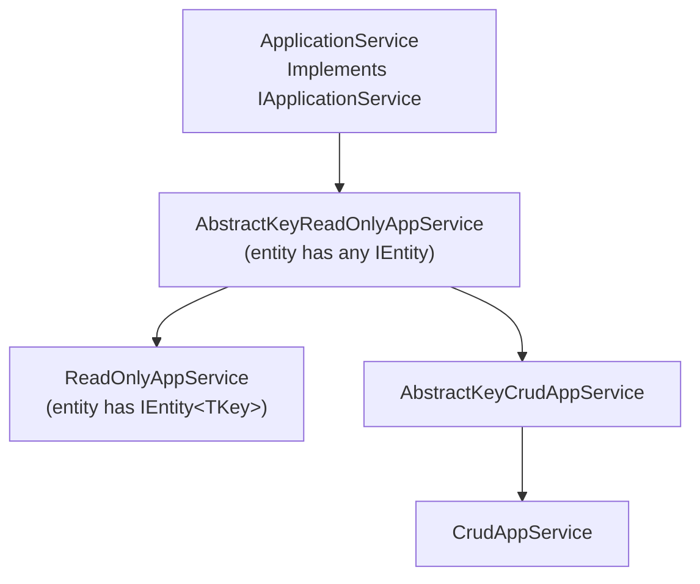

The `Volo.Abp.Ddd.Application` package, located at `framework/src/Volo.Abp.Ddd.Application/`, implements the server-side application services that fulfil the interface contracts defined in [Application.Contracts](/ddd/application-contracts). It introduces the universal `ApplicationService` base class (with the lazy-loaded cross-cutting service properties) plus a matrix of generic CRUD bases — `AbstractKeyReadOnlyAppService`, `ReadOnlyAppService`, `AbstractKeyCrudAppService`, and `CrudAppService` — that let you build a fully working `CreateUpdateDelete + Paged Get` service in three lines.

This page walks the module class, the `ApplicationService` base, and every CRUD overload, with annotated source from `framework/src/Volo.Abp.Ddd.Application/Volo/Abp/Application/Services/`.

## Folder map

```
framework/src/Volo.Abp.Ddd.Application/
├── System/Linq/AbpPagingQueryableExtensions.cs
└── Volo/Abp/Application/
    ├── AbpDddApplicationModule.cs
    └── Services/
        ├── AbstractKeyCrudAppService.cs
        ├── AbstractKeyReadOnlyAppService.cs
        ├── ApplicationService.cs
        ├── CrudAppService.cs
        └── ReadOnlyAppService.cs
```

## The application service hierarchy



`ApplicationService` is the universal base; the four CRUD bases form two pairs (`AbstractKey*` for entities without a typed Id, plain `*AppService` for `IEntity<TKey>` entities). Each ships with five generic overloads that progressively let you customise inputs/outputs.

## AbpDddApplicationModule

```csharp
// framework/src/Volo.Abp.Ddd.Application/Volo/Abp/Application/AbpDddApplicationModule.cs
[DependsOn(
    typeof(AbpDddDomainModule),
    typeof(AbpDddApplicationContractsModule),
    typeof(AbpSecurityModule),
    typeof(AbpObjectMappingModule),
    typeof(AbpValidationModule),
    typeof(AbpAuthorizationModule),
    typeof(AbpHttpAbstractionsModule),
    typeof(AbpSettingsModule),
    typeof(AbpFeaturesModule),
    typeof(AbpGlobalFeaturesModule)
    )]
public class AbpDddApplicationModule : AbpModule
{
    public override void ConfigureServices(ServiceConfigurationContext context)
    {
        Configure<AbpApiDescriptionModelOptions>(options =>
        {
            options.IgnoredInterfaces.AddIfNotContains(typeof(IRemoteService));
            options.IgnoredInterfaces.AddIfNotContains(typeof(IApplicationService));
            options.IgnoredInterfaces.AddIfNotContains(typeof(IUnitOfWorkEnabled));
            options.IgnoredInterfaces.AddIfNotContains(typeof(IAuditingEnabled));
            options.IgnoredInterfaces.AddIfNotContains(typeof(IValidationEnabled));
            options.IgnoredInterfaces.AddIfNotContains(typeof(IGlobalFeatureCheckingEnabled));
        });
    }
}
```

The `ConfigureServices` body teaches the API description generator (used by swagger and the dynamic HTTP client proxy) to ignore the framework's marker interfaces — otherwise `GetListAsync` would show `IRemoteService` as a parameter.

## ApplicationService base class

`ApplicationService` is the workhorse base. It implements many marker interfaces, all of which influence ABP behaviour:

```csharp
// framework/src/Volo.Abp.Ddd.Application/Volo/Abp/Application/Services/ApplicationService.cs
public abstract class ApplicationService :
    IApplicationService,
    IAvoidDuplicateCrossCuttingConcerns,
    IValidationEnabled,
    IUnitOfWorkEnabled,
    IAuditingEnabled,
    IGlobalFeatureCheckingEnabled,
    ITransientDependency
{
    public IAbpLazyServiceProvider LazyServiceProvider { get; set; } = default!;
    public static string[] CommonPostfixes { get; set; } = { "AppService", "ApplicationService", "Service" };
    public List<string> AppliedCrossCuttingConcerns { get; } = new();

    protected IUnitOfWorkManager UnitOfWorkManager => LazyServiceProvider.LazyGetRequiredService<IUnitOfWorkManager>();
    protected IAsyncQueryableExecuter AsyncExecuter => LazyServiceProvider.LazyGetRequiredService<IAsyncQueryableExecuter>();

    protected Type? ObjectMapperContext { get; set; }
    protected IObjectMapper ObjectMapper => LazyServiceProvider.LazyGetService<IObjectMapper>(provider =>
        ObjectMapperContext == null
            ? provider.GetRequiredService<IObjectMapper>()
            : (IObjectMapper)provider.GetRequiredService(typeof(IObjectMapper<>).MakeGenericType(ObjectMapperContext)));

    protected IGuidGenerator GuidGenerator => LazyServiceProvider.LazyGetService<IGuidGenerator>(SimpleGuidGenerator.Instance);
    protected ILoggerFactory LoggerFactory => LazyServiceProvider.LazyGetRequiredService<ILoggerFactory>();
    protected ICurrentTenant CurrentTenant => LazyServiceProvider.LazyGetRequiredService<ICurrentTenant>();
    protected IDataFilter DataFilter => LazyServiceProvider.LazyGetRequiredService<IDataFilter>();
    protected ICurrentUser CurrentUser => LazyServiceProvider.LazyGetRequiredService<ICurrentUser>();
    protected ISettingProvider SettingProvider => LazyServiceProvider.LazyGetRequiredService<ISettingProvider>();
    protected IClock Clock => LazyServiceProvider.LazyGetRequiredService<IClock>();
    protected IAuthorizationService AuthorizationService => LazyServiceProvider.LazyGetRequiredService<IAuthorizationService>();
    protected IFeatureChecker FeatureChecker => LazyServiceProvider.LazyGetRequiredService<IFeatureChecker>();
    protected IStringLocalizerFactory StringLocalizerFactory => LazyServiceProvider.LazyGetRequiredService<IStringLocalizerFactory>();

    protected IStringLocalizer L { get { ... } }
    protected Type? LocalizationResource { get { ... } set { ... } } = typeof(DefaultResource);
    protected IUnitOfWork? CurrentUnitOfWork => UnitOfWorkManager?.Current;
    protected ILogger Logger => LazyServiceProvider.LazyGetService<ILogger>(
        provider => LoggerFactory?.CreateLogger(GetType().FullName!) ?? NullLogger.Instance);

    protected virtual async Task CheckPolicyAsync(string? policyName)
    {
        if (string.IsNullOrEmpty(policyName)) return;
        await AuthorizationService.CheckAsync(policyName!);
    }

    protected virtual IStringLocalizer CreateLocalizer() { ... }
}
```

### Marker interface effects

| Marker | Effect (registered by other modules) |
| --- | --- |
| `IApplicationService` | Picked up by `Volo.Abp.AspNetCore.Mvc` for convention-based controllers and by `Volo.Abp.Http.Client.DynamicProxying` for client proxies. |
| `IAvoidDuplicateCrossCuttingConcerns` | When method calls cascade between services, ABP's interceptor uses `AppliedCrossCuttingConcerns` so authorisation/validation runs once. |
| `IValidationEnabled` | The validation interceptor (`AbpValidationModule`) runs `IObjectValidator` on inputs. |
| `IUnitOfWorkEnabled` | Each public method is wrapped in a [unit of work](/data/unit-of-work). |
| `IAuditingEnabled` | Audit log interceptor records the action. |
| `IGlobalFeatureCheckingEnabled` | Honours `[RequiresGlobalFeature]` attributes. |
| `ITransientDependency` | Conventional registration as transient. |

### `LazyServiceProvider` and `IAbpLazyServiceProvider`

Every dependency is resolved lazily — see [core/dependency-injection](/core/dependency-injection). `LazyGetService(fallback)` returns the registered service, or the fallback when none is registered (so unit tests can construct an `ApplicationService` without registering every concern).

### Localization (`L`) and resources

```csharp
protected IStringLocalizer L { get { ... } }
protected Type? LocalizationResource { get { ... } set { ... } } = typeof(DefaultResource);
```

If you set `LocalizationResource = typeof(IdentityResource)` in your constructor, `L["UserNotFound"]` resolves through `IdentityResource`. Otherwise `DefaultResource` is used. The factory falls back to a default resource if none is configured (see `CreateLocalizer`).

### `CheckPolicyAsync`

```csharp
protected virtual async Task CheckPolicyAsync(string? policyName)
{
    if (string.IsNullOrEmpty(policyName)) return;
    await AuthorizationService.CheckAsync(policyName!);
}
```

CRUD services use this to enforce `CreatePolicyName`, `UpdatePolicyName`, `DeletePolicyName`, `GetPolicyName` and `GetListPolicyName` — see below.

## AbstractKeyReadOnlyAppService

For entities that may have composite or non-Id primary keys (`IEntity` without `<TKey>`), this base provides `GetAsync(TKey id)` and `GetListAsync(TGetListInput input)` shapes while leaving `GetEntityByIdAsync(TKey id)` abstract:

```csharp
// framework/src/Volo.Abp.Ddd.Application/Volo/Abp/Application/Services/AbstractKeyReadOnlyAppService.cs
public abstract class AbstractKeyReadOnlyAppService<TEntity, TGetOutputDto, TGetListOutputDto, TKey, TGetListInput>
    : ApplicationService, IReadOnlyAppService<TGetOutputDto, TGetListOutputDto, TKey, TGetListInput>
    where TEntity : class, IEntity
{
    protected IReadOnlyRepository<TEntity> ReadOnlyRepository { get; }

    protected virtual string? GetPolicyName { get; set; }
    protected virtual string? GetListPolicyName { get; set; }

    public virtual async Task<TGetOutputDto> GetAsync(TKey id)
    {
        await CheckGetPolicyAsync();
        var entity = await GetEntityByIdAsync(id);
        return await MapToGetOutputDtoAsync(entity);
    }

    public virtual async Task<PagedResultDto<TGetListOutputDto>> GetListAsync(TGetListInput input)
    {
        await CheckGetListPolicyAsync();

        var query = await CreateFilteredQueryAsync(input);
        var totalCount = await AsyncExecuter.CountAsync(query);

        var entities = new List<TEntity>();
        var entityDtos = new List<TGetListOutputDto>();

        if (totalCount > 0)
        {
            query = ApplySorting(query, input);
            query = ApplyPaging(query, input);
            entities = await AsyncExecuter.ToListAsync(query);
            entityDtos = await MapToGetListOutputDtosAsync(entities);
        }

        return new PagedResultDto<TGetListOutputDto>(totalCount, entityDtos);
    }

    protected abstract Task<TEntity> GetEntityByIdAsync(TKey id);

    protected virtual IQueryable<TEntity> ApplySorting(IQueryable<TEntity> query, TGetListInput input)
    {
        if (input is ISortedResultRequest sortInput && !sortInput.Sorting.IsNullOrWhiteSpace())
            return query.OrderBy(sortInput.Sorting!);
        if (input is ILimitedResultRequest)
            return ApplyDefaultSorting(query);
        return query;
    }

    protected virtual IQueryable<TEntity> ApplyDefaultSorting(IQueryable<TEntity> query)
    {
        if (typeof(TEntity).IsAssignableTo<IHasCreationTime>())
            return query.OrderByDescending(e => ((IHasCreationTime)e).CreationTime);
        throw new AbpException("No sorting specified...");
    }

    protected virtual IQueryable<TEntity> ApplyPaging(IQueryable<TEntity> query, TGetListInput input)
    {
        if (input is IPagedResultRequest pagedInput) return query.PageBy(pagedInput);
        if (input is ILimitedResultRequest limitedInput) return query.Take(limitedInput.MaxResultCount);
        return query;
    }

    protected virtual async Task<IQueryable<TEntity>> CreateFilteredQueryAsync(TGetListInput input)
        => await ReadOnlyRepository.GetQueryableAsync();

    protected virtual Task<TGetOutputDto> MapToGetOutputDtoAsync(TEntity entity)
        => Task.FromResult(MapToGetOutputDto(entity));

    protected virtual TGetOutputDto MapToGetOutputDto(TEntity entity)
        => ObjectMapper.Map<TEntity, TGetOutputDto>(entity);

    // ...MapToGetListOutputDtosAsync / Async / non-async variants
}
```

Customisation seams in order of frequency:

1. `CreateFilteredQueryAsync` — apply your own LINQ `.Where`/`.Include` against the input DTO.
2. `MapToGetOutputDto[Async]` and `MapToGetListOutputDto[Async]` — override when you need bespoke mapping logic.
3. `ApplySorting` / `ApplyDefaultSorting` — when you want to sort by a different default than `CreationTime`.
4. `ApplyPaging` — rarely overridden; only useful for cursor pagination.

### ReadOnlyAppService

`ReadOnlyAppService` specialises `AbstractKeyReadOnlyAppService` for entities that *do* have `IEntity<TKey>`:

```csharp
// framework/src/Volo.Abp.Ddd.Application/Volo/Abp/Application/Services/ReadOnlyAppService.cs
public abstract class ReadOnlyAppService<TEntity, TGetOutputDto, TGetListOutputDto, TKey, TGetListInput>
    : AbstractKeyReadOnlyAppService<TEntity, TGetOutputDto, TGetListOutputDto, TKey, TGetListInput>
    where TEntity : class, IEntity<TKey>
{
    protected IReadOnlyRepository<TEntity, TKey> Repository { get; }

    protected ReadOnlyAppService(IReadOnlyRepository<TEntity, TKey> repository)
        : base(repository)
    {
        Repository = repository;
    }

    protected override async Task<TEntity> GetEntityByIdAsync(TKey id)
        => await Repository.GetAsync(id);

    protected override IQueryable<TEntity> ApplyDefaultSorting(IQueryable<TEntity> query)
    {
        if (typeof(TEntity).IsAssignableTo<ICreationAuditedObject>())
            return query.OrderByDescending(e => ((ICreationAuditedObject)e).CreationTime);
        return query.OrderByDescending(e => e.Id);
    }
}
```

The shorter overloads (`ReadOnlyAppService<TEntity, TEntityDto, TKey>` etc.) all funnel into this five-generic version using `PagedAndSortedResultRequestDto` as the default input.

## AbstractKeyCrudAppService

`AbstractKeyCrudAppService` adds `CreateAsync`, `UpdateAsync`, and `DeleteAsync` on top of `AbstractKeyReadOnlyAppService`:

```csharp
// framework/src/Volo.Abp.Ddd.Application/Volo/Abp/Application/Services/AbstractKeyCrudAppService.cs
public abstract class AbstractKeyCrudAppService<TEntity, TGetOutputDto, TGetListOutputDto, TKey, TGetListInput, TCreateInput, TUpdateInput>
    : AbstractKeyReadOnlyAppService<TEntity, TGetOutputDto, TGetListOutputDto, TKey, TGetListInput>,
      ICrudAppService<TGetOutputDto, TGetListOutputDto, TKey, TGetListInput, TCreateInput, TUpdateInput>
    where TEntity : class, IEntity
{
    protected IRepository<TEntity> Repository { get; }
    protected virtual string? CreatePolicyName { get; set; }
    protected virtual string? UpdatePolicyName { get; set; }
    protected virtual string? DeletePolicyName { get; set; }

    public virtual async Task<TGetOutputDto> CreateAsync(TCreateInput input)
    {
        await CheckCreatePolicyAsync();

        var entity = await MapToEntityAsync(input);
        TryToSetTenantId(entity);

        await Repository.InsertAsync(entity, autoSave: true);

        return await MapToGetOutputDtoAsync(entity);
    }

    public virtual async Task<TGetOutputDto> UpdateAsync(TKey id, TUpdateInput input)
    {
        await CheckUpdatePolicyAsync();

        var entity = await GetEntityByIdAsync(id);
        await MapToEntityAsync(input, entity);
        await Repository.UpdateAsync(entity, autoSave: true);

        return await MapToGetOutputDtoAsync(entity);
    }

    public virtual async Task DeleteAsync(TKey id)
    {
        await CheckDeletePolicyAsync();
        await DeleteByIdAsync(id);
    }

    protected abstract Task DeleteByIdAsync(TKey id);
}
```

Note the symmetry — every CUD method:

1. Authorises through `CheckPolicyAsync` and a `*PolicyName` property.
2. Maps input → entity using `IObjectMapper` (`MapToEntityAsync`).
3. Stamps the current tenant via `TryToSetTenantId`.
4. Calls `Repository.InsertAsync/UpdateAsync` with `autoSave: true` (which honours the surrounding unit of work).
5. Returns the freshly mapped output DTO.

## CrudAppService

`CrudAppService` specialises `AbstractKeyCrudAppService` for `IEntity<TKey>` entities, replacing the generic `IRepository<TEntity>` with `IRepository<TEntity, TKey>`:

```csharp
// framework/src/Volo.Abp.Ddd.Application/Volo/Abp/Application/Services/CrudAppService.cs
public abstract class CrudAppService<TEntity, TGetOutputDto, TGetListOutputDto, TKey, TGetListInput, TCreateInput, TUpdateInput>
    : AbstractKeyCrudAppService<TEntity, TGetOutputDto, TGetListOutputDto, TKey, TGetListInput, TCreateInput, TUpdateInput>
    where TEntity : class, IEntity<TKey>
{
    protected new IRepository<TEntity, TKey> Repository { get; }

    protected CrudAppService(IRepository<TEntity, TKey> repository) : base(repository)
    {
        Repository = repository;
    }

    protected override async Task DeleteByIdAsync(TKey id) => await Repository.DeleteAsync(id);
    protected override async Task<TEntity> GetEntityByIdAsync(TKey id) => await Repository.GetAsync(id);

    protected override void MapToEntity(TUpdateInput updateInput, TEntity entity)
    {
        if (updateInput is IEntityDto<TKey> entityDto) entityDto.Id = entity.Id;
        base.MapToEntity(updateInput, entity);
    }

    protected override IQueryable<TEntity> ApplyDefaultSorting(IQueryable<TEntity> query)
    {
        if (typeof(TEntity).IsAssignableTo<IHasCreationTime>())
            return query.OrderByDescending(e => ((IHasCreationTime)e).CreationTime);
        return query.OrderByDescending(e => e.Id);
    }
}
```

The constructor `protected new IRepository<TEntity, TKey> Repository` shadows the base property — when you inherit from `CrudAppService<...>`, your `Repository` field is the typed `IRepository<TEntity, TKey>` (with `FindAsync(id)`, `GetAsync(id)`, etc.).

### The CRUD app service overloads

There are five overloads that gradually expose more generics:

| Overload (`CrudAppService<...>`) | Required generics | Defaults |
| --- | --- | --- |
| `<TEntity, TEntityDto, TKey>` | Entity + DTO + Key | `PagedAndSortedResultRequestDto` for list input; `TEntityDto` for create/update inputs and outputs |
| `<TEntity, TEntityDto, TKey, TGetListInput>` | + custom list input | Same DTO for create/update |
| `<TEntity, TEntityDto, TKey, TGetListInput, TCreateInput>` | + dedicated create DTO | Update input == create input |
| `<TEntity, TEntityDto, TKey, TGetListInput, TCreateInput, TUpdateInput>` | + dedicated update DTO | Single DTO for get + list |
| `<TEntity, TGetOutputDto, TGetListOutputDto, TKey, TGetListInput, TCreateInput, TUpdateInput>` | All seven | Most expressive |

Internally each shorter version chains into the next:

```csharp
public abstract class CrudAppService<TEntity, TEntityDto, TKey>
    : CrudAppService<TEntity, TEntityDto, TKey, PagedAndSortedResultRequestDto>
    where TEntity : class, IEntity<TKey>
{
    protected CrudAppService(IRepository<TEntity, TKey> repository) : base(repository) { }
}

public abstract class CrudAppService<TEntity, TEntityDto, TKey, TGetListInput>
    : CrudAppService<TEntity, TEntityDto, TKey, TGetListInput, TEntityDto>
    where TEntity : class, IEntity<TKey>
{
    protected CrudAppService(IRepository<TEntity, TKey> repository) : base(repository) { }
}
// ...etc.
```

So `class UserAppService : CrudAppService<User, UserDto, Guid> { ... }` is the minimum viable application service.

## Worked example

```csharp
public class BookAppService :
    CrudAppService<Book, BookDto, Guid, PagedAndSortedResultRequestDto, CreateUpdateBookDto>,
    IBookAppService
{
    public BookAppService(IRepository<Book, Guid> repository) : base(repository)
    {
        GetPolicyName = BookStorePermissions.Books.Default;
        GetListPolicyName = BookStorePermissions.Books.Default;
        CreatePolicyName = BookStorePermissions.Books.Create;
        UpdatePolicyName = BookStorePermissions.Books.Edit;
        DeletePolicyName = BookStorePermissions.Books.Delete;
    }

    protected override async Task<IQueryable<Book>> CreateFilteredQueryAsync(PagedAndSortedResultRequestDto input)
    {
        return (await Repository.GetQueryableAsync()).Where(b => !b.IsArchived);
    }
}
```

That's all — `GetAsync`, `GetListAsync`, `CreateAsync`, `UpdateAsync`, `DeleteAsync`, paging, sorting, authorisation, validation, unit of work and auditing all come from `CrudAppService`.

## AbpPagingQueryableExtensions

The package also exports `PageBy`:

```csharp
// framework/src/Volo.Abp.Ddd.Application/System/Linq/AbpPagingQueryableExtensions.cs
public static class AbpPagingQueryableExtensions
{
    public static IQueryable<T> PageBy<T>(this IQueryable<T> query, IPagedResultRequest input)
        => query.PageBy(input.SkipCount, input.MaxResultCount);

    public static IQueryable<T> PageBy<T>(this IQueryable<T> query, int skipCount, int maxResultCount)
        => query.Skip(skipCount).Take(maxResultCount);
}
```

This is the helper `AbstractKeyReadOnlyAppService.ApplyPaging` uses internally.

## Cross-references

- [Application.Contracts](/ddd/application-contracts) — interfaces (`IApplicationService`, `ICrudAppService`) and DTOs implemented here.
- [Object Mapping](/ddd/object-mapping) — `IObjectMapper` underpins `MapToEntity`/`MapToGetOutputDto`.
- [Repositories](/ddd/repositories) — `IRepository<TEntity, TKey>` injected through the constructor.
- [Domain Services](/ddd/domain-services) — when business logic outgrows the app service.
- [data/unit-of-work](/data/unit-of-work) — `IUnitOfWorkEnabled` wraps every public method.
- [core/dependency-injection](/core/dependency-injection) — `IAbpLazyServiceProvider` mechanics.
- [core/exception-handling](/core/exception-handling) — `BusinessException` flow.
- [core/options-and-configuration](/core/options-and-configuration) — `AbpApiDescriptionModelOptions` configured by this module.
