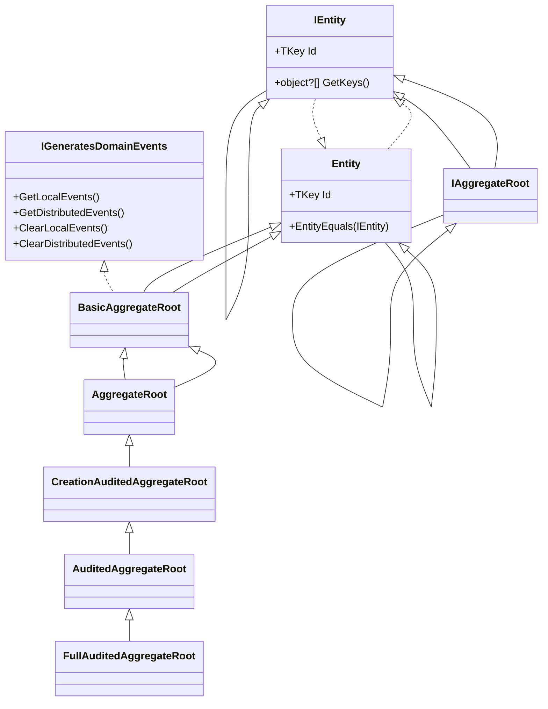

The `Volo/Abp/Domain/Entities/` folder under `framework/src/Volo.Abp.Ddd.Domain/` is the centre of gravity of every ABP domain model. It defines `IEntity` and its key-typed sibling `IEntity<TKey>`, the `Entity` and `Entity<TKey>` base classes, the layered `BasicAggregateRoot` → `AggregateRoot` hierarchy, the auditing variants (`CreationAudited*`, `Audited*`, `FullAudited*`), the in-process domain event infrastructure (`IGeneratesDomainEvents` + `DomainEventRecord`), the entity cache abstraction, and several helper utilities (`EntityHelper`, `ConcurrencyStampConsts`, `DisableIdGenerationAttribute`).

This page maps the whole folder, shows the inheritance diagram, and quotes the actual source so you can navigate it confidently.

## Folder layout

```
framework/src/Volo.Abp.Ddd.Domain/Volo/Abp/Domain/Entities/
├── AggregateRoot.cs
├── BasicAggregateRoot.cs
├── ConcurrencyStampConsts.cs
├── DisableIdGenerationAttribute.cs
├── DomainEventRecord.cs
├── Entity.cs
├── EntityHelper.cs
├── IAggregateRoot.cs
├── IEntity.cs
├── IGeneratesDomainEvents.cs
├── Auditing/
│   ├── CreationAuditedAggregateRoot.cs   CreationAuditedAggregateRootWithUser.cs
│   ├── CreationAuditedEntity.cs           CreationAuditedEntityWithUser.cs
│   ├── AuditedAggregateRoot.cs            AuditedAggregateRootWithUser.cs
│   ├── AuditedEntity.cs                    AuditedEntityWithUser.cs
│   ├── FullAuditedAggregateRoot.cs         FullAuditedAggregateRootWithUser.cs
│   └── FullAuditedEntity.cs                FullAuditedEntityWithUser.cs
├── Caching/
│   ├── IEntityCache.cs
│   ├── EntityCacheBase.cs
│   ├── EntityCacheWithObjectMapper.cs / Context.cs
│   ├── EntityCacheWithoutCacheItem.cs
│   ├── EntityCacheItemWrapper.cs
│   └── EntityCacheServiceCollectionExtensions.cs
└── Events/
    ├── EntityCreatedEventData.cs
    ├── EntityUpdatedEventData.cs
    ├── EntityDeletedEventData.cs
    ├── EntityChangedEventData.cs
    ├── EntityEventData.cs
    ├── EntityEventReport.cs
    ├── EntityChangeEntry.cs
    ├── DomainEventEntry.cs
    ├── AbpEntityChangeOptions.cs
    ├── EntityChangeEventHelper.cs
    ├── EntitySelectorList.cs / Extensions.cs
    ├── IEntityChangeEventHelper.cs / NullEntityChangeEventHelper.cs
    └── Distributed/
        ├── AutoEntityDistributedEventSelectorListExtensions.cs
        ├── EntitySynchronizer.cs
        └── EntityToEtoMapper.cs
```

## Inheritance diagram



## Core interfaces

```csharp
// framework/src/Volo.Abp.Ddd.Domain/Volo/Abp/Domain/Entities/IEntity.cs
public interface IEntity
{
    object?[] GetKeys();
}

public interface IEntity<TKey> : IEntity
{
    TKey Id { get; }
}

// framework/src/Volo.Abp.Ddd.Domain/Volo/Abp/Domain/Entities/IAggregateRoot.cs
public interface IAggregateRoot : IEntity { }
public interface IAggregateRoot<TKey> : IEntity<TKey>, IAggregateRoot { }
```

`IEntity` carries only keys — but they're an `object?[]` array so the framework can support composite primary keys uniformly. `IAggregateRoot` is purely a marker; ABP's repositories and infrastructure key off it to enforce the "one repository per aggregate root" rule.

```csharp
// framework/src/Volo.Abp.Ddd.Domain/Volo/Abp/Domain/Entities/IGeneratesDomainEvents.cs
public interface IGeneratesDomainEvents
{
    IEnumerable<DomainEventRecord> GetLocalEvents();
    IEnumerable<DomainEventRecord> GetDistributedEvents();
    void ClearLocalEvents();
    void ClearDistributedEvents();
}
```

## Entity and Entity\<TKey\>

```csharp
// framework/src/Volo.Abp.Ddd.Domain/Volo/Abp/Domain/Entities/Entity.cs
[Serializable]
public abstract class Entity : IEntity
{
    protected Entity()
    {
        EntityHelper.TrySetTenantId(this);
    }

    public override string ToString()
        => $"[ENTITY: {GetType().Name}] Keys = {GetKeys().JoinAsString(", ")}";

    public abstract object?[] GetKeys();

    public bool EntityEquals(IEntity other) => EntityHelper.EntityEquals(this, other);
}

[Serializable]
public abstract class Entity<TKey> : Entity, IEntity<TKey>
{
    public virtual TKey Id { get; protected set; } = default!;

    protected Entity() { }
    protected Entity(TKey id) { Id = id; }

    public override object?[] GetKeys() => new object?[] { Id };
    public override string ToString() => $"[ENTITY: {GetType().Name}] Id = {Id}";
}
```

Two important defaults:

- `protected Entity()` calls `EntityHelper.TrySetTenantId(this)` — every entity that also implements `IMultiTenant` is auto-stamped with the current tenant id at construction time.
- `Id` has a `protected set` so business code is forced to go through constructors or factory methods.

## BasicAggregateRoot

```csharp
// framework/src/Volo.Abp.Ddd.Domain/Volo/Abp/Domain/Entities/BasicAggregateRoot.cs
[Serializable]
public abstract class BasicAggregateRoot : Entity, IAggregateRoot, IGeneratesDomainEvents
{
    private readonly ICollection<DomainEventRecord> _distributedEvents = new Collection<DomainEventRecord>();
    private readonly ICollection<DomainEventRecord> _localEvents = new Collection<DomainEventRecord>();

    public virtual IEnumerable<DomainEventRecord> GetLocalEvents() => _localEvents;
    public virtual IEnumerable<DomainEventRecord> GetDistributedEvents() => _distributedEvents;
    public virtual void ClearLocalEvents() => _localEvents.Clear();
    public virtual void ClearDistributedEvents() => _distributedEvents.Clear();

    protected virtual void AddLocalEvent(object eventData)
        => _localEvents.Add(new DomainEventRecord(eventData, EventOrderGenerator.GetNext()));

    protected virtual void AddDistributedEvent(object eventData)
        => _distributedEvents.Add(new DomainEventRecord(eventData, EventOrderGenerator.GetNext()));
}

[Serializable]
public abstract class BasicAggregateRoot<TKey> : Entity<TKey>, IAggregateRoot<TKey>, IGeneratesDomainEvents
{
    // ... same event collections, with TKey-aware constructors
    protected BasicAggregateRoot() { }
    protected BasicAggregateRoot(TKey id) : base(id) { }
}
```

`BasicAggregateRoot` is the "no auditing, no extra-properties, no concurrency stamp" variant. It is the simplest base class that still supports domain events — useful for invariants where you genuinely don't want audit timestamps or extra-properties (small lookup tables, settings rows that you handle yourself).

## DomainEventRecord

```csharp
// framework/src/Volo.Abp.Ddd.Domain/Volo/Abp/Domain/Entities/DomainEventRecord.cs
public class DomainEventRecord
{
    public object EventData { get; }
    public long EventOrder { get; }

    public DomainEventRecord(object eventData, long eventOrder)
    {
        EventData = eventData;
        EventOrder = eventOrder;
    }
}
```

`EventOrder` is monotonically generated by `EventOrderGenerator.GetNext()` so the event bus can preserve insertion order even when multiple aggregates publish to the same unit of work.

## AggregateRoot

```csharp
// framework/src/Volo.Abp.Ddd.Domain/Volo/Abp/Domain/Entities/AggregateRoot.cs
[Serializable]
public abstract class AggregateRoot : BasicAggregateRoot, IHasExtraProperties, IHasConcurrencyStamp
{
    public virtual ExtraPropertyDictionary ExtraProperties { get; protected set; }

    [DisableAuditing]
    public virtual string ConcurrencyStamp { get; set; }

    protected AggregateRoot()
    {
        ConcurrencyStamp = Guid.NewGuid().ToString("N");
        ExtraProperties = new ExtraPropertyDictionary();
        this.SetDefaultsForExtraProperties();
    }

    public virtual IEnumerable<ValidationResult> Validate(ValidationContext validationContext)
        => ExtensibleObjectValidator.GetValidationErrors(this, validationContext);
}

[Serializable]
public abstract class AggregateRoot<TKey> : BasicAggregateRoot<TKey>, IHasExtraProperties, IHasConcurrencyStamp
{
    public virtual ExtraPropertyDictionary ExtraProperties { get; protected set; }

    [DisableAuditing]
    public virtual string ConcurrencyStamp { get; set; }

    protected AggregateRoot()
    {
        ConcurrencyStamp = Guid.NewGuid().ToString("N");
        ExtraProperties = new ExtraPropertyDictionary();
        this.SetDefaultsForExtraProperties();
    }

    protected AggregateRoot(TKey id) : base(id)
    {
        ConcurrencyStamp = Guid.NewGuid().ToString("N");
        ExtraProperties = new ExtraPropertyDictionary();
        this.SetDefaultsForExtraProperties();
    }

    public virtual IEnumerable<ValidationResult> Validate(ValidationContext validationContext)
        => ExtensibleObjectValidator.GetValidationErrors(this, validationContext);
}
```

`AggregateRoot` brings four ABP-specific upgrades on top of `BasicAggregateRoot`:

| Feature | Source of truth |
| --- | --- |
| `ConcurrencyStamp` (`IHasConcurrencyStamp`) | Used by EF Core as `RowVersion` / optimistic concurrency token. `[DisableAuditing]` keeps it out of audit logs. |
| `ExtraProperties` (`IHasExtraProperties`) | The dictionary backing [Object Extending](/ddd/object-extending). `SetDefaultsForExtraProperties` populates default values registered in `ObjectExtensionManager`. |
| Domain event collections | Inherited from `BasicAggregateRoot` (see above). |
| `Validate(ValidationContext)` | Routes through `ExtensibleObjectValidator` so the framework can enforce object-extension validation rules. |

## ConcurrencyStampConsts

```csharp
public static class ConcurrencyStampConsts
{
    public const int MaxLength = 40;
}
```

EF Core conventions (in `framework/src/Volo.Abp.EntityFrameworkCore/...`) use `ConcurrencyStampConsts.MaxLength` when building the column. See [data/entityframeworkcore](/data/entityframeworkcore).

## DisableIdGenerationAttribute

`DisableIdGenerationAttribute` is applied to entity classes (or their constructors) where ABP's automatic ID generation should *not* fire. The EF Core integration uses it to skip `IGuidGenerator`/`SimpleGuidGenerator`-based fillers; see the EF Core repository documentation for the consuming side.

## Auditing subfolder

ABP layers auditing in three steps, mirrored for both regular entities and aggregate roots:

```
Entity / AggregateRoot
   └── CreationAudited*   ── + CreationTime, CreatorId
        └── Audited*       ── + LastModificationTime, LastModifierId
             └── FullAudited* ── + IsDeleted, DeleterId, DeletionTime
```

### CreationAuditedAggregateRoot

```csharp
// framework/src/Volo.Abp.Ddd.Domain/Volo/Abp/Domain/Entities/Auditing/CreationAuditedAggregateRoot.cs
[Serializable]
public abstract class CreationAuditedAggregateRoot : AggregateRoot, ICreationAuditedObject
{
    public virtual DateTime CreationTime { get; protected set; }
    public virtual Guid? CreatorId { get; protected set; }
}

[Serializable]
public abstract class CreationAuditedAggregateRoot<TKey> : AggregateRoot<TKey>, ICreationAuditedObject
{
    public virtual DateTime CreationTime { get; set; }
    public virtual Guid? CreatorId { get; set; }

    protected CreationAuditedAggregateRoot() { }
    protected CreationAuditedAggregateRoot(TKey id) : base(id) { }
}
```

### AuditedAggregateRoot

```csharp
[Serializable]
public abstract class AuditedAggregateRoot : CreationAuditedAggregateRoot, IAuditedObject
{
    public virtual DateTime? LastModificationTime { get; set; }
    public virtual Guid? LastModifierId { get; set; }
}

[Serializable]
public abstract class AuditedAggregateRoot<TKey> : CreationAuditedAggregateRoot<TKey>, IAuditedObject
{
    public virtual DateTime? LastModificationTime { get; set; }
    public virtual Guid? LastModifierId { get; set; }

    protected AuditedAggregateRoot() { }
    protected AuditedAggregateRoot(TKey id) : base(id) { }
}
```

### FullAuditedAggregateRoot

```csharp
[Serializable]
public abstract class FullAuditedAggregateRoot : AuditedAggregateRoot, IFullAuditedObject
{
    public virtual bool IsDeleted { get; set; }
    public virtual Guid? DeleterId { get; set; }
    public virtual DateTime? DeletionTime { get; set; }
}

[Serializable]
public abstract class FullAuditedAggregateRoot<TKey> : AuditedAggregateRoot<TKey>, IFullAuditedObject
{
    public virtual bool IsDeleted { get; set; }
    public virtual Guid? DeleterId { get; set; }
    public virtual DateTime? DeletionTime { get; set; }

    protected FullAuditedAggregateRoot() { }
    protected FullAuditedAggregateRoot(TKey id) : base(id) { }
}
```

The auditing properties are stamped automatically by ABP's auditing infrastructure (registered through `AbpAuditingModule`). When the entity also implements `ISoftDelete` — which `FullAuditedAggregateRoot` does via `IFullAuditedObject` — ABP rewrites `Repository.DeleteAsync(...)` calls into `IsDeleted = true; DeletionTime = Now; DeleterId = currentUserId` updates and adds a global filter so soft-deleted rows are hidden by default. See [data/data-filtering](/data/data-filtering).

### Entity variants

Identical hierarchy for entities that are *not* aggregate roots. Source files: `CreationAuditedEntity.cs`, `AuditedEntity.cs`, `FullAuditedEntity.cs`. Example:

```csharp
// framework/src/Volo.Abp.Ddd.Domain/Volo/Abp/Domain/Entities/Auditing/FullAuditedEntity.cs
[Serializable]
public abstract class FullAuditedEntity<TKey> : AuditedEntity<TKey>, IFullAuditedObject
{
    public virtual bool IsDeleted { get; set; }
    public virtual Guid? DeleterId { get; set; }
    public virtual DateTime? DeletionTime { get; set; }
}
```

### *WithUser variants

Each of the six classes (Creation/Audited/FullAudited × Entity/AggregateRoot) also has a `*WithUser` sibling. They add navigation properties to the audited user — useful when you want EF Core to eagerly include `Creator`/`LastModifier` user metadata in admin UIs.

## Events subfolder

The in-process domain event types live next to the entities:

```csharp
// framework/src/Volo.Abp.Ddd.Domain/Volo/Abp/Domain/Entities/Events/EntityEventData.cs
[Serializable]
public class EntityEventData<TEntity> : IEventDataWithInheritableGenericArgument, IEventDataMayHaveTenantId
{
    public TEntity Entity { get; }

    public EntityEventData(TEntity entity)
    {
        Entity = entity;
    }

    public virtual object[] GetConstructorArgs() => new object[] { Entity! };

    public virtual bool IsMultiTenant(out Guid? tenantId)
    {
        if (Entity is IMultiTenant multiTenantEntity)
        {
            tenantId = multiTenantEntity.TenantId;
            return true;
        }
        tenantId = null;
        return false;
    }
}
```

```csharp
// EntityCreatedEventData.cs
public class EntityCreatedEventData<TEntity> : EntityChangedEventData<TEntity>
{
    public EntityCreatedEventData(TEntity entity) : base(entity) { }
}

// EntityUpdatedEventData.cs
public class EntityUpdatedEventData<TEntity> : EntityChangedEventData<TEntity>
{
    public EntityUpdatedEventData(TEntity entity) : base(entity) { }
}

// EntityDeletedEventData.cs
public class EntityDeletedEventData<TEntity> : EntityChangedEventData<TEntity>
{
    public EntityDeletedEventData(TEntity entity) : base(entity) { }
}
```

You can subscribe to these by implementing `ILocalEventHandler<EntityCreatedEventData<MyEntity>>`. The `IEventDataWithInheritableGenericArgument` interface causes handlers for base types to also receive the event — handy when you want a single handler for "any creation" by listening on `EntityCreatedEventData<IEntity>`.

### Selectors and options

`EntitySelectorList`, `IEntitySelectorList`, `EntitySelectorListExtensions`, and `AbpEntityChangeOptions` configure which entities should publish lifecycle events. `EntityChangeEventHelper`/`IEntityChangeEventHelper` (and the null-pattern `NullEntityChangeEventHelper`) are the helper services used by repositories during `Insert/Update/Delete` to schedule the event.

### Distributed variants

`Events/Distributed/EntitySynchronizer.cs` and `EntityToEtoMapper.cs` together implement automatic publishing of `EntityCreatedEto<TEntityEto>`, `EntityUpdatedEto<TEntityEto>`, and `EntityDeletedEto<TEntityEto>` (the types live in [Domain.Shared](/ddd/domain-shared#the-distributed-entity-etos)). The `AutoEntityDistributedEventSelectorListExtensions` give you fluent helpers like `options.AutoEventSelectors.Add<MyAggregate>()`.

## Caching subfolder

ABP ships a small entity-cache abstraction so modules can keep frequently-read aggregates in a distributed cache (Redis, in-memory, ...) while transparently invalidating on changes:

```csharp
// framework/src/Volo.Abp.Ddd.Domain/Volo/Abp/Domain/Entities/Caching/IEntityCache.cs
public interface IEntityCache<TEntityCacheItem, in TKey>
    where TEntityCacheItem : class
{
    Task<TEntityCacheItem?> FindAsync(TKey id);
    Task<TEntityCacheItem> GetAsync(TKey id);
}
```

```csharp
// EntityCacheBase.cs (excerpt)
public abstract class EntityCacheBase<TEntity, TEntityCacheItem, TKey> :
    IEntityCache<TEntityCacheItem, TKey>,
    ILocalEventHandler<EntityChangedEventData<TEntity>>
    where TEntity : Entity<TKey>
    where TEntityCacheItem : class
{
    protected IReadOnlyRepository<TEntity, TKey> Repository { get; }
    protected IDistributedCache<EntityCacheItemWrapper<TEntityCacheItem>, TKey> Cache { get; }
    protected IUnitOfWorkManager UnitOfWorkManager { get; }

    public virtual async Task<TEntityCacheItem?> FindAsync(TKey id) { ... }
    public virtual async Task<TEntityCacheItem> GetAsync(TKey id) { ... }
}
```

Because it implements `ILocalEventHandler<EntityChangedEventData<TEntity>>`, the cache invalidates itself whenever a matching `EntityChanged` event fires.

The helper classes `EntityCacheWithObjectMapper`/`EntityCacheWithObjectMapperContext`/`EntityCacheWithoutCacheItem` let you choose between mapping entities to dedicated cache DTOs (recommended) and caching the raw entity. `EntityCacheServiceCollectionExtensions.AddEntityCache<>()` registers everything in one call.

## EntityHelper

`EntityHelper` consolidates entity reflection utilities:

```csharp
public static class EntityHelper
{
    public static bool IsMultiTenant<TEntity>() where TEntity : IEntity;
    public static bool IsMultiTenant(Type type);
    public static bool EntityEquals(IEntity? entity1, IEntity? entity2);
    public static bool HasDefaultKeys(IEntity entity);
    public static void TrySetTenantId(IEntity entity);
    public static bool IsEntity(Type type);
    public static void CheckEntity(Type type);
    public static bool IsEntityWithId(Type type);
    public static bool HasDefaultId<TKey>(IEntity<TKey> entity);
    public static Func<Type, bool> IsValueObjectPredicate;
    public static bool IsValueObject(Type type);
    public static bool IsValueObject(object? obj);
    // + Expression<Func<TEntity, bool>> builders for FindByKeys
}
```

Highlights:

- `EntityEquals` is the canonical comparison used by `Entity.EntityEquals`. It enforces (a) reference equality, (b) class-compatible types, (c) same tenant id if both are `IMultiTenant`, (d) non-default keys, and (e) per-key equality.
- `HasDefaultId<TKey>` knows about EF Core's quirk of mapping unsaved `int`/`long` ids to `int.MinValue`.
- `TrySetTenantId` reflects on `ICurrentTenant` and assigns `entity.TenantId` if applicable. This is what allows `new Order()` to be tenant-stamped automatically.

## Worked example

Putting the pieces together — a fully-audited multi-tenant aggregate that emits a domain event:

```csharp
public class Order : FullAuditedAggregateRoot<Guid>, IMultiTenant
{
    public Guid? TenantId { get; private set; }
    public string Number { get; private set; }
    public OrderStatus Status { get; private set; }

    private Order() { /* for ORM */ }

    public Order(Guid id, string number) : base(id)
    {
        Number = number;
        Status = OrderStatus.Draft;
        AddLocalEvent(new EntityCreatedEventData<Order>(this));
    }

    public void Submit()
    {
        if (Status != OrderStatus.Draft)
            throw new BusinessException("OrderShop:OrderAlreadySubmitted");

        Status = OrderStatus.Submitted;
        AddLocalEvent(new OrderSubmittedEvent(Id));
    }
}
```

Everything ABP needs for the row — `Id`, `ConcurrencyStamp`, `ExtraProperties`, `CreationTime`/`CreatorId`/`LastModificationTime`/`LastModifierId`/`IsDeleted`/`DeleterId`/`DeletionTime`/`TenantId` — is inherited. The class only declares the *domain* state and the domain events.

## Cross-references

- [Domain](/ddd/domain) — the wider package that owns this folder.
- [Repositories](/ddd/repositories) — `IRepository<TEntity, TKey>` is generic on `IEntity<TKey>`.
- [Domain Services](/ddd/domain-services) — services that operate on aggregates.
- [Object Extending](/ddd/object-extending) — `ExtraPropertyDictionary` and `ObjectExtensionManager`.
- [data/data-filtering](/data/data-filtering) — soft-delete and multi-tenant filters that target the auditing interfaces.
- [data/unit-of-work](/data/unit-of-work) — where local domain events are dispatched.
- [Domain.Shared](/ddd/domain-shared) — distributed-event counterparts of the in-process event data.
- [core/timing](/core/timing) — `IClock.Now` that populates `CreationTime`.
- [core/guids](/core/guids) — `IGuidGenerator` for `Id` generation (skippable with `[DisableIdGeneration]`).
