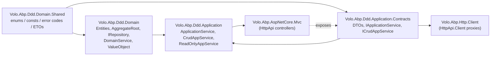

The ABP Framework ships an opinionated set of Domain-Driven Design (DDD) building blocks distributed across the `framework/src/Volo.Abp.Ddd.*` projects. These packages implement the four canonical layers — `Domain.Shared`, `Domain`, `Application.Contracts`, and `Application` — and provide the abstractions (`Entity`, `AggregateRoot`, `IRepository`, `ApplicationService`, DTOs, specifications, mappers and object extension hooks) that every ABP module is built on top of. This section walks each package end-to-end and links the source files in `framework/src/` so you can navigate the runtime with confidence.

The wiki group is organised so that you can read top-down — start with the layer model on this page, then drill into each package and its primary types. Every page cites the original C# files under `/home/daytona/repos/abpframework/abp/framework/src/Volo.Abp.Ddd.*/` (or sibling packages such as `Volo.Abp.ObjectMapping`, `Volo.Abp.AutoMapper`, `Volo.Abp.Mapperly`, `Volo.Abp.Specifications`, and `Volo.Abp.ObjectExtending`) so you can verify or extend behaviour directly in source.

## The four DDD layers

ABP splits a solution into four ordered layers. Each one references only what is *below* it in the dependency chain, which keeps client code free of server-only dependencies and lets the same domain be projected over EF Core, MongoDB, or any other persistence module without rewrites.



The diagram intentionally mirrors ABP's solution templates: clients depend only on `Application.Contracts` (and therefore on `Domain.Shared` transitively), while the server completes the picture by referencing `Application` plus an HTTP API host module.

## Layer responsibilities at a glance

<CardGroup cols={2}>
  <Card title="Domain.Shared" icon="layer-group" href="/ddd/domain-shared">
    Tiny package of enums, constants, error codes, and shared ETOs that both Domain and clients can reuse safely.
  </Card>
  <Card title="Domain" icon="cubes" href="/ddd/domain">
    Server-side core: entities, aggregate roots, repositories, domain services, specifications, value objects.
  </Card>
  <Card title="Application.Contracts" icon="file-contract" href="/ddd/application-contracts">
    DTOs and application service interfaces. The single contract surface every client (Blazor, MVC, mobile) consumes.
  </Card>
  <Card title="Application" icon="layer-plus" href="/ddd/application">
    Concrete `ApplicationService`, `CrudAppService`, `ReadOnlyAppService` implementations and CRUD scaffolding.
  </Card>
  <Card title="Entities & Aggregates" icon="diagram-project" href="/ddd/entities-and-aggregates">
    `Entity<TKey>`, `AggregateRoot<TKey>`, `BasicAggregateRoot`, auditing mix-ins, domain events and entity caching.
  </Card>
  <Card title="Repositories" icon="database" href="/ddd/repositories">
    `IRepository<TEntity>` family, base classes, async extensions, conventional registrar and change tracking hooks.
  </Card>
  <Card title="Domain Services" icon="gears" href="/ddd/domain-services">
    `DomainService` base class and `IDomainService` marker that wire up logger, clock, GUID generator, current tenant.
  </Card>
  <Card title="Specifications" icon="filter" href="/ddd/specifications">
    `ISpecification<T>` pattern and `And`/`Or`/`Not`/`AndNot` composition that flows into LINQ predicates.
  </Card>
  <Card title="Value Objects" icon="boxes-stacked" href="/ddd/value-objects">
    `ValueObject` base class with structural equality through `GetAtomicValues`.
  </Card>
  <Card title="Object Mapping" icon="arrows-left-right" href="/ddd/object-mapping">
    `IObjectMapper`, `IObjectMapper<TContext>`, `IMapTo`/`IMapFrom`, the `DefaultObjectMapper` orchestrator.
  </Card>
  <Card title="AutoMapper" icon="map" href="/ddd/automapper">
    `AbpAutoMapperOptions.AddMaps<TModule>()`, profile validation, `IAbpAutoMapperConfigurationContext`.
  </Card>
  <Card title="Mapperly" icon="bolt" href="/ddd/mapperly">
    Source-generated mappers via `MapperBase<TSource, TDestination>` and `[MapExtraProperties]`.
  </Card>
  <Card title="Object Extending" icon="puzzle-piece" href="/ddd/object-extending">
    `ObjectExtensionManager`, `ExtensibleObject`, `ExtraPropertyDictionary`, `IHasExtraProperties`.
  </Card>
</CardGroup>

## Reading order for newcomers

<Steps>
  <Step title="Skim Domain.Shared and Domain">
    Start at [Domain.Shared](/ddd/domain-shared) to see what the package legitimately holds (no behaviour, just symbols), then move to [Domain](/ddd/domain) for `Entity`, `AggregateRoot`, repositories and domain services.
  </Step>
  <Step title="Drill into entity hierarchy and repositories">
    Read [Entities & Aggregates](/ddd/entities-and-aggregates) for the full class diagram (Entity → BasicAggregateRoot → AggregateRoot) and the auditing variants, then continue with [Repositories](/ddd/repositories) to understand `IBasicRepository`, `IReadOnlyRepository`, `IRepository<TEntity, TKey>` and how `BasicRepositoryBase`/`RepositoryBase` are completed by EF Core or MongoDB modules.
  </Step>
  <Step title="Move up to Application.Contracts and Application">
    [Application.Contracts](/ddd/application-contracts) catalogues the DTO hierarchy and `ICrudAppService` family. [Application](/ddd/application) then walks the concrete `CrudAppService<TEntity, TEntityDto, TKey, ...>` matrix.
  </Step>
  <Step title="Round out with mapping & extension utilities">
    [Object Mapping](/ddd/object-mapping), [AutoMapper](/ddd/automapper), [Mapperly](/ddd/mapperly), and [Object Extending](/ddd/object-extending) describe the infrastructure that glues `ApplicationService.ObjectMapper` to your DTOs and lets modules expand entities without forking.
  </Step>
</Steps>

## What does each package physically contain?

The table below maps each package folder under `framework/src/` to its conceptual role. Click any row to jump to the deep-dive.

| Package | Path | Primary contents |
| --- | --- | --- |
| `Volo.Abp.Ddd.Domain.Shared` | `framework/src/Volo.Abp.Ddd.Domain.Shared/` | `AbpDddDomainSharedModule`, ETO classes, distributed event selectors. See [Domain.Shared](/ddd/domain-shared). |
| `Volo.Abp.Ddd.Domain` | `framework/src/Volo.Abp.Ddd.Domain/` | `AbpDddDomainModule`, `Entity`, `AggregateRoot`, repositories, domain services, change tracking, telemetry. See [Domain](/ddd/domain). |
| `Volo.Abp.Ddd.Application.Contracts` | `framework/src/Volo.Abp.Ddd.Application.Contracts/` | `AbpDddApplicationContractsModule`, DTO families, `IApplicationService`, `ICrudAppService`. See [Application.Contracts](/ddd/application-contracts). |
| `Volo.Abp.Ddd.Application` | `framework/src/Volo.Abp.Ddd.Application/` | `AbpDddApplicationModule`, `ApplicationService`, `CrudAppService`, `AbstractKeyCrudAppService`, `ReadOnlyAppService`. See [Application](/ddd/application). |
| `Volo.Abp.Specifications` | `framework/src/Volo.Abp.Specifications/` | `ISpecification<T>`, `Specification<T>`, composite specifications. See [Specifications](/ddd/specifications). |
| `Volo.Abp.ObjectMapping` | `framework/src/Volo.Abp.ObjectMapping/` | `IObjectMapper`, `DefaultObjectMapper`. See [Object Mapping](/ddd/object-mapping). |
| `Volo.Abp.AutoMapper` | `framework/src/Volo.Abp.AutoMapper/` | `AbpAutoMapperOptions`, `IMapperAccessor`, `AutoMapperAutoObjectMappingProvider`. See [AutoMapper](/ddd/automapper). |
| `Volo.Abp.Mapperly` | `framework/src/Volo.Abp.Mapperly/` | `MapperBase<TSource, TDestination>`, `MapperlyAutoObjectMappingProvider`. See [Mapperly](/ddd/mapperly). |
| `Volo.Abp.ObjectExtending` | `framework/src/Volo.Abp.ObjectExtending/` | `ObjectExtensionManager`, `ExtensibleObject`, `ExtraPropertyDictionary`. See [Object Extending](/ddd/object-extending). |

## How DDD layers compose with the rest of the framework

The DDD packages plug straight into the rest of the ABP runtime:

- The **Core Runtime** group (`core/*`) provides `AbpModule`, dependency injection, options binding, exception handling, threading and timing primitives that every DDD type depends on. See [Modularity](/core/modularity), [Dependency Injection](/core/dependency-injection), and [Volo.Abp.Core](/core/volo-abp-core).
- The **Data & Persistence** group (`data/*`) implements `IRepository<TEntity, TKey>` on top of EF Core ([data/entityframeworkcore](/data/entityframeworkcore)), MongoDB ([data/mongodb](/data/mongodb)) or Dapper ([data/dapper](/data/dapper)). The `Unit of Work` pipeline in [data/unit-of-work](/data/unit-of-work) wraps every repository call.
- The HTTP layers (controllers and dynamic clients) project `IApplicationService` over HTTP via the AspNetCore.Mvc and Http.Client packages — the typed contracts come straight from `Application.Contracts`.

## Module dependency graph

When you write `[DependsOn(typeof(AbpDddApplicationModule))]` you transitively pull in everything the DDD stack needs. The chain encoded in `framework/src/Volo.Abp.Ddd.Application/Volo/Abp/Application/AbpDddApplicationModule.cs` is:

```csharp
// framework/src/Volo.Abp.Ddd.Application/Volo/Abp/Application/AbpDddApplicationModule.cs
[DependsOn(
    typeof(AbpDddDomainModule),
    typeof(AbpDddApplicationContractsModule),
    typeof(AbpSecurityModule),
    typeof(AbpObjectMappingModule),
    typeof(AbpValidationModule),
    typeof(AbpAuthorizationModule),
    typeof(AbpHttpAbstractionsModule),
    typeof(AbpSettingsModule),
    typeof(AbpFeaturesModule),
    typeof(AbpGlobalFeaturesModule)
    )]
public class AbpDddApplicationModule : AbpModule { ... }
```

And in `framework/src/Volo.Abp.Ddd.Domain/Volo/Abp/Domain/AbpDddDomainModule.cs`:

```csharp
[DependsOn(
    typeof(AbpAuditingModule),
    typeof(AbpDataModule),
    typeof(AbpEventBusModule),
    typeof(AbpGuidsModule),
    typeof(AbpTimingModule),
    typeof(AbpObjectMappingModule),
    typeof(AbpExceptionHandlingModule),
    typeof(AbpSpecificationsModule),
    typeof(AbpCachingModule),
    typeof(AbpDddDomainSharedModule)
    )]
public class AbpDddDomainModule : AbpModule
{
    public override void PreConfigureServices(ServiceConfigurationContext context)
    {
        context.Services.AddConventionalRegistrar(new AbpRepositoryConventionalRegistrar());
        context.Services.OnRegistered(ChangeTrackingInterceptorRegistrar.RegisterIfNeeded);
    }
}
```

That single module registration registers `AbpRepositoryConventionalRegistrar` (see [Repositories](/ddd/repositories)) and wires up the entity change tracking interceptor described in the [Repositories](/ddd/repositories) deep-dive.

## Solution-template layering recap

If you generate a new solution from the ABP CLI or Studio you get one project per logical layer:

| Project | DDD layer it implements |
| --- | --- |
| `MyApp.Domain.Shared` | `Volo.Abp.Ddd.Domain.Shared` |
| `MyApp.Domain` | `Volo.Abp.Ddd.Domain` |
| `MyApp.Application.Contracts` | `Volo.Abp.Ddd.Application.Contracts` |
| `MyApp.Application` | `Volo.Abp.Ddd.Application` |
| `MyApp.HttpApi` | hosts controllers exposing application services |
| `MyApp.HttpApi.Client` | dynamic HTTP proxies for the contracts |

The deep-dives that follow always reference the framework package, not the generated project — but the rule of thumb is identical: keep "shared" symbols out of behavioural code, and never reference `Application` from a client.

<Tip>
Whenever you see an ABP module (Identity, Tenant Management, Audit Logging, etc.) follow exactly this layering. Once you internalise the conventions on this page, every ABP module's source becomes navigable.
</Tip>

## Next up

Continue with [Domain.Shared](/ddd/domain-shared) to see exactly what is allowed to live in the lowest layer, or jump straight to [Entities & Aggregates](/ddd/entities-and-aggregates) for the class hierarchy that anchors the entire framework.
