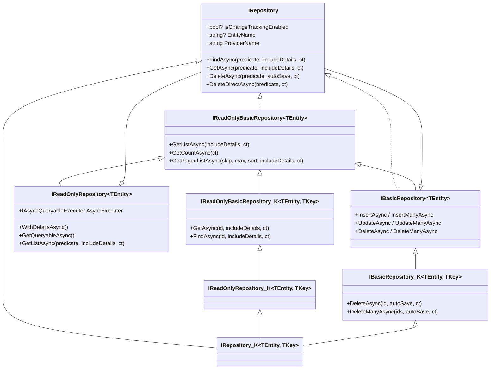

The `Volo/Abp/Domain/Repositories/` folder under `framework/src/Volo.Abp.Ddd.Domain/` defines the universal repository contracts that every ABP module talks to. The interfaces (`IRepository`, `IBasicRepository`, `IReadOnlyRepository`, `IReadOnlyBasicRepository`) are deliberately persistence-agnostic; concrete implementations live in `Volo.Abp.EntityFrameworkCore`, `Volo.Abp.MongoDB`, `Volo.Abp.MemoryDb`, etc. The abstract bases (`RepositoryBase<TEntity, TKey>`, `BasicRepositoryBase<TEntity>`) carry the shared cross-cutting plumbing — `IDataFilter`, `ICurrentTenant`, `IUnitOfWorkManager`, logger, `IEntityChangeTrackingProvider` — so each provider only fills in the storage-specific bits.

This page is a reference for everything in that folder.

## Folder map

```
framework/src/Volo.Abp.Ddd.Domain/Volo/Abp/Domain/Repositories/
├── IRepository.cs
├── IBasicRepository.cs
├── IReadOnlyRepository.cs
├── IReadOnlyBasicRepository.cs
├── ISupportsExplicitLoading.cs
├── RepositoryBase.cs
├── BasicRepositoryBase.cs
├── RepositoryAsyncExtensions.cs
├── RepositoryExtensions.cs
├── AbpRepositoryConventionalRegistrar.cs
├── EntityChangeTrackingProvider.cs
├── IEntityChangeTrackingProvider.cs
├── RepositoryRegistrarBase.cs
└── UnitOfWorkItemNames.cs
```

## Interface tower



Or in plain English:

- `IRepository` — the non-generic root carrying provider-level metadata.
- `IBasicRepository<TEntity>` — write-only operations (`Insert*`, `Update*`, `Delete*`). The "basic" variant exists so MongoDB-style providers, which can't always offer LINQ, still have a usable contract.
- `IBasicRepository<TEntity, TKey>` — adds `DeleteAsync(id)` / `DeleteManyAsync(ids)`.
- `IReadOnlyBasicRepository<TEntity>` — read-only counterpart with `GetListAsync`, `GetCountAsync`, `GetPagedListAsync`.
- `IReadOnlyBasicRepository<TEntity, TKey>` — adds `GetAsync(id)` / `FindAsync(id)`.
- `IReadOnlyRepository<TEntity>` — extends basic-read with LINQ (`GetQueryableAsync`, `WithDetailsAsync`, predicate-based `GetListAsync`) and exposes `IAsyncQueryableExecuter`.
- `IRepository<TEntity>` — the most-used contract: read + write + predicate-based `FindAsync`/`GetAsync`/`DeleteAsync` + `DeleteDirectAsync` for bulk fast paths.
- `IRepository<TEntity, TKey>` — the canonical full repository for `IEntity<TKey>` aggregates.

## IRepository (root)

```csharp
// framework/src/Volo.Abp.Ddd.Domain/Volo/Abp/Domain/Repositories/IRepository.cs
public interface IRepository
{
    bool? IsChangeTrackingEnabled { get; }
    string? EntityName { get; set; }
    string ProviderName { get; }
}
```

`ProviderName` lets generic code branch on persistence ("ef", "mongodb", ...). `EntityName` is set when the entity is associated with an explicit name (used by EF Core when multiple `DbSet` properties point at the same CLR type).

## IRepository\<TEntity\> and IRepository\<TEntity, TKey\>

```csharp
public interface IRepository<TEntity> : IReadOnlyRepository<TEntity>, IBasicRepository<TEntity>
    where TEntity : class, IEntity
{
    Task<TEntity?> FindAsync(
        [NotNull] Expression<Func<TEntity, bool>> predicate,
        bool includeDetails = true,
        CancellationToken cancellationToken = default);

    Task<TEntity> GetAsync(
        [NotNull] Expression<Func<TEntity, bool>> predicate,
        bool includeDetails = true,
        CancellationToken cancellationToken = default);

    Task DeleteAsync(
        [NotNull] Expression<Func<TEntity, bool>> predicate,
        bool autoSave = false,
        CancellationToken cancellationToken = default);

    Task DeleteDirectAsync(
        [NotNull] Expression<Func<TEntity, bool>> predicate,
        CancellationToken cancellationToken = default);
}

public interface IRepository<TEntity, TKey>
    : IRepository<TEntity>,
      IReadOnlyRepository<TEntity, TKey>,
      IBasicRepository<TEntity, TKey>
    where TEntity : class, IEntity<TKey>
{
}
```

`GetAsync(predicate)` throws `EntityNotFoundException<TEntity>` if no row matches and `InvalidOperationException` if multiple rows match. `FindAsync(predicate)` returns `null` instead. `DeleteAsync(predicate)` fetches matching rows first (so audit logging, soft-delete and entity events still apply); `DeleteDirectAsync(predicate)` issues a single `DELETE` against the database — fast, but bypasses soft-delete and multi-tenancy filters.

## IBasicRepository

```csharp
public interface IBasicRepository<TEntity> : IReadOnlyBasicRepository<TEntity>
    where TEntity : class, IEntity
{
    Task<TEntity> InsertAsync(TEntity entity, bool autoSave = false, CancellationToken cancellationToken = default);
    Task InsertManyAsync(IEnumerable<TEntity> entities, bool autoSave = false, CancellationToken cancellationToken = default);
    Task<TEntity> UpdateAsync(TEntity entity, bool autoSave = false, CancellationToken cancellationToken = default);
    Task UpdateManyAsync(IEnumerable<TEntity> entities, bool autoSave = false, CancellationToken cancellationToken = default);
    Task DeleteAsync(TEntity entity, bool autoSave = false, CancellationToken cancellationToken = default);
    Task DeleteManyAsync(IEnumerable<TEntity> entities, bool autoSave = false, CancellationToken cancellationToken = default);
}

public interface IBasicRepository<TEntity, TKey>
    : IBasicRepository<TEntity>, IReadOnlyBasicRepository<TEntity, TKey>
    where TEntity : class, IEntity<TKey>
{
    Task DeleteAsync(TKey id, bool autoSave = false, CancellationToken cancellationToken = default);
    Task DeleteManyAsync(IEnumerable<TKey> ids, bool autoSave = false, CancellationToken cancellationToken = default);
}
```

`autoSave = true` tells the repository to call `SaveChangesAsync` on the current unit of work immediately — useful when you need the generated Id before the surrounding [unit of work](/data/unit-of-work) closes.

## IReadOnlyRepository

```csharp
public interface IReadOnlyRepository<TEntity> : IReadOnlyBasicRepository<TEntity>
    where TEntity : class, IEntity
{
    IAsyncQueryableExecuter AsyncExecuter { get; }

    [Obsolete("Use WithDetailsAsync method.")] IQueryable<TEntity> WithDetails();
    [Obsolete("Use WithDetailsAsync method.")] IQueryable<TEntity> WithDetails(params Expression<Func<TEntity, object>>[] propertySelectors);

    Task<IQueryable<TEntity>> WithDetailsAsync();
    Task<IQueryable<TEntity>> WithDetailsAsync(params Expression<Func<TEntity, object>>[] propertySelectors);
    Task<IQueryable<TEntity>> GetQueryableAsync();

    Task<List<TEntity>> GetListAsync(
        Expression<Func<TEntity, bool>> predicate,
        bool includeDetails = false,
        CancellationToken cancellationToken = default);
}
```

`IAsyncQueryableExecuter` is the ABP abstraction that bridges synchronous `IQueryable` to the async LINQ operators every provider implements differently. See [data/entityframeworkcore](/data/entityframeworkcore) for the EF Core implementation.

`WithDetailsAsync` lets a repository declare which navigations should be eagerly loaded by default. EF Core uses an aggregate's `AbpEntityOptions<TEntity>.DefaultWithDetailsFunc` to honour this.

## IReadOnlyBasicRepository

```csharp
public interface IReadOnlyBasicRepository<TEntity> : IRepository
    where TEntity : class, IEntity
{
    Task<List<TEntity>> GetListAsync(bool includeDetails = false, CancellationToken cancellationToken = default);
    Task<long> GetCountAsync(CancellationToken cancellationToken = default);

    Task<List<TEntity>> GetPagedListAsync(
        int skipCount,
        int maxResultCount,
        string sorting,
        bool includeDetails = false,
        CancellationToken cancellationToken = default);
}

public interface IReadOnlyBasicRepository<TEntity, TKey> : IReadOnlyBasicRepository<TEntity>
    where TEntity : class, IEntity<TKey>
{
    Task<TEntity> GetAsync(TKey id, bool includeDetails = true, CancellationToken cancellationToken = default);
    Task<TEntity?> FindAsync(TKey id, bool includeDetails = true, CancellationToken cancellationToken = default);
}
```

The `GetAsync(id)` overload throws `EntityNotFoundException<TEntity>` for missing rows — the same exception is converted to a 404 response by the AspNetCore exception-handling pipeline.

## BasicRepositoryBase

```csharp
// framework/src/Volo.Abp.Ddd.Domain/Volo/Abp/Domain/Repositories/BasicRepositoryBase.cs
public abstract class BasicRepositoryBase<TEntity> :
    IBasicRepository<TEntity>,
    IServiceProviderAccessor,
    IUnitOfWorkEnabled
    where TEntity : class, IEntity
{
    public IAbpLazyServiceProvider LazyServiceProvider { get; set; } = default!;
    public IServiceProvider ServiceProvider { get; set; } = default!;

    public IDataFilter DataFilter => LazyServiceProvider.LazyGetRequiredService<IDataFilter>();
    public ICurrentTenant CurrentTenant => LazyServiceProvider.LazyGetRequiredService<ICurrentTenant>();
    public IAsyncQueryableExecuter AsyncExecuter => LazyServiceProvider.LazyGetRequiredService<IAsyncQueryableExecuter>();
    public IUnitOfWorkManager UnitOfWorkManager => LazyServiceProvider.LazyGetRequiredService<IUnitOfWorkManager>();
    public ICancellationTokenProvider CancellationTokenProvider => LazyServiceProvider.LazyGetService<ICancellationTokenProvider>(NullCancellationTokenProvider.Instance);
    public ILoggerFactory? LoggerFactory => LazyServiceProvider.LazyGetService<ILoggerFactory>();
    public ILogger Logger => LazyServiceProvider.LazyGetService<ILogger>(provider => LoggerFactory?.CreateLogger(GetType().FullName!) ?? NullLogger.Instance);
    public IEntityChangeTrackingProvider EntityChangeTrackingProvider => LazyServiceProvider.LazyGetRequiredService<IEntityChangeTrackingProvider>();

    public bool? IsChangeTrackingEnabled { get; protected set; }
    public string? EntityName { get; set; }
    public string ProviderName { get; }

    protected BasicRepositoryBase(string providerName)
    {
        ProviderName = Check.NotNullOrWhiteSpace(providerName, nameof(providerName));
    }

    public abstract Task<TEntity> InsertAsync(TEntity entity, bool autoSave = false, CancellationToken cancellationToken = default);

    public virtual async Task InsertManyAsync(IEnumerable<TEntity> entities, bool autoSave = false, CancellationToken cancellationToken = default)
    {
        foreach (var entity in entities) await InsertAsync(entity, cancellationToken: cancellationToken);
        if (autoSave) await SaveChangesAsync(cancellationToken);
    }

    protected virtual Task SaveChangesAsync(CancellationToken cancellationToken)
    {
        if (UnitOfWorkManager?.Current != null)
            return UnitOfWorkManager.Current.SaveChangesAsync(cancellationToken);
        return Task.CompletedTask;
    }
}
```

Every concrete provider derives from this base, fills in `InsertAsync`/`UpdateAsync`/`DeleteAsync`, and inherits the cross-cutting properties for free.

## RepositoryBase

```csharp
// framework/src/Volo.Abp.Ddd.Domain/Volo/Abp/Domain/Repositories/RepositoryBase.cs
public abstract class RepositoryBase<TEntity> : BasicRepositoryBase<TEntity>, IRepository<TEntity>, IUnitOfWorkManagerAccessor
    where TEntity : class, IEntity
{
    protected RepositoryBase(string providerName) : base(providerName) { }

    public virtual Task<IQueryable<TEntity>> WithDetailsAsync() => GetQueryableAsync();
    public virtual Task<IQueryable<TEntity>> WithDetailsAsync(params Expression<Func<TEntity, object>>[] propertySelectors) => GetQueryableAsync();

    [Obsolete("Use GetQueryableAsync method.")]
    protected abstract IQueryable<TEntity> GetQueryable();

    public abstract Task<IQueryable<TEntity>> GetQueryableAsync();

    public abstract Task<TEntity?> FindAsync(Expression<Func<TEntity, bool>> predicate, bool includeDetails = true, CancellationToken cancellationToken = default);

    public async Task<TEntity> GetAsync(Expression<Func<TEntity, bool>> predicate, bool includeDetails = true, CancellationToken cancellationToken = default)
    {
        var entity = await FindAsync(predicate, includeDetails, cancellationToken);
        if (entity == null) throw new EntityNotFoundException<TEntity>();
        return entity;
    }

    public abstract Task DeleteAsync(Expression<Func<TEntity, bool>> predicate, bool autoSave = false, CancellationToken cancellationToken = default);
    public abstract Task DeleteDirectAsync(Expression<Func<TEntity, bool>> predicate, CancellationToken cancellationToken = default);

    protected virtual TQueryable ApplyDataFilters<TQueryable>(TQueryable query) where TQueryable : IQueryable<TEntity>
        => ApplyDataFilters<TQueryable, TEntity>(query);

    protected virtual TQueryable ApplyDataFilters<TQueryable, TOtherEntity>(TQueryable query)
        where TQueryable : IQueryable<TOtherEntity>
    {
        if (typeof(ISoftDelete).IsAssignableFrom(typeof(TOtherEntity)))
            query = (TQueryable)query.WhereIf(DataFilter.IsEnabled<ISoftDelete>(), e => ((ISoftDelete)e!).IsDeleted == false);

        if (typeof(IMultiTenant).IsAssignableFrom(typeof(TOtherEntity)))
        {
            var tenantId = CurrentTenant.Id;
            query = (TQueryable)query.WhereIf(DataFilter.IsEnabled<IMultiTenant>(), e => ((IMultiTenant)e!).TenantId == tenantId);
        }

        return query;
    }
}

public abstract class RepositoryBase<TEntity, TKey> : RepositoryBase<TEntity>, IRepository<TEntity, TKey>
    where TEntity : class, IEntity<TKey>
{
    protected RepositoryBase(string providerName) : base(providerName) { }

    public abstract Task<TEntity> GetAsync(TKey id, bool includeDetails = true, CancellationToken cancellationToken = default);
    public abstract Task<TEntity?> FindAsync(TKey id, bool includeDetails = true, CancellationToken cancellationToken = default);

    public virtual async Task DeleteAsync(TKey id, bool autoSave = false, CancellationToken cancellationToken = default)
    {
        var entity = await FindAsync(id, cancellationToken: cancellationToken);
        if (entity == null) return;
        await DeleteAsync(entity, autoSave, cancellationToken);
    }

    public async Task DeleteManyAsync(IEnumerable<TKey> ids, bool autoSave = false, CancellationToken cancellationToken = default)
    {
        foreach (var id in ids) await DeleteAsync(id, cancellationToken: cancellationToken);
        if (autoSave) await SaveChangesAsync(cancellationToken);
    }
}
```

`ApplyDataFilters` is the single chokepoint that enforces soft-delete and multi-tenancy filters across all providers. Concrete `RepositoryBase` overrides (`EfCoreRepository<,>`, `MongoDbRepository<,>`) compose this with provider-specific include/tracking logic.

## Concrete provider implementations

Implementations of `RepositoryBase<TEntity, TKey>` live in their respective persistence packages:

| Provider | Class | Location |
| --- | --- | --- |
| EF Core | `EfCoreRepository<TDbContext, TEntity, TKey>` | `framework/src/Volo.Abp.EntityFrameworkCore/...` — see [data/entityframeworkcore](/data/entityframeworkcore) |
| MongoDB | `MongoDbRepository<TMongoDbContext, TEntity, TKey>` | `framework/src/Volo.Abp.MongoDB/...` — see [data/mongodb](/data/mongodb) |
| In-memory | `MemoryDbRepository<TMemoryDbContext, TEntity, TKey>` | `framework/src/Volo.Abp.MemoryDb/...` — see [data/memorydb](/data/memorydb) |
| Dapper | Read-only patterns layered on top of EF Core | see [data/dapper](/data/dapper) |

The provider chooses how it implements `GetQueryableAsync`, `InsertAsync`, etc., but always uses the shared `LazyServiceProvider`, `DataFilter`, `CurrentTenant`, and `IEntityChangeTrackingProvider` from the base.

## ISupportsExplicitLoading

```csharp
public interface ISupportsExplicitLoading<TEntity>
    where TEntity : class, IEntity
{
    Task EnsureCollectionLoadedAsync<TProperty>(
        TEntity entity,
        Expression<Func<TEntity, IEnumerable<TProperty>>> propertyExpression,
        CancellationToken cancellationToken)
        where TProperty : class;

    Task EnsurePropertyLoadedAsync<TProperty>(
        TEntity entity,
        Expression<Func<TEntity, TProperty?>> propertyExpression,
        CancellationToken cancellationToken)
        where TProperty : class;
}
```

Providers that support EF Core-style explicit loading (only the EF Core provider, today) implement this so the `RepositoryExtensions.EnsureCollectionLoadedAsync` / `EnsurePropertyLoadedAsync` extensions can transparently delegate to them.

## RepositoryAsyncExtensions

`RepositoryAsyncExtensions` exports LINQ-shaped helpers on `IReadOnlyRepository<T>`. The pattern they all follow is identical: `GetQueryableAsync()` → call `repository.AsyncExecuter.X(...)`. Examples include `AnyAsync`, `AllAsync`, `ContainsAsync`, `CountAsync`, `LongCountAsync`, `FirstAsync`, `FirstOrDefaultAsync`, `LastAsync`, `LastOrDefaultAsync`, `SingleAsync`, `SingleOrDefaultAsync`, `MinAsync`, `MaxAsync`, `SumAsync`, `AverageAsync`.

A representative one:

```csharp
public async static Task<int> CountAsync<T>(
    [NotNull] this IReadOnlyRepository<T> repository,
    [NotNull] Expression<Func<T, bool>> predicate,
    CancellationToken cancellationToken = default)
    where T : class, IEntity
{
    var queryable = await repository.GetQueryableAsync();
    return await repository.AsyncExecuter.CountAsync(queryable, predicate, cancellationToken);
}
```

Because they target `IReadOnlyRepository<T>`, your `ApplicationService` code can write `await Repository.CountAsync(x => x.IsActive)` without thinking about EF Core vs MongoDB.

## RepositoryExtensions

`RepositoryExtensions` exposes a few imperative helpers that don't fit the LINQ shape:

```csharp
public static class RepositoryExtensions
{
    public static Task EnsureCollectionLoadedAsync<TEntity, TProperty>(
        this IBasicRepository<TEntity> repository,
        TEntity entity,
        Expression<Func<TEntity, IEnumerable<TProperty>>> propertyExpression,
        CancellationToken cancellationToken = default)
        where TEntity : class, IEntity
        where TProperty : class;

    public static Task EnsurePropertyLoadedAsync<TEntity, TKey, TProperty>(
        this IBasicRepository<TEntity, TKey> repository,
        TEntity entity,
        Expression<Func<TEntity, TProperty?>> propertyExpression,
        CancellationToken cancellationToken = default)
        where TEntity : class, IEntity<TKey>
        where TProperty : class;

    public static Task EnsureExistsAsync<TEntity, TKey>(
        this IRepository<TEntity, TKey> repository, TKey id,
        CancellationToken cancellationToken = default)
        where TEntity : class, IEntity<TKey>;

    public static Task HardDeleteAsync<TEntity>(
        this IRepository<TEntity> repository,
        Expression<Func<TEntity, bool>> predicate,
        bool autoSave = false,
        CancellationToken cancellationToken = default)
        where TEntity : class, IEntity, ISoftDelete;
}
```

`HardDeleteAsync` is the only way to bypass `ISoftDelete` for an aggregate — it temporarily disables the `ISoftDelete` filter inside its own unit of work scope.

## Conventional registration

```csharp
// framework/src/Volo.Abp.Ddd.Domain/Volo/Abp/Domain/Repositories/AbpRepositoryConventionalRegistrar.cs
public class AbpRepositoryConventionalRegistrar : DefaultConventionalRegistrar
{
    public static bool ExposeRepositoryClasses { get; set; }

    protected override bool IsConventionalRegistrationDisabled(Type type)
        => !typeof(IRepository).IsAssignableFrom(type) || base.IsConventionalRegistrationDisabled(type);

    protected override List<Type> GetExposedServiceTypes(Type type)
    {
        if (ExposeRepositoryClasses) return base.GetExposedServiceTypes(type);
        return base.GetExposedServiceTypes(type).Where(x => x.IsInterface).ToList();
    }

    protected override ServiceLifetime? GetDefaultLifeTimeOrNull(Type type)
        => ServiceLifetime.Transient;
}
```

It is registered from `AbpDddDomainModule.PreConfigureServices`. By default, only interface registrations are exposed (`IRepository<MyEntity, Guid>` → resolves to `EfCoreRepository<MyDbContext, MyEntity, Guid>`). Set `AbpRepositoryConventionalRegistrar.ExposeRepositoryClasses = true` early if you need to inject concrete classes.

## EntityChangeTrackingProvider

```csharp
// framework/src/Volo.Abp.Ddd.Domain/Volo/Abp/Domain/Repositories/EntityChangeTrackingProvider.cs
public class EntityChangeTrackingProvider : IEntityChangeTrackingProvider, ISingletonDependency
{
    public bool? Enabled => _current.Value;
    private readonly AsyncLocal<bool?> _current = new AsyncLocal<bool?>();

    public IDisposable Change(bool? enabled)
    {
        var previousValue = Enabled;
        _current.Value = enabled;
        return new DisposeAction(() => _current.Value = previousValue);
    }
}
```

It maintains an `AsyncLocal<bool?>` flag that the EF Core repository checks to decide whether to attach entities with `EntityState.Modified` (change-tracking on) or `EntityState.Detached` then `EntityState.Modified` (off). The interceptor described in [Domain → ChangeTracking](/ddd/domain#changetracking) flips this flag for the lifetime of an annotated method.

## UnitOfWorkItemNames

Holds the well-known string keys used when stashing per-aggregate state into the current unit of work (e.g. cached `DbContext` instances per `IRepository`). It's an internal coordination contract; you rarely reference it directly.

## Worked example

```csharp
public class OrderAppService : ApplicationService, IOrderAppService
{
    private readonly IRepository<Order, Guid> _orders;

    public OrderAppService(IRepository<Order, Guid> orders)
    {
        _orders = orders;
    }

    public async Task<OrderDto> GetAsync(Guid id)
    {
        var order = await _orders.GetAsync(id, includeDetails: true);
        return ObjectMapper.Map<Order, OrderDto>(order);
    }

    public async Task<long> CountActiveAsync()
        => await _orders.CountAsync(o => o.Status == OrderStatus.Active);

    public async Task ArchiveOldAsync(DateTime cutoff)
        => await _orders.DeleteAsync(o => o.CreationTime < cutoff && o.Status == OrderStatus.Closed, autoSave: true);
}
```

The injection target is the interface `IRepository<Order, Guid>` — ABP resolves it through the conventional registrar to whichever provider the host module registered.

## Cross-references

- [Domain](/ddd/domain) — the package that hosts these types.
- [Entities & Aggregates](/ddd/entities-and-aggregates) — `IEntity<TKey>`, `EntityNotFoundException`, and auditing interfaces consumed here.
- [Application](/ddd/application) — `CrudAppService` calls into `IRepository<TEntity, TKey>`.
- [Specifications](/ddd/specifications) — pass `Specification<T>.ToExpression()` straight into `GetListAsync(predicate)`.
- [data/unit-of-work](/data/unit-of-work) — the surrounding UOW that `autoSave` flushes into.
- [data/data-filtering](/data/data-filtering) — `ISoftDelete` / `IMultiTenant` filters applied by `ApplyDataFilters`.
- [data/entityframeworkcore](/data/entityframeworkcore) — EF Core repository implementation.
- [data/mongodb](/data/mongodb) — MongoDB repository implementation.
- [data/memorydb](/data/memorydb) — in-memory implementation for testing.
- [core/dependency-injection](/core/dependency-injection) — `IAbpLazyServiceProvider` underpinning the base classes.
- [core/dynamic-proxy-and-aspects](/core/dynamic-proxy-and-aspects) — the change-tracking interceptor that flips `EntityChangeTrackingProvider`.
