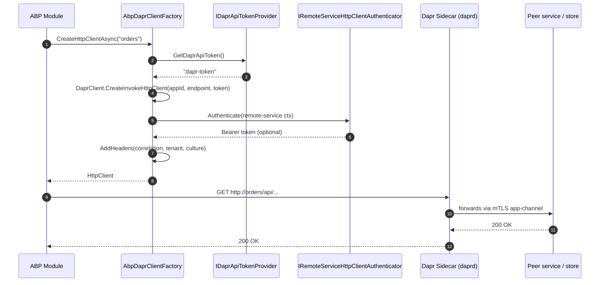

`Volo.Abp.Dapr` is the **ABP Framework** package that adapts an ABP module to a Dapr sidecar. It does not by itself talk to brokers, lock stores or peer services — it owns the *plumbing*: configuration binding, token providers and an `IAbpDaprClientFactory` that produces correctly configured `DaprClient` and `HttpClient` instances. Every higher-level package (HTTP client over Dapr, event bus, distributed locking) depends on it.

## Source layout

```text
framework/src/Volo.Abp.Dapr/Volo/Abp/Dapr/
├── AbpDaprClientFactory.cs
├── AbpDaprModule.cs
├── AbpDaprOptions.cs
├── DaprApiTokenProvider.cs
├── IAbpDaprClientFactory.cs
├── IDaprApiTokenProvider.cs
├── IDaprSerializer.cs
└── Utf8JsonDaprSerializer.cs
```

## How it sits between the app and the sidecar



The diagram captures four ABP-specific responsibilities: token injection, ABP authentication, correlation/tenant/culture propagation, and the `appId → sidecar` URL rewrite. Everything below the dashed line is plain Dapr.

## Module setup

`AbpDaprModule` does three things in `ConfigureServices`: it depends on JSON, multi-tenancy abstractions and the HTTP client module; it binds the `Dapr` configuration section into `AbpDaprOptions`; and it falls back to environment variables for tokens.

```csharp
// framework/src/Volo.Abp.Dapr/Volo/Abp/Dapr/AbpDaprModule.cs
[DependsOn(
    typeof(AbpJsonModule),
    typeof(AbpMultiTenancyAbstractionsModule),
    typeof(AbpHttpClientModule)
)]
public class AbpDaprModule : AbpModule
{
    public override void ConfigureServices(ServiceConfigurationContext context)
    {
        var configuration = context.Services.GetConfiguration();

        ConfigureDaprOptions(configuration);
    }

    private void ConfigureDaprOptions(IConfiguration configuration)
    {
        Configure<AbpDaprOptions>(configuration.GetSection("Dapr"));
        Configure<AbpDaprOptions>(options =>
        {
            if (options.DaprApiToken.IsNullOrWhiteSpace())
            {
                var confEnv = configuration["DAPR_API_TOKEN"];
                if (!confEnv.IsNullOrWhiteSpace())
                {
                    options.DaprApiToken = confEnv!;
                }
                else
                {
                    var env = Environment.GetEnvironmentVariable("DAPR_API_TOKEN");
                    if (!env.IsNullOrWhiteSpace())
                    {
                        options.DaprApiToken = env!;
                    }
                }
            }

            if (options.AppApiToken.IsNullOrWhiteSpace())
            {
                var confEnv = configuration["APP_API_TOKEN"];
                if (!confEnv.IsNullOrWhiteSpace())
                {
                    options.AppApiToken = confEnv!;
                }
                else
                {
                    var env = Environment.GetEnvironmentVariable("APP_API_TOKEN");
                    if (!env.IsNullOrWhiteSpace())
                    {
                        options.AppApiToken = env!;
                    }
                }
            }
        });
    }
}
```

The lookup order is therefore:

1. `Dapr:DaprApiToken` / `Dapr:AppApiToken` in `appsettings.json` (or any other configuration source).
2. Root-level `DAPR_API_TOKEN` / `APP_API_TOKEN` configuration keys.
3. Process environment variables of the same names.

<Note>
Dapr's own sidecar injects `DAPR_API_TOKEN` and `APP_API_TOKEN` into your process as environment variables when you start it with `dapr run --dapr-http-port … --unix-domain-socket …` or via the Dapr operator. ABP picks them up automatically — you usually do not have to set anything explicitly when running under `dapr run`.
</Note>

## Configuration

```csharp
// framework/src/Volo.Abp.Dapr/Volo/Abp/Dapr/AbpDaprOptions.cs
public class AbpDaprOptions
{
    public string? HttpEndpoint { get; set; }

    public string? GrpcEndpoint { get; set; }

    public string? DaprApiToken { get; set; }

    public string? AppApiToken { get; set; }
}
```

| Property        | What it does                                                                                       |
| --------------- | -------------------------------------------------------------------------------------------------- |
| `HttpEndpoint`  | Overrides the sidecar HTTP base address — typically `http://127.0.0.1:3500`. `null` = SDK default. |
| `GrpcEndpoint`  | gRPC counterpart — typically `http://127.0.0.1:50001`.                                             |
| `DaprApiToken`  | Token the app sends *to* the sidecar (`dapr-api-token` header). Required if your sidecar enforces it. |
| `AppApiToken`   | Token the sidecar sends *to* the app — validated by `DaprAppApiTokenValidator` on inbound calls.   |

`appsettings.json` typically looks like:

```json
{
  "Dapr": {
    "HttpEndpoint": "http://127.0.0.1:3500",
    "GrpcEndpoint": "http://127.0.0.1:50001"
  }
}
```

Tokens are usually injected as environment variables rather than checked into source.

## Token provider

`IDaprApiTokenProvider` is a tiny abstraction so other modules don't have to hold `IOptions<AbpDaprOptions>` everywhere — and so you can replace it (per tenant, per environment, per Vault secret).

```csharp
// framework/src/Volo.Abp.Dapr/Volo/Abp/Dapr/IDaprApiTokenProvider.cs
public interface IDaprApiTokenProvider
{
    string? GetDaprApiToken();
    string? GetAppApiToken();
}
```

The default implementation just reads from options:

```csharp
// framework/src/Volo.Abp.Dapr/Volo/Abp/Dapr/DaprApiTokenProvider.cs
public class DaprApiTokenProvider : IDaprApiTokenProvider, ISingletonDependency
{
    protected AbpDaprOptions Options { get; }

    public DaprApiTokenProvider(IOptions<AbpDaprOptions> options)
    {
        Options = options.Value;
    }

    public virtual string? GetDaprApiToken() => Options.DaprApiToken;
    public virtual string? GetAppApiToken() => Options.AppApiToken;
}
```

Replacing it is a one-liner:

```csharp
[Dependency(ReplaceServices = true)]
public class VaultDaprApiTokenProvider : IDaprApiTokenProvider, ISingletonDependency
{
    private readonly IVaultClient _vault;
    public VaultDaprApiTokenProvider(IVaultClient vault) => _vault = vault;

    public string? GetDaprApiToken() => _vault.Read("kv/dapr/daprApiToken");
    public string? GetAppApiToken() => _vault.Read("kv/dapr/appApiToken");
}
```

## The client factory

`IAbpDaprClientFactory` produces both Dapr's strongly-typed `DaprClient` (for state, secrets, pub/sub, locks…) and an `HttpClient` for service invocation:

```csharp
// framework/src/Volo.Abp.Dapr/Volo/Abp/Dapr/IAbpDaprClientFactory.cs
public interface IAbpDaprClientFactory
{
    Task<DaprClient> CreateAsync(Action<DaprClientBuilder>? builderAction = null);

    Task<HttpClient> CreateHttpClientAsync(
        string? appId = null,
        string? daprEndpoint = null,
        string? daprApiToken = null
    );
}
```

### Building a DaprClient

`CreateAsync` wires the SDK's `DaprClientBuilder` with JSON options, endpoints and the API token:

```csharp
// framework/src/Volo.Abp.Dapr/Volo/Abp/Dapr/AbpDaprClientFactory.cs
public virtual Task<DaprClient> CreateAsync(Action<DaprClientBuilder>? builderAction = null)
{
    var builder = new DaprClientBuilder()
        .UseJsonSerializationOptions(JsonSerializerOptions);

    if (!DaprOptions.HttpEndpoint.IsNullOrWhiteSpace())
    {
        builder.UseHttpEndpoint(DaprOptions.HttpEndpoint);
    }

    if (!DaprOptions.GrpcEndpoint.IsNullOrWhiteSpace())
    {
        builder.UseGrpcEndpoint(DaprOptions.GrpcEndpoint);
    }

    var apiToken = DaprApiTokenProvider.GetDaprApiToken();
    if (!apiToken.IsNullOrWhiteSpace())
    {
        builder.UseDaprApiToken(apiToken);
    }

    builderAction?.Invoke(builder);

    return Task.FromResult(builder.Build());
}
```

The `builderAction` callback is the escape hatch — use it to register Dapr name resolvers, set a custom serializer for one call site, etc.

### Building an HttpClient for invocation

`CreateHttpClientAsync` is more elaborate because the returned `HttpClient` will be used by ABP's typed proxies. It rewrites the base address to the sidecar, copies the bearer token from ABP's HTTP client authenticator, and stamps every request with correlation, tenant and culture headers:

```csharp
public virtual async Task<HttpClient> CreateHttpClientAsync(
    string? appId = null,
    string? daprEndpoint = null,
    string? daprApiToken = null)
{
    if (daprEndpoint.IsNullOrWhiteSpace() &&
        !DaprOptions.HttpEndpoint.IsNullOrWhiteSpace())
    {
        daprEndpoint = DaprOptions.HttpEndpoint;
    }

    var httpClient = DaprClient.CreateInvokeHttpClient(
        appId,
        daprEndpoint,
        daprApiToken ?? DaprApiTokenProvider.GetDaprApiToken()
    );

    AddHeaders(httpClient);

    var request = new HttpRequestMessage();
    await RemoteServiceHttpClientAuthenticator.Authenticate(
        new RemoteServiceHttpClientAuthenticateContext(
            httpClient,
            request,
            new RemoteServiceConfiguration("/"),
            string.Empty
        )
    );

    var bearerToken = request.Headers.Authorization?.Parameter;
    if (!bearerToken.IsNullOrWhiteSpace())
    {
        httpClient.SetBearerToken(bearerToken);
    }

    return httpClient;
}
```

`DaprClient.CreateInvokeHttpClient` is the SDK method that wires the `InvocationHandler` — calls to `http://orders/api/…` end up routed via the sidecar to the app with the id `orders`.

The header injection is the part that integrates ABP request context:

```csharp
protected virtual void AddHeaders(HttpClient httpClient)
{
    //CorrelationId
    httpClient.DefaultRequestHeaders.Add(
        AbpCorrelationIdOptions.Value.HttpHeaderName,
        CorrelationIdProvider.Get()
    );

    //TenantId
    if (CurrentTenant.Id.HasValue)
    {
        httpClient.DefaultRequestHeaders.Add(
            TenantResolverConsts.DefaultTenantKey,
            CurrentTenant.Id.Value.ToString()
        );
    }

    //Culture
    var currentCulture = CultureInfo.CurrentUICulture.Name ?? CultureInfo.CurrentCulture.Name;
    if (!currentCulture.IsNullOrEmpty())
    {
        httpClient.DefaultRequestHeaders.AcceptLanguage.Add(
            new StringWithQualityHeaderValue(currentCulture)
        );
    }

    //X-Requested-With
    httpClient.DefaultRequestHeaders.Add("X-Requested-With", "XMLHttpRequest");
}
```

<Warning>
Because `AddHeaders` writes to `DefaultRequestHeaders`, the resulting `HttpClient` is bound to the **current** correlation id, tenant and UI culture at construction time. Treat the client as request-scoped — do not cache it across requests. The HTTP-client-Dapr module always builds a fresh one per call.
</Warning>

### JSON options

`AbpDaprClientFactory` clones ABP's central System.Text.Json options for use with Dapr:

```csharp
protected virtual JsonSerializerOptions CreateJsonSerializerOptions(
    AbpSystemTextJsonSerializerOptions systemTextJsonSerializerOptions)
{
    return new JsonSerializerOptions(systemTextJsonSerializerOptions.JsonSerializerOptions);
}
```

So whatever converters, enum policies and naming policies you've added to `AbpSystemTextJsonSerializerOptions` apply to Dapr state, secrets, and the pub/sub envelope too. The dedicated `IDaprSerializer` (default `Utf8JsonDaprSerializer`) is used by the event bus for the topic payload.

## Using the factory

<Tabs>
  <Tab title="Service invocation">
    ```csharp
    public class CatalogClient : ITransientDependency
    {
        private readonly IAbpDaprClientFactory _factory;

        public CatalogClient(IAbpDaprClientFactory factory) => _factory = factory;

        public async Task<Product> GetAsync(Guid id, CancellationToken ct)
        {
            using var http = await _factory.CreateHttpClientAsync(appId: "catalog");

            var product = await http.GetFromJsonAsync<Product>(
                $"/api/products/{id}", ct
            );

            return product!;
        }
    }
    ```

    The base address becomes `http://catalog/` (resolved by the sidecar). Bearer token, correlation id and tenant headers are already attached.
  </Tab>
  <Tab title="State store">
    ```csharp
    public class CartStore : ITransientDependency
    {
        private readonly IAbpDaprClientFactory _factory;
        public CartStore(IAbpDaprClientFactory factory) => _factory = factory;

        public async Task SaveAsync(Guid userId, Cart cart, CancellationToken ct)
        {
            var dapr = await _factory.CreateAsync();
            await dapr.SaveStateAsync(
                storeName: "cart-store",
                key: userId.ToString(),
                value: cart,
                cancellationToken: ct
            );
        }
    }
    ```
  </Tab>
  <Tab title="Custom DaprClientBuilder">
    ```csharp
    var dapr = await _factory.CreateAsync(builder =>
    {
        builder.UseTimeout(TimeSpan.FromSeconds(5));
    });

    await dapr.PublishEventAsync("pubsub", "OrderShipped", payload);
    ```
  </Tab>
</Tabs>

## Composing with other ABP modules

`AbpDaprModule` is referenced — directly or transitively — by every other Dapr package in the framework:

```text
AbpDaprModule
├── AbpHttpClientDaprModule        → AbpInvocationHandler on every proxy HttpClient
├── AbpAspNetCoreMvcDaprModule     → DaprAppApiTokenValidator + DaprHttpContextExtensions
│   └── AbpAspNetCoreMvcDaprEventBusModule → MapSubscribeHandler + /api/abp/dapr/event
├── AbpEventBusDaprModule          → DaprDistributedEventBus uses IAbpDaprClientFactory
└── AbpDistributedLockingDaprModule → DaprAbpDistributedLock uses IAbpDaprClientFactory
```

In every case the dependency chain reuses the same `AbpDaprOptions` and `IDaprApiTokenProvider`. Configure once, every integration benefits.

## Operational notes

<Accordion title="Why does AbpDaprModule depend on AbpHttpClientModule?">
The HTTP path through `AbpDaprClientFactory` reuses `IRemoteServiceHttpClientAuthenticator`, which lives in `AbpHttpClientModule`. That's how a bearer token obtained from your identity provider ends up on a Dapr-routed call without you having to think about it.
</Accordion>

<Accordion title="What happens if the sidecar is down?">
`HttpClient` calls fail with a connection-refused exception on the sidecar endpoint. Wrap calls in ABP's normal exception handling, or layer Polly resilience on top by passing your own delegating handler when you build a custom proxy. The sidecar itself is responsible for retrying upstream failures.
</Accordion>

<Accordion title="Multi-tenant token isolation">
The default `DaprApiTokenProvider` is a singleton — fine when one app uses one token. If you need per-tenant tokens (rare; usually the sidecar fronts that), replace `IDaprApiTokenProvider` with a scoped implementation and inject `ICurrentTenant`. Beware: every component that caches the token (e.g. `AbpDaprClientFactory`'s singleton lifetime) must also be re-scoped.
</Accordion>

## A complete module example

```csharp
[DependsOn(
    typeof(AbpDaprModule),
    typeof(AbpAspNetCoreMvcDaprModule),
    typeof(AbpHttpClientDaprModule),
    typeof(AbpDistributedLockingDaprModule)
)]
public class MyMicroserviceHostModule : AbpModule
{
    public override void ConfigureServices(ServiceConfigurationContext context)
    {
        var config = context.Services.GetConfiguration();

        Configure<AbpDaprOptions>(options =>
        {
            // appsettings.json already binds Dapr:* but you can override here.
            options.HttpEndpoint ??= "http://127.0.0.1:3500";
            options.GrpcEndpoint ??= "http://127.0.0.1:50001";
        });

        Configure<AbpDistributedLockDaprOptions>(options =>
        {
            options.StoreName = "redislock";
            options.DefaultExpirationTimeout = TimeSpan.FromMinutes(1);
        });
    }
}
```

Run it with `dapr run --app-id orders --app-port 5000 --dapr-http-port 3500 dotnet run`.

## Related

<CardGroup cols={2}>
  <Card title="HTTP Client over Dapr" icon="arrow-right-arrow-left" href="/distributed/http-client-dapr">
    `AbpInvocationHandler` plugs into every ABP HTTP proxy to route by app-id.
  </Card>
  <Card title="MVC Sidecar Endpoints" icon="server" href="/distributed/aspnetcore-mvc-dapr">
    `AbpAspNetCoreMvcDaprModule` and the `dapr-api-token` validator for inbound calls.
  </Card>
  <Card title="Dapr Event Bus" icon="signal-stream" href="/eventbus/dapr-event-bus">
    `DaprDistributedEventBus` uses `IAbpDaprClientFactory` to publish.
  </Card>
  <Card title="Distributed Locking" icon="lock" href="/distributed/distributed-locking">
    `DaprAbpDistributedLock` uses the same factory to acquire alpha lock-API leases.
  </Card>
</CardGroup>
