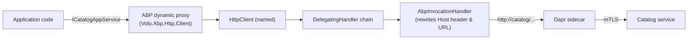

`Volo.Abp.Http.Client.Dapr` is a tiny but pivotal **ABP Framework** module: with two C# files it turns every typed HTTP proxy generated by `Volo.Abp.Http.Client` into a Dapr service-invocation call. Instead of pointing your `RemoteService` configuration at `https://catalog.contoso.com`, you point it at `http://catalog` — the Dapr sidecar resolves `catalog` as an app id and forwards the request to the right pod, container or VM, transparently applying mTLS, retries and observability along the way.

## Source layout

```text
framework/src/Volo.Abp.Http.Client.Dapr/Volo/Abp/Http/Client/Dapr/
├── AbpHttpClientDaprModule.cs
└── AbpInvocationHandler.cs
```

That's the entire package. The heavy lifting lives in the Dapr SDK's `Dapr.Client.InvocationHandler`; ABP just wires it up.

## How it changes outbound HTTP



Without `AbpHttpClientDaprModule` the chain ends at the OS socket and ABP calls the URL you configured. With it, the last handler before the socket rewrites the URL to point at the sidecar and adds the `dapr-app-id` header.

## The module

`AbpHttpClientDaprModule` runs in `PreConfigureServices` so it can mutate the `AbpHttpClientBuilderOptions` *before* `AbpHttpClientModule` builds its named clients:

```csharp
// framework/src/Volo.Abp.Http.Client.Dapr/Volo/Abp/Http/Client/Dapr/AbpHttpClientDaprModule.cs
[DependsOn(
    typeof(AbpHttpClientModule),
    typeof(AbpDaprModule)
)]
public class AbpHttpClientDaprModule : AbpModule
{
    public override void PreConfigureServices(ServiceConfigurationContext context)
    {
        PreConfigure<AbpHttpClientBuilderOptions>(options =>
        {
            options.ProxyClientBuildActions.Add((_, clientBuilder) =>
            {
                clientBuilder.AddHttpMessageHandler<AbpInvocationHandler>();
            });
        });
    }
}
```

Two things to notice:

1. `PreConfigureServices` runs **before** `ConfigureServices` in every module. That guarantees the `ProxyClientBuildActions` callback is registered before `AbpHttpClientModule` enumerates the list and applies each action to every proxy.
2. `clientBuilder.AddHttpMessageHandler<AbpInvocationHandler>()` is the standard `IHttpClientBuilder` extension. Each named proxy client gets its own `AbpInvocationHandler` instance, registered as `ITransientDependency`.

<Note>
`ProxyClientBuildActions` is the same list ABP uses elsewhere — for example, the WebAssembly and MAUI hosts add their own Blazor `DelegatingHandler` through it. Auth tokens, the correlation id and the `__tenant` header are not added by a delegating handler at all: `ClientProxyBase` writes them straight onto the `HttpRequestMessage` *before* it enters the `DelegatingHandler` chain. That means by the time `AbpInvocationHandler` sees the request, the ABP headers are already in place — it only has to rewrite the URL and add `dapr-app-id`.
</Note>

## The handler

`AbpInvocationHandler` is a one-class implementation that derives from the Dapr SDK's `InvocationHandler` and configures the sidecar endpoint from `AbpDaprOptions`:

```csharp
// framework/src/Volo.Abp.Http.Client.Dapr/Volo/Abp/Http/Client/Dapr/AbpInvocationHandler.cs
public class AbpInvocationHandler : InvocationHandler, ITransientDependency
{
    public AbpInvocationHandler(IOptions<AbpDaprOptions> daprOptions)
    {
        if (!daprOptions.Value.HttpEndpoint.IsNullOrWhiteSpace())
        {
            DaprEndpoint = daprOptions.Value.HttpEndpoint!;
        }
    }
}
```

What does `Dapr.Client.InvocationHandler` actually do? It intercepts each `HttpRequestMessage` in the `SendAsync` chain and:

1. Reads the **host** of the request URI (for a proxy URL like `http://catalog/api/products/123`, the host is `catalog`).
2. Replaces the URL's authority with the sidecar's HTTP endpoint (`http://127.0.0.1:3500`).
3. Adds a `dapr-app-id: catalog` HTTP header so the sidecar knows which peer to invoke.
4. Optionally adds the `dapr-api-token` header from the SDK's configuration.
5. Forwards the request down the chain.

The peer's sidecar then de-references the app id (through the configured name resolver — DNS in Kubernetes, mDNS in self-hosted, Consul if configured) and forwards the call over the Dapr app-channel. The peer ABP app — which loaded [AbpAspNetCoreMvcDaprModule](/distributed/aspnetcore-mvc-dapr) — validates the `dapr-api-token` and processes the call as an ordinary MVC request.

<Warning>
`DaprEndpoint` falls back to the SDK's default (`http://127.0.0.1:3500` unless overridden by `DAPR_HTTP_ENDPOINT`) only when `AbpDaprOptions.HttpEndpoint` is null or whitespace. If your sidecar listens on a different port and you forget to configure `Dapr:HttpEndpoint`, invocation calls will hit nothing and time out. Set the option explicitly when in doubt.
</Warning>

## Configuring proxy URLs

ABP's HTTP client module reads named "remote service" configurations and builds typed proxies that target them. The contract is exactly the same when running over Dapr — just point each remote service at `http://<app-id>`:

```json
{
  "RemoteServices": {
    "Default": {
      "BaseUrl": "http://default-app/"
    },
    "Catalog": {
      "BaseUrl": "http://catalog/"
    },
    "Identity": {
      "BaseUrl": "http://identity-service/"
    }
  },
  "Dapr": {
    "HttpEndpoint": "http://127.0.0.1:3500"
  }
}
```

No ports, no DNS, no TLS certificate ceremony. The host part of each URL is treated as a Dapr app id; the path is preserved as-is.

## Combining with `AbpDaprClientFactory`

`AbpHttpClientDaprModule` is the path for **typed proxies** generated by `AddHttpClientProxies`. If you want to invoke a peer service ad-hoc without a proxy, use `IAbpDaprClientFactory.CreateHttpClientAsync` (covered in detail on [/distributed/dapr-integration](/distributed/dapr-integration)). Both paths route through the same sidecar; pick based on whether you have a generated contract.

<Tabs>
  <Tab title="Typed proxy">
    ```csharp
    [DependsOn(
        typeof(AbpHttpClientDaprModule),
        typeof(CatalogApplicationContractsModule)  // has ICatalogAppService
    )]
    public class OrdersHostModule : AbpModule
    {
        public override void ConfigureServices(ServiceConfigurationContext context)
        {
            context.Services.AddHttpClientProxies(
                typeof(CatalogApplicationContractsModule).Assembly,
                remoteServiceConfigurationName: "Catalog"
            );
        }
    }

    // anywhere in the host
    public class CheckoutAppService : ApplicationService
    {
        private readonly ICatalogAppService _catalog;
        public CheckoutAppService(ICatalogAppService catalog) => _catalog = catalog;

        public async Task<ProductDto> GetAsync(Guid productId)
            => await _catalog.GetAsync(productId);  // → http://catalog/api/products/{id} → sidecar
    }
    ```
  </Tab>
  <Tab title="Ad-hoc HttpClient">
    ```csharp
    public class CatalogClient : ITransientDependency
    {
        private readonly IAbpDaprClientFactory _factory;
        public CatalogClient(IAbpDaprClientFactory factory) => _factory = factory;

        public async Task<Stream> StreamCatalogCsvAsync(CancellationToken ct)
        {
            using var http = await _factory.CreateHttpClientAsync(appId: "catalog");
            return await http.GetStreamAsync("/api/exports/catalog.csv", ct);
        }
    }
    ```
  </Tab>
</Tabs>

## How the message chain composes

ABP's HTTP proxy infrastructure assembles a chain like this for each named client (simplified):

```text
ClientProxyBase.AddHeaders(requestMessage)        ← writes auth, correlation, __tenant, culture
        │
        ▼
HttpClient.SendAsync(requestMessage)
└── DelegatingHandler chain
    ├── (your custom handlers, in registration order)
    ├── AbpInvocationHandler               ← added by AbpHttpClientDaprModule
    └── HttpClientHandler                  (the socket)
```

By the time the request enters the handler chain, `ClientProxyBase` has already stamped:

- A bearer token from `IRemoteServiceHttpClientAuthenticator` (when one is configured).
- The ABP correlation id header (`AbpCorrelationIdOptions.HttpHeaderName`).
- The tenant header (`TenantResolverConsts.DefaultTenantKey`).
- The accept-language header.

`AbpInvocationHandler` then rewrites the URL and adds `dapr-app-id`. The result is a request that the receiving ABP service can authenticate, scope to the correct tenant, and log under the original correlation id — exactly as if it had been called directly.

<Note>
If you add custom delegating handlers via `IHttpClientBuilder.AddHttpMessageHandler(...)` after `AbpHttpClientDaprModule` has loaded, they execute *before* `AbpInvocationHandler` because of the registration order. That's usually what you want — logging and metrics see the logical URL (`http://catalog/...`) rather than the rewritten sidecar URL.
</Note>

## Running it

In Kubernetes the standard pattern is to annotate each pod with `dapr.io/enabled: "true"`, `dapr.io/app-id: orders`, `dapr.io/app-port: "80"` and let the operator inject the sidecar. Locally, `dapr run` works the same way:

<Steps>
  <Step title="Start the peer">
    ```bash
    dapr run \
      --app-id catalog \
      --app-port 5001 \
      --dapr-http-port 3501 \
      -- dotnet run --project Catalog.HttpApi.Host
    ```
  </Step>
  <Step title="Start the caller">
    ```bash
    dapr run \
      --app-id orders \
      --app-port 5002 \
      --dapr-http-port 3500 \
      -- dotnet run --project Orders.HttpApi.Host
    ```
  </Step>
  <Step title="Configure base URLs">
    Make sure `Orders` has `RemoteServices:Catalog:BaseUrl = http://catalog/` and `Dapr:HttpEndpoint = http://127.0.0.1:3500`.
  </Step>
  <Step title="Invoke">
    Any call into `ICatalogAppService` from the Orders host goes through the local sidecar (port 3500), hops to Catalog's sidecar (port 3501), then to the Catalog app (port 5001).
  </Step>
</Steps>

## Verifying it works

Two quick checks:

1. Register a thin custom `DelegatingHandler` via `ProxyClientBuildActions` (or your own `IHttpClientBuilder.AddHttpMessageHandler(...)`) and log `request.RequestUri` from it. The logical URL should still be `http://catalog/api/...`, proving the rewrite happens downstream inside `AbpInvocationHandler`.
2. Watch the sidecar logs: a successful invoke logs `method=...` and `target=...` lines including the app id.

If you see `connection refused` to `127.0.0.1:3500`, the sidecar is not running or `AbpDaprOptions.HttpEndpoint` is wrong. If you see `404 Not Found` from the sidecar, the app id is misspelled or the peer is not registered.

## What about gRPC?

`AbpHttpClientDaprModule` only sets up the HTTP path because ABP's HTTP client proxies are HTTP/1.1 + JSON. If you need gRPC invocation, use the Dapr SDK directly via `IAbpDaprClientFactory.CreateAsync()` and call `dapr.InvokeMethodGrpcAsync(...)`. The token, endpoint and serializer wiring are reused.

## Operational concerns

<Accordion title="Should I disable ABP's own HTTPS handler?">
No — `AbpInvocationHandler` rewrites the URL to `http://127.0.0.1:3500` regardless of the original scheme. Even if your `RemoteServices:Catalog:BaseUrl` says `https://catalog`, the call to the sidecar is plain HTTP on loopback, which is the recommended pattern. mTLS happens *between* sidecars.
</Accordion>

<Accordion title="Can I bypass Dapr for a single proxy?">
Yes — `AbpHttpClientBuilderOptions.ProxyClientBuildActions` is applied to every proxy by default. If you need an exception (e.g. a call to a third-party API), register that one client manually via `services.AddHttpClient("Stripe", ...)` and inject the named client. Only the auto-generated ABP proxies route through `AbpInvocationHandler`.
</Accordion>

<Accordion title="How does this interact with multi-tenancy?">
`AbpDaprClientFactory.AddHeaders` adds the `__tenant` header on ad-hoc HTTP clients. For typed proxies, `ClientProxyBase` already writes tenant, correlation and auth headers onto each `HttpRequestMessage` before it enters the handler chain, so nothing extra is required when running over Dapr — `AbpInvocationHandler` rewrites the URL after the tenant header is set.
</Accordion>

## A realistic example

```csharp
[DependsOn(
    typeof(AbpHttpClientModule),
    typeof(AbpHttpClientDaprModule),
    typeof(CatalogApplicationContractsModule),
    typeof(IdentityHttpApiClientModule)
)]
public class OrdersWorkerHostModule : AbpModule
{
    public override void ConfigureServices(ServiceConfigurationContext context)
    {
        context.Services.AddHttpClientProxies(
            typeof(CatalogApplicationContractsModule).Assembly,
            remoteServiceConfigurationName: "Catalog"
        );
    }
}
```

```jsonc
{
  "RemoteServices": {
    "Default":  { "BaseUrl": "http://default-app/" },
    "Catalog":  { "BaseUrl": "http://catalog/" },
    "AbpIdentity": { "BaseUrl": "http://identity/" }
  },
  "Dapr": {
    "HttpEndpoint": "http://127.0.0.1:3500"
  }
}
```

One module reference, one configuration block — every typed proxy now invokes peers by Dapr app id with ABP auth and headers preserved.

## Related

<CardGroup cols={2}>
  <Card title="Dapr Integration" icon="cube" href="/distributed/dapr-integration">
    `AbpDaprModule`, `AbpDaprClientFactory` and token providers — the foundation this package sits on.
  </Card>
  <Card title="MVC Sidecar Endpoints" icon="server" href="/distributed/aspnetcore-mvc-dapr">
    The inbound counterpart on the peer — validates the `dapr-api-token` header.
  </Card>
  <Card title="HTTP Request Pipeline" icon="route" href="/flows/http-request-pipeline">
    Where `AbpInvocationHandler` slots into ABP's full proxy handler chain.
  </Card>
  <Card title="Distributed Locking" icon="lock" href="/distributed/distributed-locking">
    Use locks to serialize cross-service operations triggered by Dapr invocation.
  </Card>
</CardGroup>
