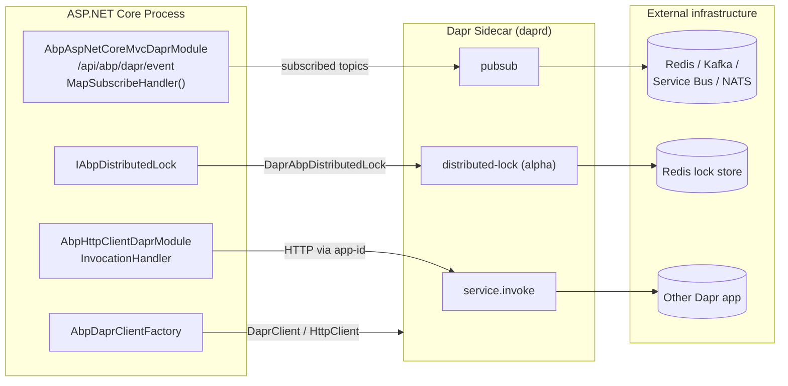

The **ABP Framework** ships a small family of packages that turn a single ASP.NET Core service into a citizen of a distributed system. The integrations split cleanly into two axes: **Dapr** — a sidecar that abstracts service invocation, pub/sub, state and locks behind a local HTTP/gRPC endpoint — and **distributed locking** — an `IAbpDistributedLock` abstraction with a Medallion-backed default and a Dapr-backed alternative. This overview ties the pieces together so you can pick the right module for the right hop.

Everything on this page is implemented under `framework/src/`. The packages are intentionally thin: each one wires up a contract from the abstractions module, then defers to a provider — `Dapr.Client.DaprClient`, the Medallion locking library, or a fallback in-process locker.

## The big picture



The pattern is consistent: ABP never talks to brokers, lock stores or peer services directly. It always talks to the **local sidecar** over `http://127.0.0.1:3500` (or whatever `AbpDaprOptions.HttpEndpoint` is set to) and lets `daprd` deal with retries, mTLS, observability and the actual transport.

## Module map

<CardGroup cols={2}>
  <Card title="Distributed Locking" icon="lock" href="/distributed/distributed-locking">
    `IAbpDistributedLock`, `LocalAbpDistributedLock` and the Medallion-backed default in `framework/src/Volo.Abp.DistributedLocking` and its abstractions package.
  </Card>
  <Card title="Dapr Core Integration" icon="cube" href="/distributed/dapr-integration">
    `AbpDaprModule`, `AbpDaprClientFactory`, `AbpDaprOptions` and the API-token providers in `framework/src/Volo.Abp.Dapr`.
  </Card>
  <Card title="HTTP Client over Dapr" icon="arrow-right-arrow-left" href="/distributed/http-client-dapr">
    `AbpHttpClientDaprModule` and `AbpInvocationHandler` route ABP's typed proxies through Dapr service invocation by app-id.
  </Card>
  <Card title="MVC Sidecar Endpoints" icon="server" href="/distributed/aspnetcore-mvc-dapr">
    `AbpAspNetCoreMvcDaprModule` and the `DaprAppApiTokenValidator` plug an ASP.NET Core app into the sidecar's app-channel.
  </Card>
</CardGroup>

## What each package is for

`Volo.Abp.DistributedLocking.Abstractions` defines the contract every other locking package implements:

```csharp
// framework/src/Volo.Abp.DistributedLocking.Abstractions/Volo/Abp/DistributedLocking/IAbpDistributedLock.cs
public interface IAbpDistributedLock
{
    Task<IAbpDistributedLockHandle?> TryAcquireAsync(
        [NotNull] string name,
        TimeSpan timeout = default,
        CancellationToken cancellationToken = default
    );
}
```

The abstractions module also ships `LocalAbpDistributedLock` — a singleton that uses `AsyncKeyedLocker<string>` for in-process coordination. That's the fallback when no real distributed lock provider is registered, and it's what you get during unit tests.

`Volo.Abp.DistributedLocking` adds the **default** distributed implementation: `MedallionAbpDistributedLock`, which delegates to whatever `IDistributedLockProvider` you register via Medallion's Redis, SqlServer, Postgres or ZooKeeper packages. It replaces the abstractions-module fallback through `[Dependency(ReplaceServices = true)]`.

`Volo.Abp.DistributedLocking.Dapr` provides a **third** alternative: `DaprAbpDistributedLock` calls `DaprClient.Lock(storeName, name, owner, expiry, ct)` against the sidecar's alpha distributed-lock API. It's covered briefly here and in detail on the locking page.

`Volo.Abp.Dapr` wires Dapr itself: `AbpDaprModule` binds the `Dapr` configuration section into `AbpDaprOptions`, falls back to `DAPR_API_TOKEN` / `APP_API_TOKEN` environment variables, and registers `AbpDaprClientFactory` to build `DaprClient` and `HttpClient` instances pre-configured with endpoints, tokens, correlation id and tenant headers.

`Volo.Abp.Http.Client.Dapr` adds `AbpInvocationHandler : Dapr.Client.InvocationHandler` to the message-handler chain of every ABP HTTP client proxy. The handler rewrites outbound URLs from `http://{appid}/...` to the sidecar, so static client proxies generated by `AbpHttpClientModule` invoke peer services by Dapr app-id without code changes.

`Volo.Abp.AspNetCore.Mvc.Dapr` is the **inbound** half. It depends on `AbpAspNetCoreMvcModule` and `AbpDaprModule` and registers `DaprAppApiTokenValidator`, which enforces the `dapr-api-token` header the sidecar adds to every app-channel request. The companion `Volo.Abp.AspNetCore.Mvc.Dapr.EventBus` package builds on it to map `/api/abp/dapr/event` and call `endpoints.MapSubscribeHandler()`.

## Package layout

```text
framework/src/
├── Volo.Abp.DistributedLocking.Abstractions/
│   └── Volo/Abp/DistributedLocking/
│       ├── AbpDistributedLockOptions.cs
│       ├── DistributedLockKeyNormalizer.cs
│       ├── IAbpDistributedLock.cs
│       ├── IAbpDistributedLockHandle.cs
│       ├── IDistributedLockKeyNormalizer.cs
│       ├── LocalAbpDistributedLock.cs
│       └── LocalAbpDistributedLockHandle.cs
├── Volo.Abp.DistributedLocking/
│   └── Volo/Abp/DistributedLocking/
│       ├── AbpDistributedLockHandleExtensions.cs
│       ├── AbpDistributedLockingModule.cs
│       ├── MedallionAbpDistributedLock.cs
│       └── MedallionAbpDistributedLockHandle.cs
├── Volo.Abp.DistributedLocking.Dapr/
├── Volo.Abp.Dapr/
│   └── Volo/Abp/Dapr/
│       ├── AbpDaprClientFactory.cs
│       ├── AbpDaprModule.cs
│       ├── AbpDaprOptions.cs
│       ├── DaprApiTokenProvider.cs
│       ├── IAbpDaprClientFactory.cs
│       ├── IDaprApiTokenProvider.cs
│       ├── IDaprSerializer.cs
│       └── Utf8JsonDaprSerializer.cs
├── Volo.Abp.Http.Client.Dapr/
│   └── Volo/Abp/Http/Client/Dapr/
│       ├── AbpHttpClientDaprModule.cs
│       └── AbpInvocationHandler.cs
└── Volo.Abp.AspNetCore.Mvc.Dapr/
    └── Volo/Abp/AspNetCore/Mvc/Dapr/
        ├── AbpAspNetCoreMvcDaprModule.cs
        ├── DaprAppApiTokenValidator.cs
        ├── DaprHttpContextExtensions.cs
        └── IDaprAppApiTokenValidator.cs
```

## Picking a combination

<Tabs>
  <Tab title="In-process only">
    Reference no packages from this section. The default `IAbpDistributedLock` resolves to `LocalAbpDistributedLock` from `Volo.Abp.DistributedLocking.Abstractions`. Use this for unit tests, console samples, or when there is only one process by design.
  </Tab>
  <Tab title="Cluster, no Dapr">
    Add `Volo.Abp.DistributedLocking` plus a Medallion provider (`DistributedLock.Redis`, `DistributedLock.SqlServer`, …). `MedallionAbpDistributedLock` replaces the local fallback; locks become cluster-wide without introducing a sidecar.
  </Tab>
  <Tab title="Dapr microservices">
    Add `Volo.Abp.Dapr` and at least one of the consumer packages: `Volo.Abp.Http.Client.Dapr` for outbound calls, `Volo.Abp.AspNetCore.Mvc.Dapr` (and `.EventBus`) for the inbound app-channel, and `Volo.Abp.DistributedLocking.Dapr` if you also want locks via the sidecar.
  </Tab>
</Tabs>

<Note>
You can mix locking providers per service. A worker that holds a long-running schedule lock may use the Dapr lock store, while a data-API service uses Redis directly through Medallion — both implement the same `IAbpDistributedLock`, so callers don't care.
</Note>

## A minimal cross-package example

The pieces below appear on their own pages. This snippet shows how they line up in a typical microservice module:

```csharp
[DependsOn(
    typeof(AbpAspNetCoreMvcDaprModule),          // /distributed/aspnetcore-mvc-dapr
    typeof(AbpHttpClientDaprModule),             // /distributed/http-client-dapr
    typeof(AbpDistributedLockingModule)          // /distributed/distributed-locking
)]
public class OrdersServiceModule : AbpModule
{
    public override void ConfigureServices(ServiceConfigurationContext context)
    {
        Configure<AbpDaprOptions>(options =>
        {
            options.HttpEndpoint = "http://127.0.0.1:3500";
            options.AppApiToken  = "dev-app-token";
        });

        Configure<AbpDistributedLockOptions>(options =>
        {
            options.KeyPrefix = "orders:";
        });

        // Medallion: any IDistributedLockProvider registration works.
        context.Services.AddSingleton<IDistributedLockProvider>(
            sp => new RedisDistributedSynchronizationProvider(
                ConnectionMultiplexer.Connect("redis:6379").GetDatabase()
            )
        );
    }
}
```

That single module gives the service:

- An `IAbpDistributedLock` that locks across the cluster via Redis (Medallion).
- An `AbpDaprClientFactory` plus an `AbpInvocationHandler` on every HTTP proxy, so calls to `IOtherService` go through the sidecar.
- A `DaprAppApiTokenValidator` that rejects inbound app-channel requests missing the configured token.

## How it relates to the event bus and HTTP pipeline

Distributed locking and Dapr integration are deliberately orthogonal to the rest of ABP. The same `IAbpDistributedLock` you'll use in domain services is also used internally by ABP's distributed event-bus inbox/outbox to guarantee single-handler delivery. And ABP's HTTP client proxies — described in [/flows/http-request-pipeline](/flows/http-request-pipeline) — route through `AbpInvocationHandler` whenever `AbpHttpClientDaprModule` is loaded.

If your scenario is event-driven rather than request/response, jump straight to the [Dapr event bus](/eventbus/dapr-event-bus). It builds on the same `AbpDaprModule` and the same `/api/abp/dapr/event` endpoint described here under [MVC sidecar endpoints](/distributed/aspnetcore-mvc-dapr).

## What's on each page

<CardGroup cols={2}>
  <Card title="Distributed Locking" icon="lock" href="/distributed/distributed-locking">
    Full walkthrough of `IAbpDistributedLock`, `LocalAbpDistributedLock`, `MedallionAbpDistributedLock`, key normalization and handle disposal patterns.
  </Card>
  <Card title="Dapr Integration" icon="cube" href="/distributed/dapr-integration">
    How `AbpDaprModule` binds configuration, how `AbpDaprClientFactory` builds `DaprClient` and `HttpClient`, plus correlation, tenant and culture headers.
  </Card>
  <Card title="HTTP Client over Dapr" icon="arrow-right-arrow-left" href="/distributed/http-client-dapr">
    `AbpInvocationHandler` derived from `Dapr.Client.InvocationHandler` and how `PreConfigureServices` plugs it into every proxy `HttpClient`.
  </Card>
  <Card title="MVC Sidecar Endpoints" icon="server" href="/distributed/aspnetcore-mvc-dapr">
    The app-channel surface: `DaprAppApiTokenValidator`, `dapr-api-token` enforcement and `AbpAspNetCoreMvcDaprEventBusModule`'s `MapSubscribeHandler`.
  </Card>
</CardGroup>

<Warning>
The Dapr distributed-lock API is marked alpha by Dapr itself; that's why `DaprAbpDistributedLock.cs` suppresses `DAPR_DISTRIBUTEDLOCK`. Wrap it behind feature flags if you ship to production and prefer the Medallion path until the API graduates.
</Warning>

## Module dependency graph

The five packages on the navigation form a small DAG. Reading it top-to-bottom shows what gets pulled in when you reference a single root:

```text
AbpDistributedLockingAbstractionsModule
└── (provides IAbpDistributedLock, LocalAbpDistributedLock fallback)
    │
    ├── AbpDistributedLockingModule
    │   └── MedallionAbpDistributedLock  (replaces local fallback)
    │
    └── AbpDistributedLockingDaprModule
        ├── AbpDaprModule
        └── DaprAbpDistributedLock        (replaces local fallback)

AbpDaprModule
└── (provides AbpDaprClientFactory, AbpDaprOptions, IDaprApiTokenProvider)
    │
    ├── AbpHttpClientDaprModule
    │   └── AbpInvocationHandler injected into every typed proxy
    │
    └── AbpAspNetCoreMvcDaprModule
        ├── DaprAppApiTokenValidator
        └── AbpAspNetCoreMvcDaprEventBusModule
            ├── /api/abp/dapr/event endpoint
            └── MapSubscribeHandler()
```

The arrows in the [big-picture mermaid diagram](#the-big-picture) follow exactly these dependency edges: anything reachable from `AbpDaprModule` shares the same options, token provider and client factory.

## Conventions to remember

A handful of conventions show up on every page in this section. Keep them in mind:

- **`IAbpDistributedLock` is null-friendly.** A null handle means "failed to acquire". Always check it before doing work.
- **Handles are `IAsyncDisposable`.** Use `await using` to release them. Never store a handle in a field.
- **`AbpDaprOptions.HttpEndpoint`** is read by every Dapr package — `AbpDaprClientFactory`, `AbpInvocationHandler`, and (via the SDK) `DaprClient.CreateInvokeHttpClient`. Configure it once.
- **`AbpDaprOptions.AppApiToken`** is the token your *app* expects on the inbound `dapr-api-token` header. `DaprApiToken` is the one your *app* sends *to* the sidecar. They are different secrets and rotate independently.
- **`__tenant`, correlation id and `Accept-Language`** are added to every Dapr-routed HTTP request automatically. The receiving ABP service does not need any custom code to participate in tenant context.
- **Locking key prefixes** are namespaced via `AbpDistributedLockOptions.KeyPrefix`. Use a per-service prefix when sharing a Redis/SQL lock store.

With those in mind, the package-specific pages should read like ordinary ABP modules — same dependency injection conventions, same options pattern, same modular boundaries — only with a sidecar at the other end.

## Where to next

If you came here looking for **outbound** integration, start at [HTTP client over Dapr](/distributed/http-client-dapr). If you are building a service that **receives** sidecar callbacks (service invocation, pub/sub deliveries), jump to [MVC sidecar endpoints](/distributed/aspnetcore-mvc-dapr). If you are wiring **event-driven** flows, the [Dapr event bus](/eventbus/dapr-event-bus) is the natural follow-up — it depends on every package described here. And if you only need cluster-wide mutual exclusion without Dapr, [distributed locking](/distributed/distributed-locking) is a standalone read.

## FAQ

<Accordion title="Do I need a Dapr sidecar to use distributed locks?">
No. `Volo.Abp.DistributedLocking.Abstractions` defines the contract and `Volo.Abp.DistributedLocking` ships a Medallion-backed default. The Dapr lock provider is an *additional* option for shops that already deploy a sidecar — it is not a prerequisite.
</Accordion>

<Accordion title="Can I run ABP's HTTP proxies through Dapr without Dapr's pub/sub?">
Yes. Reference `Volo.Abp.Http.Client.Dapr` and configure base URLs as `http://<app-id>/`. You don't need `Volo.Abp.AspNetCore.Mvc.Dapr.EventBus` or `Volo.Abp.EventBus.Dapr` unless you want pub/sub.
</Accordion>

<Accordion title="What about gRPC service invocation?">
ABP's HTTP client proxies are HTTP/1.1 + JSON, so `AbpHttpClientDaprModule` only wires that path. For gRPC invocation use `IAbpDaprClientFactory.CreateAsync()` and call `DaprClient.InvokeMethodGrpcAsync(...)` directly.
</Accordion>

<Accordion title="How does observability work end-to-end?">
`AbpDaprClientFactory.AddHeaders` propagates the ABP correlation id on every outbound request, and the receiving ABP application logs it on every inbound request. Combined with Dapr's W3C trace-context propagation between sidecars, you get a coherent trace across services without writing any plumbing.
</Accordion>

<Accordion title="Is multi-tenancy preserved across Dapr hops?">
Yes. The factory adds the `__tenant` header (the constant comes from `TenantResolverConsts.DefaultTenantKey`) whenever `ICurrentTenant.Id` has a value. The peer's tenant resolver picks it up like any other inbound request. No additional configuration is required for typed proxies — `AbpHttpClientProxyMessageHandler` already sets the header before `AbpInvocationHandler` runs.
</Accordion>

<Accordion title="What is the minimum runtime requirement?">
The Dapr packages target the same .NET versions as the rest of the ABP framework and reference the official `Dapr.Client` and `Dapr.AspNetCore` NuGet packages. The sidecar (`daprd`) is the runtime requirement on the cluster side; on the application side you only need the standard ABP host packages.
</Accordion>

## Sample appsettings.json

The same configuration shape covers every package in this section:

```json
{
  "Dapr": {
    "HttpEndpoint": "http://127.0.0.1:3500",
    "GrpcEndpoint": "http://127.0.0.1:50001",
    "DaprApiToken": "${DAPR_API_TOKEN}",
    "AppApiToken":  "${APP_API_TOKEN}"
  },
  "AbpDaprEventBus": {
    "PubSubName": "abp-pubsub"
  },
  "AbpDistributedLockDapr": {
    "StoreName": "redislock",
    "DefaultExpirationTimeout": "00:02:00"
  },
  "RemoteServices": {
    "Default":  { "BaseUrl": "http://default-app/" },
    "Catalog":  { "BaseUrl": "http://catalog/"     }
  }
}
```

Set `DAPR_API_TOKEN` and `APP_API_TOKEN` as environment variables (the `dapr run` CLI does this automatically for `--dapr-api-token` and `--app-api-token`). Everything else is bound through the standard ASP.NET Core configuration providers.
